primeira aula .

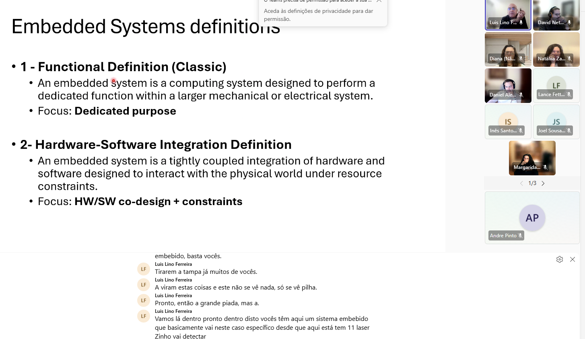

 An embedded system is a computing system designed to perform a dedicated function within a larger mechanical or electrical system.

Duty cicle
sensore sao elementos que nos permite saber o estado ado ambiente. por exemplo temperatura.

radares , sensores quimicos para oph da gua.

sensores so npara simplesmente sabber se premimos um botao.

Temos tambem acelarometros. saber se acelera se vira etc...

O sistema embebido e um sitema que esta emnbibdo num sitema maior, e apenas uma parte de um sistema Maior.

Leitores de energia e da agua sao na realklidade autonomos, oio sitema vai comunicar ele proprio por si , ao operadores das redes. Conseguem ter uma visao muitop gradne de toda rede.

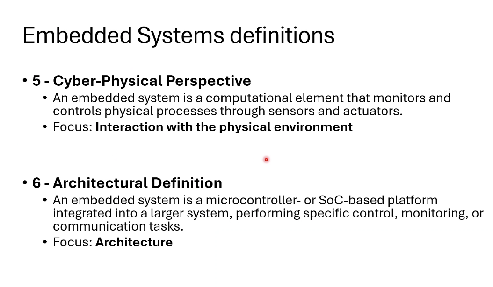

Embedded sytem - e um sistema robusto.

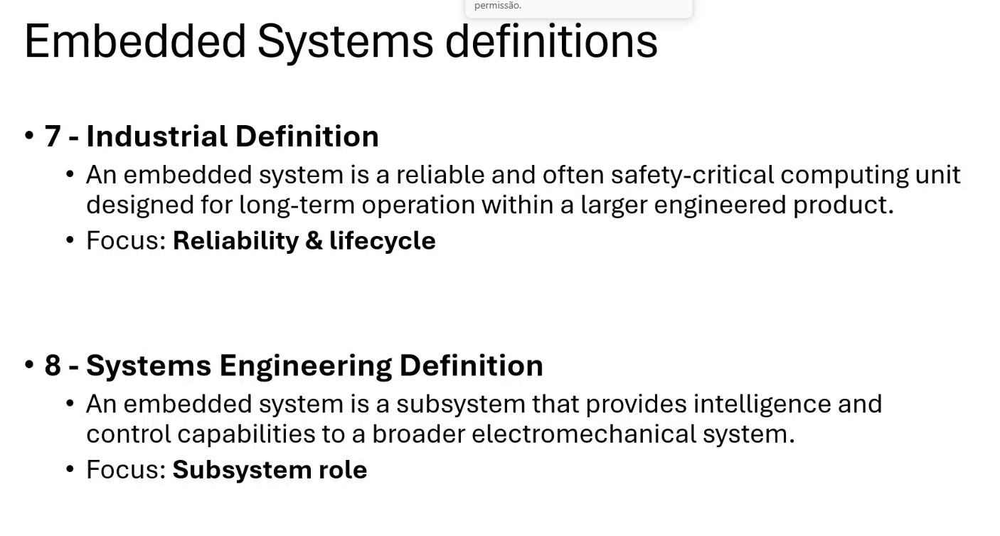

sistemas embebidos costumam durar 20 anos .

sistema embebido e um subsistema que da intelegencia e controlo no fundo e um subsistema dentro de outro sistema.

temos uma definicao mais moderna.

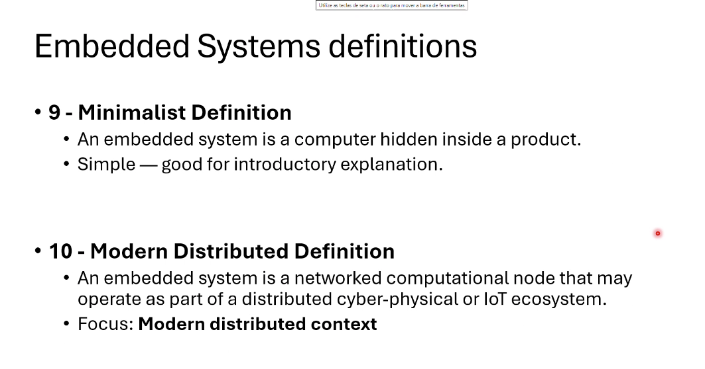

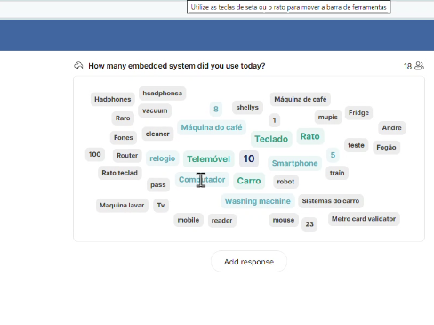

o pc tem muitos sistemas embebidos. O carro tem muitos sistemas embebidos. Maquinas de cafe tem ligacoes bluetooh. o validor do metro.

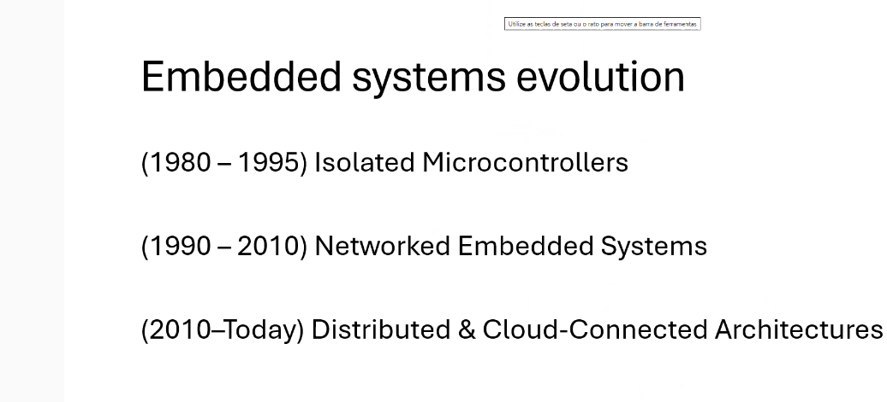

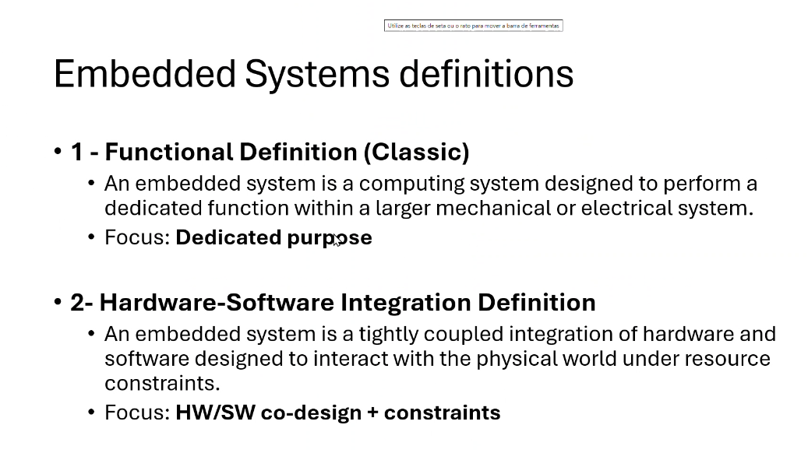

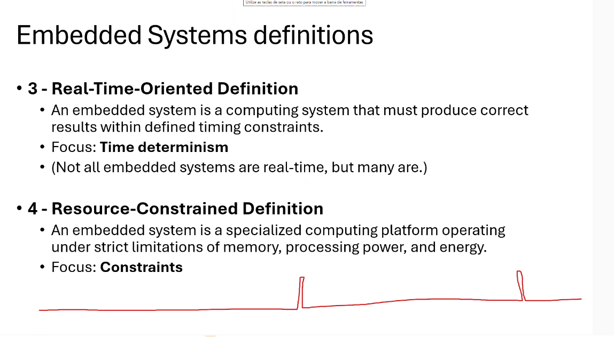

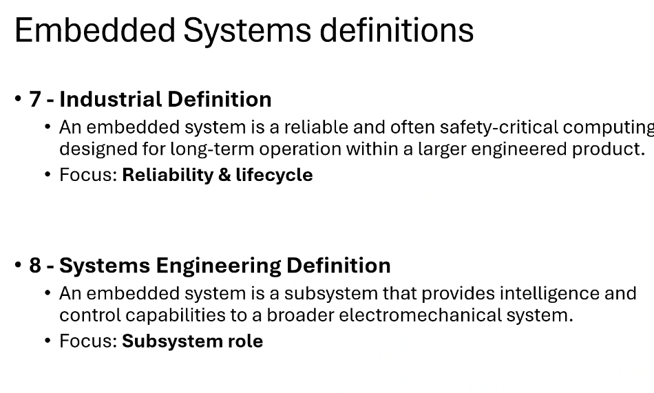

o tempo deve ser deterministico.
as resources constraints, temos pouca memoria , processing power e ppode ser energia.

a sua integracao num sistema maior atraves de sistema de comunicacoes.

Tem processadore a injeccao ao milisegundo as valvulas do motor sao abertas etc.....

Temos outros sistemas para ligar e desligar a luz para abrir e fechar a mala.

HIstoria

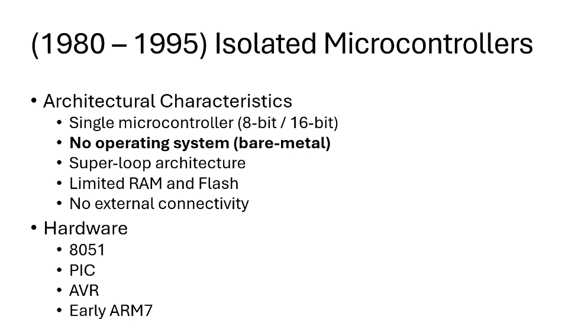

anitgamente nem havia sistema operativo ate 1995

camos usar arduinos.

programamos em cima do hardware sem haver proteccao para a memoria.

C e assembly sao as linguagens usadas para os microcontrolado .

super loop arquitetura.
memoria ram bastante limitada.

Flash e um tipoo de memoria que e parecida a memoria RAM.

Quando desligo uim pc RAM vai a baixo. TUdo que esta na flash fica la .

Hardware,
PIC comunicacao em modo de serie. so usavam duas ou tres linhas. tinham um poder computacioionalk miseravel

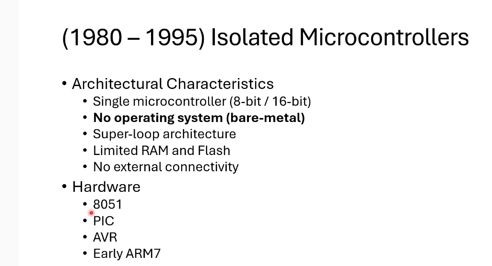

telemoveis usam ARM arduinos.

8051

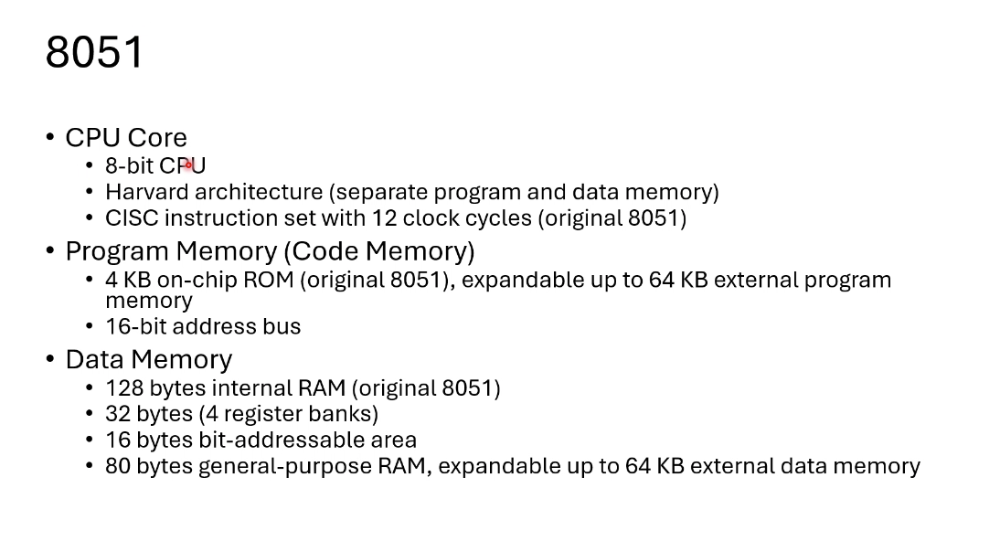

Harvard architecture (sepparate program and data memory)

Program memory onde temos a ROM (original 8051), expandable up to 64 KB external program memory

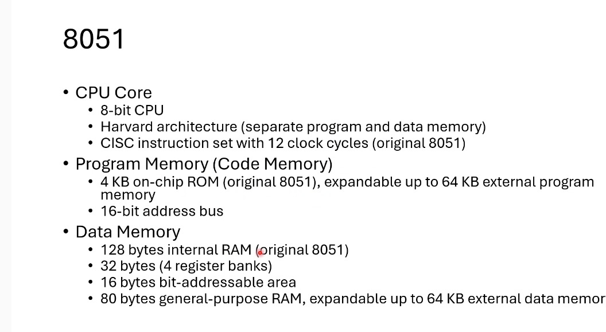

Data Memory
	128 byters internal RAM (original 8051)
	32 bytes (4 register banks)

relogio e oscilador.

microcontrolador

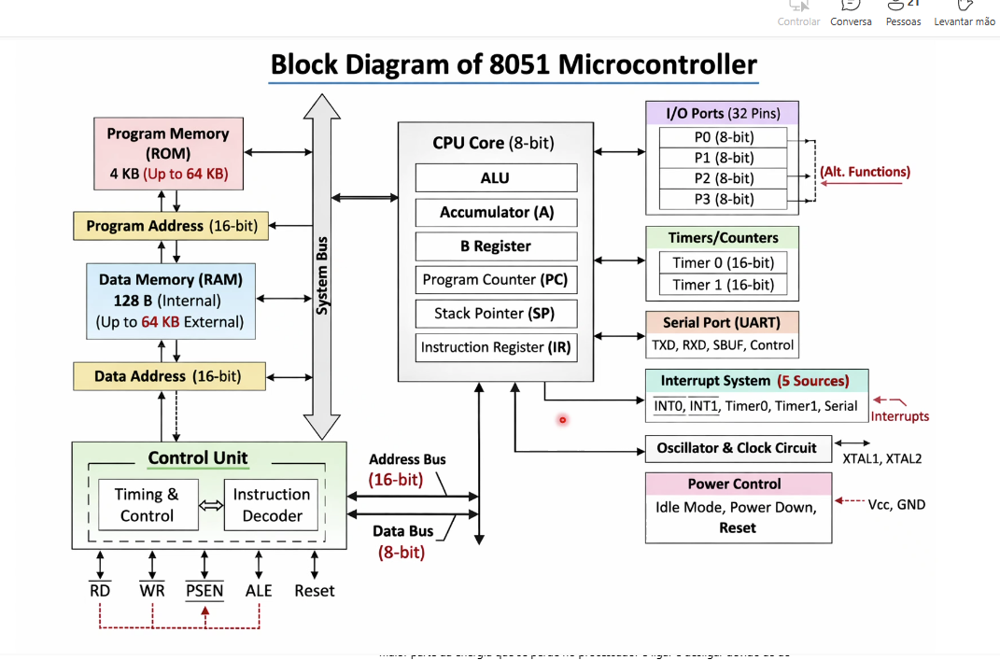

so faz somas provavelmente.

alguns registos

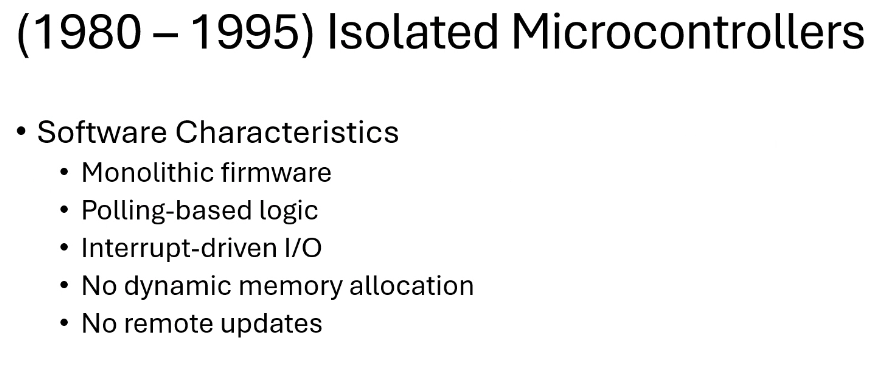

monotliticos firmaware. escrito de uma vez.

o que  vou fazer com os dados do sensor. 8bits 1 byte.

super loop architeture -

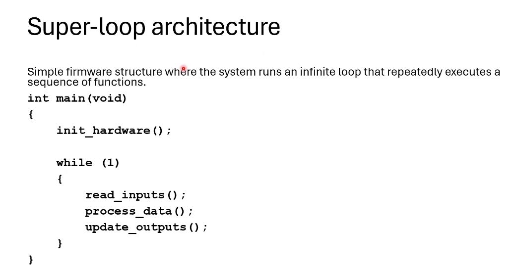

nao ha objetos , ha o main e o nosso

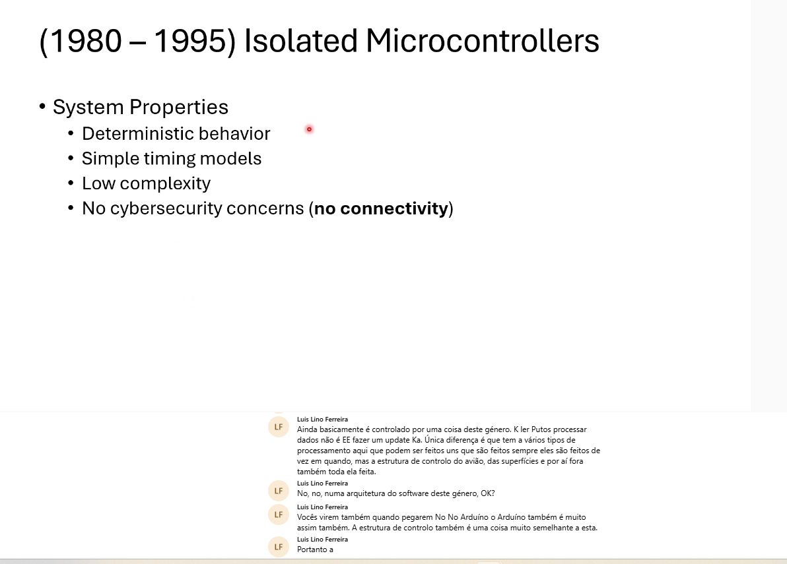

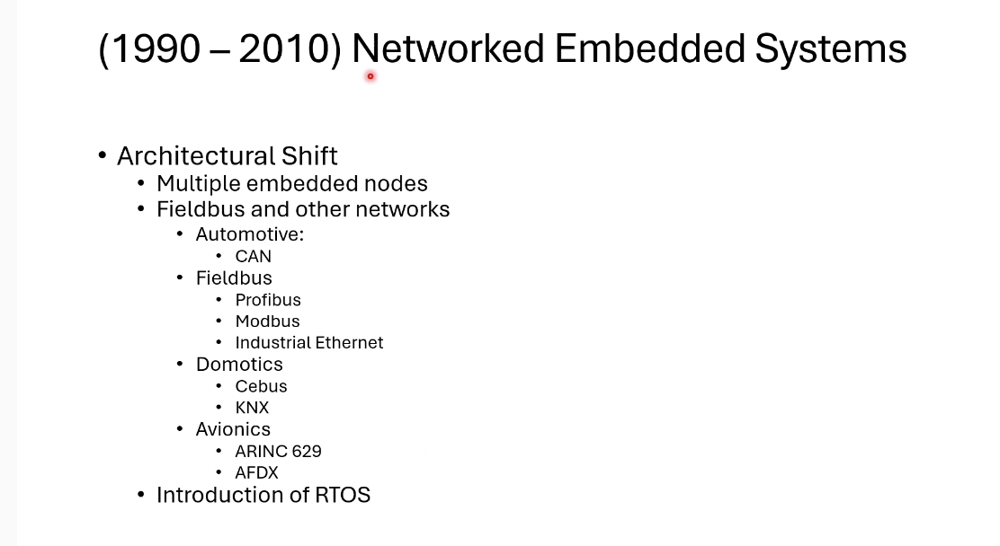

rtos real time operating system>

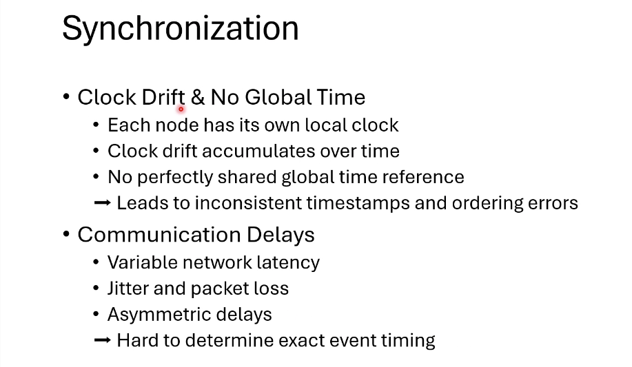

jitter - tempo de resposta da propria rede, perda de pacotes pode ser significativa .

IOTs ha perda de pacotes, ha atrasos asimetricos.

sustema operativo ajuda nas racen conditions.
deadlocks - inversao de prioridades.

algoriutmos de consenso esse valor vai estar em todos os nos.
Canis de comunicacao redundantes.

