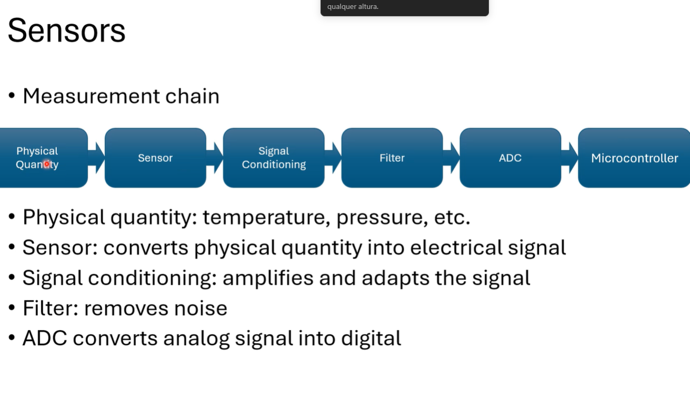

sao baratos os sensores. pode ser um a coisa tao simples como aumentara uma resistencia. Existe um condicionamento do sinal, filtro e depois passar a sinal analogico...

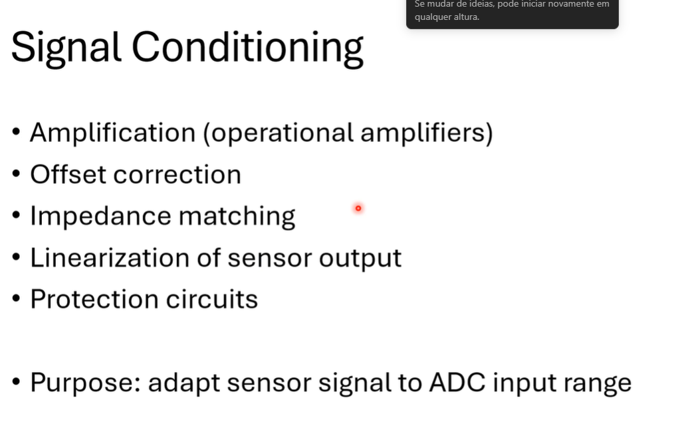

precisamos de corrigir 
    - offset - corrigir o sinal onde sera o valor mais correto.
    - lineriazicacao do proprio sinal , ha determinados sinais 
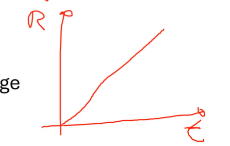

mas sas vezes o sinal e assim

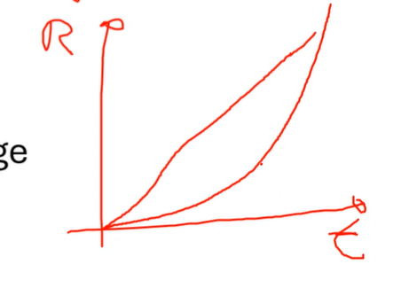

     - protecao de circuitos as vezes necessario. 

filtragem de sinal 

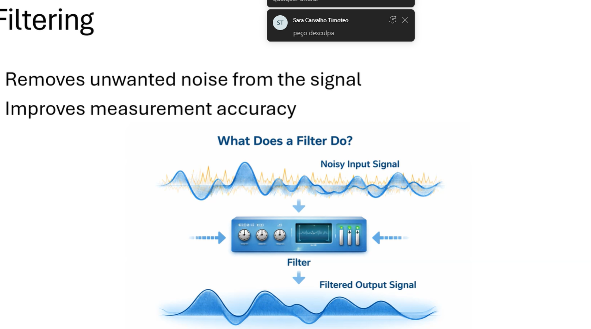

normalmente existe um filtro que tira componentes indesejadas de forma a retirar ruidos indesejados.

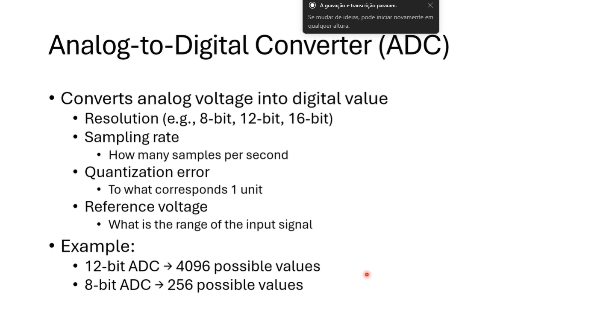

ele vai me converter dependendo da sua resulucao eg 8 buts - 256 , 12 -1024 

Sampling rate e importante. Isto em termos de funcionamento implica , fazer a conversao para um sinal digital.

- Erro de quantitizacao. 0-5 5 / 256 

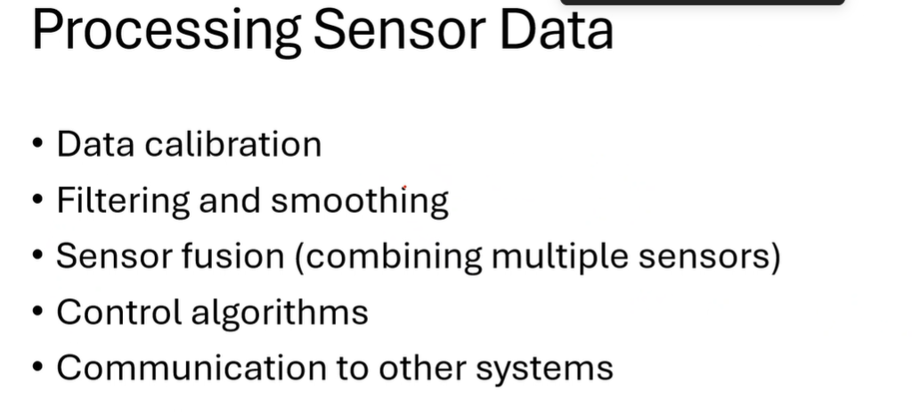

Forma de filtragem do sinal ,

sensor fusion, combinamos a info de fdiferente sensores. podemos imaginar com os acelarometros, e com o magnetometro. Conseguimos saber uma coisa muito complexa como saber onde nos estamos. a bussola diz nos para onde esta virado o objecto que se esta a mover mais giroscopio mais formulas matematica bastante complexas , conseguimos determinar onde nos estamos. Exempplo agora da guerra USA e IRAO. quando noa teem GPS. quando ha jamming de gps.

algoritmos de controlo, algoritmos PID sao os mais classicos algoritmos de controlo, controlar a temperatura. como ver valores de referencia ou suba muito depressa. 

comunicacao com outros sistemas. Mauqinas de barbear com o sistema central, sabendo muita coisa ligado as maquinas, WOW. 

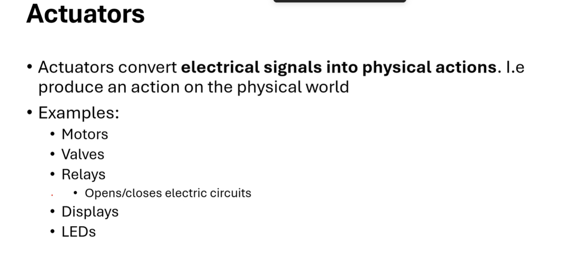

actuadores,

    valvulas, 
Relatys, circuitos para abrir e fechar circuitos electricos. 

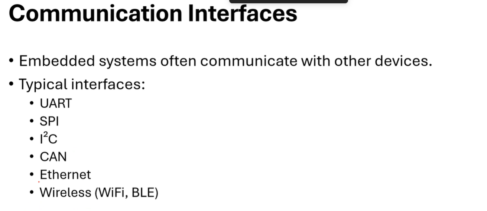

interfaces tipicas, UART enviamos um byte de cada vez, SPI e 2c para perifericaos
CAN usado para carros 1 megabyte por segundo. 9byutes por cada mensagem
Ethernet  mensagens mais pesadas , 1K de memoria, muitas vezes nao e preciso, dentro do microcontrolados a memoria e cara.
Protocolos caros. 
Software do tcp/ip  e sofisticado.
WIFI versao sem fios do ethernet, sao suportadsas pela mesma coisa.
Bluetooth \BLE ate 10 metros mas funciona muito bem. 

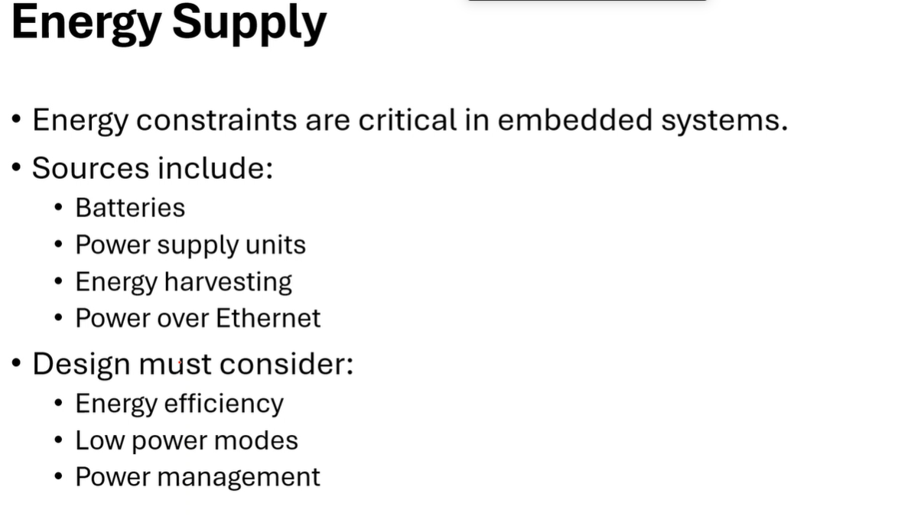

em muitos casos e critica, energia ilimitada quando vem do gerador ou parecido, mmas quando vem de baterias estamos limitados a bateria. se a bateria for grande vai ser muito pesada. fazer algoritmos que nao necessitem tanta energia.
energy harvesting, ir  ao meio ambiente e transformar fenomeno fisico. placas solares para agricultura quantidade de agua no solo, tenho muitos sensores deste genero. Normalmente nos temos bem mais problemas com este tipo de energia do que com as baterias. o objectivo aqui e que dure para sempre, temos de ter cuidade da forma como fazemos programacao.... 
fecho de microndas, portanto quando fazemos o design temos de considerar a efeiciencia energetica, lower power modes

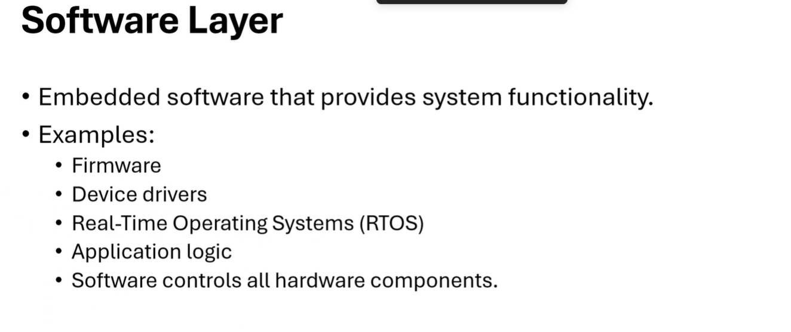

camda de software , firmwares este dentro do proprio sistema embebido,
devide drivers liga ao proprio hardware, permite varias pessoas pode ser utilizado opor varias pessoas.
pode ser um sistema operativo como linux em tempo real, mas nao podemos trer cicos de controlo muitos elevados como ir para os microsegundos.

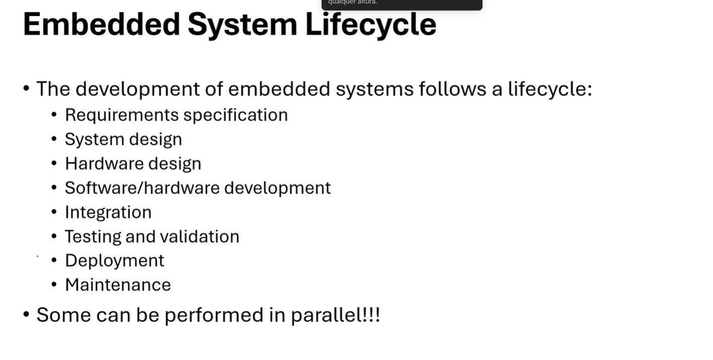

um conjunto de fases semelhantes
Requerimento de requiseitos, todos os stakeholders do meu sistema, requisitos quero que os numeros me aparecam a verde. 

design do sitema em funcai dos requisitos. 
depois , pode haver uma parte de desenho de=o hardware, o hardware ten nmais necessidade de ser desenhado de uma forma especifica !!

estes sistemas tem uma fase muito grande de teste e validacao , isto pode nos levar a ter de desenhar . ex do stor sistema com disjuntores problemas com injecao nao oscilava, netrada digital , controlo de potencia a oscilar , pronto ha a parte deployement.

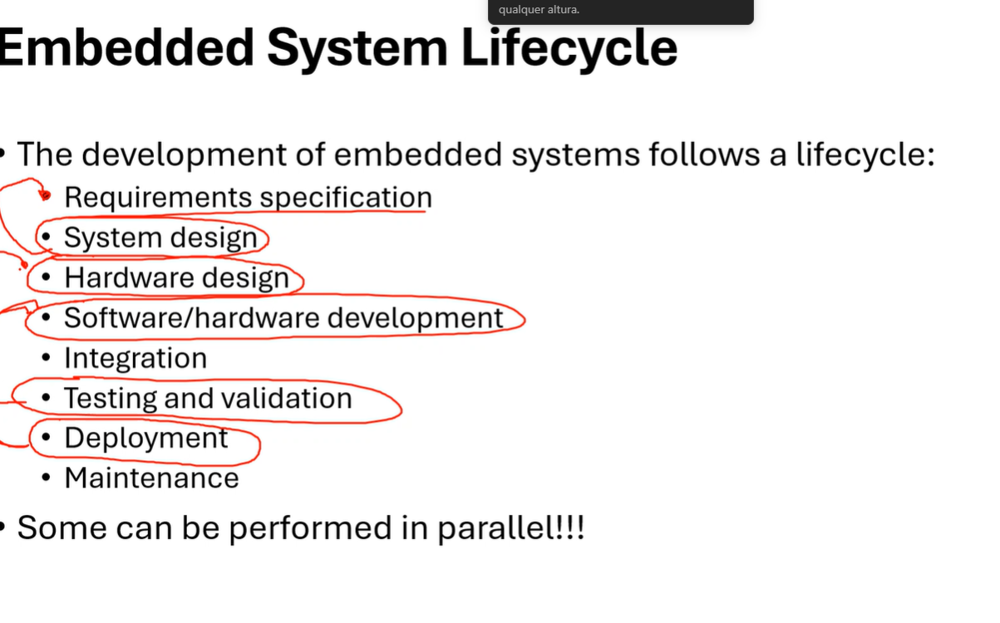

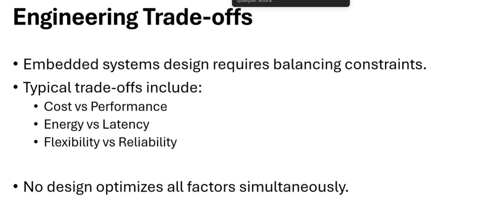

custo / performance. flexibilidade e robusteez do proprio sistema. 

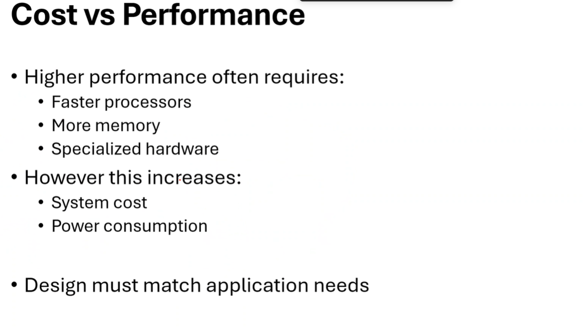
alta performance = altos custos , hardware sofisticado preco mais alto. 
Alem do custo , custo de energia. temos de ter trade off. 

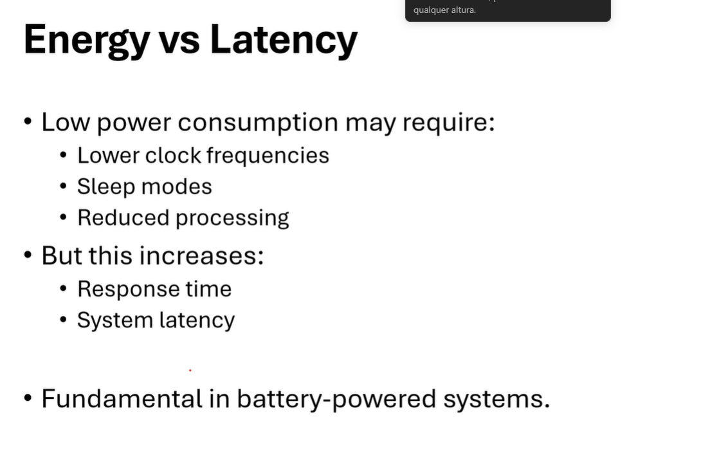

Para low power por processador mais lento, 
sleep modes cada vez maiores, 
Reduzir a quantidade de processamento que sera necessario. 

mas isto aumenta o tempo de resposta, temos de definir o objectivo baterias AA ou muito mais pequenas mais leves como comandos de carro, carergamos nu m botao e ele manda uma mensagem. 
flexibilidade e robusteez do sistema, tem que ser facilmente adaptavel, um sistema que seja robusto tem que ter uma validacao muito forte , mudancas minimas ao longo da vida do sitema , um sistema iot e facil se flexivel, mas num aviao sera mauis dificil quando safety e critical. 

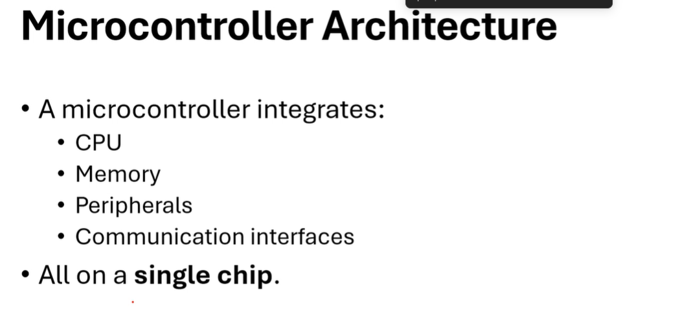

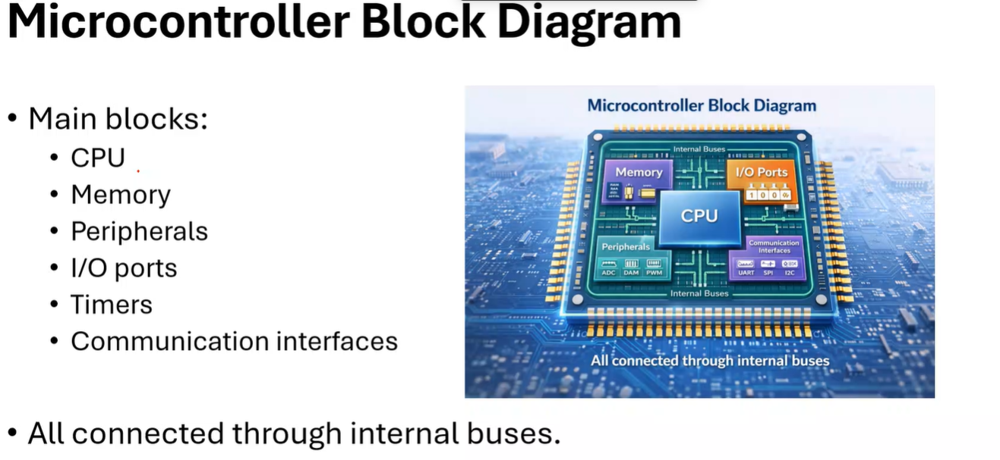

NOrmalmente eles tem cpu,
tem perifericos microprocessadores nao tem.
Timers nao sao tao sofisticados. 
cada vez se integra mais num processador so. 

todos eles sao ligados pelo barramento interno, por vezes e um dos grandes segredos, o barramento e a complexidade . Posso ter barramento em=ntre o CPU e a memoria. 
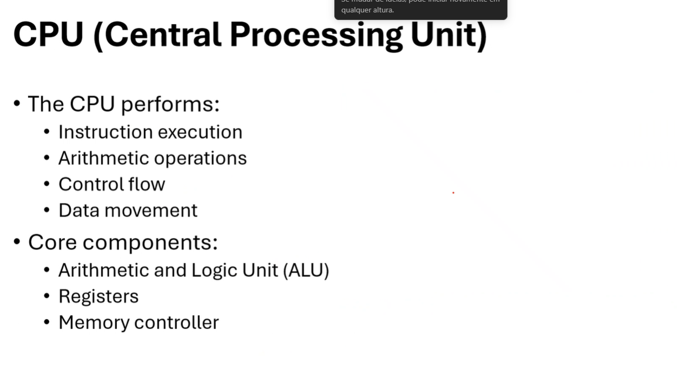

importante este slide de cima. 

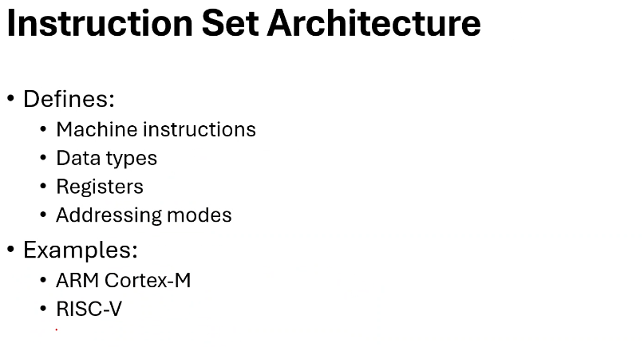

vai definir aqui no fundo as operacoes , quais as permitidas., dados , int, float, diferentes tipos de precisao. 

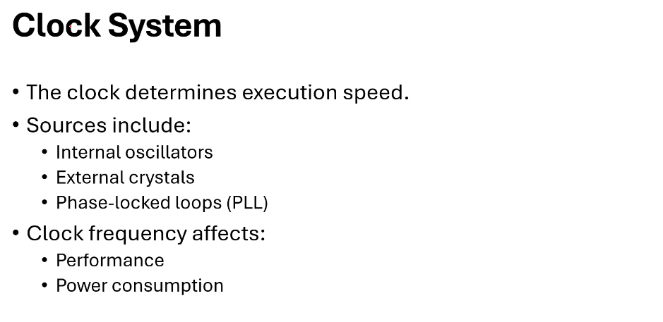

Vai definir e controlar todas as partes do meu sistema, mudancas de estado, osciladores internos, recorrer a cristais externos. relogios que se atrasam 1 segundo no ano, normalmente em sistemas IOT temos que contar que nao sao de grande precisao. 
A frequencia do relogio vai afetar a performance, o tempo de exicacao do processador definese pelo numero de ciclos de relogio.

Quanto for maior a frequencia, quantas mais vezes desligaer a nminha maquina pior. 
em termo de memoria os  micrcontrolados norma;m==lmente ate internamente a eles proprios 

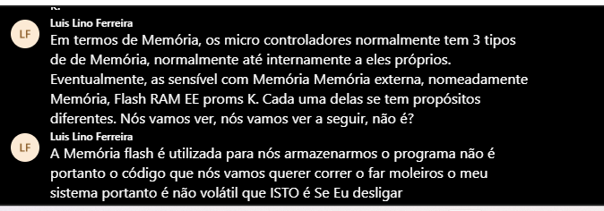

Flash guarda programas quando se desliga. numero limitado de vezes que podemos escrever sobre A FLASH.

tudo aquilo que vai mudar e na RAM, rapida volatil , desligo tudo que esta vai desaparecer, a flash e mais cara que a ram mas a ram mais cara que eprom 

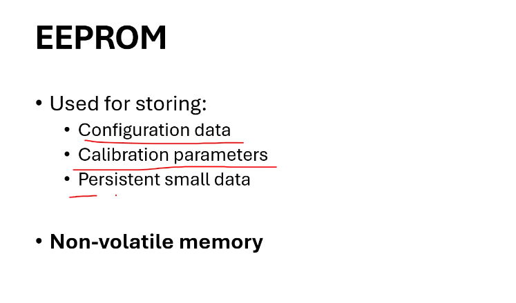

memoria non volatil 

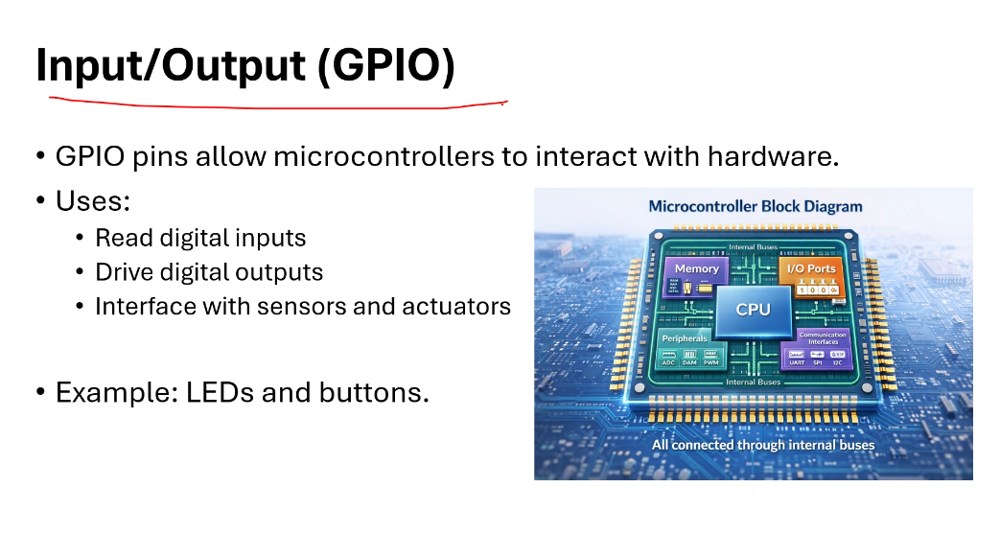

GPIO e a diferenca entre microcontrolador e microprocessador.

podemos ler sinais digitais escrever sinais deigitaias
fazer interface ente sensores e atuadores. 
Podem ser usadas para fazer aquisicao de sinall analogico. 

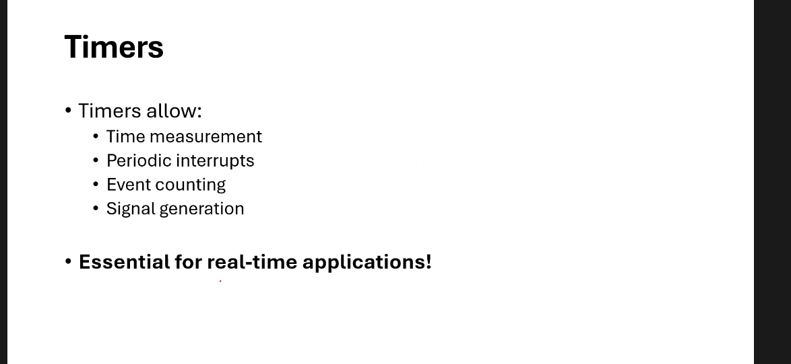

medidas do tempo, pode ser usado para interrupcoes periodicas para contar eventos para gerar um determinado sinal, ap;licacoes de tempo resal

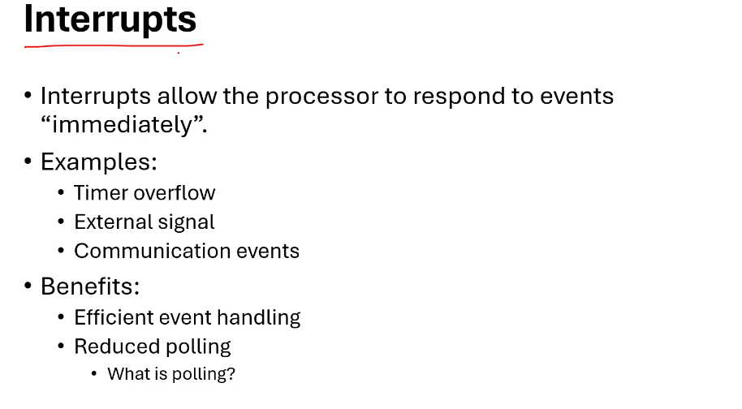

fundamental do sistema operativo, estao montados com eles, quando ha um interrupt cvou correr um pedacinho de codeigo especifico qpara aquela interrupcao , 
temos botoes de reset basta carrega com o dedo, 
Podem haver interrupts qcom a chegada de mensagens. 
Isto vai me permitir que haja uma gestao eficiente de evento. 
Isto permite nos reduzir os mecanismo de Pauling. 

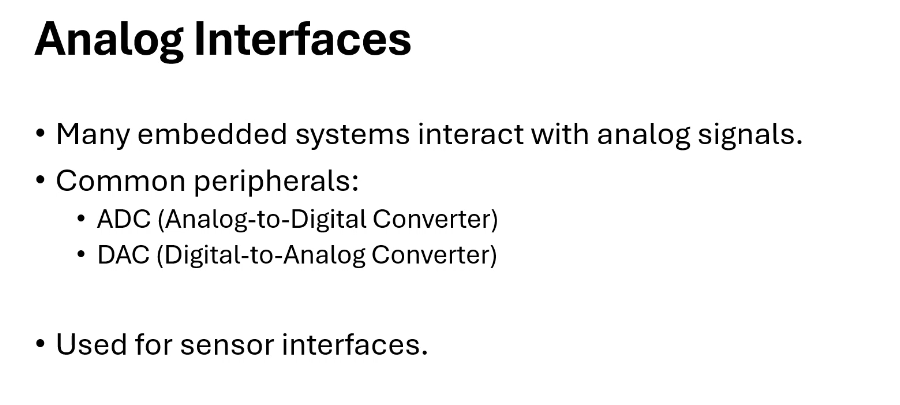

Muitos dos sistemas embebudos tem quae comunicar com o mundo analogico. 
ADC
DAC

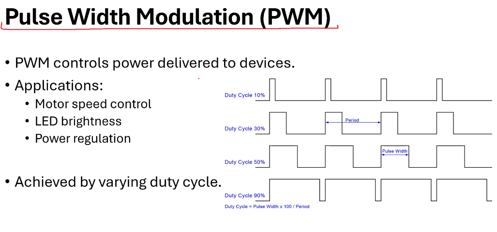

dolucoes de engenharia que funciona PWM, e no fundo ligar e desligar o sinal portanto aqui isto eram 5 volts co m isto eu consuiigo controlar a velocidade, 

o brilho do led vai variar o seu brilho, com o DUTY CYCLE.

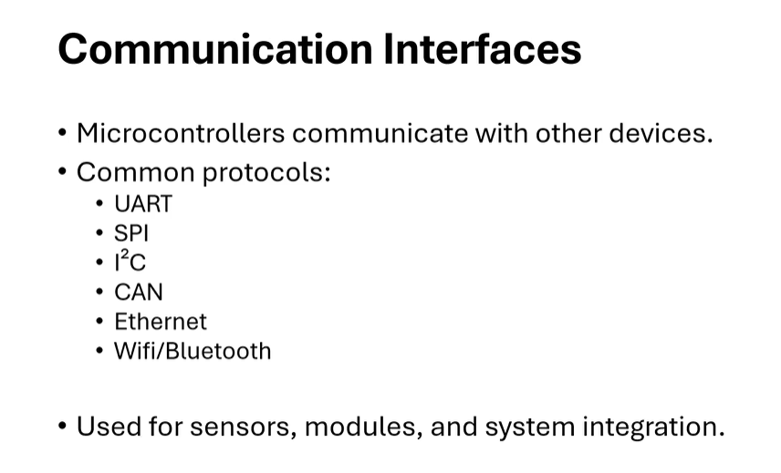

sao os protocolos de comiunicaocao>

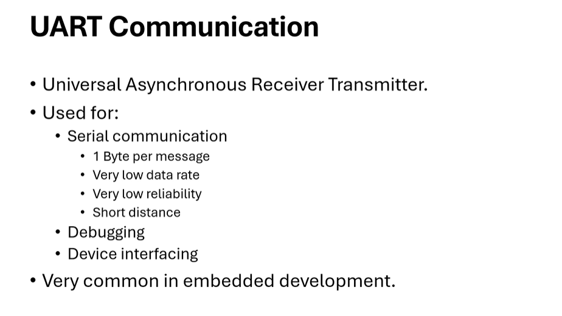

muito antigo, 1byte opor mensagem. baixa robustez na comunicacao so o nosso software, nao faz quase nada, comunicacao cutra distancia, fazer debugging, quanod tem sistema embebido, num sitema embebido como o seu funcionamento depende passo a apsso. 

Este protocolo de comunicoes foi substituido pelosb , isto e muito nomral de desenvolvimento com sistema legacy.

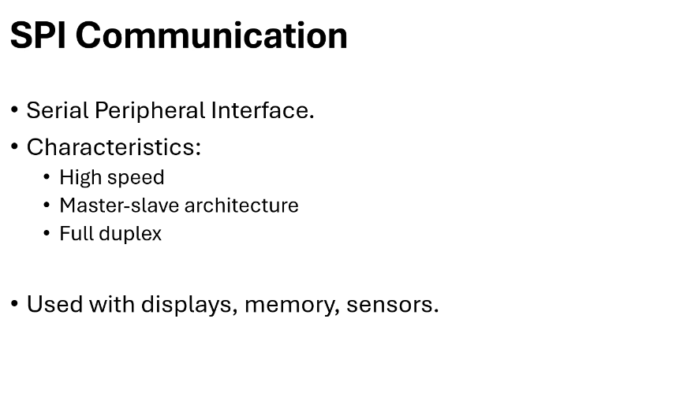

mais curta distancia velocidade mais elevada , arquitetura masterslave, quer dizer que ha um master na rede que vai controlar quem vai comunica, o master pergunta ao slave tens alguma mensagem para transmitir. 

Por iniciativa propria o slave nao transmite nenhuma iinfo. 

comunicacao serie com essa memoria, serie de polaquinhas e a comunicacao com essas placas, pode ser geita com SPI, 

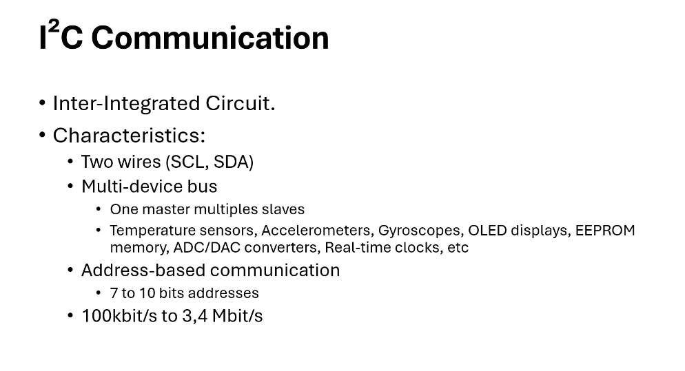

protocolo de comuinicao master slave, para sistemas relativamente rapidos. aqui aquantidade de dados e mutito reduzida. embora enderecos de 7 a 10 bits isto e quantidade substancial .

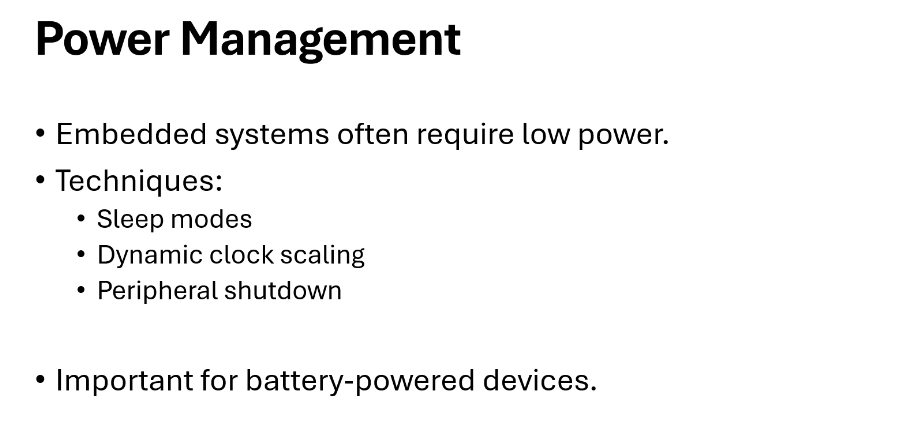

gestao de energia , entrar com o sistema em sleep mode, depende do sistema, as vezes so parte do hardware, os consumos sao diferentes. 

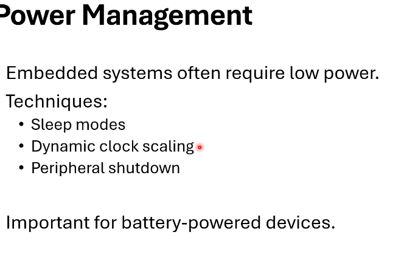

dynamic clock scaling portateis fazem... 

fazer shutdown de alguns perifericos. acelometro magnetometro, gastava demasiada energia..