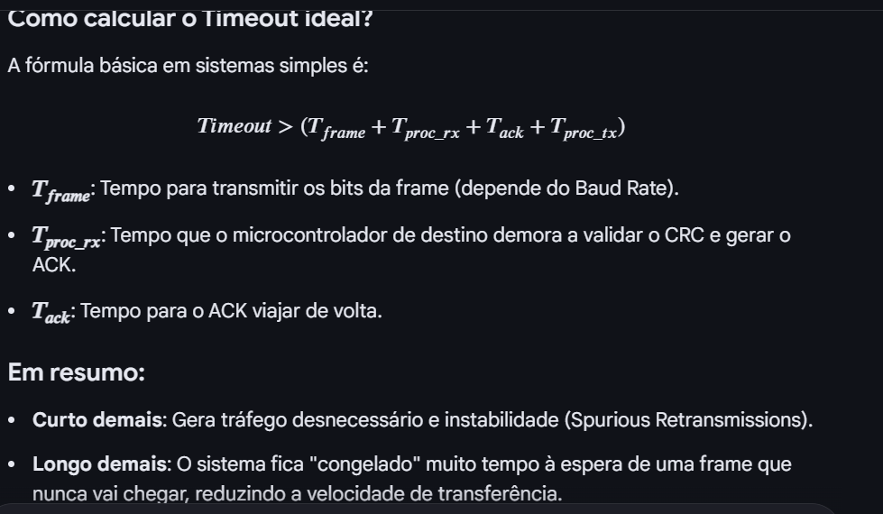

    Q1. Num protocolo com ACK, qual afirmação é sempre verdadeira?

Eu escolhia a A - Se não há ACK, os dados não chegaram

mas era a B
b - Se há ACK, os dados chegaram corretamente
Regra correta:

ACK recebido → dados chegaram ✔️
ACK não recebido → incerteza, não conclusão

Conceito fraco:

semântica de ACK (continua crítico)

Aula: Aula 8

    Q2. O timeout deve ser

C - Ajustado ao atraso esperado da rede

    Q3. Qual destes não afeta diretamente o canal?

D - Escalonamento do CPU

    Q4. Num sistema com muitas retransmissões, qual pode ser a causa?

A-  Timeout demasiado curto

    Q5. Qual é a consequência de aumentar demasiado o timeout?

B - Maior latencia na deteccao de falhas

    Q6. Num sistema com sliding window, o que acontece se o canal piora?

B- O throughput pode cair devido a retransmissões

    Q7. Tens um sistema com perdas frequentes e decides aumentar taxa de transmissão. Resultado mais provável?

B- Mais interferência/erros → mais retransmissões

    Q8. Qual combinação é mais coerente num canal ruidoso?

C- Ignorar perdas + aumentar potência

    Q9. Num sistema IoT real:
    sensor envia dados
    canal com ruído variável
    uso de ACK + timeout

    Observas:

    muitas retransmissões
    mas o recetor mostra dados duplicados

    Qual explicação mais provável?

C- ACKs estão a perder-se, causando retransmissões de dados já recebidos

############################################################################

## Ciclo 4 — foco: **Aula 5–6 (SO, interrupções, memória)**

---

## Perguntas

### Fáceis

**Q1.** Qual é a principal diferença entre **interrupção** e **polling**?
A) Interrupção usa CPU; polling não
B) Polling reage automaticamente a eventos
C) Interrupção é assíncrona; polling é verificação ativa
D) São equivalentes

---

**Q2.** Qual é o papel do **PCB (Process Control Block)**?
A) Armazenar instruções do programa
B) Guardar o estado do processo
C) Executar system calls
D) Controlar o ADC

---

**Q3.** O que acontece quando ocorre uma **interrupção**?
A) O CPU ignora o evento até terminar o processo
B) O CPU muda para ISR após guardar contexto
C) O processo é eliminado
D) A memória é reinicializada

---

### Médias

**Q4.** Qual é o principal problema de colocar muito código dentro de uma **ISR**?
A) Aumenta consumo de RAM
B) Aumenta latência e afeta previsibilidade
C) Impede uso de cache
D) Elimina interrupções futuras

---

**Q5.** Qual afirmação sobre **preempção** está correta?
A) Processo só sai quando termina
B) Processo pode ser interrompido por outro mais prioritário
C) Só existe em sistemas sem OS
D) Não usa prioridades

---

**Q6.** Qual é o papel da **MMU**?
A) Aumentar frequência do CPU
B) Traduzir e proteger endereços de memória
C) Gerir interrupções
D) Implementar MQTT

---

### Difíceis

**Q7.** Qual é o impacto da **cache** num sistema real-time?
A) Torna tudo mais determinístico
B) Remove necessidade de RAM
C) Introduz variabilidade no tempo de acesso
D) Impede interrupções

---

**Q8.** Quando é mais vantajoso usar **DMA**?
A) Para tarefas raras e pequenas
B) Para transferências grandes sem envolver CPU
C) Para substituir interrupções
D) Para reduzir RAM

---

### Integradora

**Q9.** Tens um sistema:

* sensor gera dados frequentes
* CPU tem outras tarefas críticas
* comunicação ativa

Qual abordagem mais correta?
A) Polling constante do sensor
B) ISR longa que trata tudo
C) Interrupções + DMA + processamento fora da ISR
D) Ignorar interrupções e usar apenas threads

---

## Responde no formato:

`1X 2X 3X 4X 5X 6X 7X 8X 9X`

---

# 📓 Depois do ciclo (pedido teu)

Já te preparo **como escrever no caderno (método de retenção máxima)** — mas só depois de responderes, para adaptar ao que ainda falhar.

    minhas respostas: 1C 2C 3B 4B 5B 6B 7A 8B 9C

