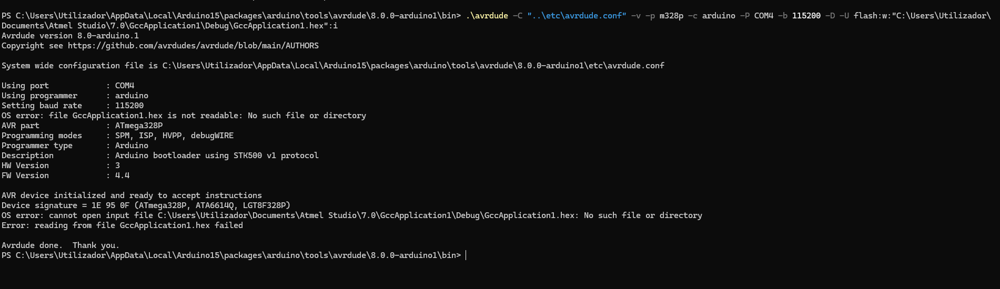
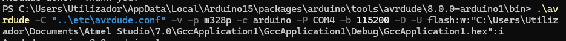
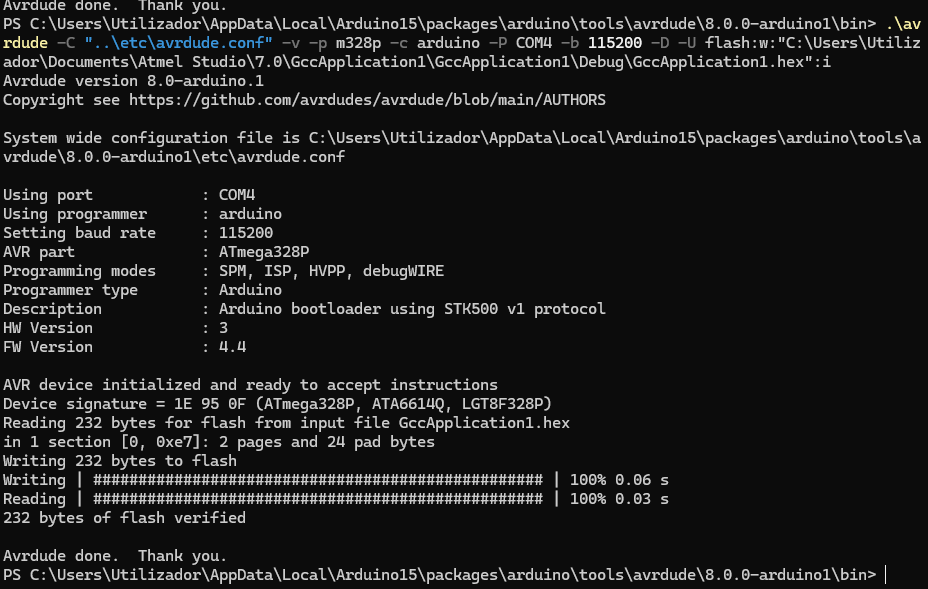

colei isto no Powershel  e deu me um ainformacao interessante.

    .\avrdude -p m328p -c arduino -P COM4 -b 115200

    
PS C:\Users\Utilizador\AppData\Local\Arduino15\packages\arduino\tools\avrdude\8.0.0-arduino1\bin> .\avrdude -C "..\etc\avrdude.conf" -v -p m328p -c arduino -P COM4 -b 115200 -D -U flash:w:"C:\Users\Utilizador\Documents\Atmel Studio\7.0\GccApplication1\Debug\GccApplication1.hex":i
Avrdude version 8.0-arduino.1
Copyright see https://github.com/avrdudes/avrdude/blob/main/AUTHORS

System wide configuration file is C:\Users\Utilizador\AppData\Local\Arduino15\packages\arduino\tools\avrdude\8.0.0-arduino1\etc\avrdude.conf

    Using port            : COM4
    Using programmer      : arduino
    Setting baud rate     : 115200
    OS error: file GccApplication1.hex is not readable: No such file or directory
    AVR part              : ATmega328P
    Programming modes     : SPM, ISP, HVPP, debugWIRE
    Programmer type       : Arduino
    Description           : Arduino bootloader using STK500 v1 protocol
    HW Version            : 3

    FW Version            : 4.4

AVR device initialized and ready to accept instructions

    **Device signature = 1E 95 0F (ATmega328P, ATA6614Q, LGT8F328P)** 

OS error: cannot open input file C:\Users\Utilizador\Documents\Atmel Studio\7.0\GccApplication1\Debug\GccApplication1.hex: No such file or directory
Error: reading from file GccApplication1.hex failed

Avrdude done.  Thank you.
PS C:\Users\Utilizador\AppData\Local\Arduino15\packages\arduino\tools\avrdude\8.0.0-arduino1\bin>

agora quando arrastei da pasta para o windows powershell ja funcionou !!!

com este comando 

