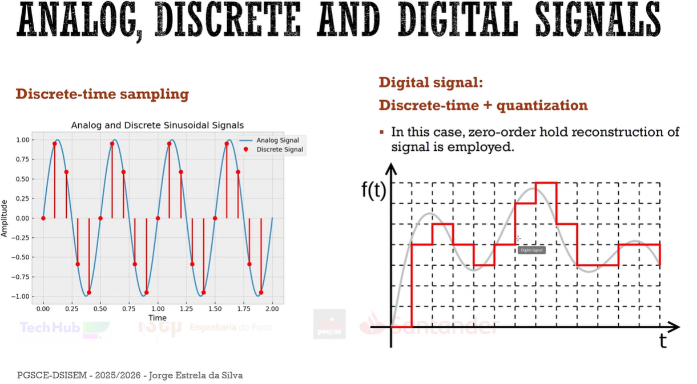

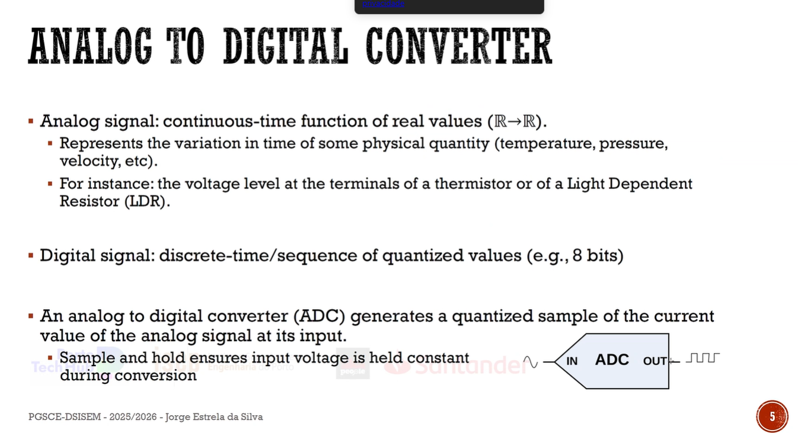

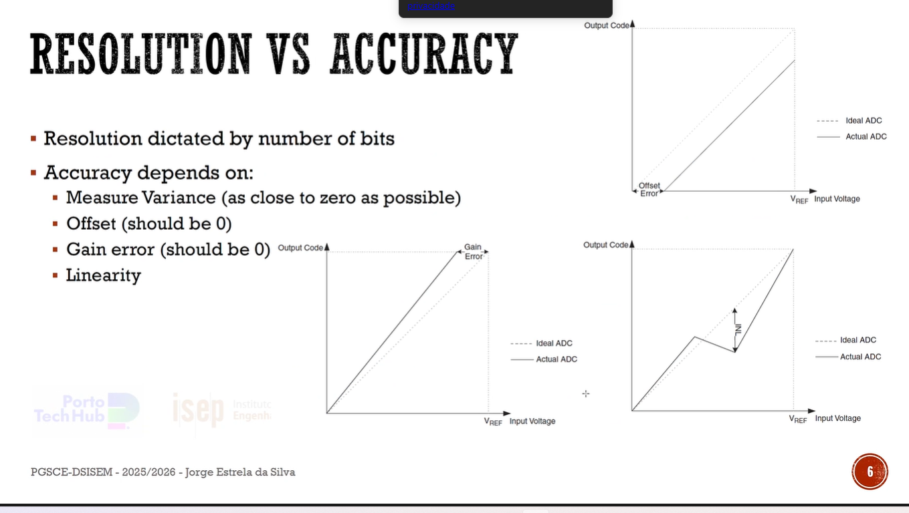

outro aspecto importante e ter em conta a precisao e a resolucao, em que o valor digital ter so ruido... a resolucao estabelecida pelo numero de bits, 
o valor de ADC ate ao valor maximo, e tendo em conta isso esses limites depois fazemos os calculos por software.
Aqui aspectos que sao caracterizados , aspectos como offset , esse 
temos aspectos nao linereazidados, mas noutras o erro ja ser maior, e sao estes aspectos que afetam o custo do ADC,
pputro aspecto a ter em conta e a taza de amostragem. 
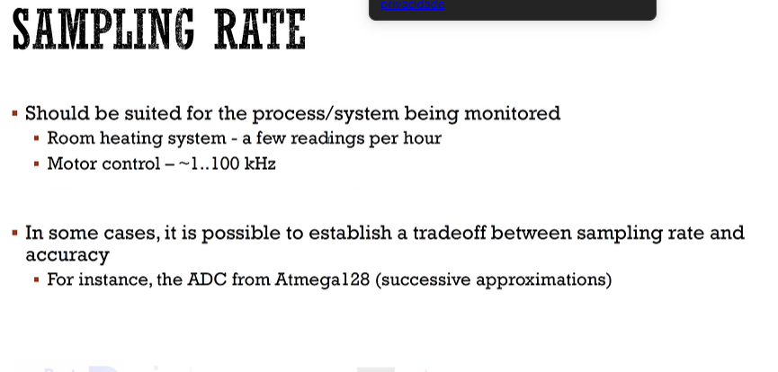

As taxa de amostragem para medir a velocidade do motor ja queremos tazas na ordem dos quilohertz, quanto maior a taxa mamaior sera a exigencia,
A frequencia de amostragem ao atmega 128 quando aumentamos diminiuir a precisao. No fundo o adc acaba por nem sequer tem tempod e convergir. 
Mas na pratica tentatmos forcar a taza de amostragem ou ler o valor do ADC antes da compressao.

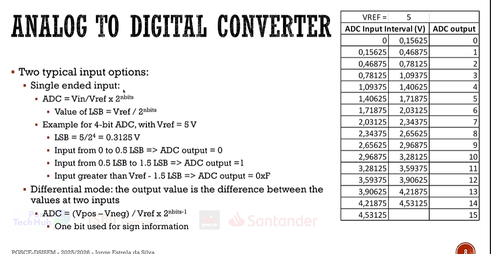

Neste caso, portanto vai ter que a tensao de referencia, em ultimo caso a tensao de alimentacao, o ADC vai ser a verao portanto do resultado desta operacao, 
Nesta tabela tento mostrar os tipos de arrondamento que e feito..
o menor valor diferente de 0 que conseguimos representar. valores de entrada que estejam entre 0 e lsb. vai resultar num valor de sair do ADC de zero. 

O valor e 0,5 lsb e aqui a 1,5 lsbm, sendo que o valor central e portanto o vrf dividido p

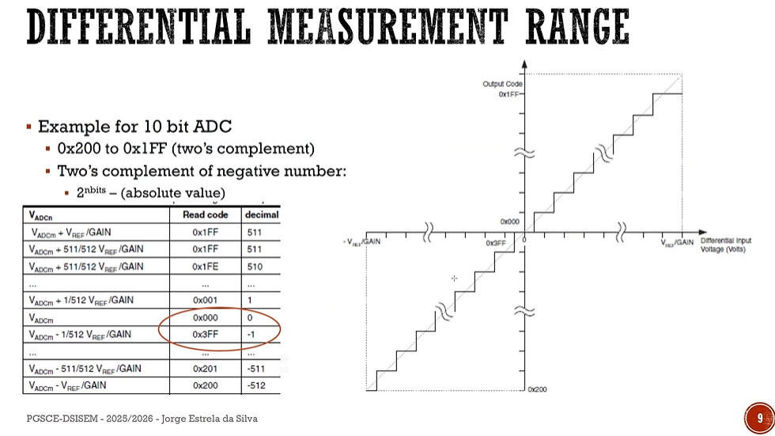

tirei do datasheet do atmega 128, tenho de aprender a fazer estas logicas..

Aqui eu introduzo um conceito uma semana a estudar estas coisas de fazer a ritemetica para 2. So queria chamar atencao para representar valores negativos, e o complemento para dois, ha um bit que fica reservado para dar a informacao do sinal . comptutadores ja com transistors. 

devem usar uma unsigned int , no outro caso singed acho ..

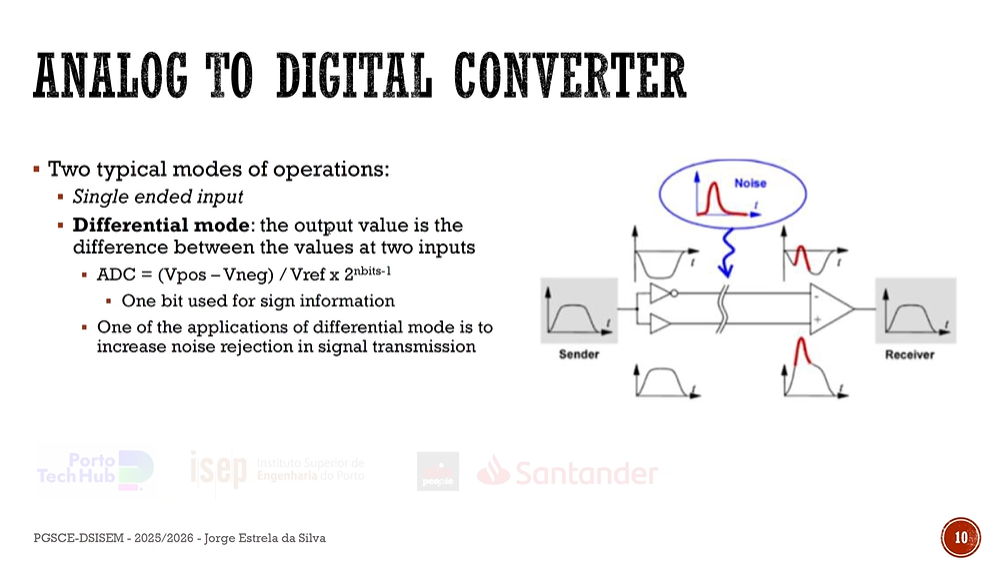

um exemplo muiito comum e na transmissao de sinais, que o emissor faz em vez de tranmitir , uma versao positiva so sinal e uma posicao negativa do sinal, a vantagem qualquer interferencia, os fios vao paralelos torcidos, como nos tal modo diferencial do ADC, no fundo isto vai ficar simetrico, mas este ruido vai ser subtraido, 
o modo diferencial e util os microphones de espectaculo, a maior parte dos protocolos serie de alto desempenho usam este moto a falar de usbe pci express ou sata,

Indepedentemente de usarmos sinais analogicos , 

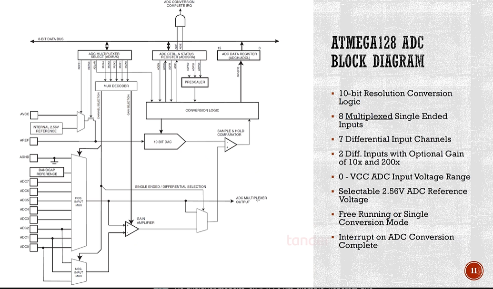

ao caso pratico do adc do atmega 128 que podem usar na aula pratica, diagrama de blocos, temos aqui barramento de dados, temos a reoresentacao do registo de controlo e que todos dispositivos que temos vindo a anlisar, temos aqui um par de regitos para fazer a leitura dos dados, vamos ler o valor convertido pelo ADC ADC com valor de registo de 10bits. 

Biots menos significativos e mais, nao entendo a logica de mais e menos. 

COmutar a entrada que se esta a converter, e converter um de cada vez, a taza maxima d eamostragem , vai ficar divida . Se tiver que estar a ler 8 ja so vai dar um quiloherts para cada entrada. 

Esta parte do multiplexer tem varias combinacoes . No modo diferencial ou como entrada negativa que esta aqui. 

selecao de entradas , nas entradas diferenciais, uma vez que e feita uma subtracao  ,,

200 vezes a precisao seja pior, so se consegue uma precisao de 7 bits significativos, isto o conversor e chamado por aproximacoes sucessivas. segue uma arvore de decisao , ate que o erro seja 0, A tensao de referencia, ate existe uma tolerancia. Tem de ser menor que a tensao de aliimentacao por um determinado balor. 

Aplicar neste pijno por avcc outro e usar 11 tensao que e gerada internamente. 

um condensador que vai faaz\er com que esta qui a entrada do conversor seja mais estavel possivel tipicamente . 
este adc ten dois modos de operacao, um converte continuamente uma taxa de amostragem mais rapida. usar o modo em que a conversao so e iniciada quando escrevemos um byte no registo de controlo. 
Interrupcao e neste caso concreteo e quando se da o fim da conversao. 

o presacaler no fundo e o que vai controlar a taza de amostragem do converso, estamos a mostrar 1000vezes por segundo ou 500 ...

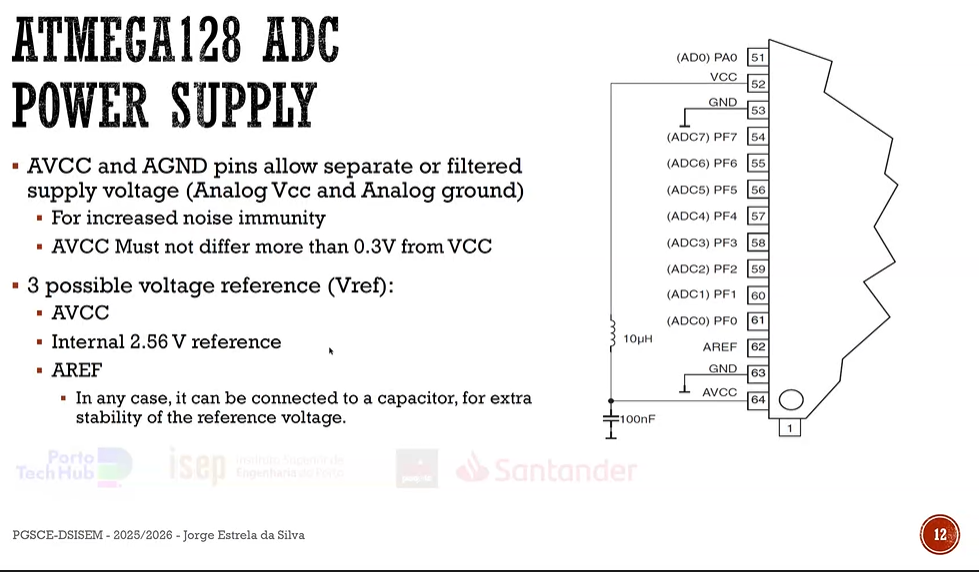

a tensao de referencia , se esta tensao estiver a variar o resultado final nao sera muito bom. 

neste pino avcc, o uqe e _ ? 

a tensao de alimentacao do AD , e tambem a propria alimentacao do AD, quando se quer uma qualidade de conversao mais estrita e comum sperar se todo circuito analogico da parte digital, para nao haver interferencias. 

Os sinais digitais sao feitas de transicoes rapidas, e uma das leis de Maxwell, permitir que este ADCC possa ser uma alimentacao do microcontrolados. 

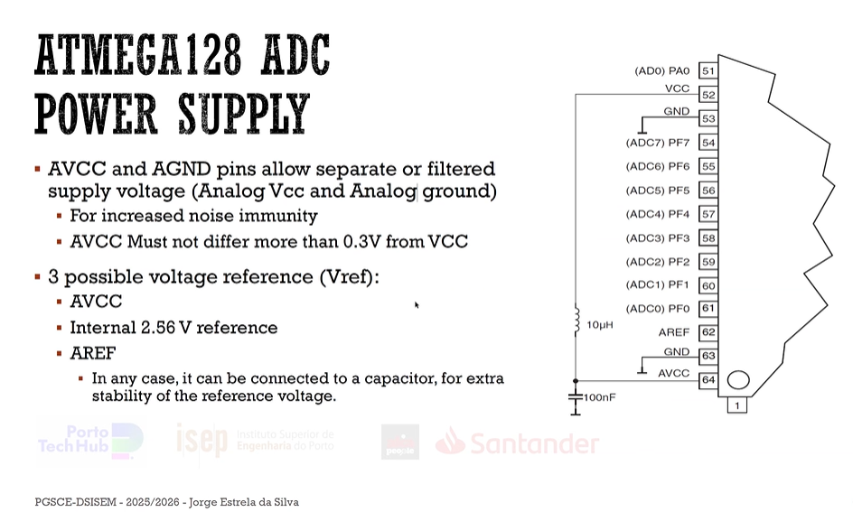

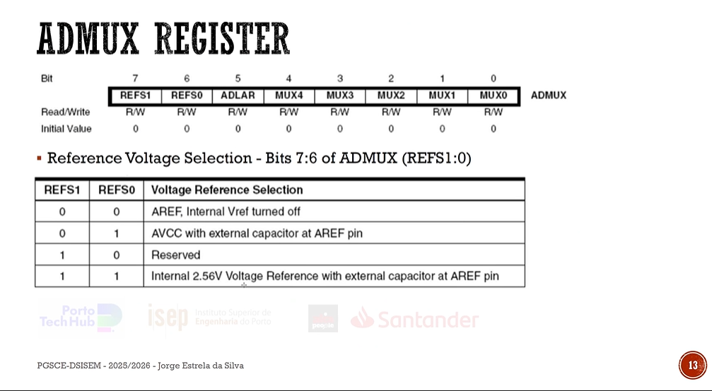

AREF e provavelmente o que da melhor resultado.
isto em termos de qualidade , mas em remos de simplicidade seria este.//

o proprio amega temos que por o cristal extreno. tem um oscilador interno. 

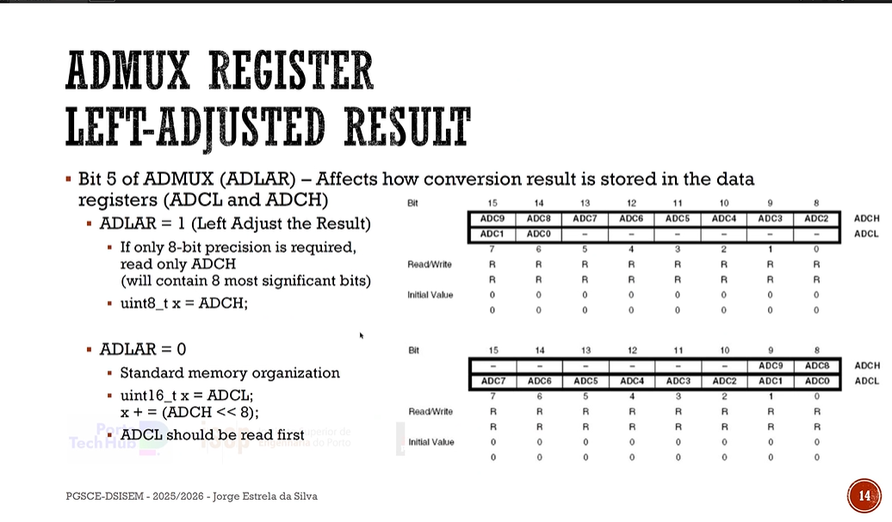

Defenir se queremos a configuracao notmal , no byte significativo ficar no byte menos significativo, os 8 bits mais significativos no byte mais significativo, porque em muitas situacoes se nos nao fizermos a tal filtragem o 2 bits menos significativos , 

tarblahar com unidades de 8 bits em  c uinti8 ? 

pruimeiro ler o byte menos significativo, quando lemos OADC H o ADC recebe um sinal que pode escrever um valor , isto so aconter=cerua numa situacao que realmente tivessemos demorado muito tempo a ir ler. 

mas pronto ler primeiro o registo de dados menos significativos, fazendo o corresoionodente shift para portanto ficar aqui nesta posicao...

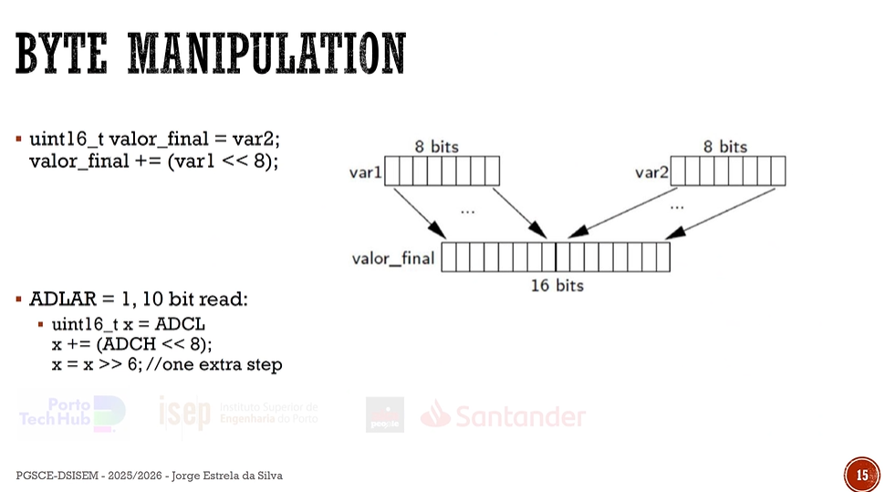

perceber bits mais significativos e menos, estou perdido....

fala de 6 bits pa esquerda offset....

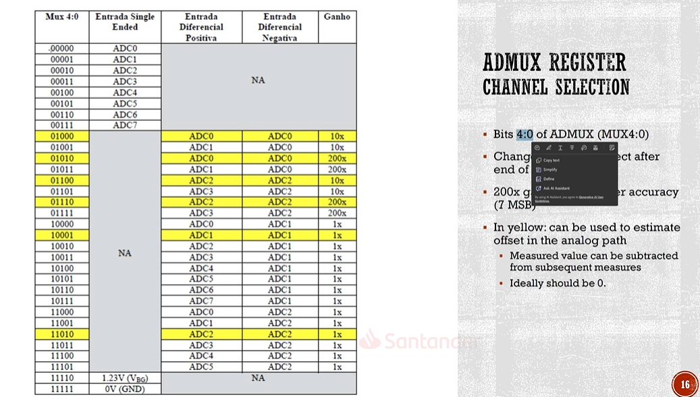

tem aqui marcado a amarelo , a primeira visto nao parece fazer grande sentido..

A questao alem da subtracao existe todo um conjunto de operacoes, 
este modos amarelos servem para calcular offsets,

o valor que subtraiso o offset, e por isso que o miv=cro =controlados permite estas combinacoes de aplica a mesma entrada. 
So quando a conversao atual e completada entra na consifguracao indicada. 

Alias o proprio sample and hold impede que isso aconteca. 

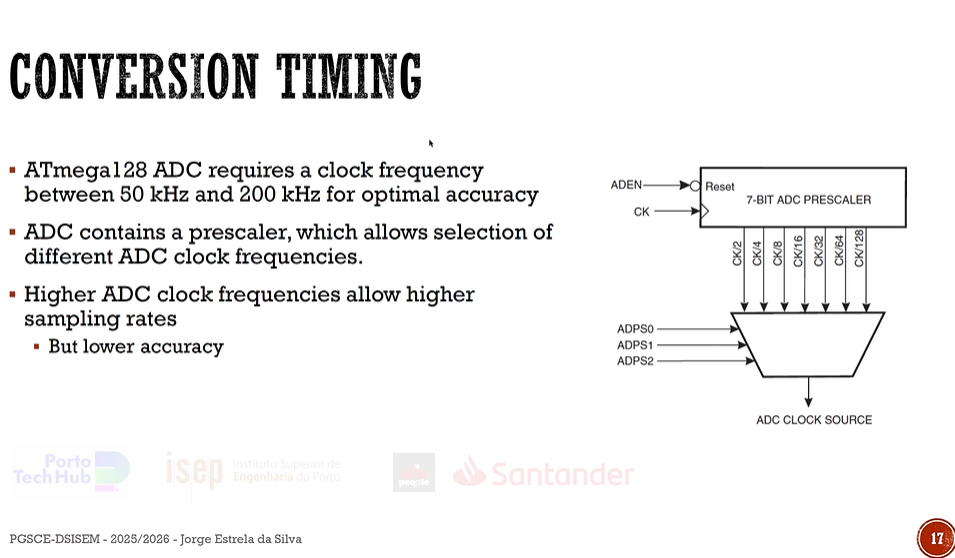

Portanto o ADC deste atmega 128 o sinal de relogio que lhe esta a aplicado entre 50 200 quilohertz, 

Isto esta dimensiopnado para trablhar nesta gama de frequencias, em vez de ter 8 bits significativos ja depois ...
A arvore de decisao que segue bits mais significativos, 0 1 2 volts, ja noa tem tempo de converter.

Existe um prescaler que permite dividir a o valor da frequencia 

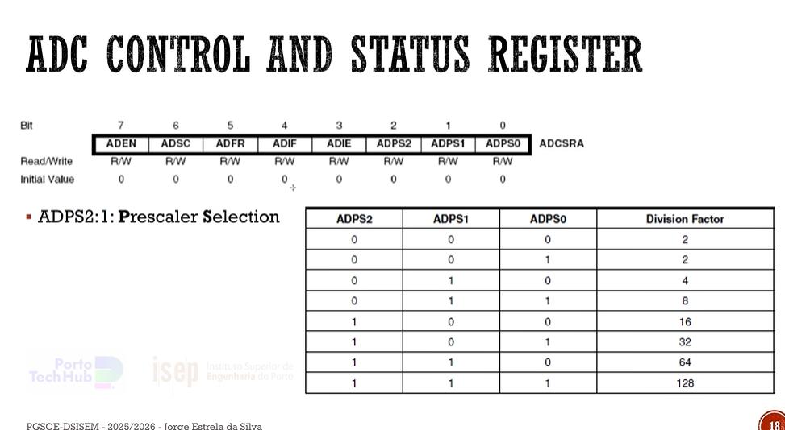

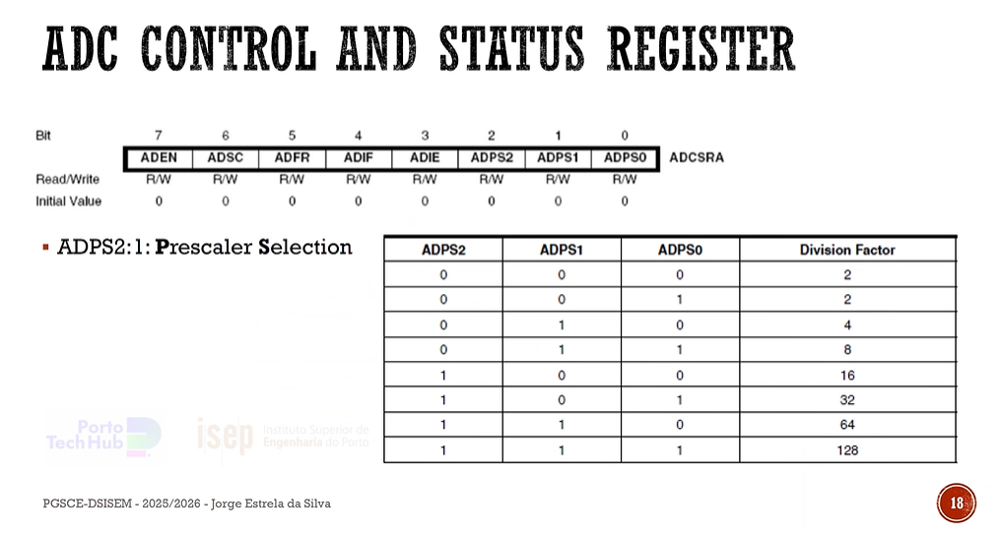

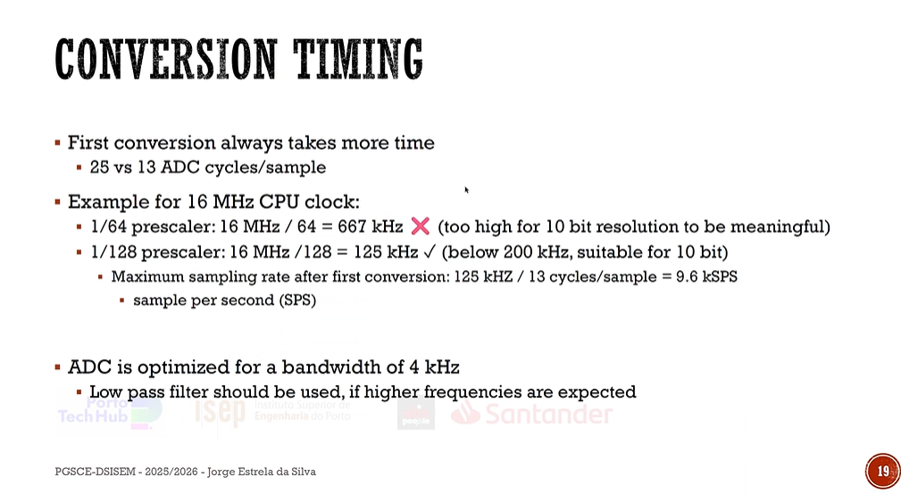

OU sej aexemplificando a ter o atmega a trabalhar ao maximo 6megahertz nao tenmos muita escolha de prescaler..

16 \ 64 da frequencia 667 quiloherts, prescaler maximo de forma termos 125 quilohertz que ja e um valor bem abaixo dos 200 quilohertz. 

Assumindo um funcionamento continuo,

Para controlar motres ja depende das frequencias.

este ADC esta otimizado para trablahar com largunras de  abanda de 4 quilohertsz aconsekllhad um filtrp pass baixo. 

Reparem que aqui entramos noutro aspecto do processamento digital teorema de niquist ?? para esta largurta de banda seja quanto os electrotecnicos. 
o idela e nas aplicacoes bem superior a frequencica de nikuest, 

Podemos encara que o dobro e o ideal, 9,6 , o filtro de baixa entrada ja devia ser projectado para uma frequencia de 2 quilohertsz, senao vai sempre haver o fenomenmo de leasing,... 

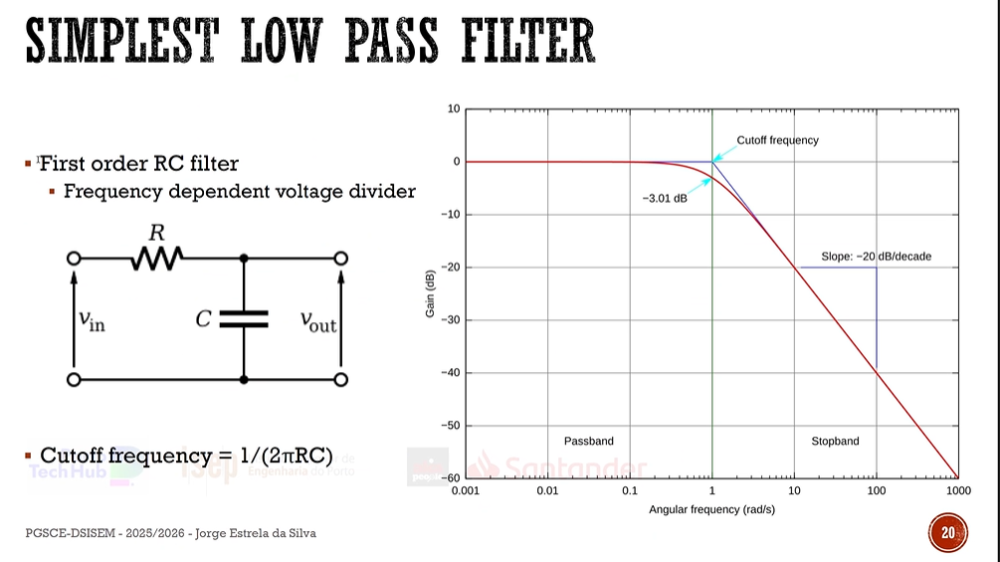

o  filtro passa baixo rudimentar e o filtro de primeira ordem que oissa ser implementado com uma simples resistencia. 

Frequencia a partir do qual , sinal original isto como se fosse a entrada do ADC. Para frequencias muito altas . ADC para frequencias muito altas o sinal e atenuado, ate frequencias .... respresentado neste grafico de ganho, o ganho e praticamente unitario, o logaritmo do ganho 20 do logaritmo do ganho. variacao de 20 decibeis por decada, e uma escala logaritmica, noutras situacoies pode ser representacada por instrumentos muscicais, 

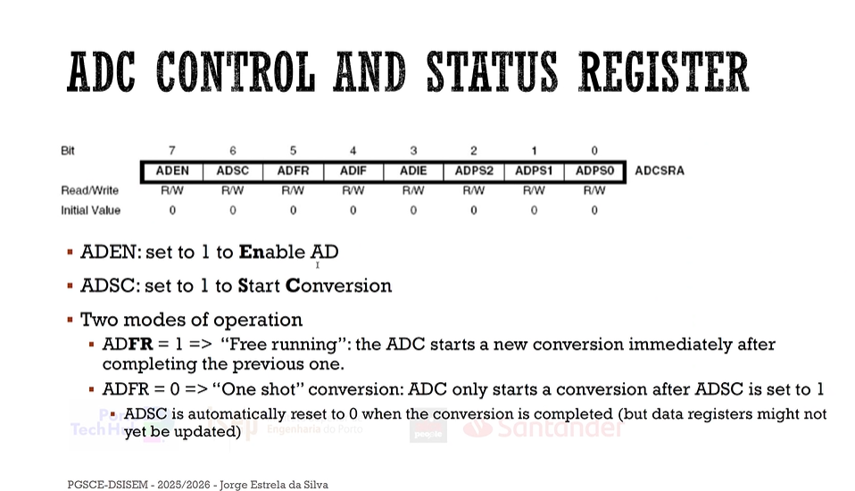

este adsc e o bit para dar a ordem de conversao, depois colocado a 0 quando a conversao termina. single shot. essa selecao que existe qaqui , free runinng 
paralelamente comeca logo uma conversao, so se faz uma conversao cada vez que se escreve neste bit,

este aconversao simples inciada pelo adsc embora demore 13 , na pratuca aquela divisao acaba por ser por 14 e nao por 13, quando queremos estar a fazer amostragem continua, e podemos usar isso para ler o valor gerado enquanto que a conversao 

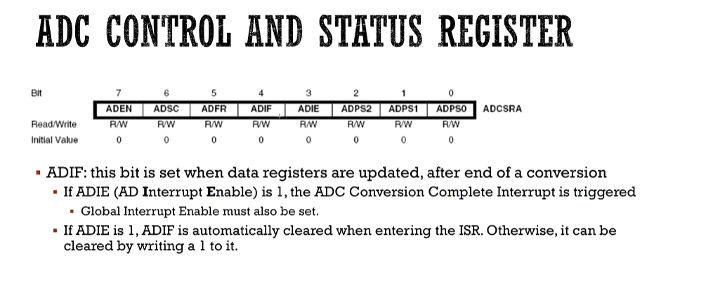

este interrupt flag, a conversao ja foi feita...

e o tipico, se este bit estiver a um  e gerado no vector de interrupcao tipicamente ler o valor do AD e guarda la numa variavel qiualquer guardar num beffuer e depois ativar flag para o processa,mento. 

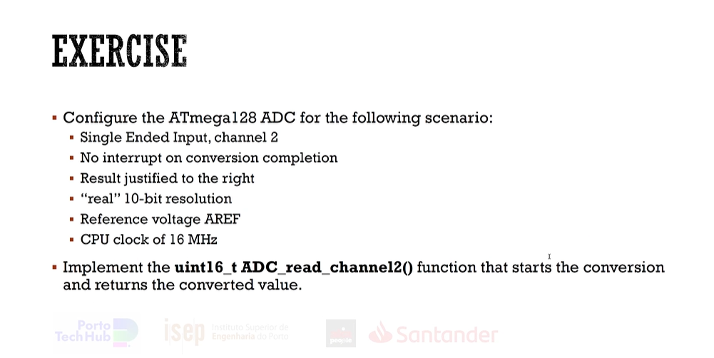

exercicio no inicio da procima aula... 

sinais analogicos e AD, 

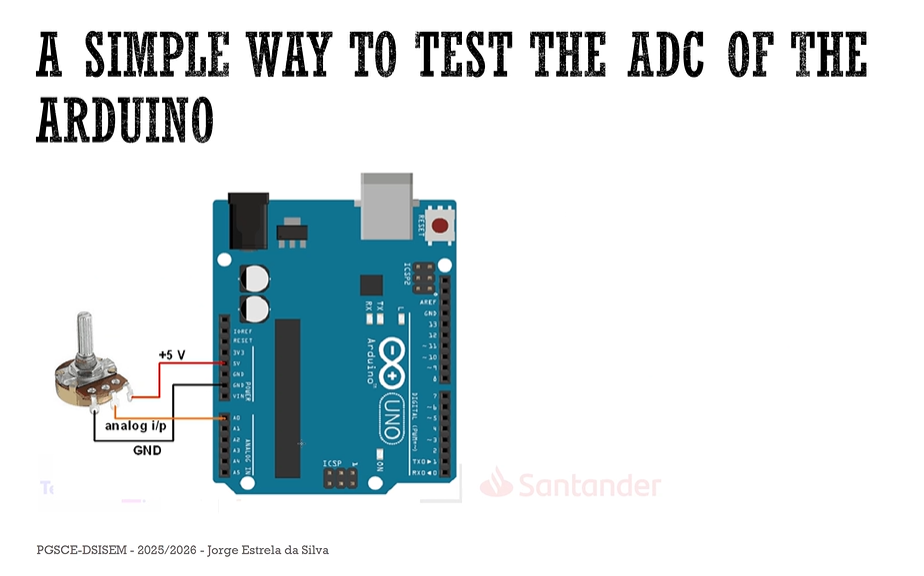

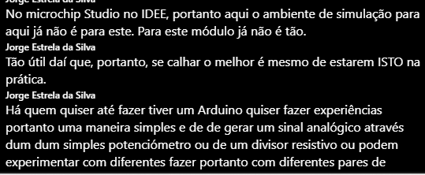

diferentes valor de tensao... cp, potenciometros e mais agradavel para se variar a tensao... 

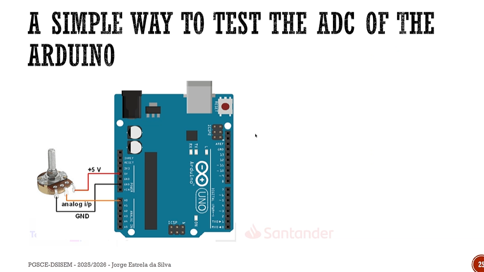

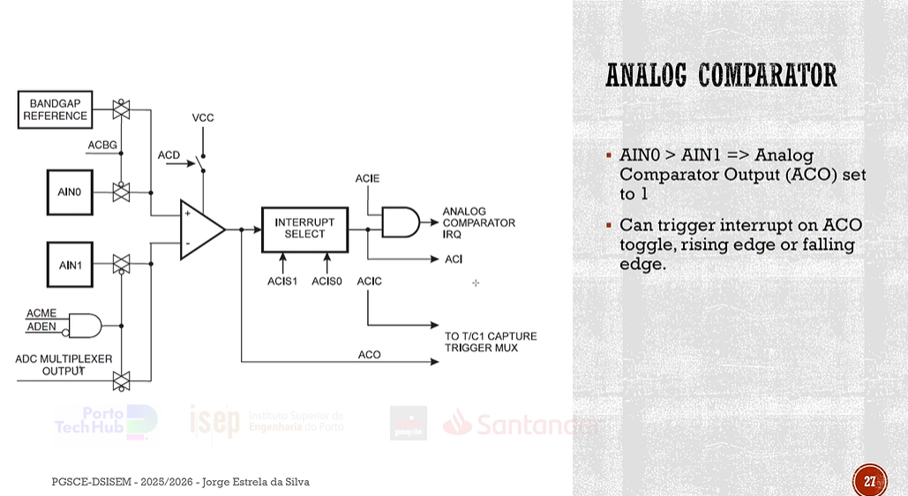

verificar se um sinal e superior a outro.. 

quinta feira vamos falar disto na imagem convem ja ir aprendendo 

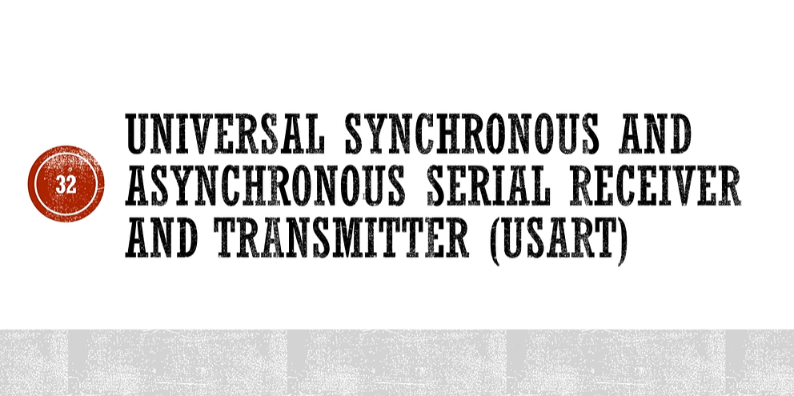