mQTT vantagem que oferece para os sistemas embebidos

HTTP 

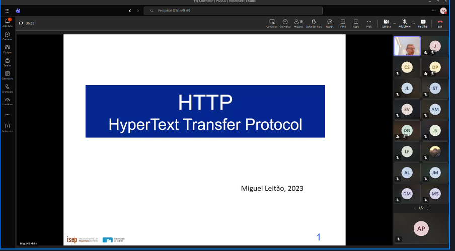

os broswers webs sao cliente httop, e efeciente , e leve mas nao tanto como MQTT, os protocolos de e considerado eficiente,

funciona sobre tcp. 

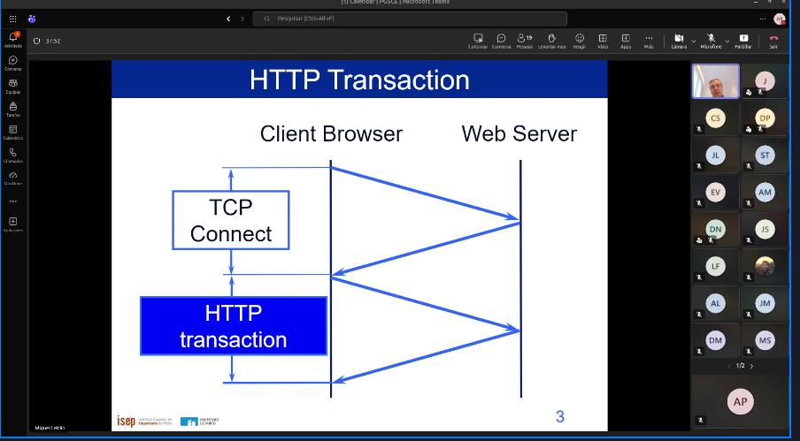

mqtt funciona sobre TCP e http tambem

so pode comecar depois de tcp

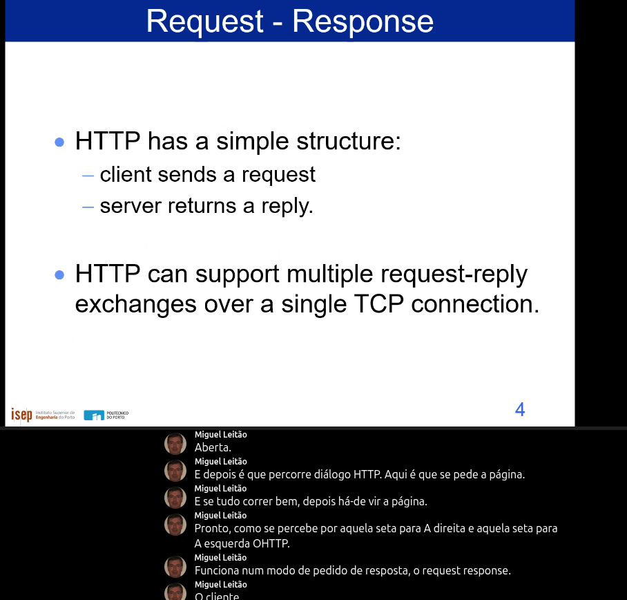

responde com os conteudo ou uma mesagem de erro, mesma sessao tcp para fazer varios pedidos. 

Se conseguires arranjar uma sessao TCP antes de fazer o pedido do HTTP . 

So se pode pedir um,a coisa depois de a anterior ja ter chegado. 

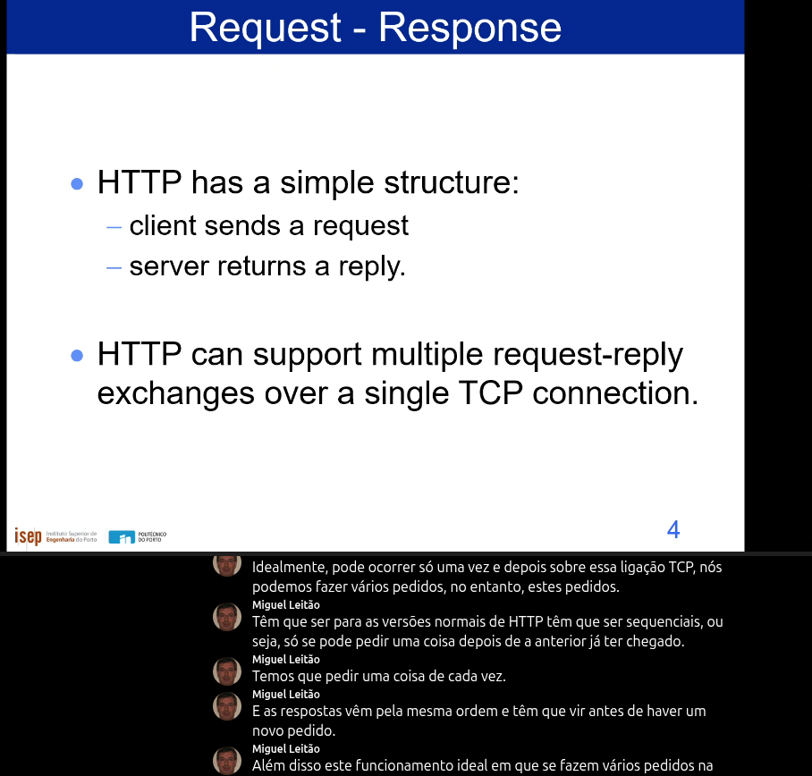

os servidoere web fecham a ligac ao deppois de satisfazer um pedido http. depois tem de se establecer outra sessaioo TCP.

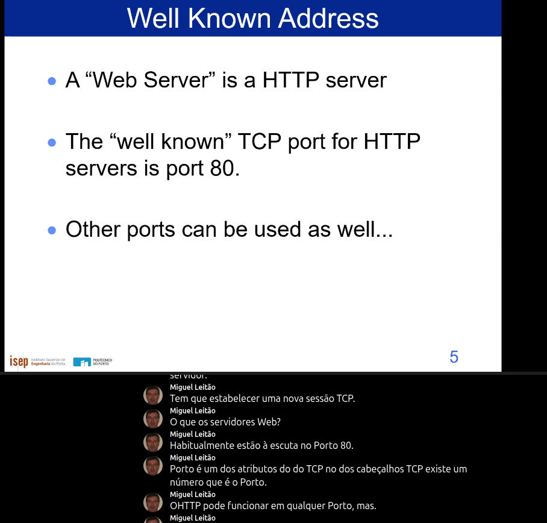

escuta no porto 80 quando nao se diz nada. 

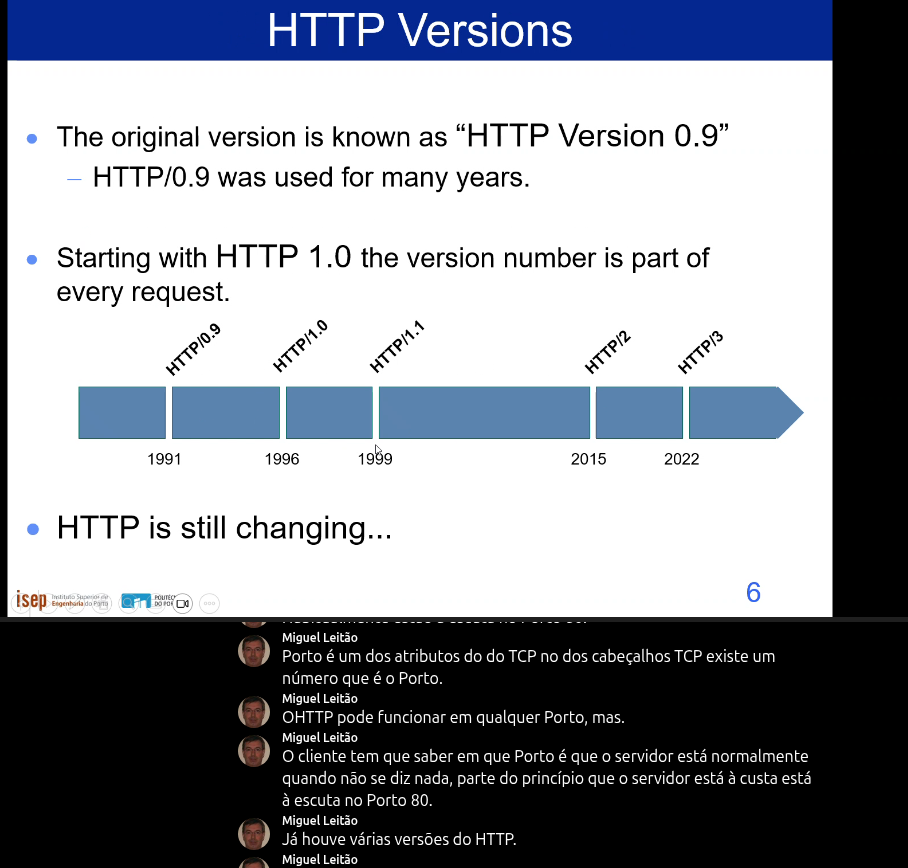

http 1.1 era a unica que existia, ou a versap mais atual dis[pnivel]

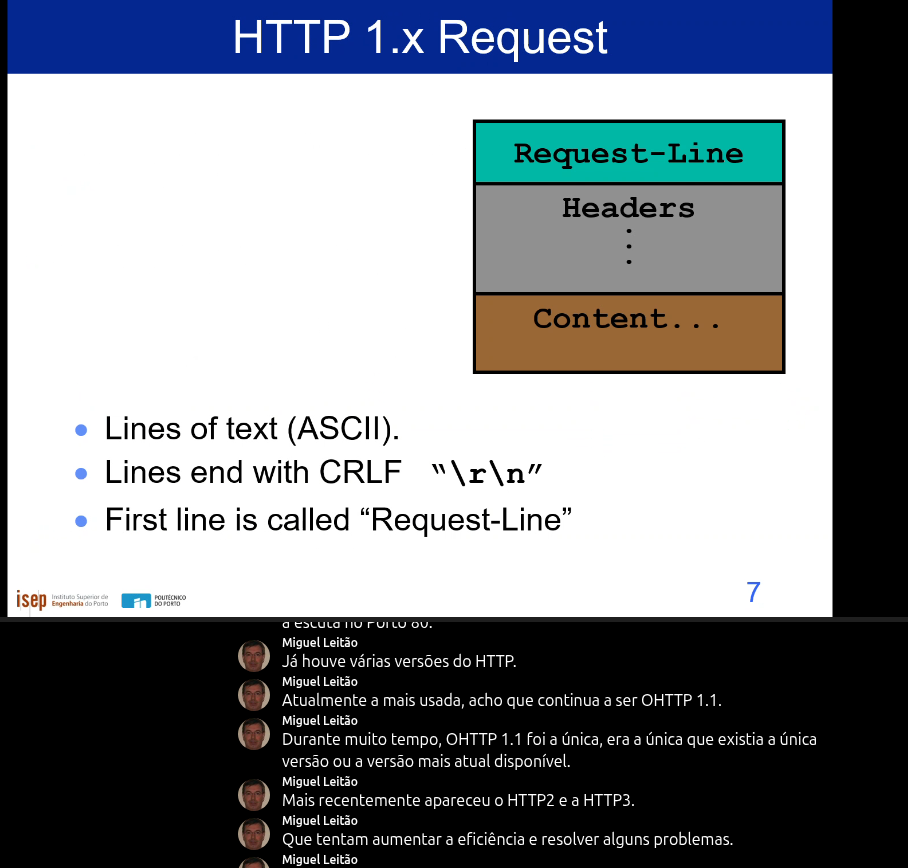

como funciona o http, depois da ligacao establecida TCP. o cliente HTTP faz um pedido.

a primeira seccao chama se request line depois seccao de conteudo.

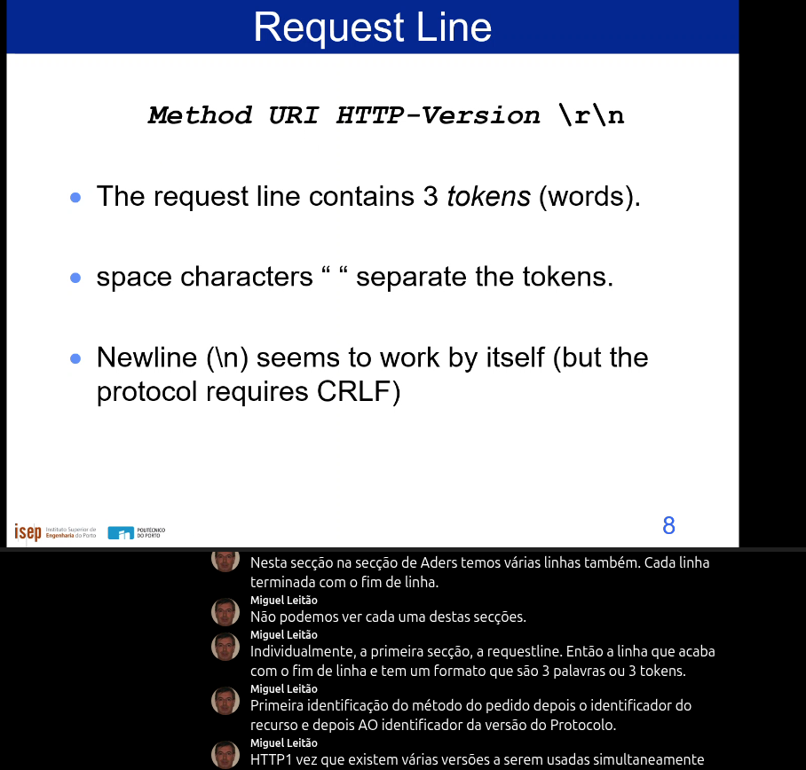

Servidor saber que lingua falamos
tem de se assinalar fim de linha

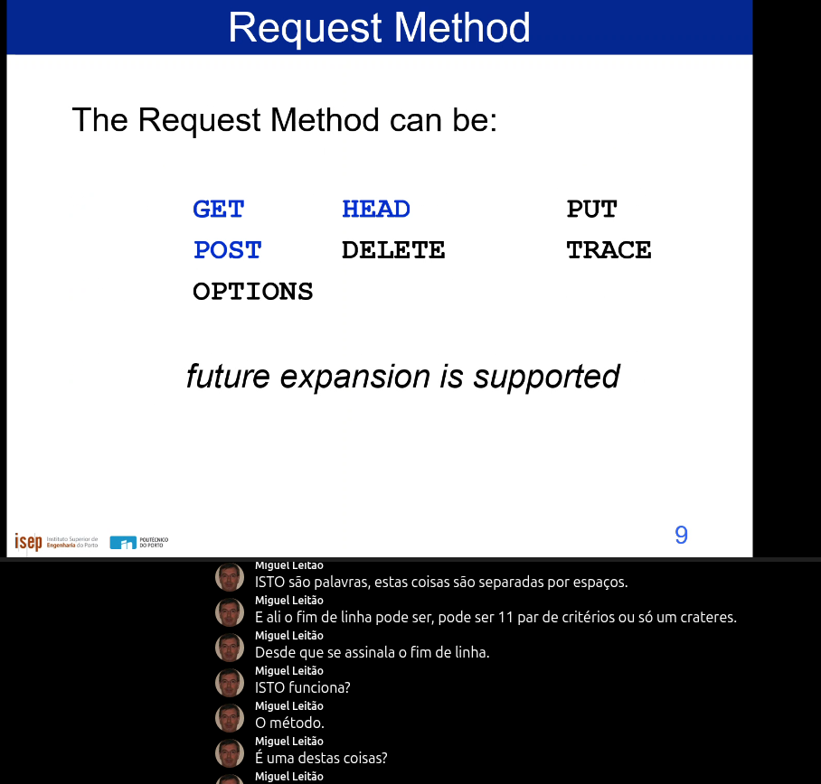

mais habituais 

# GET
# HEAD
# POST

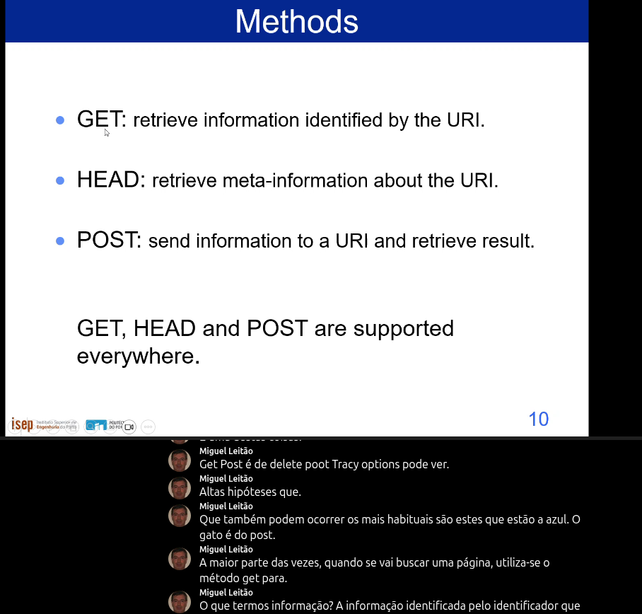

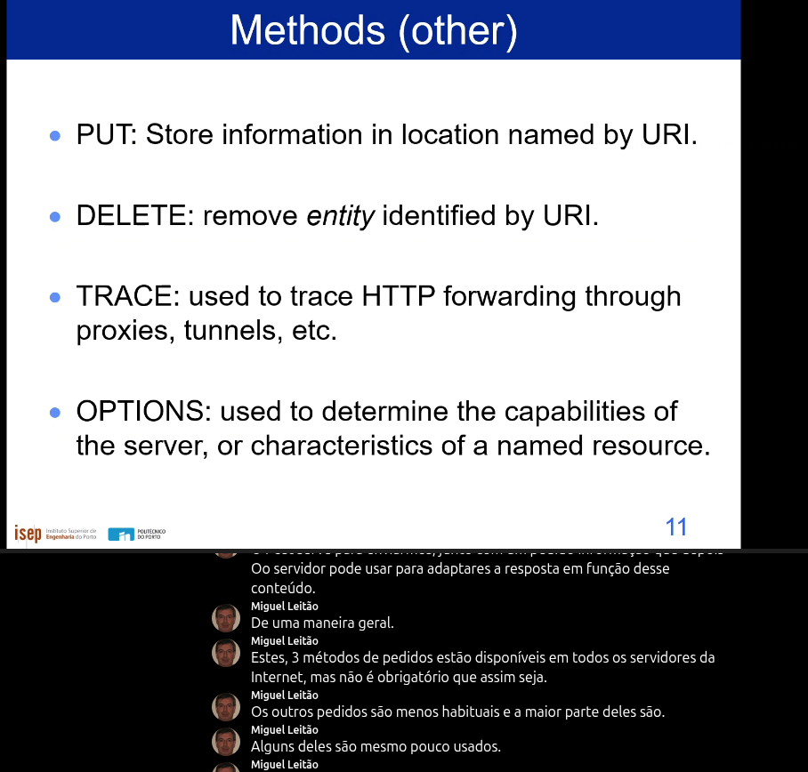

# PUT
upload de ficheiros

# DELETE 
pedir para apagar o conteudo

# Trace

# Options

