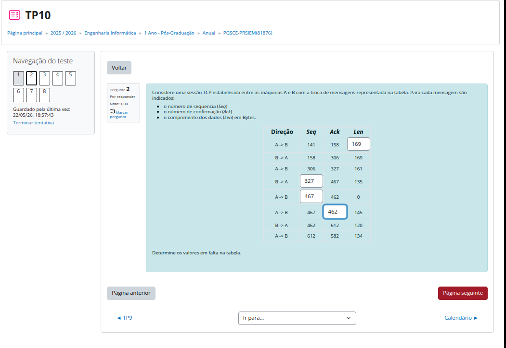
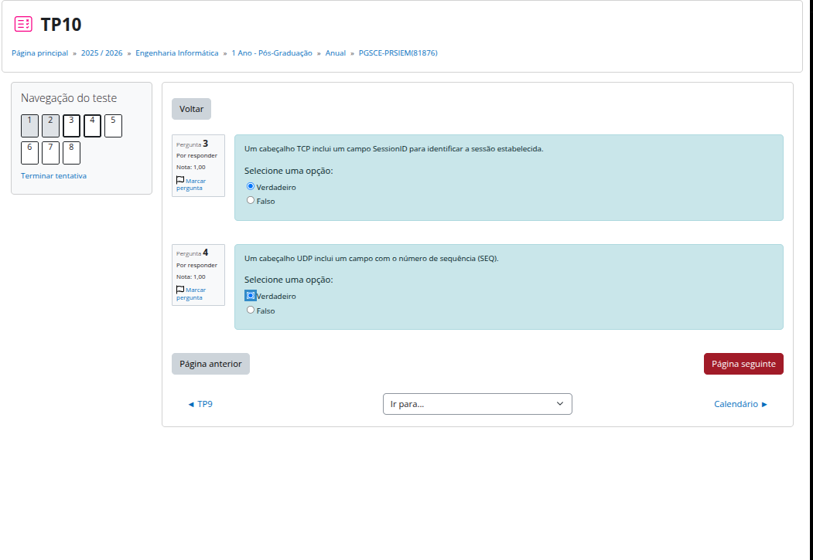
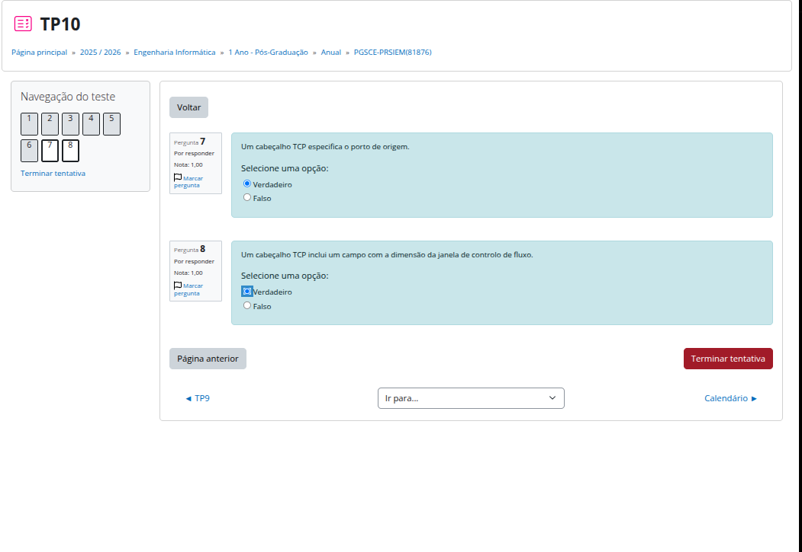

TP10


Thought for 15s
TP10 — Pergunta 1 ✅
Ação — preencher a tabela TCP
Direção	Seq	Ack	Len
A -> B	203	232	151
B -> A	232	354	143
A -> B	354	375	93
B -> A	375	447	179
A -> B	447	554	0
A -> B	447	554	163
B -> A	554	610	180
A -> B	610	734	130
Objetivo

Perceber que em TCP:

Ack = próximo byte que espero receber do outro lado

e que:

próximo Seq = Seq atual + Len

⚠️ Se Len = 0, o número de sequência não avança.

Como pensar 🧠

Exemplo:

Primeira linha:

A -> B
Seq = 203
próximo Seq de A aparece depois como 354

Logo:

Len = 354 - 203 = 151

Outro exemplo:

B -> A
Seq = 232
Len = 143

Então A deve confirmar:

Ack = 232 + 143 = 375
Pitfalls
Ack não confirma a própria mensagem — confirma dados recebidos do outro lado.
Seq só avança com dados, isto é, com Len > 0.
Um pacote com Len = 0 é normalmente só ACK, logo mantém o mesmo Seq.
Não somar Ack + Len; o correto é Seq + Len.
Pergunta de decisão

Queres que façamos agora a Pergunta 2 do TP10 da mesma forma, com raciocínio TCP passo a passo?

ja estou perdido. estava a somar a Seq. com o akcnowledgement.. ahhh devo fazzer seq + len para o proximo passo ? ?  Nao sei que numros hei de por para seq.


Sim — para descobrir o próximo Seq do mesmo emissor, fazes:

próximo Seq desse emissor = Seq anterior desse emissor + Len anterior desse emissor

Mas cuidado: não somas Seq + Ack. O Ack pertence ao fluxo no sentido contrário.

Ação — pensa em duas linhas separadas

Mantém dois contadores mentais:

A envia com Seq: 203 → ...
B envia com Seq: 232 → ...

Agora atualizas cada lado só quando esse lado envia dados.

Fluxo A → B
Mensagem A → B	Seq	Len	Próximo Seq de A
1	203	151	203 + 151 = 354
2	354	93	354 + 93 = 447
3	447	0	447 + 0 = 447
4	447	163	447 + 163 = 610
5	610	130	610 + 130 = 740

Então os Seq que faltam em A são:

447
610
Fluxo B → A
Mensagem B → A	Seq	Len	Próximo Seq de B
1	232	143	232 + 143 = 375
2	375	179	375 + 179 = 554
3	554	180	554 + 180 = 734

Então o Seq que falta em B é:

375
Para preencher agora

Na tua tabela:

B -> A    Seq = 375
A -> B    Seq = 447
A -> B    Seq = 610

E o Ack em branco da linha:

A -> B    Seq 447    Ack = 554    Len 163

porque A já recebeu de B até:

375 + 179 = 554
Objetivo

Separar TCP em dois fluxos independentes:

Seq de A só depende dos dados enviados por A.
Seq de B só depende dos dados enviados por B.
Ack de A confirma dados recebidos de B.
Ack de B confirma dados recebidos de A.
Pitfalls
Nunca usar Seq + Ack.
Não misturar o contador de A com o contador de B.
Len = 0 mantém o mesmo Seq.
O Ack aponta para o próximo byte esperado, não para o último recebido.
Pergunta de decisão

Queres que eu valide contigo só os campos que ainda faltam antes de carregares em Página seguinte?

certo ? 

Quase tudo certo ✅

Só tens 1 campo errado:

B -> A   Seq 554   Ack 610   Len = 180

Tu puseste 55, mas o correto é 180.

Ação — corrige só este campo

Na linha:

B -> A   554   610   [ 55 ]

substitui por:

180
Objetivo

Esse Len vem do próximo Ack de A:

Ack final de A = 734
Seq de B atual = 554

Logo:

Len de B = 734 - 554 = 180
Tabela final correta
Direção	Seq	Ack	Len
A -> B	203	232	151
B -> A	232	375	143
A -> B	354	375	93
B -> A	375	447	179
A -> B	447	554	0
A -> B	447	554	163
B -> A	554	610	180
A -> B	610	734	130

Depois disso podes avançar para Página seguinte.

----

# 2a pergunta

próximo Seq desse emissor = Seq anterior desse emissor + Len anterior desse emissor

# mijnhas respostas



    ERRADO 

    Len = próximo Seq de A - Seq atual de A
    Len = 306 - 141
    Len = 165

## Validação — Pergunta 2

Tens **quase tudo certo** ✅

Há **1 erro**:

```text
A -> B   Seq 141   Ack 158   Len = 169
```

O correto é:

```text
Len = 165
```

---

## Ação — corrige só o primeiro `Len`

Troca:

```text
169
```

por:

```text
165
```

---

## Porquê?

O próximo `Seq` de A aparece aqui:

```text
A -> B   Seq = 306
```

Então:

```text
Len = próximo Seq de A - Seq atual de A
Len = 306 - 141
Len = 165
```

---

## Tabela final correta

| Direção | Seq | Ack |     Len |
| ------- | --: | --: | ------: |
| A -> B  | 141 | 158 | **165** |
| B -> A  | 158 | 306 |     169 |
| A -> B  | 306 | 327 |     161 |
| B -> A  | 327 | 467 |     135 |
| A -> B  | 467 | 462 |       0 |
| A -> B  | 467 | 462 |     145 |
| B -> A  | 462 | 612 |     120 |
| A -> B  | 612 | 582 |     134 |

Depois desta correção, podes avançar.


# PERGUINTA 3 E 4 



ERRADO 

## Pergunta 3

A resposta correta é:

```text
Falso
```

### Objetivo

TCP **não tem campo `SessionID`** no cabeçalho.

A sessão TCP é identificada pelo conjunto:

```text
IP origem + porta origem + IP destino + porta destino + protocolo TCP
```

---

## Pergunta 4

A resposta correta é:

```text
Falso
```

### Objetivo

UDP **não tem campo `SEQ`** no cabeçalho.

O cabeçalho UDP é muito simples:

```text
Source Port
Destination Port
Length
Checksum
```

---

## Ação

Corrige ambas para:

```text
Pergunta 3 = Falso
Pergunta 4 = Falso
```

Depois podes avançar.


---

# pERGUNTA 5 & 6


- TODOS OS SEGMENTOS tcp recebido nao tem de ser confirmados indicidualmentre usa ACK cumulativo.

## Pergunta 5

A tua resposta está **certa** ✅

```text
Falso
```

Uma janela de controlo de fluxo **pode ficar temporariamente a zero**, quando o recetor não tem espaço no buffer.
Mas dizer que pode ser mantida a zero **durante toda a sessão TCP** é errado, porque isso bloqueava a comunicação permanentemente.

---

## Pergunta 6

A tua resposta está **errada**.

A resposta correta é:

```text
Falso
```

TCP usa **ACK cumulativo**. Não precisa confirmar cada segmento individualmente.

Exemplo:

```text
Segmento 1: bytes 100–199
Segmento 2: bytes 200–299
Segmento 3: bytes 300–399
```

O recetor pode enviar só:

```text
ACK = 400
```

Isto significa:

```text
Recebi tudo até ao byte 399.
Agora espero o byte 400.
```

---

## Ação

Corrige apenas:

```text
Pergunta 6 = Falso
```

Depois podes avançar.
---

# Pergunta 7 e 8



CERTOOOOOOOOOOOOOOOOO!!!!!!!!!!!!!!!!!!!!!!!!

## Pergunta 7

A tua resposta está **certa** ✅

```text
Verdadeiro
```

O cabeçalho TCP tem:

```text
Source Port
Destination Port
Sequence Number
Acknowledgment Number
Window Size
...
```

Logo, TCP especifica o **porto de origem**.

---

## Pergunta 8

A tua resposta está **certa** ✅

```text
Verdadeiro
```

TCP inclui o campo **Window Size**, usado no **controlo de fluxo**.

---

## Ação

Podes carregar em:

```text
Terminar tentativa
```

Antes disso, garante só que corrigiste:

```text
Pergunta 6 = Falso
```
