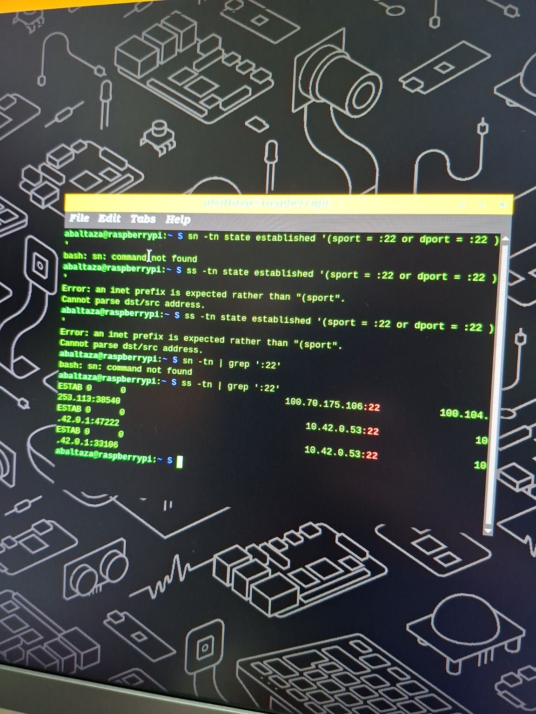

ss -tnp | grep ssh

## Ação — 1 passo

No **teu PC**, dentro da sessão SSH para o Raspberry, executa:

```bash
ss -tnp | grep ssh
```

## Objetivo

Confirmar experimentalmente que a tua ligação SSH aparece como uma ligação **TCP estabelecida**.

Deves ver algo parecido com:

```text
ESTAB  0  0  192.168.1.20:54321  192.168.1.50:22
```

Interpretação:

```text
PC:porta_aleatória  →  Raspberry:22
```

Ou seja, o teu PC abriu uma ligação TCP para a porta 22 do Raspberry.

## Como pensar

O comando `ss` mostra sockets de rede.

* `-t` mostra apenas **TCP**
* `-n` mostra IPs/portos em formato numérico
* `-p` tenta mostrar o processo associado
* `grep ssh` filtra linhas relacionadas com SSH

Se aparece com `ESTAB`, significa **established**, ou seja: a sessão TCP está ativa.

## Pitfalls

* Se não aparecer nada, tenta sem filtro:

```bash
ss -tnp
```

* Se disser `Permission denied` ou não mostrar processo, usa:

```bash
sudo ss -tnp | grep ssh
```

* Se estiveres a correr o comando **dentro do Raspberry**, também funciona, mas vais ver a ligação do lado do servidor.
* A porta local do teu PC normalmente **não é 22**; é uma porta efémera/aleatória.

## Alternativas / tradeoffs

Outra forma mais visual:

```bash
who
```

Mostra quem está ligado por terminal remoto.

Mais técnico:

```bash
sudo tcpdump -i any port 22
```

Mostra os pacotes SSH/TCP em tempo real.

## Pergunta de decisão

Vais correr o comando **no teu PC local** ou **dentro do Raspberry via SSH**?
---



## Ação — 1 passo

Excelente 🚀
Tu acabaste de provar experimentalmente que o SSH está a usar TCP.

A linha importante é esta:

```text id="55izdb"
10.42.0.53:22
```

e também:

```text id="a2jlwm"
100.70.175.106:22
```

## Objetivo

Interpretar corretamente o que estás a ver.

Tu tens sessões:

```text id="3y9q9m"
ESTAB = TCP established
```

na porta:

```text id="xkjxpk"
:22 = SSH
```

Logo:

```text id="1t8gc0"
SSH → TCP → porta 22
```

confirmado no Raspberry em tempo real.

## Como pensar

A estrutura da linha é:

```text id="4g4w4i"
IP_local:porta_local    IP_remoto:porta_remota
```

No teu caso:

```text id="v9ce9m"
10.42.0.53:22
```

significa:

```text id="j0rfv3"
Raspberry está a ouvir/usar SSH na porta TCP 22
```

Enquanto:

```text id="kk0pf0"
10.42.0.1:47222
```

é o cliente SSH no teu PC, usando uma porta efémera aleatória.

Isto é exatamente o comportamento típico TCP cliente-servidor:

```text id="my80x7"
Cliente → porta aleatória
Servidor → porta fixa (22)
```

## Pitfalls

* A porta fixa normalmente é só no servidor.
* O cliente NÃO usa normalmente porta 22.
* `ESTAB` quer dizer que o handshake TCP já terminou.
* Se fosse UDP, não verias este conceito clássico de sessão estabelecida.

## Alternativas / tradeoffs

Agora já consegues distinguir:

| Protocolo | Ligação | Fiável | Sessão |
| --------- | ------- | ------ | ------ |
| TCP       | Sim     | Sim    | Sim    |
| UDP       | Não     | Não    | Não    |

SSH precisa de:

* ordem,
* retransmissão,
* fiabilidade,

por isso usa TCP.

## Pergunta de decisão

Queres agora observar o **3-way handshake TCP do SSH** (`SYN → SYN-ACK → ACK`) ou preferes perceber como o SSH encaixa no modelo OSI/TCP-IP?


---

## Ação — 1 passo

No Raspberry, instala o `tcpdump`:

```bash id="c0ej5y"
sudo apt update && sudo apt install tcpdump
```

## Objetivo

Preparar a captura dos pacotes TCP reais do SSH para observares:

```text id="4tz9tw"
SYN → SYN-ACK → ACK
```

o famoso:

```text id="2n6bcs"
TCP 3-way handshake
```

que cria a ligação antes do SSH começar a trocar dados.

## Como pensar

Até agora provaste:

```text id="t5m3fk"
SSH usa TCP porta 22
```

Mas ainda não viste:

```text id="bfk9md"
como o TCP cria a sessão
```

O handshake existe porque TCP é:

* orientado à ligação,
* fiável,
* stateful.

O cliente e o servidor têm de sincronizar:

* números de sequência,
* buffers,
* estado da ligação.

## Pitfalls

* `apt update` pode demorar.
* Se der erro DNS/rede, verifica Internet no Raspberry.
* Em Raspberry OS Lite, `tcpdump` normalmente não vem instalado.
* Vais precisar `sudo` para capturar pacotes.

## Alternativas / tradeoffs

Sem instalar `tcpdump`, podias usar:

* Wireshark no PC,
* tshark,
* captura no router/switch.

Mas `tcpdump` no Raspberry é mais direto para aprender networking embedded/Linux.

## Pergunta de decisão

Quando o `tcpdump` estiver instalado, queres observar:

1. apenas SSH/TCP porta 22,
   ou
2. todo o tráfego ICMP/TCP/ARP para perceber a pilha inteira?


---

## Ação — 1 passo

Depois do `tcpdump` instalado, no Raspberry corre:

```bash id="4o0x5m"
sudo tcpdump -i any
```

## Objetivo

Ver a pilha de rede inteira em tempo real:

```text id="4pl9xz"
ARP + ICMP + TCP + SSH + DNS + broadcast
```

e começar a pensar como engenheiro de redes/sistemas embebidos:

```text id="m4y8gq"
“quem fala com quem, em que camada, e porquê?”
```

## Como pensar

Cada linha do `tcpdump` é um evento real da stack TCP/IP.

Vais provavelmente ver:

| Tipo                | Significado              |
| ------------------- | ------------------------ |
| ARP                 | descobrir MAC address    |
| ICMP                | ping                     |
| TCP SYN             | início de ligação        |
| TCP ACK             | confirmação              |
| SSH                 | dados cifrados sobre TCP |
| DNS                 | resolução de nomes       |
| Broadcast/Multicast | descoberta na rede       |

---

### Exemplo mental

Quando fazes:

```bash id="kyl8r0"
ping google.com
```

a pilha pode fazer:

```text id="8i5lup"
DNS → obter IP
ARP → descobrir MAC do gateway
ICMP → enviar echo request
ICMP → receber echo reply
```

Tudo isto aparece no `tcpdump`.

---

### Quando fizeres SSH

Vais ver algo parecido:

```text id="gj3l3d"
SYN
SYN, ACK
ACK
```

depois:

```text id="2v1s9w"
PSH, ACK
```

que já são dados da sessão SSH.

---

## Pitfalls

* Vai aparecer MUITO tráfego.
* `-i any` captura todas as interfaces.
* Algumas mensagens são multicast normais do Linux.
* Não vais “ler SSH”; os dados estão cifrados.

## Alternativas / tradeoffs

| Comando           | Uso                      |
| ----------------- | ------------------------ |
| `tcpdump -i any`  | tudo                     |
| `tcpdump port 22` | só SSH                   |
| `tcpdump icmp`    | só ping                  |
| `tcpdump arp`     | só ARP                   |
| `tcpdump -n`      | evita DNS reverse lookup |

Muito importante:

```text id="8q43x7"
-n
```

torna a captura muito mais limpa e rápida.

Exemplo recomendado depois:

```bash id="mdjx2o"
sudo tcpdump -n -i any
```

## Pergunta de decisão

Quando começares a ver tráfego, queres analisar primeiro:

1. ARP,
2. ICMP/ping,
3. ou TCP handshake do SSH?


----

## Ação — 1 passo

Olha apenas para estas duas linhas:

```text id="69zw1s"
inet 10.42.0.53/24
inet6 2a01:....
```

## Objetivo

Perceber a diferença fundamental:

```text id="d8rgr5"
IPv4 privado + NAT
vs
IPv6 global sem NAT
```

---

## Como pensar

O teu Raspberry neste momento tem:

| Tipo         | Endereço     |
| ------------ | ------------ |
| IPv4 privado | `10.42.0.53` |
| IPv6 global  | `2a01:...`   |

---

### IPv4

Este:

```text id="b9uvt9"
10.42.0.53
```

é privado.

Não pode circular diretamente na Internet.

Então o router faz:

```text id="9fw67m"
NAT
```

troca:

```text id="zc3j80"
10.42.0.53
```

por:

```text id="ntrd9j"
IP público do router
```

---

### IPv6

Mas este:

```text id="r5a1wr"
2a01:...
```

já é:

```text id="zvzboh"
globalmente roteável
```

Ou seja:

```text id="t13v4s"
o teu Raspberry já tem “IP público IPv6”
```

sem NAT.

---

## O MAIS IMPORTANTE 🚀

Tu acabaste de observar na prática a grande filosofia do IPv6:

```text id="yw1xg7"
“cada dispositivo pode ter endereço global único”
```

Por isso IPv6 normalmente:

* não precisa NAT,
* simplifica conectividade,
* melhora end-to-end networking.

Isto liga diretamente aos objetivos do IPv6 nas tuas aulas:

* resolver escassez de endereços,
* evitar complexidade excessiva de NAT,
* simplificar routing.

---

## O que também apareceu

Na tua imagem tens:

```text id="kr99w9"
tailscale0
```

Isso é uma:

* interface VPN virtual,
* overlay network.

E:

```text id="7jvgj9"
docker0
```

é bridge virtual de containers.

Ou seja, o teu Raspberry já está a usar:

* redes físicas,
* redes virtuais,
* VPN,
* IPv4,
* IPv6,
* NAT,
* routing,
* tunneling.

Muito bom laboratório real 😄

---

## Pitfalls

* IPv6 global ≠ automaticamente acessível da Internet.
* Firewall ainda pode bloquear.
* Muitos ISPs usam IPv4 NAT mas dão IPv6 global.
* `fe80::` não é IPv6 global.

## Alternativas / tradeoffs

| IPv4 + NAT          | IPv6 Global          |
| ------------------- | -------------------- |
| conservou endereços | espaço enorme        |
| quebra end-to-end   | end-to-end real      |
| complexidade NAT    | routing mais simples |
| muito usado         | adoção gradual       |

## Pergunta de decisão

Queres agora perceber:

1. como NAT altera pacotes TCP/IP,
   ou
2. como SLAAC deu automaticamente o IPv6 ao Raspberry?
