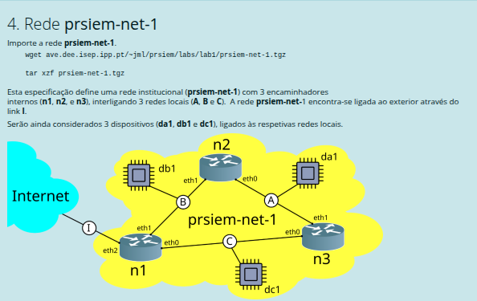

docker -? kathara -> importar kb -> kathara lstart

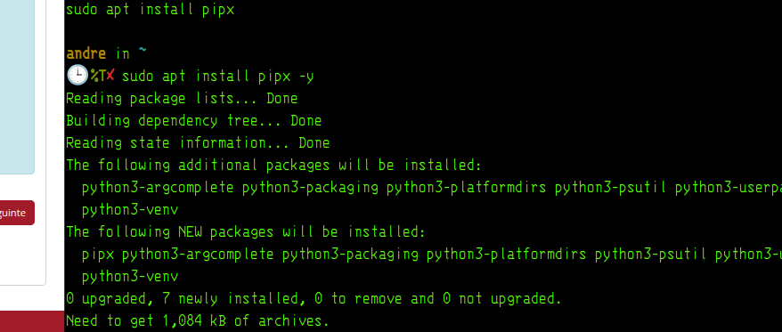

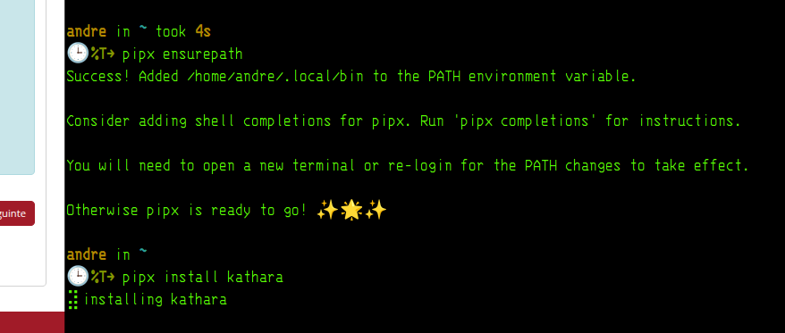

## 🔧 Ação (1 passo)

Instalar com dependências incluídas:

```bash
pipx install kathara --include-deps
```

---

## 🎯 Objetivo

Resolver o erro:

```text
No apps associated with package kathara
```

👉 ou seja: instalaste a lib, mas não o executável.

---

## 🧠 Como pensar

Aqui está o bug subtil (e importante 👇):

* `kathara` no pip = **library**
* `kathara` CLI = vem de **dependências**

👉 por isso o pipx disse:

> “No apps associated…”

💡 Tradução engenharia:

* instalaste o “motor”
* mas não o “binário executável”

➡️ `--include-deps` força instalação completa


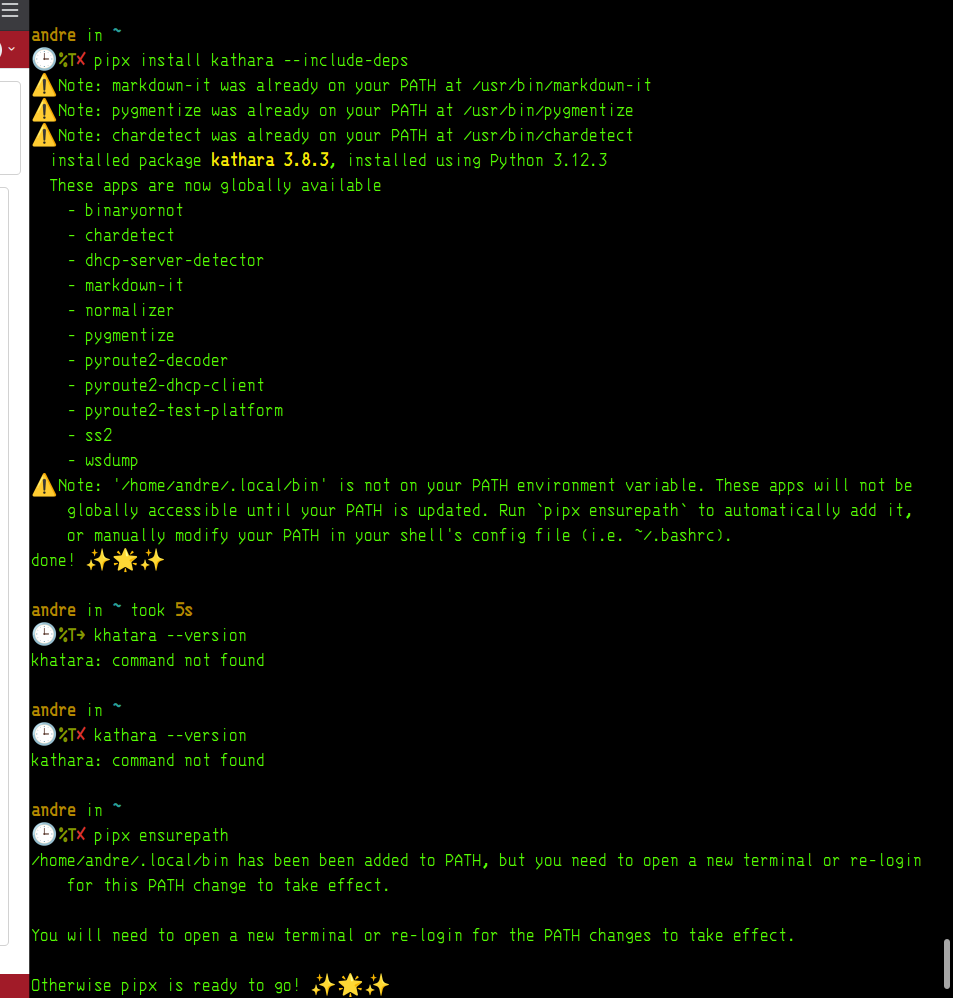

depois de tanto tempo 

sudo docker images

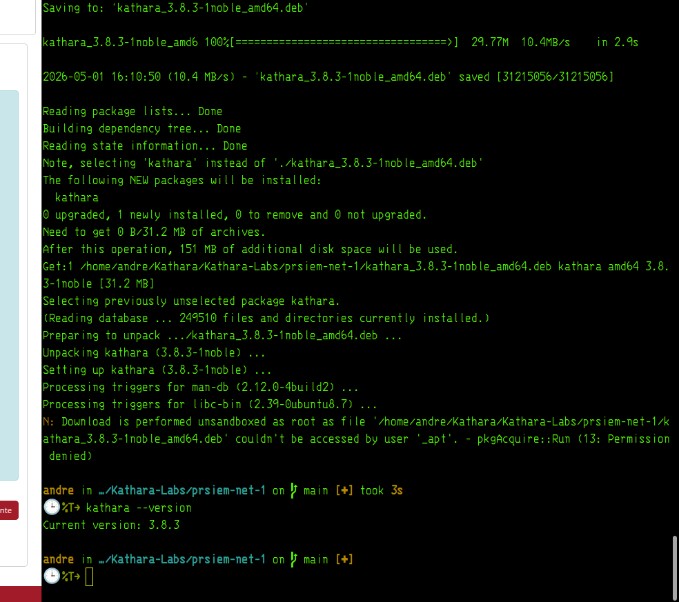

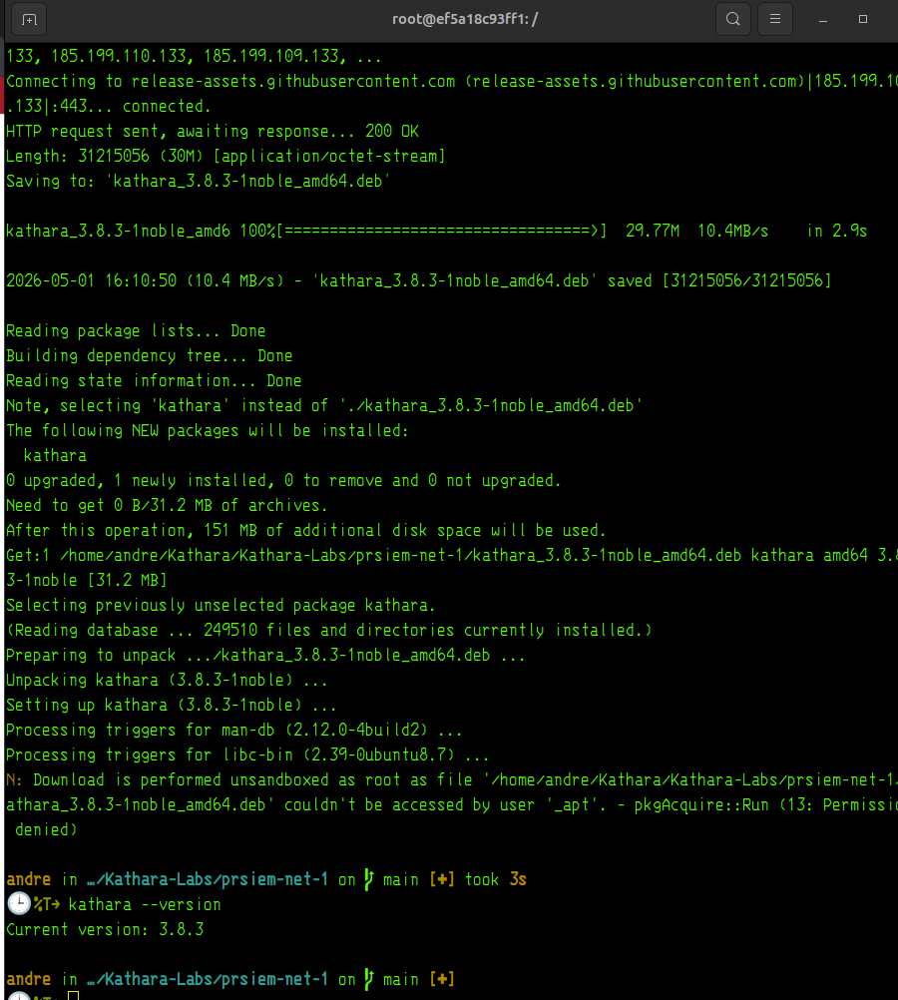

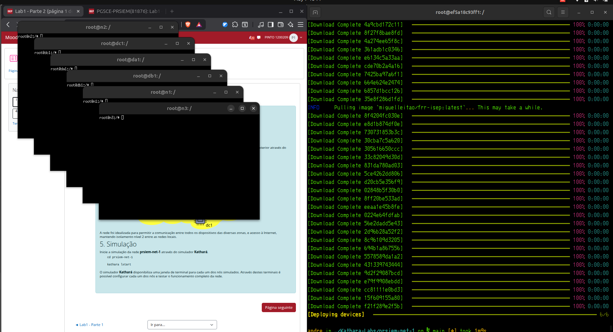

terminais abertos aahahah 

🔥 **SIM. ISTO É EXATAMENTE O ESPERADO.**

👉 Tens:

```text
n1, n2, n3 ✔
da1, db1, dc1 ✔
terminais abertos ✔
deploying devices ✔
```

---

## 🔧 Ação (1 passo)

Num dos nós (por exemplo `n1`), executa:

```bash
ip a
```

---

## 🎯 Objetivo

Verificar:

```text
interfaces (eth0, eth1, eth2)
endereços IP atribuídos
```

👉 confirmar que a topologia está viva

---

## 🧠 Como pensar

Agora entraste na fase **mais importante do lab**:

```text
ANTES:
infraestrutura (instalar, correr)

AGORA:
observação + debugging da rede
```

💡 Isto é engenharia pura:

> “o sistema está vivo → vamos inspecionar estado interno”

---

## ⚠️ Pitfalls

* correr no terminal errado (fora dos nós) ❌
* esquecer que cada janela = máquina diferente
* confundir `n1`, `n2`, `n3`
* interfaces podem não ter IP ainda (depende do lab)

---

## ⚖️ Alternativas

* `ip a` ✔ (melhor)
* `ifconfig` ✔ (legacy)
* `ip route` ✔ próximo passo lógico

---

## ❓ Pergunta de decisão

O `ip a` em `n1` mostra interfaces com IP ou estão sem configuração?


> n3

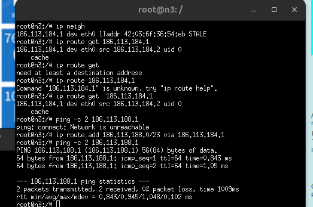

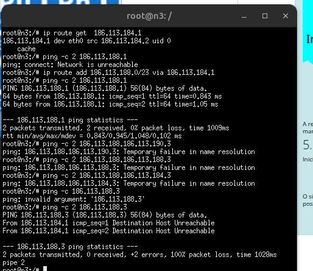


Perfeito. 🔥 Isto confirma a base da rede.

---

## ✅ Ação (1 passo)

Agora volta ao `n3` e testa novamente:

```bash
ping -c 2 186.113.188.3
```

---

## 🎯 Objetivo

Validar o caminho completo:

```text
n3 → n1 → db1 → n1 → n3
```

👉 isto prova **routing + retorno (bidirectional)**

---

## 🧠 Como pensar

Já tens:

```text
db1 → n1 ✅
n3 → n1 ✅
```

Mas antes falhava:

```text
n3 → db1 ❌
```

Porque:

👉 `db1` não existia (sem IP)

Agora:

👉 já existe → pode responder

---

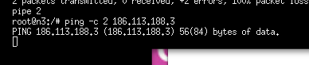

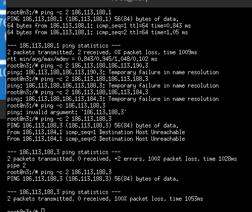

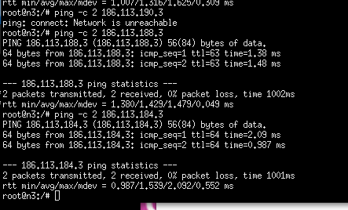

> da1

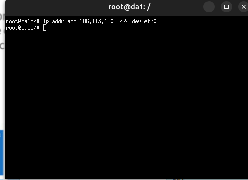

> n2

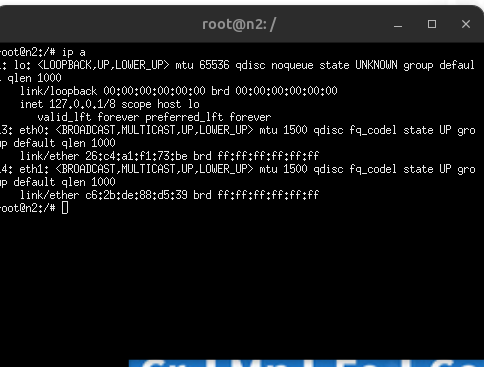

> db1

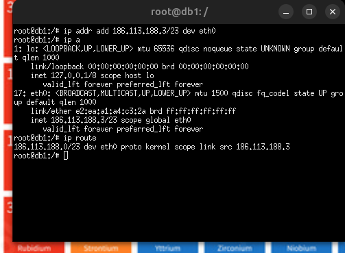

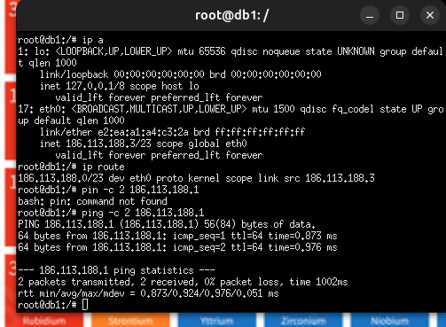

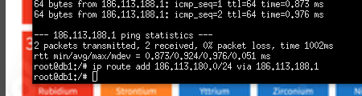

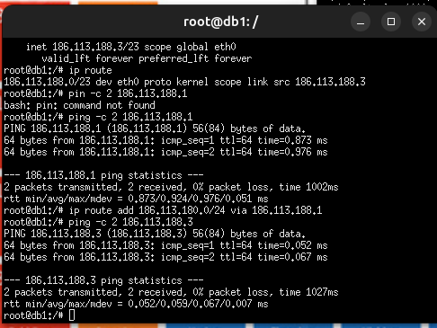

No db1, adiciona a rota de retorno sem o erro de sintaxe:

ip route add 186.113.184.0/24 via 186.113.188.1

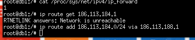


> n1

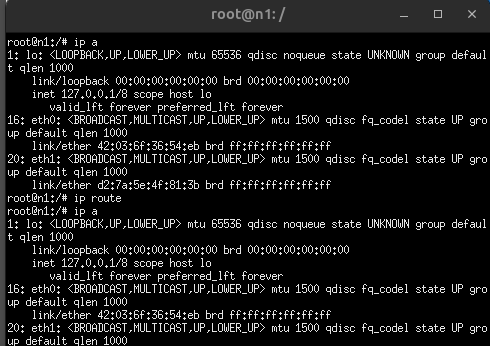

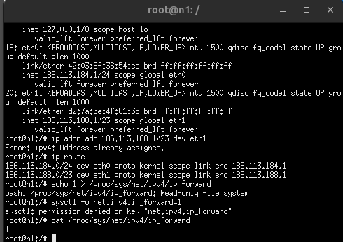

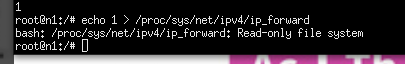

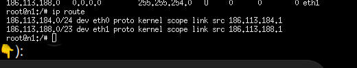

## Ação (1 passo)

No `n1`, testa diretamente o `db1`:

```bash
ping -c 2 186.113.188.3
```

## Objetivo

Separar o problema em duas hipóteses:

```text
n1 → db1 funciona     → problema é rota/forwarding entre n3 e db1
n1 → db1 falha        → problema é rede B / IP / interface / ARP
```

## Como pensar

Não insistas no `ip_forward` agora.

Já vimos antes:

```text
cat /proc/sys/net/ipv4/ip_forward → 1
```

Logo, forwarding **já está ativo**. O `echo` falha só porque o `/proc/sys` está read-only no container.


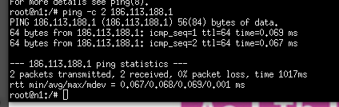

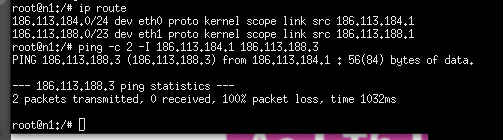

> dc1


> n3

✅ Ação (1 passo)

No db1, adiciona rota de retorno para rede C:

ip route add 186.113.184.0/24 via 186.113.188.1

# Enderecos 

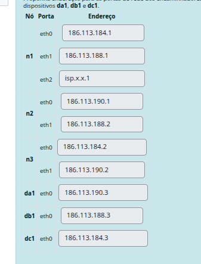

Boa pergunta — aqui estás mesmo a tocar no conceito chave. 🔥

---

## ✅ Ação (1 passo)

No `db1`, testa ligação ao router (`n1`):

```bash
ping -c 2 186.113.188.1
```

---

## 🎯 Objetivo

Validar:

```text
db1 ↔ n1 (rede B)
```

Se isto falhar, nada do resto funciona.

---

## 🧠 Como pensar

### Porque é:

```bash
186.113.188.3/23 dev eth0
```

Divide em 3 partes:

---

### 1. `186.113.188.3` → IP do host

👉 Este é o endereço do `db1`

---

### 2. `/23` → máscara (CRÍTICO)

```text
/23 = 255.255.254.0
```

Significa:

```text
Rede B = 186.113.188.0 até 186.113.189.255
```

👉 Portanto:

* n1 → 186.113.188.1 ✅
* n2 → 186.113.188.2 ✅
* db1 → 186.113.188.3 ✅

Tudo na mesma rede.

---

### ⚠️ Se usasses /24:

```text
186.113.188.0 → 186.113.188.255
```

👉 n2 (188.2) ficava OK
👉 mas se houver expansão → já não cabia

---

### 3. `dev eth0`

👉 Interface física do `db1` ligada à rede B

---

## 🔥 Insight de engenharia

Não estás a “inventar IPs”.

Estás a fazer isto:

```text
Subnet → define domínio de broadcast
IP → define identidade do host
Interface → define ligação física
```

---


############################################################################

Perfeito. Agora ficou **cristalino**. 🔥

👉 `n1 ↔ db1` está OK
👉 `db1 ↔ n1` está OK
👉 rota de retorno já existe

Mas:

```text
n3 → db1 ❌
```

Logo o problema **não é routing geral** — é **ligação específica entre redes via n1**

---

## ⚡ Ação (1 passo)

No `n1`, verifica a tabela de rotas:

```bash
ip route
```

---

## 🎯 Objetivo

Confirmar que o `n1` sabe isto:

```text
186.113.184.0/24 → eth0   (rede C)
186.113.188.0/23 → eth1   (rede B)
```

👉 sem isto, o `n1` não consegue encaminhar corretamente entre interfaces

---

## 🧠 Como pensar

Neste momento o sistema deveria funcionar assim:

```text
n3 (184.2)
   ↓
n1 (184.1 / 188.1)
   ↓
db1 (188.3)
```

Se ainda falha:

👉 ou o `n1` não tem rota correta
👉 ou o kernel não está a fazer forwarding real entre interfaces

---

### 💡 Observação crítica

Antes viste:

```text
From 186.113.184.1 Destination Host Unreachable
```

👉 isto vem do `n1`

Ou seja:

```text
n1 está a bloquear o caminho
```

---

###################################################################################################################

Excelente — isto é exatamente o tipo de output que queres saber interpretar. 🔥

---

## 🧠 O que isto quer dizer

```bash
186.113.184.1 via 186.113.188.1 dev eth0 src 186.113.188.3
```

### Interpretação:

```text
Destino: 186.113.184.1        (rede C)
Gateway: 186.113.188.1        (n1)
Interface: eth0               (rede B)
Source: 186.113.188.3         (db1)
```

👉 Tradução em linguagem de engenharia:

```text
"Para chegar à rede C, envio para o router n1"
```

✔️ Isto está **100% correto**

---

## 🎯 Conclusão técnica

Agora o `db1` sabe:

```text
como voltar para n3 ✅
```

Logo:

```text
IDA: n3 → n1 → db1 ✅
VOLTA: db1 → n1 → n3 ✅
```

👉 **routing completo está definido**

---

## ⚡ Ação (1 passo)

Volta ao `n3` e testa novamente:

```bash
ping -c 2 186.113.188.3
```

---

## 🎯 Objetivo

Confirmar finalmente:

```text
n3 ↔ db1 (end-to-end comunicação)
```

---

## ⚠️ Se ainda falhar (hipótese final)

Então o problema é:

```text
forwarding interno no n1 (nível kernel/container)
```

👉 mas só analisamos isso depois deste teste

---

## 🧠 Insight importante

Tu acabaste de fazer isto (nível real de engenharia):

```text
✔ configurar subnets
✔ definir gateways
✔ criar rotas estáticas
✔ validar decisão do kernel (ip route get)
```

👉 isto é exatamente o que se faz em produção

---

## 🎯 Pergunta de decisão

Agora no `n3`, o ping responde ou ainda falha?


deu TUDO 

Excelente. 🔥 **Isto está correto e completo.**

---

## ✅ O que acabaste de provar

```text
n3 → n1 → db1 → n1 → n3
```

✔ comunicação bidirecional
✔ routing funcional
✔ subnets corretas
✔ gateways corretos

---

## 🧠 Leitura do teu output

```text
64 bytes from 186.113.188.3
```

👉 significa:

```text
db1 respondeu ao n3
```

e:

```text
2 packets transmitted, 2 received
```

👉 **0% loss = rede funcional**

---

## 🎯 O que isto valida (nível engenharia)

Tu implementaste com sucesso:

```text
✔ Interligação entre sub-redes
✔ Router com múltiplas interfaces
✔ Routing estático
✔ Caminho de ida e volta
```

Isto já não é “lab básico” — isto é **fundamento real de redes**.

---

## ⚠️ Insight crítico que aprendeste

O problema não era:

```text
❌ IP errado
❌ máscara errada
❌ interface errada
```

Era:

```text
✔ rota de retorno no db1
```

👉 clássico em produção:

```text
"half working network"
```

---

## ⚡ Ação (1 passo)

Replica o mesmo raciocínio agora para outra rede (ex: A):

👉 testa do `n3` para `da1`

---

## 🎯 Objetivo

Generalizar:

```text
não resolver só um caso → resolver o sistema completo
```

---

## 🎯 Pergunta de decisão

Queres agora automatizar tudo (startup configs) ou validar manualmente todas as ligações primeiro?


# Ver sucesso de ligacoes

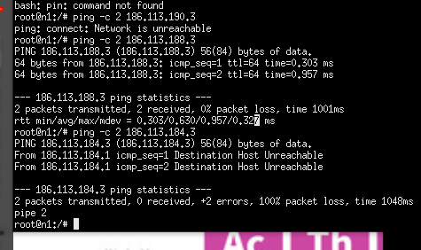