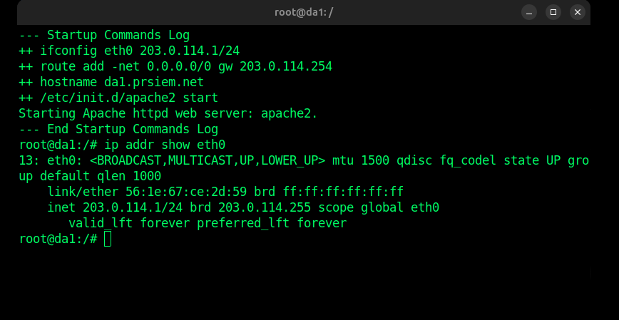

Objetivo

Confirmar que tens a topologia da aula prática pronta para arrancar no Kathará. O enunciado indica exatamente esta rede: prsiem-net-6, usada no laboratório IPv6 & SLACC .

Como pensar

Nesta prática, o foco já não é NAT/IPv4. Agora estás a entrar em:

IPv6 + SLAAC + Router Advertisement + Link-local addresses

A rede tem três zonas principais:

Rede	IPv4	IPv6
N	203.0.113.0/24	2023:3:27::/80
A	203.0.114.0/24	2023:3:27:a::/64
B	203.0.115.0/24	2023:3:27:b::/64

Isto está no enunciado da prática .

########################

No terminal de cada nó da1, da2, da3, lê o MAC da interface eth0:

ip link show eth0

Procura a linha:

link/ether xx:xx:xx:xx:xx:xx

Esse é o endereço MAC que vais pôr na tabela.

Objetivo

Preencher a primeira coluna real da secção 1.4 — Identificadores IPv6/EUI-64: o enunciado pede para registar os MACs de da1, da2 e da3 e depois determinar o identificador IPv6/EUI-64 de 64 bits.

Como pensar

Para gerar o EUI-64 a partir do MAC:

Exemplo conceptual:

MAC:    aa:bb:cc:dd:ee:ff
Divide ao meio:
aa:bb:cc     dd:ee:ff
Insere ff:fe no meio:
aa:bb:cc:ff:fe:dd:ee:ff
Inverte o bit U/L do primeiro byte.
Na prática: faz XOR com 0x02 no primeiro byte.
aa XOR 02 = a8
Agrupa em blocos IPv6 de 16 bits:
a8bb:ccff:fedd:eeff

Esse é o identificador IPv6/EUI-64.

# professor disse para mudar 3.2

203:3:27:14::->2023:3:27:A::

#####################

Em da1, executa:

ip addr show eth0

E copia duas coisas:

link/ether xx:xx:xx:xx:xx:xx
inet6 fe80::....
Objetivo

A pergunta 1.4 pede exatamente isto: registar os endereços MAC de da1, da2, da3 e determinar o identificador IPv6/EUI-64 de 64 bits desses nós. O enunciado também diz para confirmar primeiro os endereços configurados com ip addr show.

# Da1

link/ether 56:1e:67:ce:2d:59 brd ff:ff:ff:ff:ff:ff

Campo	Valor
Resposta 1 Pergunta 1	56:1e:67:ce:2d:59
Resposta 2 Pergunta 1	541e:67ff:fece:2d59
Objetivo

Converter o MAC de 48 bits de da1 para o identificador IPv6/EUI-64 de 64 bits.

Como pensar

Partimos do MAC:

56:1e:67:ce:2d:59

Dividimos em duas metades:

56:1e:67   ce:2d:59

Inserimos ff:fe no meio:

56:1e:67:ff:fe:ce:2d:59

Agora alteramos o bit U/L do primeiro byte:

56 XOR 02 = 54

Resultado final:

54:1e:67:ff:fe:ce:2d:59

Em formato IPv6, agrupado de 16 em 16 bits:

541e:67ff:fece:2d59

