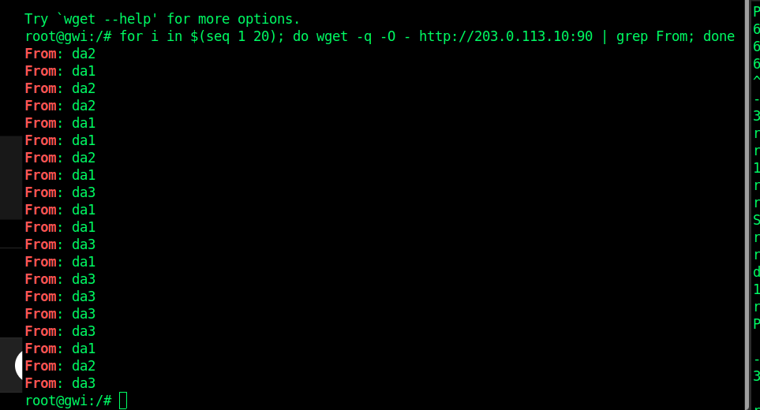

5. 2 

testar 20 vezes 

    for i in $(seq 1 20); do wget -q -O - http://203.0.113.10:90 | grep From; done

A porta 90 do router ra distribuiu os pedidos HTTP pelos servidores da1, da2 e da3. Como o modo usado é aleatório, as percentagens não são exatamente iguais, mas os três servidores receberam pedidos.