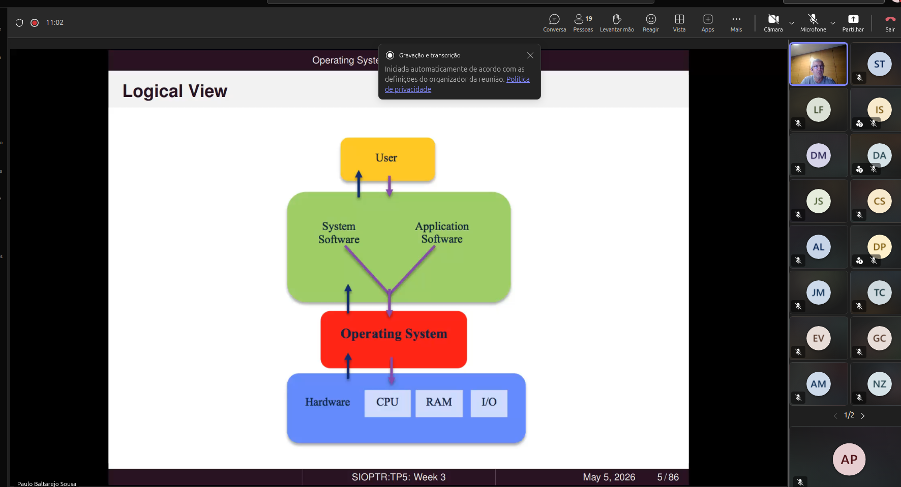

sitema operatvvo
A sua a utilidade e 0, serve para gerir o sistema!!!

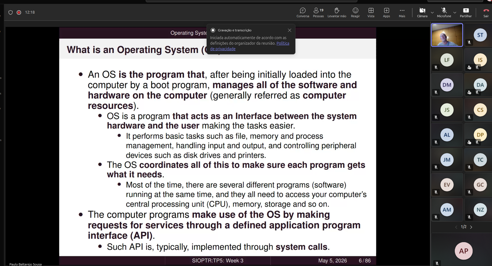

na pratica funciona como interface entre as sduas componentes. 

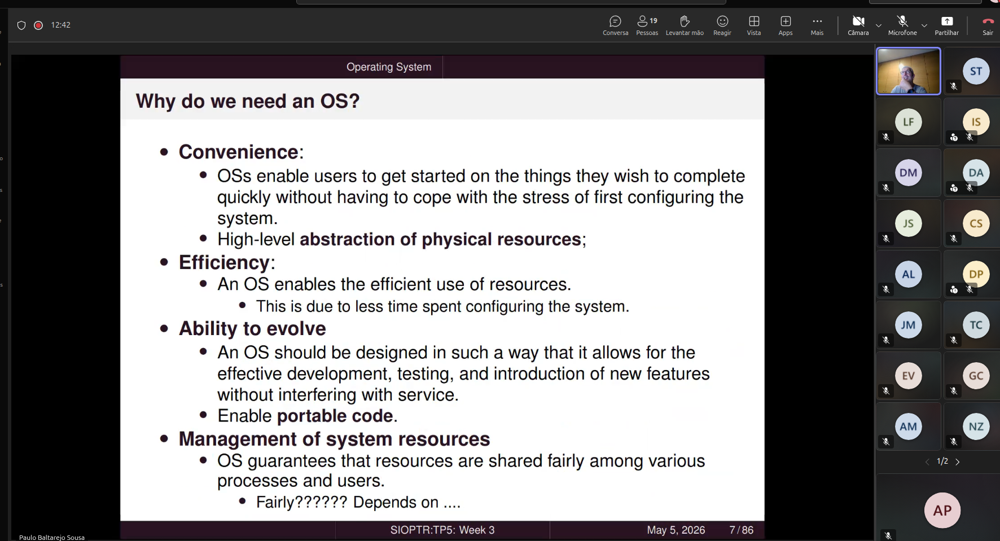

no contexto IOT por vezes as funcionalidades que apresentam de alguma forma limitads. 

camada de abestracacao. 

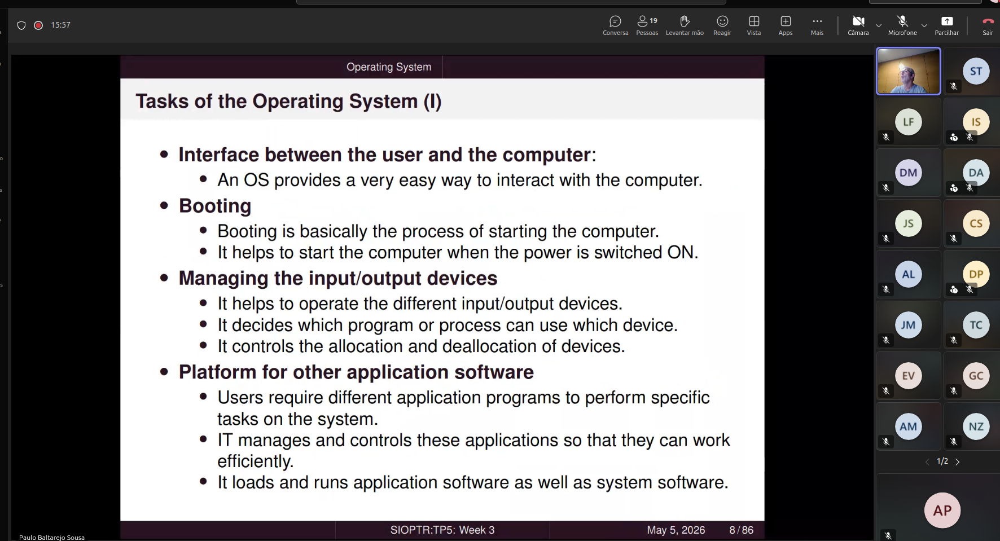

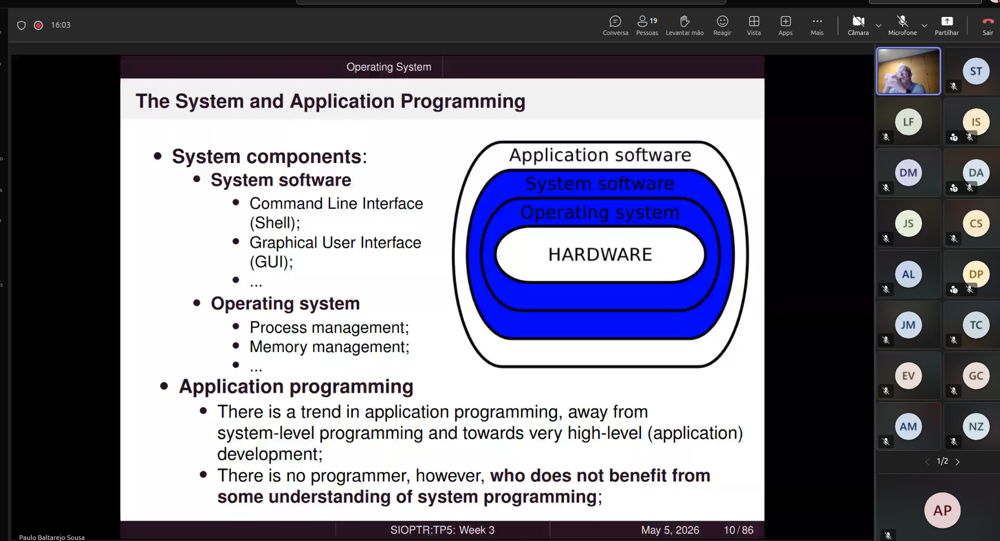

sitema operativo no seu todo. 
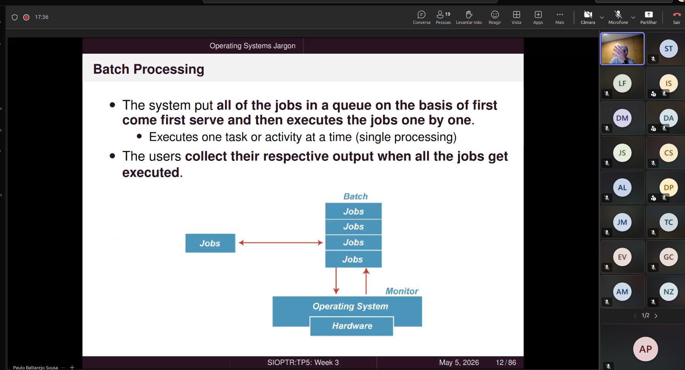

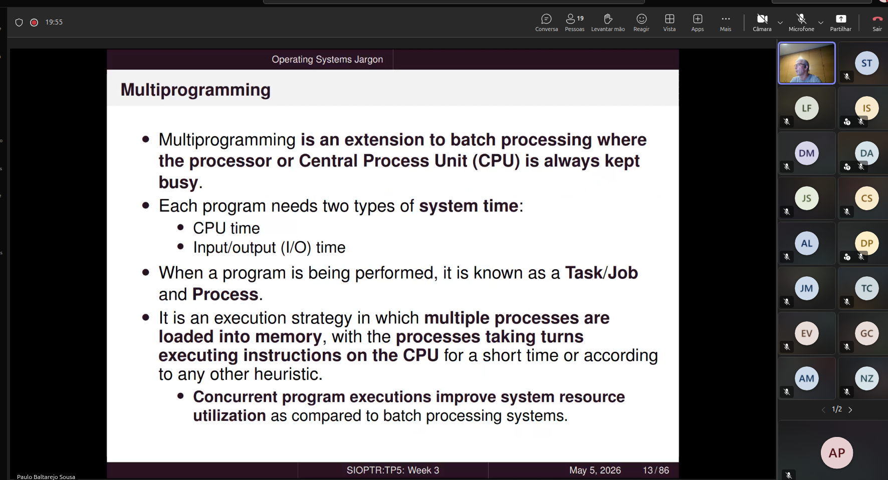

Varios processos ativos no sistema. 

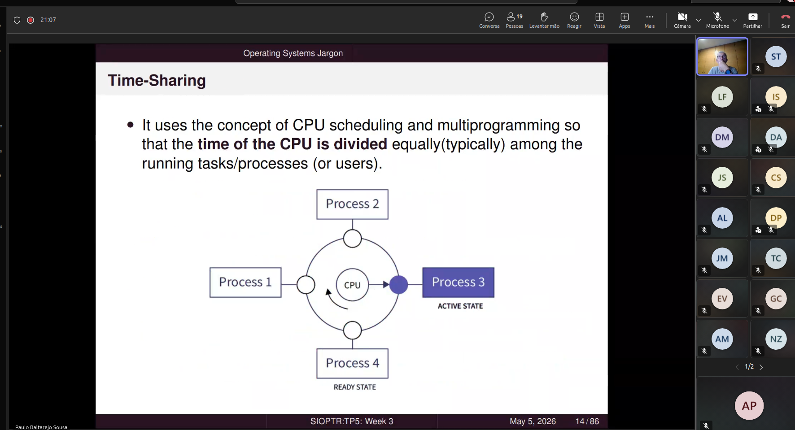

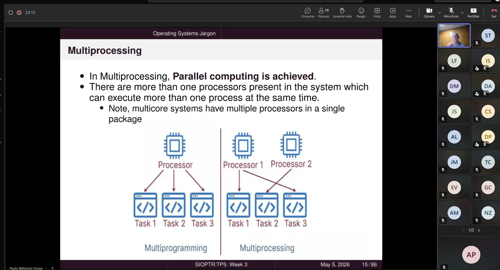

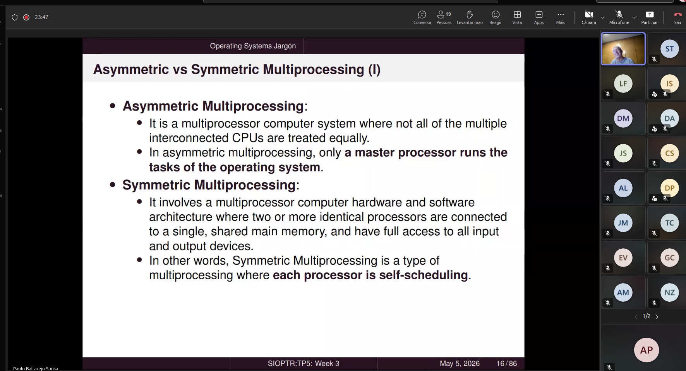

podemos ter N processos ao mesmo tempo. 

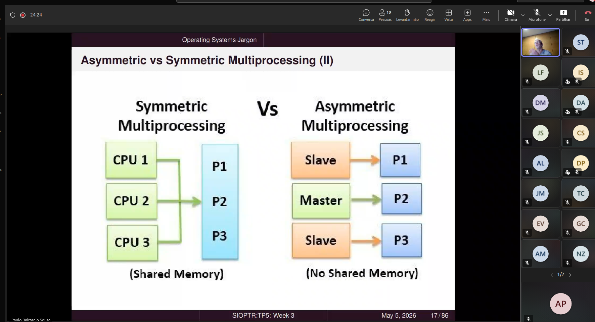

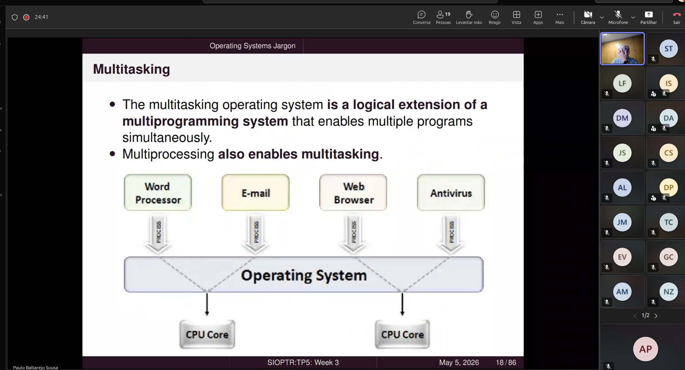

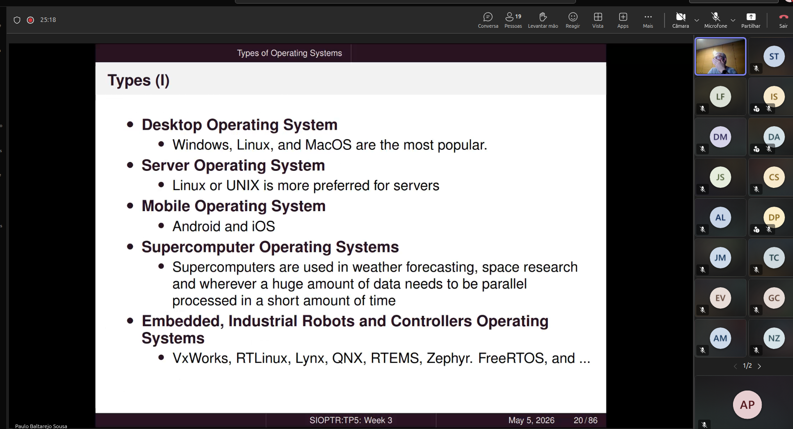

