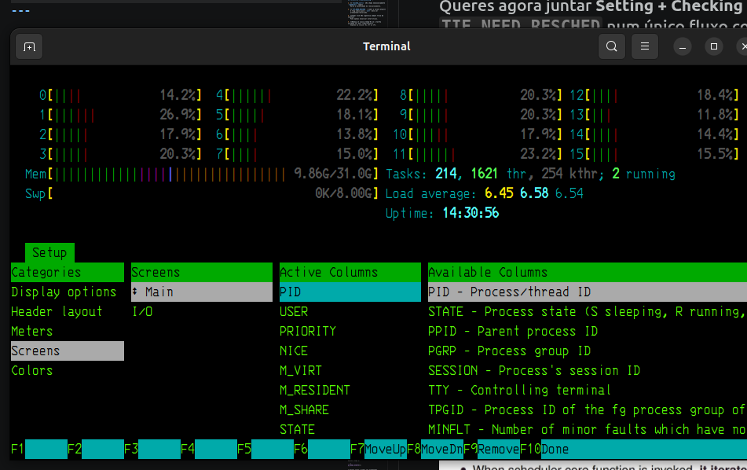
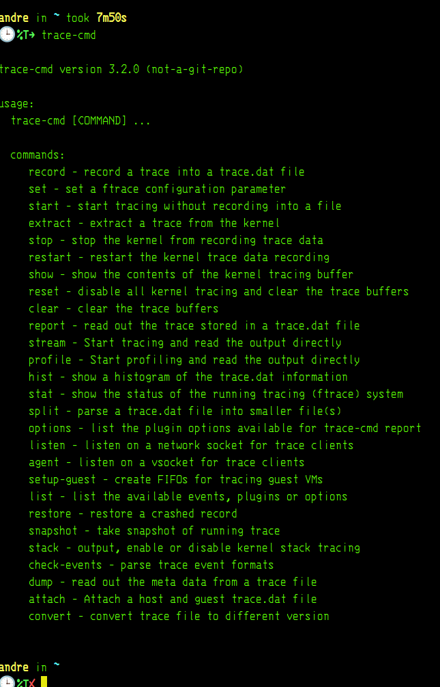

# htop

## Ação (1 passo)

No `htop`, sai de **Header Layout** e vai para:

```text
F2 Setup → Screens → Main → Columns
```

Aí procura/adiciona estas colunas:

| Conceito               | Nome provável no `htop`         | O que significa                               |
| ---------------------- | ------------------------------- | --------------------------------------------- |
| Estado da task         | `STATE` ou `S`                  | Running, sleeping, stopped, zombie            |
| CPU onde corre         | `PROCESSOR` ou `P`              | Core lógico onde a task está/esteve a correr  |
| Prioridade kernel      | `PRI`                           | Prioridade usada pelo scheduler               |
| Nice value             | `NI`                            | Ajuste de prioridade para tarefas normais     |
| Política de scheduling | `POLICY`, `SCHEDPOL` ou `SCHED` | `SCHED_OTHER`, `FIFO`, `RR`, `DEADLINE`, etc. |
| PID                    | `PID`                           | Identificador do processo/thread              |
| Nome/comando           | `COMM` ou `COMMAND`             | Nome da task                                  |

## Objetivo

Ver no `htop` o **estado externo da task** que resulta do scheduler:

```text
prev  → tarefa que deixa o CPU
next  → tarefa escolhida para correr
```

Mas atenção: o `htop` **não mostra diretamente** `prev`, `next`, `pick_next_task()` ou `context_switch()`.

## Como pensar

A imagem dos slides fala do interior do kernel:

```c
prev = rq->curr;
next = pick_next_task(...);

if (prev != next)
    context_switch(rq, prev, next, ...);
```

No `htop`, tu só vês consequências:

```text
PROCESSOR → em que CPU ficou a correr
STATE     → se está running/sleeping/etc.
PRI/NI    → prioridade visível
POLICY    → classe/política de escalonamento
```

## Pitfalls & troubleshooting

* Estás agora em **Header Layout**, isso só muda os gráficos de CPU/memória.
* As colunas não aparecem aí; estão em **Screens/Main/Columns**.
* `STATE = R` não significa sempre “está neste instante no CPU”; pode ser runnable.
* Com muitos threads, convém ativar visualização de threads para veres mais detalhe.

## Alternativas / tradeoffs

| Ferramenta                                    | Melhor para                                       |
| --------------------------------------------- | ------------------------------------------------- |
| `htop`                                        | visão geral: CPU, estado, prioridade              |
| `ps -eLo pid,tid,psr,stat,pri,ni,policy,comm` | ver colunas de forma textual                      |
| `trace-cmd + kernelshark`                     | ver `sched_switch`, ou seja, trocas `prev → next` |
| código fonte Linux                            | ver `__schedule()` e `pick_next_task()`           |

## Pergunta de decisão

Queres configurar primeiro o `htop` visualmente, ou preferes usar já o comando `ps` para veres essas colunas diretamente no terminal?



---


---
Folha mental de observacao Linux
---
# 1) Visão geral: carga e CPUs
htop

# 2) Ver processos/threads e CPU usado
ps -eLo pid,tid,psr,stat,pri,ni,policy,comm | head -40

# 3) Ver eventos de scheduling disponíveis
trace-cmd list | grep sched

# 4) Gravar context switches reais
sudo trace-cmd record -e sched_switch sleep 5

# 5) Ler o trace em texto
trace-cmd report | less

# 6) Abrir visualmente
kernelshark
---

perceber o lINUX em camadas

htop / ps
  ↓
processos, threads, estado, prioridade, CPU

trace-cmd
  ↓
eventos reais do kernel

kernelshark
  ↓
linha temporal: prev → next

código fonte do kernel
  ↓
__schedule(), pick_next_task(), context_switch()
1) htop responmde o que esta vivo agora

usa para observar:

PID        → processo
STATE      → estado: R, S, D, Z...
PRIORITY   → prioridade vista pelo kernel
NICE       → ajuste de prioridade user-space
PROCESSOR  → último CPU lógico usado
%CPU       → carga
Command    → nome/comando
