Esta aula o professor as vezes da duas vezes 

imoportante
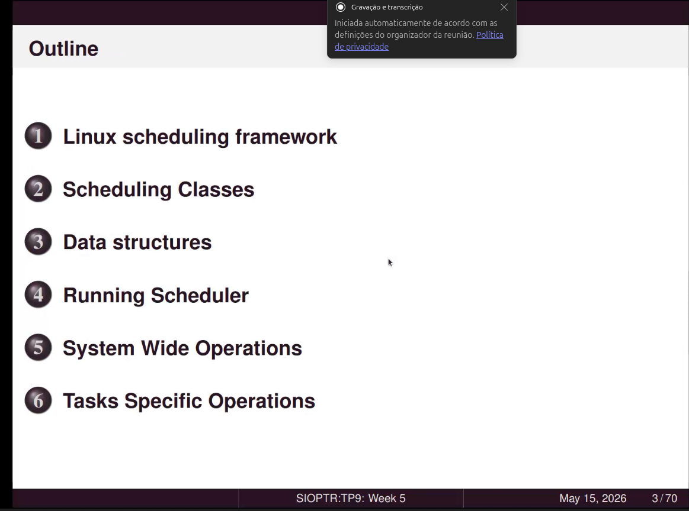
framework do linux
---
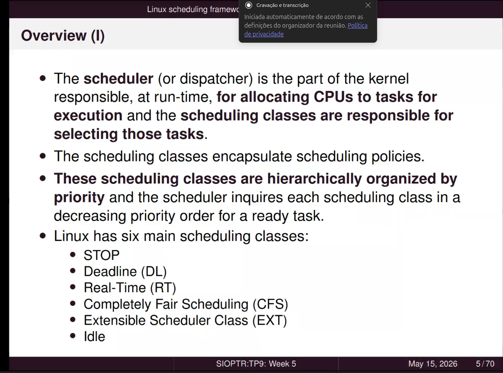
1 taraefa atribuida ao cpu

scedulher 
scheduling classe estao organizadas numa detreminada hierarquia.

scheduling classes que so tem uma tarefa logo nao ha nenhuma HEURISTICA.

A DA idle ESTA SEMPRE EM CONSDICOES DE EXECUCAO.

QUANDO O SCHEDULER OCRRE
---
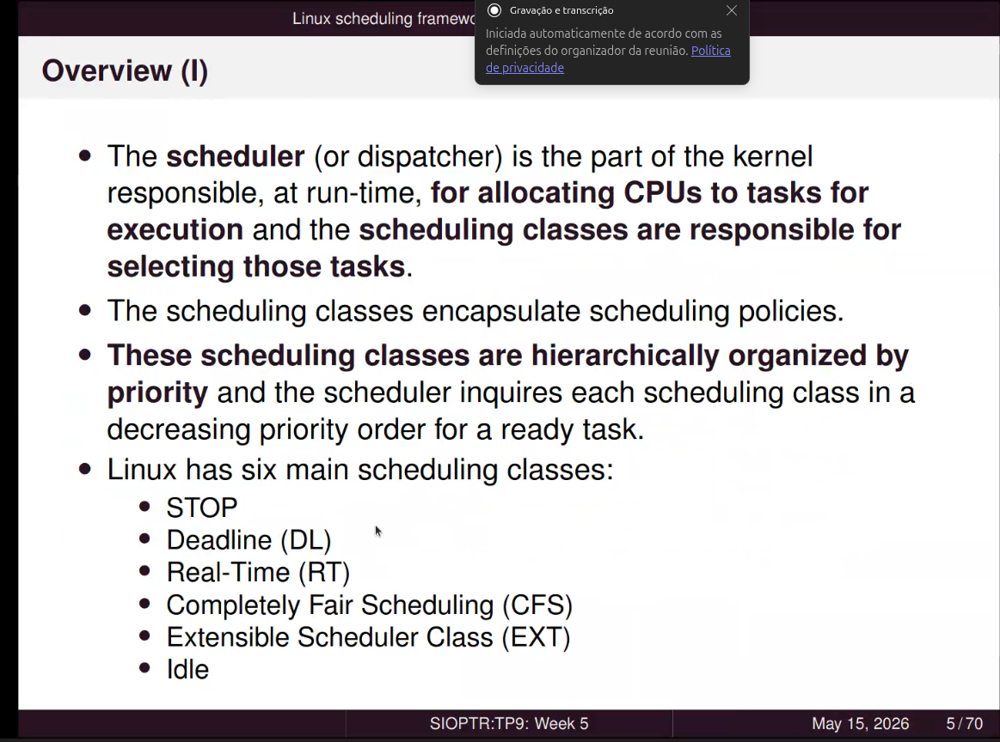
---
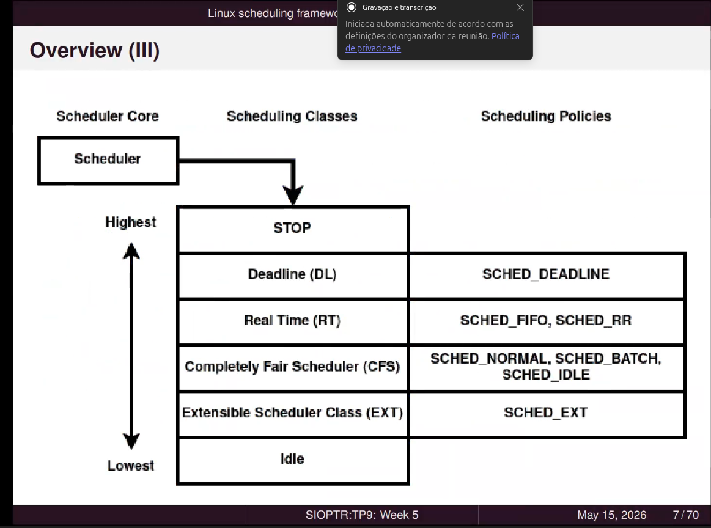
---
CONJUNTO DE HOOKS PERMITE QUE DESNVOLKVA ALGORITMOS DE ESCALONAMENTO EM USER SPACE. 
nos ambientes windows e quivalente ao naosei que inativo
---

cada uma destas classes de escalonamento uma ou mais pollitcas de escalonamento. na classe REAL time , o fifo e round robin, que vai executar 

O CFS -> implementa tres politicas de escalonadmento, mais uimportante SCHED normal...

extensible schedulker

# scheduling classes
---
 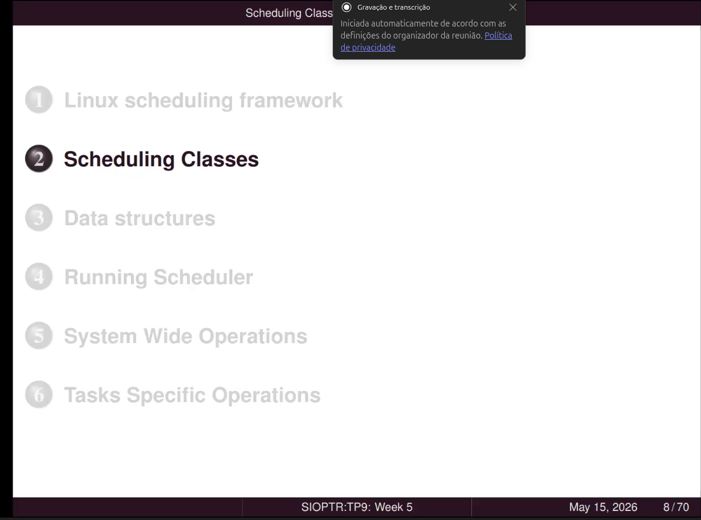
---

so exisate em sistemas multicore, migracao de tarefas. 
depois temos o sched deadline, impolementou o edf, 
esta clase de escalonamento foi feito para requisitos temporais. 
---

classe RT

esta classe de escalonamento organiza as tarefas somente 99 niveis, existe um nivel que apesar de nao ser usado,
sched deadline 0, 

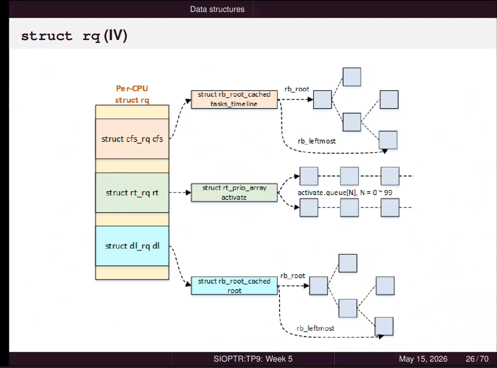
em funcao do nivel d eprio as tarefas sao penduradas nesse nivel.dentro de uma lista ligada. comeca a procurar dos niveis mais altos para os mais baixos. o sched fifo, se no mesmo nivel houver sched fifo tem prio sobre RR.

---
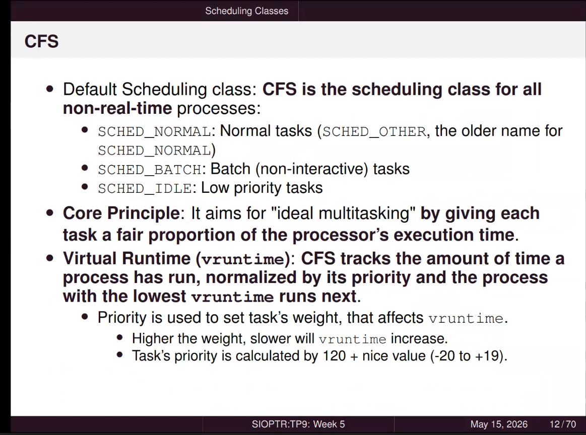
utiliza e nao utiliza prioridades, as tarefas cfs tem entre 100 e 139, linux tem 140 niveis de prioridade so a classe RT.
Alterar atraves do comandoi nice, 
funciona com peso percentagem, CFS com mais prioridade e aquela que tiver o virtual run time mais pequeno, como e feito oo calculo do citual run tiume, portanto esse tempo e fatorizado em funcao da prioridade. 
se tiver 139 1` segundo vai contar 2 segundos, prioridade mais salta mais tempoo de CPU. virtual run time , na contabilizacao , usa se estes pesos.
---
o que acontece 139 virtualruntime, este atributo, este e o atributo a tarefa com mais priioriadde com cirtual run time mais pequeno.

vurtyual run time, sempre qu uma tarefa vai ao cppou e contado o tempo que la esteve, nome do campo que guarad isto, tempo que vai ao cpu, e contabilizado, 1 s 1s cada tarefa te,m nivel de prioridade, a prio via ter um peso, se uma tar tiver 1 s e tiver prio 100 mais alta de cfs, vai ser contabilizado so meio segundo exemplo. 139 as 2s... prioridade mais mlta mais tempo de cpu, evitar o stravation, deta forma , mesmo a tarefa que vai la ... a medida quie o tempo vai passadndo o tempo ,, aquekle con, em termos , sempre que la vai conta muitoi e se o elemento que determina essa seleccao cirtual runtiome vao ter menos tempo de cpyu que as outras. 

virtualruntime e cum,ulativo, 

num primeiro momento as tarefas de CFS correm por , quando tens muitas com a mesma prio pega numa. basse que estao na fila neste caso arvore binaria. 

uma tarefa numa posicao mais alta e executada, em teoria , tarefas fifo sempre a executar as outras nao executam mecanismo de strarvation so abrange CFS nao RT, nao tem certeza. 

virtualruntime e cumulativo, uma tarefa de vauxa prioridade ha de chegar a uma altura, o staravation quando u,ma tarefa esta em execucao de , tarefas no sistema em condicoes de ser atribuida ao CPU e nunca sao o CFS responde a Isso no RT nao acontece. 

---
ora bem no caso do CFS
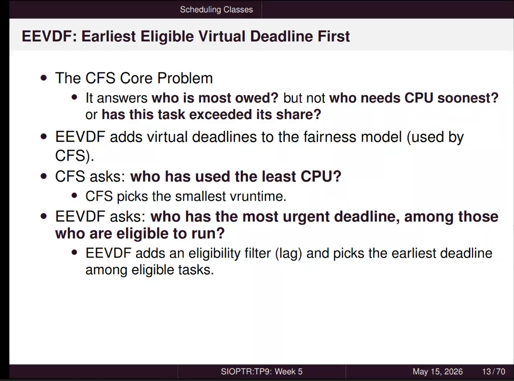
foio adicionado deadline comvuirtual runtime era por esse termoo, o virtualruntime, havia alguma dificuldade em selecionar as tarefas, usandoo uma heuristtica, que vai ajudar, escalonar aquela que tem mais urgencia. 
---
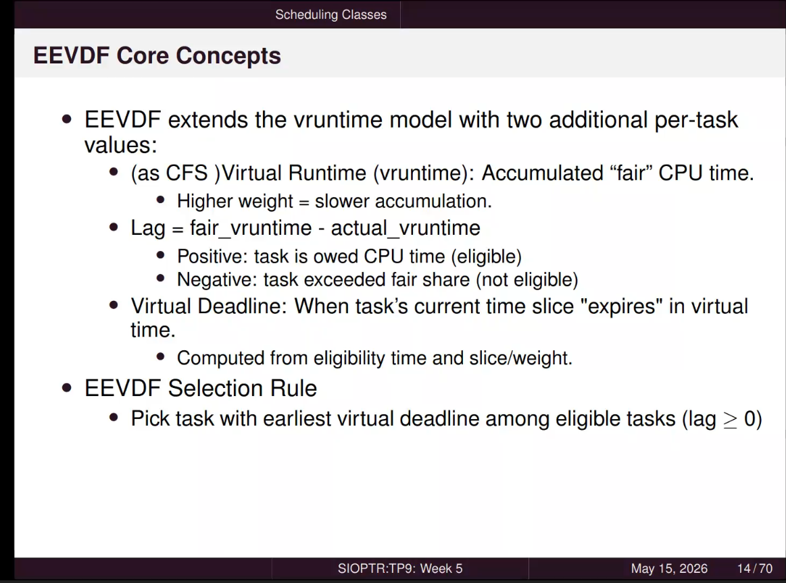
vai calcular esse nivel de urgencia, tarefas que podem ser escaloinadaas
---
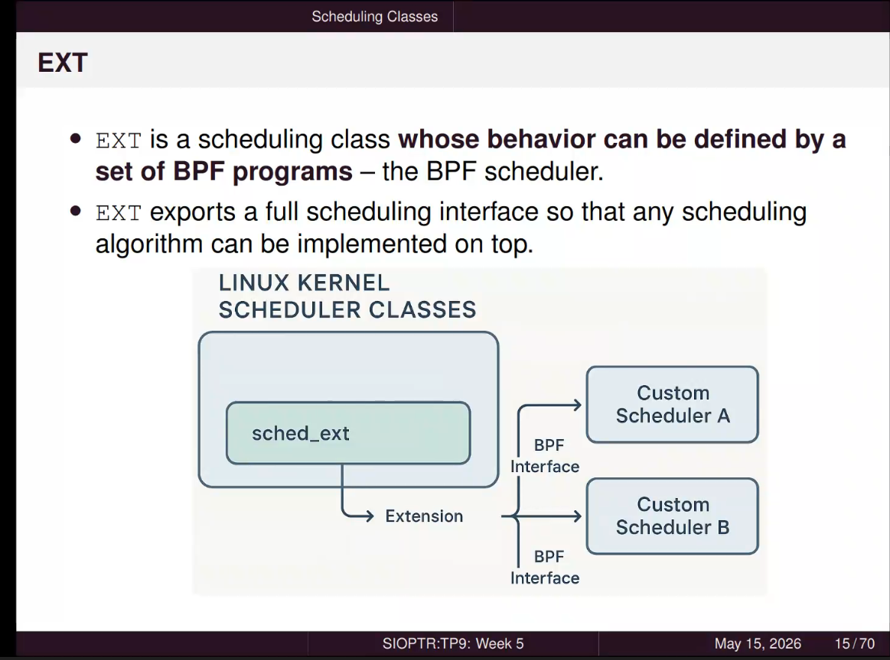
politicas de escaloonamento em uiser space
pode ser em RUST nao tem de ser em C. 
---
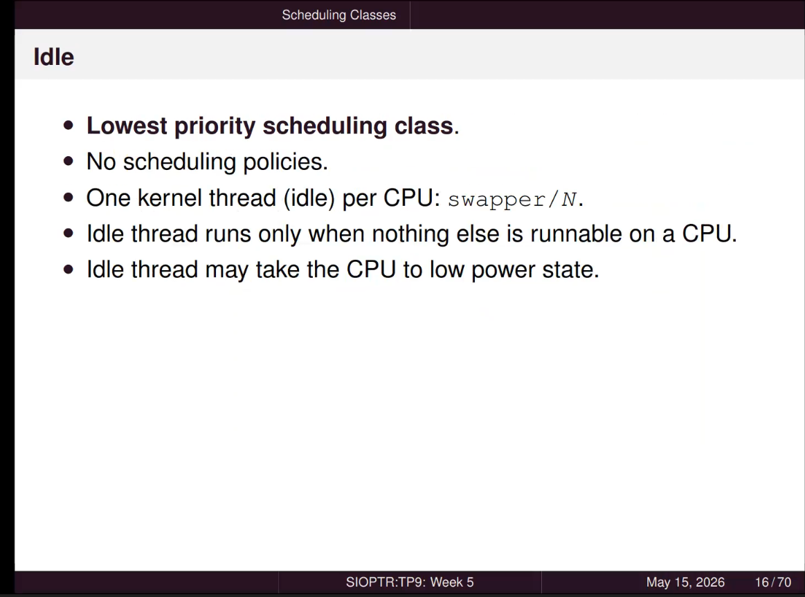
Idle scheduling class scom menor priorodade
PID 0, 
---
# Data strucures 
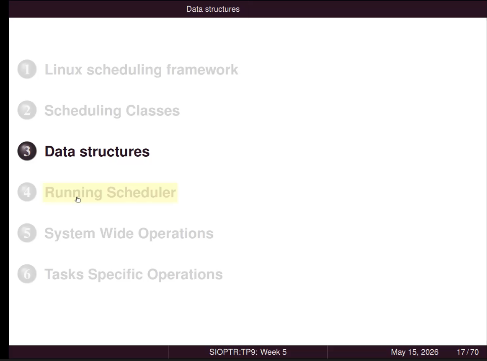

---
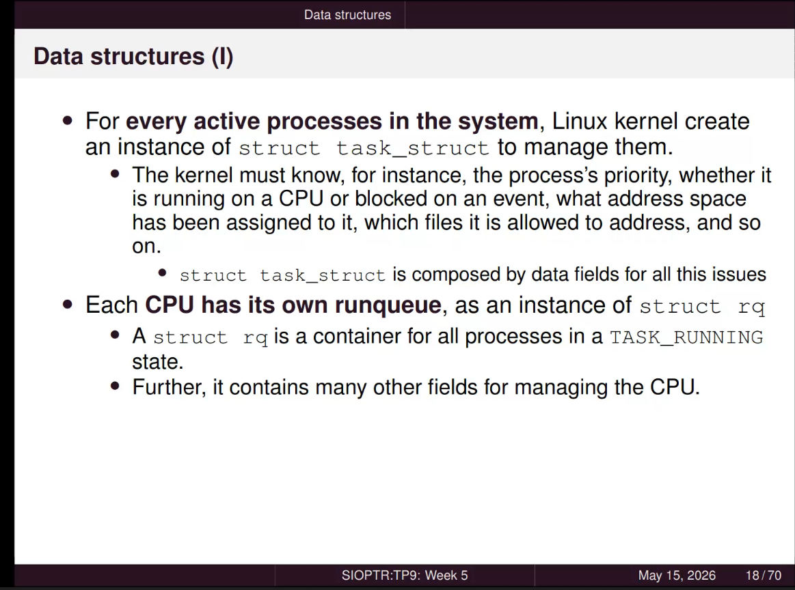
cada proigrama  e gerido pelo sistemos operativ, o sistema operativo cria variavel desse genero
status, __state, depois para cada tarefa, cpu runque, e uma estrutura de dados para guardar uma lista dos processos que sao ppara ser atribuido ao cpu. uma runque, depois sera atribuido maior prooriodade dado instante,.
---
escalonador do linux, tenm um core e dpois delega nas classes de escaloionamento , no fundo o que vamos ter , conjunto de callbacks, que vao invocar os metodos dessa classes de escalonamento, 
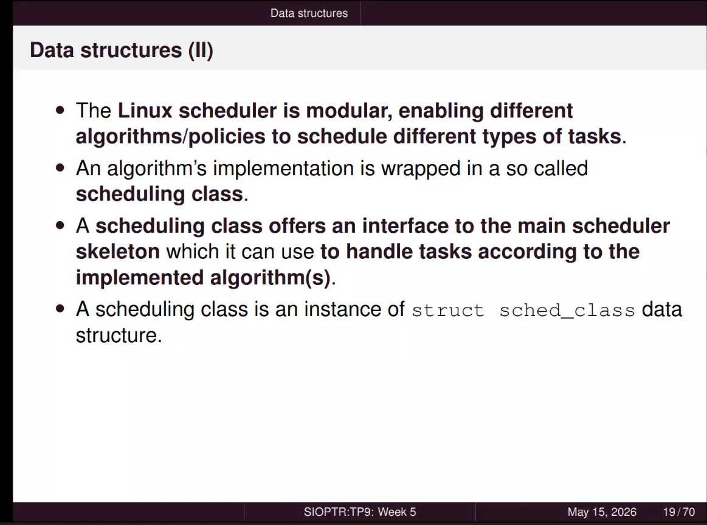
ele pergunta 
---
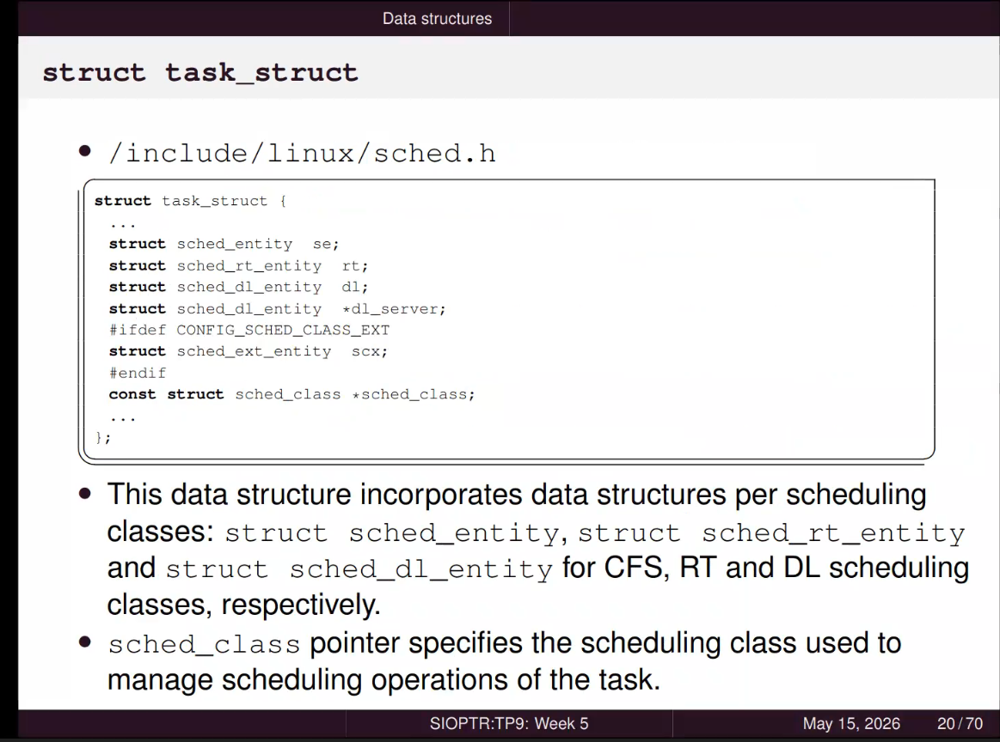
task_struct

source code neste ficheiro

    /include/linux/sche.h

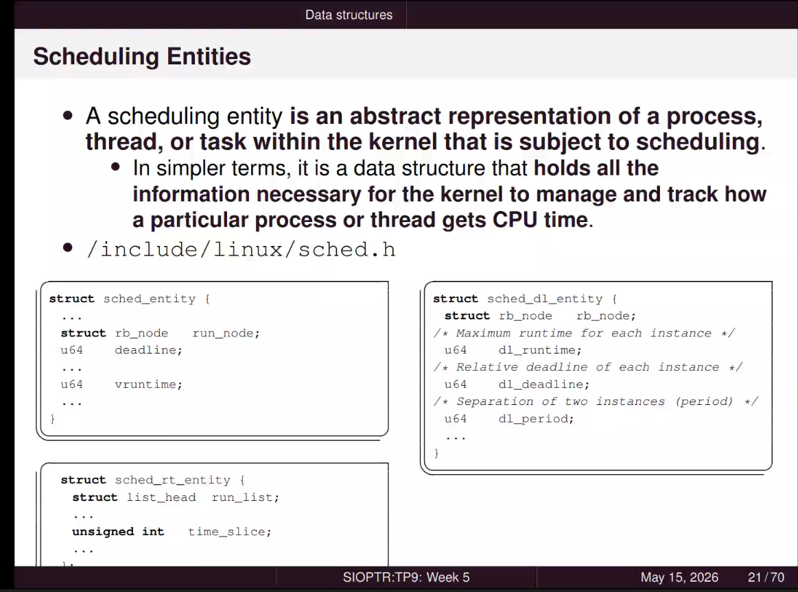

---
# GPT
## Ação — 1 passo 🎯

Faz esta leitura mental da `struct task_struct` como **“o objeto principal que representa uma tarefa/processo no Linux”**, e dentro dela identifica **qual subestrutura é usada por cada classe de escalonamento**:

| Campo dentro de `task_struct`            | Classe associada | Ideia principal                                   |
| ---------------------------------------- | ---------------: | ------------------------------------------------- |
| `struct sched_entity se;`                |          **CFS** | tarefas normais, `SCHED_NORMAL`                   |
| `struct sched_rt_entity rt;`             |           **RT** | tarefas real-time fixas: `SCHED_FIFO`, `SCHED_RR` |
| `struct sched_dl_entity dl;`             |           **DL** | tarefas deadline: `SCHED_DEADLINE`                |
| `const struct sched_class *sched_class;` |   ponteiro ativo | diz qual classe gere esta tarefa agora            |

---

## Objetivo

Perceber que a `task_struct` **não contém apenas “dados genéricos do processo”**.
Ela também contém **dados específicos para cada política de escalonamento**.

Ou seja:

```c
task_struct
 ├── se  -> dados para CFS
 ├── rt  -> dados para Real-Time
 ├── dl  -> dados para Deadline
 └── sched_class -> aponta para a classe atualmente usada
```

---

## Como pensar

Não penses ainda em “algoritmo”. Pensa em **camadas**:

### 1. `task_struct`

É a ficha completa da tarefa.

Contém PID, estado, prioridade, CPU affinity, sinais, memória, relações pai/filho, e também os campos de scheduling.

### 2. `sched_entity se`

É a “identidade da tarefa” vista pelo **CFS**.

O CFS preocupa-se com justiça/fairness. Então esta estrutura guarda dados como tempo virtual de execução, posição em árvores de tarefas prontas, etc.

Pensa assim:

> “Quanto tempo justo esta tarefa já consumiu comparado com as outras?”

---

### 3. `sched_rt_entity rt`

É a “identidade da tarefa” vista pela classe **real-time clássica**.

Aqui interessam prioridades fixas e listas por prioridade.

Pensa assim:

> “Esta tarefa RT tem prioridade maior do que as outras?”

---

### 4. `sched_dl_entity dl`

É a “identidade da tarefa” vista pela classe **Deadline**.

Aqui entram os conceitos que viste nas aulas práticas:

```text
runtime
deadline relativo
deadline absoluto
período
```

Pensa assim:

> “Qual é o deadline absoluto desta instância/job e quanto tempo de execução ainda tem?”

Isto liga diretamente ao EDF:

```text
menor deadline absoluto -> maior urgência
```

---

### 5. `sched_class`

Este é o ponto mais importante da imagem.

```c
const struct sched_class *sched_class;
```

Este ponteiro diz ao kernel:

> “Para esta tarefa, que conjunto de operações de scheduling devo usar?”

Exemplo mental:

```text
Tarefa normal      -> sched_class aponta para fair_sched_class
Tarefa FIFO/RR     -> sched_class aponta para rt_sched_class
Tarefa deadline    -> sched_class aponta para dl_sched_class
```

---

## Pitfalls & troubleshooting ⚠️

1. **Não confundir `sched_entity` com `task_struct`**
   `sched_entity` é só a parte da tarefa usada pelo CFS.

2. **Não assumir que todas as estruturas são usadas ao mesmo tempo**
   A `task_struct` tem `se`, `rt` e `dl`, mas a classe ativa depende de `sched_class`.

3. **Não confundir deadline relativo com deadline absoluto**
   O `sched_dl_entity` precisa de informação para calcular/guardar deadlines absolutos de jobs.

4. **Não pensar que CFS é real-time**
   CFS é para fairness; RT e DL são classes separadas.

---

## Alternativas / tradeoffs

### Abordagem A — Ler de cima para baixo

Começas em:

```c
struct task_struct
```

e perguntas:

> “Que campos dentro desta estrutura dizem respeito ao escalonamento?”

Boa para entender a arquitetura do kernel.

### Abordagem B — Começar pelas políticas

Começas por:

```text
CFS
RT
DL
```

e depois procuras:

```text
Que estrutura de dados representa cada política?
```

Boa para ligar com a matéria de escalonamento.

---

## Pergunta de decisão

Queres seguir agora por **CFS (`sched_entity`)** ou por **Deadline (`sched_dl_entity`)**, que liga melhor aos exercícios de EDF/deadlines?
---

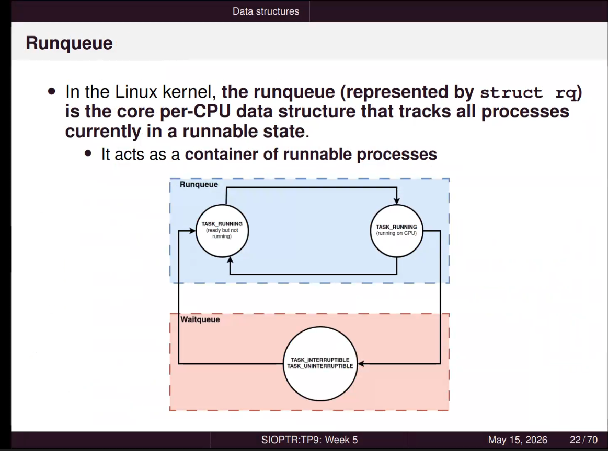

---
# GPT

## Ação — 1 passo

Sim: escreve no teu caderno esta frase-base:

> **Uma scheduling entity é a parte da tarefa que contém a informação necessária para o escalonador decidir quando e como essa tarefa recebe CPU.**

---

## Objetivo

Separar duas ideias que parecem iguais mas não são:

```text
task_struct = descrição completa da tarefa/processo no kernel

sched_entity / sched_rt_entity / sched_dl_entity =
parte da tarefa usada pelo escalonador
```

Ou seja, sim: é **informação associada à tarefa**, mas mais precisamente é **informação associada à tarefa para efeitos de scheduling**.

---

## Como pensar

Pensa numa tarefa como uma pessoa num hospital:

```text
task_struct = ficha completa do paciente
scheduling entity = triagem médica para decidir prioridade de atendimento
```

Cada classe de escalonamento precisa de dados diferentes:

| Entidade          | Usada por | Que informação guarda                              |
| ----------------- | --------- | -------------------------------------------------- |
| `sched_entity`    | CFS       | tempo virtual, posição na red-black tree, fairness |
| `sched_rt_entity` | RT        | prioridade fixa, lista de prontos, time slice      |
| `sched_dl_entity` | Deadline  | runtime, período, deadline relativo/absoluto       |

A ideia do professor está correta:

> estas estruturas contêm os dados que permitem aplicar políticas de escalonamento.

Exemplo forte para `sched_dl_entity`:

```c
u64 dl_runtime;
u64 dl_deadline;
u64 dl_period;
```

Isto liga diretamente ao que fizeste em EDF:

```text
runtime      -> C
dl_deadline  -> D relativo
dl_period    -> T
deadline absoluto -> calculado/atualizado a cada job
```

Então, quando uma tarefa é `SCHED_DEADLINE`, o kernel olha para essa entidade e pergunta:

> “Qual é o deadline absoluto mais urgente?”

---

## Pitfalls & troubleshooting

1. **Não traduzir “entity” como uma nova tarefa**
   A entidade não é outra tarefa. É uma representação interna da tarefa para o scheduler.

2. **Não achar que `sched_entity` serve para todas as políticas**
   `sched_entity` sem prefixo é sobretudo CFS. RT e DL têm entidades próprias.

3. **Não confundir `deadline` em CFS com deadline real-time**
   No slide aparece `u64 deadline` dentro de `sched_entity`, mas isso não é o mesmo conceito pedagógico de `SCHED_DEADLINE`.

4. **Não esquecer que a decisão final passa pela scheduling class**
   A entidade guarda dados; a classe (`sched_class`) contém as operações/algoritmos.

---

## Alternativas / tradeoffs

### Abordagem A — visão por dados

> “Que campos existem dentro da entidade?”

Boa para ler código do kernel.

### Abordagem B — visão por política

> “Que política estou a aplicar: CFS, RT ou DL?”

Boa para ligar à matéria de escalonamento.

---

## Pergunta de decisão

Queres que sigamos agora para **`sched_dl_entity`**, porque liga diretamente a EDF, runtime, período e deadline absoluto?


---

RUNQUEUE 

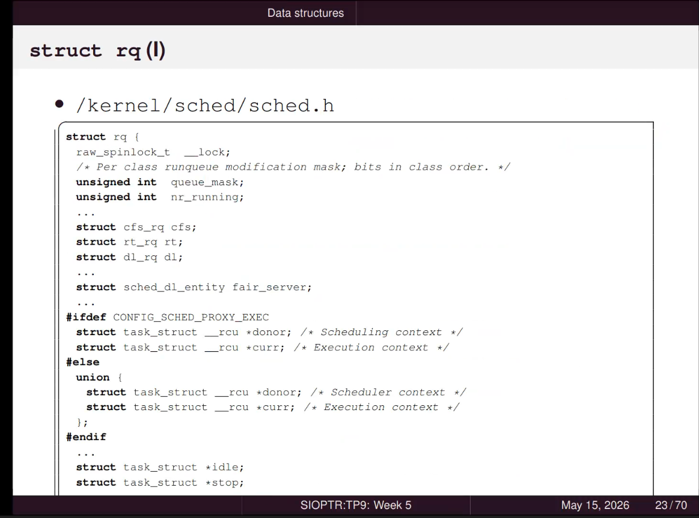

## Ação — 1 passo 🎯

Interpreta `struct rq` como a **runqueue de uma CPU**:

> **`rq` é a estrutura de dados onde o kernel guarda o estado de escalonamento de uma CPU: que tarefas estão prontas, qual está a executar, e que filas existem para CFS, RT e Deadline.**

---

## Objetivo

Perceber a diferença entre:

```text
task_struct / sched_entity = informação de UMA tarefa

rq = informação da CPU sobre TODAS as tarefas prontas nessa CPU
```

Ou seja:

```text
Tarefa individual  -> task_struct
Fila da CPU        -> struct rq
```

---

## Como pensar

A `struct rq` é como a **mesa de controlo do scheduler para uma CPU**.

No slide aparecem campos importantes:

```c
struct rq {
    raw_spinlock_t __lock;
    unsigned int queue_mask;
    unsigned int nr_running;

    struct cfs_rq cfs;
    struct rt_rq rt;
    struct dl_rq dl;

    struct task_struct *curr;
    struct task_struct *idle;
    struct task_struct *stop;
};
```

Agora separa por função:

| Campo        | Significado                                                 |
| ------------ | ----------------------------------------------------------- |
| `__lock`     | protege a runqueue contra acessos concorrentes              |
| `nr_running` | número de tarefas prontas/runnable nesta CPU                |
| `cfs`        | fila das tarefas normais, CFS                               |
| `rt`         | fila das tarefas real-time, FIFO/RR                         |
| `dl`         | fila das tarefas deadline                                   |
| `curr`       | tarefa atualmente em execução nesta CPU                     |
| `idle`       | tarefa idle quando não há trabalho                          |
| `stop`       | tarefa especial usada pelo kernel para parar/migrar tarefas |

A ideia central:

```text
Cada CPU tem a sua struct rq
```

Então, num sistema multicore:

```text
CPU0 -> rq0
CPU1 -> rq1
CPU2 -> rq2
CPU3 -> rq3
```

Cada `rq` tem as suas filas internas:

```text
rq
 ├── cfs_rq -> tarefas CFS
 ├── rt_rq  -> tarefas RT
 └── dl_rq  -> tarefas Deadline
```

---

## Pitfalls & troubleshooting ⚠️

1. **Não confundir `rq` com `cfs_rq`**
   `rq` é a runqueue geral da CPU; `cfs_rq` é só a subfila CFS.

2. **Não pensar que existe só uma runqueue global**
   Em Linux SMP/multicore, normalmente há uma `rq` por CPU.

3. **Não confundir tarefa pronta com tarefa a executar**
   `nr_running` conta tarefas runnable; `curr` é a que está realmente no CPU.

4. **Não esquecer locking**
   Scheduler mexe em estruturas críticas; por isso aparece `raw_spinlock_t`.

---

## Alternativas / tradeoffs

### Abordagem A — visão por CPU

Pensa:

```text
Uma CPU precisa saber:
- quem está pronto
- quem está a correr
- qual política escolher primeiro
```

Boa para entender `rq`.

### Abordagem B — visão por política

Pensa:

```text
Cada política tem uma fila própria:
- CFS -> cfs_rq
- RT  -> rt_rq
- DL  -> dl_rq
```

Boa para ligar com `sched_class`.

---

## Pergunta de decisão

Queres seguir para a ideia **“uma `rq` por CPU”** ou para a hierarquia **`rq -> cfs_rq / rt_rq / dl_rq`**?


---

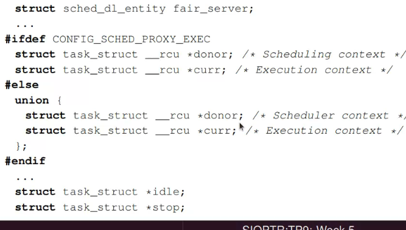

## Ação — 1 passo 🎯

Foca só nestes três ponteiros dentro da `struct rq`:

```c
struct task_struct __rcu *donor;  // scheduling context
struct task_struct __rcu *curr;   // execution context
struct task_struct *idle;
```

E escreve esta interpretação:

> **`curr` é a tarefa que está realmente a executar nesta CPU; `idle` é a tarefa executada quando não há mais nada pronto; `donor` aparece em mecanismos especiais onde uma tarefa pode “doar” contexto de escalonamento.**

---

## Objetivo

Perceber que a `rq` não guarda apenas filas. Ela também guarda **quem está agora no CPU**.

```text
rq de uma CPU
 ├── filas: cfs, rt, dl
 ├── curr: tarefa atualmente em execução
 ├── idle: tarefa de descanso
 └── stop: tarefa especial do kernel
```

---

## Como pensar

Pensa numa CPU como uma bancada de trabalho:

```text
rq      = mesa de planeamento da CPU
curr    = peça que está neste momento a ser trabalhada
idle    = peça falsa usada quando não há trabalho real
stop    = peça especial usada pelo kernel para operações críticas
```

### `curr`

```c
struct task_struct __rcu *curr;
```

É o ponteiro para a tarefa que está **agora** a executar naquela CPU.

Quando há troca de contexto:

```text
curr antigo sai
curr novo entra
```

### `idle`

```c
struct task_struct *idle;
```

É a tarefa especial que corre quando a CPU não tem nenhuma tarefa runnable.

Isto evita a ideia de “CPU sem tarefa”. Mesmo quando parece parada, a CPU está a executar a **idle task**.

### `stop`

```c
struct task_struct *stop;
```

É uma tarefa especial do kernel usada para operações internas críticas, por exemplo parar uma CPU ou ajudar em migração de tarefas.

### `donor`

```c
struct task_struct __rcu *donor;
```

Este é mais avançado. A dica está no comentário:

```c
/* Scheduling context */
```

Enquanto `curr` é o **execution context**, isto é, quem está fisicamente a executar, `donor` pode representar quem fornece o **contexto de escalonamento** em cenários especiais como proxy execution.

Para já, guarda só isto:

```text
curr  -> quem executa
donor -> em nome de quem / com que contexto de scheduling se executa
```

---

## Pitfalls & troubleshooting ⚠️

1. **Não confundir `curr` com “próxima tarefa”**
   `curr` é a tarefa atual, não a próxima escolhida.

2. **Não achar que CPU idle significa CPU desligada**
   A CPU executa a `idle task`.

3. **Não tentar dominar `donor` já**
   `CONFIG_SCHED_PROXY_EXEC` é tema avançado. Primeiro domina `curr`, `idle`, `rq`.

4. **Não esquecer que isto é por CPU**
   Cada CPU tem o seu próprio `rq.curr`.

---

## Alternativas / tradeoffs

### Abordagem A — ignorar `donor` por agora

Boa para exame/aula inicial:

```text
rq.curr = tarefa atual
rq.idle = tarefa quando não há trabalho
rq.stop = tarefa especial do kernel
```

### Abordagem B — investigar `donor`

Boa se a aula entrar em proxy execution, priority inheritance avançado ou scheduling context separado de execution context.

---

## Pergunta de decisão

Queres agora perceber melhor **`curr` e a troca de contexto**, ou avançamos para as subfilas **`cfs_rq`, `rt_rq`, `dl_rq`**?


---
## Ação — 1 passo 🎯

Desenha esta relação no caderno:

```text
CPU / rq
 ├── cfs_rq  -> fila das tarefas CFS
 ├── rt_rq   -> fila das tarefas RT
 └── dl_rq   -> fila das tarefas Deadline
```

---

## Objetivo

Perceber que **as três classes usam a mesma ideia geral**:

> cada CPU tem uma `rq`, e dentro dessa `rq` existem subestruturas/fila para cada classe de escalonamento.

Ou seja:

```text
rq = runqueue geral da CPU
cfs_rq = sub-runqueue para tarefas normais
rt_rq  = sub-runqueue para tarefas real-time FIFO/RR
dl_rq  = sub-runqueue para tarefas deadline
```

---

## Como pensar

A `rq` é o “quadro geral” da CPU.

Dentro dela, cada política organiza as suas tarefas de forma diferente:

| Subestrutura | Guarda tarefas de que tipo?       | Como tende a escolher?          |
| ------------ | --------------------------------- | ------------------------------- |
| `cfs_rq`     | tarefas normais                   | mais “justa” / menor `vruntime` |
| `rt_rq`      | tarefas `SCHED_FIFO` / `SCHED_RR` | maior prioridade RT             |
| `dl_rq`      | tarefas `SCHED_DEADLINE`          | menor deadline absoluto         |

A frase **“as três utilizam”** quer dizer:

> as três classes de escalonamento têm a sua própria estrutura dentro da `rq` para guardar/ordenar as tarefas prontas.

Mas **não usam a mesma regra**.

```text
CFS -> fairness
RT  -> prioridade fixa
DL  -> deadline absoluto
```

A decisão em alto nível é assim:

```text
1. Há tarefa Deadline pronta?
   -> usa dl_rq

2. Senão, há tarefa RT pronta?
   -> usa rt_rq

3. Senão, há tarefa normal pronta?
   -> usa cfs_rq

4. Senão
   -> corre idle
```

Nota: estou a simplificar a ordem para estudo. O ponto importante é que o kernel tem classes e cada classe tem a sua fila própria.

---

## Pitfalls & troubleshooting ⚠️

1. **Não pensar que `rt_rq` contém CFS e DL**
   Não. `rt_rq` é só para RT.

2. **Não confundir classe com fila**
   A classe contém as operações/regras; a fila contém os dados/tarefas prontas.

3. **Não assumir que todas as tarefas estão em todas as filas**
   Uma tarefa normal entra na `cfs_rq`; uma deadline entra na `dl_rq`; uma RT entra na `rt_rq`.

4. **Não confundir `rq` com “ready queue única simples”**
   No Linux é uma runqueue composta por várias subfilas.

---

## Alternativas / tradeoffs

### Abordagem A — por tipo de tarefa

```text
Tarefa normal -> cfs_rq
Tarefa RT     -> rt_rq
Tarefa DL     -> dl_rq
```

Boa para memorizar.

### Abordagem B — por pergunta do scheduler

```text
Quem tem mais urgência agora?
DL? RT? CFS?
```

Boa para entender a lógica de escolha.

---

## Pergunta de decisão

Queres que eu explique agora **como uma tarefa vai parar à `rt_rq`, `cfs_rq` ou `dl_rq`**?
---

RT ente 1 e 99


---

## Ação — 1 passo 🎯

Liga **tipo de política da tarefa** → **entidade dentro da `task_struct`** → **subfila dentro da `rq`**:

```text
Tarefa SCHED_NORMAL / OTHER
  task_struct.se
      ↓
  rq.cfs

Tarefa SCHED_FIFO / SCHED_RR
  task_struct.rt
      ↓
  rq.rt

Tarefa SCHED_DEADLINE
  task_struct.dl
      ↓
  rq.dl
```

---

## Objetivo

Perceber **como uma tarefa vai parar à subfila certa**.

A tarefa tem sempre uma `task_struct`. Dentro dela existem campos para várias classes:

```c
struct sched_entity se;
struct sched_rt_entity rt;
struct sched_dl_entity dl;
const struct sched_class *sched_class;
```

Mas a tarefa **não é escalonada pelas três ao mesmo tempo**.

O campo decisivo é:

```c
sched_class
```

Ele diz:

> “esta tarefa pertence agora a esta classe de scheduling”.

---

## Como pensar

Imagina três filas no aeroporto:

```text
CFS queue      -> passageiros normais
RT queue       -> passageiros prioritários
DL queue       -> passageiros com deadline crítico
```

A tarefa chega ao scheduler com uma “categoria”:

| Política Linux                 | Classe | Entidade usada | Subfila usada |
| ------------------------------ | ------ | -------------- | ------------- |
| `SCHED_NORMAL` / `SCHED_OTHER` | CFS    | `se`           | `cfs_rq`      |
| `SCHED_FIFO`                   | RT     | `rt`           | `rt_rq`       |
| `SCHED_RR`                     | RT     | `rt`           | `rt_rq`       |
| `SCHED_DEADLINE`               | DL     | `dl`           | `dl_rq`       |

Então, quando a tarefa fica pronta para executar:

```text
wake up / ready
   ↓
kernel vê sched_class
   ↓
insere a entidade correta na subfila correta
```

Exemplo:

```text
Tarefa A: SCHED_NORMAL
  usa A->se
  entra em rq->cfs

Tarefa B: SCHED_FIFO
  usa B->rt
  entra em rq->rt

Tarefa C: SCHED_DEADLINE
  usa C->dl
  entra em rq->dl
```

---

## Pitfalls & troubleshooting ⚠️

1. **A tarefa não “entra” inteira na fila no sentido abstrato**
   Normalmente o scheduler manipula a sua **entidade de scheduling**: `se`, `rt` ou `dl`.

2. **A `task_struct` contém as três entidades, mas só uma é relevante naquele momento**
   Depende da política ativa.

3. **`rt_rq` não significa “qualquer tarefa real-time teórica”**
   Em Linux, `rt_rq` é sobretudo para `SCHED_FIFO` e `SCHED_RR`.

4. **`SCHED_DEADLINE` não usa `rt_rq`**
   Apesar de ser real-time no sentido amplo, no Linux usa `dl_rq`.

---

## Alternativas / tradeoffs

### Abordagem A — memorizar por política

```text
NORMAL -> CFS
FIFO/RR -> RT
DEADLINE -> DL
```

Boa para exame.

### Abordagem B — memorizar por estrutura

```text
task->se -> rq->cfs
task->rt -> rq->rt
task->dl -> rq->dl
```

Boa para ler código do kernel.

---

## Pergunta de decisão

Queres agora perceber **como o scheduler escolhe entre `dl_rq`, `rt_rq` e `cfs_rq` quando existem tarefas prontas nas três?**


---

rt 1 e 99

arvore binari runtime arvore virtual, 

DL arvore binaria ordenadas por deadeline avbbsoluto, a dado instante politica de escalonamento , usa estrutura de dados adequada para a politica de escalonamento, arvore binaria CFS e o dealione usa arvores binarias, rt nao tem ordenacao forma estatica , noutros caso o fator de ordenacao vai evoluindo ao longo do tempo, 

---
## Ação — 1 passo 🎯

Corrige a tua frase para esta versão:

> **Cada classe de escalonamento usa uma estrutura de dados adequada ao seu critério de ordenação: CFS usa árvore por `vruntime`; DL usa árvore por deadline absoluto; RT usa filas por prioridade fixa, de 1 a 99.**

---

## Objetivo

Separar claramente **o que muda com o tempo** e **o que é fixo**:

| Classe  | Estrutura típica            | Critério de ordenação   | O critério evolui?   |
| ------- | --------------------------- | ----------------------- | -------------------- |
| **CFS** | red-black tree              | menor `vruntime`        | Sim                  |
| **DL**  | red-black tree              | menor deadline absoluto | Sim, por job/release |
| **RT**  | filas/listas por prioridade | prioridade RT 1–99      | Normalmente fixa     |

---

## Como pensar

### CFS

No CFS, a tarefa é ordenada pelo:

```text
vruntime
```

Interpretação:

> “Quanto tempo justo esta tarefa já recebeu?”

Quanto mais CPU a tarefa consome, mais o `vruntime` aumenta.
Logo, a posição dela na árvore muda ao longo do tempo.

```text
menor vruntime -> mais à esquerda -> escolhida primeiro
```

---

### DL

No Deadline Scheduling, a tarefa é ordenada pelo:

```text
deadline absoluto
```

Interpretação:

> “Qual job tem deadline mais próximo?”

Isto é muito parecido com EDF:

```text
menor deadline absoluto -> executa primeiro
```

A cada nova release/job, o deadline absoluto muda:

```text
deadline absoluto = release time + deadline relativo
```

---

### RT

No RT clássico (`SCHED_FIFO`, `SCHED_RR`), a ordenação principal é:

```text
prioridade fixa: 1 a 99
```

Aqui não precisas de árvore binária para ordenar por tempo.
O kernel pode usar filas por prioridade:

```text
prio 99 -> fila mais urgente
prio 98 -> fila seguinte
...
prio 1  -> fila menos urgente
```

Dentro da mesma prioridade:

```text
SCHED_FIFO -> corre até bloquear, terminar ou ser preemptada por prioridade maior
SCHED_RR   -> round-robin com time slice
```

---

## Pitfalls & troubleshooting ⚠️

1. **Não dizer “RT usa árvore”**
   RT usa prioridade fixa e filas/listas por prioridade.

2. **Não confundir `runtime` com `vruntime`**
   `runtime` é tempo real consumido; `vruntime` é tempo virtual ajustado para fairness.

3. **Não confundir deadline relativo com absoluto**
   DL ordena por deadline absoluto do job atual.

4. **Não dizer que RT 99 é menor prioridade**
   Em Linux RT: **99 é mais prioritário que 1**.

---

## Alternativas / tradeoffs

### Abordagem A — memorizar por estrutura

```text
CFS -> árvore red-black
DL  -> árvore red-black
RT  -> arrays/listas por prioridade
```

### Abordagem B — memorizar por pergunta

```text
CFS pergunta: quem recebeu menos CPU justa?
DL pergunta: quem tem deadline mais próximo?
RT pergunta: quem tem maior prioridade fixa?
```

---

## Pergunta de decisão

Queres agora validar isto com um exemplo pequeno com **3 tarefas CFS, 2 RT e 1 DL** dentro da mesma `rq`?

---
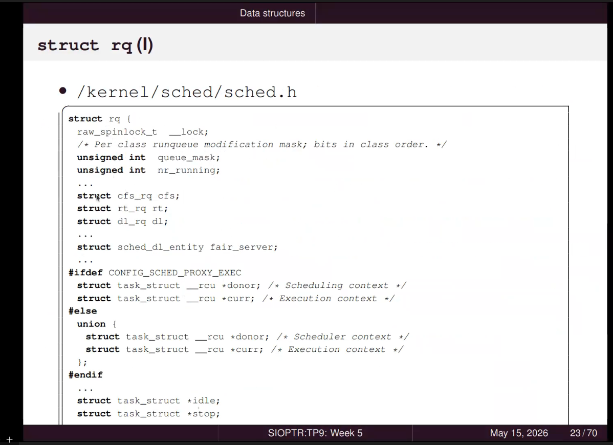
---
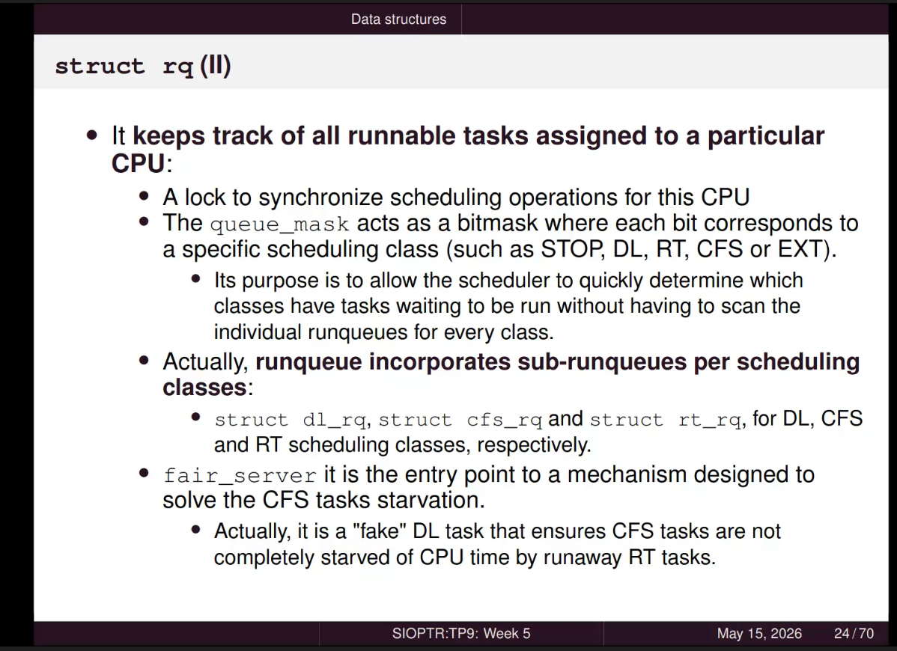
---
## Ação — 1 passo 🎯

Lê este slide como **a runqueue principal de uma CPU**:

```text
struct rq
 ├── queue_mask   -> indica que classes têm tarefas prontas
 ├── nr_running   -> quantas tarefas runnable existem nesta CPU
 ├── cfs          -> subfila CFS
 ├── rt           -> subfila RT
 ├── dl           -> subfila Deadline
 ├── curr         -> tarefa atualmente a executar
 ├── idle         -> tarefa idle
 └── stop         -> tarefa especial do kernel
```

---

## Objetivo

Perceber a frase-chave:

> **A `rq` não é uma fila simples. É uma estrutura composta que contém várias subfilas, uma por classe de escalonamento.**

---

## Como pensar

A `struct rq` é por CPU:

```text
CPU0 -> rq0
CPU1 -> rq1
CPU2 -> rq2
...
```

Dentro de cada `rq`, o kernel separa as tarefas prontas por classe:

```c
struct cfs_rq cfs;
struct rt_rq  rt;
struct dl_rq  dl;
```

Isto significa:

```text
tarefas normais       -> rq.cfs
tarefas FIFO/RR       -> rq.rt
tarefas Deadline      -> rq.dl
```

E cada subfila usa a estrutura adequada:

| Classe | Subfila  | Organização                            |
| ------ | -------- | -------------------------------------- |
| CFS    | `cfs_rq` | árvore red-black por `vruntime`        |
| RT     | `rt_rq`  | filas por prioridade fixa 1–99         |
| DL     | `dl_rq`  | árvore red-black por deadline absoluto |

A parte:

```c
unsigned int queue_mask;
```

é importante porque indica, de forma rápida, **que classes têm tarefas prontas**. Em vez de procurar em tudo, o scheduler pode testar uma máscara.

---

## Pitfalls & troubleshooting ⚠️

1. **`rq` não é só CFS**
   Ela contém CFS, RT e DL.

2. **`nr_running` não é só a tarefa atual**
   Conta tarefas prontas/runnable na CPU.

3. **`curr` pode não estar “dentro da fila” como as outras**
   `curr` é a tarefa em execução neste momento.

4. **`queue_mask` não ordena tarefas**
   Só ajuda a saber que classes têm trabalho disponível.

---

## Alternativas / tradeoffs

### Abordagem por estrutura

```text
rq -> contém subfilas
subfila -> contém entidades
entidade -> representa tarefa no scheduler
```

### Abordagem por decisão

```text
scheduler pergunta:
1. Há DL pronto?
2. Há RT pronto?
3. Há CFS pronto?
4. Caso contrário, idle
```

---

## Pergunta de decisão

Queres agora seguir para **`queue_mask`** ou para **`nr_running`**?
---
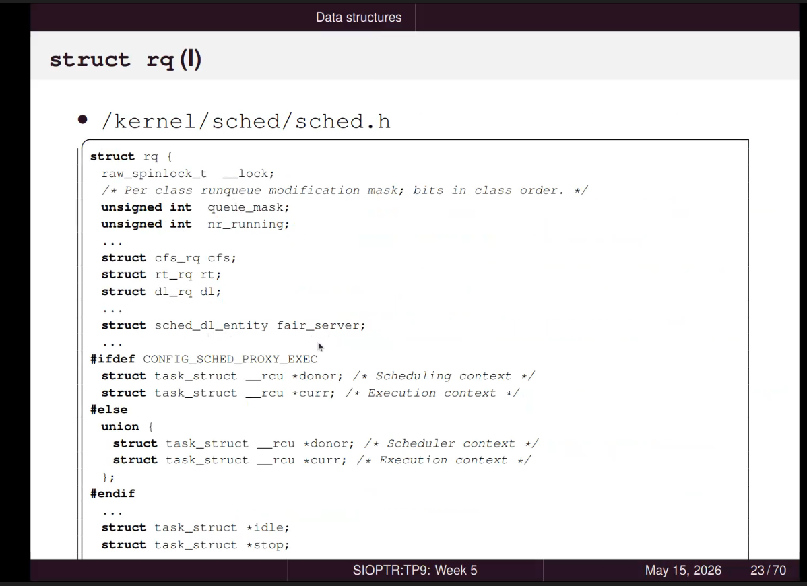
---
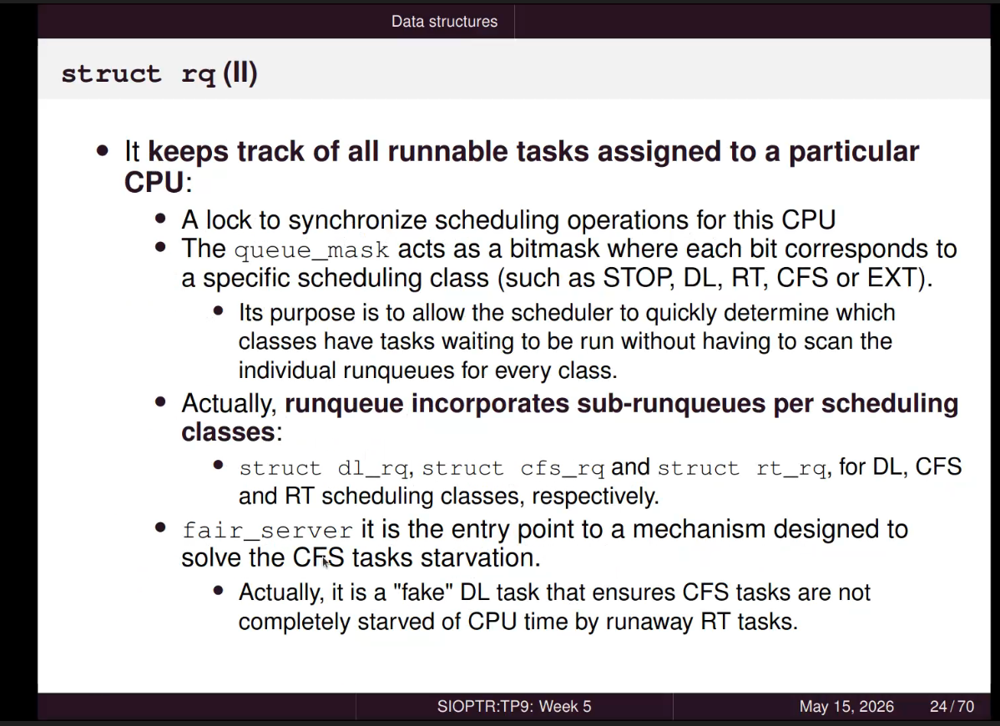
---
tarefas estao ha muito tempo porqeu  RT nao permite estao a usar muito o cpu, o sitema quando obtem o control da maquina vai colocar as tarefas que nao executam ha ujmuito tempo vao por as tarefas em DL e vao executar durante alguima tempon.
---
## Ação — 1 passo 🎯

Corrige a tua frase assim:

> **O `fair_server` não transforma tarefas CFS reais em tarefas DL. Ele cria uma entidade “fake” de Deadline dentro da `rq` para reservar alguma CPU para o CFS quando tarefas RT estão a dominar o processador.**

---

## Objetivo

Clarificar o mecanismo:

```text
RT muito agressivo
   ↓
CFS pode ficar sem CPU
   ↓
fair_server aparece como uma entidade DL artificial
   ↓
essa entidade dá uma janela de execução ao CFS
```

A ideia é evitar **starvation** das tarefas normais.

---

## Como pensar

Tens três níveis:

```text
rq
 ├── rt_rq   -> tarefas RT reais
 ├── cfs_rq  -> tarefas CFS reais
 ├── dl_rq   -> tarefas Deadline reais
 └── fair_server -> entidade DL artificial para proteger CFS
```

A tua intuição está quase certa, mas ajusta este ponto:

❌ “O sistema põe as tarefas CFS em DL.”

✅ “O sistema usa uma entidade DL artificial para representar tempo reservado ao CFS.”

Ou seja, as tarefas continuam CFS:

```text
tarefa normal continua em cfs_rq
```

Mas o scheduler pode usar o `fair_server` como se fosse uma tarefa DL para dizer:

```text
agora há uma reserva temporal para executar CFS
```

---

## Pitfalls & troubleshooting ⚠️

1. **Não dizer que tarefas CFS viram SCHED_DEADLINE**
   A política da tarefa não muda.

2. **Não dizer que todas as RT são bloqueadas para sempre**
   O mecanismo só evita starvation; não elimina prioridade RT.

3. **Não confundir fair_server com fair_sched_class**
   `fair_sched_class` é a classe CFS; `fair_server` é uma entidade auxiliar.

4. **Não assumir que isto é o mecanismo principal de CFS**
   É uma proteção/servidor especial dentro da `rq`.

---

## Alternativas / tradeoffs

### Abordagem A — explicação simples para exame

```text
fair_server é uma entidade DL artificial usada para garantir que tarefas CFS não ficam totalmente sem CPU quando RT consome demasiado processador.
```

### Abordagem B — explicação mais kernel

```text
fair_server é um sched_dl_entity dentro da rq que atua como ponto de entrada para reservar runtime para fair scheduling.
```

---

## Pergunta de decisão

Queres agora ligar isto à ordem de escolha do scheduler: **DL → RT → CFS → idle**?
---
herancas de prioridades associasdos aos mutexes
---
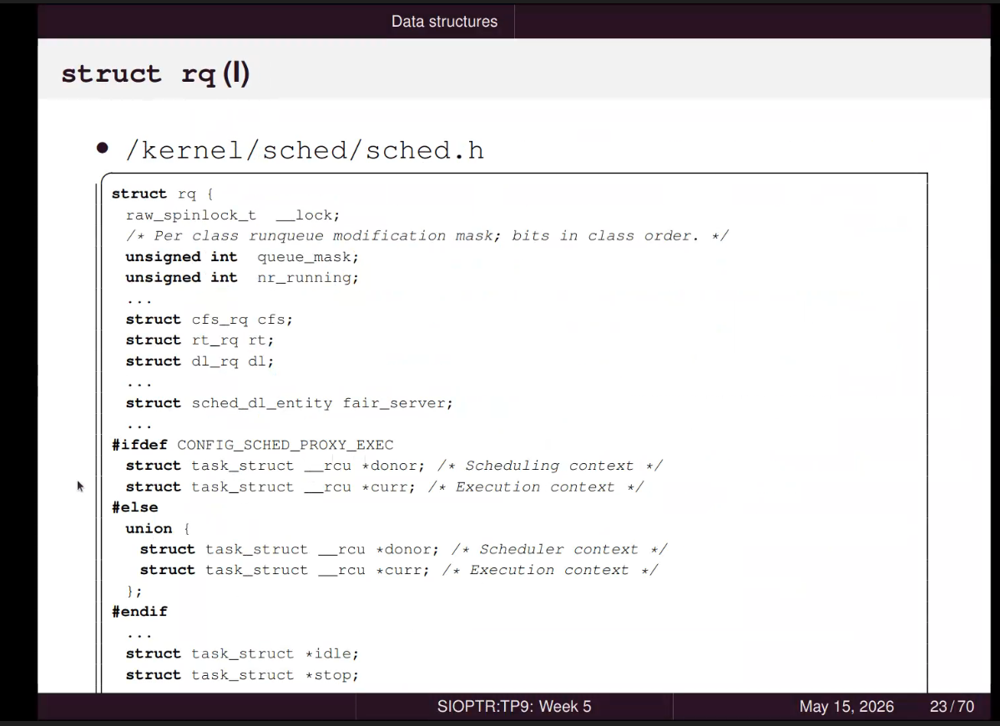
---
## Ação — 1 passo 🎯

Distingue assim:

```c
struct {
    A a;
    B b;
};
```

guarda **A e B ao mesmo tempo**.

```c
union {
    A a;
    B b;
};
```

guarda **A ou B no mesmo espaço de memória**.

---

## Objetivo

Perceber porque no slide aparece:

```c
union {
    struct task_struct __rcu *donor;
    struct task_struct __rcu *curr;
};
```

Isto quer dizer:

> `donor` e `curr` ocupam o **mesmo endereço de memória** quando `CONFIG_SCHED_PROXY_EXEC` não está ativo.

Ou seja, nesse caso, o kernel não precisa guardar dois ponteiros separados.

---

## Como pensar

### `struct`

Uma `struct` soma os campos:

```c
struct example {
    int a;   // 4 bytes
    int b;   // 4 bytes
};
```

Memória aproximada:

```text
[a][b]  -> total ~8 bytes
```

A estrutura contém os dois valores ao mesmo tempo.

---

### `union`

Uma `union` sobrepõe os campos:

```c
union example {
    int a;   // 4 bytes
    int b;   // 4 bytes
};
```

Memória aproximada:

```text
[a ou b] -> total ~4 bytes
```

Só deves interpretar um campo de cada vez.

---

## Ligação ao slide

Com:

```c
#ifdef CONFIG_SCHED_PROXY_EXEC
    struct task_struct __rcu *donor;
    struct task_struct __rcu *curr;
#else
    union {
        struct task_struct __rcu *donor;
        struct task_struct __rcu *curr;
    };
#endif
```

Há duas situações:

### Caso 1 — `CONFIG_SCHED_PROXY_EXEC` ativo

```text
donor e curr existem separados
```

Porque o kernel pode precisar distinguir:

```text
donor -> contexto de scheduling
curr  -> contexto de execução
```

Isto liga à tua frase sobre **herança de prioridades associada a mutexes**: em cenários avançados, uma tarefa pode executar fisicamente enquanto o contexto de scheduling efetivo vem de outra, por causa de bloqueios, locks, mutexes ou proxy execution.

### Caso 2 — `CONFIG_SCHED_PROXY_EXEC` inativo

```text
donor e curr são o mesmo ponteiro na prática
```

Por isso o kernel usa `union` para poupar memória e manter compatibilidade no código.

---

## Pitfalls & troubleshooting ⚠️

1. **Não dizer que `union` guarda dois valores ao mesmo tempo**
   Guarda um valor interpretável de várias formas.

2. **Não confundir `curr` com `current` global/per-CPU macro**
   Aqui é o campo da `rq`: tarefa atual daquela CPU.

3. **Não assumir que priority inheritance normal exige sempre `donor` separado**
   Este trecho é específico de `CONFIG_SCHED_PROXY_EXEC`.

4. **Não esquecer que `__rcu` indica acesso protegido por RCU**
   Não é parte do tipo lógico da tarefa; é anotação de sincronização no kernel.

---

## Alternativas / tradeoffs

### Usar `struct`

Mais claro, permite dois ponteiros distintos, mas ocupa mais memória.

### Usar `union`

Mais compacto, mas só faz sentido quando os dois nomes representam o mesmo armazenamento.

---

## Pergunta de decisão

Queres que eu explique agora **`donor` vs `curr` com um exemplo de mutex e priority inheritance**?

----
## Ação — 1 passo 🎯

Sim. Para uma `union`, escreve esta regra:

> **Os campos de uma `union` são nomes diferentes para a mesma posição de memória.**

No caso do slide:

```c
union {
    struct task_struct __rcu *donor;
    struct task_struct __rcu *curr;
};
```

`donor` e `curr` usam **o mesmo espaço de memória**.

---

## Objetivo

Perceber isto:

```text
&rq->donor == &rq->curr
```

Neste caso, os dois nomes apontam para o **mesmo slot de memória dentro da `rq`**.

Se gravares por um nome:

```c
rq->curr = task_A;
```

e depois leres pelo outro:

```c
rq->donor
```

vais obter o mesmo valor, porque é a mesma posição.

---

## Como pensar

Não é exatamente “uma variável acedida por dois apontadores”.

É mais preciso dizer:

```text
uma zona de memória com dois nomes possíveis
```

Exemplo simples:

```c
union U {
    int a;
    int b;
};

union U x;

x.a = 10;
printf("%d\n", x.b);
```

Aqui `a` e `b` ocupam o mesmo espaço. Logo, ao escrever `x.a`, estás a alterar a memória que também é vista como `x.b`.

No slide, a diferença é que os campos são ponteiros:

```c
rq->curr
rq->donor
```

Ambos são nomes para o mesmo armazenamento quando `CONFIG_SCHED_PROXY_EXEC` **não** está ativo.

---

## Pitfalls & troubleshooting ⚠️

1. **Não são dois ponteiros independentes**
   Na `union`, `curr` e `donor` não guardam valores separados.

2. **Não podes assumir dois estados ao mesmo tempo**
   Ou interpretas aquele campo como `curr`, ou como `donor`.

3. **Se fossem `struct`, seria diferente**
   Com `struct`, haveria memória separada para `curr` e `donor`.

4. **Aqui faz sentido porque ambos têm o mesmo tipo**
   Ambos são `struct task_struct __rcu *`, por isso a sobreposição é limpa.

---

## Alternativas / tradeoffs

### Com `union`

```text
menos memória
curr e donor são aliases do mesmo campo
```

### Com `struct`

```text
mais memória
curr e donor podem ter valores diferentes
```

---

## Pergunta de decisão

Queres que eu faça um desenho de memória simples para `struct` vs `union` com `curr` e `donor`?
S

---

## Ação — 1 passo 🎯

Escreve esta regra:

> **Numa `union`, os membros podem ter tipos diferentes, mas todos começam no mesmo endereço de memória; o tamanho total da `union` é o tamanho do maior membro, com possível padding/alinhamento.**

---

## Objetivo

Confirmar a tua interpretação:

```c
union U1 {
    int   a;
    float b;
    char  c;
};
```

Sim, os membros podem ser de **tipos diferentes**:

```text
a -> int
b -> float
c -> char
```

Mas só deves considerar **um membro válido de cada vez**.

---

## Como pensar

Numa `struct`, tens blocos separados:

```c
struct S1 {
    int   a;
    float b;
    char  c;
};
```

Memória conceptual:

```text
[a][b][c]
```

Na `union`, todos usam o mesmo bloco:

```c
union U1 {
    int   a;
    float b;
    char  c;
};
```

Memória conceptual:

```text
[a]
[b]   todos sobrepostos
[c]
```

Se assumirmos:

```text
int   = 4 bytes
float = 4 bytes
char  = 1 byte
```

então:

```text
sizeof(union U1) ≈ 4 bytes
```

porque o maior membro tem 4 bytes.

Mas se fosse:

```c
union U2 {
    char  c;
    double d;
};
```

provavelmente:

```text
sizeof(union U2) ≈ 8 bytes
```

porque `double` costuma ocupar 8 bytes.

---

## Pitfalls & troubleshooting ⚠️

1. **Não podes guardar `int`, `float` e `char` independentemente ao mesmo tempo**
   Se escreves `b`, sobrescreves a memória usada por `a` e `c`.

2. **Ler por outro tipo pode dar interpretação estranha**
   Exemplo: escreves `float`, lês `int`; vais ver os bits do `float` interpretados como inteiro.

3. **O tamanho pode ser maior que o maior campo por alinhamento**
   O compilador pode adicionar padding.

4. **No caso do slide do kernel, `donor` e `curr` têm o mesmo tipo**
   Então a `union` ali é mais simples: são dois nomes para o mesmo ponteiro.

---

## Alternativas / tradeoffs

### `struct`

Usas quando queres guardar todos os campos simultaneamente.

### `union`

Usas quando queres poupar memória e sabes que só um campo faz sentido de cada vez.

---

## Pergunta de decisão

Queres que liguemos isto agora diretamente ao exemplo `donor/curr` da `struct rq`?
---

problemas das uunions , resscrevi um byte os bytes sao os mesmos paras as mesmas variaveis , cabe ao pprogramador usar de forma correta. 

---
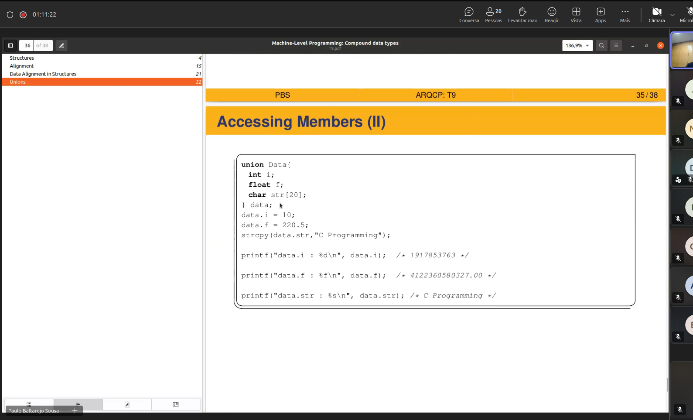
---
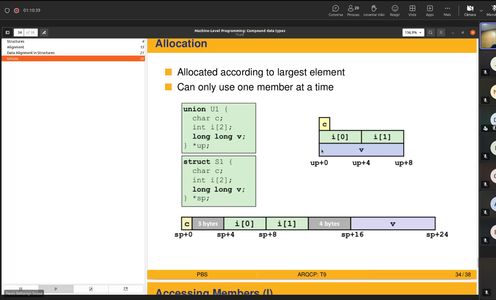

---
## Ação — 1 passo 🎯

Corrige a tua frase para:

> **Numa `union`, todos os membros partilham os mesmos bytes. Quando escrevo num membro, altero os bytes que depois podem ser lidos pelos outros membros com outra interpretação.**

---

## Objetivo

Perceber porque o valor de `i` muda neste exemplo:

```c
union Data {
    int i;
    float f;
    char str[20];
} data;

data.i = 10;
data.f = 220.5;
strcpy(data.str, "C Programming");

printf("%d\n", data.i);
```

Depois de:

```c
strcpy(data.str, "C Programming");
```

os bytes da `union` passam a conter caracteres:

```text
'C' ' ' 'P' 'r' 'o' 'g' 'r' 'a' ...
```

Então, quando fazes:

```c
printf("%d\n", data.i);
```

o programa interpreta os primeiros bytes da string como se fossem um `int`.

Logo, o valor de `i` já **não é 10**.

---

## Como pensar

A `union` é uma caixa única:

```text
union Data
┌──────────────────────┐
│ mesmos bytes          │
└──────────────────────┘
```

Podes olhar para essa caixa como:

```text
int i
float f
char str[20]
```

mas a caixa é a mesma.

Sequência:

```text
data.i = 10
```

memória contém representação binária do inteiro `10`.

```text
data.f = 220.5
```

os mesmos bytes são sobrescritos com representação binária do `float`.

```text
strcpy(data.str, "C Programming")
```

os mesmos bytes são sobrescritos com caracteres da string.

Portanto:

```text
último membro escrito = interpretação válida
```

Neste caso, o último membro escrito foi:

```c
data.str
```

Então o único acesso semanticamente correto depois disso é:

```c
printf("%s\n", data.str);
```

---

## Pitfalls & troubleshooting ⚠️

1. **O compilador não impede o erro lógico**
   C deixa-te ler `data.i` depois de escrever `data.str`.

2. **O resultado pode parecer aleatório**
   Na verdade são bytes reais, mas interpretados com outro tipo.

3. **Endianness muda o valor observado**
   Little-endian e big-endian podem dar inteiros diferentes.

4. **Padding/alinhamento podem alterar `sizeof(union)`**
   O tamanho é pelo menos o maior membro, mas pode ter ajuste de alinhamento.

---

## Alternativas / tradeoffs

### Usar `union`

Boa quando sabes exatamente qual membro está ativo.

### Usar `struct`

Melhor quando precisas guardar todos os valores ao mesmo tempo:

```c
struct Data {
    int i;
    float f;
    char str[20];
};
```

Aqui `i`, `f` e `str` não se sobrescrevem.

---

## Pergunta de decisão

Queres agora aplicar esta regra diretamente ao caso do kernel: `union { donor; curr; }`?
---

## Ação — 1 passo 🎯

Aplica a regra da `union` ao caso do kernel assim:

```c
union {
    struct task_struct __rcu *donor;
    struct task_struct __rcu *curr;
};
```

> **Sem `CONFIG_SCHED_PROXY_EXEC`, `donor` e `curr` são dois nomes para o mesmo ponteiro.**

---

## Objetivo

Perceber que, neste caso, a `union` é usada porque o kernel **não precisa guardar dois valores diferentes**.

```text
mesmos bytes da rq
     ↓
podem ser lidos como rq->curr
ou como rq->donor
```

Como ambos têm o mesmo tipo:

```c
struct task_struct __rcu *
```

não há aquela confusão de interpretar bytes de `float` como `int`.

Aqui é mais simples:

```text
curr e donor apontam para uma task_struct
```

---

## Como pensar

### Caso sem `CONFIG_SCHED_PROXY_EXEC`

```c
union {
    struct task_struct __rcu *donor;
    struct task_struct __rcu *curr;
};
```

Memória conceptual:

```text
rq
┌────────────────────────────┐
│ campo único: task_struct * │
└────────────────────────────┘
        ↑              ↑
      curr           donor
```

Então:

```c
rq->curr = task_A;
```

também faz com que:

```c
rq->donor
```

veja o mesmo ponteiro `task_A`.

A razão é:

```text
neste modo, o contexto de execução e o contexto de scheduling são equivalentes
```

---

### Caso com `CONFIG_SCHED_PROXY_EXEC`

```c
struct task_struct __rcu *donor;
struct task_struct __rcu *curr;
```

Agora já não é `union`. São dois campos separados:

```text
rq
┌────────────────────────────┐
│ donor: task_struct *       │
├────────────────────────────┤
│ curr:  task_struct *       │
└────────────────────────────┘
```

Aqui pode acontecer:

```text
curr  -> tarefa que está fisicamente a executar
donor -> tarefa cujo contexto de scheduling está a ser usado
```

Isto é útil em cenários avançados ligados a locks/mutexes, priority inheritance e proxy execution.

---

## Pitfalls & troubleshooting ⚠️

1. **Na `union`, `donor` e `curr` não são dois ponteiros independentes**
   São dois nomes para o mesmo armazenamento.

2. **Com `struct`, já são independentes**
   Podem apontar para tarefas diferentes.

3. **Aqui a `union` é segura porque os tipos são iguais**
   Ambos são `struct task_struct *`.

4. **Não confundir com o exemplo `int/float/char[]`**
   Nesse caso, lias os mesmos bytes como tipos diferentes. Aqui lês como o mesmo tipo.

---

## Alternativas / tradeoffs

### `union`

```text
+ poupa memória
+ mantém compatibilidade de nomes
- não permite donor e curr diferentes
```

### `struct`

```text
+ permite separar execution context e scheduling context
- usa mais memória
- só necessário quando proxy execution está ativo
```

---

## Pergunta de decisão

Queres agora fazer um mini-exemplo em C com `union { int *a; int *b; }` para veres que os dois nomes apontam para o mesmo valor?
---

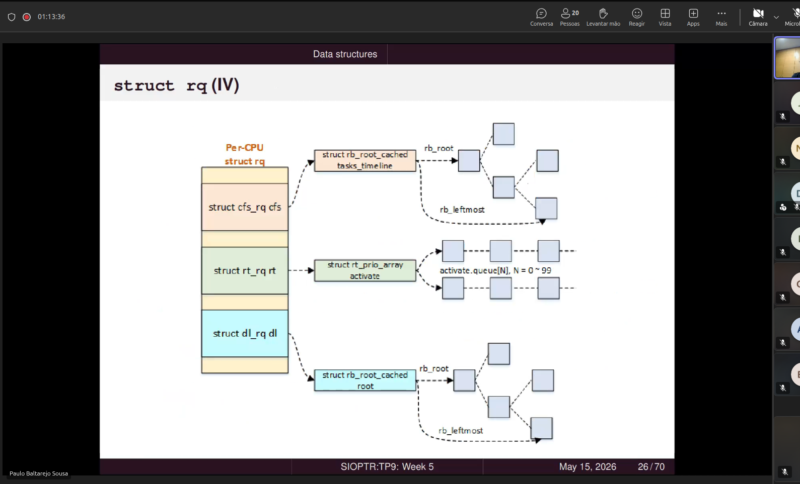

---

cada estrutura rq e constituida por sub rts uma para o cbs outra rpara o rt e ou tra para o dealine

depois cada uma delas tem estrutrar diferentes para orgranizar... 

sched enetity rb node

---
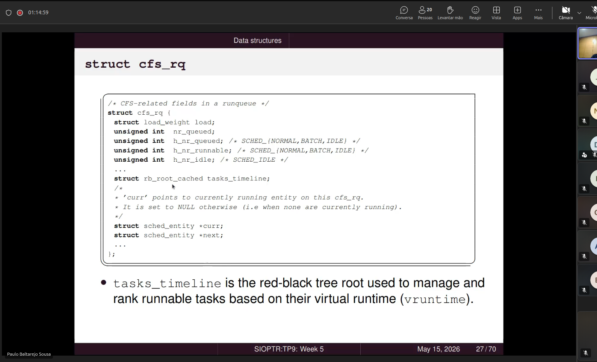

conjunto de camopo que vai permitir gerir as tarefas que vao permitir , campo de controle , conjunto de campos que sao necessario, para que a classee consiga fdazer os escalnoonamentos das tarefas, 

---

    Cada struct rq é uma runqueue por CPU. Dentro dela existem sub-runqueues por classe: cfs_rq para CFS, rt_rq para RT e dl_rq para Deadline. Cada sub-runqueue usa estruturas de dados próprias para organizar as tarefas runnable segundo a regra da sua classe.

## Ação — 1 passo 🎯

Escreve isto como frase corrigida:

> **Cada `struct rq` é uma runqueue por CPU. Dentro dela existem sub-runqueues por classe: `cfs_rq` para CFS, `rt_rq` para RT e `dl_rq` para Deadline. Cada sub-runqueue usa estruturas de dados próprias para organizar as tarefas runnable segundo a regra da sua classe.**

---

## Objetivo

Consolidar a arquitetura:

```text
CPU
└── struct rq
    ├── struct cfs_rq cfs
    │   └── tasks_timeline -> red-black tree por vruntime
    │
    ├── struct rt_rq rt
    │   └── active.queue[0..99] -> filas por prioridade RT
    │
    └── struct dl_rq dl
        └── root -> red-black tree por deadline absoluto
```

---

## Como pensar

### `rq`

É o nível da **CPU**.

Guarda:

```text
- quantas tarefas estão runnable
- qual tarefa está a executar
- subfilas CFS, RT e DL
- locks e máscaras de controlo
```

### `cfs_rq`

É o nível da **classe CFS**.

No slide aparece:

```c
struct rb_root_cached tasks_timeline;
struct sched_entity *curr;
struct sched_entity *next;
```

Isto quer dizer:

> `cfs_rq` tem os campos necessários para a classe CFS gerir tarefas normais.

O campo mais importante aqui é:

```c
tasks_timeline
```

porque é a árvore red-black onde as tarefas CFS runnable são ordenadas por:

```text
vruntime
```

A tarefa com menor `vruntime` tende a ser escolhida.

---

### `sched_entity`

É o nível da **tarefa vista pelo CFS**.

Cada tarefa CFS tem dentro da `task_struct` uma:

```c
struct sched_entity se;
```

Essa `sched_entity` contém, entre outros campos:

```c
struct rb_node run_node;
u64 vruntime;
```

Ligação mental:

```text
task_struct
└── sched_entity se
    ├── run_node   -> nó usado para entrar na árvore
    └── vruntime   -> valor usado para ordenar na árvore
```

Portanto:

```text
cfs_rq.tasks_timeline
    contém sched_entity.run_node
        que pertence a uma task_struct
```

---

## Pitfalls & troubleshooting ⚠️

1. **Não dizer “sub rts”**
   O termo correto é **sub-runqueues** ou **subfilas**.

2. **Não chamar CFS de CBS**
   Aqui é **CFS**, Completely Fair Scheduler. CBS é outra ideia ligada a servidores/deadline.

3. **Não confundir a árvore com a tarefa**
   A árvore guarda nós (`rb_node`) que estão dentro das entidades (`sched_entity`), que por sua vez pertencem às tarefas.

4. **Não assumir que todas as classes usam árvore**
   CFS e DL usam árvores red-black; RT usa filas por prioridade.

---

## Alternativas / tradeoffs

### Abordagem por níveis

```text
CPU -> rq -> cfs_rq -> sched_entity -> task_struct
```

Boa para perceber o código.

### Abordagem por pergunta

```text
CFS: quem recebeu menos CPU justa? -> vruntime
RT: quem tem maior prioridade fixa? -> prioridade 1..99
DL: quem tem deadline mais próximo? -> deadline absoluto
```

Boa para perceber o escalonamento.

---

## Pergunta de decisão

Queres agora seguir só com **`cfs_rq` e `tasks_timeline`**, para perceber como a árvore escolhe a próxima tarefa CFS?
---

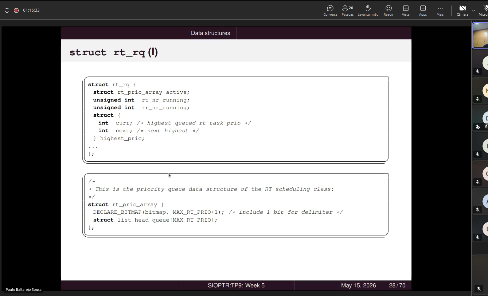

RT tem uma estrutura de dados rt_prio_array active;

array de cabecas de listas, macro valor dela e 99, max de rt e 99 ? 

pendurar tarefas em cada um dos niveis, bitmaop, para operacoes bitwise, variavel que contem XX bits para controlar, ao inves de comecar no nivel mais alto, analisa bit map sempre que e inserido essa variavel, e quando nao tem tarefas nesse nivel, 

---
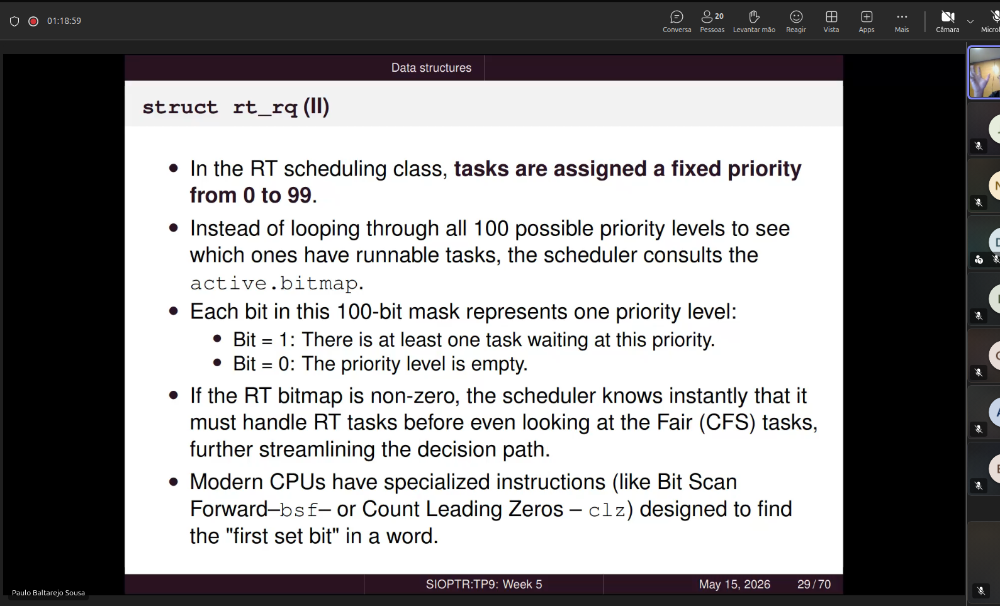
---

    rt_rq organiza tarefas RT com um array de listas por prioridade. Cada prioridade tem uma lista de tarefas, e o bitmap indica rapidamente quais prioridades têm tarefas prontas.

---
## Ação — 1 passo 🎯

Corrige a tua explicação para:

> **`rt_rq` organiza tarefas RT com um array de listas por prioridade. Cada prioridade tem uma lista de tarefas, e o `bitmap` indica rapidamente quais prioridades têm tarefas prontas.**

---

## Objetivo

Perceber porque o RT **não precisa de árvore red-black**.

No RT a prioridade é fixa, logo basta isto:

```text
rt_rq
└── active
    ├── bitmap              -> que prioridades têm tarefas?
    └── queue[0..MAX_RT_PRIO-1]
        ├── queue[0]
        ├── queue[1]
        ├── ...
        └── queue[99]
```

Cada `queue[N]` é uma lista ligada de tarefas RT com prioridade `N`.

---

## Como pensar

No slide:

```c
struct rt_rq {
    struct rt_prio_array active;
    unsigned int rt_nr_running;
    unsigned int rr_nr_running;

    struct {
        int curr;
        int next;
    } highest_prio;
};
```

E depois:

```c
struct rt_prio_array {
    DECLARE_BITMAP(bitmap, MAX_RT_PRIO+1);
    struct list_head queue[MAX_RT_PRIO];
};
```

A ideia é:

```text
queue[prioridade] = lista das tarefas com essa prioridade
bitmap[prioridade] = 1 se essa lista tem tarefas
bitmap[prioridade] = 0 se está vazia
```

Assim o scheduler não precisa fazer:

```text
ver prioridade 99
ver prioridade 98
ver prioridade 97
...
```

Ele consulta o `bitmap` e encontra rapidamente a prioridade ativa.

---

## Nota importante sobre 0–99 ⚠️

O slide diz “0 to 99”, mas em Linux há uma nuance:

```text
MAX_RT_PRIO = 100
```

Logo existem índices internos:

```text
0..99
```

Mas para o utilizador, as prioridades RT POSIX normalmente são:

```text
1..99
```

Por isso podes guardar assim:

```text
internamente: 0..99
interface/user-space: 1..99
```

---

## Exemplo mental

Imagina:

```text
Prioridade 90: tarefa A, tarefa B
Prioridade 50: tarefa C
Prioridade 20: tarefa D
```

Então:

```text
queue[90] -> A -> B
queue[50] -> C
queue[20] -> D
```

E o bitmap tem bits a 1 em:

```text
90, 50, 20
```

O scheduler olha para o bitmap e sabe logo:

> “A prioridade mais urgente que tem tarefas é 90.”

Depois escolhe uma tarefa da lista `queue[90]`.

---

## Pitfalls & troubleshooting

1. **`MAX_RT_PRIO` não quer dizer prioridade máxima user-space igual a 100**
   Internamente há 100 níveis; user-space normalmente usa 1–99.

2. **O `bitmap` não guarda tarefas**
   Guarda só flags: há ou não há tarefas naquela prioridade.

3. **`queue[N]` é que guarda as tarefas**
   Mais precisamente, guarda os nós/listas das entidades RT.

4. **RT não ordena por tempo nem por deadline**
   Ordena primeiro por prioridade fixa; dentro da mesma prioridade depende de FIFO/RR.

---

## Alternativas / tradeoffs

### RT com array + bitmap

Muito rápido para prioridades fixas.

```text
boa escolha quando o número de prioridades é limitado e conhecido
```

### RT com árvore

Não faria tanto sentido aqui.

```text
mais flexível, mas desnecessário para 100 prioridades fixas
```

---

## Pergunta de decisão

Queres agora perceber **como `SCHED_FIFO` e `SCHED_RR` diferem dentro da mesma `queue[N]`**?
---

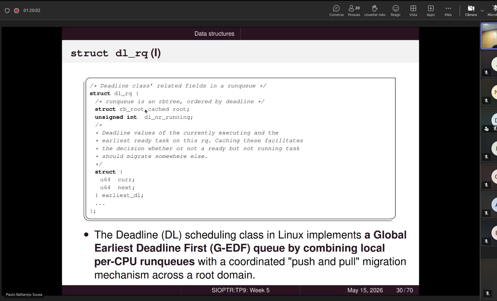

---

tarefa que tem deadline mais proximo, a semelhanca que acontece sched identity, tem todos os campos associados a cada tarefa . 

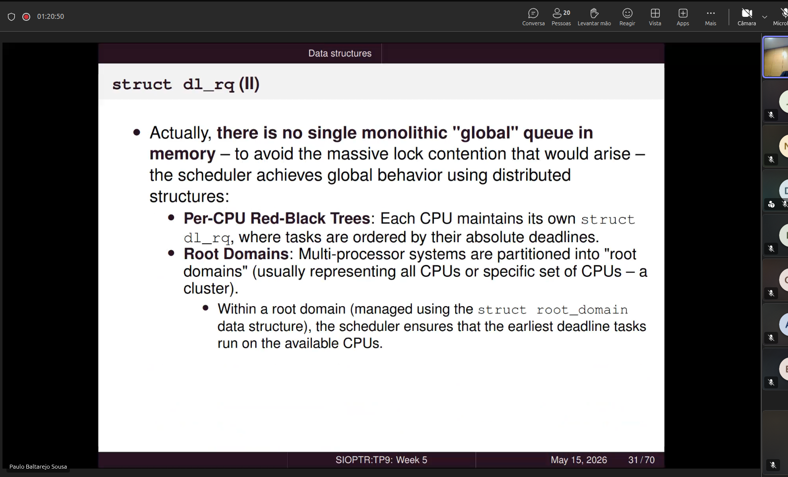
---

ja agora dealine runqueue por cpou, abordagem global runqueu distrivbuida, de forma global.
---

quando tempos algo que e distribuido de forma global, o sched deadline usa global edf , com runque por cpu, 

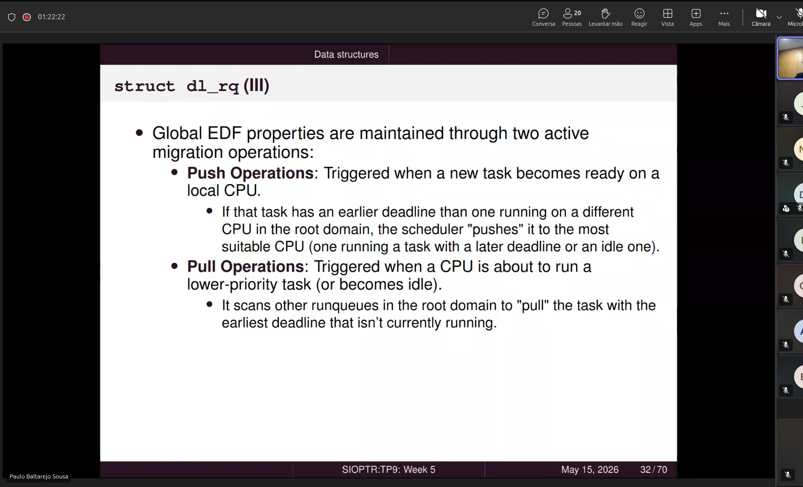
## Ação — 1 passo 🎯

Corrige a tua frase para esta versão:

> **A classe Deadline usa uma `dl_rq` por CPU, organizada como árvore red-black por deadline absoluto. Mesmo assim, o comportamento pretendido é “global EDF”, obtido por migração push/pull entre as runqueues das CPUs dentro do mesmo root domain.**

---

## Objetivo

Separar duas coisas que parecem contraditórias:

```text
estrutura física no kernel  -> per-CPU dl_rq
comportamento lógico        -> Global EDF aproximado/distribuído
```

Ou seja:

```text
não existe uma única fila global gigante
mas o kernel tenta comportar-se como se escolhesse globalmente os deadlines mais urgentes
```

---

## Como pensar

### 1. Dentro de cada CPU

Cada CPU tem:

```text
CPU0 -> rq0 -> dl_rq0
CPU1 -> rq1 -> dl_rq1
CPU2 -> rq2 -> dl_rq2
```

Cada `dl_rq` é uma árvore ordenada por:

```text
deadline absoluto
```

A tarefa/job com deadline mais próximo fica acessível rapidamente.

---

### 2. Em multiprocessador

Se fosse uma fila global única:

```text
uma só global_dl_queue para todas as CPUs
```

seria simples teoricamente, mas péssimo para performance:

```text
muitas CPUs a competir pelo mesmo lock
```

Por isso o Linux usa uma solução distribuída:

```text
várias dl_rq locais + coordenação por root domain
```

---

### 3. Push e Pull

#### Push

Acontece quando uma tarefa DL fica pronta numa CPU.

Pergunta do scheduler:

```text
esta tarefa tem deadline mais urgente do que alguma tarefa a correr noutra CPU?
```

Se sim, pode empurrá-la para uma CPU mais adequada.

#### Pull

Acontece quando uma CPU fica livre ou está prestes a correr algo menos urgente.

Pergunta do scheduler:

```text
há noutra runqueue uma tarefa DL pronta com deadline mais urgente que eu devia puxar?
```

---

## Pitfalls & troubleshooting ⚠️

1. **Não dizer “há uma global runqueue única”**
   O slide diz o contrário: não há uma fila global monolítica.

2. **Não confundir `dl_rq` com `sched_dl_entity`**
   `dl_rq` é a fila da CPU; `sched_dl_entity` é a entidade DL de uma tarefa.

3. **Não esquecer que a ordenação é por deadline absoluto**
   Não é por período nem por runtime isoladamente.

4. **Não assumir que global EDF é perfeito/instantâneo**
   O Linux aproxima comportamento global com estruturas distribuídas e migração.

---

## Alternativas / tradeoffs

### Fila global única

```text
+ decisão simples
- contenção enorme em locks
- má escalabilidade em multicore
```

### Runqueues por CPU + push/pull

```text
+ escala melhor
+ reduz contenção
- lógica mais complexa
- precisa migração/coordenar CPUs
```

---

## Pergunta de decisão

Queres agora ligar isto ao exemplo prático de **Global EDF vs Partitioned EDF** que fizeste no teste?

---
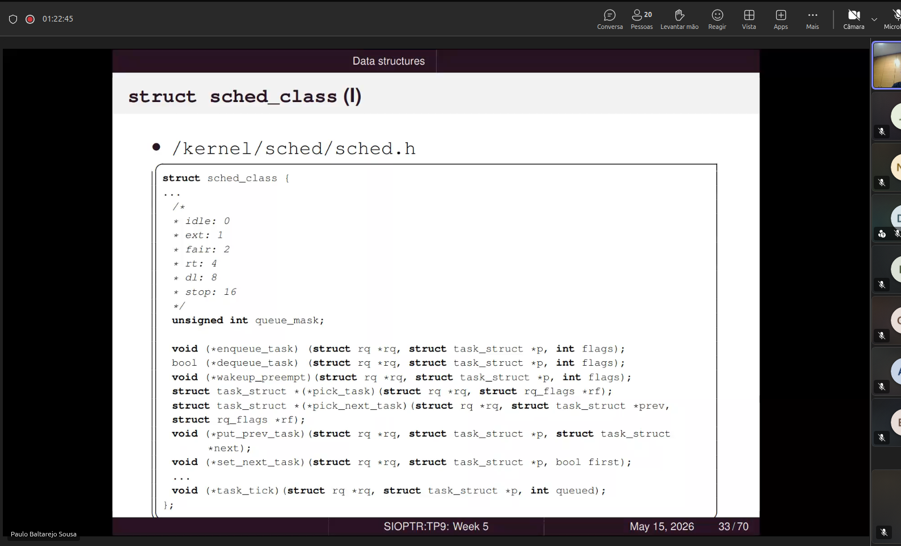

sub rq para fazer .. classes de escalonamento ', cada classe nao e mais nem menos que uma estrutura de dados. atibuir funcoes neste apontador que tem estes argumentos 

---

## Ação — 1 passo 🎯

Corrige para esta frase:

> **`struct sched_class` não é a fila nem a estrutura onde as tarefas ficam guardadas; é uma tabela de funções que define como cada classe de escalonamento opera sobre a `rq` e sobre as `task_struct`.**

---

## Objetivo

Separar três níveis:

```text
1. rq / cfs_rq / rt_rq / dl_rq
   -> guardam e organizam tarefas runnable

2. task_struct / sched_entity / sched_rt_entity / sched_dl_entity
   -> guardam dados da tarefa

3. sched_class
   -> guarda ponteiros para funções: enqueue, dequeue, pick_next, task_tick...
```

Ou seja:

```text
dados         -> rq, cfs_rq, rt_rq, dl_rq, task_struct
comportamento -> sched_class
```

---

## Como pensar

A `sched_class` é parecida com uma “interface” em C.

No slide:

```c
struct sched_class {
    unsigned int queue_mask;

    void (*enqueue_task)(struct rq *rq, struct task_struct *p, int flags);
    bool (*dequeue_task)(struct rq *rq, struct task_struct *p, int flags);
    void (*wakeup_preempt)(struct rq *rq, struct task_struct *p, int flags);

    struct task_struct *(*pick_task)(struct rq *rq);
    struct task_struct *(*pick_next_task)(struct rq *rq,
                                          struct task_struct *prev,
                                          struct rq_flags *rf);

    void (*put_prev_task)(struct rq *rq,
                          struct task_struct *p,
                          struct task_struct *next);

    void (*set_next_task)(struct rq *rq,
                          struct task_struct *p,
                          bool first);

    void (*task_tick)(struct rq *rq,
                      struct task_struct *p,
                      int queued);
};
```

Isto quer dizer:

```text
enqueue_task   -> como inserir uma tarefa na fila da classe
dequeue_task   -> como remover uma tarefa
pick_next_task -> como escolher a próxima tarefa
task_tick      -> o que fazer a cada tick/interrupção de timer
```

Cada classe implementa estas funções de maneira diferente.

---

## Exemplo mental

Para CFS:

```text
enqueue_task -> inserir sched_entity na red-black tree
pick_next    -> escolher menor vruntime
```

Para RT:

```text
enqueue_task -> inserir sched_rt_entity na queue[priority]
pick_next    -> escolher maior prioridade ativa no bitmap
```

Para DL:

```text
enqueue_task -> inserir sched_dl_entity na árvore por deadline absoluto
pick_next    -> escolher menor deadline absoluto
```

A mesma função conceptual existe em todas:

```text
“escolhe a próxima tarefa”
```

mas cada classe responde com a sua regra.

---

## Pitfalls & troubleshooting ⚠️

1. **Não dizer que `sched_class` é só uma estrutura de dados de tarefas**
   Ela é uma estrutura com ponteiros para funções.

2. **Não confundir `queue_mask` da classe com a fila em si**
   A fila está na `rq`; a máscara ajuda a identificar classes com trabalho.

3. **Não pensar que `pick_next_task` faz sempre a mesma coisa**
   Em CFS, RT e DL, a função tem o mesmo papel, mas implementação diferente.

4. **Isto é polimorfismo em C**
   Não há classes C++ aqui, mas o kernel usa structs com function pointers para obter comportamento semelhante.

---

## Alternativas / tradeoffs

### Ver como “classe” de C++

```text
sched_class = interface virtual
CFS/RT/DL = implementações concretas
```

Boa analogia para perceber.

### Ver como “driver model”

```text
mesmo conjunto de callbacks
cada backend implementa à sua maneira
```

Boa analogia para kernel/embedded.

---

## Pergunta de decisão

Queres agora perceber **como `pick_next_task()` muda entre CFS, RT e DL**?
---

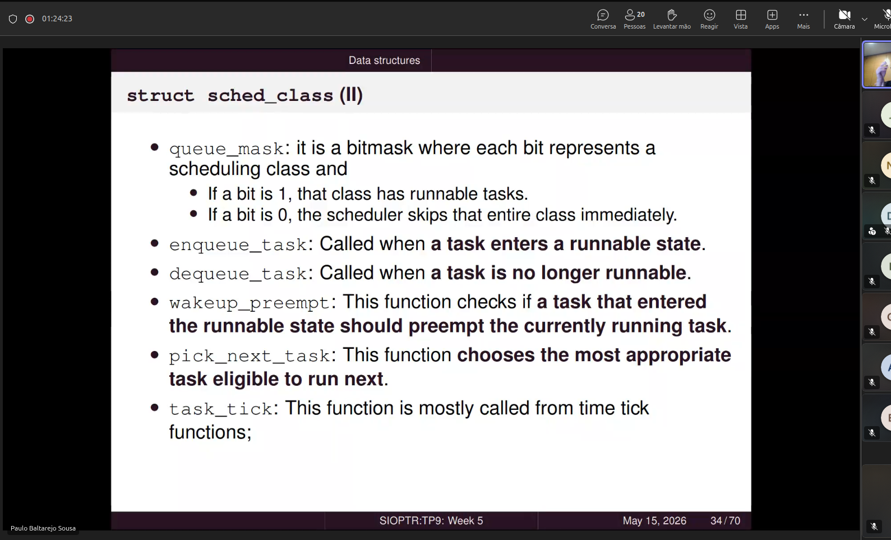

    struct sched_class define as operações que uma classe de escalonamento tem de implementar: inserir tarefa, remover tarefa, decidir preempção, escolher próxima tarefa e atualizar estado a cada tick.

## Ação — 1 passo 🎯

Escreve esta leitura do slide:

> **`struct sched_class` define as operações que uma classe de escalonamento tem de implementar: inserir tarefa, remover tarefa, decidir preempção, escolher próxima tarefa e atualizar estado a cada tick.**

---

## Objetivo

Perceber que `sched_class` é o **comportamento** da classe.

```text
cfs_rq / rt_rq / dl_rq  -> onde as tarefas ficam organizadas
sched_class             -> que funções sabem manipular essas estruturas
```

---

## Como pensar

Cada função do slide responde a uma pergunta do scheduler:

| Campo/função     | Pergunta que responde                        |
| ---------------- | -------------------------------------------- |
| `queue_mask`     | Esta classe tem tarefas runnable?            |
| `enqueue_task`   | Como coloco esta tarefa na fila?             |
| `dequeue_task`   | Como retiro esta tarefa da fila?             |
| `wakeup_preempt` | A tarefa que acordou deve preemptar a atual? |
| `pick_next_task` | Quem deve correr a seguir?                   |
| `task_tick`      | O que atualizo a cada tick de tempo?         |

A mesma chamada existe para várias classes, mas a implementação muda:

```text
CFS enqueue    -> inserir na árvore por vruntime
RT enqueue     -> inserir na lista da prioridade N
DL enqueue     -> inserir na árvore por deadline absoluto
```

E:

```text
CFS pick_next  -> menor vruntime
RT pick_next   -> maior prioridade ativa no bitmap
DL pick_next   -> menor deadline absoluto
```

---

## Pitfalls & troubleshooting ⚠️

1. **`sched_class` não guarda as tarefas**
   As tarefas ficam nas sub-runqueues: `cfs_rq`, `rt_rq`, `dl_rq`.

2. **`sched_class` guarda ponteiros para funções**
   É polimorfismo em C: mesma interface, comportamento diferente.

3. **`queue_mask` não é a mesma coisa que `active.bitmap` do RT**
   `queue_mask` indica classes com tarefas; `active.bitmap` indica prioridades RT com tarefas.

4. **`task_tick` não escolhe necessariamente uma nova tarefa**
   Ele atualiza contadores/tempo e pode causar necessidade de reescalonamento.

---

## Alternativas / tradeoffs

### Visão “dados vs comportamento”

```text
dados         -> rq, cfs_rq, rt_rq, dl_rq
comportamento -> sched_class
```

### Visão “interface”

```text
sched_class = contrato comum
CFS/RT/DL   = implementações diferentes
```

---

## Pergunta de decisão

Queres agora fazer o caminho completo de uma tarefa que acorda: **`wakeup → enqueue_task → wakeup_preempt → pick_next_task`**?
---

## Ação — 1 passo 🎯

Faz esta cadeia no caderno para memorizar o fluxo:

```text
tarefa acorda
   ↓
enqueue_task()
   ↓
wakeup_preempt()
   ↓
pick_next_task()
   ↓
task_tick()
```

---

## Objetivo

Perceber **quando cada função da `sched_class` é chamada**.

A `sched_class` não é a fila; é o conjunto de operações que sabe manipular a fila daquela classe.

---

## Como pensar

### `queue_mask`

```text
bit = 1 -> esta classe tem tarefas runnable
bit = 0 -> esta classe está vazia
```

Exemplo conceptual:

```text
STOP  DL  RT  FAIR  IDLE
 0    1   1    0     0
```

Significa:

```text
há tarefas DL e RT prontas
não há tarefas CFS prontas
```

Assim o scheduler evita procurar em classes vazias.

---

### `enqueue_task`

Chamada quando uma tarefa fica pronta.

Exemplo:

```text
tarefa bloqueada em I/O termina espera
   ↓
fica runnable
   ↓
enqueue_task()
```

Depois cada classe faz diferente:

```text
CFS -> põe na árvore por vruntime
RT  -> põe na lista da prioridade
DL  -> põe na árvore por deadline absoluto
```

---

### `dequeue_task`

Chamada quando a tarefa deixa de estar pronta.

Exemplo:

```text
tarefa bloqueia em mutex/I/O/sleep
   ↓
já não pode correr
   ↓
dequeue_task()
```

---

### `wakeup_preempt`

Pergunta:

> “A tarefa que acabou de acordar é mais importante do que a que está a executar?”

Exemplos:

```text
DL acorda com deadline mais cedo -> pode preemptar
RT acorda com prioridade maior -> pode preemptar
CFS acorda com vruntime menor -> pode preemptar, dependendo das regras CFS
```

---

### `pick_next_task`

Escolhe quem corre a seguir:

```text
DL  -> menor deadline absoluto
RT  -> maior prioridade ativa
CFS -> menor vruntime
```

---

### `task_tick`

Chamado a cada tick de temporizador.

Serve para atualizar tempo consumido, fatias de tempo, runtime, necessidade de reescalonamento, etc.

Exemplo:

```text
SCHED_RR -> decrementa time slice
CFS      -> atualiza vruntime
DL       -> controla runtime disponível
```

---

## Pitfalls & troubleshooting ⚠️

1. **`enqueue_task` não significa executar imediatamente**
   Só coloca a tarefa como candidata.

2. **`wakeup_preempt` não escolhe sempre nova tarefa**
   Só verifica se deve haver preempção.

3. **`pick_next_task` é onde a escolha acontece**
   Cada classe escolhe de acordo com a sua política.

4. **`task_tick` é atualização periódica**
   Não é uma fila, nem uma tarefa.

---

## Alternativas / tradeoffs

### Visão por evento

```text
acordou -> enqueue + wakeup_preempt
bloqueou -> dequeue
CPU precisa escolher -> pick_next_task
tempo passou -> task_tick
```

### Visão por classe

```text
mesma função conceptual
implementação diferente em CFS, RT e DL
```

---

## Pergunta de decisão

Queres agora fazer um exemplo concreto: **uma tarefa RT acorda enquanto uma CFS está a correr**?
---


    pick_task faz uma escolha mais simples dentro de uma classe; pick_next_task é a operação mais completa usada na troca de contexto para escolher e preparar a próxima tarefa a executar. put_prev_task faz o contrário: trata a tarefa anterior antes de ela deixar o CPU.

## Ação — 1 passo 🎯

Corrige assim:

> **`pick_task` faz uma escolha mais simples dentro de uma classe; `pick_next_task` é a operação mais completa usada na troca de contexto para escolher e preparar a próxima tarefa a executar. `put_prev_task` faz o contrário: trata a tarefa anterior antes de ela deixar o CPU.**

---

## Objetivo

Separar três momentos:

```text
pick_task       -> procurar uma candidata
pick_next_task  -> escolher/preparar a próxima tarefa
put_prev_task   -> guardar/atualizar a tarefa que estava a correr
```

---

## Como pensar

Quando há troca de tarefa, o kernel não faz só “escolher a próxima”. Ele precisa:

```text
1. tratar a tarefa anterior
2. escolher a nova tarefa
3. marcar a nova como current/next
```

No slide:

```c
struct task_struct *(*pick_task)(struct rq *rq, struct rq_flags *rf);

struct task_struct *(*pick_next_task)(struct rq *rq,
                                      struct task_struct *prev,
                                      struct rq_flags *rf);

void (*put_prev_task)(struct rq *rq,
                      struct task_struct *p,
                      struct task_struct *next);
```

### `pick_task`

Pensa como:

> “Dá-me uma tarefa candidata desta classe.”

Pode ser usado para procurar rapidamente uma tarefa elegível.

### `pick_next_task`

Pensa como:

> “Escolhe oficialmente a próxima tarefa para correr, considerando a tarefa anterior e o estado da `rq`.”

Tem mais contexto porque recebe:

```c
struct task_struct *prev
```

ou seja, sabe quem estava a executar antes.

### `put_prev_task`

Pensa como:

> “Antes de tirar esta tarefa do CPU, atualiza o estado dela.”

Exemplos:

```text
CFS -> atualiza vruntime da tarefa anterior
RT  -> pode tratar time slice / posição na fila
DL  -> atualiza runtime/deadline/estado da entidade DL
```

---

## Pitfalls & troubleshooting ⚠️

1. **Não dizer que `pick_task` e `pick_next_task` são exatamente iguais**
   Têm papel parecido, mas `pick_next_task` é mais completo.

2. **`put_prev_task` não escolhe a próxima tarefa**
   Ele trata a tarefa que estava a correr.

3. **`prev` é importante**
   A próxima escolha pode depender do estado da tarefa anterior.

4. **Cada classe implementa isto à sua maneira**
   CFS, RT e DL usam as mesmas callbacks conceptuais, mas com lógica diferente.

---

## Alternativas / tradeoffs

### Visão simples para exame

```text
put_prev_task  -> trata a tarefa antiga
pick_next_task -> escolhe a tarefa nova
```

### Visão kernel

```text
pick_task      -> seleção auxiliar/candidata
pick_next_task -> seleção completa no caminho de schedule()
```

---

## Pergunta de decisão

Queres que eu explique agora o fluxo real: **`put_prev_task()` → `pick_next_task()` → `set_next_task()`**?


---

## Ação — 1 passo 🎯

Desenha este fluxo da troca de contexto:

```text
put_prev_task(prev)
   ↓
pick_next_task(rq, prev)
   ↓
set_next_task(next)
```

---

## Objetivo

Perceber que a troca de contexto não é só “escolher a próxima tarefa”.

O scheduler precisa de:

```text
1. fechar/atualizar a tarefa anterior
2. escolher a próxima tarefa
3. preparar a próxima para executar
```

---

## Como pensar

### 1. `put_prev_task(prev)`

Pergunta:

> “Antes de tirar esta tarefa do CPU, o que tenho de atualizar?”

Exemplos:

| Classe | O que pode atualizar                |
| ------ | ----------------------------------- |
| CFS    | `vruntime` da tarefa anterior       |
| RT     | estado da fila/time slice           |
| DL     | runtime consumido e estado deadline |

Pensa assim:

```text
prev estava a correr
agora vai sair
logo preciso registar o que ela consumiu
```

---

### 2. `pick_next_task(rq, prev)`

Pergunta:

> “Dado o estado atual da runqueue, quem deve correr agora?”

Aqui entra a política:

```text
DL  -> menor deadline absoluto
RT  -> maior prioridade ativa
CFS -> menor vruntime
Idle -> se não houver nada
```

Esta função é mais completa do que `pick_task` porque recebe também:

```c
struct task_struct *prev
```

ou seja, sabe quem estava a correr antes.

---

### 3. `set_next_task(next)`

Pergunta:

> “Depois de escolher esta tarefa, como preparo-a como próxima/current?”

Exemplos:

```text
atualizar ponteiros internos
marcar entidade como current
preparar estado da classe
```

Depois disso, a CPU passa a executar a nova tarefa.

---

## Pitfalls & troubleshooting ⚠️

1. **`put_prev_task` não escolhe a próxima**
   Só atualiza a tarefa que estava a correr.

2. **`pick_next_task` não é só consulta**
   É a escolha efetiva no caminho de scheduling.

3. **`set_next_task` não insere tarefa na fila**
   Ela prepara a tarefa escolhida para execução.

4. **Cada classe implementa estas callbacks de forma diferente**
   A interface é comum; a lógica interna muda.

---

## Pergunta de decisão

Queres agora um exemplo concreto com **uma CFS a correr e uma RT a acordar**, usando este fluxo?


---

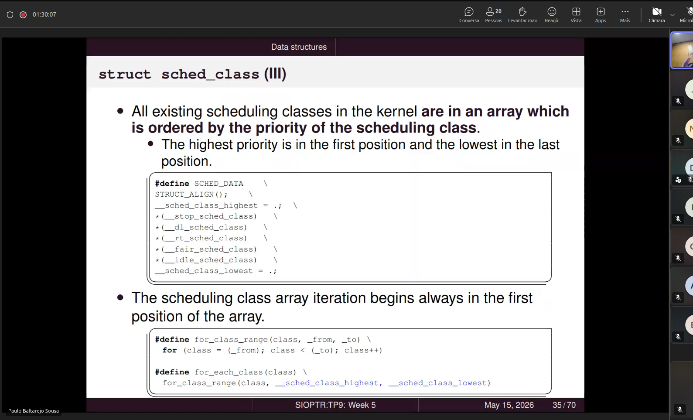

---

## Ação — 1 passo 🎯

Lê este slide como a **ordem fixa de prioridade entre classes de escalonamento**:

```text
STOP > DL > RT > FAIR/CFS > IDLE
```

---

## Objetivo

Perceber que o scheduler não começa por olhar para todas as tarefas individualmente.

Primeiro ele pergunta:

> **Que classe de escalonamento tem prioridade mais alta e tem tarefas runnable?**

Só depois entra na estrutura interna dessa classe.

---

## Como pensar

O array mostrado no slide está ordenado assim:

```c
*(__stop_sched_class)
*(__dl_sched_class)
*(__rt_sched_class)
*(__fair_sched_class)
*(__idle_sched_class)
```

Isto significa:

| Ordem | Classe | Função                      |
| ----: | ------ | --------------------------- |
|     1 | `stop` | tarefas especiais do kernel |
|     2 | `dl`   | `SCHED_DEADLINE`            |
|     3 | `rt`   | `SCHED_FIFO` / `SCHED_RR`   |
|     4 | `fair` | CFS / tarefas normais       |
|     5 | `idle` | quando não há mais nada     |

Então o scheduler percorre as classes por ordem:

```text
1. há STOP runnable?
2. senão, há DL runnable?
3. senão, há RT runnable?
4. senão, há CFS runnable?
5. senão, IDLE
```

Dentro de cada classe, aplica a regra própria:

```text
DL  -> menor deadline absoluto
RT  -> maior prioridade fixa
CFS -> menor vruntime
```

---

## Pitfalls & troubleshooting ⚠️

1. **DL vem antes de RT no array de classes**
   Mesmo que RT tenha prioridade 99, `SCHED_DEADLINE` é uma classe acima de RT.

2. **RT priority 1–99 só vale dentro da classe RT**
   Não compara diretamente com CFS ou DL.

3. **CFS só é escolhido se não houver DL nem RT runnable**
   Por isso CFS pode sofrer starvation sem mecanismos de proteção.

4. **IDLE é uma classe real no scheduler**
   Corre quando nenhuma outra classe tem tarefa pronta.

---

## Alternativas / tradeoffs

### Visão por classes

```text
primeiro escolhe a classe
depois escolhe a tarefa dentro da classe
```

### Visão por pergunta

```text
qual é a classe mais urgente com trabalho?
dentro dela, qual é a tarefa mais urgente?
```

---

## Pergunta de decisão

Queres agora fechar a aula com um **resumo único da arquitetura `task_struct → sched_entity → rq → sched_class`**?


---

lista ligad organizada, agora e um array de apontadores
---
## Ação — 1 passo 🎯

Corrige para esta frase:

> **No `sched_class`, as classes estão organizadas como um array de ponteiros para estruturas `sched_class`, ordenado da classe mais prioritária para a menos prioritária.**

---

## Objetivo

Distinguir isto de uma lista ligada.

Antes poderias imaginar:

```text
stop -> dl -> rt -> fair -> idle
```

Mas neste slide, a ideia apresentada é:

```text
array de ponteiros:
[ stop ][ dl ][ rt ][ fair ][ idle ]
```

Cada posição aponta para uma estrutura:

```text
__stop_sched_class
__dl_sched_class
__rt_sched_class
__fair_sched_class
__idle_sched_class
```

---

## Como pensar

O scheduler percorre o array desde o início:

```text
posição 0 -> STOP
posição 1 -> DL
posição 2 -> RT
posição 3 -> FAIR/CFS
posição 4 -> IDLE
```

E pergunta:

```text
esta classe tem tarefas runnable?
```

Se sim, chama a função dessa classe:

```c
class->pick_next_task(...)
```

A vantagem do array é simples:

```text
ordem fixa + acesso sequencial rápido
```

A classe em si continua a ser uma estrutura com ponteiros para funções:

```text
sched_class
 ├── enqueue_task
 ├── dequeue_task
 ├── pick_next_task
 └── task_tick
```

---

## Pitfalls & troubleshooting ⚠️

1. **Não é a lista das tarefas**
   É a lista/array das **classes**.

2. **Não é `rt_prio_array`**
   `rt_prio_array` é para prioridades RT. Este array é para classes: STOP, DL, RT, FAIR, IDLE.

3. **A ordem do array define prioridade entre classes**
   `DL` vem antes de `RT`; `RT` vem antes de `CFS`.

4. **Dentro da classe há outra estrutura**
   `DL` usa árvore; `RT` usa array de listas; `CFS` usa árvore.

---

## Pergunta de decisão

Queres que eu faça agora o mapa completo em uma linha: **array de classes → sub-runqueue → entidade da tarefa**?

---
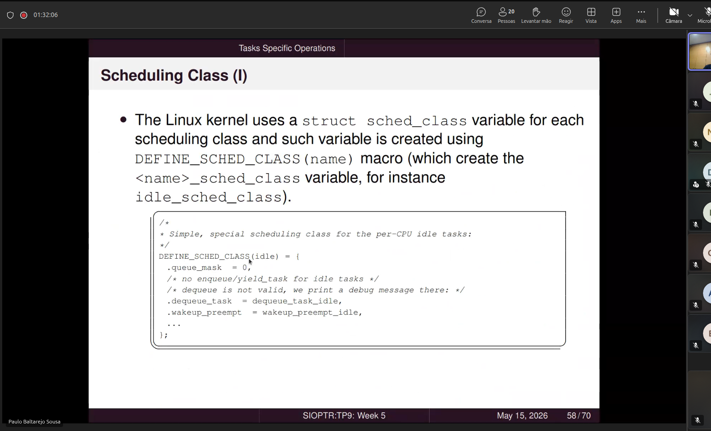
---
## Ação — 1 passo 🎯

Corrige para:

> **Para cada classe de escalonamento existe uma variável global `struct sched_class`, criada pela macro `DEFINE_SCHED_CLASS(name)`. Essa variável contém os ponteiros para as funções específicas dessa classe.**

Exemplo do slide:

```c
DEFINE_SCHED_CLASS(idle) = {
    .queue_mask     = 0,
    .dequeue_task   = dequeue_task_idle,
    .wakeup_preempt = wakeup_preempt_idle,
    ...
};
```

Isto cria, conceptualmente:

```c
idle_sched_class
```

---

## Objetivo

Perceber que agora já não estamos a falar da **estrutura genérica**:

```c
struct sched_class
```

Estamos a falar de **instâncias concretas** dessa estrutura:

```text
stop_sched_class
dl_sched_class
rt_sched_class
fair_sched_class
idle_sched_class
```

Cada uma aponta para funções diferentes.

---

## Como pensar

A `struct sched_class` é o molde:

```text
sched_class
 ├── enqueue_task
 ├── dequeue_task
 ├── wakeup_preempt
 ├── pick_next_task
 └── task_tick
```

Depois cada classe preenche esse molde com as suas funções:

```text
fair_sched_class
 ├── enqueue_task   = enqueue_task_fair
 ├── dequeue_task   = dequeue_task_fair
 ├── pick_next_task = pick_next_task_fair
```

```text
rt_sched_class
 ├── enqueue_task   = enqueue_task_rt
 ├── dequeue_task   = dequeue_task_rt
 ├── pick_next_task = pick_next_task_rt
```

```text
dl_sched_class
 ├── enqueue_task   = enqueue_task_dl
 ├── dequeue_task   = dequeue_task_dl
 ├── pick_next_task = pick_next_task_dl
```

A classe `idle` é especial: não tem tarefas normais para pôr numa fila. Por isso o slide mostra:

```c
.queue_mask = 0
```

e comentários como:

```text
no enqueue/yield_task for idle tasks
```

---

## Pitfalls & troubleshooting ⚠️

1. **`DEFINE_SCHED_CLASS(idle)` não cria uma nova política dinâmica**
   Cria a variável/objeto da classe idle em tempo de compilação.

2. **`idle_sched_class` é uma instância de `struct sched_class`**
   Não é uma `rq`, nem uma `task_struct`.

3. **Cada classe tem funções próprias**
   O nome da callback muda: `dequeue_task_idle`, `dequeue_task_fair`, `dequeue_task_rt`, etc.

4. **A macro esconde código**
   Em kernel C, macros são usadas para gerar nomes e colocar objetos em secções específicas.

---

## Pergunta de decisão

Queres agora fechar com o mapa final: **`task_struct` → `sched_class` → `rq` → sub-runqueue → função `pick_next_task`**?

---

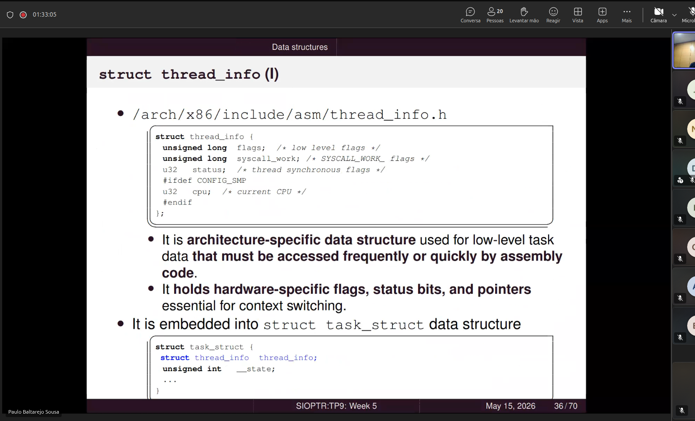

Quando acontece alugma coisa no sitema o escalonador tem de ser invocado, nem sempre posso oinvocar a funcaoi do sescalonador. a funcao scdul faz um lock a ruin queu interupot context
deadlock

---
## Ação — 1 passo 🎯

Corrige para esta frase:

> **Quando algo acontece que exige reescalonamento, o kernel nem sempre chama imediatamente `schedule()`. Muitas vezes apenas marca uma flag em `thread_info`, como “preciso reescalonar”, e a chamada real a `schedule()` acontece depois, num ponto seguro.**

---

## Objetivo

Perceber para que serve `thread_info` neste contexto:

```c
struct thread_info {
    unsigned long flags;
    unsigned long syscall_work;
    u32 status;
#ifdef CONFIG_SMP
    u32 cpu;
#endif
};
```

O campo importante aqui é:

```c
unsigned long flags;
```

Ele guarda flags de baixo nível, por exemplo:

```text
“esta tarefa precisa de reschedule”
```

---

## Como pensar

O scheduler pode ser necessário quando:

```text
- uma tarefa RT acorda
- uma tarefa DL com deadline mais cedo fica pronta
- a tarefa atual gastou o seu time slice
- uma tarefa bloqueia
- uma interrupção de timer ocorre
```

Mas há contextos perigosos onde chamar diretamente `schedule()` pode ser errado:

```text
interrupt context
spinlock held
região crítica
código atómico
```

Porquê?

Porque `schedule()` mexe na `rq`, faz locks, troca contexto e pode dormir/ceder CPU. Se for chamado enquanto já estás num contexto onde isso não é permitido, podes criar deadlock ou corrupção de estado.

Então o kernel faz algo como:

```text
não posso trocar agora
   ↓
marco flag: need_resched
   ↓
quando voltar a um ponto seguro
   ↓
chamo schedule()
```

---

## Ligação ao slide

`thread_info` é específico da arquitetura e contém informação que precisa ser acedida rapidamente, até por assembly.

Pensa nele como uma zona de controlo rápido associada à tarefa:

```text
task_struct
└── thread_info
    ├── flags          -> flags low-level
    ├── syscall_work   -> trabalho pendente em syscalls
    ├── status         -> estado baixo nível
    └── cpu            -> CPU atual, em SMP
```

A flag de reschedule é a ideia central:

```text
TIF_NEED_RESCHED
```

Interpretação:

> “Assim que for seguro, chama o scheduler.”

---

## Pitfalls & troubleshooting ⚠️

1. **Não chamar `schedule()` em qualquer sítio**
   Em interrupt context ou com certos locks, pode dar problema.

2. **Marcar flag não é trocar imediatamente**
   A flag só adia a decisão para um ponto seguro.

3. **`thread_info` não substitui `task_struct`**
   É uma parte mais baixa/rápida, embutida na `task_struct`.

4. **Deadlock pode acontecer se o scheduler tentar adquirir locks já presos**
   Especialmente relacionado com `rq->__lock`.

---

## Pergunta de decisão

Queres seguir agora para **`TIF_NEED_RESCHED` / flags**, ou para **porque `schedule()` não pode correr em interrupt context**?
---

variavel fazer , e necessario chamr o escalonador 

---

    thread_info contém flags e informação low-level da tarefa atual, incluindo flags que permitem ao kernel marcar que a tarefa atribuída à CPU deve ser preemptada ou reescalonada quando for seguro.

---

## Ação — 1 passo 🎯

Corrige para esta frase:

> **`thread_info` contém flags e informação low-level da tarefa atual, incluindo flags que permitem ao kernel marcar que a tarefa atribuída à CPU deve ser preemptada ou reescalonada quando for seguro.**

---

## Objetivo

Separar duas ideias:

```text
CPU tem sempre uma tarefa associada
```

Sim. Mesmo quando não há trabalho útil, a CPU corre a `idle task`.

```text
thread_info.flags pode marcar necessidade de reschedule
```

Sim. A flag não troca logo a tarefa; apenas sinaliza que a troca deve acontecer num ponto seguro.

---

## Como pensar

A CPU está sempre neste estado conceptual:

```text
CPU
└── curr -> task_struct atual
           └── thread_info
               └── flags
```

Essas flags podem dizer coisas como:

```text
esta tarefa precisa de ser reescalonada
há trabalho pendente ao voltar de syscall/interrupção
estado low-level dependente da arquitetura
```

A ideia prática é:

```text
evento acontece
   ↓
não posso chamar schedule() agora
   ↓
marco flag em thread_info
   ↓
quando sair para um ponto seguro
   ↓
kernel chama schedule()
```

---

## Pitfalls & troubleshooting ⚠️

1. **Preempção não acontece sempre no instante em que a flag é marcada**
   Pode ser adiada até um ponto seguro.

2. **A CPU nunca fica “sem tarefa”**
   Se não houver outra, corre `idle`.

3. **`thread_info` não é a runqueue**
   A `rq` sabe quem está pronto; `thread_info` guarda estado low-level da tarefa.

4. **`__state` e `thread_info.flags` não são a mesma coisa**
   `__state` indica estado da tarefa; `flags` guarda flags low-level usadas pelo kernel/arquitetura.

---

## Pergunta de decisão

Queres agora distinguir **`thread_info.flags`** de **`task_struct.__state`**?

---
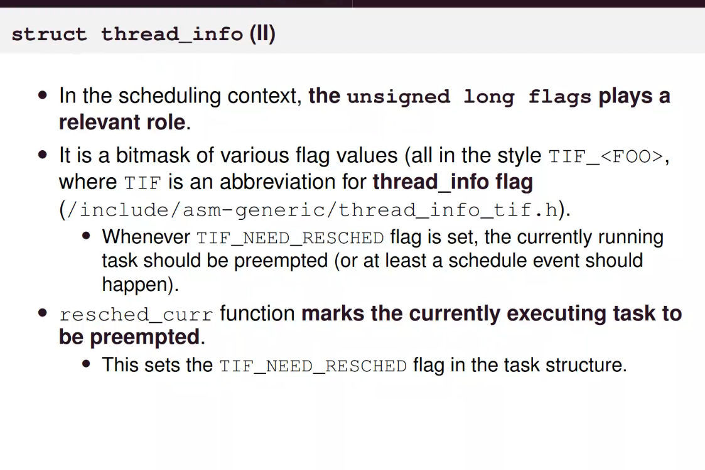

    Quando um evento acontece em interrupt context, o kernel pode marcar TIF_NEED_RESCHED em thread_info.flags; quando o handler termina e o kernel regressa a um ponto seguro, essa flag é verificada e o escalonador pode ser invocado.

---
## Ação — 1 passo 🎯

Corrige para esta frase:

> **Quando um evento acontece em interrupt context, o kernel pode marcar `TIF_NEED_RESCHED` em `thread_info.flags`; quando o handler termina e o kernel regressa a um ponto seguro, essa flag é verificada e o escalonador pode ser invocado.**

---

## Objetivo

Perceber o papel da flag:

```text
TIF_NEED_RESCHED = “a tarefa atual deve ser reescalonada assim que for seguro”
```

Não significa obrigatoriamente:

```text
troca de tarefa imediatamente neste exato ponto
```

Significa:

```text
há uma troca pendente
```

---

## Como pensar

Fluxo típico:

```text
interrupção acontece
   ↓
interrupt handler corre
   ↓
evento torna outra tarefa mais prioritária
   ↓
resched_curr() marca TIF_NEED_RESCHED na tarefa atual
   ↓
handler termina
   ↓
kernel verifica flags antes de regressar
   ↓
se TIF_NEED_RESCHED está ativa:
       chama schedule()
```

Exemplo:

```text
CPU está a executar tarefa CFS
   ↓
timer interrupt ocorre
   ↓
uma tarefa RT ficou pronta
   ↓
não é seguro trocar no meio do handler
   ↓
marca TIF_NEED_RESCHED
   ↓
ao sair do interrupt, schedule() escolhe RT
```

---

## Pitfalls & troubleshooting ⚠️

1. **`resched_curr()` não faz a troca diretamente**
   Marca a tarefa atual para ser preemptada.

2. **`TIF_NEED_RESCHED` é uma flag, não uma fila**
   A escolha real ainda será feita pelo scheduler.

3. **Interrupt context não é contexto normal de processo**
   Por isso nem sempre se pode chamar `schedule()` ali.

4. **A CPU tem sempre uma `curr`**
   Se não houver tarefa útil, `curr` será a idle task.

---

## Alternativas / tradeoffs

### Chamar `schedule()` imediatamente

Só é possível em pontos seguros.

### Marcar `TIF_NEED_RESCHED`

Mais seguro: adia a troca até o kernel poder reentrar no scheduler sem quebrar locks/contexto.

---

## Pergunta de decisão

Queres agora distinguir **preempção por timer tick** de **preempção por wakeup de tarefa mais prioritária**?

---

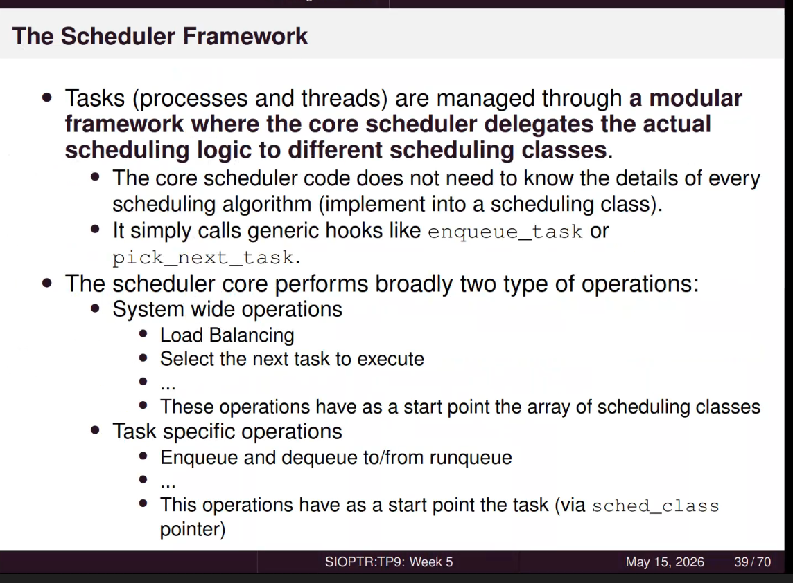

os processos sao geridos em termios de escalonamento por abordagem moduilar, diferentes runque , pertence a uma classe de escalonamento e tem uma prioriadade, ora linux

## Ação — 1 passo 🎯

Corrige a tua frase para:

> **Os processos/threads são geridos por um framework modular: o core scheduler decide o fluxo geral, mas delega a lógica concreta às scheduling classes. Cada tarefa pertence a uma classe através do ponteiro `task_struct->sched_class`, e cada classe sabe operar sobre a sua sub-runqueue.**

---

## Objetivo

Separar **quem coordena** de **quem decide segundo a política**:

```text
core scheduler
    ↓ chama callbacks genéricas
sched_class
    ↓ aplica regra concreta
cfs_rq / rt_rq / dl_rq
    ↓ escolhe entidade/tarefa
task_struct
```

---

## Como pensar

O core scheduler não precisa saber os detalhes de cada algoritmo.

Ele só chama operações genéricas:

```text
enqueue_task()
dequeue_task()
pick_next_task()
task_tick()
```

Mas quem implementa essas operações é a classe:

| Classe             | Estrutura usada | Regra                   |
| ------------------ | --------------- | ----------------------- |
| `fair_sched_class` | `cfs_rq`        | menor `vruntime`        |
| `rt_sched_class`   | `rt_rq`         | maior prioridade RT     |
| `dl_sched_class`   | `dl_rq`         | menor deadline absoluto |
| `idle_sched_class` | idle task       | último recurso          |

A tua frase “pertence a uma classe e tem uma prioridade” está quase certa, mas com nuance:

```text
SCHED_FIFO/RR -> prioridade RT 1..99
SCHED_DEADLINE -> deadline absoluto/runtime/período
CFS -> prioridade/nice influencia vruntime, não prioridade fixa RT
```

---

## Pitfalls & troubleshooting ⚠️

1. **Não dizer que todas as classes usam “prioridade” da mesma forma**
   RT usa prioridade fixa; DL usa deadline; CFS usa fairness/vruntime.

2. **Não confundir classe com runqueue**
   Classe = funções; runqueue = dados/fila.

3. **Não chamar `schedule()` em qualquer contexto**
   Ele corre em process context e em scheduling points seguros.

4. **Operações system-wide começam pelo array de classes**
   Operações task-specific começam pela própria task via `task->sched_class`.

---

## Pergunta de decisão

Queres fechar agora com um **resumo final de 10 linhas para escrever no caderno sobre esta parte do scheduler framework**?
---

sitemwide, task especificas das tarefas.. obviamente que o core vai incocar as callbacks dentro da schedulling class. 

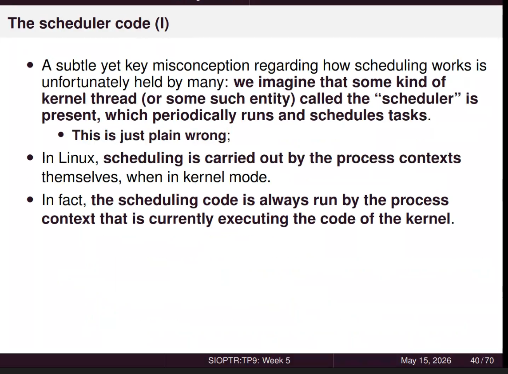
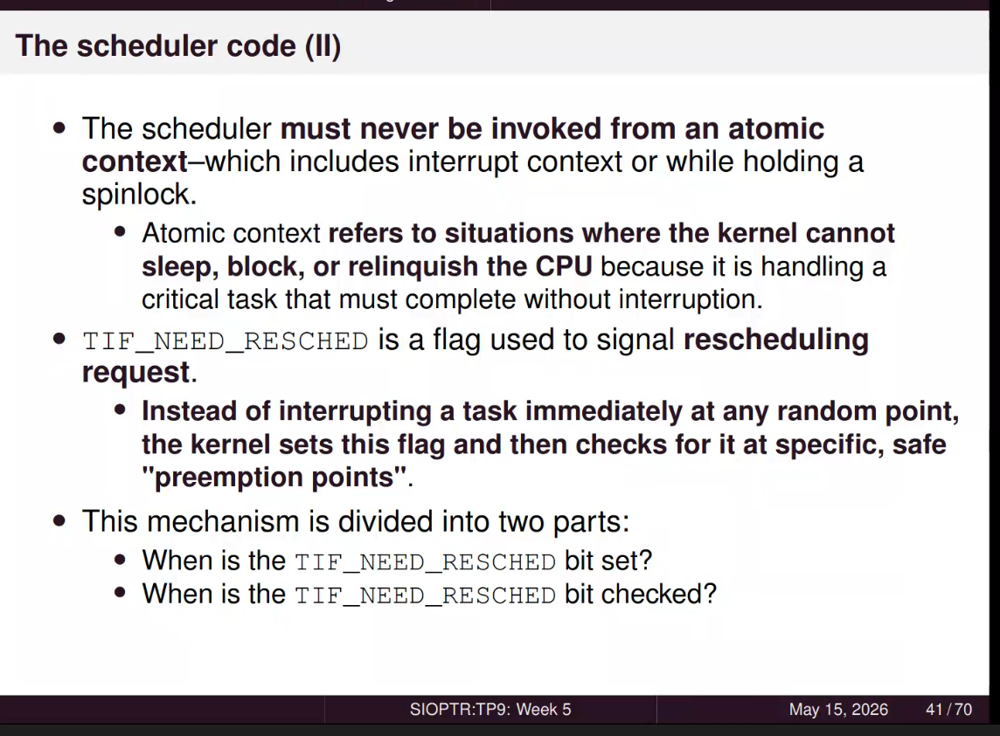

---
    Não existe uma “thread scheduler” separada que acorda periodicamente para escalonar. O código do scheduler é executado pelo próprio contexto de processo que está em kernel mode, em pontos seguros onde schedule() pode ser chamado.
---
## Ação — 1 passo 🎯

Corrige a tua frase para:

> **Não existe uma “thread scheduler” separada que acorda periodicamente para escalonar. O código do scheduler é executado pelo próprio contexto de processo que está em kernel mode, em pontos seguros onde `schedule()` pode ser chamado.**

---

## Objetivo

Perceber a ideia central do slide:

```text
scheduler não é uma entidade viva separada
scheduler é código do kernel
```

Esse código corre quando a tarefa atual entra no kernel e chega a um ponto onde pode haver troca de contexto.

---

## Como pensar

A CPU está sempre a executar alguma coisa:

```text
CPU
└── curr -> tarefa atual
```

Quando essa tarefa entra em kernel mode, por exemplo por syscall, page fault, sleep, mutex, I/O ou retorno de interrupção, ela própria pode acabar a executar código do scheduler.

Fluxo simplificado:

```text
processo A está a correr
   ↓
entra no kernel
   ↓
algum evento exige reescalonamento
   ↓
schedule() é chamado num ponto seguro
   ↓
scheduler escolhe processo B
   ↓
context switch A -> B
```

Então a frase importante é:

> **A tarefa A executa código do kernel que pode escolher a tarefa B para correr a seguir.**

---

## Pitfalls & troubleshooting ⚠️

1. **Não imaginar o scheduler como daemon/thread periódica**
   Não há uma “tarefa scheduler” comum que gere todas as outras.

2. **`schedule()` não deve correr em interrupt context**
   Normalmente corre em process context, em pontos seguros.

3. **Uma interrupt pode pedir reescalonamento**
   Mas geralmente marca `TIF_NEED_RESCHED`; a troca real acontece depois.

4. **Core scheduler não implementa todos os algoritmos**
   Ele chama callbacks das classes: `enqueue_task`, `pick_next_task`, etc.

---

## Alternativas / tradeoffs

### Visão errada

```text
scheduler thread acorda
scheduler escolhe tarefas
scheduler volta a dormir
```

### Visão correta

```text
processo atual entra no kernel
kernel detecta necessidade de scheduling
processo atual executa schedule()
schedule() troca para outro processo
```

---

## Pergunta de decisão

Queres agora ligar isto com **process context vs interrupt context**, para perceber exatamente onde `schedule()` pode ou não pode correr?
---
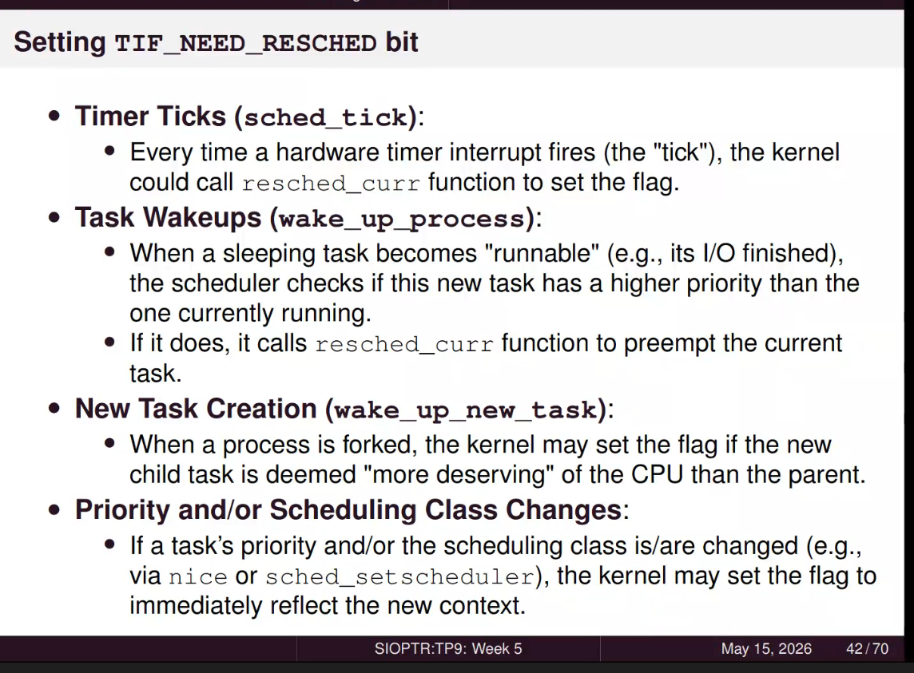
---
    TIF_NEED_RESCHED é uma flag marcada quando o kernel percebe que a tarefa atual talvez já não deva continuar no CPU; a troca real acontece depois, quando schedule() puder correr em process context.

## Ação — 1 passo 🎯

Escreve esta frase:

> **`TIF_NEED_RESCHED` é uma flag marcada quando o kernel percebe que a tarefa atual talvez já não deva continuar no CPU; a troca real acontece depois, quando `schedule()` puder correr em process context.**

---

## Objetivo

Ligar os 4 casos do slide a uma única ideia:

```text
alguma coisa muda no sistema
   ↓
a tarefa atual pode deixar de ser a melhor escolha
   ↓
resched_curr() marca TIF_NEED_RESCHED
   ↓
num ponto seguro, schedule() escolhe outra tarefa
```

---

## Como pensar

### 1. Timer tick — `sched_tick`

A cada interrupção de timer, o kernel atualiza tempo da tarefa atual.

Pode acontecer:

```text
CFS -> vruntime aumentou muito
RT/RR -> time slice acabou
DL -> runtime disponível foi consumido
```

Então o kernel pode chamar:

```c
resched_curr()
```

para marcar:

```text
esta tarefa deve ser reavaliada
```

---

### 2. Task wakeup — `wake_up_process`

Uma tarefa adormecida fica runnable.

Exemplo:

```text
tarefa estava à espera de I/O
I/O terminou
tarefa acorda
```

Agora o scheduler pergunta:

```text
a tarefa que acordou é mais urgente que a atual?
```

Se sim:

```text
marca TIF_NEED_RESCHED na tarefa atual
```

---

### 3. New task — `wake_up_new_task`

Quando há `fork()`, nasce uma nova tarefa.

O kernel pode decidir:

```text
a child task merece CPU agora?
```

Se sim, pode marcar reschedule.

---

### 4. Mudança de prioridade/classe

Exemplo:

```text
nice
sched_setscheduler()
```

Se uma tarefa muda de CFS para RT, ou altera prioridade, a ordem de escolha pode mudar imediatamente.

Então:

```text
marca TIF_NEED_RESCHED
```

---

## Pitfalls & troubleshooting ⚠️

1. **`resched_curr()` não chama necessariamente `schedule()` logo**
   Marca a necessidade de reescalonamento.

2. **`TIF_NEED_RESCHED` é sobre a tarefa atual**
   A flag indica que a `curr` deve ser preemptada/reavaliada.

3. **Timer tick não significa sempre troca de tarefa**
   Pode apenas atualizar estatísticas.

4. **Wakeup só causa preempção se a tarefa acordada for mais “importante”**
   Depende da classe: DL, RT ou CFS.

---

## Pergunta de decisão

Queres agora mapear estes 4 casos para as classes **CFS / RT / DL** com exemplos concretos?
---
## Ação — 1 passo 🎯

Mapeia os 4 casos do slide assim:

| Evento                        | Classe mais afetada | O que pode acontecer                            |
| ----------------------------- | ------------------- | ----------------------------------------------- |
| `sched_tick`                  | CFS / RT / DL       | tarefa atual consumiu tempo; pode precisar sair |
| `wake_up_process`             | CFS / RT / DL       | tarefa acordada pode ser mais urgente           |
| `wake_up_new_task`            | CFS                 | novo processo pode merecer CPU                  |
| `nice` / `sched_setscheduler` | CFS / RT / DL       | prioridade ou classe mudou                      |

---

## Objetivo

Perceber que `TIF_NEED_RESCHED` é o mecanismo comum para dizer:

> **“A decisão de scheduling atual pode estar desatualizada. Reavaliar quando for seguro.”**

---

## Como pensar

### 1. CFS

Exemplo:

```text
Tarefa A CFS está a correr
timer tick acontece
A já acumulou muito vruntime
outra tarefa CFS tem menor vruntime
```

Então:

```text
resched_curr()
↓
marca TIF_NEED_RESCHED
↓
mais tarde schedule()
↓
pick_next_task_fair()
↓
escolhe menor vruntime
```

Aqui a pergunta é:

> “A tarefa atual já recebeu CPU demais comparada com as outras?”

---

### 2. RT

Exemplo:

```text
Tarefa CFS está a correr
tarefa RT prioridade 80 acorda
```

Como RT está acima de CFS:

```text
wake_up_process()
↓
enqueue_task_rt()
↓
wakeup_preempt_rt()
↓
resched_curr()
↓
TIF_NEED_RESCHED
```

Depois, em ponto seguro:

```text
schedule()
↓
pick_next_task_rt()
↓
corre RT prioridade 80
```

Aqui a pergunta é:

> “A tarefa que acordou tem prioridade RT superior ao que está a correr?”

---

### 3. DL

Exemplo:

```text
Tarefa RT está a correr
tarefa Deadline acorda com deadline absoluto muito próximo
```

Como DL está acima de RT no array de classes:

```text
DL > RT > CFS
```

pode acontecer:

```text
wake_up_process()
↓
enqueue_task_dl()
↓
wakeup_preempt_dl()
↓
resched_curr()
↓
TIF_NEED_RESCHED
```

Depois:

```text
schedule()
↓
pick_next_task_dl()
↓
corre tarefa com menor deadline absoluto
```

Aqui a pergunta é:

> “Existe uma tarefa com deadline absoluto mais urgente?”

---

## Pitfalls & troubleshooting ⚠️

1. **Timer tick não causa sempre preempção**
   Pode só atualizar contadores.

2. **Wakeup não preempta sempre**
   Só se a tarefa acordada for mais urgente segundo a classe/política.

3. **`TIF_NEED_RESCHED` não escolhe a tarefa**
   Só marca que é preciso reavaliar.

4. **Prioridade RT 99 não compete diretamente com DL**
   DL é uma classe acima de RT.

---

## Pergunta de decisão

Queres agora fazer um exemplo único com **CFS a correr, RT a acordar, depois DL a acordar**, para ver a sequência completa?

---
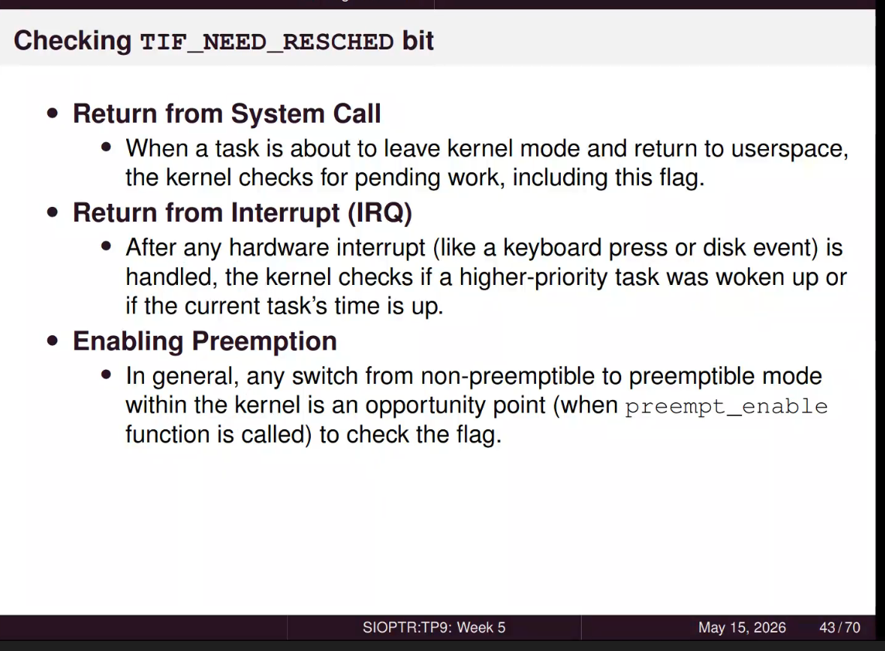
---
## Ação — 1 passo 🎯

Escreve esta regra:

> **`TIF_NEED_RESCHED` é marcado quando é preciso reavaliar a tarefa atual, mas só é verificado em pontos seguros: retorno de syscall, retorno de interrupção ou quando a preempção volta a ser ativada.**

---

## Objetivo

Distinguir duas fases:

```text
1. Setting TIF_NEED_RESCHED
   -> alguém marca que é preciso reescalonar

2. Checking TIF_NEED_RESCHED
   -> o kernel verifica a flag e pode chamar schedule()
```

---

## Como pensar

### 1. Return from system call

Exemplo:

```text
processo A faz read()
entra em kernel mode
durante a syscall fica marcada TIF_NEED_RESCHED
antes de voltar para userspace, o kernel verifica a flag
se estiver ativa, chama schedule()
```

Ideia:

> Antes de devolver controlo ao programa em user mode, o kernel pergunta: “ainda deve ser este processo a continuar?”

---

### 2. Return from interrupt

Exemplo:

```text
CPU executa processo A
timer interrupt acontece
handler atualiza scheduler
marca TIF_NEED_RESCHED
handler termina
antes de regressar ao processo A, kernel verifica a flag
```

Se a flag estiver ativa:

```text
schedule()
A pode ser preemptado
B pode passar a correr
```

---

### 3. Enabling preemption

Às vezes o kernel está numa região onde preempção não é permitida:

```text
preempt_disable()
região crítica
preempt_enable()
```

Quando chega a:

```c
preempt_enable();
```

o kernel volta a poder ser preemptado.

Nesse momento verifica:

```text
há TIF_NEED_RESCHED pendente?
```

Se sim, pode chamar o scheduler.

---

## Pitfalls & troubleshooting ⚠️

1. **Marcar a flag não é trocar logo**
   A troca fica pendente.

2. **Interrupt handler não deve fazer `schedule()` diretamente**
   Normalmente marca a flag e sai.

3. **System call é process context**
   Por isso pode chegar a um ponto seguro para chamar `schedule()`.

4. **Preempção desativada adia a troca**
   Mesmo que exista uma tarefa mais prioritária, a troca espera até `preempt_enable()`.

---

## Pergunta de decisão

Queres agora juntar **Setting + Checking `TIF_NEED_RESCHED`** num único fluxo completo tipo exame?
---
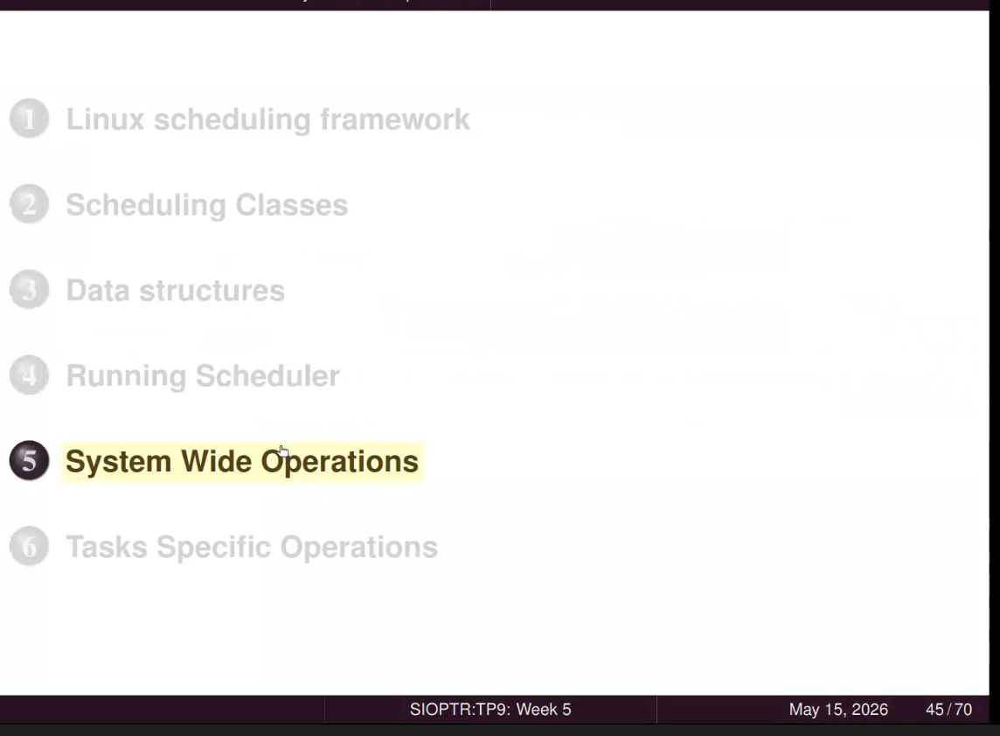
---
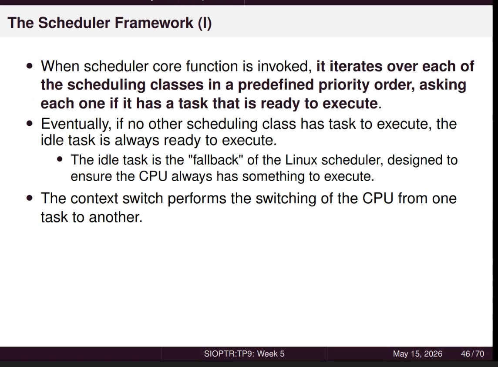
---
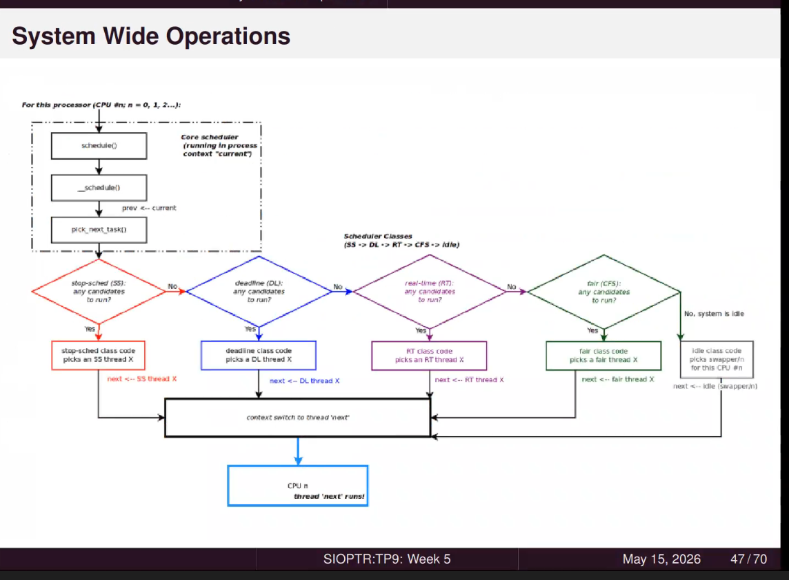
---
usar esta macro
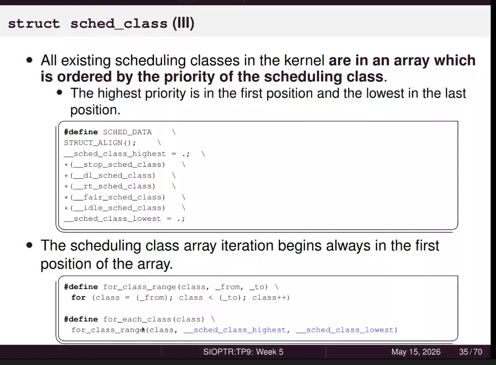
---

invocar 
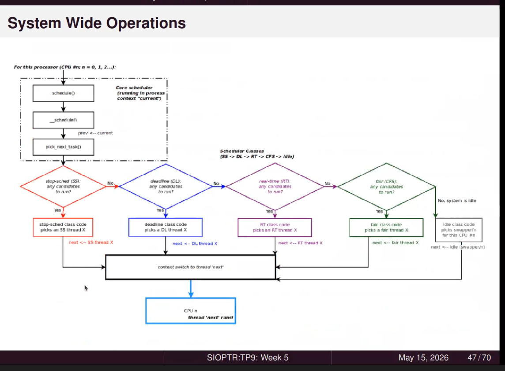
---
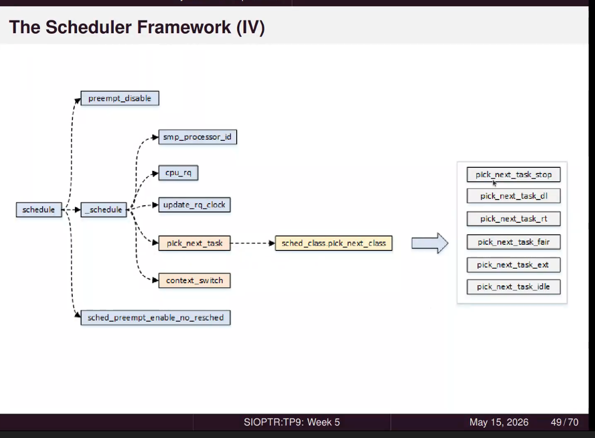
---
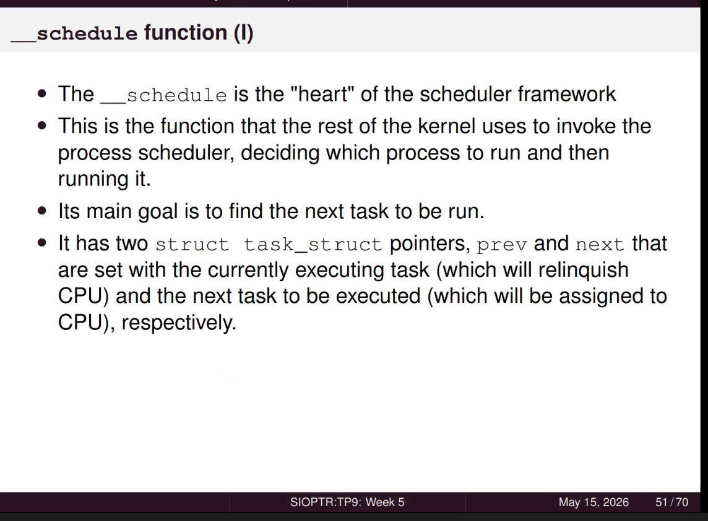
---
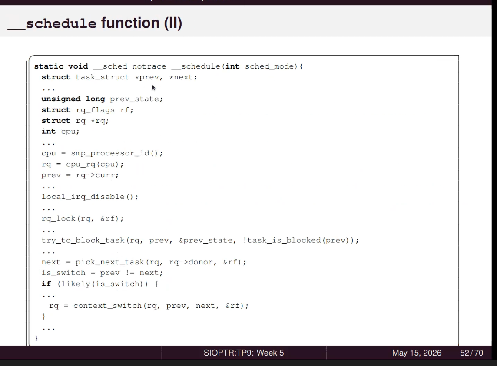
---
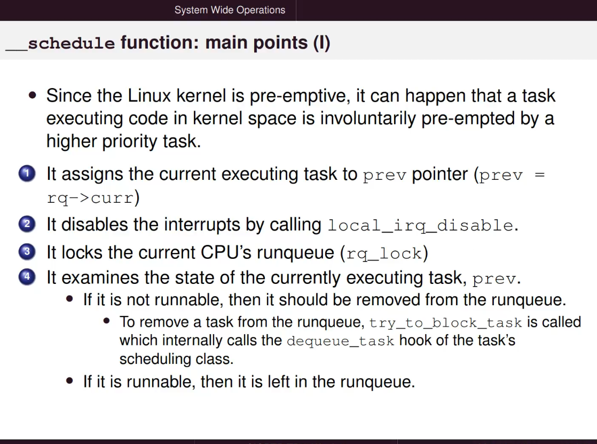
---
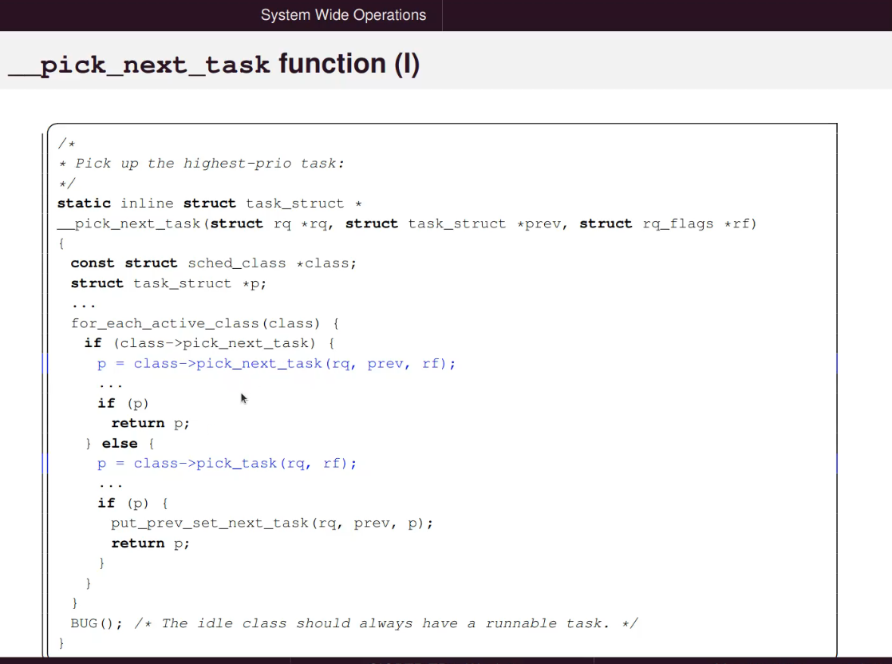
---
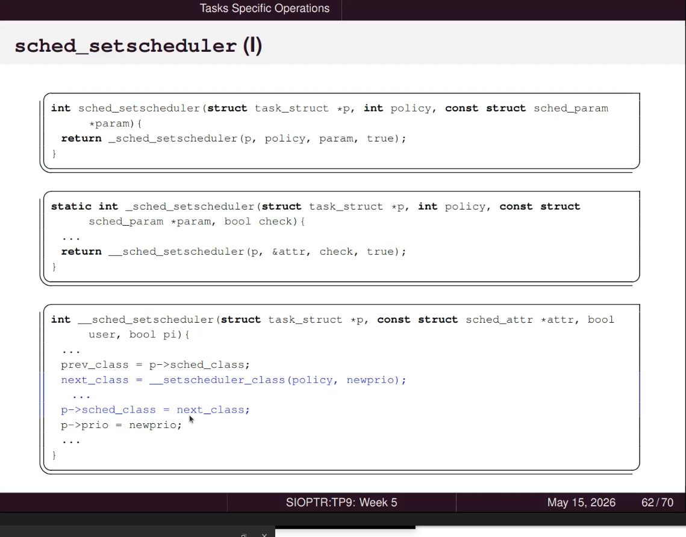
---
## Ação — 1 passo 🎯

Liga o slide anterior com este:

> **`TIF_NEED_RESCHED` pode ser marcado por eventos como timer tick, wakeup, fork ou mudança de prioridade/classe; depois é verificado em pontos seguros como retorno de syscall, retorno de interrupção ou `preempt_enable()`.**

---

## Objetivo

Fechar o ciclo completo:

```text
evento muda o estado do sistema
   ↓
kernel chama resched_curr()
   ↓
marca TIF_NEED_RESCHED na tarefa atual
   ↓
kernel chega a um ponto seguro
   ↓
verifica a flag
   ↓
se estiver ativa, chama schedule()
```

---

## Como pensar

### 1. Timer tick — `sched_tick`

```text
A tarefa atual consumiu tempo.
```

Pode acontecer:

```text
CFS: vruntime aumentou
RT/RR: time slice acabou
DL: runtime foi consumido
```

Resultado possível:

```text
TIF_NEED_RESCHED = 1
```

---

### 2. Task wakeup — `wake_up_process`

```text
Uma tarefa bloqueada acorda.
```

Exemplo:

```text
tarefa RT estava à espera de I/O
I/O termina
tarefa RT fica runnable
```

Se for mais prioritária que a atual:

```text
resched_curr()
```

---

### 3. New task creation — `wake_up_new_task`

```text
fork() cria uma nova tarefa.
```

O kernel pode decidir que a nova tarefa deve correr cedo, especialmente no CFS para fairness/interatividade.

---

### 4. Priority/class change

Exemplo:

```text
nice
sched_setscheduler()
```

Uma tarefa pode mudar de importância:

```text
CFS nice muda
CFS vira RT
RT muda prioridade
tarefa vira SCHED_DEADLINE
```

Então o scheduler precisa reavaliar.

---

## Pitfalls & troubleshooting ⚠️

1. **Marcar `TIF_NEED_RESCHED` não executa logo `schedule()`**
   Apenas cria uma pendência.

2. **O timer tick nem sempre preempta**
   Pode só atualizar estatísticas.

3. **Wakeup só preempta se a tarefa acordada for mais urgente**
   Depende da classe: DL, RT ou CFS.

4. **Mudança de classe pode alterar drasticamente a decisão**
   Uma tarefa CFS que vira RT pode passar à frente das CFS imediatamente.

---

## Pergunta de decisão

Queres agora fazer um mini-fluxo concreto: **CFS está a correr → RT acorda por I/O → `TIF_NEED_RESCHED` → retorno de IRQ → `schedule()` → RT corre**?
---

## Ação — 1 passo 🎯

Lê estes slides como a função que **muda a política/classe de escalonamento de uma tarefa**:

```text
sched_setscheduler()
   ↓
__sched_setscheduler()
   ↓
__setscheduler_class(policy, prio)
   ↓
p->sched_class = next_class
p->prio = newprio
```

---

## Objetivo

Perceber que `sched_setscheduler()` atualiza dois aspetos críticos da `task_struct`:

```c
p->sched_class = next_class;
p->prio = newprio;
```

Ou seja:

```text
qual classe gere esta tarefa?
qual prioridade efetiva tem esta tarefa?
```

---

## Como pensar

A função:

```c
__setscheduler_class(policy, prio)
```

decide a classe com base na prioridade/política:

```c
if (dl_prio(prio))
    return &dl_sched_class;

if (rt_prio(prio))
    return &rt_sched_class;

return &fair_sched_class;
```

Interpretação:

```text
se é prioridade Deadline -> classe DL
senão se é prioridade RT -> classe RT
senão -> classe Fair/CFS
```

Depois a tarefa passa a apontar para essa classe:

```c
p->sched_class = next_class;
```

Isto significa que as futuras operações sobre essa tarefa usam callbacks dessa classe:

```text
p->sched_class->enqueue_task(...)
p->sched_class->dequeue_task(...)
p->sched_class->pick_next_task(...)
```

---

## Pitfalls & troubleshooting ⚠️

1. **Não é só mudar um número de prioridade**
   Pode mudar a própria classe: CFS → RT → DL.

2. **`p->sched_class` é o ponteiro decisivo**
   Ele diz que conjunto de funções vai gerir a tarefa.

3. **Depois de mudar classe, pode ser necessário reescalonar**
   Por isso isto liga diretamente ao `TIF_NEED_RESCHED`.

4. **RT priority e DL priority não são a mesma semântica**
   RT usa prioridade fixa; DL usa runtime/deadline/período.

---

## Pergunta de decisão

Queres agora ligar este slide ao caso concreto: **uma tarefa CFS muda para RT via `sched_setscheduler()` e preempta a tarefa atual**?
---
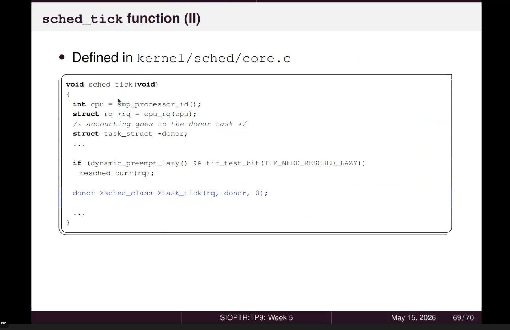
---

## Ação — 1 passo 🎯

Lê este slide como o **caminho de acordar uma tarefa bloqueada**:

```text
wake_up_process(p)
   ↓
try_to_wake_up(p, TASK_NORMAL, 0)
   ↓
ttwu_queue(p, cpu, wake_flags)
   ↓
ttwu_do_activate(rq, p, wake_flags, &rf)
   ↓
tarefa entra na runqueue correta
```

---

## Objetivo

Perceber que `wake_up_process()` não executa a tarefa diretamente.

Ele muda a tarefa de:

```text
sleeping / blocked
```

para:

```text
runnable
```

Depois o scheduler decide se ela deve correr já ou apenas esperar na fila.

---

## Como pensar

A tarefa `p` estava bloqueada, por exemplo:

```text
à espera de I/O
à espera de mutex
à espera de timer
```

Quando o evento acontece:

```c
wake_up_process(p);
```

o kernel tenta acordá-la.

O ponto importante é:

```text
acordar ≠ executar imediatamente
```

Acordar significa:

```text
colocar a tarefa como candidata a CPU
```

Depois, dependendo da classe:

```text
CFS -> entra em cfs_rq
RT  -> entra em rt_rq
DL  -> entra em dl_rq
```

Se a tarefa acordada for mais urgente que a `curr`, o kernel pode marcar:

```text
TIF_NEED_RESCHED
```

---

## Pitfalls & troubleshooting ⚠️

1. **`wake_up_process()` não faz context switch diretamente**
   Só inicia o processo de tornar a tarefa runnable.

2. **A tarefa acordada pode ir para outra CPU**
   O parâmetro `cpu` em `ttwu_queue()` indica onde será enfileirada.

3. **Entrar na runqueue não garante execução imediata**
   Depende da prioridade/classe e da tarefa atual.

4. **Pode haver preempção se ela for mais urgente**
   Exemplo: tarefa RT acorda enquanto CFS corre.

---

## Pergunta de decisão

Queres agora seguir para **`ttwu_do_activate()`**, que é onde a tarefa começa mesmo a ser ativada na runqueue?
---
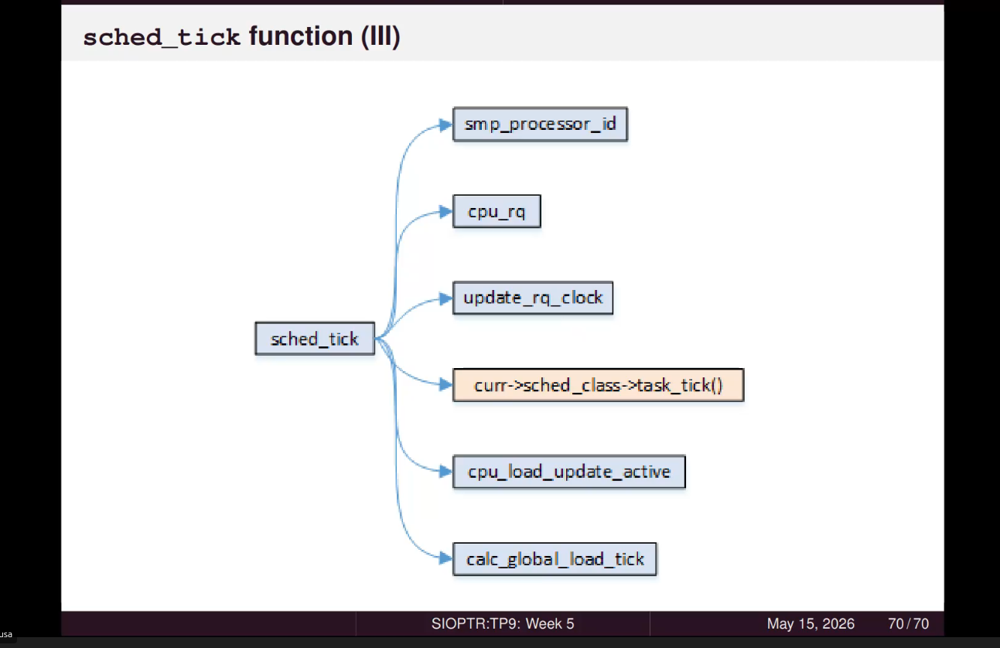
---
## Ação — 1 passo 🎯

Corrige para esta frase:

> **`sched_tick()` corre a cada tick de timer, identifica a CPU atual e a sua `rq`, faz accounting do tempo consumido pela tarefa atual, e depois chama a callback `task_tick()` da scheduling class dessa tarefa para decidir se ela deve continuar ou ser marcada para preempção.**

---

## Objetivo

Perceber esta linha do slide:

```c
donor->sched_class->task_tick(rq, donor, 0);
```

Ela significa:

```text
pega na classe da tarefa atual
   ↓
chama a função task_tick específica dessa classe
```

Ou seja:

```text
CFS -> task_tick_fair()
RT  -> task_tick_rt()
DL  -> task_tick_dl()
```

---

## Como pensar

O `sched_tick()` é system-wide no sentido de vir do timer da CPU, mas depois delega à classe da tarefa atual:

```text
timer interrupt
   ↓
sched_tick()
   ↓
cpu = smp_processor_id()
   ↓
rq = cpu_rq(cpu)
   ↓
donor/current task
   ↓
donor->sched_class->task_tick(...)
```

Agora cada classe interpreta o tick à sua maneira:

| Classe | O que `task_tick()` pode fazer                           |
| ------ | -------------------------------------------------------- |
| CFS    | atualizar `vruntime`, verificar se outra CFS deve correr |
| RT/RR  | atualizar/decrementar `time_slice`                       |
| DL     | atualizar runtime consumido e verificar orçamento        |
| Idle   | normalmente pouco trabalho                               |

Se a classe concluir que a tarefa atual já não deve continuar, pode acabar por marcar:

```text
TIF_NEED_RESCHED
```

via algo como:

```c
resched_curr(rq);
```

---

## Pitfalls & troubleshooting ⚠️

1. **`sched_tick()` não escolhe necessariamente nova tarefa**
   Ele atualiza tempo e pode marcar necessidade de reescalonamento.

2. **`task_tick()` depende da classe**
   A mesma callback conceptual tem lógica diferente em CFS, RT e DL.

3. **Accounting não é só estatística**
   O tempo contado influencia decisões reais de preempção.

4. **Marcar preempção não é trocar imediatamente**
   A troca ocorre quando o kernel verificar `TIF_NEED_RESCHED` num ponto seguro.

---

## Pergunta de decisão

Queres fechar esta parte com uma frase única que liga **timer tick → task_tick → TIF_NEED_RESCHED → schedule()**?


ha um dos TT apresenta como apresentar os mecaniosmos de tracing....

mais controle sobre mais facil perceber se eregiste eu os eventos, 

