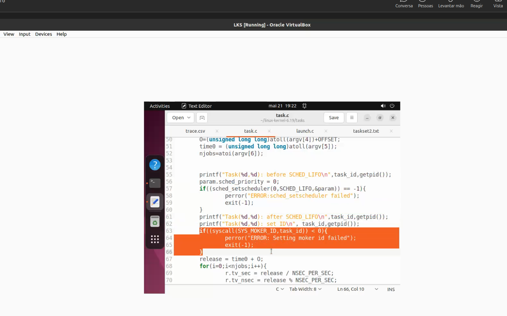
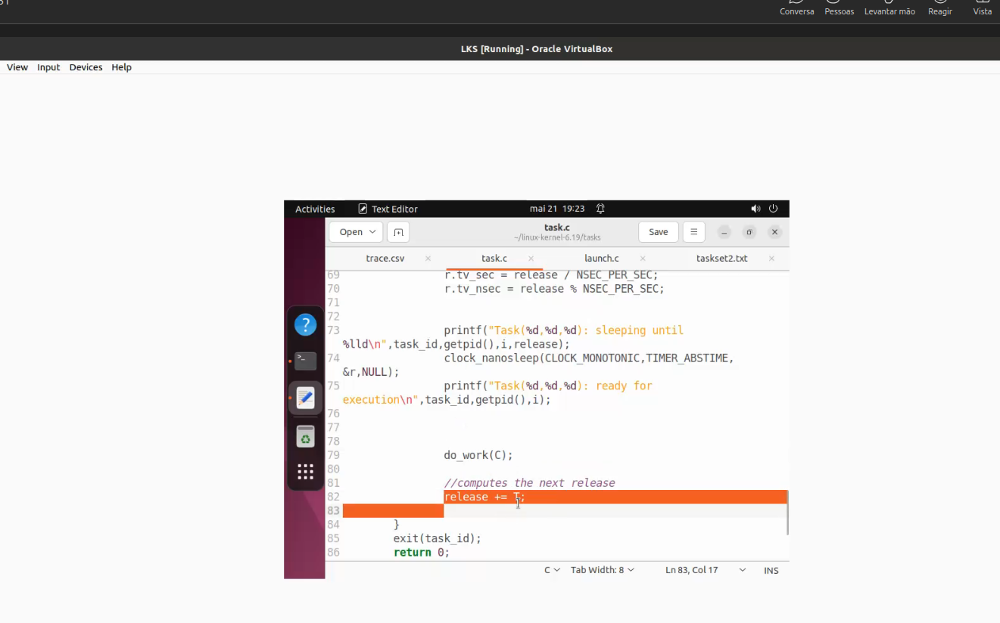
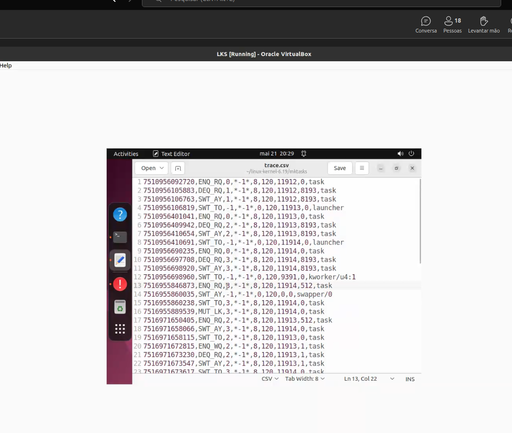
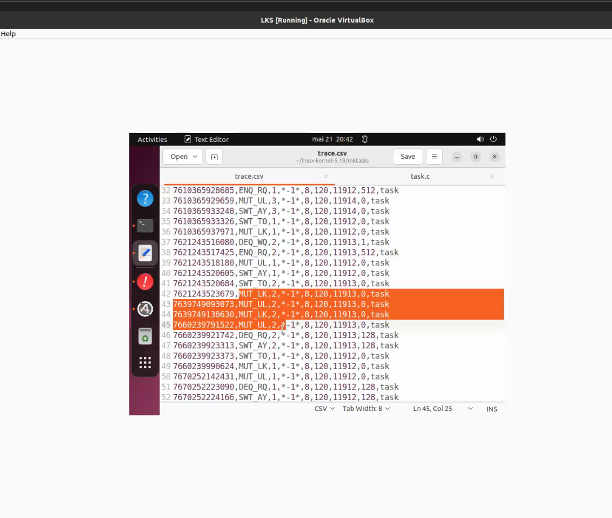

op professor falhou qualquer coisa no tp7


---

esta a explicar codigo aqui 



nanosleep para dormir....



---

## Ação — 1 passo

Desenha mentalmente este programa como **dois processos em user space**:

```text
launch.c  ── cria/arranca ──>  task.c
                         └──>  task.c
                         └──>  task.c
```

Ou seja: **`launch.c` é o lançador**, e cada **`task.c` é uma tarefa periódica simulada**.

---

## Objetivo

Separar duas ideias que estão misturadas:

| Peça          |   Onde corre | Função                                                             |
| ------------- | -----------: | ------------------------------------------------------------------ |
| `launch.c`    |   user space | lê/configura/arranca várias tarefas                                |
| `task.c`      |   user space | executa uma tarefa periódica com `C`, `T`, offset e número de jobs |
| kernel        | kernel space | decide quando cada processo corre na CPU                           |
| MOKER tracing | kernel space | regista eventos para depois analisar                               |

---

## Como pensar

Na imagem de `task.c`, este bloco é essencial:

```c
task_id = atoi(argv[1]);
C = (unsigned long long) atoll(argv[2]);
T = (unsigned long long) atoll(argv[3]);
O = (unsigned long long) atoll(argv[4]) + OFFSET;
time0 = (unsigned long long) atoll(argv[5]);
njobs = atoi(argv[6]);
```

Isto significa que o processo `task.c` recebe argumentos pela linha de comandos.

A lógica provável é:

```text
./task task_id C T O time0 njobs
```

Portanto:

| Argumento | Significado provável                   |
| --------- | -------------------------------------- |
| `argv[1]` | número/id da tarefa                    |
| `argv[2]` | `C`: computation time / execution time |
| `argv[3]` | `T`: período                           |
| `argv[4]` | `O`: offset da primeira ativação       |
| `argv[5]` | `time0`: tempo base comum              |
| `argv[6]` | número de jobs/instâncias              |

Exemplo conceptual:

```text
Task 1:
C = 5 ms
T = 20 ms
O = 0 ms
njobs = 10
```

Significa:

```text
A tarefa 1 acorda em:
0 ms, 20 ms, 40 ms, 60 ms, ...

Em cada ativação, tenta executar ~5 ms de trabalho.
Faz isto 10 vezes.
```

---

## User space vs kernel space

Este programa **não é código de kernel**.

Ele corre em **user space**, como qualquer programa C normal:

```text
Firefox
Terminal
task.c
launch.c
```

Mas ele chama funções do sistema, por exemplo:

```c
sched_setscheduler(...)
clock_gettime(...)
syscall(...)
```

Essas chamadas entram temporariamente no **kernel space** para pedir serviços ao kernel.

A ideia é:

```text
user space:
    "Kernel, põe esta tarefa com política SCHED_LIFO / prioridade X"

kernel space:
    "Ok, vou gerir isto no scheduler"
```

---

## O que o processo faz?

O `task.c` representa uma tarefa periódica artificial:

```text
1. Lê os parâmetros: id, C, T, offset, tempo inicial, número de jobs
2. Pede ao kernel uma política/prioridade de escalonamento
3. Espera até ao offset inicial
4. Executa trabalho durante C
5. Dorme/espera até à próxima release
6. Repete isto njobs vezes
```

O `launch.c` coordena várias dessas tarefas e no fim desativa o tracing:

```c
syscall(SYS_MOKER_TRACING_ENABLE, 0)
```

Isto quer dizer:

```text
"Kernel, para de registar eventos MOKER."
```

---

## Pitfalls & troubleshooting

1. **Não confundir tarefa teórica com processo Linux**

   * No exercício, “task” é uma tarefa periódica.
   * No Linux real, isso aparece como processo/thread escalonado pelo kernel.

2. **`C` não é deadline**

   * `C` é tempo de computação.
   * `T` é período.
   * Deadline pode ser igual a `T`, mas só se o modelo assumir isso.

3. **Offset não é período**

   * Offset só atrasa a primeira ativação.
   * Depois disso, as ativações seguem `T`.

4. **User space não controla diretamente a CPU**

   * O programa pede.
   * O kernel decide.

---

## Alternativas / tradeoffs

| Modelo mental                  | Vantagem                       | Limitação                              |
| ------------------------------ | ------------------------------ | -------------------------------------- |
| Matemático: `C`, `T`, `D`, `O` | bom para escalonamento teórico | não mostra overhead real               |
| Linux/processos                | mostra realidade do kernel     | tem jitter, syscalls, VM, interrupções |
| KernelShark/tracing            | valida experimentalmente       | exige interpretar eventos              |

---

## Pergunta de decisão

Queres que a seguir foquemos só em **`task.c`: como uma tarefa periódica nasce, executa jobs e termina**?
---

## Ação — 1 passo

Foca-te nesta linha do `trace.csv`:

```text
SWT_AY,2,*-1*,8,120,7675,8193,task
```

Lê `SWT_AY` como:

> **Switch Away** = esta tarefa/processo foi retirado da CPU.

---

## Objetivo

Perceber a diferença entre:

| Evento   | Significado                             |
| -------- | --------------------------------------- |
| `ENQ_RQ` | tarefa entrou na runqueue               |
| `DEQ_RQ` | tarefa saiu da runqueue                 |
| `SWT_TO` | CPU mudou **para** esta tarefa          |
| `SWT_AY` | CPU mudou **para longe de** esta tarefa |

Isto é ouro para SIOPTR ⚙️ porque estás a ver o **scheduler real do Linux/MOKER** a decidir quem corre.

---

## Como pensar

A palavra-chave é **runqueue**.

Uma **runqueue** é a fila/lista interna do kernel com tarefas que estão:

```text
prontas para executar
mas talvez ainda sem CPU
```

Modelo mental:

```text
CPU
 ↑
scheduler escolhe daqui
 ↑
runqueue: [task 1] [task 2] [task 3]
```

Agora interpreta os eventos:

### `ENQ_RQ`

```text
ENQ_RQ = enqueue runqueue
```

A tarefa ficou **pronta** e entrou na fila.

Exemplo:

```text
A tarefa acordou no seu período.
Agora está ready.
Vai para a runqueue.
```

---

### `DEQ_RQ`

```text
DEQ_RQ = dequeue runqueue
```

A tarefa saiu da fila.

Pode sair porque:

```text
foi escolhida para correr
ou bloqueou
ou terminou
ou mudou de estado
```

---

### `SWT_TO`

```text
SWT_TO = switch to
```

O scheduler pôs essa tarefa na CPU.

Exemplo:

```text
CPU agora vai executar task 2
```

---

### `SWT_AY`

```text
SWT_AY = switch away
```

A tarefa estava na CPU, mas foi retirada.

Pode acontecer porque:

```text
acabou o job
foi preemptada
bloqueou
fez sleep
chegou tarefa mais prioritária
```

---

## Exemplo com a tua linha

```text
SWT_AY,2,*-1*,8,120,7675,8193,task
```

Pensa assim:

```text
A task 2 estava a correr.
Neste instante, o kernel tirou-a da CPU.
```

Não quer dizer automaticamente que terminou. Só quer dizer:

```text
deixou de ocupar CPU naquele momento.
```

Para saber **porquê**, tens de olhar para as linhas antes e depois.

---

## Pitfalls & troubleshooting

1. **`SWT_AY` não significa sempre “terminou”**

   * Pode ser preempção, sleep, bloqueio ou fim.

2. **`ENQ_RQ` não significa “está a executar”**

   * Só significa “está pronta para executar”.

3. **`DEQ_RQ` pode confundir**

   * Pode sair da runqueue porque foi escolhida para CPU ou porque deixou de estar pronta.

4. **Numa VM há ruído**

   * `sudo`, `swapper/0`, `launcher` aparecem porque o sistema real também está vivo.

---

## Alternativas / tradeoffs

| Forma de estudar                   | Vantagem                           | Limitação                       |
| ---------------------------------- | ---------------------------------- | ------------------------------- |
| Ler `trace.csv` linha a linha      | vês eventos brutos                 | difícil no início               |
| KernelShark                        | visual, mais intuitivo             | menos detalhe textual           |
| Comparar com escalonamento teórico | ajuda a entender `C`, `T`, release | Linux real tem overhead e ruído |

---

## Pergunta de decisão

Queres que eu interprete **as primeiras 8 linhas do teu `trace.csv` uma a uma**, como se fosse uma timeline do scheduler?


---

No Moker/TT8, para fins academicos, foi criada uma politica artificial em que a ultima tarefa a chegar ao sistema tem maior prioridade. 

---

## Ação — 1 passo

Regista isto no caderno:

> **No MOKER/TT8, para fins académicos, foi criada uma política artificial em que a última tarefa a chegar ao sistema tem maior prioridade.**

## Objetivo

Separar o que é **Linux real normal** do que é **experiência académica MOKER**.

O professor não está a dizer que o Linux normal funciona assim. Está a mostrar uma política de scheduling modificada para estudar o kernel.

## Como pensar

No Linux real, o scheduler usa classes como:

```text
CFS / normal
FIFO / RR
Deadline
Idle
```

Mas no MOKER, vocês estão a criar/alterar comportamento no kernel para observar o scheduler.

Então a regra:

```text
última tarefa que chega → maior prioridade
```

é uma política tipo **LIFO**:

```text
Last In, First Out
```

Ou seja:

```text
Task 1 chega
Task 2 chega depois
Task 3 chega depois

Prioridade:
Task 3 > Task 2 > Task 1
```

Isto explica eventos no `trace.csv` como:

```text
ENQ_RQ task 2
SWT_TO task 2
SWT_AY task 2
ENQ_RQ task 3
SWT_TO task 3
```

A chegada de uma tarefa nova pode causar preempção da anterior, porque a nova fica “mais importante”.

## Relação com TT6 vs TT8

Tu estás certo: **tu estavas no TT6**, mas a imagem mostra:

```text
TT8: Framework Scheduling
```

Provavelmente o professor está a adiantar contexto ou a mostrar o próximo nível:

```text
TT6 → kernel/modules/base
TT8 → mexer mais diretamente no framework de scheduling
```

Isto é normal numa aula: ele pode explicar a motivação antes de vocês completarem todos os TTs.

## Pitfalls & troubleshooting

1. **Não assumir que isto é política real do Linux**

   * É uma alteração académica no MOKER.

2. **LIFO pode ser injusto**

   * Uma tarefa antiga pode ficar sempre à espera se chegarem tarefas novas.

3. **Pode causar starvation**

   * Tarefas antigas podem nunca executar.

4. **Não confundir prioridade com deadline**

   * Aqui a prioridade vem da ordem de chegada, não de `T`, `D` ou `C`.

## Alternativas / tradeoffs

| Política  | Regra                                | Problema                      |
| --------- | ------------------------------------ | ----------------------------- |
| FIFO      | primeira a chegar executa primeiro   | pode atrasar tarefas urgentes |
| LIFO      | última a chegar executa primeiro     | pode causar starvation        |
| RM        | menor período tem mais prioridade    | precisa tarefas periódicas    |
| EDF       | deadline mais próxima tem prioridade | mais dinâmico, mais complexo  |
| CFS Linux | tenta justiça entre processos        | não é hard real-time          |

## Pergunta de decisão

Queres que a seguir foquemos em **porque LIFO causa preempção no trace.csv**?


---

*Starvation* Starvation acontece quando uma tarefa, interrupcao, thread ou periferico fica indefinidament sem CPU ou sem acesso a um recurso, porque outras partes do sitema tem sempre prioridade maior.

---

Objetivo

Começar a implementação do ring buffer que vai guardar eventos do scheduler. O TT6 define que o tracing deve guardar eventos como SCHED_TICK, SWITCH_TO e SWITCH_AWAY num buffer circular, depois exposto por /proc/moker_trace .

Como pensar

Esta parte ainda não escreve no /proc; só prepara a estrutura base:

write_item → próxima posição para escrever
read_item  → próxima posição para ler
increment  → anda no buffer e volta a zero no fim

Isto é literalmente uma fila circular dentro do kernel. ⚙️

---

Quando uma nova task LIFO acorda, se a task corrente nao for SCHED_DEADLINE, o kernel marca a task corrente para ser preemptada atraves de *resched_curr(rq)*.


Objetivo

Separar três coisas:

Coisa	Significado
swapper/0	idle task da CPU
SCHED_DEADLINE	classe acima da LIFO
resched_curr(rq)	marca a CPU para chamar o scheduler

Como pensar

Na tua linha destacada:

SWT_AY, -1, *-1*, 0, 120, 0, 0, swapper/0

Isto quer dizer:

A CPU saiu do swapper/0.

O swapper/0 é a idle task. É o processo que corre quando a CPU não tem nada melhor para executar.

Logo, quando aparece depois:

SWT_TO, 3, *-1*, 8, 120, 7676, 0, task

significa:

Saiu do idle e entrou a task 3 LIFO.

Isto bate certo com a política LIFO do TT8: quando uma task fica pronta, entra na runqueue; se a task corrente não for Deadline, chama resched_curr(rq).

O detalhe importante

No código do TT8:

switch(rq->donor->policy) {
    case SCHED_DEADLINE:
        break;

    case SCHED_FIFO:
    case SCHED_RR:
    case SCHED_NORMAL:
    case SCHED_BATCH:
    case SCHED_IDLE:
    case SCHED_LIFO:
        resched_curr(rq);
        break;
}

A leitura é:

Se a task atual for DEADLINE:
    não mexe

Se for FIFO/RR/NORMAL/BATCH/IDLE/LIFO:
    marca reescalonamento

Como swapper/0 é idle:

policy = 0? ou idle-like no trace

não é Deadline. Portanto, a nova task LIFO pode forçar o scheduler a escolher outra task.

O PDF diz precisamente que no LIFO, quando uma task chega e fica pronta, a task atualmente em execução é preemptada e a task mais recente é selecionada.

---

Agora ja vamos para o TT9

   " TT8 cria a politica L:IFO. TT9 so melhora o tracing, dando um identificador logico as tasks LIFO. "

Objetivo

Não misturar os níveis:

| Tutorial | Foco                       | Resultado                           |
| -------- | -------------------------- | ----------------------------------- |
| TT8      | criar `SCHED_LIFO`         | o kernel passa a escalonar por LIFO |
| TT9      | adicionar `id` à task LIFO | o `trace.csv` fica mais legível     |


O TT9 diz que a ideia principal é dar um identificador específico às tasks LIFO para melhorar a legibilidade do output de tracing.

---

No TT8, o teu trace tinha linhas assim:

   ENQ_RQ,*-1*,8,120,7675,512,task

O problema: sabes o pid, mas não sabes diretamente se aquilo era a task lógica 1, 2 ou 3.

No TT9, o trace passa a incluir um novo campo:

   timestamp,event,id,*number*,policy,prio,pid,state,comm

o PDF mostra esse novo formato na pagina 9, por exempolo 

   65960421870,ENQ_RQ,3,*-1*,8,120,2833,512,task
   65976217895,ENQ_RQ,2,*-1*,8,120,2832,512,task
   65991859937,ENQ_RQ,1,*-1*,8,120,2831,512,task

Agora consegues ver logo:

   task lógica 3 acordou
   depois task lógica 2 acordou
   depois task lógica 1 acordou

E como é LIFO:

   3 corre → 2 chega e preempta 3 → 1 chega e preempta 2

---

Mudança conceptual no kernel

No TT9, adicionas isto à struct sched_lf_entity:

struct sched_lf_entity {
    int id;
    struct list_head node;
};

Antes, a entidade LIFO só tinha o nó da lista. Agora também tem um identificador lógico.

Depois crias uma syscall nova:

SYSCALL_DEFINE1(moker_id, int, id)

A ideia é:

user space task.c
    chama syscall(SYS_MOKER_ID, task_id)
        ↓
kernel
    guarda task_id em current->lf.id

O PDF mostra precisamente que do_moker_id() verifica se a task atual é LIFO e, nesse caso, grava o identificador em current->lf.id


---

O TT10 parece estar a criar mutexes no kernel e a expor operacoes lock / unlock para user space atraves de novas system calls

# Objetivo 

   Perceber a ponte:

   user space task.c
    ↓ syscall lock/unlock
   kernel space
    ↓ mutex interno
   protege secção crítica

ou seja, em vez de a tarefa usar apenas pthread_mutex ou semaforos em user space, o exer4cicio cria um mecanosmo academico dentro do kernel.

# como pensar

Um mutex 'serve para garantir exclusao mutua:

   So uma tarefa/processo entra na zona critica de cada vez. 

Modelo mental:

   task 1 chama lock()
    entra na critical section

   task 2 chama lock()
    fica bloqueada / à espera

   task 1 chama unlock()
    task 2 pode continuar

A imagem mostra:

Create new system calls
one to lock and other to unlock

Então o professor está a dizer:

Vamos criar duas portas de entrada para o kernel:
1. syscall lock
2. syscall unlock
O detalhe “mutex estático”

Quando ele fala em mutex estático, provavelmente está a comparar duas formas:

Opção A — mutex estático/global
static struct mutex my_mutex;

ou algo equivalente.

Vantagem:

simples para laboratório

Problema:

só tens um mutex global
não é flexível
não escala
não é ideal para vários recursos
Opção B — mutex criado on demand

Seria algo mais correto em engenharia:

criar mutexes dinamicamente
associar cada mutex a um recurso/id
gerir ciclo de vida
validar erros

Mas isso é mais complexo.


---

   O tempo aumenta porque o lock/ unlock k'introduzem overhead e podem bloquear tarefas quando varias querem entrar na mesma seccao critica. 

----
Objetivo

Perceber que o mutex não é “trabalho útil”; é custo de sincronização.

No teu terminal, as tasks já estão a correr com:

sudo ./launcher taskset2.txt

e cada task tem tempos C, T, O, njobs. Se dentro do do_work() ou da secção crítica agora existe lock/unlock, o tempo total pode aumentar porque o kernel tem de gerir exclusão mútua.

Como pensar

Sem mutex:

Task 1 executa trabalho
Task 2 executa trabalho
Task 3 executa trabalho

Com mutex:

Task 1 chama lock
Task 1 entra na secção crítica
Task 2 chama lock → fica bloqueada
Task 3 chama lock → fica bloqueada
Task 1 chama unlock
Task 2 ou Task 3 pode continuar

A diferença é brutal:

antes: tarefas competem só pela CPU
agora: tarefas competem pela CPU + recurso protegido

O custo vem de três sítios:

Causa	O que custa
syscall lock	entrada user → kernel
mutex ocupado	task pode dormir
unlock	acordar outra task / alterar scheduler state

Portanto, o professor está a mostrar que sincronização muda o comportamento temporal.

Ponto técnico importante

Um mutex no kernel pode pôr a task a dormir.

Isso significa:

task chama lock
mutex ocupado
task sai da CPU
scheduler escolhe outra

Logo aparecem mais eventos no trace:

SWT_AY
SWT_TO
ENQ_RQ
DEQ_RQ

E o tempo final pode aumentar.

---



# reformula

   A task 3 estava a correr; entretanto chega a task 2. Pela politica LIFO, a chegada da task 2 causa preempcao das task 3. Depois, quando as task 2 tenta obter o mutex e ele esta ocupado, ela entra na wait queue do mutex. 

Objetivo

Separar duas trocas diferentes que estão a acontecer:

Fenómeno	Causa	Resultado
Preempção LIFO	chegou uma task mais recente	task atual sai da CPU
Bloqueio no mutex	mutex ocupado	task vai para wait queue
Como pensar

A sequência na imagem mostra este padrão:

ENQ_RQ task 3
SWT_TO task 3
MUT_LK task 3

ENQ_RQ task 2
SWT_AY task 3
SWT_TO task 2
ENQ_WQ task 2
DEQ_RQ task 2

Interpretação:

1. Task 3 acorda.
2. Task 3 entra na CPU.
3. Task 3 faz lock do mutex.
4. Task 2 acorda.
5. Como LIFO dá prioridade à última chegada, task 2 preempta task 3.
6. Task 2 tenta fazer lock.
7. Mas o mutex já está ocupado pela task 3.
8. Task 2 não pode continuar.
9. Task 2 sai da runqueue e entra na wait queue.

Ou seja: a task 2 ganhou a CPU por causa da política LIFO, mas perdeu a execução porque ficou bloqueada no mutex.

O detalhe forte

A política de scheduling decide:

Quem deve correr se estiver READY?

O mutex decide:

Esta task pode entrar na secção crítica?

Uma task pode ter alta prioridade e mesmo assim ficar bloqueada se precisar de um recurso ocupado.

Isso é a base da inversão de prioridade em sistemas de tempo real.

Pitfalls & troubleshooting
LIFO não ignora mutex
A task mais recente pode ganhar CPU, mas bloqueia se o recurso estiver ocupado.
ENQ_WQ não é execução
É espera por evento/recurso.
DEQ_RQ depois de ENQ_WQ é normal
A task bloqueada deixa de estar pronta para CPU.
A task que segura o mutex pode ter sido preemptada
Isto é perigoso em RT, porque atrasa todas as outras que precisam do recurso.
Alternativas / tradeoffs
Situação	Consequência
Mutex sem protocolo RT	pode haver inversão de prioridade
Priority Inheritance	dono do mutex herda prioridade da task bloqueada
Priority Ceiling	evita certas inversões antes de acontecerem
Spinlock	evita dormir, mas queima CPU

---



   Nao ha deadline explicito aqui; o que existe e uma release absoluta. Se a task acorda tarde, o proximo clock_nanosleep(..., TIMER_ABSTIME, release) pode estar no passado e entao nao dorme. 

Objetivo

Perceber porque a task pode “executar duas vezes quase seguidas”:

release já passou
    ↓
clock_nanosleep com TIMER_ABSTIME retorna logo
    ↓
task fica ready imediatamente
    ↓
parece que não respeitou o período
Como pensar

No código:

release = time0 + O;

for (i = 0; i < njobs; i++) {
    r.tv_sec  = release / NSEC_PER_SEC;
    r.tv_nsec = release % NSEC_PER_SEC;

    clock_nanosleep(CLOCK_MONOTONIC, TIMER_ABSTIME, &r, NULL);

    syscall(SYS_MOKER_MUTEX_LOCK);
    do_work(C);
    syscall(SYS_MOKER_MUTEX_UNLOCK);

    release += T;
}

A chave é:

TIMER_ABSTIME

Isto significa:

“dorme até ao instante absoluto release”

Não significa:

“dorme durante T”

Então imagina:

release esperado = 100 s
task só volta a correr aos 105 s

Quando chama:

clock_nanosleep(..., release=100s)

o kernel responde implicitamente:

“Esse instante já passou.”

Resultado:

não dorme
continua imediatamente
Ligação ao teu trace

Na imagem aparecem eventos como:

MUT_LK,2
MUT_UL,2
MUT_LK,2
MUT_UL,2

quase em sequência.

Isto pode acontecer porque:

1. task 2 esteve bloqueada ou atrasada
2. quando voltou, o release seguinte já estava no passado
3. clock_nanosleep não bloqueou
4. task entrou outra vez na critical section

Portanto, o professor tem razão:

não é deadline
é release absoluta já ultrapassada

# Registo de fim de aula

   Esta LIFO + mutex nao e uma solucao real time correta; e uma experiencia academica para observar preempcoes, bloqueios, wait queues e efeitos de sincronizacao

- Objetivo 

Clarificar por que o professor esta a usar uma politica estranha

   ultima task a chegar ganha prioridade

Nao e bom porque isto seja bom para sistemas de tempo real. E porque forca situacoes visiveis no trace:

   ENQ_RQ
   SWT_AY
   SWT_TO
   MUT_LK
   ENQ_WQ
   DEQ_RQ
   MUT_UL

OU seja, ele quer criar um sistema onde seja facil observar o scheduler a mudar de decisao. 

Uma politica real - time seria tentaria garantir propriedades como:

   cumprir deadlines
   limitar blocking time
   evitar starvation
   evitar inversão de prioridade
   ter análise de escalonabilidade


Mas esta política LIFO faz quase o contrário:

última task pronta → prioridade máxima

Isso é útil para laboratório porque cria preempções com frequência:

Task 3 corre
Task 2 chega → preempta task 3
Task 1 chega → preempta task 2

Depois entra o mutex:

task mais recente ganha CPU
mas pode bloquear no mutex
vai para wait queue
outra task volta a correr

Este é o ponto didático: o scheduler decide quem corre, mas o mutex pode impedir uma task de progredir.

Devemos tentar implementar?

Sim — mas com o mindset correto:

não implementar para “fazer RT”
implementar para aprender scheduler internals

O valor está em veres na prática:

# nceito	Onde aparece
   
   preempção	SWT_AY / SWT_TO
   ready queue	ENQ_RQ / DEQ_RQ
   bloqueio por mutex	ENQ_WQ
   lock/unlock	MUT_LK / MUT_UL
   atraso temporal	sleeps absolutos no passado
   não-determinismo	VM, interrupções, scheduler real
---

2- teste de escolha multipla, olhar para o codigo e identificar alguma coisa. 

---

o primeiro teste vai ser parecido com a primeira versao. 

escalonamento simple multiprocessedor e recursos partilhados. 

---


