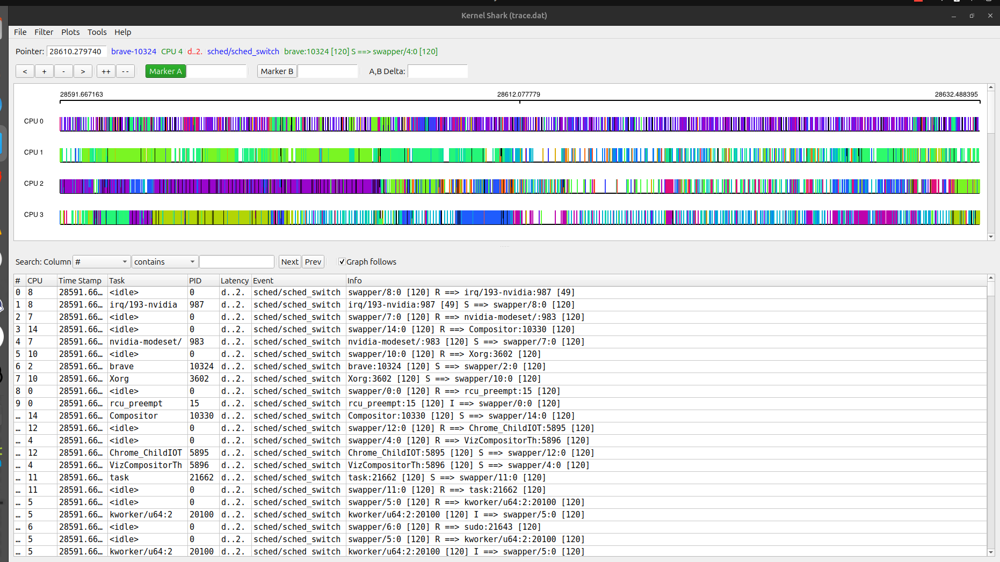

# Scheduling and Synchronization
    
    PL1

| Tarefa | C ms | T ms | D ms | Prioridade RM |
| ------ | ---: | ---: | ---: | ------------: |
| τ1     |    2 |    6 |    5 |             3 |
| τ2     |    3 |   12 |   12 |             2 |
| τ3     |    4 |   15 |   15 |             1 |


    Teoria

    Em RM 
        - Quanto menor o periodo T , maior a prioridade

    Portanto:

        . t1 tem T = 6 ms -> maior prioridade
        . t2 tem T = 12 ms -> prioridade intermedia
        . t3 tem T = 15 -> menor prioridade

    Justificacao

    A prioridade e fixa porque RM e um algoritmo de fixed-priority scheduling.
    Nao depende da deadline absoluta no momento: depende apenas do periodo da tarefa.

    Justificação

    Como:

    T1 = 6 ms
    T2 = 12 ms
    T3 = 15 ms

    então:

    τ1 tem maior prioridade
    τ2 tem prioridade intermédia
    τ3 tem menor prioridade

    Logo:

    τ1 > τ2 > τ3


########################################################################################

Correto. A pergunta 2 pede **duas coisas**:

1. dizer se é schedulable em **preemptive EDF**
2. traçar execução nos primeiros **20 ms**

# Pergunta 2 — EDF preemptivo

## Dados

| Tarefa |  C | T = D | Arrival |
| ------ | -: | ----: | ------: |
| τ1     |  2 |     6 |       2 |
| τ2     |  3 |    12 |       1 |
| τ3     |  5 |    15 |       0 |

## Regra EDF

Em **Earliest Deadline First**:

```text
executa a tarefa READY com deadline absoluta mais próxima
```

A deadline absoluta é:

```text
deadline absoluta = arrival/release + D
```

---

# Trace 0–20 ms

```text
0–1    τ3
1–2    τ2
2–4    τ1
4–6    τ2
6–8    τ3
8–10   τ1
10–12  τ3
12–13  idle
13–14  τ2
14–16  τ1
16–18  τ2
18–20  τ3
```

---

# Explicação rápida

Em `t = 0` só existe `τ3`.

Em `t = 1`, chega `τ2`:

```text
τ2 deadline = 1 + 12 = 13
τ3 deadline = 0 + 15 = 15
```

Logo `τ2` preempta `τ3`.

Em `t = 2`, chega `τ1`:

```text
τ1 deadline = 2 + 6 = 8
τ2 deadline = 13
τ3 deadline = 15
```

Logo `τ1` preempta `τ2`.

---

# Schedulability

Utilização:

```text
U = 2/6 + 3/12 + 5/15
U = 0.333 + 0.25 + 0.333
U = 0.916
```

Como:

```text
U <= 1
```

então:

```text
A task set é schedulable sob EDF preemptivo.
```

######################

Sim — ótima pergunta. **A deadline absoluta não diminui.** O que diminui é o **tempo que falta até à deadline**.

# Correção conceptual

Em `t = 2`, para `τ2`:

```text
deadline absoluta de τ2 = 13
tempo restante até à deadline = 13 - 2 = 11
```

Portanto, não escrevemos:

```text
deadline = 13 - 1
```

Escrevemos:

```text
deadline absoluta = 13
tempo até à deadline = 11
```

Em EDF, normalmente comparamos **deadlines absolutas**. Como todas são comparadas no mesmo instante `t`, a ordem é equivalente.

---

# Pergunta 2 — tabela completa EDF preemptivo

A ficha pede EDF preemptivo e trace nos primeiros 20 ms. 

## Dados

| Tarefa |  C | T = D | Primeiro arrival |
| ------ | -: | ----: | ---------------: |
| τ1     |  2 |     6 |                2 |
| τ2     |  3 |    12 |                1 |
| τ3     |  5 |    15 |                0 |

Releases:

```text
τ1: t = 2, 8, 14, 20...
τ2: t = 1, 13...
τ3: t = 0, 15...
```

---

# Trace detalhado

| Tempo | Evento     | Ready queue com deadline absoluta          | Escolha           | Razão                       |
| ----: | ---------- | ------------------------------------------ | ----------------- | --------------------------- |
|     0 | chega τ3   | τ3 d=15, rem=5                             | τ3                | única ready                 |
|     1 | chega τ2   | τ2 d=13 rem=3; τ3 d=15 rem=4               | τ2                | 13 < 15                     |
|     2 | chega τ1   | τ1 d=8 rem=2; τ2 d=13 rem=2; τ3 d=15 rem=4 | τ1                | 8 é a deadline mais próxima |
|     4 | τ1 termina | τ2 d=13 rem=2; τ3 d=15 rem=4               | τ2                | 13 < 15                     |
|     6 | τ2 termina | τ3 d=15 rem=4                              | τ3                | única ready                 |
|     8 | chega τ1   | τ1 d=14 rem=2; τ3 d=15 rem=2               | τ1                | 14 < 15                     |
|    10 | τ1 termina | τ3 d=15 rem=2                              | τ3                | única ready                 |
|    12 | τ3 termina | nenhuma                                    | idle              | CPU livre                   |
|    13 | chega τ2   | τ2 d=25 rem=3                              | τ2                | única ready                 |
|    14 | chega τ1   | τ1 d=20 rem=2; τ2 d=25 rem=2               | τ1                | 20 < 25                     |
|    16 | τ1 termina | τ2 d=25 rem=2; τ3 d=30 rem=5               | τ2                | 25 < 30                     |
|    18 | τ2 termina | τ3 d=30 rem=5                              | τ3                | única ready                 |
|    20 | chega τ1   | τ1 d=26 rem=2; τ3 d=30 rem=3               | fora do intervalo | trace termina em 20         |

---

# Diagrama final 0–20 ms

```text
0–1     τ3
1–2     τ2
2–4     τ1
4–6     τ2
6–8     τ3
8–10    τ1
10–12   τ3
12–13   idle
13–14   τ2
14–16   τ1
16–18   τ2
18–20   τ3
```

---

# Verificação de execução acumulada

## τ3 primeira instância

```text
0–1   = 1 ms
6–8   = 2 ms
10–12 = 2 ms
total = 5 ms
deadline = 15
termina em 12 ✅
```

## τ2 primeira instância

```text
1–2 = 1 ms
4–6 = 2 ms
total = 3 ms
deadline = 13
termina em 6 ✅
```

## τ1 primeira instância

```text
2–4 = 2 ms
deadline = 8
termina em 4 ✅
```

---

# Schedulability por utilização

```text
U = C1/T1 + C2/T2 + C3/T3
U = 2/6 + 3/12 + 5/15
U = 1/3 + 1/4 + 1/3
U = 11/12
U ≈ 0.9167
```

Como:

```text
U <= 1
```

então:

```text
Schedulable sob EDF preemptivo.
```

---

# E se U fosse maior que 1?

Num único processador:

```text
U > 1
```

significa:

```text
as tarefas pedem mais tempo de CPU do que existe disponível
```

Exemplo:

```text
U = 1.2
```

quer dizer que em cada 1 ms real, o sistema precisaria de 1.2 ms de CPU.

Conclusão:

```text
Não é schedulable num único processador.
Alguma deadline acabará por falhar.
```

---

# Regra mental

Para EDF preemptivo:

```text
1. Calcula deadline absoluta = release + D
2. Mantém tempo restante de C
3. Escolhe a tarefa ready com menor deadline absoluta
4. Se chega uma tarefa com deadline mais cedo, há preempção
```


# Pergunta 3

# Pergunta 3 — Non-preemptive EDF

## Dados

| Tarefa |  C | T = D |
| ------ | -: | ----: |
| τ1     |  2 |     5 |
| τ2     |  1 |     9 |
| τ3     |  4 |    12 |

Assumimos release inicial em:

```text
t = 0
```

---

# Regra: EDF não-preemptivo

Em **non-preemptive EDF**:

```text
Quando a CPU fica livre, escolhe a tarefa READY com deadline absoluta mais cedo.
Depois de começar, essa tarefa executa até terminar.
```

Mesmo que chegue outra tarefa com deadline mais urgente:

```text
não pode interromper
```

---

# Releases e deadlines

| Tarefa | Releases até 20 ms | Deadlines absolutas |
| ------ | ------------------ | ------------------- |
| τ1     | 0, 5, 10, 15, 20   | 5, 10, 15, 20, 25   |
| τ2     | 0, 9, 18           | 9, 18, 27           |
| τ3     | 0, 12              | 12, 24              |

---

# Trace detalhado

| Tempo | Evento                | Ready queue             | Escolha     | Razão              |
| ----: | --------------------- | ----------------------- | ----------- | ------------------ |
|     0 | chegam τ1, τ2, τ3     | τ1 d=5, τ2 d=9, τ3 d=12 | τ1          | deadline mais cedo |
|     2 | τ1 termina            | τ2 d=9, τ3 d=12         | τ2          | 9 < 12             |
|     3 | τ2 termina            | τ3 d=12                 | τ3          | única ready        |
|     5 | τ1 chega              | τ3 a executar           | τ3 continua | non-preemptive     |
|     7 | τ3 termina            | τ1 d=10                 | τ1          | única ready        |
|     9 | chegam τ2; τ1 termina | τ2 d=18                 | τ2          | única ready        |
|    10 | chega τ1; τ2 termina  | τ1 d=15                 | τ1          | única ready        |
|    12 | chega τ3; τ1 termina  | τ3 d=24                 | τ3          | única ready        |
|    15 | τ1 chega              | τ3 a executar           | τ3 continua | non-preemptive     |
|    16 | τ3 termina            | τ1 d=20                 | τ1          | única ready        |
|    18 | chega τ2; τ1 termina  | τ2 d=27                 | τ2          | única ready        |
|    19 | τ2 termina            | nenhuma                 | idle        | CPU livre          |
|    20 | chega τ1              | fora do intervalo       | —           | trace termina      |

---

# Diagrama final 0–20 ms

```text
0–2     τ1
2–3     τ2
3–7     τ3
7–9     τ1
9–10    τ2
10–12   τ1
12–16   τ3
16–18   τ1
18–19   τ2
19–20   idle
```

---

# Verificação de deadlines

| Job | Release | Deadline | Finish | OK? |
| --- | ------: | -------: | -----: | --- |
| τ1₁ |       0 |        5 |      2 | ✅   |
| τ2₁ |       0 |        9 |      3 | ✅   |
| τ3₁ |       0 |       12 |      7 | ✅   |
| τ1₂ |       5 |       10 |      9 | ✅   |
| τ2₂ |       9 |       18 |     10 | ✅   |
| τ1₃ |      10 |       15 |     12 | ✅   |
| τ3₂ |      12 |       24 |     16 | ✅   |
| τ1₄ |      15 |       20 |     18 | ✅   |
| τ2₃ |      18 |       27 |     19 | ✅   |

Conclusão:

```text
A task set é schedulable under non-preemptive EDF nos primeiros 20 ms.
```

---

# Ponto crítico

Em `t = 5`, τ1 chega com deadline `10`, mas τ3 já está a executar desde `t = 3`.

Como é **non-preemptive EDF**:

```text
τ1 NÃO preempta τ3
```

τ3 continua até `t = 7`.

##################################

# Pergunta 4

# Pergunta 4 — Global EDF vs Partitioned EDF

## Dados

| Tarefa |  C | T = D | Utilização |
| ------ | -: | ----: | ---------: |
| τ1     |  9 |    10 |      0.900 |
| τ2     |  6 |     9 |      0.667 |
| τ3     |  4 |     7 |      0.571 |
| τ4     |  3 |     6 |      0.500 |

Utilização total:

```text
U = 9/10 + 6/9 + 4/7 + 3/6
U ≈ 2.638
```

Como existem 3 processadores:

```text
Utotal < 3
```

Isto sugere que pode haver capacidade total suficiente, mas **não garante automaticamente schedulability**.

---

# Global EDF — 3 processadores

## Regra

Em **Global EDF**:

```text
todas as tarefas estão numa fila global
os 3 processadores executam as 3 jobs READY com deadlines mais próximas
```

---

# Releases iniciais

Em `t = 0` chegam todas:

| Job | Deadline absoluta |  C |
| --- | ----------------: | -: |
| τ4₁ |                 6 |  3 |
| τ3₁ |                 7 |  4 |
| τ2₁ |                 9 |  6 |
| τ1₁ |                10 |  9 |

Como há 3 processadores, executam:

```text
τ4, τ3, τ2
```

τ1 fica à espera.

---

# Trace Global EDF — 0 a 15 ms

| Tempo | CPU1 | CPU2 | CPU3 | Observação               |
| ----: | ---- | ---- | ---- | ------------------------ |
|   0–3 | τ4₁  | τ3₁  | τ2₁  | τ4 termina em 3          |
|   3–4 | τ1₁  | τ3₁  | τ2₁  | τ1 começa                |
|   4–6 | τ1₁  | idle | τ2₁  | τ3 termina em 4          |
|   6–7 | τ1₁  | τ4₂  | idle | τ4₂ chega em 6           |
|   7–9 | τ1₁  | τ4₂  | τ3₂  | τ3₂ chega em 7           |
|  9–10 | τ1₁  | τ2₂  | τ3₂  | τ2₂ chega em 9           |
| 10–11 | τ1₁  | τ2₂  | τ3₂  | τ1₁ falha deadline em 10 |
| 11–12 | τ1₂  | τ2₂  | idle | τ1₁ e τ3₂ terminam       |
| 12–14 | τ1₂  | τ2₂  | τ4₃  | τ4₃ chega em 12          |
| 14–15 | τ1₂  | τ2₂  | τ4₃  | τ3₃ chega mas espera     |

---

# Conclusão Global EDF

```text
A task set NÃO é schedulable sob Global EDF neste trace,
porque τ1₁ tem deadline absoluta em t = 10,
mas só termina em t = 11.
```

Deadline miss:

```text
τ1₁: release = 0
C = 9
deadline = 10
finish = 11 ❌
```

---

# Partitioned EDF — 3 processadores

## Regra

Em **Partitioned EDF**:

```text
cada tarefa é atribuída fixamente a um processador
depois cada processador faz EDF localmente
```

Ou seja:

```text
não há migração entre CPUs
```

---

# Problema de particionamento

Utilizações:

```text
τ1 = 0.900
τ2 = 0.667
τ3 = 0.571
τ4 = 0.500
```

Temos 4 tarefas e 3 processadores.

Logo, pelo menos 1 processador teria de receber 2 tarefas.

Mas qualquer par ultrapassa 1?

```text
τ3 + τ4 = 0.571 + 0.500 = 1.071 > 1
τ2 + τ4 = 0.667 + 0.500 = 1.167 > 1
τ2 + τ3 = 0.667 + 0.571 = 1.238 > 1
τ1 + qualquer outra > 1
```

Portanto:

```text
Não existe particionamento EDF válido em 3 processadores usando este critério de utilização.
```

---

# Exemplo de tentativa falhada

A melhor tentativa aparente seria:

| CPU  | Tarefas | Utilização |
| ---- | ------- | ---------: |
| CPU1 | τ1      |      0.900 |
| CPU2 | τ2      |      0.667 |
| CPU3 | τ3 + τ4 |      1.071 |

Mas:

```text
CPU3 tem U > 1
```

Logo:

```text
CPU3 está sobrecarregado.
```

---

# Conclusão final da pergunta 4

```text
Global EDF:
trace possível, mas há deadline miss de τ1 em t = 10.

Partitioned EDF:
não é possível encontrar uma partição válida em 3 processadores,
porque pelo menos um processador teria utilização superior a 1.
```

Próximo: pergunta 5 — recursos partilhados, **None vs PIP vs ICPP**.


####################################################################

# Pergunta 5

# Pergunta 5 — Resource Sharing: None vs PIP vs ICPP

## Dados

| Tarefa |  C | T = D | Arrival | Sequência |
| ------ | -: | ----: | ------: | --------- |
| τ1     |  5 |    10 |       3 | E E R R R |
| τ2     |  4 |    12 |       2 | E E E E   |
| τ3     |  5 |    15 |       0 | E R R R E |

Assumo **prioridades RM**, porque PIP e ICPP são protocolos de recursos para escalonamento de prioridade fixa:

```text
τ1 > τ2 > τ3
```

porque:

```text
T1 = 10
T2 = 12
T3 = 15
```

---

# Significado de E e R

```text
E = execução livre
R = secção crítica, usa recurso partilhado
```

Cada símbolo demora:

```text
1 ms
```

---

# 5.1 Sem política de recursos — None

Aqui ignoramos proteção da secção crítica.
As tarefas são apenas preemptadas por prioridade.

## Trace

```text
0–1     τ3  E
1–2     τ3  R
2–3     τ2  E
3–8     τ1  E E R R R
8–11    τ2  E E E
11–13   τ3  R R
```

## Estado em t = 13

```text
τ1 terminou
τ2 terminou
τ3 ainda falta 1 ms: E
```

---

# 5.2 Priority Inheritance Protocol — PIP

## Ideia

Se uma tarefa de baixa prioridade segura um recurso e uma tarefa de alta prioridade bloqueia nesse recurso:

```text
a tarefa de baixa prioridade herda temporariamente a prioridade da tarefa alta
```

Isto reduz **priority inversion**.

---

## Trace detalhado

| Tempo | Evento                    | O que acontece                    |
| ----: | ------------------------- | --------------------------------- |
|   0–1 | τ3 executa E              | única tarefa ready                |
|   1–2 | τ3 entra em R             | τ3 segura o recurso               |
|   2–3 | τ2 chega                  | τ2 preempta τ3 porque τ2 > τ3     |
|   3–5 | τ1 chega                  | τ1 executa E E                    |
|     5 | τ1 tenta R                | bloqueia porque τ3 segura recurso |
|   5–7 | τ3 herda prioridade de τ1 | τ3 executa R R e liberta recurso  |
|  7–10 | τ1 continua               | τ1 executa R R R e termina        |
| 10–13 | τ2 continua               | τ2 executa E E E e termina        |

## Trace

```text
0–1     τ3  E
1–2     τ3  R
2–3     τ2  E
3–5     τ1  E E
5–7     τ3  R R     ← τ3 herda prioridade de τ1
7–10    τ1  R R R
10–13   τ2  E E E
```

## Estado em t = 13

```text
τ1 terminou
τ2 terminou
τ3 ainda falta 1 ms: E
```

---

# 5.3 Immediate Ceiling Priority Protocol — ICPP

## Ideia

Quando uma tarefa entra numa secção crítica:

```text
a sua prioridade sobe imediatamente para o ceiling do recurso
```

O ceiling do recurso é a maior prioridade entre as tarefas que usam esse recurso.

Como τ1 e τ3 usam R, e τ1 é a mais prioritária:

```text
ceiling(R) = prioridade de τ1
```

---

## Trace detalhado

| Tempo | Evento        | O que acontece                                        |
| ----: | ------------- | ----------------------------------------------------- |
|   0–1 | τ3 executa E  | única tarefa ready                                    |
|   1–4 | τ3 entra em R | prioridade sobe para ceiling de τ1                    |
|     2 | τ2 chega      | não preempta τ3 porque τ3 está com prioridade elevada |
|     3 | τ1 chega      | τ3 continua até sair da secção crítica                |
|   4–9 | τ1 executa    | E E R R R                                             |
|  9–13 | τ2 executa    | E E E E                                               |

## Trace

```text
0–1     τ3  E
1–4     τ3  R R R   ← prioridade elevada pelo ceiling
4–9     τ1  E E R R R
9–13    τ2  E E E E
```

## Estado em t = 13

```text
τ1 terminou
τ2 terminou
τ3 ainda falta 1 ms: E
```

---

# Comparação final

| Política | Resultado principal                                                        |
| -------- | -------------------------------------------------------------------------- |
| None     | há preempção normal, sem proteção real do recurso                          |
| PIP      | τ1 bloqueia em t=5; τ3 herda prioridade para libertar recurso              |
| ICPP     | τ3 sobe logo para prioridade ceiling ao entrar em R; evita bloqueio tardio |

---

# Ideia central

```text
PIP reage ao problema quando ele acontece.
ICPP previne o problema antes de ele acontecer.
```

Próximo passo: passar para a parte **Operating System / Linux trace-cmd / kernelshark**.


##########################################################

# OPERATING SYSTEM

1. Recurrent task

# Parte 2 — Operating System

A ficha agora deixa de ser “papel e lápis” e passa para **observação real do scheduler Linux**.

# Ação — começar pelo exercício 1

## Objetivo

Executar uma tarefa recorrente e observar no KernelShark quando ela:

```text
RUNNING → READY → BLOCKED/SLEEPING → RUNNING
```

## Comandos do exercício 1

```bash
tar -xvzf ex1.tar.gz
cd ex1
make
./task 1 5 500000000 10000000000 0
```

Depois para tracing:

```bash
sudo trace-cmd record -e sched_switch ./task 1 5 500000000 10000000000 0
kernelshark
```

# Como interpretar os argumentos

Provável leitura:

```text
./task 1 5 500000000 10000000000 0
```

| Argumento   | Significado provável                 |
| ----------- | ------------------------------------ |
| 1           | task id                              |
| 5           | número de ativações/jobs             |
| 500000000   | tempo de execução ou workload ~0.5 s |
| 10000000000 | período ou duração total ~10 s       |
| 0           | offset inicial                       |

# O que escrever no relatório

```text
Neste exercício é executada uma tarefa recorrente em Linux. 
A ferramenta trace-cmd recolhe eventos sched_switch, permitindo observar quando o scheduler remove uma tarefa da CPU e coloca outra a executar. 
O KernelShark permite visualizar graficamente esses context switches.
```

# Pitfalls

1. `kernelshark` pode não estar instalado.
2. `trace-cmd` precisa de `sudo`.
3. O Linux normal não é hard real-time.
4. O tempo observado pode variar por carga do sistema.


MInhas respostas codigo 

  


Boa. 🔥
Agora estamos a entrar na parte realmente importante:

> perceber o que o Linux scheduler está a fazer.

E já encontraste um detalhe muito importante:

```text
10000000000: command not found
```

---

# O que aconteceu

O teu comando ficou dividido em duas linhas.

Tu escreveste:

```bash
sudo trace-cmd record -e sched_switch ./task 1 5 500000000
10000000000 0
```

O shell interpretou isto como:

## Linha 1

```bash
sudo trace-cmd record -e sched_switch ./task 1 5 500000000
```

e depois:

## Linha 2

```bash
10000000000 0
```

Mas:

```bash
10000000000
```

não é um comando Linux.

Logo:

```text
command not found
```

---

# O detalhe MAIS importante

Mesmo assim:

```text
trace-cmd começou a gravar
```

Por isso tens:

```text
CPU0 data recorded ...
```

Ou seja:

* o tracing funcionou parcialmente
* mas o programa recebeu argumentos errados

---

# Como pensar

O shell Linux interpreta:

```bash
ENTER
```

como:

> terminou o comando.

Então:

```bash
comando linha1
linha2
```

não é um único comando.

São DOIS comandos.

---

# O comando correto

Tem de ficar numa única linha:

```bash
sudo trace-cmd record -e sched_switch ./task 1 5 500000000 10000000000 0
```

---

# Agora o MAIS importante:

# o que o programa está a fazer

A tua saída:

```text
sleeping until ...
ready for execution
```

mostra um comportamento clássico de **periodic task**.

---

# Modelo mental correto

A task faz algo parecido com:

```c
while (...)
{
    sleep_until(next_period);
    execute_job();
}
```

---

# Interpretação da tua saída

## Exemplo

```text
sleeping until 18295750041820
```

significa:

```text
a tarefa está BLOCKED / SLEEPING
```

Ela não está na CPU.

---

Depois:

```text
ready for execution
```

significa:

```text
a tarefa acordou
e ficou READY para ser escalonada
```

---

# Ligação com teoria da PL1

Agora estás literalmente a ver:

| Estado RTOS      | Linux               |
| ---------------- | ------------------- |
| BLOCKED          | sleeping            |
| READY            | ready for execution |
| RUNNING          | sched_switch        |
| PERIODIC RELEASE | wakeup periódico    |

---

# O que o KernelShark vai mostrar

Quando fizeres:

```bash
kernelshark
```

vais conseguir observar:

* quando a task dorme
* quando acorda
* context switches
* quanto tempo ficou running
* CPU migrations (às vezes)

---

# Mas primeiro

Confirma:

## 1.

Executa corretamente:

```bash
sudo trace-cmd record -e sched_switch ./task 1 5 500000000 10000000000 0
```

---

## 2.

Depois:

```bash
ls
```

e vê se apareceu:

```text
trace.dat
```

---

# Objetivo

Perceber que:

```text
trace-cmd grava eventos do scheduler Linux
```

e:

```text
KernelShark visualiza esses eventos temporalmente
```

---

# Pitfalls

## 1. Comando em múltiplas linhas

Foi exatamente o que aconteceu.

---

## 2. Confundir READY com RUNNING

```text
ready for execution
```

não significa:

> está na CPU agora.

Significa:

> pode ser escolhida pelo scheduler.

---

## 3. Assumir hard real-time

O Linux normal:

* pode introduzir jitter
* pode atrasar wakeups.

Agora executaste:

sudo trace-cmd record -e sched_switch ./task 1 5 500000000 10000000000 0

Tudo numa linha.

Logo:

os argumentos foram corretos
a task executou corretamente
o scheduler gerou MUITOS context switches.

Por isso agora tens:

68891 bytes
57092 bytes
61158 bytes

etc.


---

# Próximo passo (1)

Executa novamente o comando completo numa única linha e depois:

```bash
ls
```

para confirmar a existência de:

```text
trace.dat
```

Só depois abrimos o KernelShark e interpretamos corretamente o timeline.

mais ||

Sim — e isso é extremamente importante perceber. 🔥

Os resultados ficaram muito diferentes porque:

```text
os comandos realmente foram diferentes
```

e isso mudou:

* os argumentos passados ao programa
* a duração do tracing
* a quantidade de eventos capturados.

---

# Primeiro comando (errado)

Tu fizeste:

```bash
sudo trace-cmd record -e sched_switch ./task 1 5 500000000
10000000000 0
```

O shell interpretou:

## comando 1

```bash
sudo trace-cmd record -e sched_switch ./task 1 5 500000000
```

## comando 2

```bash
10000000000 0
```

que falhou:

```text
command not found
```

---

# Consequência

O programa `task` recebeu MENOS argumentos.

Provavelmente:

* executou menos tempo
* terminou rapidamente
* gerou poucos eventos scheduler.

Por isso tinhas:

```text
120 bytes
84 bytes
100 bytes
```

etc.

---

# Segundo comando (correto)

Agora executaste:

```bash
sudo trace-cmd record -e sched_switch ./task 1 5 500000000 10000000000 0
```

Tudo numa linha.

Logo:

* os argumentos foram corretos
* a task executou corretamente
* o scheduler gerou MUITOS context switches.

Por isso agora tens:

```text
68891 bytes
57092 bytes
61158 bytes
```

etc.

---

# Isto revela algo MUITO importante sobre Linux scheduling

Mesmo uma task simples:

```text
gera muitos eventos de scheduler
```

porque o Linux:

* é multitarefa
* multiprocessador
* preemptivo
* cheio de background tasks.

---

# Repara nisto

Tens:

```text
CPU0
CPU1
CPU2
...
CPU15
```

Ou seja:

```text
o tracing foi feito em múltiplos cores
```

Mesmo que a tua task seja única.

Porque o kernel continua:

* timers
* interrupts
* kernel threads
* background services
* scheduler activity.

---

# O ponto mais importante da aula prática

A PL quer mostrar:

```text
a diferença entre teoria ideal
e scheduler real do Linux
```

Na teoria:

* tens só τ1 τ2 τ3.

No Linux real:

* existem dezenas/centenas de entidades concorrentes.

---

# Como pensar agora

A tua task provavelmente faz isto:

```c
sleep_until(next_release);
do_work();
sleep_until(next_release);
```

Logo o scheduler alterna entre:

| Estado   | Linux        |
| -------- | ------------ |
| blocked  | sleeping     |
| ready    | wakeup       |
| running  | sched_switch |
| finished | exit         |

---

# O que vais ver no KernelShark

Quando abrires:

```bash
kernelshark
```

vais conseguir observar:

* quando a task acorda
* quando dorme
* em que CPU executa
* quanto tempo executa
* context switches reais.

---

# Pitfall MUITO importante

Não assumes que:

```text
a task executa continuamente
```

Mesmo sem outras tasks “tuas”:

* o kernel preempta
* interrupts acontecem
* timers disparam.

---

# Próximo passo (1)

Agora executa:

```bash
ls
```

e confirma que tens:

```text
trace.dat
```

Depois abrimos:

```bash
kernelshark trace.dat
```

e eu explico exatamente:

* o que é cada linha
* cores
* switches
* wakeups
* CPUs
* estados da task.

NEXT 

Perfeito. 🔥
Agora já tens:

```text id="f2gf2g"
trace.dat
```

Isto significa:

```text id="9g5vpr"
o trace do scheduler Linux foi gravado corretamente
```

---

# Ação

Agora abre:

```bash id="jlwmrw"
kernelshark trace.dat
```

---

# O que vais ver

O KernelShark é basicamente:

```text id="4xwct1"
um osciloscópio temporal do scheduler Linux
```

Ele mostra:

| Elemento           | Significado        |
| ------------------ | ------------------ |
| linhas horizontais | CPUs               |
| blocos coloridos   | tarefas a executar |
| mudanças de bloco  | context switches   |
| gaps               | idle/sleep         |
| timestamps         | tempo              |

---

# O que deves procurar PRIMEIRO

Não tentes entender tudo.

Procura apenas:

```text id="wm6vtt"
./task
```

ou:

```text id="ifg4yq"
task-xxxxx
```

onde:

* `xxxxx` é o PID.

---

# O que provavelmente vais observar

A task vai:

```text id="f5ggm0"
RUN
SLEEP
WAKE
RUN
SLEEP
```

Porque o programa parece ser periódico.

---

# Ligação direta com teoria RTOS

Na PL1 fizeste:

| Estado teórico   | Linux real   |
| ---------------- | ------------ |
| READY            | runnable     |
| RUNNING          | on CPU       |
| BLOCKED          | sleeping     |
| periodic release | wakeup timer |

Agora vais VER isso.

---

# Modelo mental MUITO importante

Quando a task imprime:

```text id="k5ihjn"
sleeping until ...
```

o Linux provavelmente faz algo equivalente a:

```c id="1w5v8k"
clock_nanosleep(...)
```

Então:

* a task sai da CPU
* entra estado sleeping
* scheduler escolhe outra coisa.

---

# O que é sched_switch

Tu gravaste:

```bash id="kr9m1d"
-e sched_switch
```

Isto significa:

```text id="z0k8s7"
gravar TODAS as trocas de contexto do scheduler
```

Exemplo:

```text id="z4a1p7"
Task A sai
Task B entra
```

---

# O que provavelmente te vai confundir

## 1. Muitas tarefas desconhecidas

Vais ver:

* kworker
* migration
* idle
* Xorg
* chrome
* systemd
* etc.

Porque:

```text id="ezk7av"
o Linux inteiro está vivo
```

---

## 2. Múltiplos CPUs

Podes ver a task mudar de CPU.

Linux faz:

```text id="dd72m3"
load balancing
```

---

## 3. Pequenos blocos

Mesmo uma task simples:

* pode ser interrompida
* preemptada
* migrada.

---

# Objetivo REAL da aula

A aula quer mostrar:

```text id="qswib2"
Scheduling real != modelo académico perfeito
```

O Linux:

* tem jitter
* interrupções
* concorrência real
* latências.

---

# Próximo passo (1)

Abre o KernelShark:

```bash id="wq0rw0"
kernelshark trace.dat
```

e tira screenshot da timeline principal onde aparece:

* CPUs
* task
* blocos coloridos.

Depois explicamos:

* cada linha
* wakeups
* context switches
* execução periódica
* preempção real.

WOW 



YES. 🔥
Agora estás finalmente a ver um scheduler real.

E repara:

> isto parece “caótico” exatamente porque sistemas reais são caóticos.

---

# O que estás a olhar

## Parte de cima

As barras coloridas:

| Linha | Significado                 |
| ----- | --------------------------- |
| CPU0  | execução temporal no core 0 |
| CPU1  | execução temporal no core 1 |
| CPU2  | execução temporal no core 2 |
| CPU3  | execução temporal no core 3 |

Cada cor:

```text id="26v0jc"
uma tarefa/thread diferente
```

Cada mudança de cor:

```text id="k53u7g"
context switch
```

---

# O MAIS importante da imagem

Tu já encontraste a tua task:

```text id="0djh0l"
task:21662
```

Excelente.

---

# Agora olha esta linha

```text id="mjlwm4"
task:21662 [120] S ==> swapper/11:0 [120]
```

Vamos desmontar isto.

---

# Interpretação

## task:21662

A tua tarefa.

---

## [120]

Prioridade scheduler Linux normal.

---

## S ==>

Significa:

```text id="1uifcb"
a task saiu da CPU
```

Estado:

```text id="jlwm6x"
Sleeping
```

---

## swapper/11

Idle task do CPU11.

Ou seja:

```text id="avqkku"
não havia mais nada pronto naquele core
```

Então o Linux colocou:

```text id="4m8x0s"
idle thread
```

---

# Isto liga DIRETAMENTE à teoria

Na PL1 tinhas:

```text id="ew63gf"
idle
```

Agora estás a ver o equivalente real Linux:

```text id="w5z8gi"
swapper
```

---

# Outra linha importante

```text id="xst09m"
swapper/11:0 [120] R ==> task:21662 [120]
```

Isto significa:

```text id="2jm2mu"
a task acordou
e passou READY → RUNNING
```

---

# Modelo mental correto

A tua task faz algo tipo:

```c id="q6ccm2"
sleep();
wake up periodically;
execute;
sleep();
```

Então no scheduler real:

| Estado RTOS | Linux        |
| ----------- | ------------ |
| BLOCKED     | S            |
| READY       | runnable     |
| RUNNING     | current task |
| IDLE        | swapper      |

---

# O que as cores mostram

As barras coloridas representam:

```text id="g3stdd"
ocupação temporal da CPU
```

Isto é praticamente um:

```text id="bcnxqv"
logic analyzer do scheduler
```

---

# Porque parece tão “louco”

Mesmo sem fazeres quase nada:

Linux está a executar:

* browser
* compositor
* Xorg
* kernel workers
* IRQ handlers
* timers
* drivers
* GPU threads
* scheduler threads

Tu estás a ver:

```text id="4klc4n"
concorrência real
```

---

# Coisa MUITO importante

Na teoria da PL:

```text id="dzvd3f"
1 CPU
3 tasks
timeline limpa
```

No Linux real:

```text id="4aw8l8"
múltiplos CPUs
dezenas de threads
interrupções
migração
jitter
```

---

# Isto é IMPORTANTÍSSIMO para Embedded Linux

Agora estás a perceber porque:

* RT patches existem
* PREEMPT_RT existe
* CPU affinity existe
* isolcpus existe
* latency analysis existe.

---

# Coisa MUITO interessante

Vês:

```text id="x0cz9s"
irq/193-nvidia
```

Isto é:

```text id="zh7onm"
interrupt thread da GPU NVIDIA
```

Logo:

* hardware real
* interrupts reais
* scheduler real.

---

# Objetivo real da aula prática

A aula quer que percebas:

```text id="1g4ybj"
Scheduling académico
!=
Scheduling real Linux
```

---

# Próximo passo (1)

Agora usa:

```text id="nnrt1n"
Search: task
```

na tabela inferior.

## Objetivo

Filtrar apenas:

```text id="1jlwm5"
task:21662
```

e observar:

* quando acorda
* quando dorme
* em que CPU executa
* quanto tempo fica running.

VOU DORMIR!!!