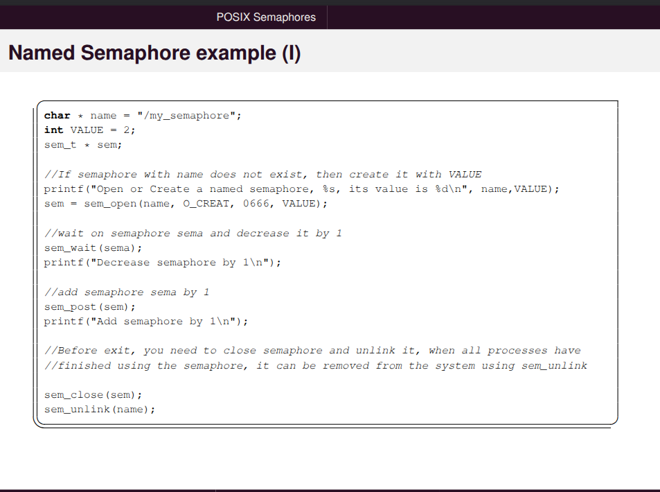
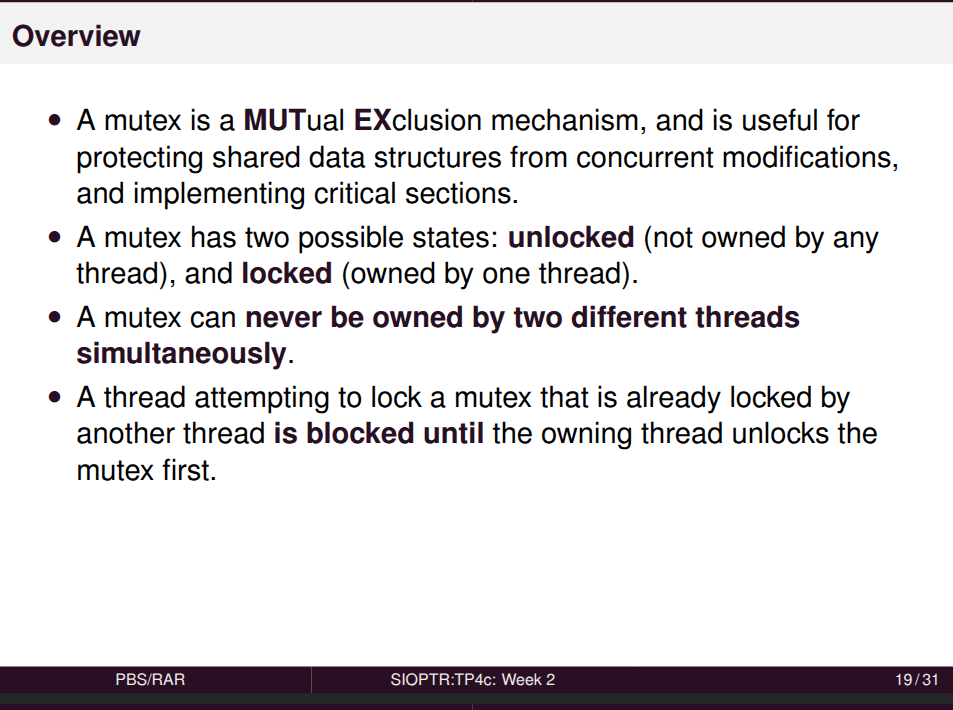
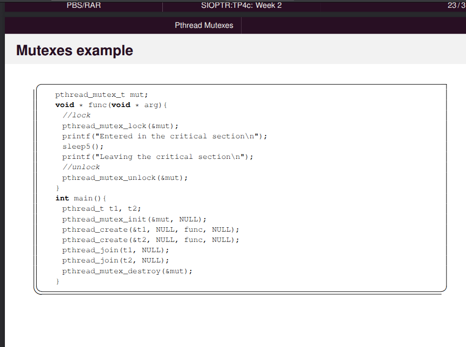
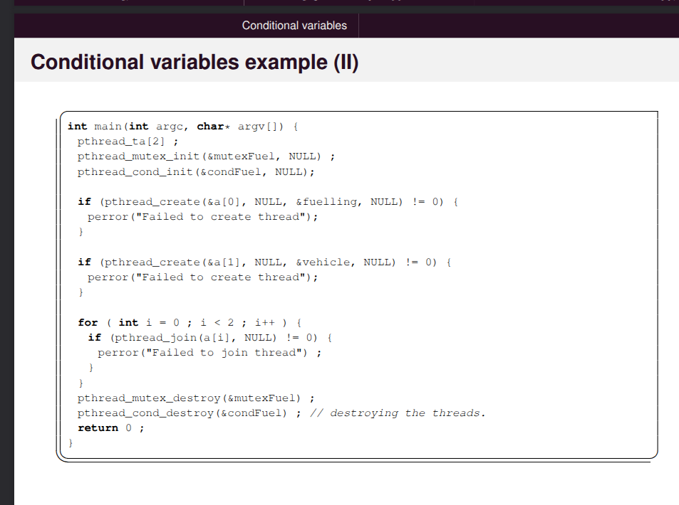
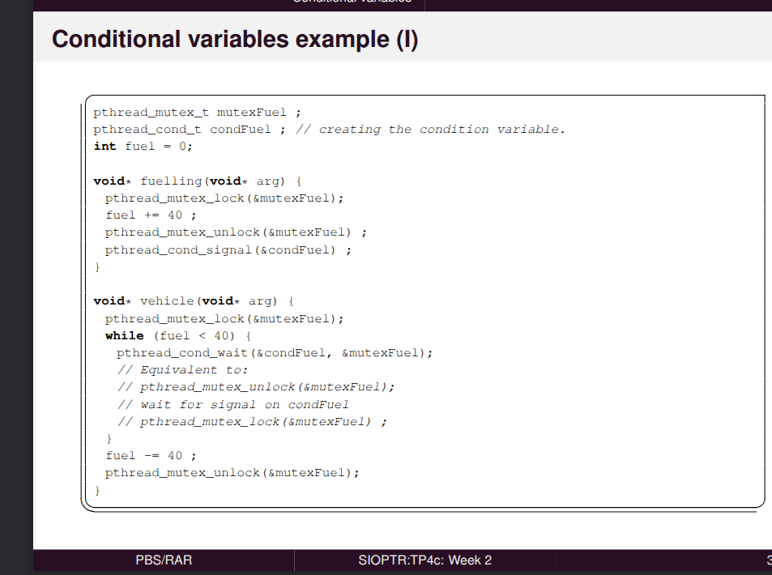
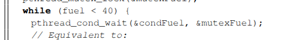

...

podemos adaptar . 

o exercicio 4 ja tem malvadez, temos de fazer com cuidado

. 

Em termods de tarefars e igual. 

sched fifo e um algoritomo de escalonamento, e uma das heuristicas para soft real time no Linux. 

Linux implementa varias policticas de escalonamento. 

A saber - sched Soft real time

RT - e implementado sched_fifo e o sched round robin.. 

0 a 99. valor 0 menor prioridade 99 maior prioridade. 

tarefas que tem prioridades. 

consigo dar uma prioridade a cada tarefa. 

uma tarefa de alta prioridade vai ficar a espera se a menor prioridade tiver o semafor. 

temos de reproduzir os tasks sets. 

Por fim temos, 

Temos a mesma coisa, mas usamos o sched_deadline. a politica de escalonamento do LKinux vamos dizer que e o edf mas e o cbs na pratica, porque usa um timer para nao ter overrun. 

sistema operativo cria se tarefa e nao aparecem mais. usam run time, 

sched deadline sched fifo, 

a ideia da aula, ver os cionhecimentos de real time, tentar excutar a ideia sera alterar, tem utilizacao de 50 % tarefa utilizar mais de 50 % cria essa e nao cria mais nenhuma, primeira parte do exercicio e papel!!!! rate monotocinco usantdo o fifo, edf o deadline, usar este s bed, conhecimnetos adquiridos, 

vou falar o que e um semaforo

# Mecanimso de sincronizacao. 

seccao critica, 

semaforos dois tipos  

pode ter contadores. 

os leitores as tarefas que so leem aquele valor. 

semaforos de excliusao, que permite so um aceder, tipicamente sao inicializados com o valor 1, nao pode abrir mais do que isso,

Em termos de API, 

tem que se gerir ao nivel do nivel operativo. 

temos erro neste slide. 

emp post incrementar 

aceder a consolo nao pode haver todos aceder ao mesmo tempo.. !

memory_leak -> lembrar como faziamos na 42 penso que era com valgrind...

os processo herdam todas as variaveis do processo Pai. 

ao contrario dos processos, nao partillham , semaforos com threads nao precisamos de nomes. da main thread, partilhado por todas as threads.

Mutex o que sao, sao semaforos de exclusao. 

tem outra caractereistica, semaforo normal este podem nao tem propriedade do semafora

no casos dos mutex, e tipo uim semaforo de exclusao, so tem 0 ou 1 tem o conceito de owner, nao consigo fazer unliock se nao for o owner, 

no mutex e possivel troca de prioridades porque tem owner. 

EXEMPLO 

THREAD ONDE VAI COMECAR, AQUI TEM DE HAVER SEMPRE LOCK E UNLOCK

regra do torniquete,

posso ter 5 leitores, mas quando tenho um escritor nao posso ter leitores, 

quando o semaforo tiver 0 fazemos o post aos escritore, quando o escritor sair fazo o torniquete ao leitores. 

# 5 conditional variables

P{reciso de um acontecimento}

vou arrancar com 2 threads, uma vai encher a gasolina, 

o veiculo se tiver pouco combustivel , vai ficar a espera que haj comubustivel suficiente, usa se variaveis de condicao, 

fuel < 40. 

ele desbloqueia variavei de condicao, depende do contexto sao mecanismos de recousce sharing, podemos ter acessos exclusivos ou nao no caso do mutexes sao exclusivos. 

que faz lock , so ele e que vai poder fazer unlock . 

liberta o mutex para que os outros possam usar. 

&mutexFuel -> e um mutex...

pthread_mutex_lock(&mutexFuel)

mutex sao de exclusao..

