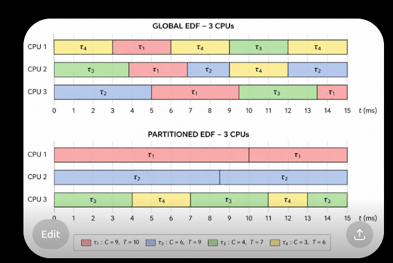
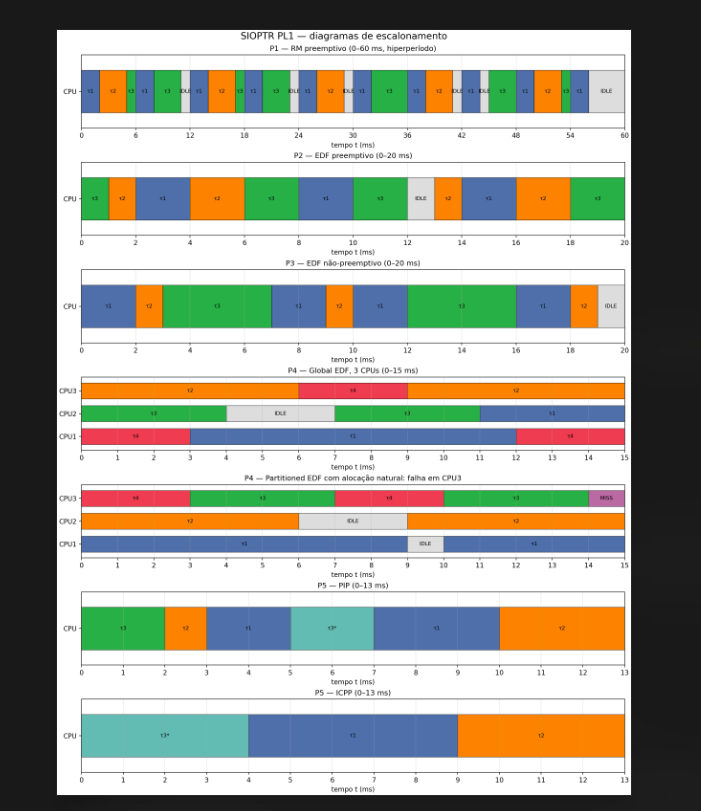
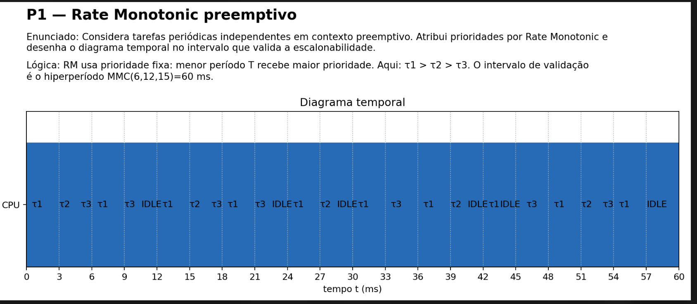
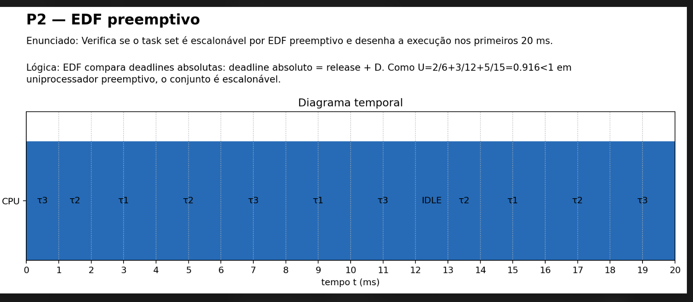
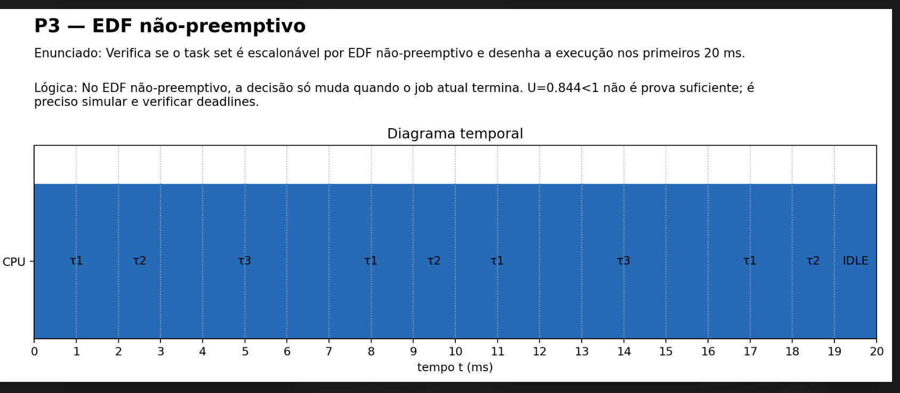
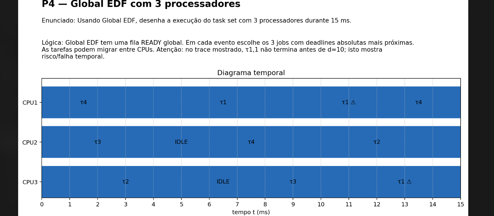
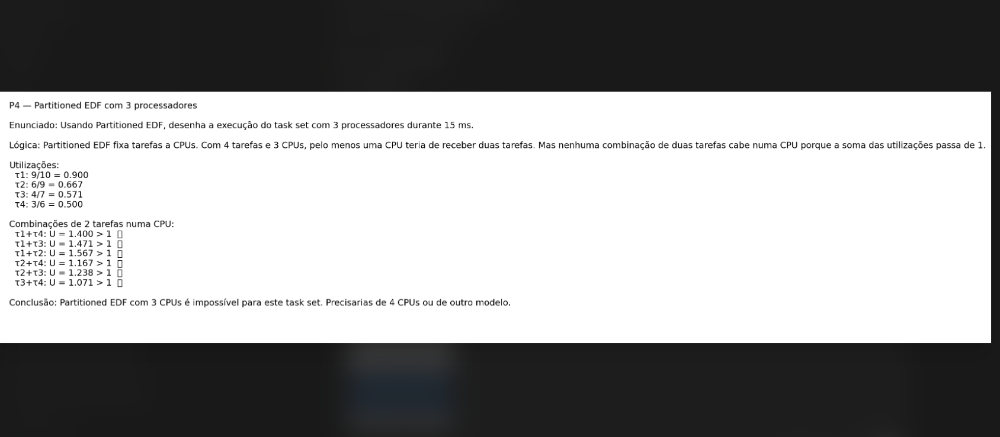
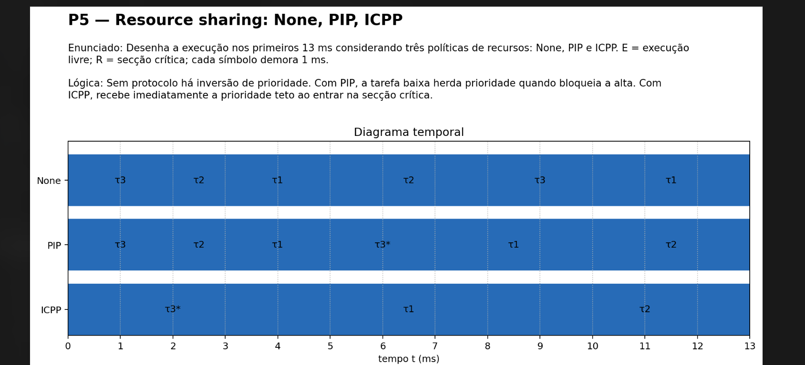
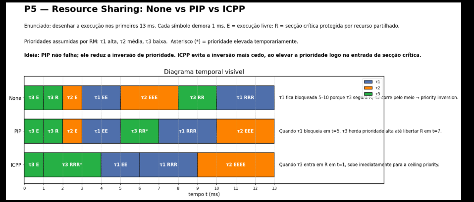
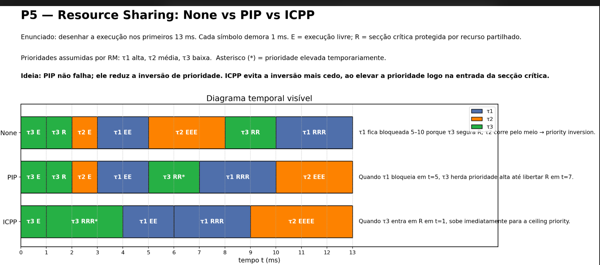

global edf  e partioned

apontamentos

cat - LEITURA

echo - escrita

OPEN

READ

CLOSE

# Diagramas PL1

################################################

Aula antiga 

# 1 - RM preemptivo

# 2 - EDF preemptivo 

# 3 - EDF nao preemptivo

# 4 - Global EDF com 3 processadores

# 4 - partioned edf 

# 5 - NONE / PIP / ICPP

