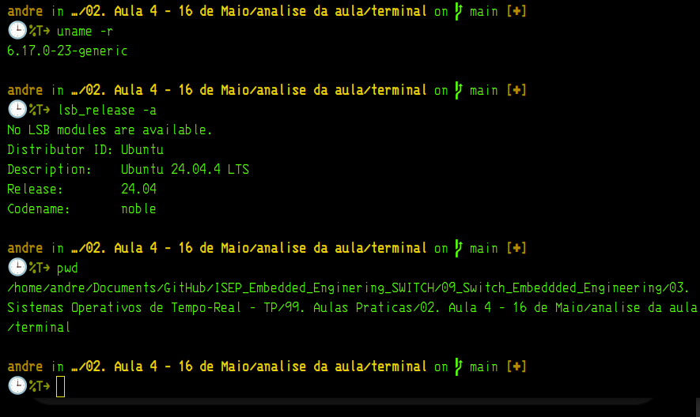
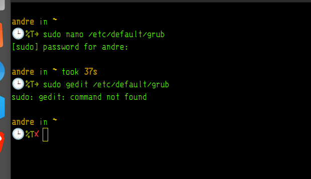

vou ver o tt4

terminal 

ção — 1 passo 🚀

Abre o terminal e confirma primeiro em que sistema estás a trabalhar:

uname -r
lsb_release -a
pwd




Antes de mexer no kernel , precisamos validar 3 coisas.:

    1. Versao atual do kernel com uname -r
    2. Distribuicao Linux com lsb_release -a
    3. Diretorio atual com pwd

Isto e importante porque o TT4 e sobre criar e compilar um kernel proprio chamado *MOKER*. O pdf comeca por instalar ferramentas, mostrar o menu GRUB, descarregar o kernel Linux, configurar, alterar o EXTRAVERSION = -moker compilar e instalar o kernel

    Hoje nao e para "decorar comandos" e para perceber a cadeia: 

sistema atual
   ↓
ferramentas de compilação
   ↓
código-fonte do kernel
   ↓
.config
   ↓
Makefile com -moker
   ↓
make
   ↓
install
   ↓
GRUB
   ↓
boot no novo kernel

#############################################################

## Ação — 1 passo 🚀

Agora instala **só as ferramentas necessárias para compilar o kernel**:

```bash
sudo apt-get update
sudo apt-get install libssl-dev libncurses5-dev libelf-dev bison flex build-essential
```

## Objetivo

Preparar o Ubuntu 24.04 para conseguir executar depois:

```bash
make menuconfig
make
sudo make modules_install
sudo make install
```

O TT4 pede precisamente instalar `libssl-dev`, `libncurses5-dev`, `libelf-dev`, `bison` e `flex`; estas dependências são necessárias para configurar e compilar o kernel. 

O teu estado inicial está bom:

```text
Kernel atual: 6.17.0-23-generic
Distribuição: Ubuntu 24.04.4 LTS noble
```

## Como pensar

Antes de compilar kernel, pensa assim:

```text
make menuconfig precisa de ncurses
assinatura/crypto precisa de openssl/libssl
ELF/kernel build precisa de libelf
parsers do kernel precisam de bison/flex
compilação C precisa de gcc/make/build-essential
```

Isto ainda **não mexe no GRUB**, **não instala kernel novo**, **não altera boot**. É preparação segura.

######

Como pensar

Este reboot ainda não muda o kernel. Vais continuar, em princípio, no:

6.17.0-23-generic

O reboot aqui serve para começar a fase seguinte com o sistema estável antes de mexer no GRUB e no código-fonte do kernel.

#####

Ação — 1 passo 🚀
Agora ativa o menu do GRUB para poderes escolher kernels no boot:
sudo nano /etc/default/grub
Dentro do ficheiro, procura estas linhas:
GRUB_TIMEOUT_STYLE=hiddenGRUB_TIMEOUT=0
Altera para:
#GRUB_TIMEOUT_STYLE=hiddenGRUB_TIMEOUT=10

# Objectivo

Objetivo

Quando compilares e instalares o kernel -moker, vais precisar escolher entre:

Ubuntu normal kernel
Ubuntu kernel -moker

O TT4 manda comentar GRUB_TIMEOUT_STYLE=hidden e mudar GRUB_TIMEOUT de 0 para 10, para o menu GRUB aparecer durante o arranque.

# como pensar 

Como pensar

Ainda não estás a instalar kernel. Estás só a preparar o “seletor de kernels”.

kernel atual existe
   ↓
futuro kernel -moker será instalado
   ↓
GRUB precisa mostrar os dois
   ↓
tu escolhes no boot


################




O PDF usa gedit, mas o objetivo real não é usar esse editor; é editar o ficheiro /etc/default/grub para o menu GRUB aparecer no arranque. O TT4 diz para comentar GRUB_TIMEOUT_STYLE=hidden, mudar GRUB_TIMEOUT para 10, guardar, e depois atualizar o GRUB.

Como pensar
gedit = editor gráfico
nano  = editor de terminal

Ambos editam o mesmo ficheiro. O resultado final é igual.

####################################

Falta só comentar a primeira linha com #. Assim o GRUB deixa de estar escondido e fica visível durante 10 segundos no arranque, como pedido no TT4.

Como pensar

GRUB_TIMEOUT=10 sozinho define tempo, mas se GRUB_TIMEOUT_STYLE=hidden continuar ativo, o menu pode continuar escondido. O # transforma essa linha em comentário.


####################

Agora atualiza o GRUB:

sudo update-grub2


Objetivo

Aplicar a alteração feita em:

/etc/default/grub

