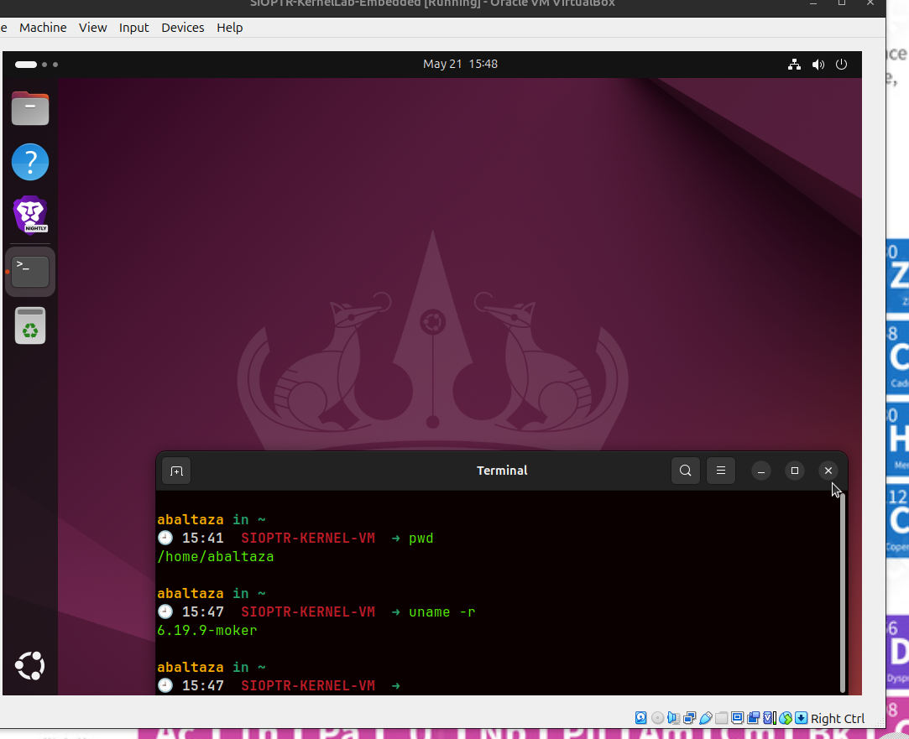
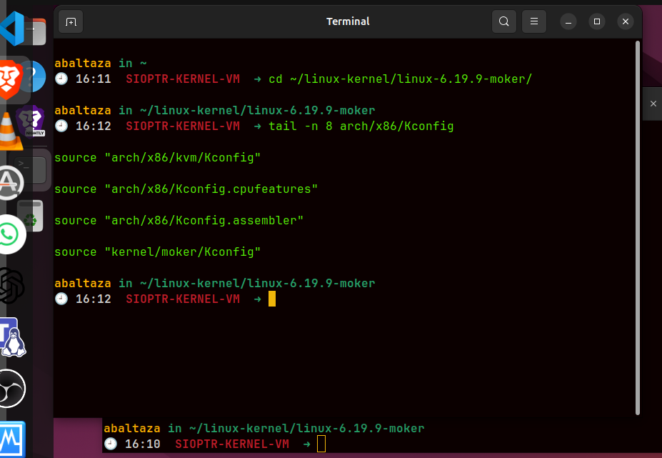
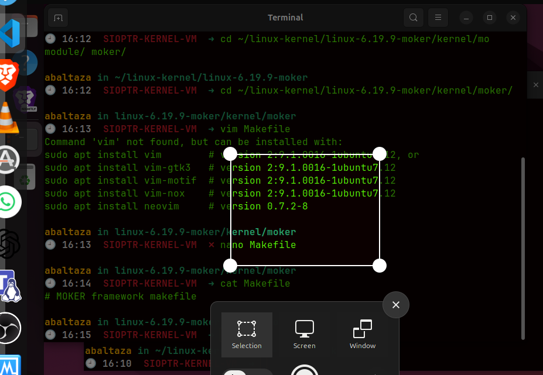
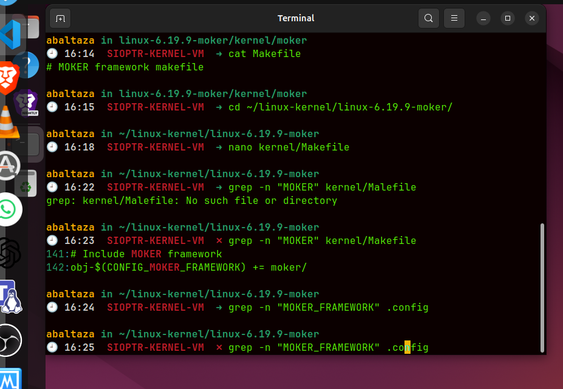
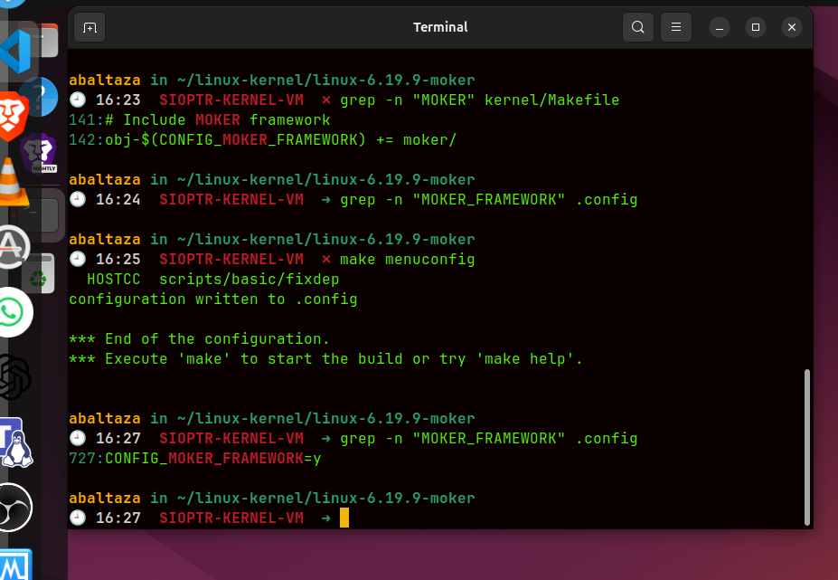
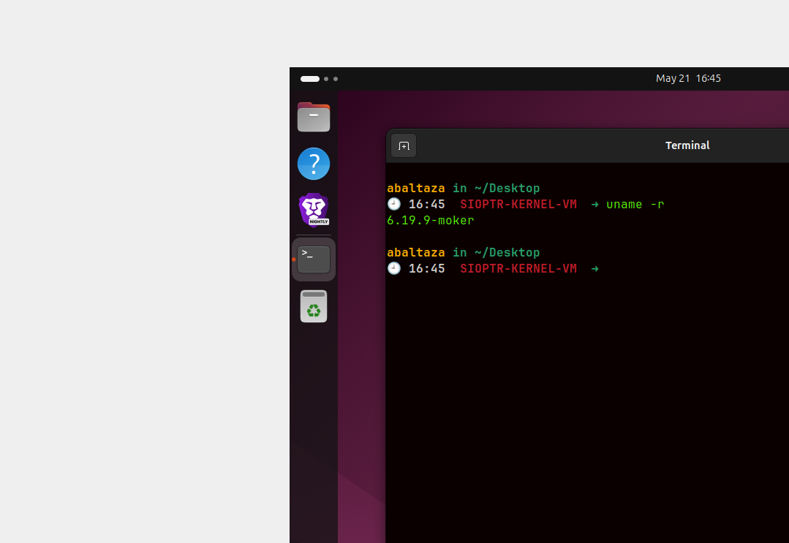

# Verificacao do estado da maquina



# meu entendimento

Nao parece tao complicado esta tarefa basicamente so para criarr uma estrutura do framework Moker , para evitar espalhar o codigo por muitas pastas da arvore do kernel. 


# Ponto 2 Preparing e 3 Configuration Option Menu

- Agora estamos a mexer na arvore source do kernel, nawo no sistema instalado. 

    kernel/
        moker /

- Este directorio por si so nao faz nada . Ele so prepara o espaco onde vamos por:

    Kconfig
    Makefile
    codigo MOKER futuro


- Dentro da PASTA moker dentro do kernel 


# Ponto 3 Configuration Option Menu

    # Cria o ficheiro kconfig

        gedit Kconfig

    # dnetro do Kconfig

        menu "MOKER framework"

config MOKER_FRAMEWORK
	bool "My Own KERnel Framework"
	default y

endmenu

- Objetivo criar configuRACAO para depois aparecer quando se faz 

    make menuconfig

O TT5 pede exactamente que o ficheiro seja criado.

com a opcao MOKER_FRAMEWORK; no codigo/configuracao do kernel ela sera referida como CONFIG_MOKER_FRAMEWORK

Como pensar

O caminho correto é:

linux-6.19.9-moker/
└── kernel/
    └── moker/
        └── Kconfig


Portanto esse moker final no pwd e exatamente o diretorio novo que criaste

provando que esta certo 



O ponto 3 é sobre fazer o menu de configuração aparecer no make menuconfig; o ponto 4 começa quando crias o Makefile em kernel/moker. O TT5 separa isso assim: primeiro cria/inclui o Kconfig; depois, na secção 4 Compilation, pede para criar um Makefile vazio com uma linha de comentário.

# 4 - Compilation

Agora sobe até à raiz do kernel e abre o arch/x86/Kconfig:

    cd ~/linux-kernel/linux-6.19.9-moker
    nano arch/x86/Kconfig

Vai ao fim do ficheiro com:

    Alt + /

E adiciona esta linha no fim:

    source "kernel/moker/Kconfig"

Ligar o teu novo kernel/moker/Kconfig ao sistema principal de configuração x86.

Sem esta linha, o ficheiro existe, mas o make menuconfig nunca o lê.

# Como pensar

Neste momento tens:

    kernel/moker/Kconfig

Mas o kernel ainda não sabe que ele existe. O arch/x86/Kconfig é como o índice principal da configuração para x86:


Agora criar uma makefile

nano Makefile e dentro :

    # MOKER framework makefile

Objetivo

Entrar no ponto 4 — Compilation: preparar o ficheiro local que será usado para compilar o código dentro de kernel/moker.

Neste momento ele ainda só tem um comentário, porque ainda não há .c para compilar.

Como pensar

Agora tens duas peças diferentes:

kernel/moker/Kconfig   → define a opção MOKER_FRAMEWORK
kernel/moker/Makefile  → define o que compilar dentro de moker/

Depois ainda vamos ligar o diretório moker/ ao kernel/Makefile.


no diretorio ~/linux-kernel/linux-6.19.9-moker

    nano kernel/Makefile




Objetivo

Dizer ao sistema de build do kernel:

Se CONFIG_MOKER_FRAMEWORK=y
então entra em kernel/moker/

O Kconfig cria a opção. O kernel/Makefile usa essa opção para decidir se o diretório entra na compilação.

Como pensar

A ligação fica assim:

Kconfig
  ↓
MOKER_FRAMEWORK
  ↓ vira
CONFIG_MOKER_FRAMEWORK
  ↓ usado em
kernel/Makefile
  ↓ compila
kernel/moker/

Agora valida se o símbolo ficou ativo no .config:

grep -n "MOKER_FRAMEWORK" .config
Objetivo

Confirmar se esta cadeia ficou completa:

arch/x86/Kconfig
  → lê kernel/moker/Kconfig
  → cria MOKER_FRAMEWORK
  → .config guarda CONFIG_MOKER_FRAMEWORK=y
  → kernel/Makefile entra em moker/

O teu kernel/Makefile já está correto:

obj-$(CONFIG_MOKER_FRAMEWORK) += moker/
Como pensar

O grep anterior prova só uma coisa:

kernel/Makefile sabe que deve usar CONFIG_MOKER_FRAMEWORK

Mas ainda falta provar se o .config sabe que essa opção existe e está ativa

nao esta 



tionha de fazer 

    make menuconfig

gravar e sair

e ja deu WOWOWOW



Objetivo

Forçar o sistema Kconfig a reler:

arch/x86/Kconfig
        ↓
source "kernel/moker/Kconfig"
        ↓
config MOKER_FRAMEWORK

Depois disso, o .config deve passar a conter:

CONFIG_MOKER_FRAMEWORK=y
Como pensar

Tu já fizeste a parte estrutural correta:

Kconfig criado ✅
arch/x86/Kconfig ligado ✅
kernel/Makefile ligado ✅

Mas o .config é um ficheiro gerado/atualizado. Ele não muda sozinho só porque criaste um novo Kconfig.

######################
---
Excelente ⚙️🔥 Agora valida se o make menuconfig mostra mesmo a entrada MOKER:

make menuconfig

Dentro do menu, procura visualmente por:

MOKER framework

Depois sai sem alterar nada.

Objetivo

Provar que o Kconfig não só foi lido, mas ficou integrado no sistema de configuração do kernel.

Já tens confirmado:

CONFIG_MOKER_FRAMEWORK=y

Isto significa que o símbolo existe e está ativo.

Como pensar

Agora fechaste a cadeia principal:

kernel/moker/Kconfig        ✅ define opção
arch/x86/Kconfig            ✅ inclui opção
.config                     ✅ guarda CONFIG_MOKER_FRAMEWORK=y
kernel/Makefile             ✅ usa CONFIG_MOKER_FRAMEWORK
kernel/moker/Makefile       ✅ existe

Isto é mesmo trabalho de kernel build system. Não é “só comandos”.

---
#########################################################

Sim — ficou integrado no menuconfig ✅

Agora sai do menuconfig e grava a configuração:

Exit → Exit → Save
Objetivo

Garantir que o estado visível no menu fica persistido em:

.config

O ponto importante é este:

MOKER framework --->     aparece no menu
CONFIG_MOKER_FRAMEWORK=y fica no .config
kernel/Makefile          usa essa flag
Como pensar

Agora já não estás só a “seguir slides”. Criaste um subsistema configurável dentro da árvore do kernel:

arch/x86/Kconfig
        ↓
kernel/moker/Kconfig
        ↓
CONFIG_MOKER_FRAMEWORK
        ↓
kernel/Makefile
        ↓
kernel/moker/

Isto é a lógica real do build system do Linux.


---

# Criacao do kcompile.sh


## Ação (1 passo)

Cria agora o `kcompile.sh` na raiz do kernel:

```bash
cd ~/linux-kernel/linux-6.19.9-moker
nano kcompile.sh
```

Cola isto:

```bash
#!/bin/bash
start=$(date +'%s')

sudo make 2>../errors-6.19.9-moker
sudo make modules_install
sudo make install

sudo update-grub2

cat ../errors-6.19.9-moker
echo "Linux kernel compilation and installation took $(($(date +'%s') - $start)) seconds"
```

Guarda e sai:

```text
Ctrl + O
Enter
Ctrl + X
```

Depois torna executável:

```bash
chmod +x kcompile.sh
```

## Objetivo

Criar o script que o enunciado espera para recompilar e instalar o kernel já com a integração do TT5.

Não vais “compilar o `.sh`”; vais **executar** o script depois:

```bash
sudo ./kcompile.sh
```

## Como pensar

O TT5 alterou a **árvore source**:

```text
arch/x86/Kconfig
kernel/Makefile
kernel/moker/Kconfig
kernel/moker/Makefile
.config
```

Mas o kernel que está a correr ainda é o binário antigo do TT4. Para o TT5 ficar dentro do kernel instalado, é preciso recompilar e instalar.

## Pitfalls & troubleshooting

* Este script demora bastante.
* Se houver erro, lê primeiro `../errors-6.19.9-moker`.
* Se o script não tiver `chmod +x`, dá `Permission denied`.
* Não faças reboot antes do script terminar.

## Alternativas / tradeoffs

**Criar `kcompile.sh`:** segue o enunciado e guarda erros.
**Executar comandos manualmente:** funciona, mas é mais fácil esquecer `modules_install`, `install` ou `update-grub2`.

## Pergunta de decisão

Depois de criares e fazeres `chmod +x`, o comando `ls -l kcompile.sh` mostra permissões com `x`, tipo `-rwxr-xr-x`?


---

# Aprendizagem

## Ação (1 passo)

Deixa o `sudo ./kcompile.sh` correr até terminar. Não interrompas.

## Objetivo

Sim, é normal instalar/compilar muita coisa. O script está a recompilar e instalar o kernel, não apenas o teu ficheiro `moker`.

O sinal importante no teu output é este:

```text
AR kernel/moker/built-in.a
```

Isto é excelente: prova que o build system **entrou no diretório `kernel/moker/`** e criou o arquivo interno `built-in.a`.

Mesmo sem código `.c`, isto confirma que a ligação funcionou:

```text
CONFIG_MOKER_FRAMEWORK=y
        ↓
kernel/Makefile
        ↓
kernel/moker/
        ↓
kernel/moker/built-in.a
```

## Como pensar

O `kcompile.sh` faz uma sequência pesada:

```text
make                  → recompila o kernel
make modules_install  → instala módulos
make install          → instala imagem do kernel
update-grub2          → atualiza boot menu
```

Como mexeste no build system do kernel, o `make` precisa recalcular dependências e reconstruir partes internas.

## Pitfalls & troubleshooting

* Não feches a VM.
* Não faças reboot enquanto ainda está a compilar.
* Se aparecer erro, não ignores: o script guarda em `../errors-6.19.9-moker`.
* O terminal pode parecer “parado” por algum tempo durante compilação; isso não significa crash.

## Alternativas / tradeoffs

**Compilação completa:** mais lenta, mas valida o TT5 como o professor quer.
**Compilação parcial:** mais rápida, mas menos segura para entrega/avaliação.

## Pergunta de decisão

Quando o script acabar, aparece uma mensagem tipo `Linux kernel compilation and installation took ... seconds` ou aparece algum erro?

---

depois de kcompile.sh

fazer reboot

e depois
    uname -r 


# final



## Sim — podes finalizar ✅

Está bom. Tens as provas principais todas:

```text
uname -r                         → 6.19.9-moker
.config                          → CONFIG_MOKER_FRAMEWORK=y
kernel/Makefile                  → obj-$(CONFIG_MOKER_FRAMEWORK) += moker/
arch/x86/Kconfig                 → source "kernel/moker/Kconfig"
menuconfig                       → MOKER framework aparece
compilação                       → kernel/moker/built-in.a foi gerado
```

## Estado final do TT5

```text
TT5 concluído ✅
Kernel recompilado ✅
Kernel instalado ✅
GRUB atualizado ✅
Reboot feito ✅
Kernel ativo confirmado ✅
```

## Nota curta para o teu caderno

No TT5 foi criado e integrado o framework **MOKER** na árvore do Linux kernel.
Foi criado o diretório:

```text
kernel/moker/
```

Dentro dele foi criado o ficheiro:

```text
kernel/moker/Kconfig
```

com a opção:

```text
MOKER_FRAMEWORK
```

Depois, essa opção foi ligada ao menu principal através de:

```text
arch/x86/Kconfig
source "kernel/moker/Kconfig"
```

A configuração foi atualizada com `make menuconfig`, ficando:

```text
CONFIG_MOKER_FRAMEWORK=y
```

Por fim, o `kernel/Makefile` foi alterado para incluir o novo diretório:

```makefile
obj-$(CONFIG_MOKER_FRAMEWORK) += moker/
```

Após recompilar, instalar e reiniciar, o sistema arrancou corretamente com:

```text
6.19.9-moker
```

Conclusão: o framework MOKER ficou integrado no sistema de configuração e build do kernel.


