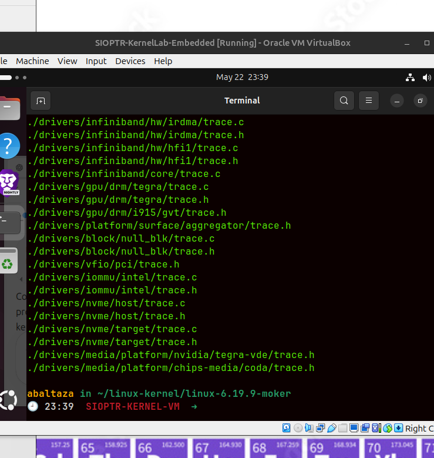

Objetivo

Localizar exatamente onde está a tua implementação do tracing antes de adicionarmos o mecanismo enabled.

O TT7, pela imagem, quer isto:

syscall enable/disable
        ↓
variável global enabled
        ↓
moker_trace(...) só grava se enabled == 1
Como pensar

Antes de criar syscall, precisamos saber onde está o estado do tracing. A pergunta técnica é:

O tracing pertence ao scheduler?
Ou pertence ao módulo/ficheiro próprio moker trace?

Se trace.c já existe, o sítio natural para a variável é lá:

unsigned int enabled = 0;

e a função moker_trace(...) passa a ter uma guarda:

if (enabled) {
    ...
}

Isto separa bem responsabilidades:

scheduler chama moker_trace()
trace.c decide se grava ou ignora

## Ação (1 passo)

Adiciona a variável global logo depois da linha:

```c id="902pqm"
struct trace_evt_buffer trace;
```

ficando assim:

```c id="3ys3aa"
struct trace_evt_buffer trace;

unsigned int enabled = 0;
```

## Objetivo

Criar o estado global que controla o tracing:

```text id="bzi7g1"
enabled = 0  → tracing desligado
enabled = 1  → tracing ligado
```

Isto é exatamente a base do TT7: o kernel passa a ter uma “chave” para decidir se grava eventos no ring buffer ou ignora.

## Como pensar

A variável deve estar no mesmo ficheiro que gere o buffer, porque ela controla a política de gravação:

```text id="yxlc9c"
trace.c
 ├── buffer
 ├── enqueue/dequeue
 ├── conversão de eventos
 └── enabled
```

Ainda **não** estamos a criar a syscall. Primeiro damos ao tracing um estado interno.

## Pitfalls & troubleshooting

* Não coloques `enabled` dentro de uma função; tem de ser global.
* Não escrevas `unsigned int enable`; o PDF usa `enabled`.
* Não uses `static` ainda se a syscall precisar aceder a esta variável a partir de outro ficheiro.
* Mantém o valor inicial `0` para o sistema arrancar com tracing desligado.

## Alternativas / tradeoffs

| Opção                              |                       Vantagem |                                         Risco |
| ---------------------------------- | -----------------------------: | --------------------------------------------: |
| `unsigned int enabled = 0;`        | Simples, acessível por syscall |                                Global exposta |
| `static unsigned int enabled = 0;` |               Mais encapsulado | Syscall noutro ficheiro não acede diretamente |
| Função `moker_set_enabled()`       |                     Mais limpo |                        Requer mais alterações |

## Pergunta de decisão

Consegues encontrar no topo do ficheiro a linha `struct trace_evt_buffer trace;`?
