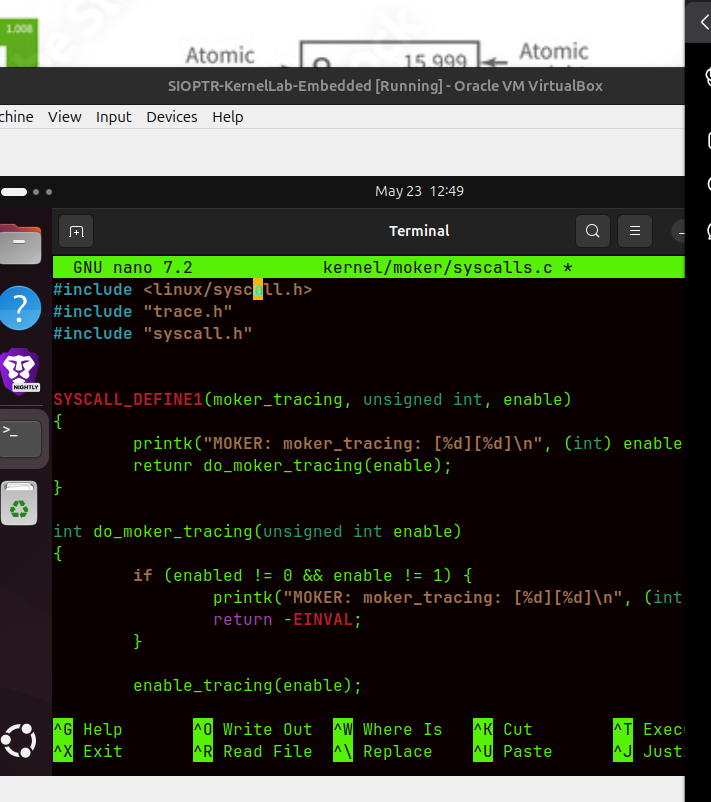

Objetivo

Localizar exatamente onde está a tua implementação do tracing antes de adicionarmos o mecanismo enabled.

O TT7, pela imagem, quer isto:

syscall enable/disable
        ↓
variável global enabled
        ↓
moker_trace(...) só grava se enabled == 1
Como pensar

Antes de criar syscall, precisamos saber onde está o estado do tracing. A pergunta técnica é:

O tracing pertence ao scheduler?
Ou pertence ao módulo/ficheiro próprio moker trace?

Se trace.c já existe, o sítio natural para a variável é lá:

unsigned int enabled = 0;

e a função moker_trace(...) passa a ter uma guarda:

if (enabled) {
    ...
}

Isto separa bem responsabilidades:

scheduler chama moker_trace()
trace.c decide se grava ou ignora

## Ação (1 passo)

Adiciona a variável global logo depois da linha:

```c id="902pqm"
struct trace_evt_buffer trace;
```

ficando assim:

```c id="3ys3aa"
struct trace_evt_buffer trace;

unsigned int enabled = 0;
```

## Objetivo

Criar o estado global que controla o tracing:

```text id="bzi7g1"
enabled = 0  → tracing desligado
enabled = 1  → tracing ligado
```

Isto é exatamente a base do TT7: o kernel passa a ter uma “chave” para decidir se grava eventos no ring buffer ou ignora.

## Como pensar

A variável deve estar no mesmo ficheiro que gere o buffer, porque ela controla a política de gravação:

```text id="yxlc9c"
trace.c
 ├── buffer
 ├── enqueue/dequeue
 ├── conversão de eventos
 └── enabled
```

Ainda **não** estamos a criar a syscall. Primeiro damos ao tracing um estado interno.

## Pitfalls & troubleshooting

* Não coloques `enabled` dentro de uma função; tem de ser global.
* Não escrevas `unsigned int enable`; o PDF usa `enabled`.
* Não uses `static` ainda se a syscall precisar aceder a esta variável a partir de outro ficheiro.
* Mantém o valor inicial `0` para o sistema arrancar com tracing desligado.

## Alternativas / tradeoffs

| Opção                              |                       Vantagem |                                         Risco |
| ---------------------------------- | -----------------------------: | --------------------------------------------: |
| `unsigned int enabled = 0;`        | Simples, acessível por syscall |                                Global exposta |
| `static unsigned int enabled = 0;` |               Mais encapsulado | Syscall noutro ficheiro não acede diretamente |
| Função `moker_set_enabled()`       |                     Mais limpo |                        Requer mais alterações |

## Pergunta de decisão

Consegues encontrar no topo do ficheiro a linha `struct trace_evt_buffer trace;`?


---


## Ação (1 passo)

Sai desse ficheiro **sem gravar**:

```text
Ctrl + X
```

Estás em:

```text
kernel/moker/trace.h
```

Mas a variável `enabled` deve ser adicionada no ficheiro:

```text
kernel/moker/trace.c
```

Depois de sair, abre o ficheiro certo:

```bash
nano kernel/moker/trace.c
```

## Objetivo

Reorientar: neste momento estamos no **início do TT7**, ponto **“Enabling and disabling MOKER_TRACING mechanism”**.

O objetivo desta fase é só criar a variável de controlo:

```c
unsigned int enabled = 0;
```

Ainda **não** estamos na syscall.

## Como pensar

Tens dois ficheiros:

| Ficheiro  | Função                                                  |
| --------- | ------------------------------------------------------- |
| `trace.h` | declarações, `#define`, `enum`, `struct`                |
| `trace.c` | implementação real, buffer, funções, lógica de gravação |

A variável global que controla se o trace grava ou não deve ir no `.c`, porque é estado interno de execução.

## Pitfalls & troubleshooting

* Estavas no `.h`, por isso o `struct trace_evt_buffer trace;` não apareceu.
* Não graves alterações no `.h` agora.
* Não procures com aspas completas no nano; basta procurar `trace_evt_buffer`.
* Não continues para syscall antes de o `enabled` existir.

## Pergunta de decisão

Depois de abrir `kernel/moker/trace.c`, consegues ver no topo a linha `struct trace_evt_buffer trace;`?


---
## Ação (1 passo)

Corrige isso: **não podes pôr `if (enabled)` dentro da própria função `enqueue()` chamando `enqueue()` outra vez**. Isso cria recursão infinita.

Dentro de `enqueue(...)`, deve ficar assim:

```c
static int enqueue(enum evt event, unsigned long long time, int number, struct task_struct *p)
{
    int ret = 0;

    if (!enabled)
        return ret;

    spin_lock(&trace.lock);

    if (is_full(trace.read_item, trace.write_item))
        increment(&trace.read_item);

    trace.events[trace.write_item].number = number;
    trace.events[trace.write_item].event = event;
    trace.events[trace.write_item].time = time;
    strncpy(trace.events[trace.write_item].comm, p->comm, TRACE_TASK_COMM_LEN);

    increment(&trace.write_item);

    spin_unlock(&trace.lock);

    return ret;
}
```

Ou seja: remove isto que puseste:

```c
if (enabled) {
    time = ktime_to_nd(ktime_get());
    enqueue(event, time, number, p);
}
```

## Objetivo

A função `enqueue()` é a função que **grava no ring buffer**. Então ela própria deve decidir:

```text
enabled == 0 → sai logo, não grava nada
enabled == 1 → continua e grava normalmente
```

## Como pensar

Estavas a fazer isto:

```text
enqueue()
   └── if enabled
          └── chama enqueue()
                 └── if enabled
                        └── chama enqueue()
                               ...
```

Isto é recursão infinita no kernel. Mau. 💥

O correto é:

```text
enqueue()
   └── if !enabled
          └── return
   └── spin_lock
   └── grava evento
   └── spin_unlock
```

## Sobre o `enabled = 1`

Sim, a ideia final é essa, mas **não manualmente no código**.

Agora tens:

```c
unsigned int enabled = 0;
```

Depois, no TT7, vais criar uma **system call** para mudar isto em runtime:

```text
syscall(0) → enabled = 0 → tracing OFF
syscall(1) → enabled = 1 → tracing ON
```

Portanto sim: ainda estás no **ponto 2** do TT7 — mecanismo de enable/disable. A syscall vem a seguir.

## Pitfalls & troubleshooting

* `ktime_to_nd` está errado; o correto normalmente é `ktime_to_ns`.
* Não chamar `enqueue()` dentro de `enqueue()`.
* O `if (!enabled) return ret;` deve vir **antes** do `spin_lock`.
* Se deres `return` depois do `spin_lock` sem `spin_unlock`, podes bloquear o kernel.

## Pergunta de decisão

Consegues agora remover esse bloco errado e deixar apenas o `if (!enabled) return ret;` no início da função `enqueue()`?


---

NO ponto 2 tem duas partes:

        2.1 Criar variavel enabled
        2.2 Criar funcao para mudar enabled

ja fizemos a parte 2.1

        unsigned int enabled = 0;

e corrigimos a logica do enqueue()

        if (!enabled)
                retunr ret;

isto significa:

        enabled = 0 -> enqueue sai logo -? nao grava trace
        enabled = 1 -? enquanto continua -> grava trace. 

- O "outro passo" do PDF e criar uma funcao publica para mudar o valor de enablesd

        void enable_tracing(unsigned int x)
        {
                enabled = 0;
        }

        A cadeia final fica assim:

                syscall do utilizador
                 
                enable_tracing (0 ou 1)

                enable muda

                enqueue grava ou ignora eventos

        Ainda em kernel/moker/trace.c, adiciona esta função fora de enqueue(), logo depois do fim da função enqueue():

void enable_tracing(unsigned int x)
{
    enabled = x;
}

###

A syscall ainda virá depois. Primeiro precisamos que a variável tenha efeito real.

A lógica fica:

scheduler event
     ↓
função trace
     ↓
enabled?
   no  → ignora
   yes → grava timestamp + evento + task

###

# ERRO

## Ação (1 passo)

Corrige essa linha: apagaste o protótipo/assinatura da função. Deve ficar assim:

```c
void enable_tracing(unsigned int x)
{
    enabled = x;
}
```

No teu ecrã está assim, incompleto:

```c
enable_tracing();
```

Isso **não serve**: falta o tipo de retorno, o argumento e o corpo da função.

## Objetivo

Criar a função que a syscall vai chamar para mudar o estado do tracing:

```text
enable_tracing(0) → tracing OFF
enable_tracing(1) → tracing ON
```

## Como pensar

Estamos nesta arquitetura:

```text
trace.c
 ├── unsigned int enabled = 0;
 ├── enqueue(...)
 │    └── if (!enabled) return;
 └── enable_tracing(unsigned int x)
      └── enabled = x;
```

Ou seja, `enqueue()` consulta o estado; `enable_tracing()` altera o estado.

## Pitfalls & troubleshooting

* Não deixes `enable_tracing();` sozinho.
* A função tem de ficar **fora** de `enqueue()` e antes ou depois de `trace_read()` tanto faz.
* Não uses `static`.
* O argumento deve ser `unsigned int x`, como no enunciado.

## Pergunta de decisão

Consegues substituir essa linha por esta função completa?
---

## Ação (1 passo)

Abre o header:

```bash id="4vusgu"
nano kernel/moker/trace.h
```

e adiciona este protótipo antes do `#endif` final:

```c id="edp1ez"
void enable_tracing(unsigned int x);
```

## Objetivo

Permitir que outros ficheiros do kernel chamem a função que criaste em `trace.c`.

A ligação fica:

```text id="jrx3fi"
trace.c
 └── implementa enable_tracing(...)

trace.h
 └── declara enable_tracing(...)
```

Depois a syscall poderá fazer:

```c id="zn0uie"
enable_tracing(x);
```

## Como pensar

Em C, quando uma função é usada noutro ficheiro, normalmente precisas de duas coisas:

```text id="4kxeu8"
.c → código real da função
.h → protótipo visível para outros ficheiros
```

O TT7 está a preparar esta cadeia:

```text id="w2k8gh"
system call
   ↓
enable_tracing(x)
   ↓
enabled = x
   ↓
enqueue grava ou ignora
```

## Pitfalls & troubleshooting

* Não alteres os `#define`.
* Não mexas no `enum`.
* Não cries outra variável `enabled` no `.h`.
* O protótipo deve terminar com `;`.

## Pergunta de decisão

Consegues ver o `#endif` final no `trace.h` para pôr o protótipo imediatamente antes dele?


---

# Explicacao

- O que e uma system call?

        Uma *system call* e uma porta controlada entre:

        programa em user space (acesso through system call ao hardware)

        kernel space 

- Um programa normal nao pode mexer diretamente no kernel. Entao pede ao kerne; para fazer

- Exemplos classicos:

        open() -> pedir ao kernel para abrir o ficheiro 
        open()   → pedir ao kernel para abrir ficheiro
        read()   → pedir ao kernel para ler dados
        write()  → pedir ao kernel para escrever dados
        fork()   → pedir ao kernel para criar processo


No teu TT7, queremos criar uma nova syscall para controlar isto:

tracing OFF / ON

Ou seja:

programa do utilizador
        ↓ syscall nova
kernel
        ↓ enable_tracing(x)
enabled = x
Para que serve neste TT7?

Serve para ligares/desligares o MOKER tracing sem recompilar o kernel e sem editar código à mão.

A ideia final é:

syscall(1) → enabled = 1 → começa a gravar eventos
syscall(0) → enabled = 0 → para de gravar eventos

Antes do TT7, o tracing era praticamente fixo no código. Agora passa a ser controlável em runtime.

Ação (1 passo)

Mostra a página seguinte do PDF, onde começa a parte da syscall. Quero ver exatamente que ficheiro o professor manda editar primeiro.

Objetivo

Não assumir o caminho da syscall, porque em Linux isso depende da arquitetura e da versão do kernel. Normalmente envolve ficheiros como:

kernel/sys.c
include/linux/syscalls.h
arch/x86/entry/syscalls/syscall_64.tbl

mas devemos seguir o TT7.

---

        . system call mal resgitada pode compilar mas nao funcionar
        > numero de syscall duplicado da conflito
        > prototipo errado pode dar erro de compilacao
        > funcao de syscall deve validar o argumento: normalmente aceitar so 0 e 1.


---

# 4  IMplementing the system call

ou seja terei de criar ficheiro novo syscall.h no diretorio MOKER

        nano kernel/moker/syscalls.h

e coloca isto

        #ifndef __SYSCALLS_H_
        #define __SYSCALLS_H_

        int do_moker_tracing(unsigned int enable);

        #endif

# Objetivo 

Declarar a funcao interna que vai implementar a logica da syscall:

        do_moker_tracing(enable)

        enable_tracing(enable)

        enabled = enable

# Como pensar

implementing the System call

quer o pdf criar dois ficheiros novos:

| Ficheiro                  | Função                              |
| ------------------------- | ----------------------------------- |
| `kernel/moker/syscalls.h` | declara as funções syscall MOKER    |
| `kernel/moker/syscalls.c` | implementa as funções syscall MOKER |


A syscall publica vai chamar uma funcao interna. Essa funcao interna depois chama o mecanismo que ja criaste

        syscall pública
        ↓
        do_moker_tracing(enable)
        ↓
        enable_tracing(enable)
        ↓
        enabled = enable


## Ação (1 passo)

Cria agora o ficheiro `syscalls.c`:

```bash
nano kernel/moker/syscalls.c
```

e coloca isto:

```c
#include <linux/syscalls.h>
#include "trace.h"

SYSCALL_DEFINE1(moker_tracing, unsigned int, enable)
{
    printk("MOKER: moker_tracing: [%d][%d]\n", (int) enable, current->pid);
    return do_moker_tracing(enable);
}

int do_moker_tracing(unsigned int enable)
{
    if (enable != 0 && enable != 1) {
        printk("MOKER: moker_tracing: [%d][%d]\n", (int) enable, current->pid);
        return -EINVAL;
    }

    enable_tracing(enable);
    return 0;
}
```

Depois grava e sai:

```text
Ctrl + O
Enter
Ctrl + X
```

## Objetivo

Criar a implementação real da syscall:

```text
moker_tracing(enable)
        ↓
do_moker_tracing(enable)
        ↓
enable_tracing(enable)
        ↓
enabled = enable
```

## Como pensar

Tens agora três níveis:

| Nível                                 | Função                    |
| ------------------------------------- | ------------------------- |
| `SYSCALL_DEFINE1(moker_tracing, ...)` | entrada oficial no kernel |
| `do_moker_tracing(enable)`            | valida argumento          |
| `enable_tracing(enable)`              | muda o estado do tracing  |

O `enable` deve ser só:

```text
0 → OFF
1 → ON
```

## Pitfalls & troubleshooting

* O PDF pode escrever `#include "syscalls.h"` também; se der erro depois, adicionamos.
* `-EINVAL` precisa dos headers do kernel; normalmente já vem disponível.
* Não uses `printf`; no kernel é `printk`.
* Não chames `enabled = enable` diretamente aqui; usa `enable_tracing(enable)`.

## Pergunta de decisão

Conseguiste criar e gravar `kernel/moker/syscalls.c`?


---


# SYSCALLS

A estrutura é:

SYSCALL_DEFINE1(nome_da_syscall, tipo_arg1, nome_arg1)

No teu caso:

nome_da_syscall → moker_tracing
tipo_arg1       → unsigned int
nome_arg1       → enable

---

## Ação (1 passo)

Antes de gravar, adiciona este include no topo do `syscalls.c`:

```c
#include "syscalls.h"
```

Fica assim:

```c
#include <linux/syscalls.h>
#include "trace.h"
#include "syscalls.h"
```

Depois grava e sai:

```text
Ctrl + O
Enter
Ctrl + X
```

## Objetivo

Garantir que `do_moker_tracing(...)` está declarado antes/consistentemente com a implementação.

O teu `syscalls.h` já tem:

```c
int do_moker_tracing(unsigned int enable);
```

Logo o `.c` deve incluir esse header.

## Como pensar

Neste ponto tens:

```text
syscalls.h  → protótipo de do_moker_tracing()
syscalls.c  → SYSCALL_DEFINE1 + implementação
trace.h     → protótipo de enable_tracing()
trace.c     → implementação + enabled
```

A cadeia está a ficar limpa:

```text
moker_tracing(enable)
        ↓
do_moker_tracing(enable)
        ↓
enable_tracing(enable)
        ↓
enabled = enable
```

## Pitfalls & troubleshooting

* Não removas `#include <linux/syscalls.h>`.
* Não removas `#include "trace.h"`, porque precisas de `enable_tracing(...)`.
* Se o `printk` estiver cortado visualmente por causa do ecrã, não é problema; só importa se a linha está completa.
* Depois disto ainda falta incluir `syscalls.o` no `Makefile`.

## Pergunta de decisão

Conseguiste gravar e sair do `syscalls.c`?





---

## Ação (1 passo)

Abre o `Makefile` do diretório MOKER:

```bash
nano kernel/moker/Makefile
```

e adiciona esta linha:

```make
obj-y += syscalls.o
```

Deve ficar parecido com o que o PDF mostra:

```make
obj-$(CONFIG_MOKER_TRACING) += trace.o

obj-y += syscalls.o
```

## Objetivo

Dizer ao sistema de compilação do kernel para incluir o novo ficheiro:

```text
kernel/moker/syscalls.c
        ↓
syscalls.o
        ↓
incluído no kernel
```

Sem isto, o ficheiro existe, mas **não é compilado**.

## Como pensar

Criar ficheiro `.c` não basta em kernel development. O build system só compila aquilo que aparece nos `Makefile/Kbuild`.

Até agora tens:

```text
trace.c       → já era compilado
syscalls.c    → novo, ainda precisa entrar no Makefile
```

## Pitfalls & troubleshooting

* O ficheiro é `kernel/moker/Makefile`, não o `Makefile` da raiz do kernel.
* Usa `obj-y += syscalls.o`, não `syscalls.c`.
* Não apagues a linha do `trace.o`.
* Guarda e sai antes do próximo passo.

## Pergunta de decisão

Conseguiste adicionar `obj-y += syscalls.o` ao `kernel/moker/Makefile`?
