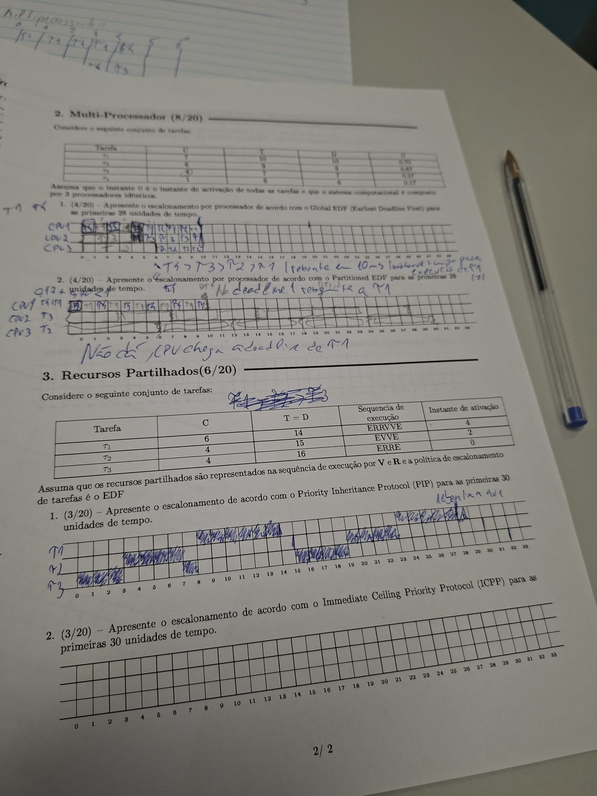

####################################################


# IDEIAS IMPORTANTES

O período T conta desde o release anterior da tarefa, não desde quando ela acabou de executar.

| Conceito              | Significa                                                |
| --------------------- | -------------------------------------------------------- |
| **release / chegada** | instante em que uma nova instância da tarefa fica pronta |
| **execução**          | quando o CPU escolhe essa tarefa para correr             |

---

# Como pensar 

tarefga t3

    t3: C = 1, T = 12, D = 7

O periodo e T = 12

Se a primeira instancia de t3 aparece em t = 0, entao os releases sao:

    t3 releases: 0, 12, 24, 36, ...

Nao interessa se t3 executou em 14-15
Essa exexucao 14-15 era a uinstancia que foi libertada em t = 12.

Logo a proxima instancia aparece em :

    12 + 12 = 24

nao em

    14 + 12 = 26

# o periodo e entre chegadas / releases, nao entre execucoes


---


Agora a tua dúvida sobre τ2:

τ2: C = 3, T = 10

τ2 aparece em:

τ2 releases: 0, 10, 20, 30, ...

A primeira τ2 executou em 2–5, mas isso não desloca a próxima chegada.

A segunda τ2 aparece em:

0 + 10 = 10

não em:

2 + 10 = 12

Porque 2 foi quando ela começou a executar, não quando foi libertada.


---

# Regra mental para o teste

Para cada tarefa periodica

    release times = 0, T, 2T, 3T, 4T,...

exemplo completo , tenho de fazer isto sempre

| Tarefa |  T | Releases      |
| ------ | -: | ------------- |
| τ1     |  9 | 0, 9, 18, 27  |
| τ2     | 10 | 0, 10, 20, 30 |
| τ3     | 12 | 0, 12, 24, 36 |

O CPU depois decide quando executar cada uma, conforme a politica: RM, DM, EDF, etc
---


CORRECCAO DO CHAT GPT


Vamos comecar pelo exercicio 1- Prioridades Estaticas, porque e a base para o resto: RM, DM, EDF, multiprocessador e recursos partilhados. A cadeira avalia precisamente escalonamento e mecanismos de tempo-real, e o PL1 tambem comeca por scheduling/syncronization. 

---


# Objetivo

Perceberes como definir prioridades fizas sem te confundires com deadlines dinamicos. 

o teste da:

| Tarefa |  C |  T |  D |
| ------ | -: | -: | -: |
| τ1     |  2 |  9 |  9 |
| τ2     |  3 | 10 |  8 |
| τ3     |  1 | 12 |  7 |

---

# Como pensar 

*RM - Rate Monotonic*

Em RM, a prioridade vem do periodo T. 

Menor T => maior prioridade

| Tarefa |  T | Prioridade RM |

Vamos comecar pelo exercicio 1- Prioridades Estaticas, porque e a base para o resto: RM, DM, EDF, multiprocessador e recursos partilhados. A cadeira avalia precisamente escalonamento e mecanismos de tempo-real, e o PL1 tambem comeca por scheduling/syncronization. 

---


# Objetivo

Perceberes como definir prioridades fizas sem te confundires com deadlines dinamicos. 

o teste da:

| Tarefa |  C |  T |  D |
| ------ | -: | -: | -: |
| ------ | -: | ------------- |
| τ1     |  9 | mais alta     |
| τ2     | 10 | média         |
| τ3     | 12 | mais baixa    |

Logo :

    RM: t1 > t2 > t3

Escalonamento correto nos primeiros 27 tempos

---
# DEADLINE MONOTONIC (a deadline define prioridades)


## Ação — 1 passo

Faz agora **só o bloco DM de `t = 9` até `t = 18`**.

Releases relevantes:

```text
t = 9   → τ1
t = 10  → τ2
t = 12  → τ3
```

Prioridades DM continuam fixas:

```text
τ3 > τ2 > τ1
```

Timeline do bloco:

```text
9–10    τ1
10–12   τ2
12–13   τ3
13–14   τ2
14–15   τ1
15–18   idle
```

---

## Objetivo

Perceber a primeira situação importante: **preempção por chegada de tarefa com prioridade maior**.

---

## Como pensar

Em `t = 9`, só chega τ1.

```text
τ1 precisa de C1 = 2
```

Então começa:

```text
9–10 τ1
```

Mas em `t = 10`, chega τ2.

Como em DM:

```text
τ2 > τ1
```

τ2 interrompe τ1.

τ1 ainda tinha executado só 1 unidade de tempo:

```text
τ1: precisava 2, executou 1, falta 1
```

Então:

```text
10–12 τ2
```

Em `t = 12`, chega τ3.

Como:

```text
τ3 > τ2 > τ1
```

τ3 interrompe τ2.

τ2 tinha executado de `10–12`, ou seja,

Prioridades DM continuam fixas:

```text
τ3 > τ2 > τ1
```

Timeline do bloco:

```text
9–10    τ1
10–12   τ2
12–13   τ3
13–14   τ2
14–15   τ1
15–18   idle
``` 2 unidades:

```text
τ2: precisava 3, executou 2, falta 1
```

τ3 executa:

```text
12–13 τ3
```

Depois τ3 termina. Quem está pronto?

```text
τ2 falta 1
τ1 falta 1
```

Como τ2 tem maior prioridade:

```text
13–14 τ2
```

Depois sobra τ1:

```text
14–15 τ1
```

Depois não há mais jobs até `t = 18`:

```text
15–18 idle
```

---

## Pitfalls & troubleshooting

1. **Em `t = 10`, τ1 não desaparece**
   Fica suspensa com execução restante.

2. **Em `t = 12`, τ2 também não desaparece**
   Fica suspensa com 1 unidade por executar.

3. **Depois de τ3 terminar, não voltas automaticamente para τ1**
   Escolhes sempre a tarefa pronta com maior prioridade: aqui é τ2.

4. **Idle só depois de todas as tarefas prontas acabarem**
   Aqui só aparece em `15–18`.

---

## Alternativas / tradeoffs

Podes controlar o bloco com uma mini-tabela de execução restante:

| Tempo | Evento     | τ1 restante | τ2 restante | τ3 restante | Executa |
| ----: | ---------- | ----------: | ----------: | ----------: | ------- |
|     9 | release τ1 |           2 |           0 |           0 | τ1      |
|    10 | release τ2 |           1 |           3 |           0 | τ2      |
|    12 | release τ3 |           1 |           1 |           1 | τ3      |
|    13 | τ3 termina |           1 |           1 |           0 | τ2      |
|    14 | τ2 termina |           1 |           0 |           0 | τ1      |
|    15 | τ1 termina |           0 |           0 |           0 | idle    |

---


14–15   τ1
15–18   idle
2 unidades:
---

| Política | Prioridade depende de         | Tipo     |
| -------- | ----------------------------- | -------- |
| RM       | Período `T`                   | fixa     |
| DM       | Deadline relativo `D`         | fixa     |
| EDF      | Deadline absoluto de cada job | dinâmica |

---

# DM (deadline Monotonic)

Em t = 0 chegam todas:

t = 0: τ1, τ2, τ3

Prioridades em DM:

τ3 > τ2 > τ1

porque

| Tarefa |  D | Prioridade DM |
| ------ | -: | ------------- |
| τ3     |  7 | maior         |
| τ2     |  8 | média         |
| τ1     |  9 | menor         |


Agora executamos:

0–1   τ3
1–4   τ2
4–6   τ1
6–9   idle

Porquê?

| Intervalo | Escolha | Razão                                                |
| --------- | ------- | ---------------------------------------------------- |
| `0–1`     | τ3      | maior prioridade, `C3 = 1`                           |
| `1–4`     | τ2      | τ3 terminou; τ2 tem prioridade acima de τ1, `C2 = 3` |
| `4–6`     | τ1      | só falta τ1, `C1 = 2`                                |
| `6–9`     | idle    | nenhum job pronto até novo release em `t = 9`        |


# Objectivo

Fixar a mecanica de DM preemptivo:

    Quando ha varios jobs prontos, escolhes o job da tarefa com menor deadline relativo D.

Neste bloco nao ha preempcao, porque depois de t = 0 so volta a haver release em t = 9

---

# Como pensar

A tua pergunta crítica é muito boa.

Devo fazer tabela de releases e deadlines em todos os exercícios?

Depende do algoritmo

| Algoritmo                             | Tabela de releases | Tabela de deadlines absolutos |
| ------------------------------------- | ------------------ | ----------------------------- |
| **RM**                                | sim                | opcional                      |
| **DM**                                | sim                | opcional                      |
| **EDF**                               | sim                | sim, quase obrigatório        |
| **Multiprocessador EDF**              | sim                | sim                           |
| **Recursos partilhados / PIP / ICPP** | sim                | depende, mas ajuda            |

Para DM, a prioridade vem do deadlines absolutos para escolher prioridade. 

Mas para verificar se falhou deadline, podes calcular:

    deadline absoluto = release + D

No bloco 0 - 9:

| Job  | Release | D relativo | Deadline absoluto | Termina | Cumpre? |
| ---- | ------: | ---------: | ----------------: | ------: | ------- |
| τ3,1 |       0 |          7 |                 7 |       1 | sim     |
| τ2,1 |       0 |          8 |                 8 |       4 | sim     |
| τ1,1 |       0 |          9 |                 9 |       6 | sim     |


----
Para o teste, tens duas abordagens:

| Abordagem                                                               | Melhor quando                               |
| ----------------------------------------------------------------------- | ------------------------------------------- |
| **Tabela mínima**: releases + prioridades                               | RM/DM simples                               |
| **Tabela completa**: releases + deadlines absolutos + execução restante | EDF, multiprocessador, recursos partilhados |
---


# Para ti, neste momento, eu usaria sempre a tabela completa até ficares automático. Depois reduzes.

---
---


# Queres que avances tu agora o bloco 18–27 e eu corrijo, ou queres que eu guie esse bloco contigo?
---
    18-20 = t1 | 20-23 = t2 | 23-24 = IDLE | 24 -25 = T3 | 25 - 27 = IDLE |

Ação — 1 passo

Valida o teu bloco 18–27: está correto ✅

18–20   τ1
20–23   τ2
23–24   idle
24–25   τ3
25–27   idle


podes escrever a solucao DM completa assim 

``` 


0–1     τ3
1–4     τ2
4–6     τ1
6–9     idle
9–10    τ1
10–12   τ2
12–13   τ3
13–14   τ2
14–15   τ1
15–18   idle
18–20   τ1
20–23   τ2
23–24   idle
24–25   τ3
25–27   idle

```


#######################################

correcao do stor

X          = tarefa a executar
● preto    = fim/completion do job
linha grossa vertical = release/ativação

###################################################

# RESPOSTAS 

## Ação — 1 passo

Faz o teu caderno com **duas grelhas visuais**: uma para **RM** e outra para **DM**.

---

# Exercício 1 — Rate Monotonic

## Regra

```text
RM → menor período T → maior prioridade
```

| Tarefa |  C |  T |  D | Prioridade RM |
| ------ | -: | -: | -: | ------------- |
| τ1     |  2 |  9 |  9 | 1ª            |
| τ2     |  3 | 10 |  8 | 2ª            |
| τ3     |  1 | 12 |  7 | 3ª            |

Logo:

```text
τ1 > τ2 > τ3
```

---

## Releases

```text
τ1: 0, 9, 18, 27
τ2: 0, 10, 20, 30
τ3: 0, 12, 24
```

---

## Timeline RM

```text
Tempo:  0 1 2 3 4 5 6 7 8 9 10 11 12 13 14 15 16 17 18 19 20 21 22 23 24 25 26 27
τ1:     X X . . . . . . . X X  .  .  .  .  .  .  .  X  X  .  .  .  .  .  .  .  |
τ2:     . . X X X . . . . . .  X  X  X  .  .  .  .  .  .  X  X  X  .  .  .  .  .
τ3:     . . . . . X . . . . .  .  .  .  X  .  .  .  .  .  .  .  .  .  X  .  .  .
CPU:    τ1τ1τ2τ2τ2τ3 - - - τ1τ1 τ2 τ2 τ2 τ3 - - - τ1 τ1 τ2 τ2 τ2 - τ3 - - -
```

---

## Resposta RM em blocos

```text
0–2     τ1
2–5     τ2
5–6     τ3
6–9     idle

9–11    τ1
11–14   τ2
14–15   τ3
15–18   idle

18–20   τ1
20–23   τ2
23–24   idle
24–25   τ3
25–27   idle
```

---

# Exercício 2 — Deadline Monotonic

## Regra

```text
DM → menor deadline relativo D → maior prioridade
```

| Tarefa |  C |  T |  D | Prioridade DM |
| ------ | -: | -: | -: | ------------- |
| τ1     |  2 |  9 |  9 | 3ª            |
| τ2     |  3 | 10 |  8 | 2ª            |
| τ3     |  1 | 12 |  7 | 1ª            |

Logo:

```text
τ3 > τ2 > τ1
```

---

## Releases

```text
τ1: 0, 9, 18, 27
τ2: 0, 10, 20, 30
τ3: 0, 12, 24
```

---

## Timeline DM

```text
Tempo:  0 1 2 3 4 5 6 7 8 9 10 11 12 13 14 15 16 17 18 19 20 21 22 23 24 25 26 27
τ1:     . . . . X X . . . X .  .  .  .  X  .  .  .  X  X  .  .  .  .  .  .  .  |
τ2:     . X X X . . . . . . X  X  .  X  .  .  .  .  .  .  X  X  X  .  .  .  .  .
τ3:     X . . . . . . . . . .  .  X  .  .  .  .  .  .  .  .  .  .  .  X  .  .  .
CPU:    τ3τ2τ2τ2τ1τ1 - - - τ1τ2 τ2 τ3 τ2 τ1 - - - τ1 τ1 τ2 τ2 τ2 - τ3 - - -
```

---

## Resposta DM em blocos

```text
0–1     τ3
1–4     τ2
4–6     τ1
6–9     idle

9–10    τ1
10–12   τ2
12–13   τ3
13–14   τ2
14–15   τ1
15–18   idle

18–20   τ1
20–23   τ2
23–24   idle
24–25   τ3
25–27   idle
```

---

## Parágrafo pequeno para o caderno

Em tarefas periódicas, o período `T` define as ativações: `0, T, 2T, 3T...`; não se conta a partir do fim da execução. Em **Rate Monotonic**, a prioridade é fixa e depende do período: menor `T` significa maior prioridade. Em **Deadline Monotonic**, a prioridade também é fixa, mas depende do deadline relativo: menor `D` significa maior prioridade. Primeiro faço a tabela de releases, depois a ordem de prioridade, e só depois desenho o escalonamento. Um `X` representa execução; uma marca vertical representa release; um ponto preto representa fim do job.

---

## Pitfalls & troubleshooting

1. Em RM, **não uses D** para prioridade.
2. Em DM, **não uses T** para prioridade.
3. O release de uma tarefa não depende de quando ela executou.
4. Uma chegada nova só causa preempção se tiver prioridade maior.

---

## Pergunta de decisão

Queres que eu agora faça o mesmo formato visual para o **Exercício 2/seguinte do teste**, provavelmente com **EDF**?


---

# Pergunta 2

    Considera o seguinte conjundo de tarefas periodicas.
    E escalonavel com EDF preemptivo ?
    Representa a execucao nos primeiros 20 ms. 

1. Em EDF, a prioridade e fixa ou dinamica ?
2. Para escolher a proxima tarefa, uso T, D relativo ou deadline absoluto ? 


