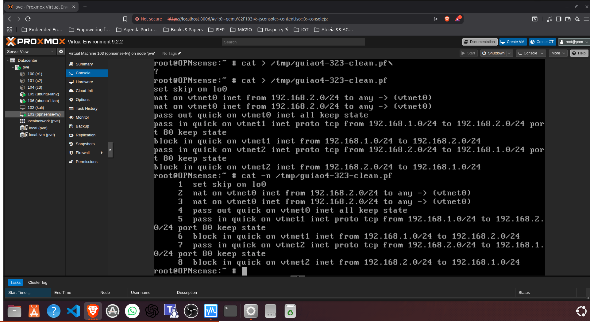
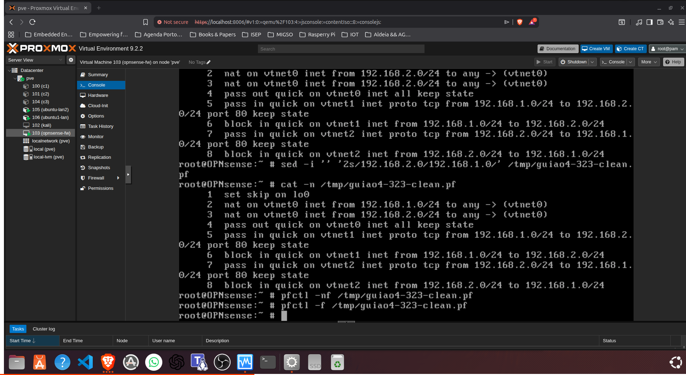

Tu já provaste isto antes do crash:

ubuntu1-lan -> ubuntu2-lan2
ping OK
wget OK

ubuntu2-lan2 -> ubuntu1-lan
ping OK
wget OK

Portanto a parte 3.2.1 e 3.2.2 está feita em termos de evidência.

O que faltava começar era:

3.2.3 -> permitir só HTTP entre máquinas, bloquear o resto, manter Internet
3.3   -> NAT
3.4   -> DNS forcing

O último comando grande que te dei era para a 3.2.3, mas como ainda não escreveste nada dele, não perdeste nada crítico.

Estado do 3.2.3

Sim — para a direção ubuntu1 → ubuntu2, está feito. ✅

Tu provaste isto:

    Teste	Resultado	Interpretação
    wget http://192.168.2.100/index.html	200 OK	HTTP porta 80 permitido
    ping -c 4 192.168.2.100	100% packet loss	ICMP bloqueado

Isto bate certo com o objetivo:

permitir carregar a página index.html, mas bloquear outro tráfego entre as LANs.

----

Ação — 1 passo agora

Agora testa o sentido contrário, no ubuntu-lan2 / container 105:

wget -O - http://192.168.1.182/index.html
Objetivo

Confirmar se o 3.2.3 também está cumprido para:

ubuntu2 → ubuntu1

Porque o guião fala das duas situações anteriores:

3.2.1 ubuntu1 → ubuntu2
3.2.2 ubuntu2 → ubuntu1
3.2.3 nas situações em que seja possível carregar a página...
Como pensar

A tua regra atual está sobretudo em vtnet1, ou seja, filtra tráfego que entra pela LAN1.

Mas o tráfego ubuntu2 → ubuntu1 entra na OPNsense por:

vtnet2

Logo ainda precisamos verificar se essa direção está controlada ou não.

---

regra nova 

vtnet1: LAN1 → LAN2 porta 80 permitido
vtnet2: LAN2 → LAN1 porta 80 permitido
resto entre LANs bloqueado

---

ubuntu1 → ubuntu2 : só HTTP permitido
ubuntu2 → ubuntu1 : só HTTP permitido
resto entre LANs : bloqueado
internet : continua permitida por NAT

---

Sim — isso prova HTTP ubuntu1 → ubuntu2 ✅

No terminal do ubuntu1-lan, fizeste:

wget -T 5 ... http://192.168.2.100/index.html

E recebeste:

HTTP request sent, awaiting response... 200 OK

Isto prova:

ubuntu1-lan 192.168.1.182
        ↓ HTTP / TCP porta 80
OPNsense
        ↓
ubuntu-lan2 192.168.2.100

Ou seja: o acesso web entre as duas LANs está permitido.

---

Ação — 1 passo agora

Ainda no ubuntu1-lan, confirma que o resto está bloqueado:

ping -c 4 192.168.2.100
Objetivo

Completar a prova do 3.2.3:

HTTP funciona
ICMP/ping não funciona

Eu criei uma política de acesso seletiva entre redes. Permiti apenas tráfego web para a porta 80 e bloqueei outro tráfego entre as LANs, como ICMP.