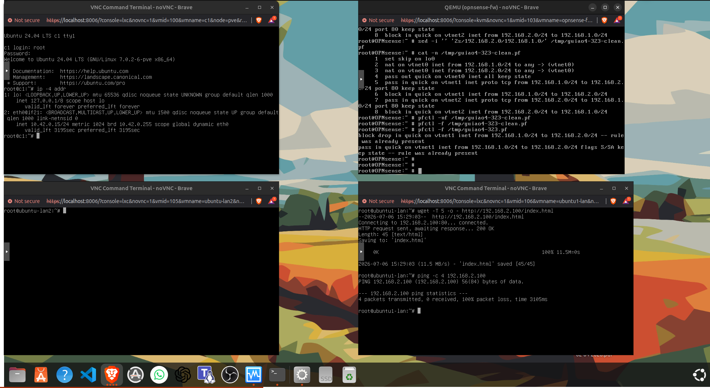
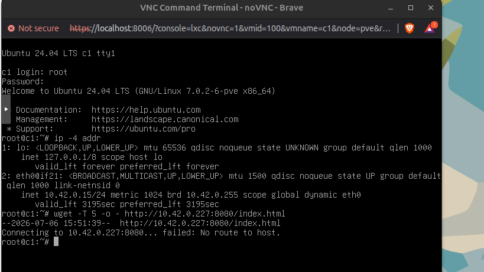
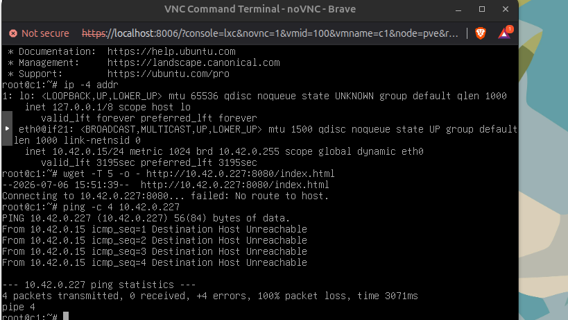
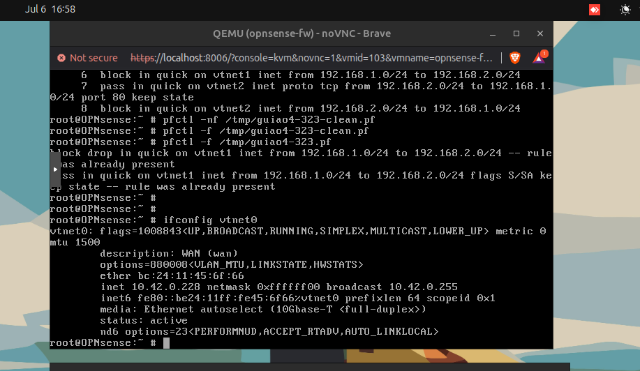
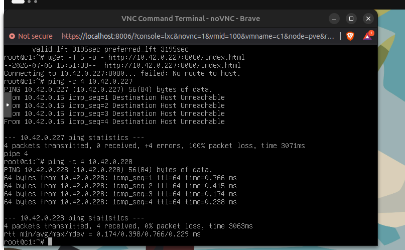
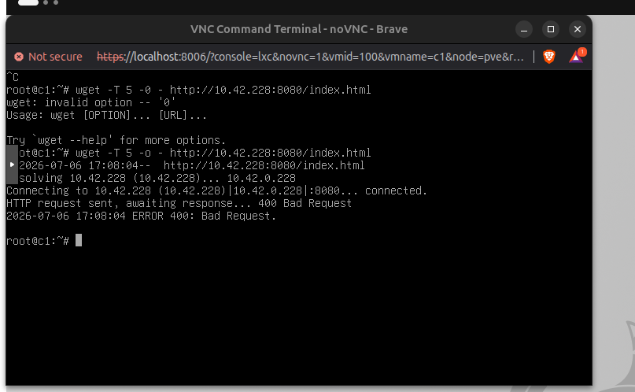
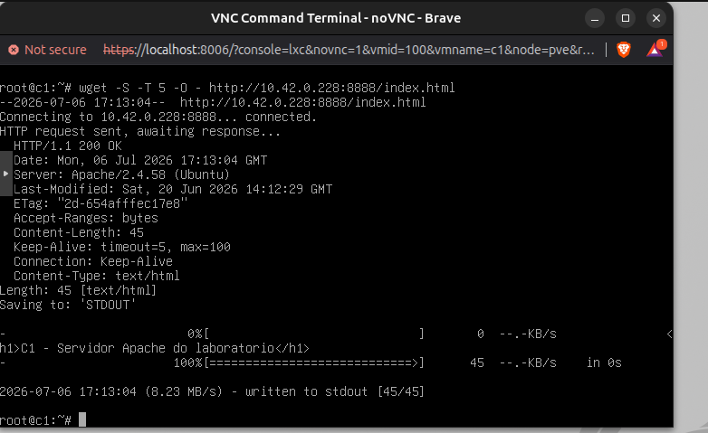

Agora escolhe o container que vais pôr na WAN. Provavelmente pode ser o CT 100 c1 ou outro Ubuntu.

No container escolhido, corre só:

ip -4 addr

# ESCOLHI O CONTAINER 100 {C1}



esta na rede pretendida 10.42.0.0/24

---

no ontainer WAN (100 C1) CONFIRMAR QUE NAO HA nat/PORT FOWARD

wget -T 5 -O - http://10.42.0.227:8080/index.html



---

No container WAN / c1, testa só a reachability da WAN da OPNsense:

ping -c 4 10.42.0.227
Objetivo

Confirmar se o c1 consegue sequer chegar à interface WAN da OPNsense.

O erro:

No route to host

não é ainda problema de NAT. Primeiro temos de saber se:

c1 10.42.0.15  →  OPNsense WAN 10.42.0.227

estão realmente comunicáveis.



# nao

---

# 4


Ação — 1 passo

No OPNsense, corre só:

ifconfig vtnet0
Objetivo

Confirmar se a WAN da OPNsense ainda é mesmo:

10.42.0.227/24

Como pensar

O erro no c1:

Destination Host Unreachable

indica que o c1 nem consegue encontrar a OPNsense na camada 2/ARP.

Isto costuma ser:

Hipótese	Significado
IP WAN mudou	10.42.0.227 já não é o IP certo
interface errada	c1 não está na mesma bridge que vtnet0
WAN down	interface da OPNsense sem link
Proxmox bridge errada	container WAN não está ligado à mesma rede da WAN



---



# 5

No OPNsense, escreve só esta regra NAT/port-forward:

echo 'rdr pass on vtnet0 inet proto tcp from any to 10.42.0.228 port 8080 -> 192.168.1.182 port 80' > /tmp/g33.pf

Depois valida:

pfctl -nf /tmp/g33.pf
Objetivo

Criar a regra:

WAN 10.42.0.228:8080  →  ubuntu1 192.168.1.182:80
Como pensar

Isto é o NAT do 3.3:

c1 na WAN
   ↓
OPNsense WAN:8080
   ↓ rdr / port forward
ubuntu1:80

# 6 


## Ação — 1 passo

No **c1 / container WAN**, testa o NAT:

```bash
wget -T 5 -O - http://10.42.0.228:8080/index.html
```

## Objetivo

Provar o **3.3 — regra NAT / port forward**:

```text
c1 na WAN 10.42.0.15
   → 10.42.0.228:8080
   → OPNsense faz NAT/rdr
   → ubuntu1 192.168.1.182:80
```

## Resultado esperado

Queremos ver:

```text
HTTP request sent, awaiting response... 200 OK
```

e a página HTML do `ubuntu1`.

## Como pensar

Tu não estás a aceder diretamente a:

```text
192.168.1.182
```

Estás a aceder à **WAN da OPNsense**:

```text
10.42.0.228:8080
```

A firewall é que redireciona para o servidor interno.

# bad




---
# good


# done 

## 3.3 feito ✅

Isto prova **NAT / port-forward**:

```text
c1 WAN 10.42.0.15
→ OPNsense WAN 10.42.0.228:8888
→ NAT/RDR
→ ubuntu1 192.168.1.182:80
```

Prova no output:

```text
HTTP/1.1 200 OK
Server: Apache/2.4.58 (Ubuntu)
```

Frase para avaliação:

> No 3.3 criei uma regra NAT/RDR que permite a um container na WAN aceder a um servidor web interno na LAN, através da porta externa `8888` da OPNsense.

---
