## Ação — próximo passo 3.4 DNS forcing

No **OPNsense**, confirma se o DNS/Unbound está a ouvir na porta 53:

```sh
sockstat -4 -l | grep ':53'
```

## Objetivo

Antes de redirecionar DNS, confirmar que existe um serviço DNS ativo na OPNsense.

## Resultado esperado

Algo com:

```text
unbound
:53
```

## Pergunta

Aparece `unbound` ou alguma linha com `:53`?


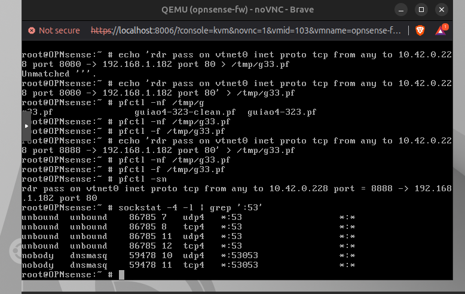

---

Sim. Está certo ✅

No output aparece:

```text
unbound udp4 *:53
unbound tcp4 *:53
```

Isto quer dizer:

| Protocolo  | Estado  |
| ---------- | ------- |
| DNS UDP/53 | ativo ✅ |
| DNS TCP/53 | ativo ✅ |

O `dnsmasq` em `53053` podes ignorar agora.

## Ação — 1 passo

No **ubuntu1-lan**, testa DNS contra um servidor externo antes do forcing:

```bash
nslookup example.com 8.8.8.8
```

## Objetivo

Ver se, antes da regra de forcing, o cliente consegue pedir DNS diretamente ao `8.8.8.8`.

## Como pensar

No 3.4 queremos forçar isto:

```text
cliente pede DNS ao 8.8.8.8
        ↓
OPNsense intercepta
        ↓
manda para Unbound local
```

## Pergunta

O `nslookup example.com 8.8.8.8` responde ou dá erro?


erro 
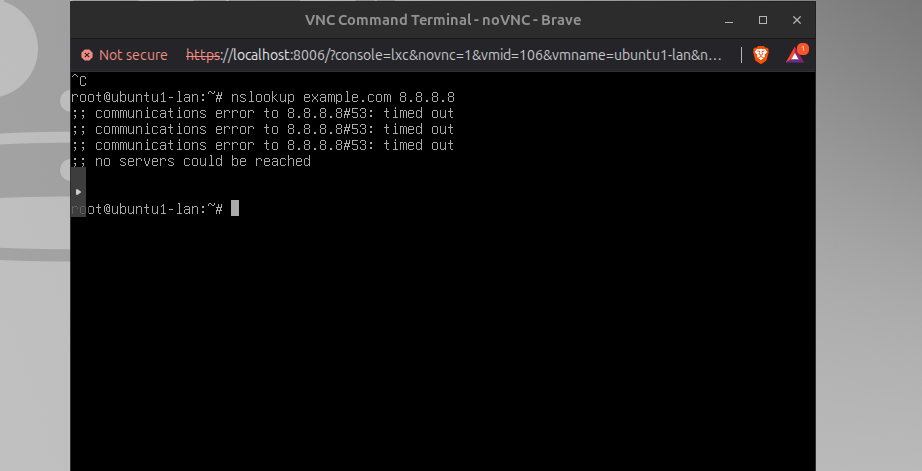

---

Causa provável

Esse erro é normal agora:

no servers could be reached

Porque quando carregaste:

pfctl -f /tmp/g33.pf

ficou ativa só a regra do NAT/RDR do 3.3. Ou seja, substituíste temporariamente as regras anteriores de NAT/internet.

Ação — 1 passo

No OPNsense, volta ao ruleset que já tinha NAT/internet:

pfctl -f /tmp/guiao4-323.pf
Objetivo

Recuperar o acesso do ubuntu1 à internet/DNS antes de fazer o 3.4 DNS forcing.

Como pensar

pfctl -f ficheiro.pf não “adiciona” regras. Ele substitui o ruleset ativo.

Portanto:

/tmp/g33.pf = só port-forward do 3.3
/tmp/guiao4-323.pf = regras anteriores com NAT

---

ja deu 

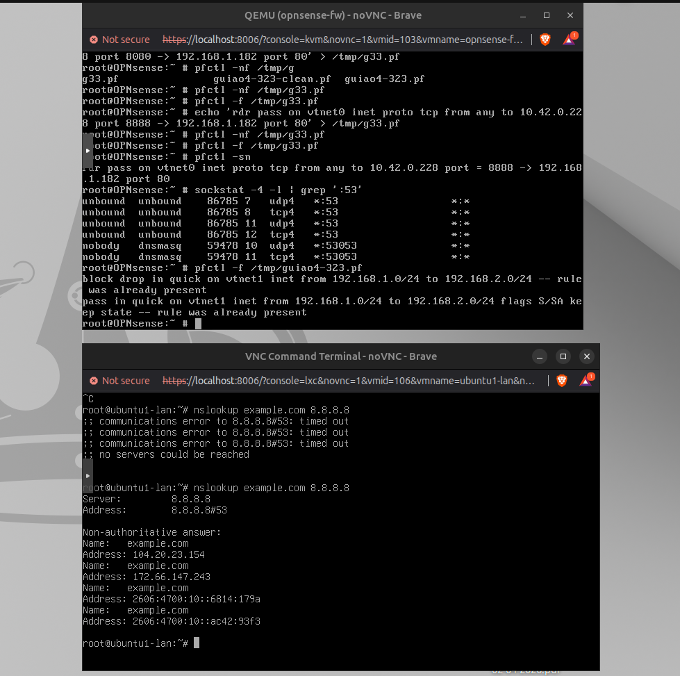

# 6

## 3.4 — DNS forcing

O `nslookup example.com 8.8.8.8` agora respondeu ✅
Isto prova que **antes do forcing** o `ubuntu1` consegue consultar DNS diretamente ao `8.8.8.8`.

## Ação — 1 passo

No **OPNsense**, adiciona só a regra DNS forcing para **UDP/53 da LAN1**:

```sh
echo 'rdr pass on vtnet1 proto udp from 192.168.1.0/24 to any port 53 -> 192.168.1.1 port 53' >> /tmp/guiao4-323.pf
```

Depois confirma:

```sh
tail -1 /tmp/guiao4-323.pf
```

## Objetivo

Preparar o redirecionamento:

```text
ubuntu1 pede DNS ao 8.8.8.8:53
        ↓
OPNsense intercepta na vtnet1
        ↓
manda para Unbound em 192.168.1.1:53
```

## Como pensar

Isto é o **DNS forcing**:

> O cliente pensa que está a usar `8.8.8.8`, mas a firewall força o pedido DNS para o resolvedor local da OPNsense.

## Pergunta

O `tail -1` mostra a regra `rdr pass on vtnet1 ... port 53 -> 192.168.1.1 port 53`?


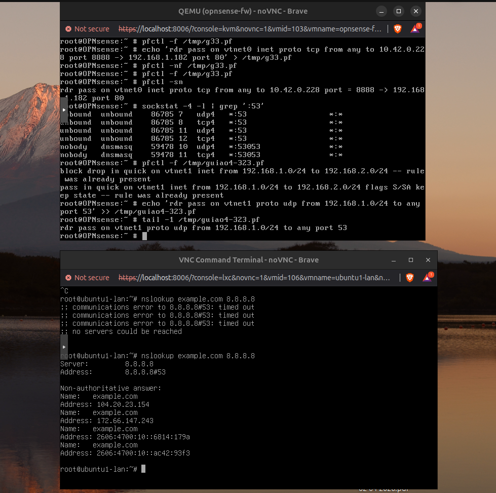


---

## Ação — 1 passo

Essa regra ficou **incompleta**. Falta o destino:

```text
-> 192.168.1.1 port 53
```

No **OPNsense**, apaga só a última linha errada:

```sh
sed -i '' '$d' /tmp/guiao4-323.pf
```

## Objetivo

Remover a regra partida antes de aplicar o 3.4.

## Como pensar

O `tail -1` mostrou só:

```text
rdr pass on vtnet1 proto udp from 192.168.1.0/24 to any port 53
```

Isso ainda **não redireciona para o Unbound**. Sem o `->`, o `pfctl -nf` vai falhar.

## Pergunta

Depois de apagar, faz:

```sh
tail -1 /tmp/guiao4-323.pf
```

Qual é agora a última linha?

## Ação — 1 passo

Essa regra ficou **incompleta**. Falta o destino:

```text
-> 192.168.1.1 port 53
```

No **OPNsense**, apaga só a última linha errada:

```sh
sed -i '' '$d' /tmp/guiao4-323.pf
```

## Objetivo

Remover a regra partida antes de aplicar o 3.4.

## Como pensar

O `tail -1` mostrou só:

```text
rdr pass on vtnet1 proto udp from 192.168.1.0/24 to any port 53
```

Isso ainda **não redireciona para o Unbound**. Sem o `->`, o `pfctl -nf` vai falhar.

## Pergunta

Depois de apagar, faz:

```sh
tail -1 /tmp/guiao4-323.pf
```

Qual é agora a última linha?

# 7 

Ação — 1 passo

No OPNsense, escreve só isto agora:

echo 'n1="192.168.1.0/24"' >> /tmp/guiao4-323.pf
Objetivo

Criar uma variável curta chamada n1 para não teres de escrever 192.168.1.0/24 na regra longa.

# 8

Ação — 1 passo

No OPNsense, adiciona a variável curta do destino DNS:

echo 'd="192.168.1.1"' >> /tmp/guiao4-323.pf
Objetivo

Preparar a regra curta:

DNS externo → Unbound na OPNsense
Como pensar

Vamos evitar escrever a regra grande inteira.

Agora teremos:

$n1 = rede LAN1
$d  = DNS/Unbound da OPNsense

# 9 

No OPNsense, adiciona agora a regra DNS forcing curta:

echo 'rdr pass on vtnet1 proto udp from $n1 to any port 53 -> $d port 53' >> /tmp/guiao4-323.pf

Depois confirma:

tail -1 /tmp/guiao4-323.pf
Objetivo

Ficar com a regra:

DNS UDP/53 vindo da LAN1 → redirecionado para 192.168.1.1:53
Resultado esperado

O tail -1 deve mostrar:

rdr pass on vtnet1 proto udp from $n1 to any port 53 -> $d port 53

---
lool erro 
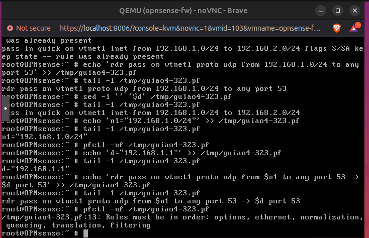

---
Está explicado: erro de ordem do pf ✅

O erro:

Rules must be in order: options, ethernet, normalization, queueing, translation, filtering

quer dizer:

puseste uma regra rdr depois das regras pass/block.

No pf, regras rdr/nat têm de vir antes das regras de filtragem.

Ação — 1 passo

No OPNsense, apaga só a última linha rdr errada:

sed -i '' '$d' /tmp/guiao4-323.pf
Objetivo

Remover a regra que está no sítio errado.

Como pensar

Agora o ficheiro volta a ficar válido. Depois metemos a regra DNS forcing no sítio certo, mas com comando curto.

Pergunta

Depois corre:

pfctl -nf /tmp/guiao4-323.pf

Volta limpo ao prompt?

---

## Bom — agora o ficheiro voltou a estar válido ✅

O `pfctl -nf` voltou limpo. Portanto removeste a regra no sítio errado.

## Ação — 1 passo

Vamos fazer o **3.4 num ficheiro novo e curto**, sem mexer mais no 3.2.3.

No **OPNsense**, escreve:

```sh
cat > /tmp/g34.pf
```

Depois escreve estas linhas, uma por uma:

```pf
w=vtnet0
l=vtnet1
n=192.168.1.0/24
d=192.168.1.1
set skip on lo0
nat on $w from $n to any -> ($w)
rdr pass on $l proto udp from $n to any port 53 -> $d port 53
pass out quick all keep state
pass in quick on $l from $n to any keep state
```

Fecha com:

```text
Ctrl+D
```

## Objetivo

Criar uma regra limpa para o **DNS forcing**:

```text
ubuntu1 pede DNS ao 8.8.8.8
→ OPNsense intercepta
→ redireciona para Unbound em 192.168.1.1
```

## Pergunta

Conseguiste criar `/tmp/g34.pf` e voltar ao prompt?

---

#  10 

error 

---

# 11
ção — 1 passo

No OPNsense, acrescenta a linha set skip:

echo 'set skip on lo0' >> /tmp/g34.pf

Objetivo

Adicionar a opção básica do pf antes das regras NAT/RDR.


# 12

Objetivo

Permitir que a LAN1 continue a sair para fora/internet enquanto testamos o DNS forcing.


No OPNsense, acrescenta a regra NAT:

echo 'nat on $w from $n to any -> ($w)' >> /tmp/g34.pf

# 13

Objetivo

Criar o redirecionamento DNS:

pedidos UDP/53 da LAN1 → Unbound em 192.168.1.1:53

No OPNsense, acrescenta a regra de DNS forcing:

echo 'rdr pass on $l proto udp from $n to any port 53 -> $d port 53' >> /tmp/g34.pf

# 14 

Objetivo

Permitir que a OPNsense deixe sair o tráfego necessário depois do redirecionamento DNS.

No OPNsense, acrescenta a regra de saída:

echo 'pass out quick all keep state' >> /tmp/g34.pf

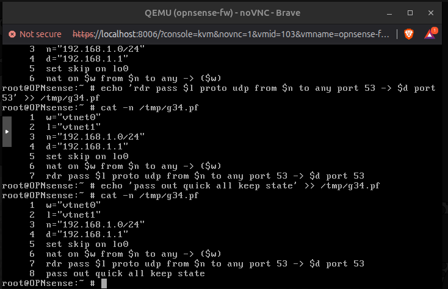

# 15

Objetivo

Permitir que o ubuntu1-lan continue a fazer tráfego normal, incluindo DNS, depois do forcing.

No OPNsense, acrescenta a regra de entrada da LAN1:

echo 'pass in quick on $l from $n to any keep state' >> /tmp/g34.pf

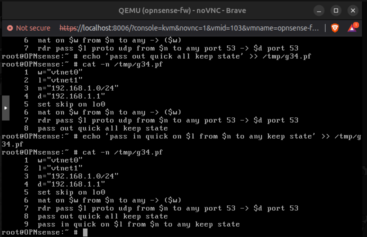

error now: 

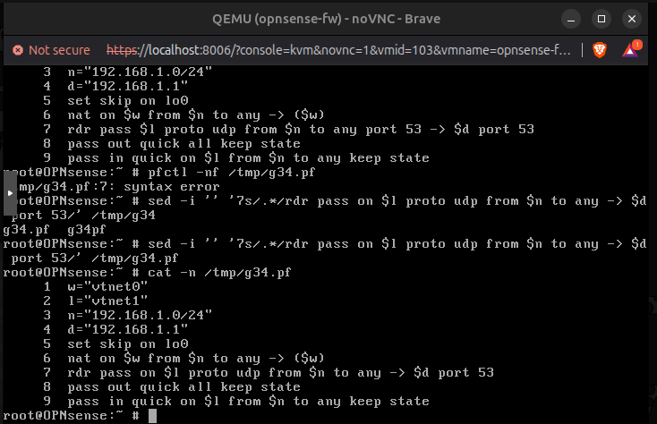

# 16

No OPNsense, aplica agora o ficheiro do 3.4:

pfctl -f /tmp/g34.pf
Objetivo

Ativar o DNS forcing:

ubuntu1 pede DNS ao 8.8.8.8
→ OPNsense intercepta na LAN1/vtnet1
→ redireciona para Unbound 192.168.1.1:53

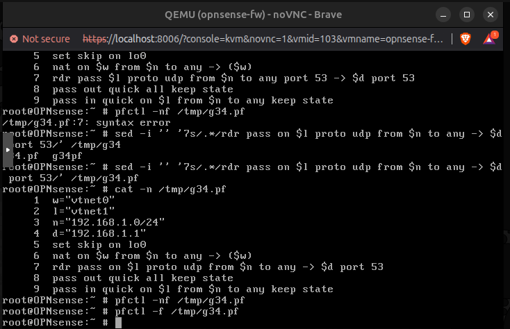

# 17 
Ação — 1 passo

No ubuntu1-lan, testa outra vez:

nslookup example.com 8.8.8.8
Objetivo

Ver se o cliente continua a “pensar” que está a usar:

8.8.8.8:53

mas a OPNsense força o pedido para:

192.168.1.1:53
Como pensar

Se responder, provaste a ideia principal:

Mesmo escolhendo um DNS externo, o tráfego DNS é redirecionado pela firewall para o DNS local da OPNsense.

Resultado esperado

Algo como:

Server: 8.8.8.8
Address: 8.8.8.8#53

Non-authoritative answer:
Name: example.com
Address: ...

⚠️ O nslookup pode continuar a mostrar 8.8.8.8, porque é o servidor que tu pediste. O forcing acontece “por baixo”, na firewall.

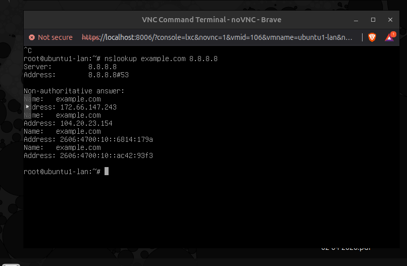

3.4 está a funcionar ✅

O nslookup respondeu:

Server: 8.8.8.8
Address: 8.8.8.8#53

Non-authoritative answer:
Name: example.com
Address: ...

Isto mostra que o DNS continua funcional depois da regra de forcing.

⚠️ Mas atenção: isto ainda não prova de forma perfeita que houve forcing, porque antes o 8.8.8.8 também respondia.


---
\
# FEITO 3.4

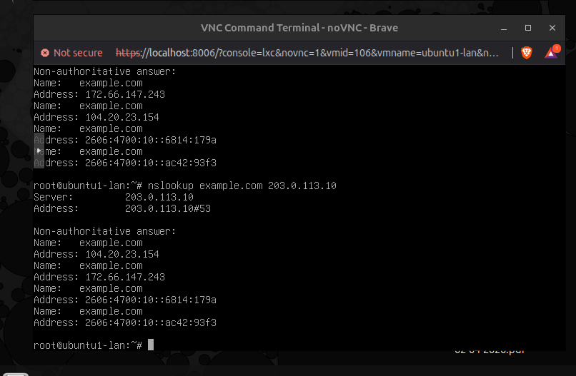

Thought for 9s
3.4 feito ✅

Sim. Isto é a prova boa:

nslookup example.com 203.0.113.10

Mesmo usando um “DNS falso”:

Server: 203.0.113.10
Address: 203.0.113.10#53

recebeste resposta para example.com.

Interpretação

Isto prova que o cliente acha que está a perguntar ao 203.0.113.10, mas a OPNsense está a interceptar o tráfego DNS e a redirecionar para o Unbound local:

ubuntu1 → DNS falso 203.0.113.10:53
        → OPNsense intercepta em vtnet1
        → Unbound 192.168.1.1:53
        → resposta DNS válida

Frase para avaliação:

No 3.4 criei uma regra de DNS forcing. Mesmo quando o cliente tenta usar um DNS externo ou falso, a firewall redireciona os pedidos DNS para o Unbound da OPNsense. Isto permite controlar e centralizar a resolução DNS da rede.

Ação — 1 passo final

Guarda no teu guiao_4.md:

### 3.4 DNS forcing

Teste antes:
- `nslookup example.com 8.8.8.8` respondeu.

Regra aplicada:
- `rdr pass on vtnet1 proto udp from 192.168.1.0/24 to any -> 192.168.1.1 port 53`

Teste de prova:
- `nslookup example.com 203.0.113.10` também respondeu.

Interpretação:
- O cliente pensa que está a usar outro DNS, mas a OPNsense força o tráfego DNS para o Unbound local.

Estado do Guião 4
Secção	Estado
3.2.3 regras de acesso	feito ✅
3.3 NAT / port-forward	feito ✅
3.4 DNS forcing	feito ✅


Guião 4 tecnicamente fechado.