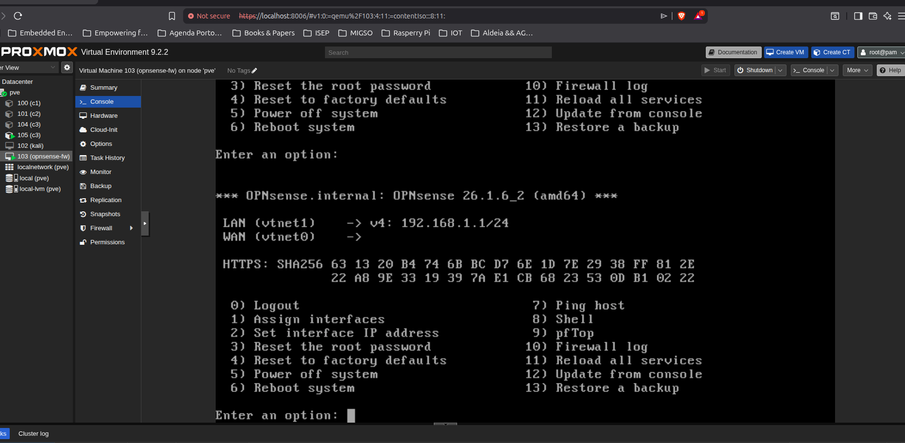
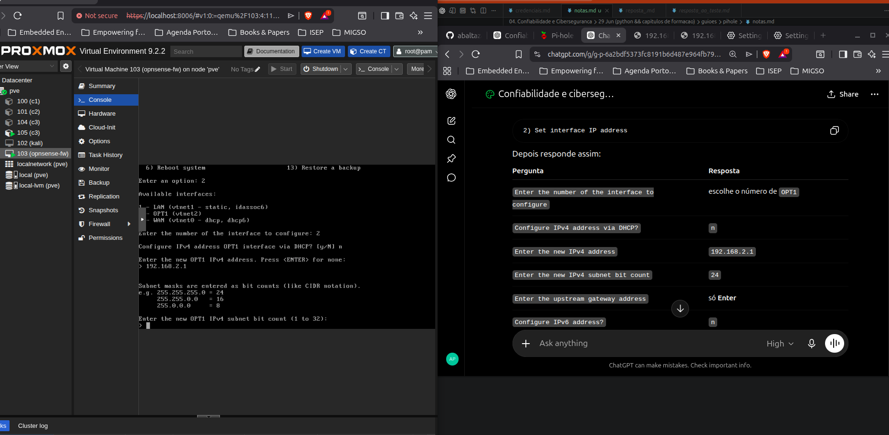
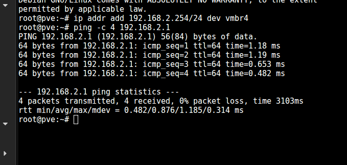
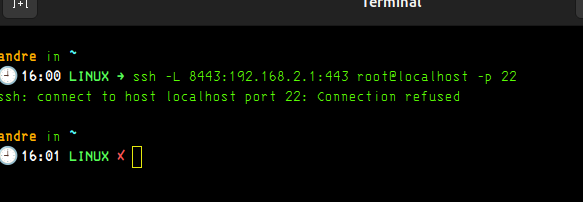
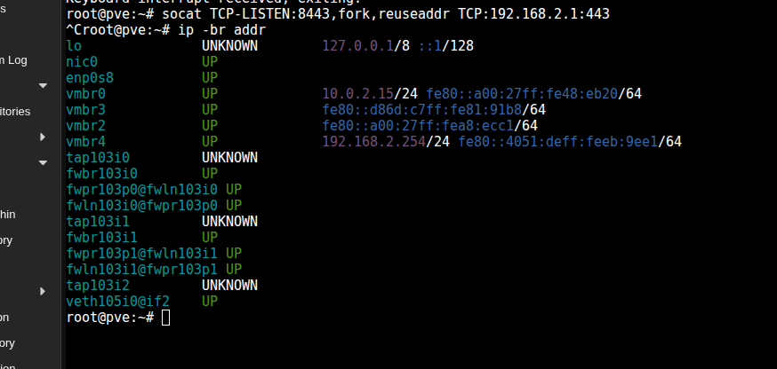

| Pergunta da OPNsense                  | Resposta     |
| ------------------------------------- | ------------ |
| `Do you want to configure LAGGs now?` | `n`          |
| `Do you want to configure VLANs now?` | `n`          |
| `Enter the WAN interface name`        | `vtnet0`     |
| `Enter the LAN interface name`        | `vtnet1`     |
| `Enter the Optional 1 interface name` | `vtnet2`     |
| `Enter the Optional 2 interface name` | só **Enter** |
| `Do you want to proceed?`             | `y`          |


2) Set interface IP address

| Pergunta                                         | Resposta                   |
| ------------------------------------------------ | -------------------------- |
| `Enter the number of the interface to configure` | escolhe o número de `OPT1` |
| `Configure IPv4 address via DHCP?`               | `n`                        |
| `Enter the new IPv4 address`                     | `192.168.2.1`              |
| `Enter the new IPv4 subnet bit count`            | `24`                       |
| `Enter the upstream gateway address`             | só **Enter**               |
| `Configure IPv6 address?`                        | `n`                        |




---

## Ação — próximo passo

Vamos confirmar se a OPNsense está mesmo a receber pedidos DHCP na LAN2.

Na consola da **OPNsense 103**, escolhe:

```text
8
```

Isto abre a shell.

Depois corre:

```sh
tcpdump -ni vtnet2 port 67 or port 68
```

Deixa esse comando a correr.

---

## Objetivo

Ver se o `c3` está realmente a enviar pedidos DHCP pela `vmbr4` até à interface `vtnet2` da OPNsense.

Queremos observar pacotes tipo:

```text
DHCPDISCOVER
DHCPREQUEST
DHCPOFFER
DHCPACK
```

---

## Como pensar

Neste momento o `c3` está sem IPv4.

Temos duas hipóteses principais:

```text
Hipótese A:
c3 nem chega à OPNsense pela vmbr4

Hipótese B:
c3 chega à OPNsense, mas o DHCP da OPT1 não está a responder
```

O `tcpdump` separa as duas hipóteses.

```text
Se aparecer DHCPDISCOVER → o c3 chega à OPNsense
Se não aparecer nada → problema é ligação vmbr4 / interface / container
```

---

## Resultado esperado

Quando depois correres no `c3`:

```bash
dhclient -4 -v eth0
```

na OPNsense deverias ver algo como:

```text
DHCPDISCOVER from bc:24:11:b2:6c:2e
DHCPOFFER on 192.168.2.100
DHCPREQUEST
DHCPACK
```

---

## Interpretação

| Resultado no tcpdump                        | Significado                                      |
| ------------------------------------------- | ------------------------------------------------ |
| Não aparece nada                            | O pedido DHCP não chega à OPNsense               |
| Aparece `DHCPDISCOVER`, mas não `DHCPOFFER` | DHCP da OPT1 não está a responder                |
| Aparece `DHCPOFFER/DHCPACK`                 | OPNsense está a responder; problema fica no `c3` |

---

Interpretação para o professor

Com IP manual no cliente, provei que a bridge vmbr4 e a interface OPT1 da OPNsense comunicam. Quando a firewall estava desligada, o ping funcionou. Portanto, se com a firewall ligada o tráfego falhar, o problema já não é físico nem de IP; é regra de firewall na interface LAN2/OPT1.

---

c3 chega à OPNsense pela vmbr4 ✅
com pf desligado, ping funciona ✅
com pf ligado, ping falha ✅

---

configuracao d euma nova interface

3.1 Configuração de uma nova interface

1. Criar bridge vmbr4 no Proxmox ✅
2. Adicionar bridge à firewall como network device ✅
2.1 Interfaces → assignment ✅
2.1.1 Enable interface ✅
2.1.2 Description: LAN2 / OPT1 ✅
2.2 Interfaces → LAN2 ✅
2.2.1 Enable ✅
2.2.2 Static IPv4 ✅
2.2.3 IP da interface/gateway: 192.168.2.1/24 ✅
2.3 Services → ISC DHCPv4 → LAN2 ✅
2.3.1 Enable DHCP ✅
2.3.2 Escolher range de IPs: 192.168.2.100–192.168.2.200 ✅

Interpretação

O teu estado atual:

Parte	Estado
vmbr4 criada	✅
OPNsense ligada à vmbr4	✅
OPT1/vtnet2 criada	✅
IP 192.168.2.1/24	✅
DHCP range 192.168.2.100–200	configurado, mas não validado
c3 ligado à vmbr4	✅
IP manual no c3	✅
Ping com pf desligado	✅
Ping com pf ligado	❌

Conclusão:

Estamos depois do 2.3.2, a validar LAN2 antes de avançar para as regras de acesso/NAT.

---

## Ação — 1 passo para destrancar isto

Vamos **abrir a GUI da OPNsense pela LAN2** usando o Proxmox como “ponte temporária”.

### 1) Na consola da OPNsense

Corre:

```sh
pfctl -d
```

Isto desliga temporariamente a firewall para conseguires entrar pela OPT1/LAN2.

### 2) No Proxmox, abre **Shell** do node `pve`

Não é no `c3`. Não é na OPNsense. É aqui:

```text
pve → Shell
```

Depois corre:

```bash
ip addr add 192.168.2.254/24 dev vmbr4
```

### 3) Agora no browser abre:

```text
https://192.168.2.1
```

---

## Objetivo

Tu estás bloqueado porque:

```text
c3 está na LAN2 ✅
OPNsense OPT1 está na LAN2 ✅
mas o teu browser/host não está na LAN2 ❌
```

Ao dar este IP ao Proxmox:

```text
Proxmox vmbr4 = 192.168.2.254
```

ficas com:

```text
Browser/Proxmox → vmbr4 → OPNsense 192.168.2.1
```

---

## Como pensar

Isto é só um **atalho de laboratório** para não perderes mais tempo.

Não é a solução final de produção.
É para conseguires entrar na GUI e criar as regras do guião.

Estamos aqui:

```text
3.1 Configuração da nova interface
→ 2.3.2 DHCP range feito
→ agora falta criar regras de firewall para LAN2
```

---

## Resultado esperado

Deve abrir a página de login da OPNsense:

```text
Username: root
Password: opnsense
```

Depois vamos criar:

```text
Firewall → Rules → OPT1/LAN2
Pass
Source: OPT1 net
Destination: any
```

---

## Interpretação

O que já provaste até agora:

```text
vmbr4 funciona ✅
c3 chega à OPNsense ✅
LAN2 existe ✅
com firewall ligada, bloqueia ✅
```

Logo, **não estás perdido**. Estás exatamente no ponto em que o guião começa a fazer sentido:

> Sem regra de firewall, a rede existe mas o tráfego é bloqueado.

---

    A verdade e que depois deste codigo continua bloqueado o IP definido

    # IP definido ->> ip addr add 192.168.2.254/24 dev vmbr4

    respost: fiquei surpreendido porque adicionamos a rota no proxmox e estamos em casa, pensei que no ISEP nao estava a dar por estarmos no ISEP, mas nao.


---



penso entao que esta  a funcionar 

proxmox -> pve

vmbr4: 192.168.2.254


OPNsense OPT1/LAN2 192.2.1


---
Não é permissões. É rota/topologia.

O Proxmox consegue chegar porque está dentro da rede vmbr4:

pve vmbr4:        192.168.2.254
OPNsense LAN2:    192.168.2.1

O teu browser no portátil não está nessa rede. Por isso dá timeout.

Agora abre um terminal no teu portátil, não no Proxmox, e cria um túnel SSH:

ssh -L 8443:192.168.2.1:443 root@localhost -p 22

Se esse não ligar, usamos o mesmo destino que usaste para aceder ao Proxmox.

Depois abre no browser:

https://localhost:8443

# DEU ERRO



---

## Ação — usar o Proxmox como proxy HTTP local

O erro é normal:

```text
ssh: connect to host localhost port 22: Connection refused
```

Isso significa:

> No teu portátil não há SSH a ouvir em `localhost:22`. Logo, esse túnel SSH não serve aqui.

Como o **Proxmox consegue pingar `192.168.2.1`**, vamos criar um encaminhamento diretamente no **Shell do Proxmox**.

No **Shell do `pve`**, corre:

```bash
python3 -m http.server 8443 --bind 0.0.0.0
```

Não, cancela: isso não serve para HTTPS/proxy. Usa este comando primeiro para ver se tens `socat`:

```bash
which socat
```

---

## Objetivo

Ver se o Proxmox tem `socat`, para depois fazermos:

```text
browser → Proxmox:8443 → OPNsense:443
```

---

## Como pensar

O que já está provado:

```text
Proxmox vmbr4:        192.168.2.254 ✅
OPNsense LAN2:        192.168.2.1 ✅
ping Proxmox → LAN2:  funciona ✅
browser → LAN2:       falha ❌
```

Logo, o problema **não é a LAN2**.

É isto:

```text
o teu browser não tem rota para 192.168.2.0/24
```

Precisamos de uma ponte/proxy no Proxmox, porque ele está nas duas realidades:

```text
tu consegues abrir o Proxmox
Proxmox consegue chegar à OPNsense
```

---

## Resultado esperado

Se o comando:

```bash
which socat
```

devolver algo tipo:

```text
/usr/bin/socat
```

o próximo passo será criar o túnel TCP.

Se não devolver nada, usamos alternativa com `nc` ou instalamos `socat`.

---

## Ação — agora usa o `socat` no Proxmox

No **Shell do `pve`**, corre:

```bash
socat TCP-LISTEN:8443,fork,reuseaddr TCP:192.168.2.1:443
```

Deixa esse comando a correr. É normal ficar “preso” sem devolver prompt.

Depois, no browser, abre:

```text
https://localhost:8443
```

---

## Objetivo

Criar uma ponte temporária:

```text
Browser no teu PC
   ↓
localhost:8443
   ↓
Proxmox/pve
   ↓
192.168.2.1:443
   ↓
OPNsense GUI
```

---

## Como pensar

Tu confirmaste isto:

```text
pve → 192.168.2.1 funciona ✅
```

Portanto a LAN2 está funcional **a partir do Proxmox**.

O que não funciona é:

```text
teu browser → 192.168.2.1 ❌
```

porque o teu browser não está diretamente na rede `192.168.2.0/24`.

O `socat` faz o Proxmox servir de intermediário.

---

## Resultado esperado

Ao abrir:

```text
https://localhost:8443
```

deves ver aviso de certificado. Aceita:

```text
Advanced / Avançado → Proceed / Continuar
```

Depois deve aparecer login da OPNsense.

---

## Interpretação

Se abrir a GUI, criamos a regra correta:

```text
Firewall → Rules → OPT1
Pass
Source: OPT1 net
Destination: any
```

Depois voltamos a ligar a firewall com:

```sh
pfctl -e
```

---



A lan2 esta a funcionar, 
# o erro foi assumir que localhost:8443 no browser era o Proxmox. Nao e. 


localhost no browser = o teu portátil
localhost no Proxmox shell = o Proxmox

---

Configurei a nova interface OPT1/LAN2 com IP 192.168.2.1/24 e liguei-a à bridge vmbr4. Como o c3 com IP manual 192.168.2.100/24 consegue comunicar com a firewall quando o filtro está desligado, provei que a rede virtual e a interface LAN2 estão corretas. O bloqueio com pf ligado mostra que faltam regras de firewall para permitir tráfego na nova interface.

---

# IMPORTANTE

## Ação — corrigir a conclusão

Tens razão em corrigir: **neste momento o ping não funciona**, mas o motivo visível agora é simples:

```text
c3 não tem IPv4 configurado
```

No teu screenshot, o `ip a` mostra só:

```text
inet6 fe80::...
```

e depois:

```text
ping: connect: Network is unreachable
```

Isto significa:

> O `c3` nem sequer sabe sair pela interface `eth0`, porque perdeu o IP manual `192.168.2.100/24`.

---

## Objetivo

Antes de testar se a OPNsense bloqueia ou não, tens de repor o IP manual no `c3`.

No `c3`, corre:

```bash
ip addr add 192.168.2.100/24 dev eth0
ip route replace default via 192.168.2.1 dev eth0
ping -c 4 192.168.2.1
```

---

## Como pensar

O IP manual que tinhas antes **não é persistente**.

Depois de reboot, logout, alteração de rede ou flush, desaparece.

Estado atual:

```text
c3 eth0 → sem IPv4
```

Logo, o erro:

```text
Network is unreachable
```

não prova firewall, NAT, DHCP nem regras.

Prova só isto:

```text
o cliente não tem configuração IPv4 válida
```

---

## Resultado esperado

Depois de repores o IP, o `ip a` deve mostrar:

```text
inet 192.168.2.100/24
```

E o `ip route` deve mostrar:

```text
default via 192.168.2.1 dev eth0
192.168.2.0/24 dev eth0
```

---

## Interpretação correta

Só depois disso é que o `ping` tem significado:

| Resultado             | Significado                          |
| --------------------- | ------------------------------------ |
| `Network unreachable` | Falta IP/rota no `c3`                |
| `100% packet loss`    | O pacote sai, mas não volta resposta |
| `4 received`          | LAN2 está funcional                  |

---

## Onde estás no guião

Continuas no fim de:

```text
3.1 — Configuração de uma nova interface
2.3.2 — Escolher range de IPs
```

Mas estás em **validação da LAN2**, não em NAT.

---

O que faz a rota default?

Este comando:

ip route replace default via 192.168.2.1 dev eth0

significa:

“Se o destino não estiver na minha rede local, envia o pacote para 192.168.2.1, que é a OPNsense.”

Exemplo:

Destino: 192.168.2.1
→ está na mesma rede 192.168.2.0/24
→ vai direto por eth0

Destino: 8.8.8.8
→ não está na rede 192.168.2.0/24
→ manda para a gateway 192.168.2.1

Portanto, para pingar a própria gateway, bastava ter:

ip addr add 192.168.2.100/24 dev eth0

Mas para sair da LAN2, precisas da rota default:

ip route replace default via 192.168.2.1 dev eth0

---

Configurei manualmente o cliente com IP 192.168.2.100/24 na rede LAN2. A gateway da LAN2 é a OPNsense em 192.168.2.1. Ao adicionar a rota default via 192.168.2.1, estou a dizer ao cliente que todo o tráfego para fora da subrede deve ser encaminhado pela firewall.

---

1. Regra firewall:
   LAN2 net → any = permitido

2. NAT outbound:
   192.168.2.100 vira IP da WAN da OPNsense

   ---

Sem regra:

pacote é bloqueado antes de sair

Sem NAT:

pacote sai com origem 192.168.2.100
a Internet não sabe responder para esse IP privado

---


Na shell da OPNsense, esse 2>/dev/null foi interpretado mal. Usa sem redirecionamento:

pfctl -e
pfctl -sn | grep 192.168.2

---

Confirmar duas coisas:

1. pf/firewall está ligada
2. existe ou não NAT para a rede 192.168.2.0/24

---

nada

---


