Este guia e sobre o Guiao 5.


1 Enquadramento :

    Protocolo IOT mais utilizado e o MQTT

2 Objectivos


---

# passoo 1

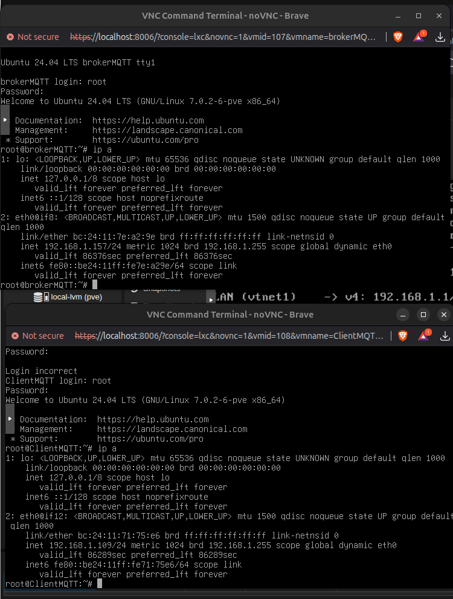

IPS
    broker Mqtt 
    192.168.1.157/24

    # client mqtt
    192.168.1.109/24

---

# passo 2 

> Provar que os client e broker comunicam

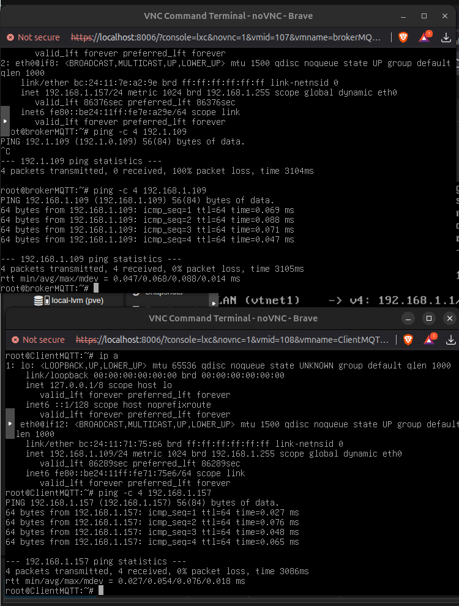

>DONE

---
# passo 3 

## Sim — diagnóstico certo ✅

O **broker tem Internet**, porque:

```bash
ping -c 3 8.8.8.8
```

deu resposta.

Mas **não tem resolução DNS**, porque:

```bash
ping -c 3 archive.ubuntu.com
```

falhou com:

```text
Temporary failure in name resolution
```

Ou seja: **rede OK, DNS KO**.

---

## Ação: próximo passo no `brokerMQTT`

No terminal do **brokerMQTT**, corre isto:

```bash
cat /etc/resolv.conf
printf "nameserver 8.8.8.8\nnameserver 1.1.1.1\n" > /etc/resolv.conf
getent hosts archive.ubuntu.com
```

---

## Objetivo

Provar que o problema é **só DNS**.

Se o comando:

```bash
getent hosts archive.ubuntu.com
```

devolver IPs, então o DNS ficou corrigido temporariamente.

---

## Depois, se resolver nomes

Ainda no **brokerMQTT**:

```bash
apt update
apt install -y mosquitto mosquitto-clients
```

---

## Como pensar

O broker já consegue chegar à Internet por IP:

```text
brokerMQTT → gateway 192.168.1.1 → Internet → 8.8.8.8
```

Mas falha quando precisa traduzir nome para IP:

```text
archive.ubuntu.com → ????
```

Portanto, falta um **nameserver válido**.

---

## Pitfalls

1. Isto é uma **correção temporária**; pode desaparecer após reboot.
2. Se o Proxmox/LXC sobrescrever DNS, depois corrigimos no painel do container.
3. Não é problema do Mosquitto.
4. Não é problema do `apt` em si.

---

## Pergunta de decisão

Depois de correres o `getent hosts archive.ubuntu.com`, ele devolve IPs ou continua sem resolver?

---
# passo 4 - INSTALAR MOSQUITTO

No broker:

sudo apt update
sudo apt install mosquitto mosquitto-clients -y

No cliente:

sudo apt update
sudo apt install mosquitto-clients -y

Objetivo:
Instalar o serviço broker e as ferramentas cliente.

Resultado esperado:
Instalação sem erros.

Interpretação:
O broker passa a poder aceitar ligações MQTT.

Erro comum:
Instalar só mosquitto-clients no broker e esquecer o serviço mosquitto.

# passo 5 - mosquioto

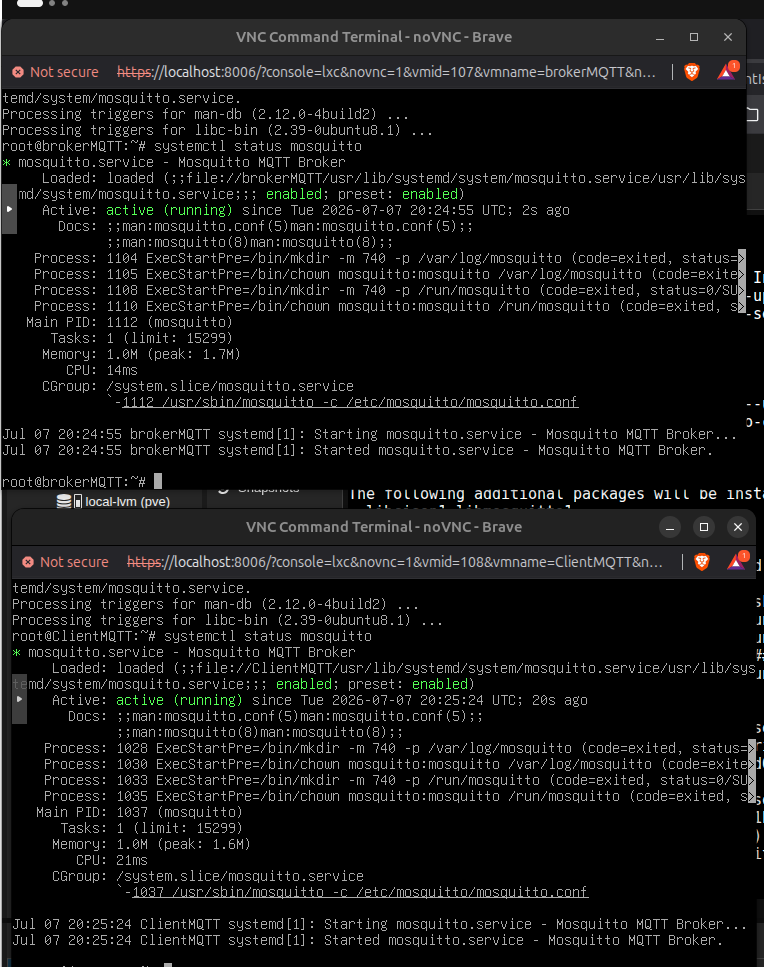

---

Passo 5 — Verificar se o broker escuta na porta 1883

No broker:

sudo ss -lntp | grep 1883

Objetivo:
Confirmar que existe um serviço TCP à escuta na porta MQTT.

Resultado esperado:

LISTEN 0  ...  0.0.0.0:1883

ou:

127.0.0.1:1883

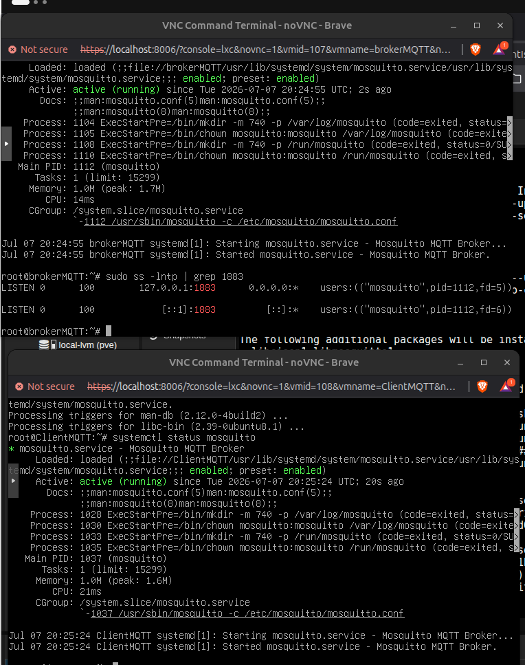

---

Passo 6 — Configurar listener para laboratório

No broker, criar ficheiro:

sudo nano /etc/mosquitto/conf.d/lab.conf

Conteúdo:

listener 1883 0.0.0.0
allow_anonymous true

Depois:

sudo systemctl restart mosquitto

Objetivo:
Permitir que o broker aceite ligações MQTT vindas do cliente.

Como pensar:
Para laboratório, allow_anonymous true simplifica. Em produção, isto seria inseguro.

Resultado esperado:
O broker escuta em 0.0.0.0:1883.

Interpretação:
O broker aceita ligações externas ao container.

Erro comum:
Esquecer restart depois de alterar configuração.

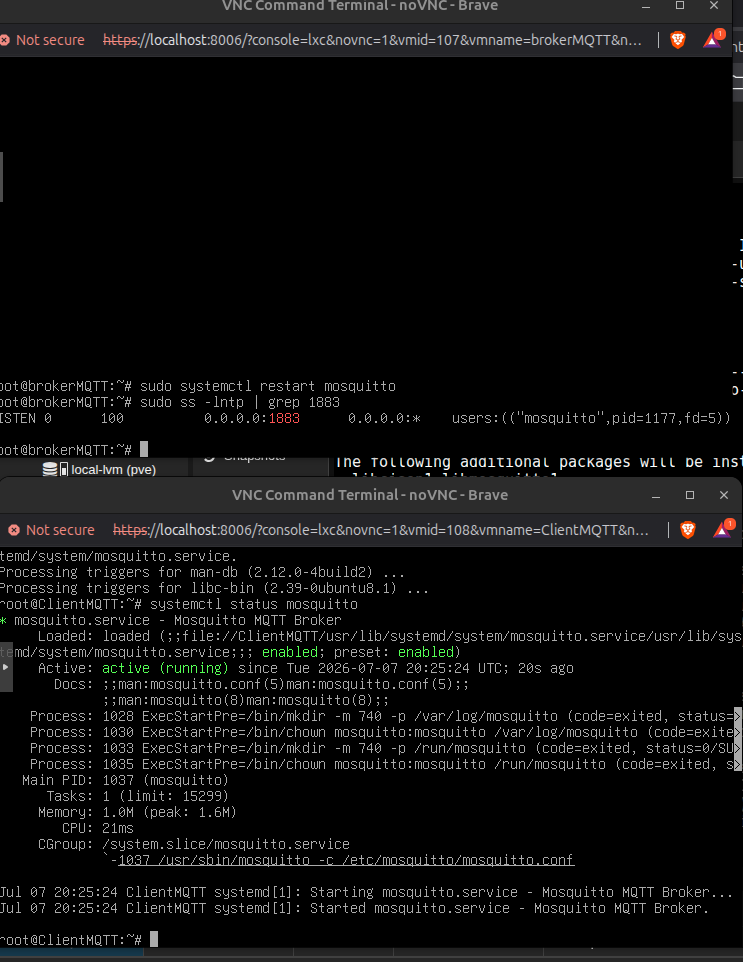

---

Passo 7 — Subscrever um tópico

No cliente ou num segundo terminal:

mosquitto_sub -h <IP_DO_BROKER> -t "isep/teste" -v

Objetivo:
Ficar à espera de mensagens no tópico isep/teste.

Resultado esperado:
O terminal fica parado à espera.

Interpretação:
Isto não é erro. O subscriber está a aguardar mensagens.

Erro comum:
Pensar que o comando bloqueou ou encravou.

---

Ação: próximo passo

Abre outro terminal do mesmo ClientMQTT ou usa outra consola para o container 108.

Nesse segundo terminal, corre:

mosquitto_pub -h 192.168.1.157 -t "isep/teste" -m "ola mqtt"

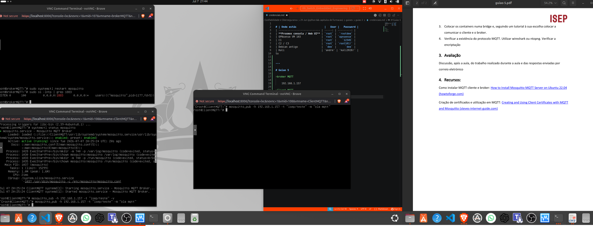

---

Exercício 3.2 — Verificação do protocolo MQTT localmente
Objetivo

Capturar tráfego e provar que MQTT está realmente a circular na rede.

Execução com tcpdump

No broker:

sudo tcpdump -i any port 1883 -n

Depois publica uma mensagem a partir do cliente.

Resultado esperado:

IP 192.168.X.10.xxxxx > 192.168.X.20.1883
IP 192.168.X.20.1883 > 192.168.X.10.xxxxx

Interpretação:
Isto prova que há tráfego TCP na porta MQTT.

---

Thought for 19s
Estás bem: o MQTT já funcionou ✅

Na imagem vejo o essencial:

isep/teste ola mqtt

Isto significa que:

publisher → broker → subscriber

funcionou.

Agora o objetivo do tcpdump é provar que essa comunicação passou pela porta TCP 1883, que é a porta normal do MQTT sem encriptação.

Ação: próximo passo

No brokerMQTT, para o tcpdump atual com:

Ctrl+C

Depois corre este comando mais controlado:

sudo tcpdump -i any -nn -c 12 'tcp port 1883'

Agora, no ClientMQTT, publica outra mensagem:

mosquitto_pub -h 192.168.1.157 -t "isep/teste" -m "teste tcpdump"
Objetivo

Capturar apenas alguns pacotes MQTT e fazer o tcpdump parar sozinho após 12 pacotes.

Assim não fica “preso” eternamente.

Resultado esperado

No brokerMQTT, deves ver linhas parecidas com:

IP 192.168.1.109.54321 > 192.168.1.157.1883: Flags [S]
IP 192.168.1.157.1883 > 192.168.1.109.54321: Flags [S.]
IP 192.168.1.109.54321 > 192.168.1.157.1883: Flags [.]
IP 192.168.1.109.54321 > 192.168.1.157.1883: Flags [P.]
IP 192.168.1.157.1883 > 192.168.1.109.54321: Flags [.]

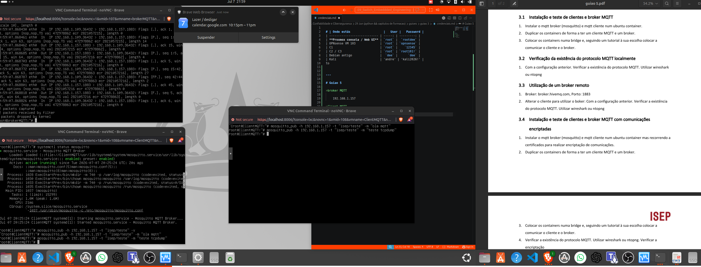

Com o tcpdump no broker, observei pacotes TCP entre o cliente 192.168.1.109 e o broker 192.168.1.157 na porta 1883. Isto confirma que o cliente está a comunicar com o broker MQTT local. Como a porta usada é 1883, a comunicação é MQTT sem TLS/encriptação.


O detalhe importante

No output aparece algo como:

192.168.1.109.36432 > 192.168.1.157.1883

Significa:

Campo	Significado
192.168.1.109	ClientMQTT
36432	porta temporária do cliente
192.168.1.157	BrokerMQTT
1883	porta MQTT
Flags [P.]	há dados de aplicação a passar

---

Ação: próximo passo — guião 3.3

Agora vais testar um broker remoto.

Qual é a tua hipótese: se usares broker.hivemq.com, o tcpdump vai mostrar tráfego para 192.168.1.157 ou para um IP externo?

No ClientMQTT, corre só isto primeiro:

ping -c 3 broker.hivemq.com

---

Exercício 3.3 — Utilização de broker remoto

O guião indica:

broker.hivemq.com
porta 1883
Objetivo

Provar que o cliente consegue comunicar com um broker MQTT fora da rede local.

Execução
Passo 1 — Testar DNS
getent hosts broker.hivemq.com

Objetivo:
Confirmar que o nome resolve para IP.

Resultado esperado:
Um ou mais IPs.

Interpretação:
DNS está funcional.

Erro comum:
Confundir falha DNS com falha MQTT.

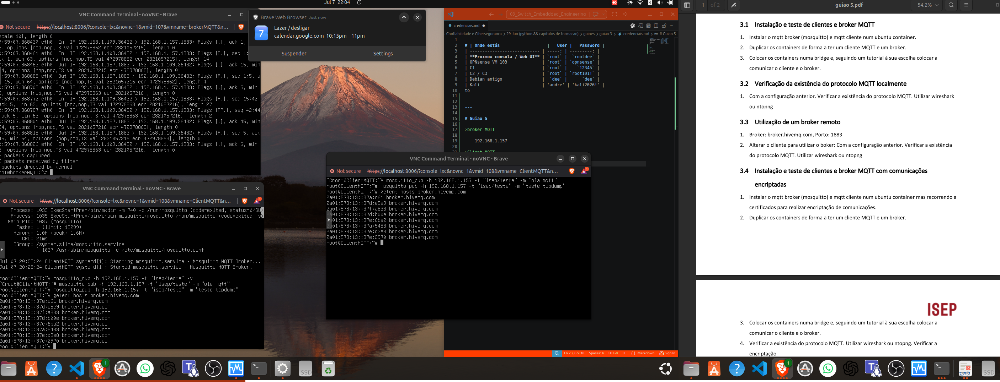

---

| Teste                            | O que prova        |
| -------------------------------- | ------------------ |
| `getent hosts broker.hivemq.com` | DNS resolve o nome |
| `ping broker.hivemq.com`         | só testa ICMP      |
| `mosquitto_pub -p 1883 -d`       | testa MQTT real    |

----
## 3.3 está validado ✅

O ponto importante apareceu:

```text
Client null received CONNACK (0)
Client null sending PUBLISH ...
Client null sending DISCONNECT
```

Isto significa:

| Linha                  | Interpretação                           |
| ---------------------- | --------------------------------------- |
| `sending CONNECT`      | o cliente tentou ligar ao broker remoto |
| `received CONNACK (0)` | o broker aceitou a ligação              |
| `sending PUBLISH`      | a mensagem MQTT foi enviada             |
| `sending DISCONNECT`   | o cliente fechou a sessão corretamente  |

Ou seja: **o ping falhou, mas MQTT funcionou**. Excelente exemplo para avaliação.

---

## Ação: próximo passo — provar com captura

Agora vamos provar que isto foi mesmo tráfego para fora, não para o broker local.

No **ClientMQTT**, corre:

```bash
sudo tcpdump -i any -nn -c 12 'tcp port 1883'
```

Depois, noutro terminal do **ClientMQTT**, publica outra vez:

```bash
mosquitto_pub -h broker.hivemq.com -p 1883 -t "isep/teste" -m "teste remoto tcpdump" -d
```

---

## Objetivo

Confirmar que o cliente está a comunicar com um **IP externo** na porta MQTT:

```text
ClientMQTT → broker.hivemq.com:1883
```

---

## Resultado esperado

No `tcpdump`, agora já **não** deves ver:

```text
192.168.1.109 > 192.168.1.157.1883
```

Deves ver algo parecido com:

```text
192.168.1.109.xxxxx > 3.126.211.232.1883
3.126.211.232.1883 > 192.168.1.109.xxxxx
```

---

## Interpretação para escrever

```md
Com o broker remoto `broker.hivemq.com`, o cliente estabeleceu uma ligação MQTT na porta 1883 e recebeu `CONNACK`, confirmando que o broker aceitou a sessão. O `tcpdump` permite verificar que o tráfego já não vai para o broker local `192.168.1.157`, mas sim para um IP externo associado ao broker remoto.
```

---
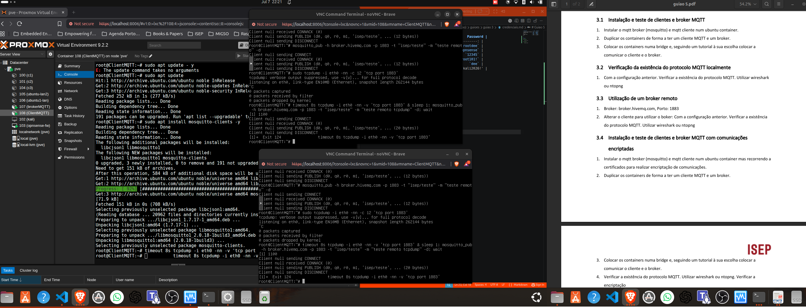

---

## Sim — isso acontece porque abriste várias consolas do **mesmo container** 🧠

No Proxmox/noVNC, várias janelas da mesma consola podem mostrar a **mesma sessão/TTY**.
Por isso parecem “3 terminais”, mas na prática estás a ver quase o mesmo terminal repetido.

Vamos fazer o teste **num só terminal**, sem precisar de duas janelas.

---

## Ação: usa este comando único no `ClientMQTT`

Copia e cola isto no **ClientMQTT**:

```bash
timeout 8s tcpdump -i eth0 -nn -v 'tcp port 1883' & sleep 1; mosquitto_pub -h broker.hivemq.com -p 1883 -t "isep/teste" -m "teste remoto tcpdump" -d; wait
```

---

## Objetivo

Este comando faz 3 coisas:

```text
1. Arranca o tcpdump em background
2. Espera 1 segundo
3. Publica mensagem MQTT para broker.hivemq.com:1883
```

Assim não precisas de dois terminais separados.

---

## Resultado esperado

Deves ver linhas tipo:

```text
IP 192.168.1.109.xxxxx > 3.xxx.xxx.xxx.1883
IP 3.xxx.xxx.xxx.1883 > 192.168.1.109.xxxxx
```

E também:

```text
Client null received CONNACK (0)
Client null sending PUBLISH
```

---

## Interpretação

Se aparecer `.1883` com um IP externo:

```text
192.168.1.109 → IP externo .1883
```

então provaste o passo 3.3:

> O cliente MQTT comunica com um broker remoto através da porta TCP 1883.

---

## Pitfall principal

O erro não era MQTT. Era o método de usar “vários terminais” no noVNC. Para este guião, quando precisares de duas ações ao mesmo tempo, usamos `&`, `sleep` e `wait`.

Mostra-me o output desse comando único.


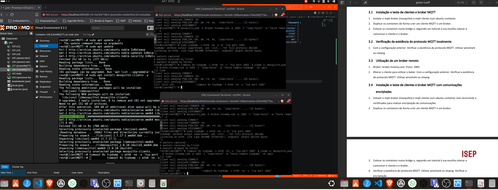


---

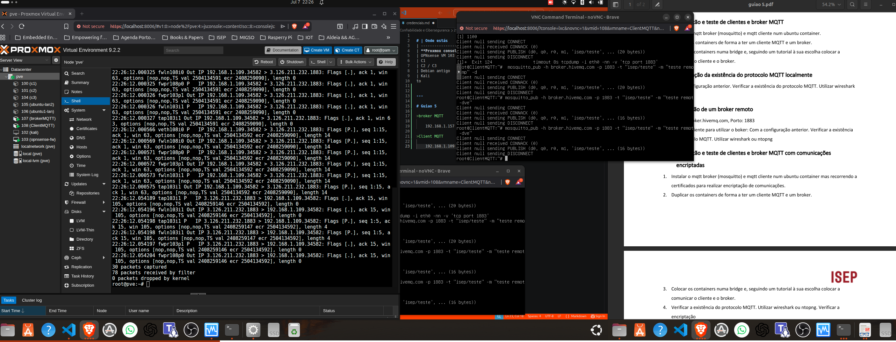

---

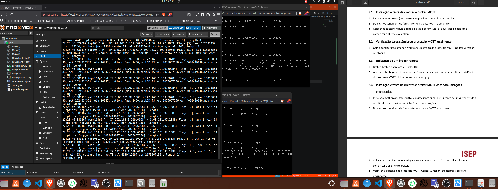

## Validado ✅ — isto cumpre o 3.3

No output aparece tráfego entre:

```text
192.168.1.109.60984 > 3.68.181.97.1883
3.68.181.97.1883 > 192.168.1.109.60984
```

Interpretação:

| Campo                     | Significado                                 |
| ------------------------- | ------------------------------------------- |
| `192.168.1.109`           | ClientMQTT                                  |
| `60984`                   | porta temporária do cliente                 |
| `3.68.181.97`             | IP externo associado ao `broker.hivemq.com` |
| `1883`                    | porta MQTT sem encriptação                  |
| tráfego nos dois sentidos | ligação TCP estabelecida                    |

Também aparece `length 14`, ou seja, há dados de aplicação a circular — não é só “ping TCP”.

---

## Frase para escrever no relatório

```md
Na utilização do broker remoto, o cliente MQTT 192.168.1.109 comunicou com um IP externo associado a broker.hivemq.com na porta TCP 1883. A publicação com mosquitto_pub recebeu CONNACK (0), confirmando que o broker remoto aceitou a ligação MQTT. A captura tcpdump/pcap confirma a existência de tráfego MQTT sem encriptação na porta 1883.
```

---

## Ação: próximo passo

Tira screenshot deste output e guarda como prova do **3.3**.

Se quiseres cumprir mesmo “Wireshark” à letra, abre o ficheiro:

```text
mqtt-remoto.pcap
```

no Wireshark e usa o filtro:

```text
tcp.port == 1883
```

ou:

```text
mqtt
```

---

## Objetivo

Mostrar visualmente que existe comunicação MQTT com broker remoto.

---

## Como pensar

Este passo prova duas coisas:

```text
Cliente → Internet → Broker remoto
```

e:

```text
MQTT usa TCP/1883 sem TLS
```

---

## Pitfalls

1. `ping broker.hivemq.com` falhar não invalida MQTT.
2. O IP remoto pode mudar porque `broker.hivemq.com` resolve para vários IPs.
3. `1883` é MQTT sem encriptação.
4. Para MQTT encriptado, normalmente vais usar `8883`.

---

## Próximo passo do guião

Agora estás pronto para o **3.4 — MQTT com comunicações encriptadas** 🔐
