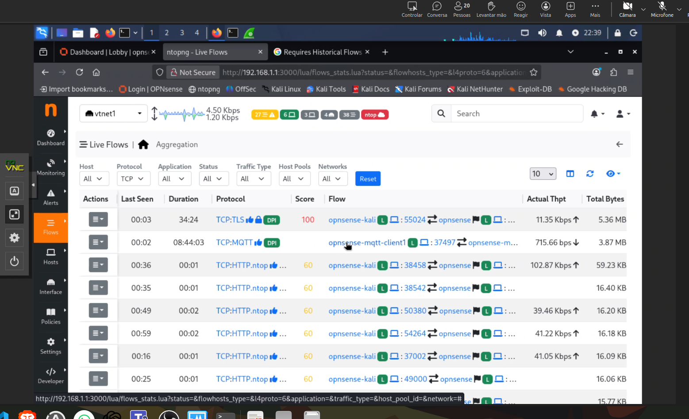
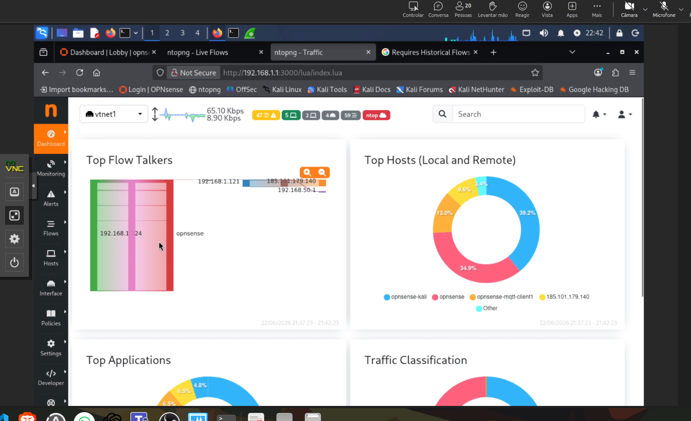
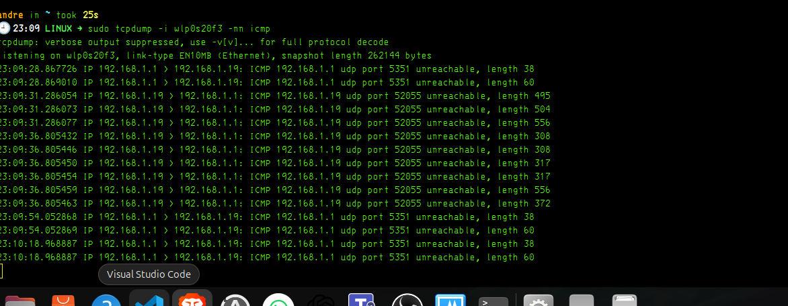

materria de hije protecao po imspecao.



ntopng



## Ação — 1 passo 🎯

Para a captura deixar de mostrar “ruído” e veres algo controlado, para o `tcpdump` com:

```bash
Ctrl + C
```

Depois corre:

```bash
sudo tcpdump -i wlp0s20f3 -nn icmp
```

---

## Objetivo

Ficar apenas à espera de pacotes **ICMP**, ou seja, `ping`.

Assim consegues provar:

> “Estou a capturar tráfego real na interface Wi-Fi, mas agora só quero ver um protocolo específico.”

---

## O que estás a ver agora

A tua captura atual está na interface:

```text
wlp0s20f3
```

Isso é a tua **placa Wi-Fi** no Linux físico.

Aparecem muitas linhas como:

```text
192.168.1.19.50714 > 52.113.117.246.3478: UDP
52.113.117.246.3478 > 192.168.1.19.50714: UDP
```

Interpretação:

| Parte              | Significado                            |
| ------------------ | -------------------------------------- |
| `192.168.1.19`     | O teu computador na rede local         |
| `52.113.117.246`   | Servidor externo na Internet           |
| `UDP`              | Protocolo sem ligação TCP              |
| `3478`             | Porta muito usada por STUN/TURN/WebRTC |
| `wlp0s20f3 In/Out` | Entrada/saída pela tua interface Wi-Fi |

Muito provavelmente isto é tráfego de **Teams, chamada, WebRTC, browser ou serviço em background**.

Também aparecem linhas tipo:

```text
127.0.0.1 > 127.0.0.1
```

Isso é tráfego **loopback**, ou seja, comunicação interna dentro do próprio PC. Não é tráfego da rede externa.

---

## Como pensar

O `tcpdump` está a mostrar tudo o que passa pela interface.
Sem filtro, vais ver:

```text
DNS
HTTPS
UDP
IPv6
loopback
Teams
browser
serviços do sistema
```

Por isso parece confuso.

A regra mental é:

> Primeiro escolho **o que quero provar**, depois aplico um filtro.

Exemplos:

```bash
sudo tcpdump -i wlp0s20f3 -nn icmp
```

Mostra só ping.

```bash
sudo tcpdump -i wlp0s20f3 -nn port 443
```

Mostra HTTPS/TLS.

```bash
sudo tcpdump -i wlp0s20f3 -nn port 1883
```

Mostra MQTT, se existir.

```bash
sudo tcpdump -i wlp0s20f3 -nn host 192.168.1.1
```

Mostra tráfego com o router/gateway.

---

## Frase boa para avaliação 🧠

> O `tcpdump` permite capturar tráfego diretamente no terminal. Nesta captura estou a observar pacotes na interface Wi-Fi `wlp0s20f3`. Vejo tráfego UDP entre o meu host `192.168.1.19` e servidores externos, além de tráfego local em `127.0.0.1`. Para análise útil, devo aplicar filtros por protocolo, porta ou host.

---

## Pitfalls

1. **Sem filtro aparece ruído**

   * Normal. O sistema e o browser geram muito tráfego.

2. **`127.0.0.1` não é rede externa**

   * É comunicação interna do próprio computador.

3. **Porta `443` não mostra conteúdo**

   * É HTTPS/TLS, payload cifrado.

4. **Não confundir host físico com Kali**

   * Aqui estás a capturar no teu Linux físico, não dentro da Kali.

---

## Pergunta de decisão

Queres fazer o próximo teste com `ping` para o teu **router/gateway 192.168.1.1**?


