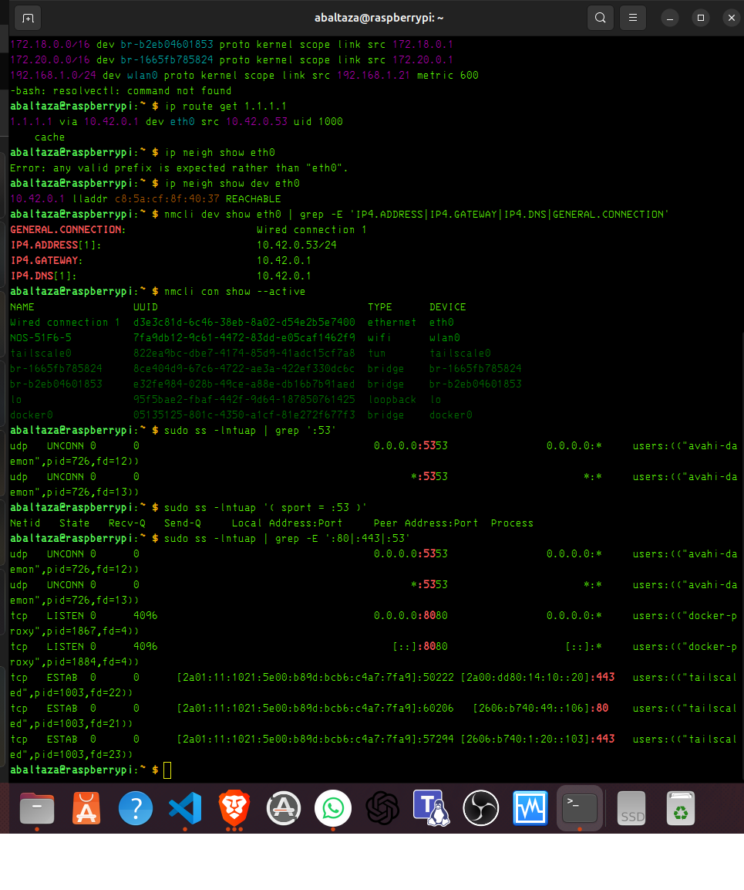
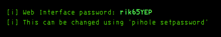

teste sabado.


Acabaste de provar uma coisa importante:

Antes:
ping 1.1.1.1          OK
ping google.com       falhava

Depois:
ping google.com       OK

Logo, o problema não era internet, era DNS.

Frase para avaliação prática:

Nesta etapa testei a diferença entre conectividade IP e resolução DNS.
O Proxmox conseguia chegar à internet por IP, mas não conseguia converter nomes em IPs.
Ao trocar o nameserver, a resolução DNS voltou a funcionar.


resolver dns promox

# printf "search local\nnameserver 1.1.1.1\nnameserver 8.8.8.8\n" > /etc/resolv.conf

Agora lê o script antes de executar:

nl -ba /root/twingate-connector.sh

| Teste                            | Resultado | Significado                 |
| -------------------------------- | --------- | --------------------------- |
| `ping 1.1.1.1`                   | OK        | Internet por IP funcionava  |
| `ping google.com`                | falhava   | DNS estava errado           |
| alterar `/etc/resolv.conf`       | OK        | DNS passou a resolver       |
| `curl raw.githubusercontent.com` | OK        | download remoto já funciona |


 Agora a pergunta de segurança é:

“O que este script vai criar, instalar ou alterar no meu Proxmox?”


>################################################################


#   DNS


Neste momento, o Raspberry está assim:

Internet sai por: eth0
IP do eth0:       10.42.0.53
Gateway eth0:    10.42.0.1
Wi-Fi:           192.168.1.21
Router casa:     192.168.1.1

Como pensar

Para fazeres um DNS server útil para a cadeira, tens de decidir quem vai usar esse DNS.

Se os teus dispositivos estão em:

192.168.1.x

então o DNS server deve ser anunciado como:

192.168.1.21

não como:

10.42.0.53

O 10.42.0.x normalmente aparece quando há partilha de ligação, hotspot, bridge, ou uma rede criada por outro equipamento. Isto pode funcionar, mas é mau para laboratório de DNS doméstico porque ficas com duas redes misturadas.

## Ação — 1 passo

No Raspberry, confirma **quem está a dar DHCP/DNS ao `eth0`**:

```bash
nmcli dev show eth0 | grep -E 'IP4.ADDRESS|IP4.GATEWAY|IP4.DNS|GENERAL.CONNECTION'
```

## Objetivo

Perceber se o `eth0` está ligado a uma rede “normal” ou a uma rede partilhada/criada por outro dispositivo.

O teu resultado atual mostra:

```text
eth0 IP:       10.42.0.53
gateway:       10.42.0.1
gateway MAC:   c8:5a:cf:8f:40:37
estado:        REACHABLE
```

Isto prova que o Raspberry **consegue falar com o gateway 10.42.0.1**, mas ainda não sabemos se esse gateway é o router da casa, o PC, hotspot, bridge, ou partilha de internet.

## Como pensar

Para o DNS server da cadeira, o cenário ideal é simples:

```text
Clientes 192.168.1.x
        ↓ DNS
Raspberry 192.168.1.x
        ↓ gateway
Router 192.168.1.1
```

Mas neste momento tens isto:

```text
eth0  → 10.42.0.53  → gateway 10.42.0.1
wlan0 → 192.168.1.21 → gateway 192.168.1.1
```

Ou seja, o Raspberry está em **duas redes diferentes**. Isto pode confundir DNS, DHCP, routing e testes com `dig`.


prof falou de block lists por DNS

---

## Ação — 1 passo

No **Raspberry Pi**, confirma se há algum serviço a escutar na porta DNS `53`:

```bash
sudo ss -lntuap | grep ':53'
```

## Objetivo

Perceber se o Raspberry **já tem algum DNS server ativo**.

O teu teste mostrou isto:

```text
dig @192.168.1.21 google.com
connection refused
no servers could be reached
```

Isto é ótimo para diagnóstico: o `ping` funciona, logo há conectividade IP. Mas o `dig` recebe **connection refused**, logo o Raspberry respondeu: “não tenho serviço DNS a ouvir nessa porta”.

## Como pensar

Tens duas camadas separadas:

```text
ping 192.168.1.21
```

prova:

```text
Cliente consegue chegar ao Raspberry pela rede
```

Mas:

```text
dig @192.168.1.21 google.com
```

testa:

```text
Existe um serviço DNS ativo em 192.168.1.21:53?
```

Neste momento, a resposta é:

```text
Não.
```

Isto ainda **não é erro grave**. Só prova que ainda não instalaste/ativaste o DNS server.

Frase para avaliação prática:

> Nesta etapa testei a diferença entre conectividade IP e serviço DNS.
> O ping funcionou, por isso a rede IP está operacional.
> O `dig` falhou com `connection refused`, por isso não existe serviço DNS ativo na porta 53 do Raspberry.
> Em segurança, isto mostra que alcançar uma máquina não significa que o serviço pretendido esteja disponível.


---

## Ação — 1 passo

Esse output **não é DNS clássico**. É **Avahi/mDNS** na porta `5353`, não DNS na porta `53`.

Agora confirma só a porta DNS real:

```bash
sudo ss -lntuap '( sport = :53 )'
```

## Objetivo

Separar:

```text
DNS clássico → porta 53    → usado por dig, routers, clientes DNS
mDNS/Avahi   → porta 5353  → usado para nomes .local, tipo raspberrypi.local
```

O teu output mostra:

```text
avahi-daemon 0.0.0.0:5353
avahi-daemon *:5353
```

Ou seja, o Raspberry responde a coisas como:

```text
raspberrypi.local
```

mas **ainda não tem servidor DNS normal** para responder a:

```bash
dig @192.168.1.21 google.com
```

## Como pensar

Isto explica perfeitamente o teu resultado anterior:

```text
ping 192.168.1.21          OK
dig @192.168.1.21 google.com  connection refused
```

Tradução técnica:

> A máquina existe na rede, mas não há serviço DNS ativo na porta 53.

Frase para avaliação prática:

> O Avahi usa mDNS na porta 5353 e permite descoberta local como `raspberrypi.local`.
> Um servidor DNS normal precisa de escutar na porta 53.
> Como o `dig` recebeu `connection refused`, a conectividade IP existe, mas o serviço DNS ainda não está ativo.

## Pitfalls & troubleshooting

| Erro                                            | Correção                         |
| ----------------------------------------------- | -------------------------------- |
| Confundir `5353` com `53`                       | `5353` é mDNS/Avahi              |
| Pensar que `raspberrypi.local` é DNS normal     | É mDNS local                     |
| Ver `avahi-daemon` e achar que já há DNS server | Ainda falta Pi-hole/Unbound/BIND |
| Testar só `ping`                                | Ping não prova DNS               |

---

## Ação — 1 passo

Antes de instalares Pi-hole, verifica se a **Nextcloud já está a usar as portas web** no Raspberry:

```bash id="2ax8uk"
sudo ss -lntuap | grep -E ':80|:443|:53'
```

## Objetivo

Evitar partir a tua Nextcloud.

Já provaste isto:

```text id="qhzsu9"
porta 5353 → Avahi / mDNS
porta 53   → vazia
```

Ou seja:

```text id="ovaxv7"
raspberrypi.local funciona por mDNS
mas ainda não tens DNS server normal
```

O próximo risco é outro: **Pi-hole também instala interface web**. A instalação oficial do Pi-hole usa o comando `curl -sSL https://install.pi-hole.net | bash`, mas a própria documentação avisa que “pipe para bash” é uma decisão sensível porque executa código diretamente; dá também métodos alternativos para rever o código antes. ([Pi-hole Documentation][1])

## Como pensar

`raspberrypi.local` não prova DNS clássico. Prova isto:

```text id="jtwsl2"
Linux portátil
   ↓ mDNS / Avahi / porta 5353
raspberrypi.local → 192.168.1.21
```

DNS clássico seria isto:

```text id="4k8xev"
Linux portátil
   ↓ DNS / porta 53
google.com → IP
```

Agora queremos transformar o Raspberry em:

```text id="zd55vy"
Raspberry Pi 5
192.168.1.21
   ├── Nextcloud
   └── DNS server / Pi-hole
```

Mas se a Nextcloud usa `80` ou `443`, convém saber antes.

## Pitfalls & troubleshooting

| Problema                   | Sintoma                                        |
| -------------------------- | ---------------------------------------------- |
| Nextcloud já usa `80/443`  | Pi-hole web interface pode entrar em conflito  |
| Pi-hole usa porta `53`     | OK, porque agora está vazia                    |
| Confundir `.local` com DNS | `.local` vem de mDNS/Avahi                     |
| Instalar sem ver portas    | Podes ficar sem dashboard web ou sem Nextcloud |

## Alternativas / tradeoffs

| Opção                        | Quando usar                               |
| ---------------------------- | ----------------------------------------- |
| Pi-hole normal               | Se `80/443` estiverem livres              |
| Pi-hole com web noutra porta | Se Nextcloud usa `80/443`                 |
| Pi-hole em Docker            | Mais limpo se já usas vários serviços     |
| Unbound/BIND sem dashboard   | Melhor para estudo DNS puro, menos visual |

## Pergunta de decisão

O comando mostra algum processo a usar `:80` ou `:443`?

[1]: https://docs.pi-hole.net/main/basic-install/?utm_source=chatgpt.com "Installation - Pi-hole documentation"



---

## Ação — 1 passo

Tens a situação ideal para avançar: **porta 53 livre** e **porta 80 livre**. Instala o Pi-hole no Raspberry:

```bash id="xvc3fj"
curl -sSL https://install.pi-hole.net | bash
```

Durante o instalador, quando ele perguntar pela interface, escolhe:

```text id="jpjo5f"
wlan0
```

e quando perguntar pelo IP, usa:

```text id="l4mpvy"
192.168.1.21
```

## Objetivo

Criar finalmente o serviço DNS na porta clássica:

```text id="m81aa8"
192.168.1.21:53
```

O teu diagnóstico atual é:

```text id="z8z9hp"
:53    livre  → bom para DNS
:80    livre  → bom para dashboard Pi-hole
:443   livre  → sem conflito
:8080  ocupado por docker-proxy → provável Nextcloud / serviço Docker
```

A documentação oficial do Pi-hole indica esse comando como instalação rápida, mas avisa que fazer pipe para `bash` executa código diretamente; é aceitável para laboratório, mas o ponto de segurança é saber o que estás a fazer. ([Pi-hole Documentation][1])

## Objetivo de segurança

O Pi-hole é um **DNS sinkhole**: recebe queries DNS dos clientes e pode bloquear domínios indesejados antes de haver ligação HTTP/HTTPS. A própria documentação descreve-o como proteção ao nível da rede sem instalar software nos clientes. ([Pi-hole Documentation][2])

## Como pensar

Antes tinhas:

```text id="l0hqu2"
dig @192.168.1.21 google.com
→ connection refused
```

Depois da instalação, queres ver:

```text id="aw3mue"
dig @192.168.1.21 google.com
→ status: NOERROR
→ ANSWER SECTION
```

Isto prova:

```text id="jpfzhx"
conectividade IP OK
+
serviço DNS ativo na porta 53
+
resolução de nomes funcional
```

## Pergunta de decisão

Durante o instalador, apareceu a escolha de interface com `eth0` e `wlan0`?

[1]: https://docs.pi-hole.net/main/basic-install/?utm_source=chatgpt.com "Installation - Pi-hole documentation"
[2]: https://docs.pi-hole.net/?utm_source=chatgpt.com "Pi-hole documentation: Overview of Pi-hole"

---
Como pensar

O aviso está certo: um DNS server precisa de IP estável.

Mas neste momento estamos em modo laboratório da cadeira, por isso podes continuar para aprender e testar. Depois fazemos a versão correta com IP fixo/reserva DHCP.

O teu raciocínio deve ser:

DNS server = serviço que os clientes têm de encontrar sempre no mesmo IP

Se amanhã o Raspberry mudar de 192.168.1.21 para outro IP, os clientes continuam a perguntar ao IP antigo e o DNS falha.

---

Escolhe:

Quad9 (filtered, DNSSEC)

Depois carrega em:

<OK>
Objetivo

Usar um upstream DNS com foco em segurança:

Cliente → Pi-hole → Quad9 → Internet

O Pi-hole vai bloquear domínios pelas listas locais, e o Quad9 ainda pode bloquear domínios conhecidos como maliciosos.

Como pensar

Aqui estás a escolher para quem o Pi-hole pergunta quando ele próprio não sabe a resposta.

Exemplo:

Portátil pergunta ao Pi-hole:
"qual é o IP de google.com?"

Pi-hole:
1. vê se o domínio está bloqueado
2. se não estiver, pergunta ao upstream DNS
3. devolve a resposta ao cliente

Para a cadeira, a frase importante é:

O Pi-hole atua como DNS local e filtro. O upstream DNS é o resolvedor externo usado quando o Pi-hole precisa de resolver domínios públicos.


---

Frase para avaliação:

Nesta etapa estou a ativar uma política de filtragem DNS.
O Pi-hole passa a comparar os domínios pedidos pelos clientes contra uma lista de bloqueio.
Em termos de segurança, isto reduz exposição a publicidade, tracking e alguns domínios maliciosos antes de haver ligação HTTP/HTTPS.

---

Frase para avaliação prática:

Nesta etapa estou a testar se o Raspberry funciona como servidor DNS.
O ping prova conectividade IP, mas o dig prova resolução DNS.
Se o dig responder com IPs, significa que o serviço DNS está ativo e consegue encaminhar queries para o upstream.
Em termos de segurança, isto permite observar e filtrar pedidos DNS antes de os clientes acederem à Internet.

---
PI HOLE

Ação — 1 passo

No campo Password, mete a password que apareceu no fim da instalação do Pi-hole:

rik65YEP

PASSWORD



---

Para o guião da cadeira, isto é uma ótima evidência prática:

O dig @192.168.1.21 example.com força o cliente a usar o Raspberry como DNS.
Se aparecer no Query Log, prova que o Pi-hole recebeu, processou e registou a query.
Isto demonstra observabilidade DNS e controlo centralizado da resolução de nomes.

---

o meu tailscale 


100.70.175.106


---

## Ação — 1 passo

No **portátil**, testa primeiro se o caminho Tailscale até ao Raspberry está vivo:

```bash
tailscale ping 100.70.175.106
```

## Objetivo

Separar dois problemas diferentes:

```text
Problema A: portátil nem chega ao Raspberry via Tailscale
Problema B: chega ao Raspberry, mas o Pi-hole não responde na porta 53 via Tailscale
```

O teu erro atual foi:

```text
communications error to 100.70.175.106#53: timed out
```

Isto significa: **não recebeste resposta na porta DNS 53 pelo IP Tailscale**.

Mas ainda não sabemos se o problema é Tailscale ou Pi-hole.

## Como pensar

Tu já tens isto a funcionar localmente:

```text
dig @192.168.1.21 google.com
→ funciona
```

Mas isto falhou:

```text
dig @100.70.175.106 google.com
→ timed out
```

Logo, a hipótese mais provável é uma destas:

| Hipótese                                        | O que significa                        |
| ----------------------------------------------- | -------------------------------------- |
| Tailscale não está a chegar ao Raspberry        | problema VPN/conectividade             |
| Pi-hole só está a escutar na LAN `wlan0`        | não responde na interface `tailscale0` |
| Firewall/local policy bloqueia UDP 53           | Tailscale chega, mas DNS é filtrado    |
| Pi-hole está em modo “listen only on interface” | normal depois de escolher `wlan0`      |

Para a cadeira, isto é excelente: estás a distinguir **conectividade VPN** de **serviço DNS**. Isso encaixa no objetivo dos guiões: interpretar o que cada comando prova, não apenas executar comandos. 


## Pergunta de decisão

O comando:

```bash
tailscale ping 100.70.175.106
```

dá **pong/ok** ou falha?

sim
---

O Tailscale criou uma rede privada sobre a Internet. O Raspberry é alcançável pelo IP 100.70.175.106, mas o serviço DNS precisa de aceitar queries nessa interface. O tailscale ping prova conectividade VPN; o dig @100.70.175.106 prova se o serviço DNS está disponível pela VPN.

---

dig @100.70.175.106 google.com +short
---

Agora testa o bloqueio via Tailscale, não só a resolução:

dig @100.70.175.106 doubleclick.net +short
Objetivo

Provar que, mesmo fora da LAN, consegues demonstrar:

Portátil → Tailscale → Raspberry Pi-hole → bloqueio DNS

Já provaste:

dig @100.70.175.106 google.com +short
→ 172.217.171.46

Isto significa:

DNS via Tailscale está funcional ✅

---

Para mostrar no ISEP/Zepi, basta abrir no browser:

http://100.70.175.106/admin

