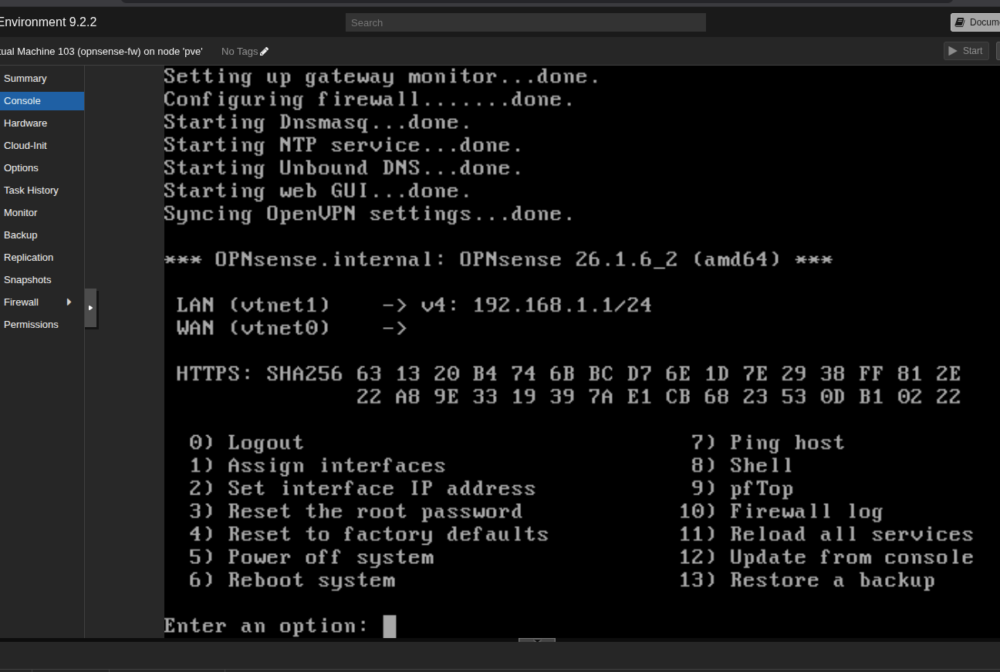
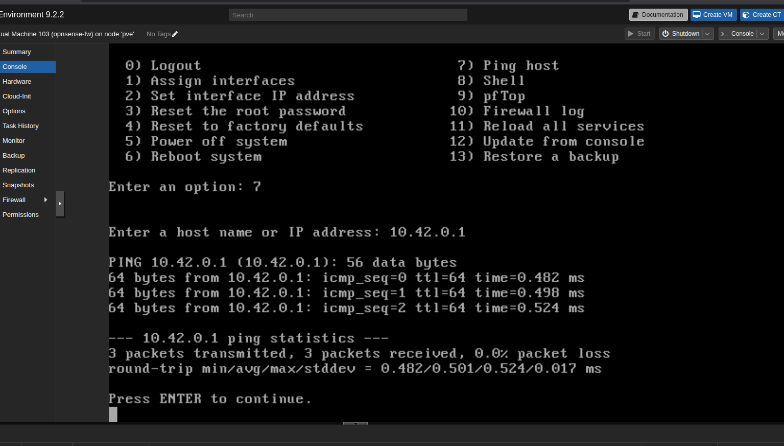
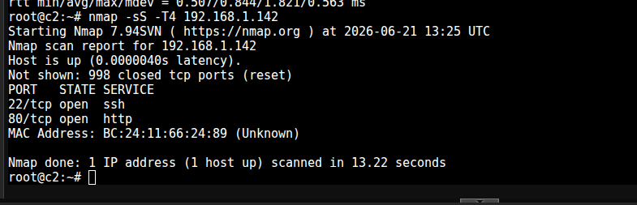
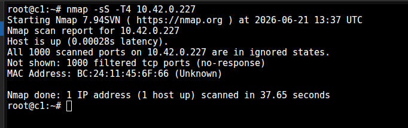
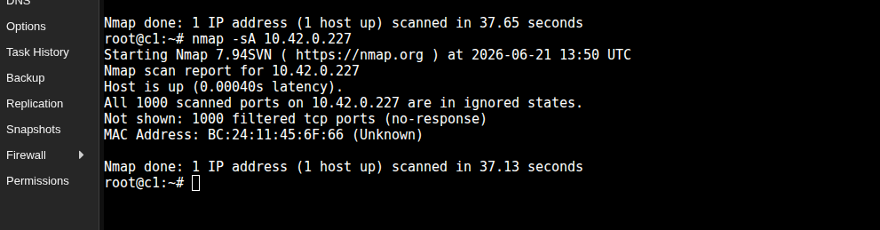
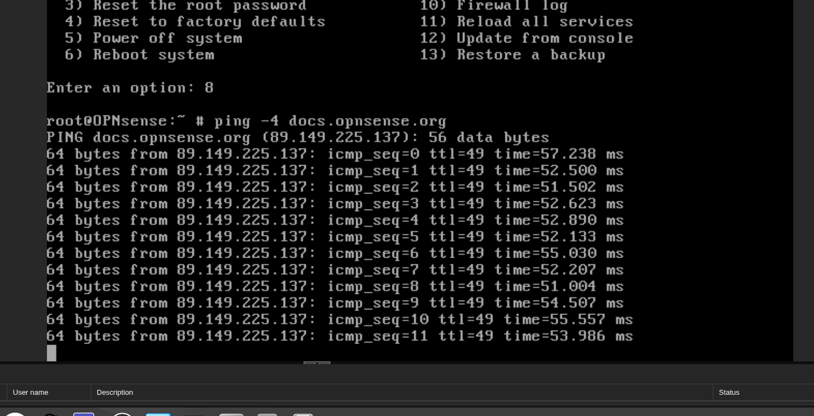

Como pensar

Neste wizard, o Proxmox só está a criar uma placa de rede inicial.

Essa primeira placa deve ser a WAN:

OPNsense
 ├── net0 = WAN = vmbr2  ← agora
 └── net1 = LAN = vmbr3  ← adicionamos depois

A segunda placa, vmbr3, normalmente adicionamos depois da VM criada, em:

opnsense-fw → Hardware → Add → Network Device


Está certo ✅

A primeira interface ficou:

Bridge: vmbr2
Model: VirtIO

Isto será a WAN da OPNsense:

net0 → vmbr2 → WAN

## Sim — está bem ✅

A configuração está correta para o ponto **3.1** do guião:

```text
RAM:   2.00 GiB ✅
CPU:   2 cores ✅
Disco: 10G ✅
ISO:   OPNsense DVD ✅
net0:  vmbr2 ✅ → WAN
net1:  vmbr3 ✅ → LAN
```

A parte mais importante está certa:

```text
Network Device (net0) → bridge=vmbr2
Network Device (net1) → bridge=vmbr3
```

---

## Ação — 1 passo ⚙️

Clica em:

```text
103 (opnsense-fw) → Start
```

Depois abre:

```text
Console
```

---

## Objetivo

Arrancar a OPNsense para confirmar, no CLI, quais interfaces foram detetadas.

Em OPNsense/FreeBSD, normalmente aparecem como algo parecido com:

```text
vtnet0
vtnet1
```

O que queremos provar é:

```text
vtnet0 → net0 → vmbr2 → WAN
vtnet1 → net1 → vmbr3 → LAN
```

---

## Como pensar

O Proxmox sabe isto:

```text
net0 = vmbr2
net1 = vmbr3
```

Mas a OPNsense lá dentro pode chamar essas interfaces de:

```text
vtnet0
vtnet1
```

Agora vamos verificar se a ordem ficou lógica antes de avançar para IP, DHCP e testes.

---


Não é root / dee ❌

Para instalar a OPNsense pela ISO, usa:

login:    installer
password: opnsense

Depois de instalada, para entrar no menu normal da consola, o login por defeito é:

login:    root
password: opnsense

A documentação oficial da OPNsense indica root / opnsense como credenciais por defeito após instalação; para o instalador, usa-se installer / opnsense.


---



Excelente — agora ficou correto ✅

Agora a OPNsense mostra:

LAN (vtnet1) -> 192.168.1.1/24
WAN (vtnet0) ->

E isto bate certo com o Proxmox:

vtnet0 -> net0 -> vmbr2 -> WAN
vtnet1 -> net1 -> vmbr3 -> LAN

Ou seja, o ponto principal do 3.1 está feito.

## Excelente — já está quase provado ✅

A linha importante é esta:

```text
2 - WAN (vtnet0 - dhcp, dhcp6)
```

Isto já confirma que a **WAN está configurada para DHCP**.

---

## Ação — 1 passo ⚙️

No prompt:

```text
Enter the number of the interface to configure:
```

escreve:

```text
2
```

e carrega **Enter**.

---

## Objetivo

Entrar na configuração da **WAN** para confirmar que ela está mesmo em DHCP.

Queremos manter:

```text
WAN = vtnet0 = DHCP
LAN = vtnet1 = 192.168.1.1/24
```

---

## Como pensar

A lista diz:

```text
1 - LAN → static
2 - WAN → dhcp
```

Portanto a configuração lógica já está certa:

```text
vtnet0 → WAN → vmbr2 → DHCP
vtnet1 → LAN → vmbr3 → 192.168.1.1/24
```

Agora só estamos a validar, não a inventar IP manual.

---

## Pitfalls

1. Escolher `1` e alterar a LAN sem necessidade.
2. Dar IP estático à WAN, quando o guião pede DHCP.
3. Mexer no IPv6 sem necessidade.
4. Interpretar “WAN sem IP visível no menu” como erro imediato — pode estar configurada em DHCP mas ainda sem lease.

---

## Pergunta de decisão

Depois de escolheres **2**, ele pergunta algo como **Configure IPv4 address WAN interface via DHCP?**?


## Perfeito — 3.1 está validado ✅

Agora tens exatamente o que o guião pedia:

```text
WAN (vtnet0) -> DHCP: 10.42.0.227/24
LAN (vtnet1) -> 192.168.1.1/24
```

E a correspondência com o Proxmox fica:

```text
WAN -> vtnet0 -> net0 -> vmbr2
LAN -> vtnet1 -> net1 -> vmbr3
```

---

## Ação — 1 passo ⚙️

Agora passa para o ponto **3.2 — Verificação da operação em IP**.

Escolhe no menu da OPNsense:

```text
7
```

ou seja:

```text
7) Ping host
```

Depois testa:

```text
10.42.0.1
```

---

## Objetivo

Confirmar se a OPNsense consegue comunicar pela **WAN**.

Se o ping funcionar, prova que:

```text
OPNsense -> vmbr2 -> rede WAN -> gateway/rede externa
```

---

## Como pensar

A WAN recebeu IP por DHCP:

```text
10.42.0.227/24
```

Agora queremos saber se esse IP é útil ou apenas atribuído.

O primeiro teste lógico é pingar algo na mesma rede, provavelmente:

```text
10.42.0.1
```

---

## Pitfalls

1. O gateway pode não ser `10.42.0.1`; se falhar, não concluas logo que está tudo mal.
2. Firewall upstream pode bloquear ICMP.
3. A WAN pode ter IP mas sem rota default.
4. Nested virtualization pode causar perdas ou comportamento instável.

---

## Pergunta de decisão

Quando fizeres `Ping host` para `10.42.0.1`, recebes respostas ou dá timeout?





WAN = vtnet0 = vmbr2 = DHCP = 10.42.0.227/24 ✅
Gateway WAN = 10.42.0.1 reachable ✅
LAN = vtnet1 = vmbr3 = 192.168.1.1/24 ✅

as

---

Boa — C1 autenticado ✅

A tua tabela ficou coerente:

C1 → vmbr2 → root / 12345
C2 → vmbr3 → root / root101!
C3 → vmbr3 → root / root101!

Agora o próximo ponto do guião é verificar operação IP.

Ação — 1 passo ⚙️

No C1, onde estás em:

root@c1:~#

executa:

ip -4 addr show eth0
Objetivo

Confirmar que o C1, agora ligado à vmbr2, recebeu um IP por DHCP no lado WAN.

Esperamos algo parecido com:

inet 10.42.0.x/24

porque a OPNsense WAN está em:

WAN → 10.42.0.227/24

---

## Sim — entendeste bem ✅

O `C2` recebeu este IP:

```bash
192.168.1.159/24
```

Isto significa:

```text
C2 → vmbr3 → LAN da OPNsense → DHCP OK
```

E bate certo com a LAN da OPNsense:

```text
OPNsense LAN = 192.168.1.1/24
C2           = 192.168.1.159/24
```

Tecnicamente, não diria “recebemos a ligação”; diria:

> **O C2 recebeu um endereço IP da rede LAN através de DHCP.**

---

## Ação — 1 passo ⚙️

Vai agora ao `C3` e executa:

```bash
ip -4 addr show eth0
```

---

## Objetivo

Confirmar que o `C3` também está na LAN da OPNsense, com um IP parecido com:

```text
192.168.1.x/24
```

Assim provamos:

```text
C2 → vmbr3 → LAN
C3 → vmbr3 → LAN
```

---

## Como pensar

Agora a topologia já está a ganhar forma:

```text
C1: 10.42.0.15/24      → lado WAN
OPNsense WAN: 10.42.0.227/24

OPNsense LAN: 192.168.1.1/24
C2: 192.168.1.159/24   → lado LAN
C3: ?                  → falta confirmar
```

O `/24` quer dizer que a rede é:

```text
192.168.1.0/24
```

Ou seja, normalmente os hosts válidos vão de:

```text
192.168.1.1 até 192.168.1.254
```

---


# nmap



    nmap -sS -T4 192.168.1.142
## Interpretação do `nmap -sS -T4 192.168.1.142`

O resultado principal é este:

```text
Host is up.
Not shown: 998 closed tcp ports (reset)

PORT   STATE SERVICE
22/tcp open  ssh
80/tcp open  http
```

Isto significa:

```text
C2 conseguiu contactar C3 ✅
C3 está ativo ✅
C3 tem 2 portas TCP abertas ✅
```

---

## Como ler linha a linha

### 1. Alvo do scan

```text
Nmap scan report for 192.168.1.142
```

Este é o IP do **C3**.

Logo o teste foi:

```text
C2 → scan → C3
```

---

### 2. Host ativo

```text
Host is up (0.000040s latency).
```

Significa que o `nmap` confirmou que o C3 está ligado e responde na rede.

Como C2 e C3 estão ambos em `vmbr3`, isto é comunicação direta na LAN:

```text
C2 ---- vmbr3 ---- C3
```

---

### 3. Portas fechadas

```text
Not shown: 998 closed tcp ports (reset)
```

O `nmap` testou as portas TCP mais comuns.

Encontrou:

```text
998 portas fechadas
2 portas abertas
```

`reset` significa que o C3 respondeu com TCP RST, ou seja:

> “Recebi o pacote, mas não há serviço nessa porta.”

Isto é diferente de `filtered`, que indicaria bloqueio por firewall.

---

### 4. Porta 22 aberta

```text
22/tcp open ssh
```

A porta `22/TCP` está aberta.

Isto normalmente significa que o C3 tem um servidor SSH ativo:

```text
porta 22 → acesso remoto SSH
```

Exemplo conceptual:

```text
C2 poderia tentar ligar ao C3 por SSH
```

---

### 5. Porta 80 aberta

```text
80/tcp open http
```

A porta `80/TCP` está aberta.

Isto normalmente significa que o C3 tem um servidor HTTP/web ativo:

```text
porta 80 → serviço web
```

---

### 6. MAC Address

```text
MAC Address: BC:24:11:66:24:89 (Unknown)
```

O `nmap` também viu o endereço MAC do C3 porque C2 e C3 estão na mesma rede local.

Isto confirma que estão no mesmo domínio Layer 2:

```text
C2 e C3 estão ambos na vmbr3
```

---

## O que o scan provou

Este resultado prova três coisas importantes:

```text
1. C2 alcança C3
2. C3 responde na rede
3. C3 tem serviços expostos: SSH e HTTP
```

Isto está alinhado com o guião:

```text
No container C2, verificar se os scans nmap encontram alguma “abertura” em C3
```

As “aberturas” encontradas foram:

```text
22/tcp ssh
80/tcp http
```

---

## Ação — 1 passo ⚙️

Agora executa o segundo scan pedido no guião, ainda no **C2**:

```bash
nmap -sA 192.168.1.142
```

---

## Objetivo

Comparar o resultado do `-sS` com o `-sA`.

O `-sS` tenta descobrir **portas abertas**.

O `-sA` é mais usado para perceber comportamento de **firewall/filtragem**, não para listar portas abertas da mesma forma.

---


## Dica para guardar — `nmap` no Guião 2

### `nmap -sS -T4 <IP>`

```bash
nmap -sS -T4 192.168.1.142
```

**Ideia principal:**

```text
“Que portas TCP estão abertas neste host?”
```

| Opção  | Significado               |
| ------ | ------------------------- |
| `-sS`  | SYN scan / half-open scan |
| `-T4`  | timing mais rápido        |
| `<IP>` | alvo do scan              |

Interpretação típica:

```text
22/tcp open ssh   → serviço SSH ativo
80/tcp open http  → serviço HTTP ativo
closed            → host respondeu, mas não há serviço
filtered          → firewall pode estar a bloquear
```

---

### `nmap -sA <IP>`

```bash
nmap -sA 192.168.1.142
```

**Ideia principal:**

```text
“Existe firewall a filtrar estas portas?”
```

| Resultado     | Interpretação                              |
| ------------- | ------------------------------------------ |
| `unfiltered`  | pacote chegou ao host e houve resposta     |
| `filtered`    | firewall/filtro pode estar a bloquear      |
| `open/closed` | normalmente o `-sA` não distingue bem isto |

O `-sA` **não é para descobrir serviços abertos**. É mais para inferir regras de firewall.

---

## Regra mental rápida

```text
-sS → descobrir portas abertas
-sA → perceber filtragem/firewall
```

No teu caso:

```text
C2 → C3 com -sS
```

encontrou:

```text
22/tcp open ssh
80/tcp open http
```

Logo, o C3 tem pelo menos SSH e HTTP acessíveis a partir do C2.


---

C2 chegou ao C3 ✅
As portas responderam com TCP reset ✅
Não há filtragem/firewall entre C2 e C3 ✅


---

Ação — 1 passo ⚙️

Agora falta a segunda parte do guião: no C1, fazer scan à firewall.

No C1, executa:

nmap -sS -T4 10.42.0.227




---

## Interpretação correta: isto é o resultado esperado ✅

O teu scan foi:

```bash
nmap -sS -T4 10.42.0.227
```

O alvo era:

```text
10.42.0.227 = WAN da OPNsense
```

E o resultado importante foi:

```text
Host is up
Not shown: 1000 filtered tcp ports (no-response)
```

---

## O que isto significa

### 1. `Host is up`

```text
A firewall existe e está acessível na rede WAN.
```

O `C1` conseguiu perceber que há uma máquina no IP:

```text
10.42.0.227
```

Isto confirma:

```text
C1 → vmbr2 → WAN da OPNsense ✅
```

---

### 2. `1000 filtered tcp ports`

Isto é o mais importante.

Significa:

```text
O Nmap tentou testar 1000 portas TCP comuns,
mas a firewall não respondeu aos pacotes.
```

Ou seja, do lado WAN, a OPNsense está a comportar-se como uma firewall deve comportar-se:

```text
C1 pergunta: “porta 22 aberta?”
Firewall: silêncio

C1 pergunta: “porta 80 aberta?”
Firewall: silêncio

C1 pergunta: “porta 443 aberta?”
Firewall: silêncio
```

Resultado:

```text
filtered = provavelmente bloqueado por firewall
```

---

### 3. `no-response`

Isto quer dizer que a firewall **não respondeu** com:

```text
SYN-ACK → porta aberta
RST     → porta fechada
```

Ela simplesmente ignorou/dropou os pacotes.

Isto é diferente de `closed`.

| Estado     | Significado                          |
| ---------- | ------------------------------------ |
| `open`     | há serviço a escutar                 |
| `closed`   | o host respondeu, mas não há serviço |
| `filtered` | firewall/filtro bloqueou ou ignorou  |

No teu caso:

```text
filtered = boa proteção na WAN ✅
```

---

## Comparação com o scan ao C3

No C3 tinhas:

```text
22/tcp open ssh
80/tcp open http
```

Isso quer dizer:

```text
C3 expõe serviços na LAN.
```

Na firewall viste:

```text
1000 filtered tcp ports
```

Isso quer dizer:

```text
A WAN da firewall não expõe serviços para C1.
```

Isto bate exatamente com o guião:

```text
No container C1, verificar se os scans nmap não encontram nenhuma “abertura” na firewall.
```

Resultado:

```text
Nenhuma abertura encontrada ✅
```

---

## Frase boa para o relatório/caderno

```text
A partir do C1, foi realizado um scan SYN (-sS) à interface WAN da OPNsense. O Nmap indicou que o host estava ativo, mas que as 1000 portas TCP analisadas estavam em estado filtered, sem resposta. Isto sugere que a firewall está a bloquear/drop packets vindos da WAN, não expondo serviços TCP acessíveis externamente.
```

---

## Ação — 1 passo ⚙️

Agora faz o segundo scan pedido no guião, ainda no **C1**:

```bash
nmap -sA 10.42.0.227
```

---

## Objetivo

Comparar com o `-sS`.

```text
-sS → procura portas abertas
-sA → tenta perceber filtragem/firewall
```

Neste caso, queremos ver se a firewall continua a aparecer como `filtered`.

---

## Pitfalls

1. `Host is up` não quer dizer que há portas abertas.
2. `filtered` é diferente de `closed`.
3. O silêncio da firewall é intencional.
4. Este teste é do lado WAN; por isso o comportamento esperado é mais restritivo.

---

## Pergunta de decisão

O `nmap -sA 10.42.0.227` mostra `filtered`, `unfiltered`, ou outro resultado?



## Resultado do `nmap -sA` à firewall ✅

O scan foi:

```bash id="w3d11p"
nmap -sA 10.42.0.227
```

Resultado principal:

```text id="0rdjbo"
Host is up
Not shown: 1000 filtered tcp ports (no-response)
```

Isto confirma o mesmo comportamento:

```text id="3yym0z"
A firewall está ativa ✅
A firewall não expõe portas TCP na WAN ✅
A firewall está a filtrar/drop packets vindos do C1 ✅
```

---

## Diferença entre o scan ao C3 e à firewall

| Origem → Alvo       | Scan  | Resultado            | Interpretação                         |
| ------------------- | ----- | -------------------- | ------------------------------------- |
| `C2 → C3`           | `-sS` | `22 open`, `80 open` | C3 tem SSH e HTTP acessíveis          |
| `C2 → C3`           | `-sA` | `1000 unfiltered`    | Sem filtragem relevante entre C2 e C3 |
| `C1 → OPNsense WAN` | `-sS` | `1000 filtered`      | Firewall não expõe portas             |
| `C1 → OPNsense WAN` | `-sA` | `1000 filtered`      | Firewall filtra/dropa tráfego WAN     |

---

## Frase boa para relatório/caderno

```text id="r5rp0d"
A partir do C1 foi realizado um scan ACK (-sA) à interface WAN da OPNsense. O resultado indicou 1000 portas TCP em estado filtered, sem resposta. Isto sugere que a firewall está a filtrar o tráfego vindo da WAN, impedindo a enumeração de portas e serviços.
```

---

## Ação — 1 passo ⚙️

Regista no teu caderno esta conclusão final do ponto 3.2:

```text id="ob2r14"
C2 conseguiu comunicar com C3 e C1. O scan ao C3 encontrou portas abertas 22/tcp e 80/tcp. O scan à firewall a partir de C1 não encontrou portas abertas; as portas apareceram como filtered.
```

---

## Objetivo

Fechar o ponto **3.2 — Verificação da operação em IP** com evidência clara:

```text id="g507rb"
conectividade ✅
scans C2→C3 ✅
scans C1→firewall ✅
interpretação ✅
```

---

## Pergunta de decisão

Queres agora fazer o **resumo/checklist final do Guião 2 para imprimir**, ou continuar para a próxima secção do guião?


---

## Sim — falta só a 3.3 DNS ✅

O ponto **3.3** diz:

```text
Com a configuração anterior verificar que a opnsense consegue resolver nomes.
```

Ou seja, não é testar DNS no C1/C2/C3 ainda. É testar se a **própria OPNsense** consegue transformar nomes em IPs.

Exemplo:

```text
docs.opnsense.org → algum IP público
```

---

## Ação — 1 passo ⚙️

Vai à consola da:

```text
103 (opnsense-fw) → Console
```

No menu da OPNsense escolhe:

```text
8) Shell
```

Depois executa:

```sh
ping -c 4 docs.opnsense.org
```

---

## Objetivo

Provar que a OPNsense consegue resolver nomes DNS.

Se funcionar, deves ver algo parecido com:

```text
PING docs.opnsense.org (x.x.x.x)
64 bytes from ...
```

A parte mais importante é esta:

```text
docs.opnsense.org (x.x.x.x)
```

Isto prova que houve resolução DNS.

---

## Como pensar

DNS é a tradução:

```text
nome → IP
```

Neste teste:

```text
docs.opnsense.org → endereço IP
```

Se a OPNsense não conseguir resolver nomes, vais ver algo como:

```text
cannot resolve docs.opnsense.org
```

ou:

```text
Name or service not known
```

---


## Pergunta de decisão

Quando corres `ping -c 4 docs.opnsense.org` na OPNsense, aparece um IP entre parênteses ou dá erro de resolução?

