## Ação — 1.º passo: desenha a topologia antes de abrir o Proxmox

Copia este esquema para o teu caderno e entende **quem está ligado a quem**:

```txt
                 Rede do laboratório / Internet
                         10.0.32.0/24
                              |
                            vmbr2
                              |
        ------------------------------------------------
        |                                              |
       C1                                      WAN da OPNsense
   Container                                  IP por DHCP
   em vmbr2                                         |
                                                    |
                                             Firewall OPNsense
                                                    |
                                                  LAN
                                                    |
                                                  vmbr3
                                           bridge interna isolada
                                                    |
                              --------------------------------
                              |                              |
                             C2                             C3
                         Container                      Container
                          em vmbr3                       em vmbr3
```

### Objetivo

Este passo prova que percebes a ideia central dos dois guiões:

> **vmbr2** = rede exterior/laboratório
> **vmbr3** = rede interna isolada
> **OPNsense** = firewall/router entre vmbr2 e vmbr3

Sem isto, os comandos de `nmap`, IP, DNS e SSH ficam mecânicos e confusos.

---

## Como pensar

Pensa nas `vmbr` como **switches virtuais** dentro do Proxmox.

| Elemento     | Analogia                        | Função                           |
| ------------ | ------------------------------- | -------------------------------- |
| `vmbr2`      | switch ligado ao mundo exterior | dá acesso à rede do laboratório  |
| `vmbr3`      | switch privado na bancada       | só liga máquinas internas        |
| OPNsense WAN | porta virada para fora          | recebe IP por DHCP               |
| OPNsense LAN | porta virada para dentro        | serve a rede interna             |
| C1           | máquina “do lado de fora”       | testa a firewall a partir da WAN |
| C2/C3        | máquinas “do lado de dentro”    | testam LAN, serviços e scans     |

O ponto importante:

```txt
C2 -> C3
```

deve funcionar porque estão ambos na LAN `vmbr3`.

Mas:

```txt
C1 -> C2
```

não deve funcionar livremente, porque a firewall deve proteger a LAN.

---

## O que os guiões querem ensinar

### Guião 1 — Proxmox

O foco é perceber:

* criar containers LXC;
* criar VMs;
* ligar máquinas a bridges;
* testar IP, DNS e Internet;
* usar SSH com password e depois com chave;
* perceber diferença entre bridge com rede externa e bridge isolada.

### Guião 2 — Firewall OPNsense

O foco é perceber:

* criar VM firewall;
* dar duas interfaces à firewall:

  * WAN em `vmbr2`;
  * LAN em `vmbr3`;
* testar comunicação entre containers;
* usar `nmap`;
* perceber diferença entre scan a uma máquina interna e scan à firewall;
* verificar resolução DNS.

---

## Correções importantes nos guiões

### 1. Inconsistência no Ubuntu

No Guião 1 diz:

```txt
Criar container LXC com imagem ubuntu 22.04
```

mas nos recursos aparece:

```txt
ubuntu-24.04.iso
```

Isto mistura duas coisas diferentes:

| Tipo          |        Usa ISO? | Exemplo                            |
| ------------- | --------------: | ---------------------------------- |
| VM            |             Sim | Ubuntu ISO, Kali ISO, OPNsense ISO |
| LXC container | Normalmente não | template Ubuntu 22.04/24.04        |

Para o exercício, segue a intenção: **container LXC Ubuntu**, não instalação por ISO.

---

### 2. Erro provável no comando `nmap`

O Guião 2 mostra:

```bash
nmap -sA -<IP-C3>
```

Isto está errado.

O provável correto é:

```bash
nmap -sA <IP-C3>
```

ou, se quiseres velocidade semelhante ao outro scan:

```bash
nmap -sA -T4 <IP-C3>
```

Mesma coisa para:

```bash
nmap -sA -<IP-firewall>
```

Deve ser:

```bash
nmap -sA <IP-firewall>
```

---

## Conceito crítico: `nmap -sS` vs `nmap -sA`

| Comando    | Nome     | Pergunta que faz                  |
| ---------- | -------- | --------------------------------- |
| `nmap -sS` | SYN scan | “Esta porta parece aberta?”       |
| `nmap -sA` | ACK scan | “Existe firewall a filtrar isto?” |

O `-sS` tenta perceber se há serviços abertos.

O `-sA` é mais subtil: não procura exatamente portas abertas; tenta perceber se há regras de firewall a bloquear ou deixar passar pacotes.

---

## Pitfalls & troubleshooting

1. **WAN e LAN trocadas na OPNsense**
   Resultado: a firewall fica “ao contrário” e os testes não fazem sentido.

2. **vmbr3 ligada por engano a uma placa física**
   Resultado: a rede deixa de ser isolada.

3. **Containers sem gateway correto**
   Resultado: conseguem falar dentro da LAN, mas não chegam ao exterior.

4. **DNS falha mas IP funciona**
   Resultado: há conectividade, mas o servidor DNS ou forwarding DNS está mal configurado.

---

## Alternativas / tradeoffs

### Abordagem A — aprender pela rede primeiro

Começas por desenhar e prever tráfego:

```txt
quem consegue fazer ping a quem?
quem deve ser bloqueado?
quem resolve DNS?
```

Melhor para entender cibersegurança.

### Abordagem B — aprender clicando no Proxmox primeiro

Começas logo a criar VMs/containers.

Mais rápido, mas mais arriscado: podes configurar algo errado sem perceber porquê.

Para esta aula, eu escolheria **Abordagem A**.

---

## Pergunta de decisão

Queres que o próximo passo seja **montar a tabela de endereços IP esperada para C1, C2, C3, WAN e LAN da OPNsense**?


A AULA E sobre máquinas virtuais + containers + redes virtuais + firewall

########################################################################

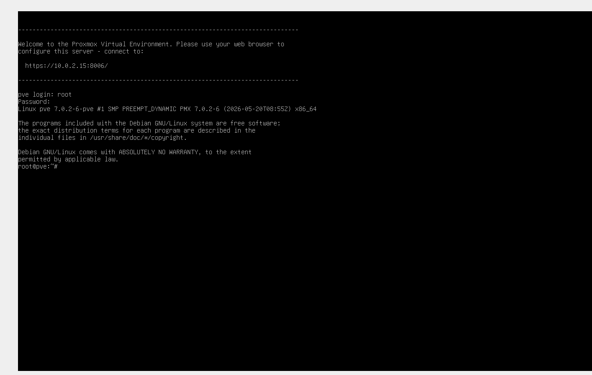

Excelente — agora sim ✅
O Proxmox Web UI está acessível em:
https://localhost:8006

Browser do teu PC
https://localhost:8006
        ↓
VirtualBox NAT forwarding
        ↓
Proxmox dentro da VM
https://10.0.2.15:8006

######################

Objetivo

Entrar na interface gráfica onde vais fazer o Guião 1:

Criar containers LXC
Criar VMs
Configurar redes/bridges
Testar SSH
Preparar base para OPNsense

Agora já saímos da parte de instalação. A partir daqui começa realmente o laboratório.

##################################################

Objetivo

Confirmar a password do utilizador root dentro do container c1.

Este container vai ficar com:

Hostname: c1
User: root
Password: 12345
CT ID: 100

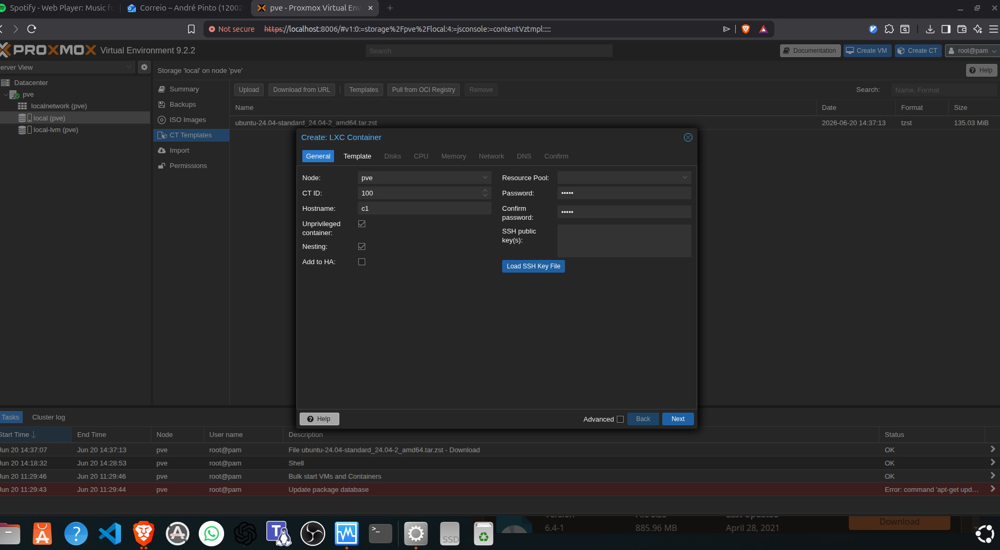


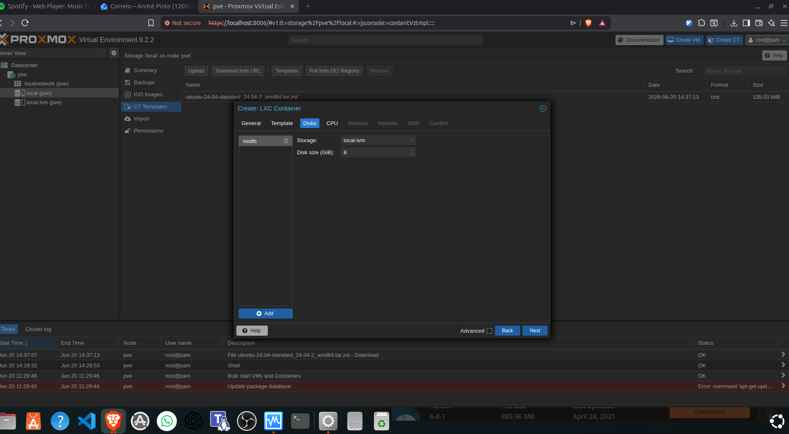

Storage: local-lvm
Disk size: 8 GiB

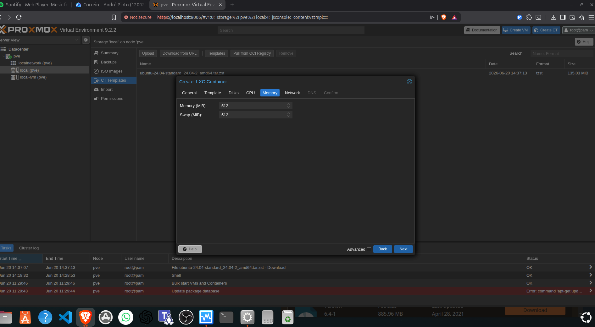

512 MiB  → mínimo apertado
1024 MiB → seguro para laboratório
2048 MiB → desnecessário para C1

########################33

Name: eth0
Bridge: vmbr0
Firewall: marcado
IPv6: Static / None

###############################

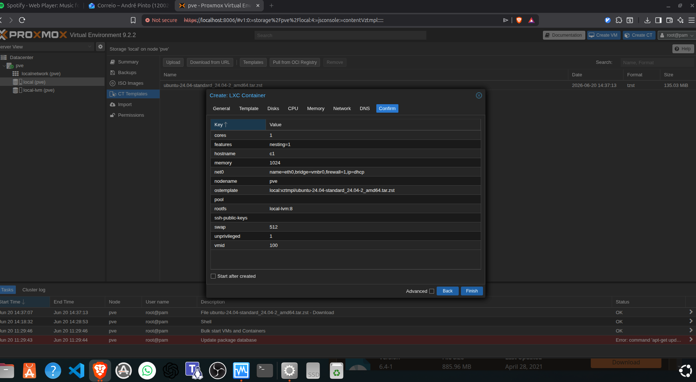


#############################

Excelente. Primeiro LXC criado ✅

Tens agora:

CT 100
Hostname: c1
Ubuntu 24.04
TASK OK

Isto prova que o Proxmox já consegue criar containers.


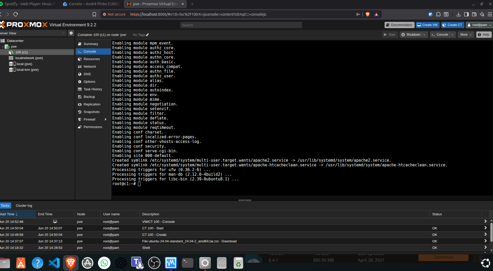

CT 100 / c1
IP: 10.0.2.16
Apache2 instalado
Serviço esperado: porta 80

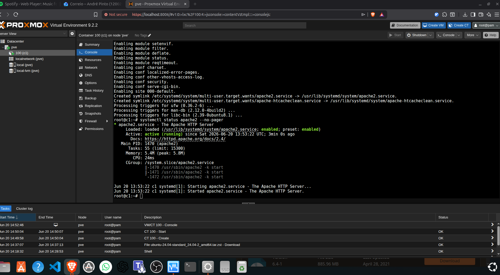

#############################

pve host
  ↓ curl http://10.0.2.16
c1 container
  ↓
Apache2 responde

###########################

Objetivo

Instalar nmap no host Proxmox para fazer scan ao container c1.

Depois vamos testar:

nmap 10.0.2.16

e deverás ver a porta HTTP aberta:

80/tcp open http


c1      = alvo / servidor Apache
pve     = máquina que observa/testa
nmap    = ferramenta de enumeração


Que serviços estão expostos?
Que portas estão abertas?
O que um atacante ou auditor consegue ver?

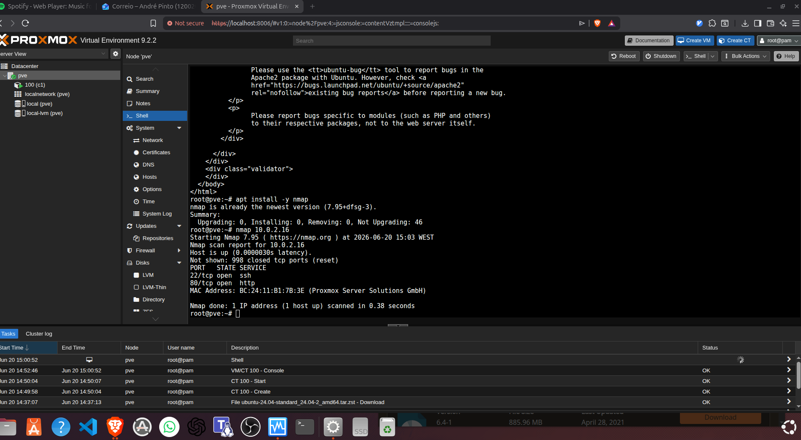

Validação feita ✅

O nmap encontrou:

22/tcp open  ssh
80/tcp open  http

Isto prova que o container c1 está exposto na rede com:

SSH  → porta 22
HTTP → porta 80 / Apache2

Ação — 1 passo

Na Shell do pve, corre:

nmap -sV -p 22,80 10.0.2.16
Objetivo

Descobrir que serviços e versões estão por trás das portas abertas.

O scan anterior respondeu:

porta aberta

Agora queremos algo mais útil para cibersegurança:

porta aberta + serviço + versão provável\

# nmap -sV -p 22,80 10.0.2.16

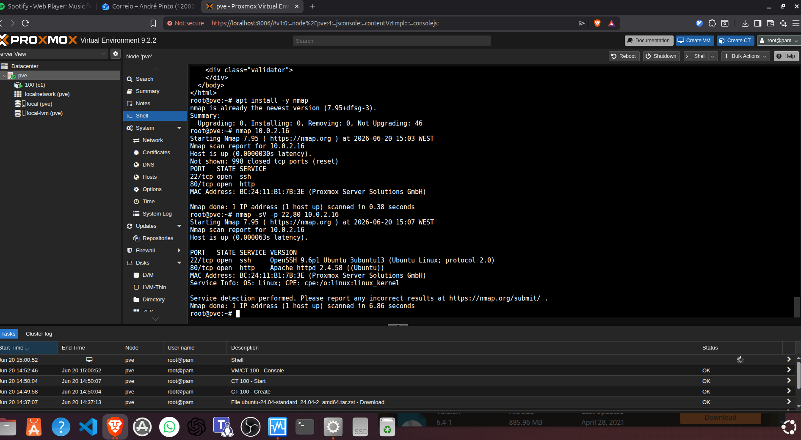


####################

Perfeito — resultado correto ✅

O nmap -sV identificou:

22/tcp open  ssh   OpenSSH 9.6p1 Ubuntu
80/tcp open  http  Apache httpd 2.4.58

Isto prova:

c1 está vivo
SSH está exposto
Apache está exposto
nmap consegue identificar serviços e versões


###############################

Como pensar

Até agora fizeste isto:

pve → nmap/curl → c1

Mas numa topologia de cibersegurança queremos algo mais parecido com:

c2 → nmap/curl → c1

O Proxmox deve ser a infraestrutura, não a máquina de teste.

########################################

Como pensar

Isto é o conceito de golden image / golden container:

1. Preparas uma máquina base
2. Validaste serviços
3. Paras a máquina
4. Clonas
5. Modificas rede/IP/hostname no clone

É muito usado em virtualização real.


# guiao

3.1 Container LXC → ligar à bridge vmbr2 → DHCP → Internet
3.2 VM Kali       → ligar à bridge vmbr2 → DHCP → Internet
3.3 Criar vmbr3   → sem interface física → rede isolada


####################

Como pensar

Tens duas bridges com funções diferentes:

Bridge	No guião	No teu PC	Função
vmbr2	rede do laboratório com Internet	vmbr0	DHCP + Internet
vmbr3	rede isolada	vmbr3	só comunicação entre containers


<@@@@@@3###########3


vmbr2 do guião  ≈  vmbr0 no teu Proxmox

################

| Requisito do guião            | Estado                                        |
| ----------------------------- | --------------------------------------------- |
| Criar container LXC Ubuntu    | ✅ feito: `c1`                                 |
| Ligar à bridge com Internet   | ✅ feito: `vmbr0`                              |
| IP por DHCP                   | ✅ feito: `10.0.2.16`                          |
| Instalar `apache2`            | ✅ feito                                       |
| Instalar `nmap`               | ✅ feito                                       |
| Apache responde               | ✅ feito                                       |
| Acesso por IP/DNS ao exterior | quase validado, mas falta evidência explícita |


Requisito do guião	Estado
Criar container LXC Ubuntu	✅ feito: c1
Ligar à bridge com Internet	✅ feito: vmbr0
IP por DHCP	✅ feito: 10.0.2.16
Instalar apache2	✅ feito
Instalar nmap	✅ feito
Apache responde	✅ feito
Acesso por IP/DNS ao exterior	quase validado, mas falta evidência explícita
Ação — 1 passo

Na consola do c1, corre este comando de evidência:

hostname -I && ping -c 3 8.8.8.8 && ping -c 3 google.com && systemctl is-active apache2 && nmap --version
Objetivo

Fechar o ponto 3.1 com prova clara:

IP atribuído
Internet por IP funciona
DNS funciona
Apache ativo
nmap instalado

Depois disso, sim: passamos para 3.2 — criar a VM Kali.

######################################

Sim — 3.1 está fechado ✅

A evidência está perfeita:

IP atribuído: 10.0.2.17
Ping por IP: 8.8.8.8 OK
Ping por DNS: google.com OK
Apache2: active
nmap: instalado

Portanto o ponto 3.1 — Criação de um container está cumprido.

A vmbr3 já criada não faz mal. Só não a usamos ainda. Ela pertence ao ponto 3.3.

################################################3

# 3.2

c1 Ubuntu LXC → template
Kali VM       → ISO


   3.2 VM Kali + bridge com Internet + DHCP + testar IP/DNS


#####################

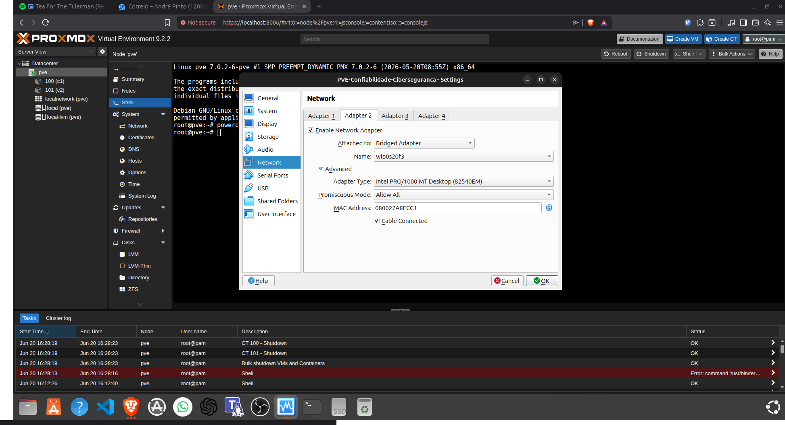

Essa interface será usada para criar:

vmbr2

e cumprir o ponto 3.2:

Kali VM → vmbr2 → DHCP → acesso exterior

Como pensar

O que estamos a construir é isto:

VirtualBox Adapter 1 → Proxmox vmbr0 → gestão do Proxmox
VirtualBox Adapter 2 → Proxmox vmbr2 → rede da Kali

Assim não destruímos o acesso atual ao Proxmox.

VirtualBox Adapter 2
        ↓
NIC nova dentro do Proxmox
        ↓
vmbr2
        ↓
VM Kali

Enable Network Adapter: checked
Attached to: Bridged Adapter
Name: wlp0s20f3
Promiscuous Mode: Allow All
Cable Connected: checked

####################

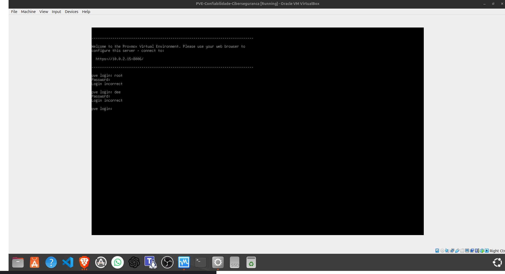

ip -br link

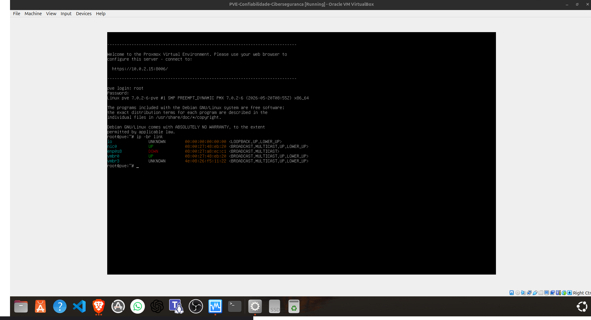

Agora vamos transformar essa NIC em base para a bridge pedida no guião:

enp0s8 → vmbr2 → VM Kali

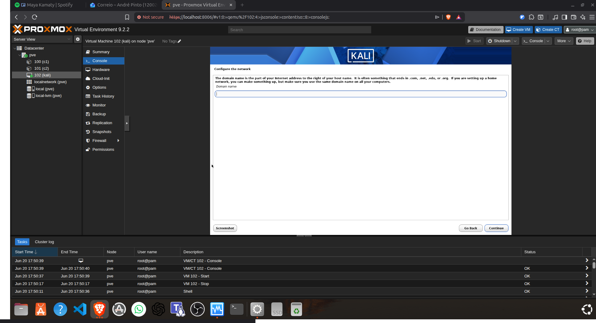

hostname : kali

domain Name : 


##############################


#########################3

DHCP funcionou ✅
IP atribuído ✅
ping externo falhou ❌

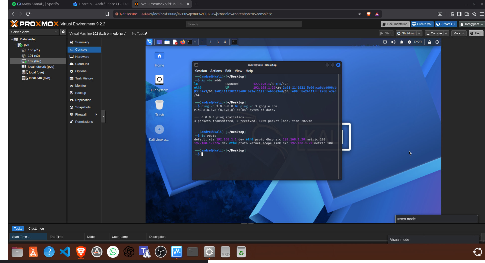

########################

Agora melhorou muito ✅

O output mudou para:

10.42.0.1 lladdr c8:5a:cf:8f:40:37 STALE

Isto significa:

ARP funciona ✅
A Kali já vê o MAC do gateway ✅
A bridge Ethernet está a passar camada 2 ✅

Antes tinhas:

192.168.1.1 FAILED

Agora já tens MAC address. Excelente diagnóstico.

Ação — 1 passo

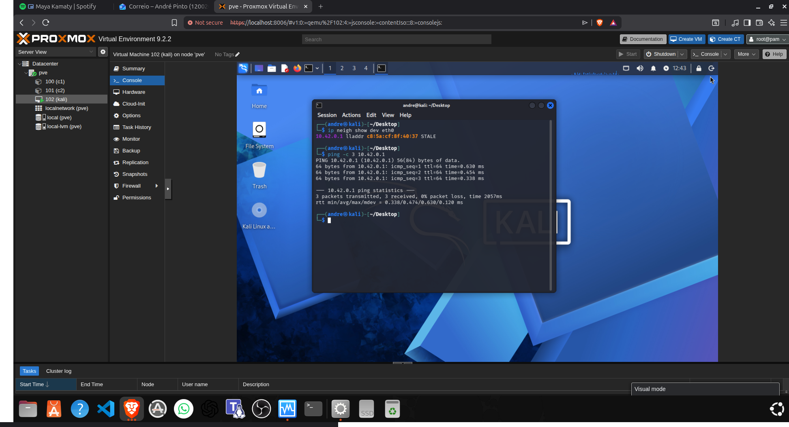

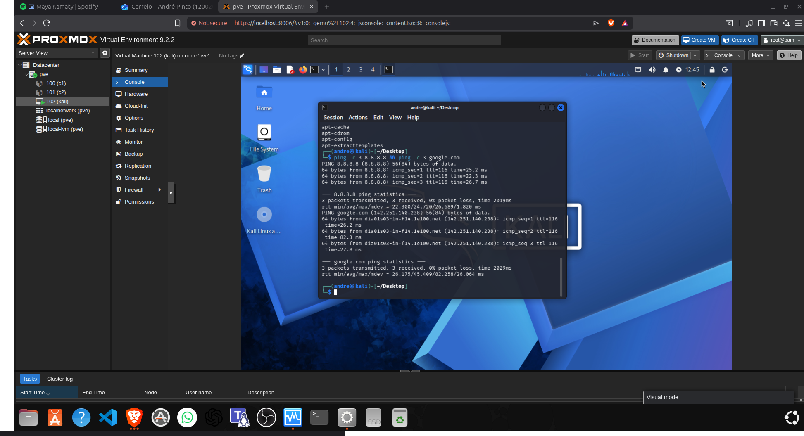

## Sim — a secção **3.2 está feita** ✅

Tens os três requisitos do guião cumpridos:

```txt
VM Kali criada                  ✅
Ligada à bridge vmbr2           ✅
IP por DHCP                     ✅
Acesso exterior por IP          ✅ ping 8.8.8.8
Acesso exterior por DNS         ✅ ping google.com
```

O output prova:

```txt
8.8.8.8       → 0% packet loss
google.com    → resolveu DNS + 0% packet loss
```

## Ação — 1 passo

Guarda este screenshot/output como evidência da **3.2**.

## Objetivo

Ter prova para relatório/validação prática de que a Kali está funcional na rede do laboratório.

## Como pensar

A validação ficou completa porque testaste a cadeia inteira:

```txt
Kali → vmbr2 → Proxmox → VirtualBox bridge Ethernet → gateway → Internet
```

## Pitfalls

1. Se voltares ao Wi-Fi, pode voltar a falhar ARP.
2. Não mudes agora a configuração da Kali.
3. Mantém anotado que `vmbr2` só funcionou bem com Ethernet.
4. A VM Kali está na rede real, portanto cuidado com scans fora do teu ambiente.

## Pergunta de decisão

Avançamos para a **3.3 — criar `vmbr3` isolada sem acesso ao exterior**?


##########################33

## Vamos fechar **3.3** primeiro — rápido ✅

A **3.3** pede:

```txt
Criar vmbr3 sem interface física
Duplicar o container
Colocar dois containers na vmbr3
IP fixo na mesma sub-rede
Confirmar que comunicam entre si
Confirmar que não têm Internet
```

Tu já tens:

```txt
vmbr3 criada ✅
container 100 ✅
container 101 clonado ✅
```

## Ação — 1 passo

Configura os containers **100** e **101** para usarem `vmbr3` com IP fixo:

```txt
CT 100 → Network → net0 → Edit
Bridge: vmbr3
IPv4/CIDR: 192.168.50.10/24
Gateway: vazio

CT 101 → Network → net0 → Edit
Bridge: vmbr3
IPv4/CIDR: 192.168.50.11/24
Gateway: vazio
```

Depois arranca ambos.

## Objetivo

Criar uma rede isolada:

```txt
CT100 ── vmbr3 ── CT101
          │
          └── sem ligação física / sem Internet
```

## Como pensar

`vmbr3` é como um switch virtual desligado do mundo exterior.

Se ambos estiverem na mesma sub-rede:

```txt
192.168.50.10/24
192.168.50.11/24
```

devem conseguir comunicar entre si.

Como não há gateway:

```txt
sem rota default → sem acesso à Internet
```

## Pitfalls

1. Não metas gateway nos containers.
2. Não uses `vmbr2` aqui; agora é `vmbr3`.
3. Se os containers estavam com DHCP antes, muda para IP estático.
4. Se não comunicarem, verifica se ambos estão ligados à mesma bridge.

## Pergunta de decisão

Consegues alterar o `net0` dos CTs **100** e **101** para `vmbr3` com esses IPs?


##############################3

## 3.3 está feita ✅

O teu output prova exatamente o que o guião pede:

```txt
CT100 IP: 192.168.50.10/24
ping CT101 192.168.50.11 → 0% packet loss ✅
ping 8.8.8.8 → Network is unreachable ✅
```

Isto confirma:

```txt
CT100 ── vmbr3 ── CT101     ✅ comunicação interna
          │
          └── sem gateway   ✅ sem Internet
```

## Ação — 1 passo: preparar a 3.4

Na **console do CT101**, corre:

```bash
systemctl is-active ssh || systemctl is-active sshd || ss -tlnp | grep ':22'
```

## Objetivo

Ver se o CT101 já tem servidor SSH ativo. Para a **3.4**, vamos usar:

```txt
CT100 → ssh → CT101
```

Primeiro por password, depois por chave pública/privada.

## Como pensar

Para haver SSH remoto, precisas de dois lados:

```txt
CT100 = cliente SSH
CT101 = servidor SSH
```

A rede entre eles já funciona. Falta saber se o serviço SSH está ativo no CT101.

## Pitfalls

1. Se SSH não estiver instalado, a `vmbr3` não tem Internet para instalar pacotes.
2. Se só existir `ssh client`, não chega; precisas de `openssh-server`.
3. Se o login root por SSH estiver bloqueado, usamos um utilizador normal.
4. Não voltes a pôr gateway na `vmbr3`; senão perdes a prova de isolamento.

## Pergunta de decisão

No CT101, o comando mostra `active` ou não encontra serviço SSH?

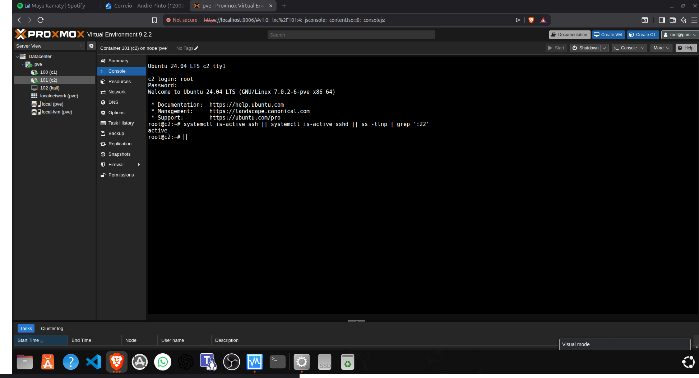

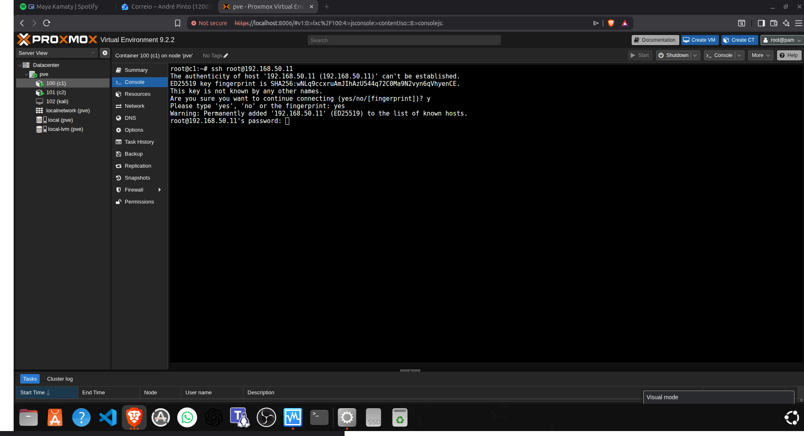

## Excelente — SSH está a funcionar ✅

O ponto importante é este:

```txt
root@192.168.50.11's password:
```

Isto prova que:

```txt
CT100 → vmbr3 → CT101 → porta 22 SSH ✅
```

## Ação — 1 passo

Escreve a **password root do CT101** e carrega **Enter**.

Nota: ao escrever a password, **não aparece nada no ecrã**. Nem `*`, nem pontos. É normal.

## Objetivo

Entrar no CT101 por SSH a partir do CT100, cumprindo a primeira parte da **3.4**.

## Como pensar

Já passaste estas camadas:

```txt
Rede vmbr3       ✅ ping funcionou
Porta SSH        ✅ pediu password
Autenticação     ? falta testar agora
```

## Pitfalls

1. A password não aparece enquanto escreves.
2. Tem de ser a password do **root do CT101**, não do Proxmox.
3. Se falhar, ele pode pedir outra vez.
4. Se der `Permission denied`, depois usamos um utilizador normal ou chave SSH.

## Pergunta de decisão

Conseguiste entrar e ver algo como `root@c2:~#`?


Ação — 1 passo

Na console do CT101, corre:

sed -i 's/^#\?PermitRootLogin.*/PermitRootLogin yes/' /etc/ssh/sshd_config && \
sed -i 's/^#\?PasswordAuthentication.*/PasswordAuthentication yes/' /etc/ssh/sshd_config && \
systemctl restart ssh
Objetivo

Permitir temporariamente:

CT100 → ssh root@192.168.50.11 → CT101

## Chave SSH criada no CT100 ✅

Agora tens:

```txt
private key: /root/.ssh/id_ed25519
public key:  /root/.ssh/id_ed25519.pub
```

A chave privada fica no **CT100**. A pública tem de ir para o **CT101**.

## Ação — 1 passo

No **CT100**, corre:

```bash
ssh-copy-id -i ~/.ssh/id_ed25519.pub root@192.168.50.11
```

Vai pedir a password do `root` do CT101 uma última vez.

## Objetivo

Copiar a chave pública do CT100 para:

```txt
CT101:/root/.ssh/authorized_keys
```

Depois disso, o SSH deve entrar sem password:

```bash
ssh root@192.168.50.11
```

## Como pensar

A lógica é:

```txt
CT100 tem chave privada 🔐
CT101 recebe chave pública 📄
SSH compara as duas
Se bater certo → entra sem password
```

## Pitfalls

1. A password pedida agora ainda é normal.
2. Se `ssh-copy-id` não existir, fazemos manualmente com `cat`.
3. Não copies a chave privada para o CT101.
4. Guarda screenshot do login sem password para prova final.

## Pergunta de decisão

O `ssh-copy-id` funcionou ou diz que o comando não existe?


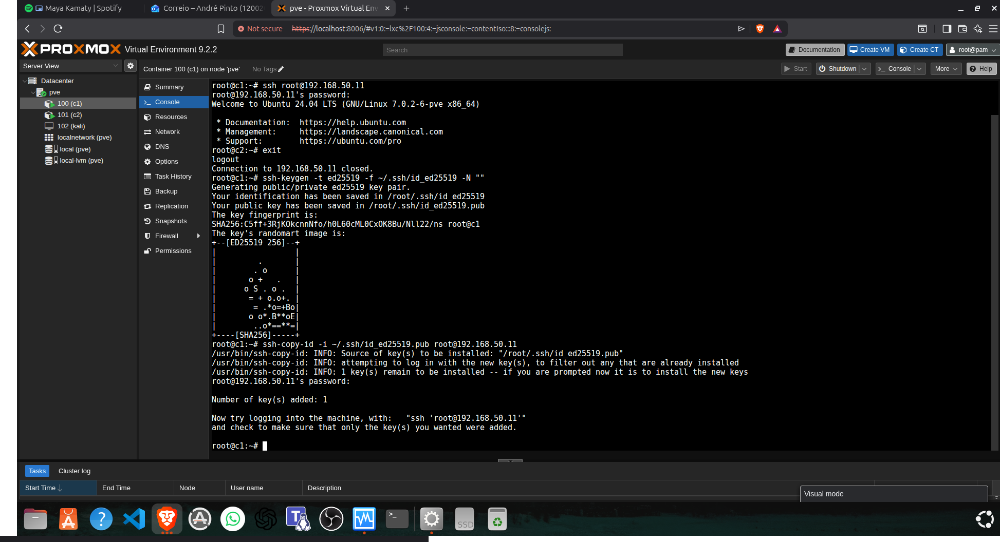


3.2 Kali na vmbr2 com DHCP + Internet + DNS     ✅
3.3 CT100 e CT101 isolados na vmbr3             ✅
3.4 SSH por password CT100 → CT101              ✅
3.4 SSH por chave pública/privada               ✅

## Sim — o **Guião 1 está fechado** ✅

Tens as evidências principais:

```txt
3.2 Kali na vmbr2 com DHCP + Internet + DNS     ✅
3.3 CT100 e CT101 isolados na vmbr3             ✅
3.4 SSH por password CT100 → CT101              ✅
3.4 SSH por chave pública/privada               ✅
```

---

# Resumo para entender bem o guião

## Ação — 1 passo

Escreve no teu relatório/notas esta ideia central:

```txt
O guião demonstra a criação de redes virtuais em Proxmox:
uma rede com acesso exterior, uma rede isolada, e comunicação SSH entre containers.
```

---

# Objetivo do guião

O objetivo não era “instalar máquinas”.
Era perceber **como as bridges virtuais funcionam como switches virtuais**.

Tens esta arquitetura:

```txt
Linux host real
└── VirtualBox
    └── Proxmox VE
        ├── Kali VM
        ├── CT100
        └── CT101
```

Dentro do Proxmox criaste redes virtuais:

```txt
vmbr0 → rede principal / acesso Proxmox
vmbr2 → rede de laboratório com saída para exterior
vmbr3 → rede isolada sem Internet
```

---

# 3.2 — VM Kali ligada à `vmbr2`

Aqui criaste uma VM Kali e ligaste a placa de rede dela à bridge `vmbr2`.

A ideia era:

```txt
Kali → vmbr2 → Proxmox → VirtualBox Adapter 2 → rede exterior
```

Validação feita:

```txt
IP por DHCP        ✅
ping 8.8.8.8      ✅ acesso exterior por IP
ping google.com   ✅ DNS funcional
```

O problema que apareceu foi muito importante:

```txt
DHCP funcionava, mas ping ao gateway falhava.
```

Isto mostrou que **ter IP não prova que a rede está boa**.

O erro inicial foi causado por:

```txt
VirtualBox bridged sobre Wi-Fi
```

Depois mudaste para Ethernet:

```txt
wlp0s20f3  → Wi-Fi     ❌ ARP falhava
enp0s31f6  → Ethernet  ✅ ARP funcionou
```

Conceito-chave:

```txt
DHCP pode funcionar mesmo quando ARP/tráfego L2 está quebrado.
```

---

# 3.3 — Rede isolada com `vmbr3`

Aqui criaste uma bridge sem interface física ligada.

Isto significa:

```txt
vmbr3 = switch virtual isolado
```

Depois ligaste dois containers a essa rede:

```txt
CT100 → 192.168.50.10/24
CT101 → 192.168.50.11/24
```

Sem gateway.

Resultado esperado e confirmado:

```txt
CT100 ping CT101       ✅ funciona
CT100 ping 8.8.8.8     ❌ Network is unreachable
```

Isto prova que:

```txt
CT100 ── vmbr3 ── CT101
          │
          └── sem Internet
```

Conceito-chave:

```txt
Mesma sub-rede permite comunicação local.
Sem gateway não há saída para outras redes.
```

---

# 3.4 — SSH entre containers

Aqui testaste comunicação aplicacional, não só rede.

Primeiro validaste SSH por password:

```txt
CT100 → ssh root@192.168.50.11 → CT101
```

Depois criaste uma chave no CT100:

```txt
/root/.ssh/id_ed25519      chave privada
/root/.ssh/id_ed25519.pub  chave pública
```

Copiaste a chave pública para o CT101:

```bash
ssh-copy-id -i ~/.ssh/id_ed25519.pub root@192.168.50.11
```

E depois entraste sem password:

```txt
root@c1 → ssh root@192.168.50.11 → root@c2
```

Conceito-chave:

```txt
A chave privada fica no cliente.
A chave pública fica no servidor.
```

Neste caso:

```txt
CT100 = cliente SSH
CT101 = servidor SSH
```

---

# Como pensar neste guião

Este guião é sobre **camadas**.

## Camada 2 — Ethernet / ARP / bridge

Pergunta:

```txt
As máquinas conseguem descobrir o MAC umas das outras?
```

Exemplos:

```bash
ip neigh show
```

Problema que viste:

```txt
192.168.1.1 FAILED
```

Significa:

```txt
não consegui resolver o MAC do gateway
```

---

## Camada 3 — IP / routing

Pergunta:

```txt
Existe IP? Existe default gateway?
```

Exemplos:

```bash
ip -br addr
ip route
```

Na Kali viste:

```txt
default via 192.168.1.1
```

Mas isso sozinho não bastava, porque ARP falhava.

---

## Camada 4/7 — Serviço SSH

Pergunta:

```txt
A porta 22 está ativa? A autenticação funciona?
```

Exemplos:

```bash
systemctl is-active ssh
ssh root@192.168.50.11
```

---

# Pitfalls principais

1. **Confundir IP com gateway**

   Isto estava errado:

   ```txt
   Gateway: 192.168.50.11/24
   ```

   Correto:

   ```txt
   IPv4/CIDR: 192.168.50.11/24
   Gateway: vazio
   ```

2. **Assumir que DHCP prova tudo**

   DHCP funcionou na Kali, mas ARP falhava.
   A rede ainda estava quebrada.

3. **Wi-Fi bridged em nested virtualization**

   Muito instável quando há múltiplos MACs atrás da bridge.

4. **SSH root bloqueado**

   O SSH estava ativo, mas inicialmente bloqueava login root. Tiveste de permitir temporariamente no laboratório.

---

# Frase de relatório pronta

Podes escrever algo assim:

```txt
Neste guião configurei diferentes redes virtuais em Proxmox VE. A VM Kali foi ligada à bridge vmbr2 e obteve acesso ao exterior por DHCP, validado com ping por IP e DNS. Depois criei uma rede isolada usando vmbr3, onde dois containers comunicam entre si por IP fixo mas não têm acesso à Internet por ausência de gateway. Por fim, validei comunicação SSH entre containers, primeiro por password e depois por autenticação baseada em chave pública/privada.
```

---

# Pergunta de decisão

Queres agora um **resumo ainda mais curto para escrever à mão no caderno**, ou um **texto mais formal para entregar no relatório**?
