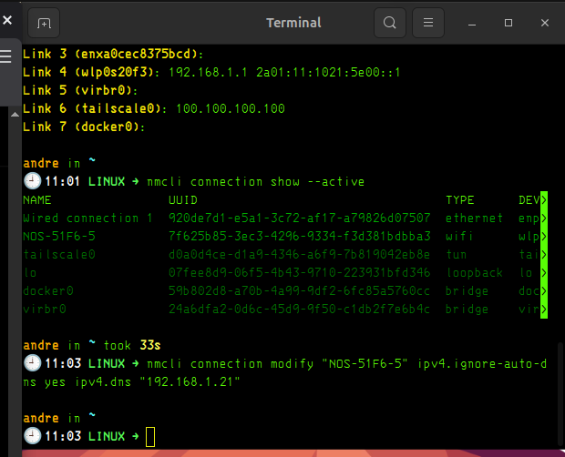
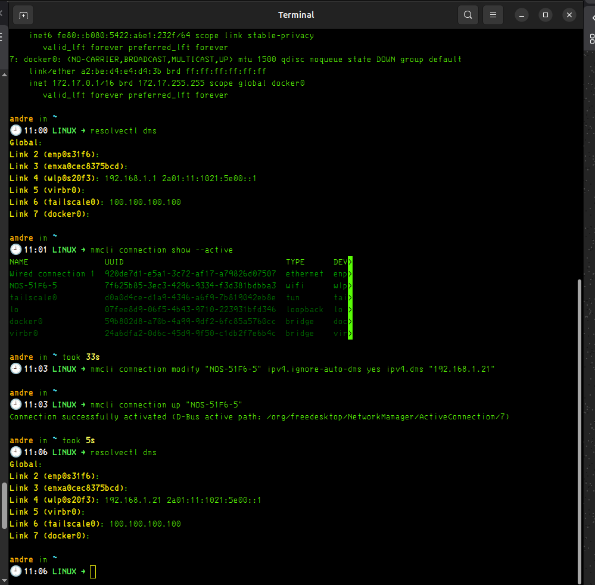
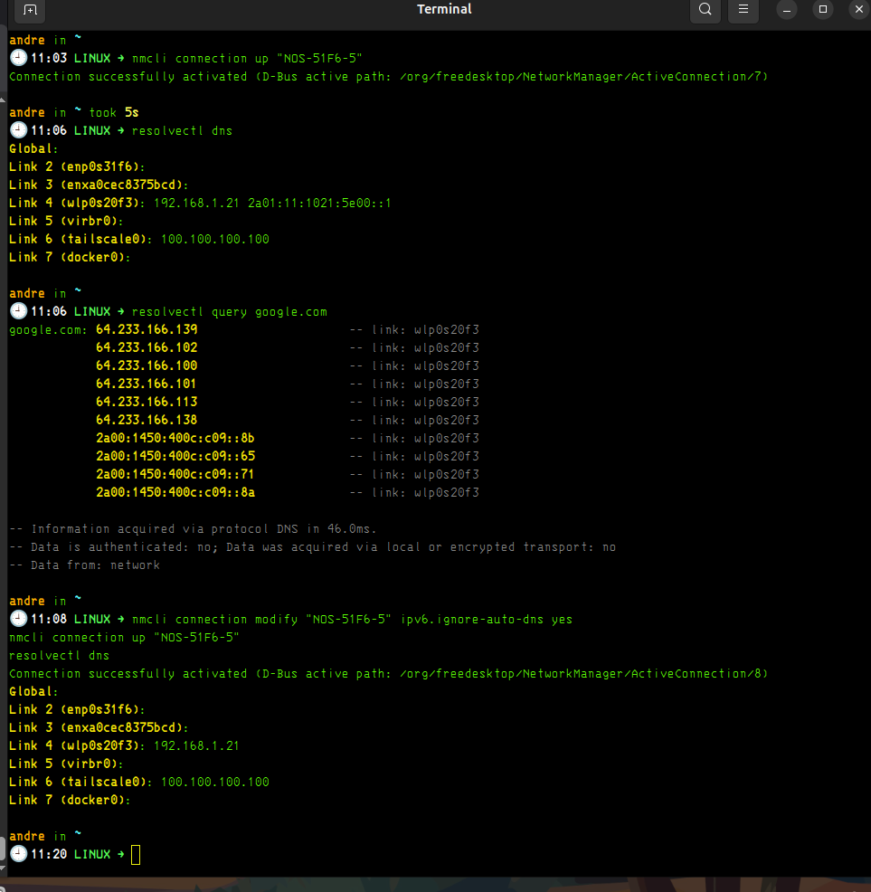
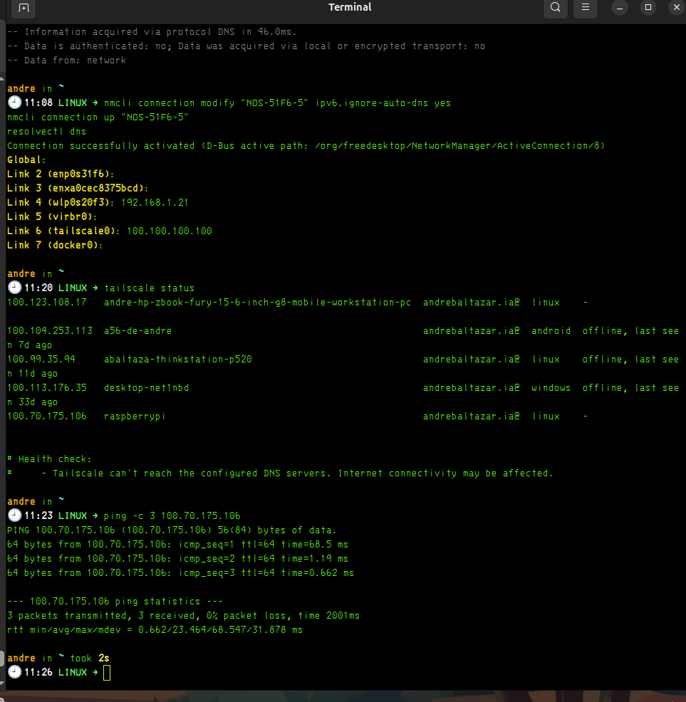
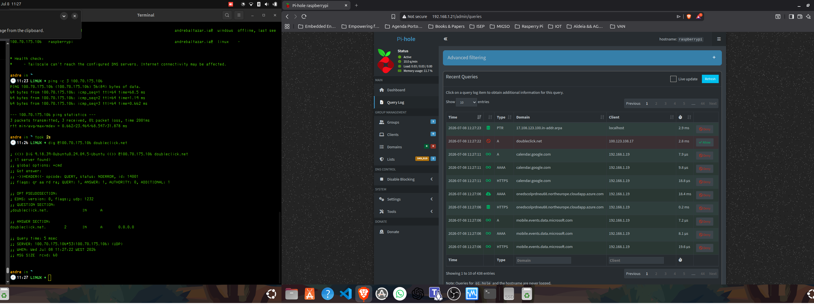

---

Inicialmente, o meu portátil estava na rede 192.168.1.0/24 com IP 192.168.1.19, mas o DNS recebido por DHCP era o router 192.168.1.1. Portanto, apesar de o Pi-hole estar ativo no Raspberry Pi em 192.168.1.21, o portátil não estava a usar diretamente o Pi-hole como resolver DNS. Depois alterei a configuração da ligação Wi-Fi no NetworkManager para ignorar o DNS automático do router e usar 192.168.1.21 como DNS.

----

| Componente     | Função                            |
| -------------- | --------------------------------- |
| `192.168.1.19` | IP do portátil                    |
| `192.168.1.21` | Pi-hole / DNS resolver            |
| `192.168.1.1`  | Router / gateway                  |
| `wlp0s20f3`    | interface Wi-Fi do portátil       |
| `tailscale0`   | interface VPN, não é a rede local |


----

# WOW

Laptop Linux
IP: 192.168.1.19
DNS IPv4: 192.168.1.21
        ↓
Raspberry Pi / Pi-hole
IP: 192.168.1.21

---

## Confirmado — funcionou mesmo ✅🧠

O teu teste provou isto:

```text
Laptop Linux
IP: 192.168.1.19
DNS IPv4: 192.168.1.21
        ↓
Raspberry Pi / Pi-hole
IP: 192.168.1.21
```

E o dashboard do Pi-hole reagiu: passou para **167 queries** e aparece mais atividade. Isso é exatamente o comportamento esperado quando o portátil começa a mandar pedidos DNS para o Pi-hole.

## O que acabaste de aprender

A diferença crítica é esta:

| Conceito           |                 Antes |                Depois |
| ------------------ | --------------------: | --------------------: |
| Gateway / Internet |         `192.168.1.1` |         `192.168.1.1` |
| DNS IPv4           |         `192.168.1.1` |        `192.168.1.21` |
| Cliente            | laptop `192.168.1.19` | laptop `192.168.1.19` |
| Resolver DNS       |                router |               Pi-hole |

Ou seja: **não mudaste a Internet do portátil**. Mudaste **quem resolve nomes** tipo `google.com`.

## Frase boa para exame

> Configurei o portátil Linux para usar o Pi-hole como resolver DNS. O portátil continuou a usar o router como gateway, mas alterei o DNS da ligação Wi-Fi no NetworkManager para apontar para o Raspberry Pi em `192.168.1.21`. Validei com `resolvectl dns` e depois confirmei no dashboard do Pi-hole pelo aumento de queries.

## Ação: próximo passo

Agora abre no Pi-hole:

```text
Query Log
```

e confirma se aparecem queries do cliente:

```text
192.168.1.19
```

## Objetivo

Isso fecha a prova prática:

```text
resolvectl no laptop
+
Query Log no Pi-hole
=
evidência completa
```

## Pitfalls

* Ainda tens DNS IPv6 do router: `2a01:...`
* Alguns browsers podem usar DNS-over-HTTPS.
* O dashboard geral mostra queries, mas o **Query Log por cliente** é a prova mais forte.
* “Blocked 0%” é normal se ainda não testaste domínios bloqueados.

**Pergunta de decisão:** queres agora fechar o bypass IPv6 ou primeiro testar um domínio de ads para ver o Pi-hole bloquear?


---

# Melhor estratégia

        Para segurança real, bloqueia por categoria de risco:

Boa ideia	Má ideia inicial
malware domains	bloquear países inteiros
phishing domains	bloquear .cn, .in, etc. cegamente
trackers	bloquear CDNs globais
telemetry agressiva	bloquear tudo “suspeito”
crypto/scam domains	bloquear por preconceito geográfico
Regra de engenharia

>Primeiro mede. Depois bloqueia. Depois confirma que não partiste nada.

---


## Sim — boa ideia ✅ Mas faz de forma controlada

Para **phishing + malware**, eu adicionava **uma lista de segurança dedicada**, não 10 listas ao mesmo tempo.

A melhor próxima escolha: **HaGeZi Threat Intelligence Feeds — Medium**. Ela é feita para bloquear **malware, cryptojacking, scam, spam, phishing e C2 servers**; a versão full é muito grande, e o próprio projeto recomenda medium/mini quando se quer reduzir carga/memória. ([GitHub][1])

## Ação: adicionar 1 lista de segurança

No Pi-hole:

```text
Group Management / Lists
```

Adiciona este URL:

```text
https://cdn.jsdelivr.net/gh/hagezi/dns-blocklists@latest/adblock/tif.medium.txt
```

Comentário:

```text
HaGeZi TIF Medium - phishing malware scam C2
```

Depois vai a:

```text
Tools → Update Gravity
```

O Pi-hole usa o **Gravity** para ir buscar as listas subscritas, consolidar os domínios e recarregar o DNS; também dá para forçar manualmente a atualização. ([Pi-hole Documentation][2])

## Objetivo

Adicionar proteção contra:

| Categoria     | Exemplo                               |
| ------------- | ------------------------------------- |
| Phishing      | domínios falsos de login/banco/crypto |
| Malware       | domínios que distribuem payloads      |
| Scam          | lojas falsas, fraude                  |
| C2            | command-and-control de malware        |
| Cryptojacking | scripts/domínios de mineração abusiva |

## Sobre OISD

Também é uma boa lista geral. A `oisd big` bloqueia ads, phishing, malvertising, malware, spyware, ransomware, cryptojacking e tracking, tentando manter poucos falsos positivos. ([oisd.nl][3]) Mas neste momento eu **não misturava já tudo**. Primeiro HaGeZi TIF Medium, testar, depois decidimos.

## Pitfalls

* Não adicionas 10 listas de uma vez: depois, se algo partir, não sabes qual causou.
* Listas “full” enormes podem aumentar uso de memória.
* Bloqueio DNS não substitui updates, 2FA, passwords fortes e firewall.
* Não bloqueies países inteiros já; bloqueia **comportamento malicioso**, não geografia.

**Pergunta de decisão:** depois do `Update Gravity`, quantos domínios aparecem no Pi-hole?

[1]: https://github.com/hagezi/dns-blocklists "GitHub - hagezi/dns-blocklists: DNS-Blocklists: For a better internet - keep the internet clean! · GitHub"
[2]: https://docs.pi-hole.net/main/pihole-command/ "The  pihole  Command - Pi-hole documentation"
[3]: https://oisd.nl/setup/pihole "oisd | Set up"


---

| Opção                     | Quando usar                                                                                                                       |
| ------------------------- | --------------------------------------------------------------------------------------------------------------------------------- |
| **OISD**                  | se quiseres mais bloqueio geral com poucos falsos positivos; o projeto declara foco em ads, malware e privacidade. ([oisd.nl][1]) |
| **HaGeZi Normal/Pro**     | se quiseres substituir ou reforçar bloqueio geral                                                                                 |
| **Regex/wildcard manual** | só para domínios que tu observaste no Query Log                                                                                   |
| **Bloquear DoH**          | para impedir browsers/apps de contornar o Pi-hole                                                                                 |
| **DHCP no Pi-hole**       | para toda a rede usar Pi-hole automaticamente                                                                                     |

[1]: https://oisd.nl/?utm_source=chatgpt.com "oisd | domain blocklist"


---



---

# ISEP 

## Sim — agora está bom para casa ✅

O que fizeste foi isto:

```text
Antes:
Wi-Fi DNS = 192.168.1.1 + DNS IPv6 do router

Depois:
Wi-Fi DNS = 192.168.1.21
```

Ou seja:

| Coisa               | Estado agora                       |
| ------------------- | ---------------------------------- |
| IP do portátil      | continua normal                    |
| Gateway / Internet  | continua o router                  |
| DNS IPv4            | Pi-hole `192.168.1.21` ✅           |
| DNS IPv6 automático | removido ✅                         |
| Pi-hole             | agora recebe queries do portátil ✅ |

Importante: **não desligaste IPv6 inteiro**. Só removeste o **DNS IPv6 automático** do router. O portátil ainda pode usar IPv6, mas as queries DNS do Wi-Fi passam pelo Pi-hole via `192.168.1.21`.

Isto encaixa bem no teu objetivo de usar Raspberry Pi 5 como servidor pessoal com serviços de rede, Tailscale e Nextcloud. 

---

## Vai funcionar fora de casa, no ISEP?

**Não automaticamente.** No ISEP estás noutra rede. O IP:

```text
192.168.1.21
```

é um IP privado da tua rede de casa. Fora de casa, esse IP normalmente **não é acessível**.

### Em casa

```text
Laptop → 192.168.1.21 → Pi-hole ✅
```

### No ISEP

```text
Laptop → tenta 192.168.1.21 → não encontra ❌
```

A menos que uses **Tailscale** para chegar ao Raspberry. O teu contexto já tem Tailscale como parte da arquitetura remota: Internet → Tailscale VPN → Raspberry Pi 5. 

---

## Ação: próximo passo

No laptop, corre:

```bash
tailscale status
```

## Objetivo

Encontrar o IP Tailscale do Raspberry Pi, algo tipo:

```text
100.x.x.x raspberrypi
```

Esse IP `100.x.x.x` é o candidato para usar Pi-hole fora de casa, via VPN.

## Como pensar

Há dois caminhos diferentes:

```text
Em casa:
DNS = 192.168.1.21

Fora de casa:
DNS = IP Tailscale do Raspberry, tipo 100.x.x.x
```

Não exponhas o Pi-hole diretamente à Internet pela porta `53`. Para fora de casa, a via certa é **VPN/Tailscale**, não abrir DNS público.

## Pitfalls

* `192.168.1.21` só serve dentro da tua LAN.
* No ISEP, a rede pode bloquear DNS externo.
* Tailscale tem o seu próprio DNS `100.100.100.100`, por isso temos de pensar bem antes de mexer.
* Não configurar Pi-hole como DNS público aberto.

**Pergunta de decisão:** no `tailscale status`, qual é o IP `100.x.x.x` do Raspberry Pi?




---


