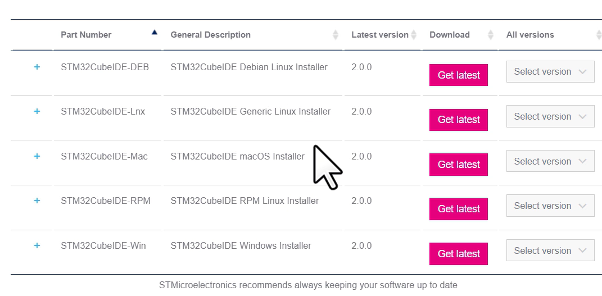

## What is a program ?
    - A program is a series of instructions that cause a computer or a micocontroller to perform a particular task.
    - A computer program includes more than just instructions. It also contains data at very memory addresses on wich the instructioins work to perform a specific task. 

Languages commonly used:
    - Rust xx
    -C and C++
    - Assembly x
    - Java 
    - Python 

In the course they will use the **Eclipse-based STM32CubeIDE** wich is develloped by ST Microelectronics.

i have to go and download in 
    https://www.st.com/en/development-tools/stm32cubeide.html

