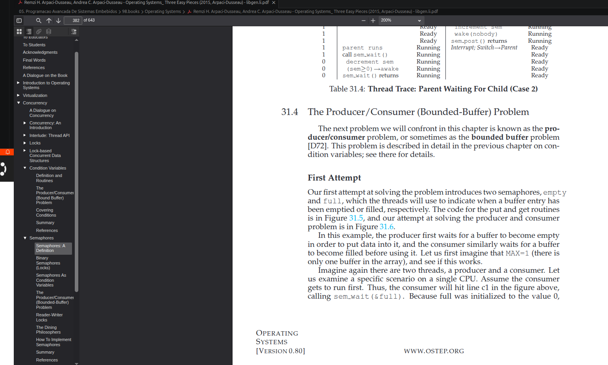

| Fase                  | Protegida por mutex? | Porquê                     |
| --------------------- | -------------------: | -------------------------- |
| Criar `sample` local  |                    ❌ | só esta thread usa         |
| Inserir no buffer     |                    ✅ | buffer é partilhado        |
| Dormir aleatoriamente |                    ❌ | não deve bloquear o buffer |


samples[]
count
write_idx
condition variables

## Ação — 1 passo 🧭

Sim ✅

Depois do **consumer** consumir uma sample e fazer:

```c
buffer.count--;
```

ele deve sinalizar:

```c
pthread_cond_signal(&buffer.buffer_can_write);
```

## Objetivo

Avisar os producers:

```text
há espaço livre no buffer
podem tentar escrever
```

## Como pensar

O consumer faz isto:

```text
remove uma sample
count diminui
buffer deixa de estar cheio
```

Logo, ele tornou verdadeira esta condição:

```text
buffer can write
```

Então sinaliza:

```c
buffer_can_write
```

Tabela final:

| Thread   | Quando bloqueia | Wait               | Depois de agir  | Signal             |
| -------- | --------------- | ------------------ | --------------- | ------------------ |
| Producer | buffer cheio    | `buffer_can_write` | escreveu sample | `buffer_can_read`  |
| Consumer | buffer vazio    | `buffer_can_read`  | consumiu sample | `buffer_can_write` |

## Pitfalls & troubleshooting

1. `wait` é aquilo que a thread precisa.
2. `signal` é aquilo que a thread acabou de tornar possível.
3. Producer não sinaliza `buffer_can_write`.
4. Consumer não sinaliza `buffer_can_read`.

## Alternativas / tradeoffs

| Função                     | Quando usar                   |
| -------------------------- | ----------------------------- |
| `pthread_cond_signal()`    | acordar uma thread            |
| `pthread_cond_broadcast()` | acordar várias threads        |
| Aqui                       | `signal()` chega para começar |

## Pergunta de decisão

Queres agora tentar escrever sozinho o bloco crítico do `producer()` com estas quatro linhas: escrever sample, avançar `write_idx`, fazer `count++`, sinalizar `buffer_can_read`?
## Ação — 1 passo 🧭

Sim ✅

Depois do **consumer** consumir uma sample e fazer:

```c
buffer.count--;
```

ele deve sinalizar:

```c
pthread_cond_signal(&buffer.buffer_can_write);
```

## Objetivo

Avisar os producers:

```text
há espaço livre no buffer
podem tentar escrever
```

## Como pensar

O consumer faz isto:

```text
remove uma sample
count diminui
buffer deixa de estar cheio
```

Logo, ele tornou verdadeira esta condição:

```text
buffer can write
```

Então sinaliza:

```c
buffer_can_write
```

Tabela final:

| Thread   | Quando bloqueia | Wait               | Depois de agir  | Signal             |
| -------- | --------------- | ------------------ | --------------- | ------------------ |
| Producer | buffer cheio    | `buffer_can_write` | escreveu sample | `buffer_can_read`  |
| Consumer | buffer vazio    | `buffer_can_read`  | consumiu sample | `buffer_can_write` |

## Pitfalls & troubleshooting

1. `wait` é aquilo que a thread precisa.
2. `signal` é aquilo que a thread acabou de tornar possível.
3. Producer não sinaliza `buffer_can_write`.
4. Consumer não sinaliza `buffer_can_read`.

## Alternativas / tradeoffs

| Função                     | Quando usar                   |
| -------------------------- | ----------------------------- |
| `pthread_cond_signal()`    | acordar uma thread            |
| `pthread_cond_broadcast()` | acordar várias threads        |
| Aqui                       | `signal()` chega para começar |

## Pergunta de decisão

Queres agora tentar escrever sozinho o bloco crítico do `producer()` com estas quatro linhas: escrever sample, avançar `write_idx`, fazer `count++`, sinalizar `buffer_can_read`?


---

# OSTEP



---

## Ação — próximo passo 🎯

Sim: **essas linhas estão bem fora do lock**.

Agora escreve **só a primeira linha do bloco crítico**, logo depois do `while`:

```c
buffer.samples[buffer.write_idx] = sample;
```

Ainda não avances índice, ainda não faças `count++`, ainda não sinalizes.

---

## Objetivo

Perceber exatamente **o que precisa de mutex**.

Esta linha precisa de estar dentro do lock porque mexe no buffer partilhado:

```c
buffer.samples[buffer.write_idx] = sample;
```

Ou seja, mexe em:

```c
buffer.samples
buffer.write_idx
```

---

## Como pensar

O producer faz duas fases:

### 1. Fora do lock — trabalho privado

```c
sample.value = random_between(0, 1000);
snprintf(sample.sensor, sizeof(sample.sensor), "sensor-%ld", id);
```

Isto é privado da thread. Cada producer tem o seu próprio `sample`.

### 2. Dentro do lock — mexer no buffer partilhado

```c
pthread_mutex_lock(&buffer.lock);

while (buffer.count == BUFFER_SIZE) {
    pthread_cond_wait(&buffer.buffer_can_write, &buffer.lock);
}

buffer.samples[buffer.write_idx] = sample;

pthread_mutex_unlock(&buffer.lock);
```

Aqui o mutex protege o estado global do buffer.

---

## Nota importante sobre `pthread_cond_wait` ⚠️

Quando fazes:

```c
pthread_cond_wait(&buffer.buffer_can_write, &buffer.lock);
```

acontece isto:

```text
1. thread está com o lock
2. vê que buffer está cheio
3. pthread_cond_wait liberta o lock automaticamente
4. thread adormece
5. quando recebe signal, acorda
6. volta a tentar adquirir o lock
7. só depois continua
```

Portanto: **não fica a dormir segurando o mutex**. Esse é o ponto central.

---
## Pergunta de decisão

Depois desta linha:

```c
buffer.samples[buffer.write_idx] = sample;
```

qual é a próxima variável que tens de atualizar: `read_idx`, `write_idx`, ou `count` primeiro?


oensei em ciount depoiis de esccrever.
---

## Ação — pequena correção 🔧

`count` é **uma das próximas**, mas eu escolheria primeiro:

```c
buffer.write_idx = (buffer.write_idx + 1) % BUFFER_SIZE;
```

Depois vem:

```c
buffer.count++;
```

---

## Objetivo

Manter esta sequência mental:

```text
1. escrevi no slot atual
2. avancei o ponteiro de escrita
3. aumentei o número de elementos válidos
```

---

## Como pensar

Neste momento já fizeste:

```c
buffer.samples[buffer.write_idx] = sample;
```

Ou seja:

```text
samples[write_idx] agora tem dados válidos
```

Agora o producer deve preparar a **próxima posição de escrita**:

```c
buffer.write_idx = (buffer.write_idx + 1) % BUFFER_SIZE;
```

Só depois atualizas o estado quantitativo:

```c
buffer.count++;
```

Tecnicamente, como ainda estás dentro do mutex, `count++` antes de `write_idx` podia funcionar **desde que não sinalizes antes de completar tudo**. Mas para raciocínio de engenharia, esta ordem é mais limpa.

---

## Pitfalls

1. **Fazer `count++` e esquecer `write_idx`**
   O próximo producer vai escrever por cima da mesma posição.

2. **Fazer `write_idx++` sem `% BUFFER_SIZE`**
   Eventualmente vais aceder fora do array.

3. **Sinalizar antes de atualizar tudo**
   Má prática. Primeiro deixas o estado consistente, depois sinalizas.

---

## Pergunta de decisão

Completa agora só esta linha:

```c
buffer.write_idx = (buffer.write_idx + 1) % ________;
```

Que constante entra no espaço?

---

# explicacao do modulo

## Ação — correção curta 🔧

Sim, entra:

```c
BUFFER_SIZE
```

Linha completa:

```c
buffer.write_idx = (buffer.write_idx + 1) % BUFFER_SIZE;
```

Mas atenção: **o `% BUFFER_SIZE` não depende de o buffer estar cheio**.

Ele serve só para manter o índice dentro do array.

---

## Objetivo

Garantir que `write_idx` anda assim:

```text
0 → 1 → 2 → 3 → ... → 8 → 9 → 0 → 1 → ...
```

Como `BUFFER_SIZE` é `10`, os índices válidos são:

```text
0 1 2 3 4 5 6 7 8 9
```

Nunca podes ir para `10`, porque `samples[10]` está fora do array.

---

## Como pensar

O operador `%` dá o **resto da divisão**.

Exemplos:

```c
1 % 10  == 1
2 % 10  == 2
8 % 10  == 8
9 % 10  == 9
10 % 10 == 0
11 % 10 == 1
```

Então:

```c
(buffer.write_idx + 1) % BUFFER_SIZE
```

significa:

```text
avança 1 posição;
se chegar ao fim do array, volta para 0.
```

Exemplo crítico:

```c
buffer.write_idx = 9;
buffer.write_idx = (buffer.write_idx + 1) % 10;
```

Fica:

```c
buffer.write_idx = 10 % 10;  // resultado 0
```

Portanto volta ao início.

---

## Pitfalls

1. **Confundir `write_idx` com `count`**
   `write_idx` diz onde escrever.
   `count` diz quantos elementos existem.

2. **Pensar que `%` só atua quando o buffer está cheio**
   Não. O `%` é calculado sempre.

3. **Pensar que `10 % 10` dá `1`**
   Não. Dá `0`.

4. **Usar `buffer_size` em minúsculas**
   Errado neste código. A macro é:

```c
BUFFER_SIZE
```

---

## Pergunta de decisão

Sem compilar ainda: que valores esperas aqui?

```c
(8 + 1) % 10 = ?
(9 + 1) % 10 = ?
(0 + 1) % 10 = ?
```
---

## Ação — correção mínima 🔧

Aqui é:

```c
pthread_cond_signal(&buffer.buffer_can_read);
```

Não é `buffer_can_write`.

---

## Objetivo

Associar o **signal** ao que acabou de mudar no sistema.

O producer acabou de fazer isto:

```c
buffer.count++;
```

Logo, agora existe **mais dados para ler**.

Então deve acordar quem está à espera de dados:

```text
consumer → espera em buffer_can_read
```

---

## Como pensar

Pergunta sempre assim:

```text
Depois da minha ação, quem ficou desbloqueado?
```

Neste caso:

```text
producer escreveu uma sample
→ buffer já não está vazio
→ consumer pode ler
→ signal buffer_can_read
```

Tabela:

| Quem atua | O que muda     | Quem pode acordar | Signal             |
| --------- | -------------- | ----------------- | ------------------ |
| Producer  | adiciona dados | Consumer          | `buffer_can_read`  |
| Consumer  | liberta espaço | Producer          | `buffer_can_write` |

---

## Pergunta de decisão

Completa agora o bloco todo dentro do lock:

```c
buffer.samples[buffer.write_idx] = sample;
buffer.write_idx = (buffer.write_idx + 1) % BUFFER_SIZE;
buffer.count++;
pthread_cond_signal(&buffer.__________);
```

Qual é o nome completo que entra no espaço?

buffer_can_read
---

## Ação — interpretação do output 🧠

O teu código **está provavelmente correto**. O que te está a confundir é isto:

```text
consumer aparece no terminal antes do producer
```

Mas isso **não quer dizer** que o consumer consumiu antes de o producer produzir.

Quer dizer apenas que o `printf()` do consumer foi executado/imprimido antes do `printf()` do producer.

---

## Objetivo

Separar duas coisas diferentes:

| Coisa                | Significado                               |
| -------------------- | ----------------------------------------- |
| Ordem real dos dados | protegida por mutex + condition variables |
| Ordem dos `printf()` | depende do scheduler do Linux             |

O consumer **não consegue passar daqui**:

```c
while (buffer.count == 0) {
    pthread_cond_wait(&buffer.buffer_can_read, &buffer.lock);
}
```

até o producer fazer:

```c
buffer.count++;
pthread_cond_signal(&buffer.buffer_can_read);
```

Portanto, se o consumer imprimiu `value=412`, essa `sample` **já tinha sido produzida**.

---

## Como pensar

O que pode acontecer é esta sequência:

```text
1. producer cria sample value=412
2. producer entra no lock
3. producer escreve no buffer
4. producer faz count++
5. producer sinaliza buffer_can_read
6. producer faz unlock
7. Linux troca para o consumer
8. consumer lê value=412
9. consumer imprime primeiro
10. Linux volta ao producer
11. producer imprime depois
```

Ou seja:

```text
produção real aconteceu antes
print do consumer apareceu antes
```

Isto é normal em programas multithread.

---

## Pitfall importante ⚠️

Vejo no teu output algo tipo:

```text
[producer 1] producer_consumed sensor-1 value=412
```

Esse texto está mau semanticamente. O producer não “consome”.

Usa nomes claros:

```c
printf("[producer %ld] produced %s value=%d\n",
       id, sample.sensor, sample.value);
```

e no consumer:

```c
printf("[consumer %ld] consumed %s value=%d\n",
       id, sample.sensor, sample.value);
```

---

## Próximo passo pequeno

Para veres a ordem real, adiciona temporariamente no producer, **logo depois de `count++` e antes do `signal`**:

```c
printf("[producer %ld] PRODUCED %s value=%d count=%d\n",
       id, sample.sensor, sample.value, buffer.count);
```

Isto é só para debug. Depois podes tirar para reduzir o tempo dentro do lock.

---

## Pergunta de decisão

Queres agora confirmar a ordem com prints de debug dentro do lock, ou avançar para testar com **4 producers / 2 consumers**?


---

# LAB2 Ex3.2 — Circular bounded buffer

Resolvido com:
- `samples[BUFFER_SIZE]`
- `count`
- `read_idx`
- `write_idx`
- `pthread_mutex_t lock`
- `pthread_cond_t buffer_can_read`
- `pthread_cond_t buffer_can_write`

Producer:
- espera se `count == BUFFER_SIZE`
- escreve em `samples[write_idx]`
- avança `write_idx = (write_idx + 1) % BUFFER_SIZE`
- faz `count++`
- sinaliza `buffer_can_read`

Consumer:
- espera se `count == 0`
- lê de `samples[read_idx]`
- avança `read_idx = (read_idx + 1) % BUFFER_SIZE`
- faz `count--`
- sinaliza `buffer_can_write`

Ideia principal:
- condition variables evitam polling
- mutex protege apenas estado partilhado
- lock deve ser pequeno

