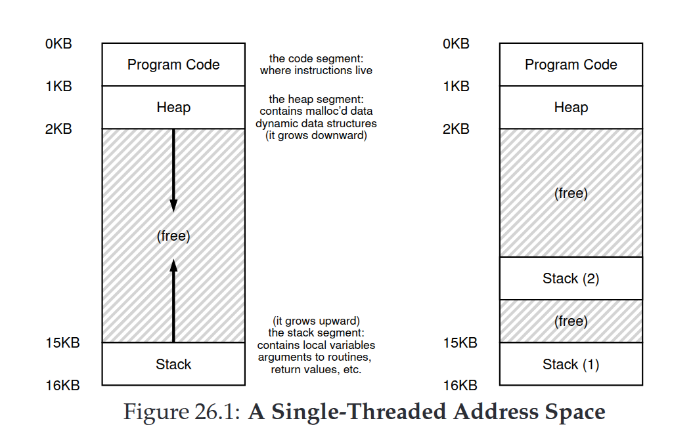
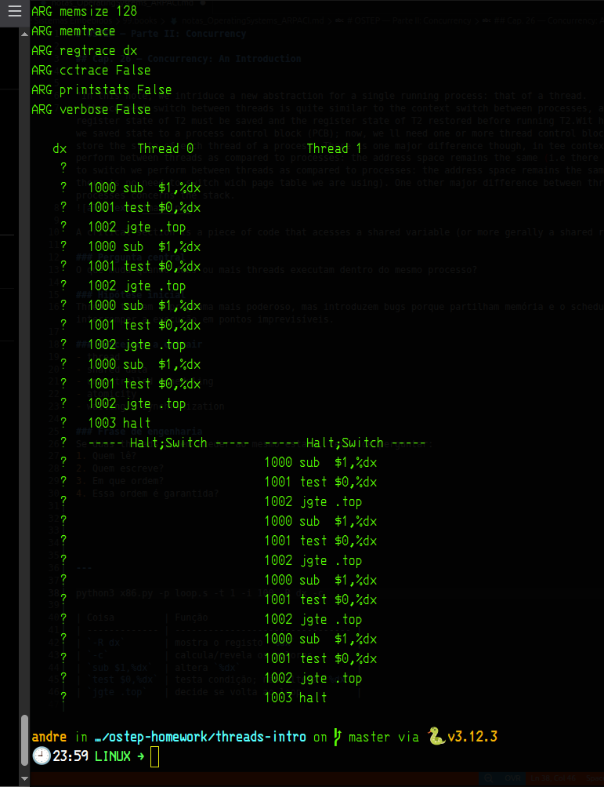
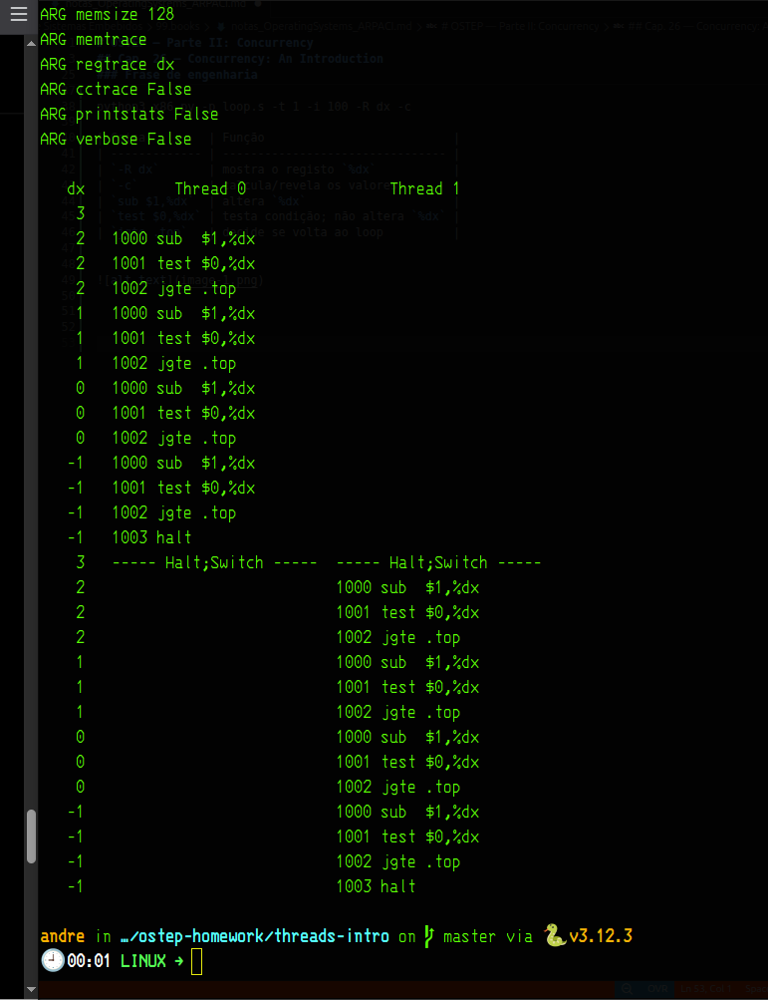
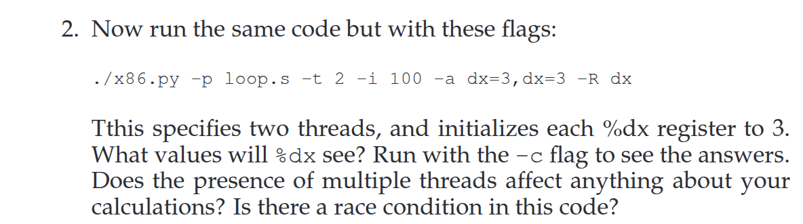

/# OSTEP — Parte II: Concurrency

## Cap. 26 — Concurrency: An Introduction

"In this note, we intriduce a new abstraction for a single running process: that of a thread. 
- the context switch between threads is quite similar to the context switch between processes, as the register state of T2 must be saved and the register state of T2 restored before running T2.Wit h processe, we saved state to a process control block (PCB); now, we ll need one or more thread control blocks (TCBs) to store the state of each thread of a process. There is one major difference though, in tee context switch we perform between threads as compared to processes: the address space remains the same (i.e there is no need to switch we perform between threads as compared to processes: the address space remains the same (i.e., there is no need to switch wich page table we are using). One other major difference between threads and processes concerns the stack.

A critical section is a piece of code that acesses a shared variable (or more gerally a shared resour ce)

### Pergunta central
O que muda quando duas ou mais threads executam dentro do mesmo processo?

### Hipótese inicial
Threads tornam o programa mais poderoso, mas introduzem bugs porque partilham memória e o scheduler pode interromper a execução em pontos imprevisíveis.

### Conceitos a extrair
- thread
- shared data
- uncontrolled scheduling
- atomicity
- waiting / synchronization

### Frase de engenharia
Se duas threads podem aceder ao mesmo estado, tenho de perguntar:
1. Quem lê?
2. Quem escreve?
3. Em que ordem?
4. Essa ordem é garantida?

---

# homework

    page 276

python3 x86.py -p loop.s -t 1 -i 100 -R dx -c

| Coisa         | Função                           |
| ------------- | -------------------------------- |
| `-R dx`       | mostra o registo `%dx`           |
| `-c`          | calcula/revela os valores        |
| `sub $1,%dx`  | altera `%dx`                     |
| `test $0,%dx` | testa condição; não altera `%dx` |
| `jgte .top`   | decide se volta ao loop          |

%

2. Now run the same code but with these flags:
./x86.py -p loop.s -t 2 -i 100 -a dx=3,dx=3 -R dx
Tthis specifies two threads, and initializes each %dx register to 3.
What values will %dx see? Run with the -c flag to see the answers.
Does the presence of multiple threads affect anything about your
calculations? Is there a race condition in this code?

**A:** i dont think so, there are not race condition,. uma vez que sao independentes as threads,...