falou d evarios programas inclido R 

weka and so on...
Está certo. ✅ Estás exatamente na janela Weka Explorer → Preprocess que o guião mostra.

Ação — abrir iris.arff

Clica em:

Open file...

Depois navega para:

~/Downloads/weka-3-8-7/data/

e escolhe:

iris.arff

Finalmente:

Open
Objetivo

Deves passar de:

Relation: None
Instances: None
Attributes: None

para aproximadamente:

Relation: iris
Instances: 150
Attributes: 5

E à esquerda devem aparecer:

sepallength
sepalwidth
petallength
petalwidth
class

Isto corresponde exatamente à secção 6.2 – Opening the Iris dataset do guião.

📓 Guarda já este conceito:

1 instance = 1 flor
4 features = medidas da flor
1 class = espécie correta

Portanto:

input X
= sepallength
  sepalwidth
  petallength
  petalwidth

output y
= class

Faz só o Open file → iris.arff e mostra-me a janela seguinte. Depois analisamos o dataset antes de tocar em qualquer algoritmo.

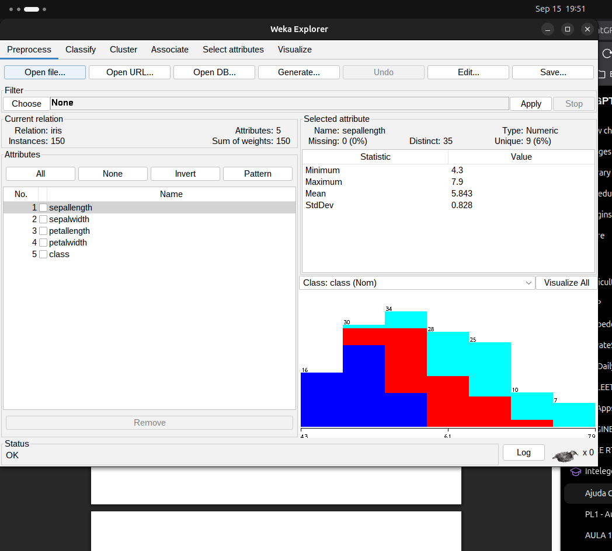

class

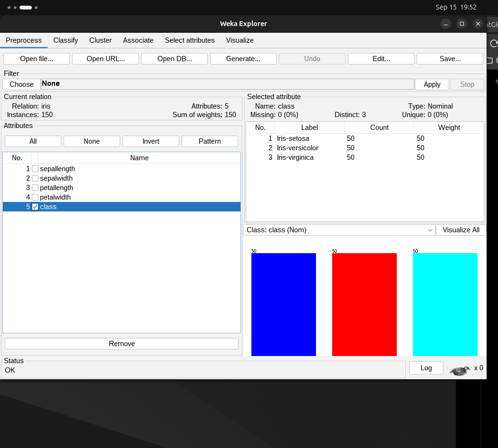

visualize all 

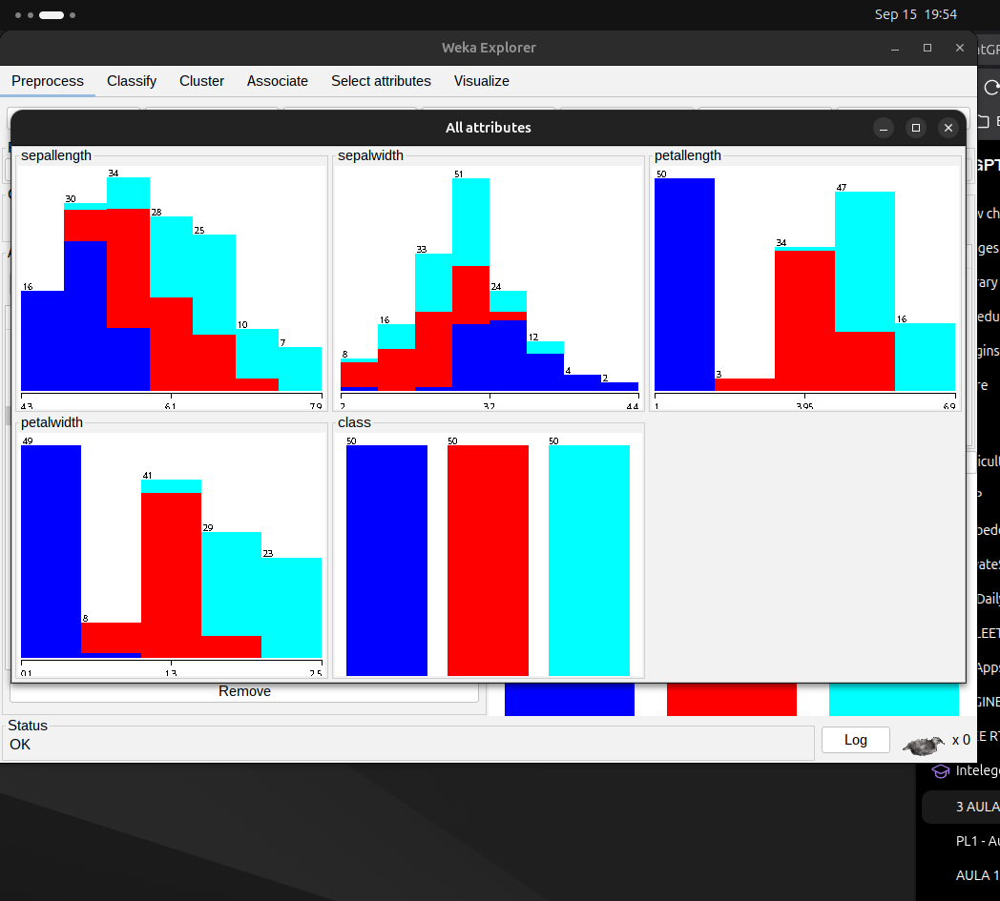

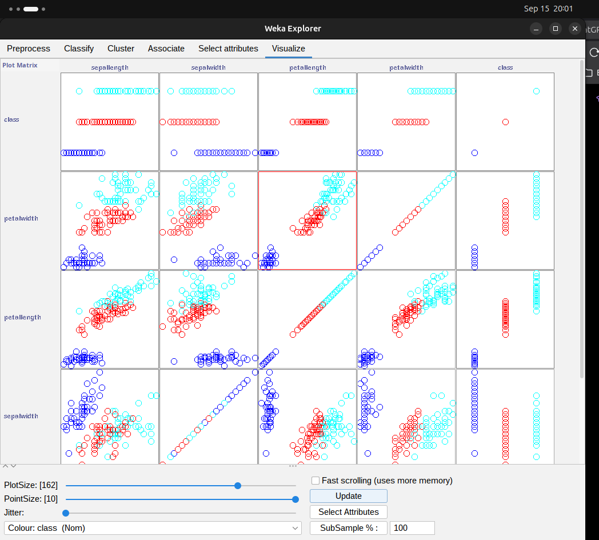

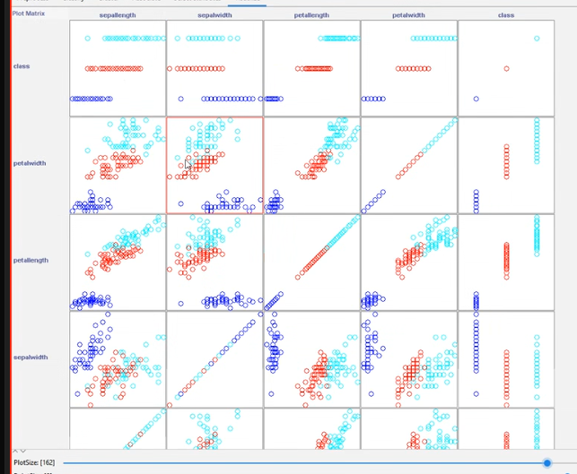

# agora vamos testar a hipótese com algoritmo

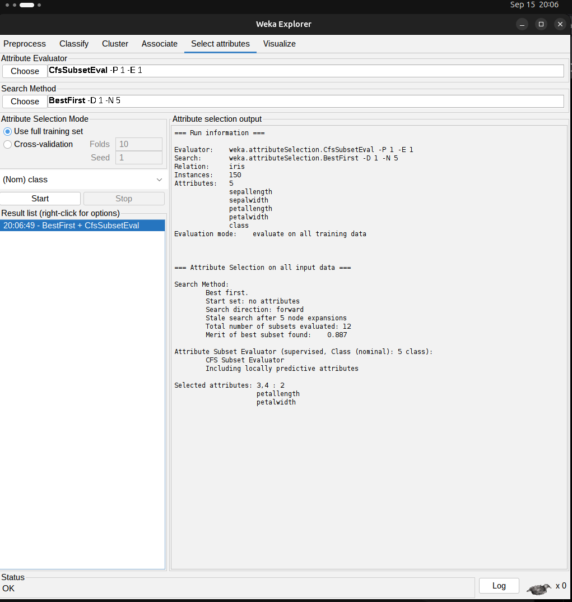

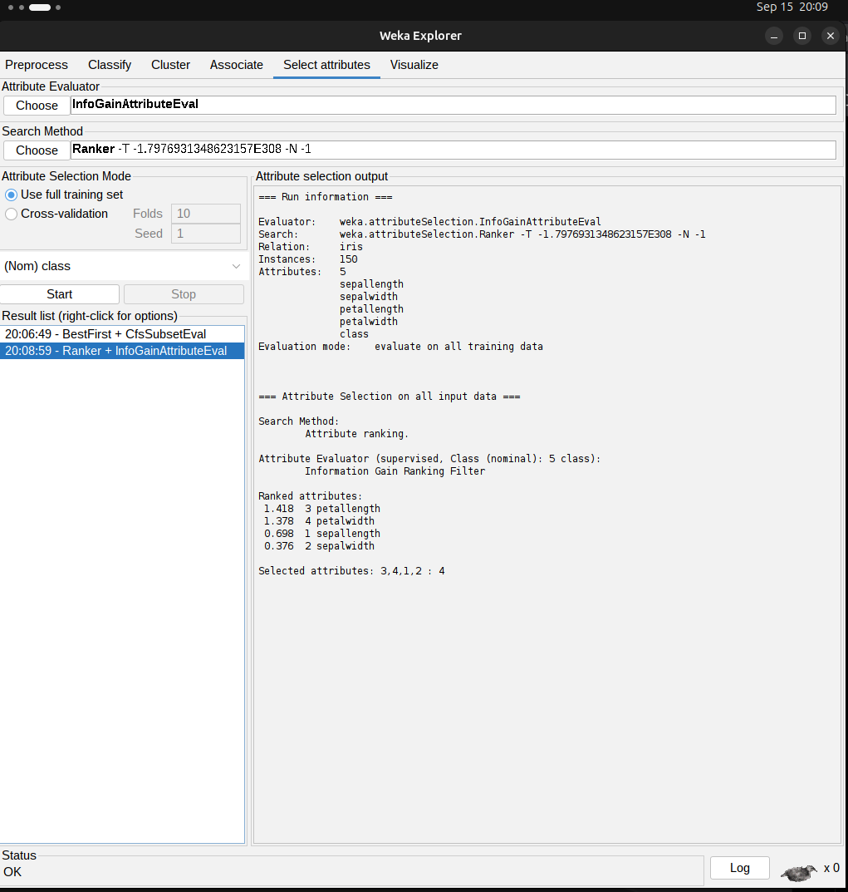

CfsSubsetEval + BestFirst
→ procura um bom conjunto de features
→ resultado: petallength + petalwidth

InfoGainAttributeEval + Ranker
→ avalia cada feature individualmente
→ produz um ranking

E atenção: estes valores:

1.418
1.378
0.698
0.376

não são accuracy nem percentagens. São scores de information gain usados para ordenar as features.

# Problem A

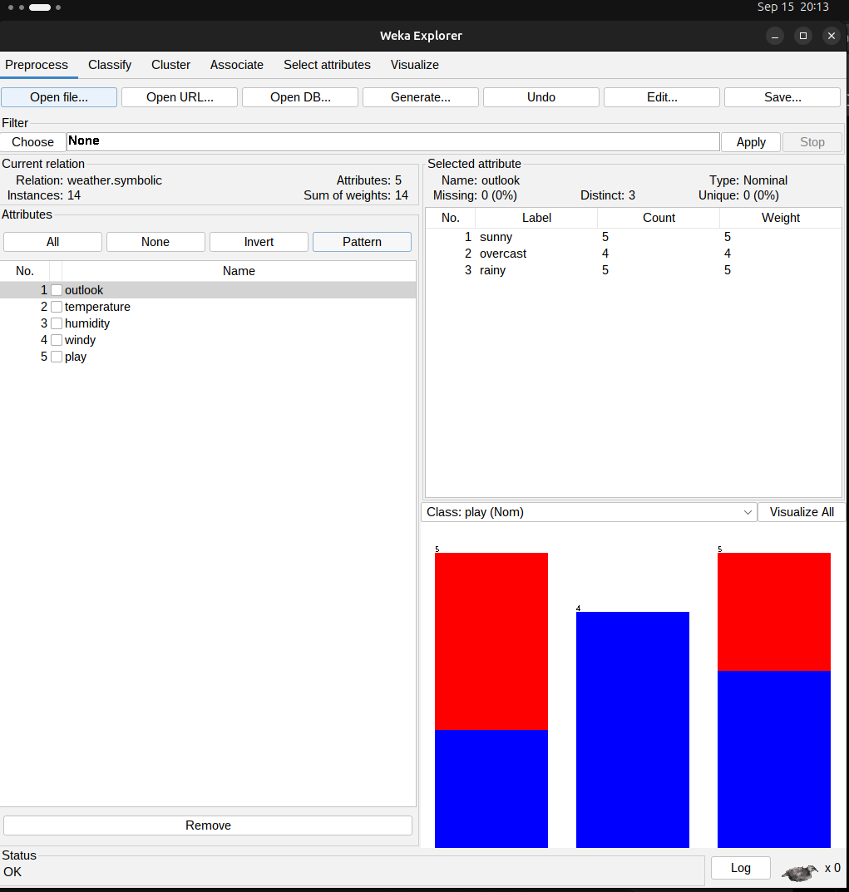

> PLAY

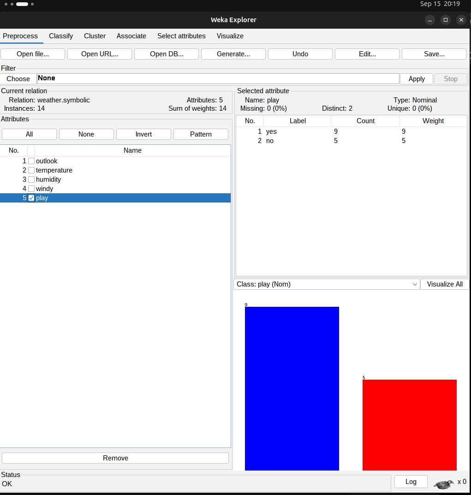

Weather dataset — InfoGain + Ranker

1. outlook      0.2467
2. humidity     0.1518
3. windy        0.0481
4. temperature  0.0292

---

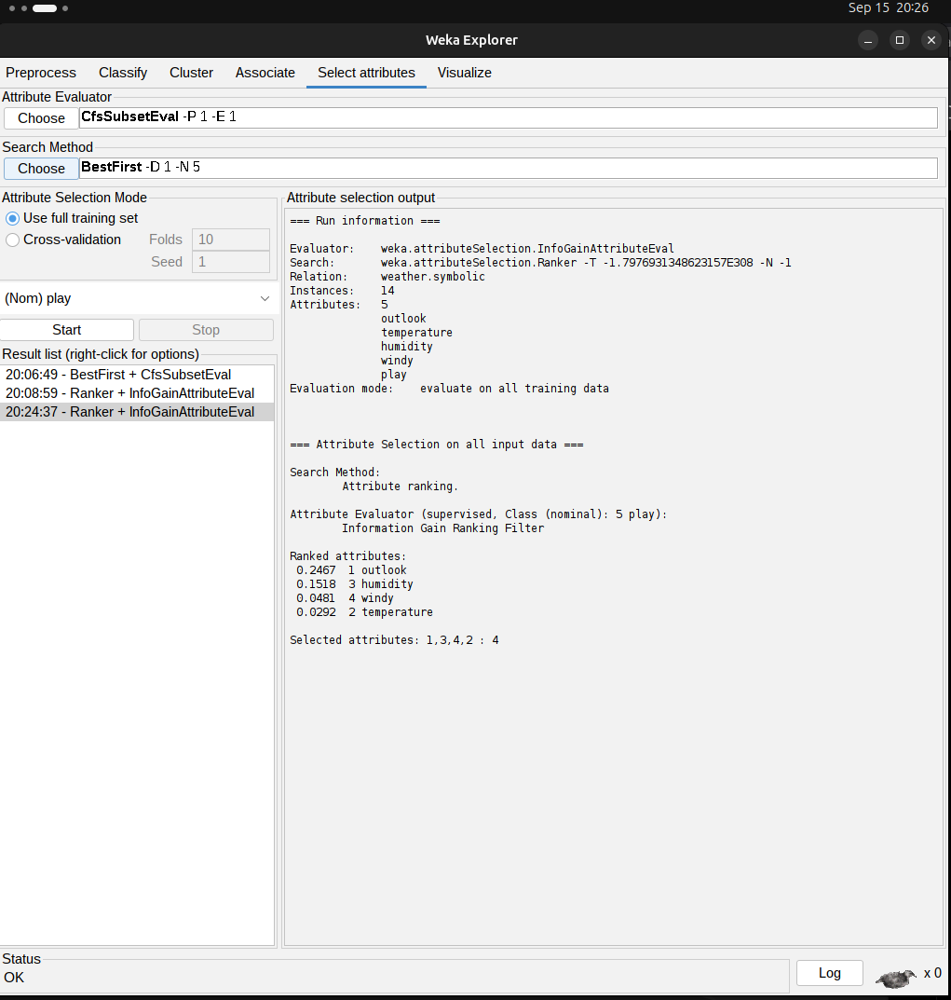

---

com o best fit search method

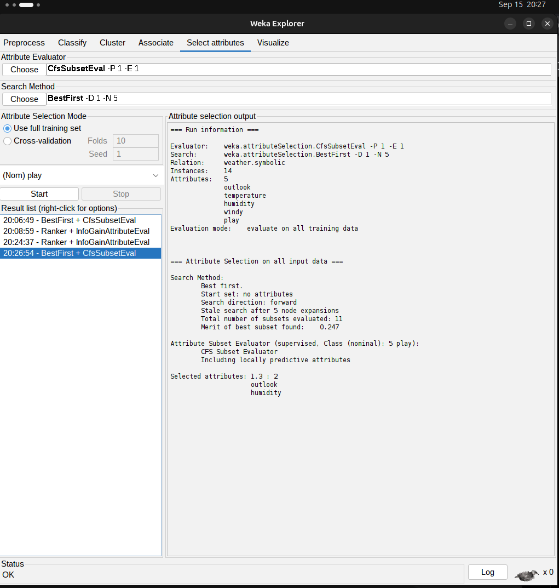

# PERGUNTA 

Did your predictions match the algorithms?

> Yes. Visual inspection suggested that outlook and humidity were the
    most discriminative attributes. The algorithms confirmed this:
    InfoGain ranked outlook first and humidity second, while CfsSubsetEval
    selected {outlook, humidity} as the best subset.

# Study 

Weather dataset

Class:
play

Ranker / InfoGain:
1. outlook
2. humidity
3. windy
4. temperature

CfsSubsetEval / BestFirst:
outlook + humidity
Próximo passo — Problem B

---

CSV = formato de origem
ARFF = formato nativo do Weka

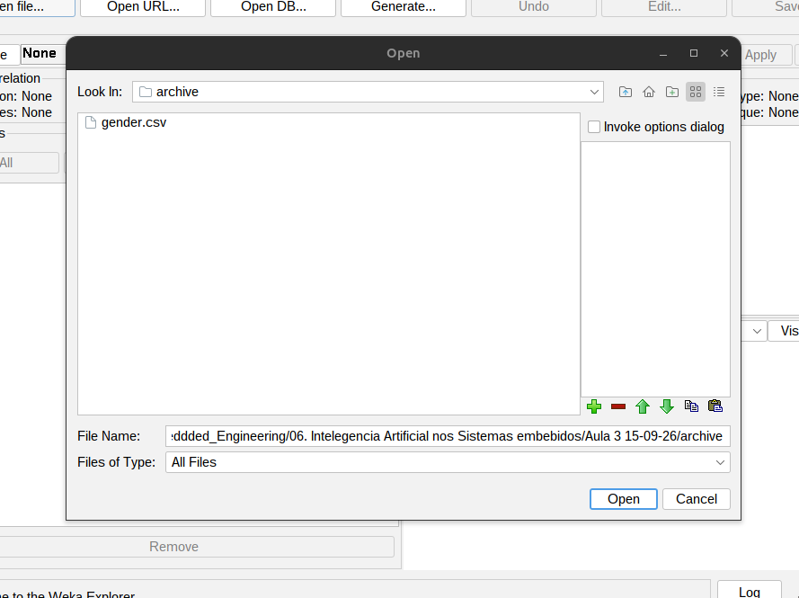

---

