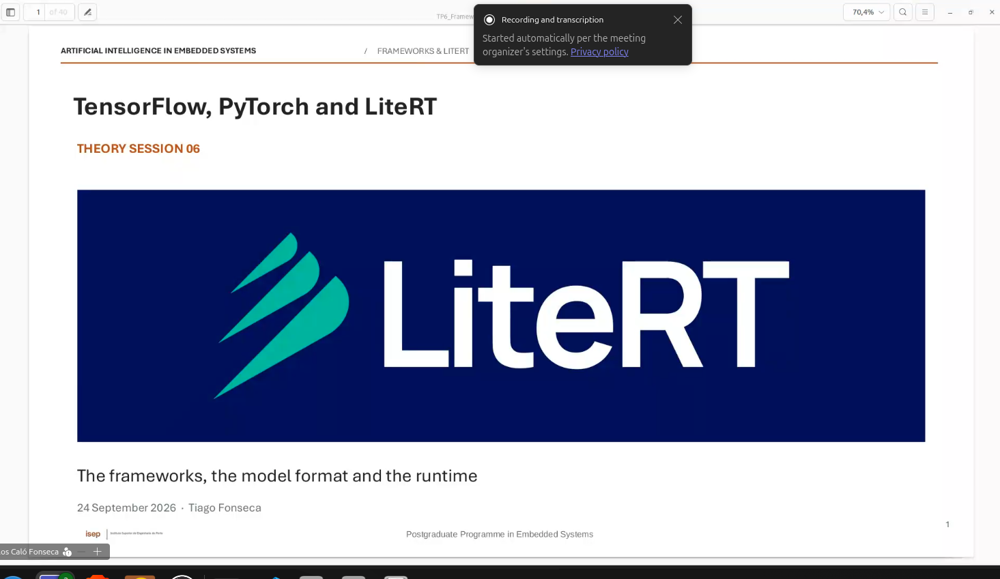
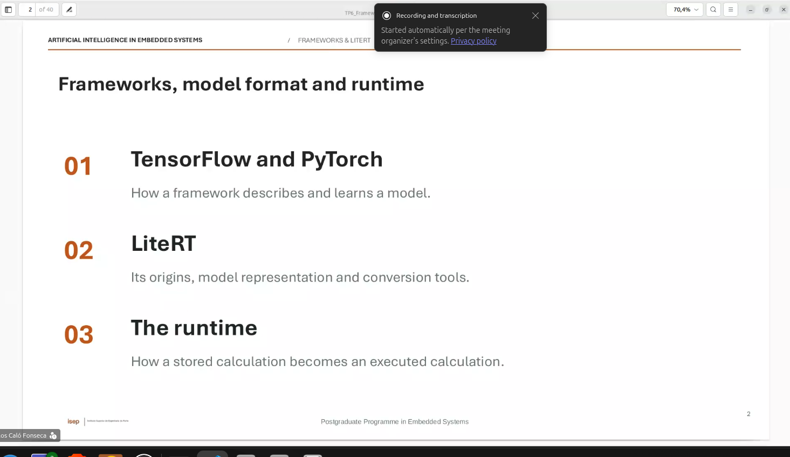
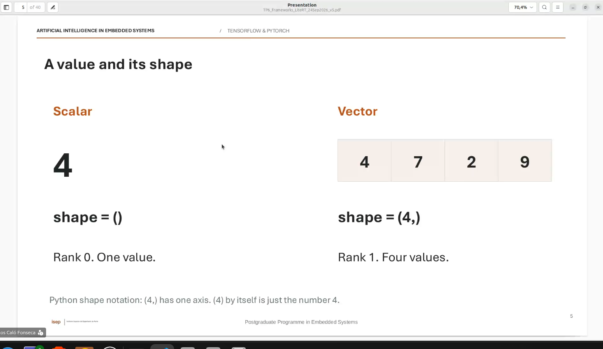
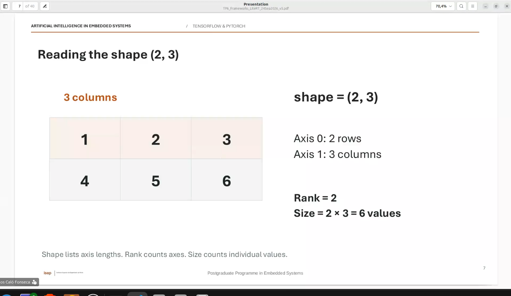
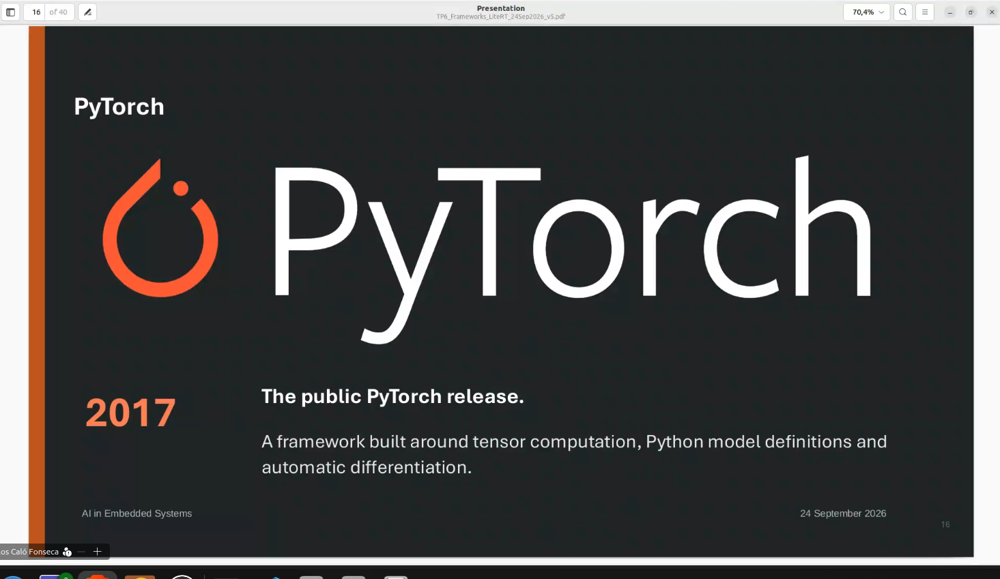

Lite Rt e a ferramenta mais usada em sitemas embevbidos. 

tensor flow, pytorch, e lite RT

sabado vamos usar o collab para redes neuronais. 

Modelo da semana passada, ja era um modelo que vinha em lite rt.

TENHO DE FAZER AMANHA A AULA !



O RUNTIME e o software que executa o lite RT. 

# TensorFlow

google release codigo aberto em 2015. 

Frameworkk de calculo numerico !!

vamos usar o tensor flow no sabado,,,



PL1 shapes !!!

estes 3 exemplos tem sempre 3 valores...






tensor glow interages a partir do keras !!!

para sistemas embebidos vamos usar litert...

e google 


---

# GPT

Sim — e há uma razão objetiva: hoje foram dadas **duas camadas de abstração ao mesmo tempo**:

1. como uma rede faz contas com matrizes;
2. como essas contas passam a caber e correr num dispositivo embedded.

Não tens de decorar tudo já. A história inteira é esta.

## 1. Uma rede neuronal é uma sequência de contas

Imagina uma imagem de um dígito 28×28. Tem 784 pixels.

A rede faz isto:

```text
imagem → lista de 784 números → 64 “detetores” → 10 probabilidades
```

Em Keras, se envias 128 imagens de cada vez:

```text
X: (128, 784)     128 imagens, 784 valores cada
W1: (784, 64)     pesos que ligam cada pixel aos 64 neurónios
H: (128, 64)      resultado: 64 valores por imagem
W2: (64, 10)      pesos para as 10 classes
S: (128, 10)      10 scores/probabilidades por imagem
```

A regra para matrizes é só:

\[
(a,b)\times(b,c)=(a,c)
\]

Portanto:

\[
(128,784)\times(784,64)=(128,64)
\]

O `128` não é “parte da imagem”: é apenas o número de imagens tratadas juntas, o **batch**.

## 2. O que faz uma camada `Dense`

Cada neurónio pega nos valores de entrada, dá mais importância a uns do que a outros e soma tudo:

\[
z = x_1w_1 + x_2w_2 + \ldots + b
\]

- `weights` / pesos: importância aprendida para cada entrada;
- `bias`: ajuste base do neurónio;
- `ReLU`: elimina resultados negativos;
- `Softmax`: transforma os 10 scores finais em probabilidades que somam 1.

O slide com \(Wx+b\) usa vetores em coluna. O Keras usa exemplos em linhas e escreve \(XW+b\). **É a mesma conta, só muda a orientação das matrizes.** Este foi o ponto que te baralhou — com razão.

## 3. Tensor é só “caixa de números com dimensões”

Nada místico:

| Nome | Exemplo | Shape |
|---|---:|---|
| Escalar | `4` | `()` |
| Vetor | `[1, 2, 3]` | `(3,)` |
| Matriz | tabela 2×3 | `(2, 3)` |
| Imagem cinzenta | 28×28 pixels | `(28, 28)` |
| 128 imagens RGB | lote de imagens | `(128, 28, 28, 3)` |

`shape` diz o tamanho de cada eixo. `rank` é quantos eixos existem.

## 4. TensorFlow, Keras, PyTorch e LiteRT

Pensa numa aplicação embedded:

- **Keras**: a forma fácil de descrever a rede: `Dense`, `Conv2D`, etc.
- **TensorFlow / PyTorch**: frameworks para construir e treinar a rede em Python.
- **Modelo treinado**: os pesos já aprendidos; não aprende mais no ESP32/Raspberry.
- **Conversão**: traduz esse modelo para um formato que o runtime suporta.
- **LiteRT** (o novo nome de TensorFlow Lite): biblioteca/runtime que abre o modelo e faz inferência no dispositivo.

Fluxo real:

```text
Treinar em Python/PC
        ↓
modelo com pesos
        ↓ conversão
ficheiro .tflite
        ↓
LiteRT no dispositivo
        ↓
sensor/imagem → inferência → resultado
```

O ficheiro `.tflite` contém o “mapa das contas” (grafo), os pesos e os biases. Não é um programa Python inteiro.

Para o teu projeto de rega, seria:

```text
humidade + temperatura + hora → modelo .tflite → “regar / não regar”
```

## 5. Porque aparece a quantização

No PC, os números costumam ser `float32`: 32 bits por peso. Em embedded, memória, energia e desempenho contam.

| Formato | Bits | Para 100 000 pesos |
|---|---:|---:|
| Float32 | 32 | 400 kB |
| Float16 | 16 | 200 kB |
| INT8 | 8 | 100 kB |

Com `INT8`, em vez de guardar números como `0.62`, guardas inteiros de `-128` a `127`. Para saber o valor “real”, o modelo também guarda a escala (`scale`) e, por vezes, o ponto zero (`zero-point`):

\[
x \approx scale \times (q - zero\_point)
\]

Exemplo do slide:

- valor original: `0.62`
- escala: `0.25`
- guardado como inteiro: `2`
- reconstruído: `0.25 × 2 = 0.50`

Perdeu precisão: erro `0.12`. Essa é a contrapartida de usar menos memória.

## 6. O que tens de perceber sobre INT8

- **Quantização não remove neurónios nem camadas**; muda a forma de guardar/calcular valores.
- Menos bits → modelo menor, normalmente mais adequado a embedded.
- Não garante automaticamente que será duas vezes mais rápido: depende do CPU, kernel e acelerador.
- `weights` são fixos após treino; `activations` são valores temporários que mudam para cada input.
- O CPU pode multiplicar INT8, mas acumula o resultado em `INT32`, para não haver overflow.
- É preciso testar depois da quantização: um pequeno erro pode trocar a classe vencedora se as probabilidades estiverem muito próximas.

## 7. Calibração e treino consciente da quantização

Para converter bem para INT8, o sistema precisa de saber os intervalos habituais dos valores intermédios. Para isso usas exemplos representativos — **calibração**.

Não treina o modelo de novo; apenas observa intervalos.

- `Post-training quantization`: treinas em float e quantizas no fim.
- `Quantization-aware training (QAT)`: durante o treino simulas os erros de INT8, para o modelo se adaptar. Costuma preservar melhor a qualidade.

## O que deves guardar no caderno

```text
Tensor = array de números + shape.
(batch, inputs) × (inputs, units) = (batch, units).
Dense = multiplicação por pesos + bias + ativação.
Keras/TensorFlow/PyTorch treinam e descrevem o modelo.
LiteRT executa um modelo preparado no dispositivo.
.tflite = grafo de operações + pesos.
INT8 reduz 4× a memória face a Float32, mas aproxima valores.
Quantização ≠ conversão: podem acontecer juntas, mas são coisas diferentes.
```

Ação: por agora esquece `zero-point`, `per-channel` e `QAT`. Confirma apenas esta frase com as tuas palavras: **o que é que o `.tflite` leva do PC para o dispositivo?**