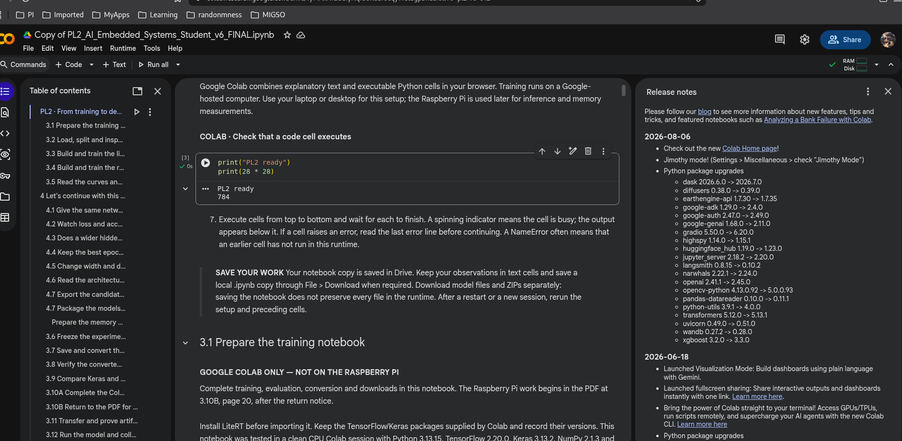
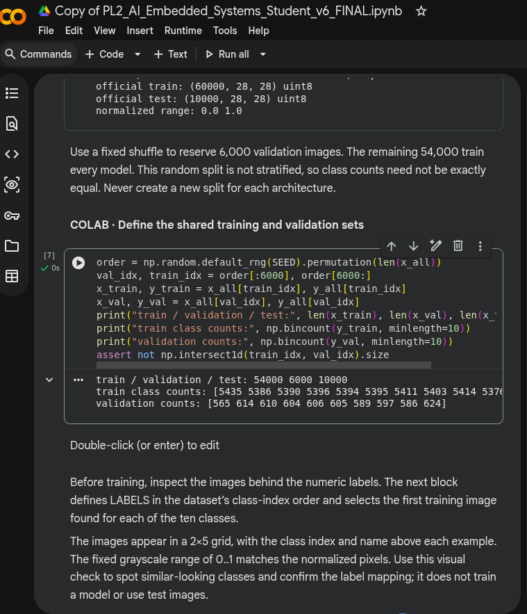
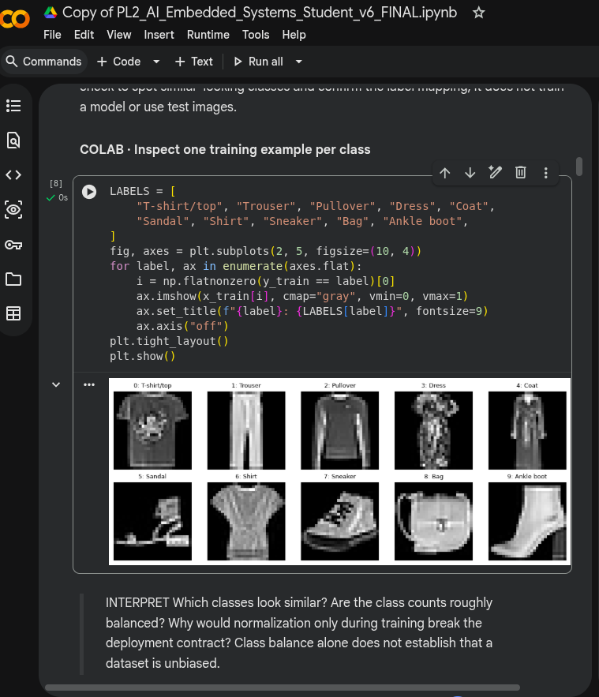

A missão está bem definida: no PL1 recebeste um modelo pronto; no PL2 és tu que vais criar, avaliar, converter e pôr o modelo a correr no Raspberry Pi.

                 PL2
                  │
                  ▼
Fashion-MNIST → TREINO
               Colab
                  │
                  ▼
             modelo Keras
                  │
               conversão
                  ▼
        fashion_mnist_mlp.tflite
                  │
             transferência
                  ▼
            Raspberry Pi
                  │
               LiteRT
                  ▼
              INFERENCE
                  │
                  ▼
          verificar resultados

---

No PL2, o treino acontece fora do dispositivo. No Raspberry PI nao vamos instalar TensorFlow completo nem voltar a treinar. O PI e o traget de inference. 

Mais tarde , no PL3, entra aquilo que viste na aula anterior.

    PL1 -> executar modelo fornecido
    PL2 -> construir + converter + deploy
    PL3 -> Float32 / Float16 / INT8 / quantizacao
    PL4 -> experiencia + decisao de engenharia

Isto tambem explica porque os dois livros que temos sao uteis de maneiras diferentes. AI at the Edge da nos a visao do sistema -- embedded ML e executar modelos ML em sistemas embebidos,normalmente fazendo inference no dispositivo enquanto o treino permanece num computador convencional. Ja o TinyML entra muito mais fundo precisamente na implementacao pratica com TensorFlow Lite/LiteRT em dispositivos limitados. 

---

segui os passos do stor

---

Neste PL2 existem duas maquinas com responsabilidades diferentes...

Google Colab                 Raspberry Pi
────────────                 ────────────
TREINO                       INFERENCE
TensorFlow/Keras             LiteRT
↓                            ↑
modelo aprendido ── .tflite ─┘

    > Taining produces the model artifact. Inference sonsumes the artifact

# Pergunta 

    Qual é a tua hipótese: por que razão achas que o professor manda treinar no Colab mas executar o modelo final no Raspberry Pi?

> Treinamos no Colab porque training e computacionalmente mais exigente. Depois fazemos deployment do modelo treinado no Raspberry Pi, onde executamos inference. 

E ha um detalhe interessanteL nem precisamos de GPU neste PL2. O professor especifica Python 3 + CPU, porque estes redes sao pequenas. 

---

Keras/TensorFlow → treinar e converter
LiteRT → executar o .tflite para inference

---

# Pergunta

Pergunta
O que achas que set_random_seed(42) pretende fazer?
A) tornar o modelo mais preciso
B) controlar a aleatoriedade para tornar a experiência reproduzível
C) dizer ao modelo que existem 42 classes

B certa

B — correto. ✅
SEED = 42 serve para controlar a aleatoriedade e tornar a experiência reproduzível.
SEED = 42
   ↓
mesma sequência pseudo-aleatória
   ↓
experiências mais comparáveis

    Isto e especialmente importante no PL2 porque vamos comparar modelos. Se mudassemos simultaneamente a aquitetura e aleatoriedade, ficaria mais dificil perceber qual alteracao causou a diferenca observada. O proprio PL fixa SEED = 42, EPOCHS = 5 e BATCH_SIZE = 128. 

    Seed nao melhora o modelo; ajuda na reprodutibilidade da experiencia. 

# antes de 3.2 - Epochs e Batch_Size

Quando temos: 

    Batch_Size = 128

qual e a tua hipotese? 

eu acho que o treino processa as imagens em grupos de 128 antes de fazer cada atualizacao dos parametros...B

> Correcto

Batch = grupo de amostras processando antes de uma atualizacao dos parametros.

Epoch = uma passagem completa pelo training set

---

# Proximo: 3.2 - Load, split and inspect Fashion-MNIST

Antes de executares a primeira celula de 3.2, olha para isto:

    (x_all, y_all), (x_test, y_test) = (
        keras.datasets,fashion_mnist.load_data()
    )

O PL diz que serao carregadas 60 000 imagens oficiais de treino e 10 000 imagens de teste, cada uma com 28 x 28 pixels. 

---
x_all[0] → a IMAGEM da sapatilha 👟
y_all[0] → a ETIQUETA/CLASSE dessa imagem

x_all[0]   # matriz 28 × 28 com os pixels
y_all[0]   # número que identifica a classe
---

---

Fashion-MNIST: imagens grayscale 28×28, originalmente uint8 [0,255].
Para o modelo: converter para float32 e normalizar para [0,1].

---

TRAIN ──────► aprende / altera pesos
                 │
VALIDATION ──────┤ avalia durante o desenvolvimento
                 │
TEST ────────────┴► avaliação final

---

TRAIN ──────► aprende / altera pesos
                 │
VALIDATION ──────┤ avalia durante o desenvolvimento
                 │
TEST ────────────┴► avaliação final

---

    Train: aprende os parametros.
    Validation: ajuda a avaliar/escolher durante o desenvolvimento.
    Test: avaliacao final independente. 

---

    o SEED = 42 permite reproduzir esse mesmo shuffle. E precisamente por isso que o PL2 exige o mesmo split para todos os modelos: queremos uma comparacao controlada.

---

Ação
Agora executa só a célula Define the shared training and validation sets que está imediatamente abaixo.
Antes de veres o output, previsão:
x_train → ? imagens
x_val   → ? imagens

Já tens informação suficiente para dizer os dois números.

    

6000

 

6000 é o validation. Falta o train. 🙂
Temos 60 000 imagens no conjunto original e retiramos 6 000 para validação:
\[
60\,000 - 6\,000 = \boxed{?}
\]
Portanto:
x_train → ?
x_val   → 6 000

Qual fica no x_train?

54 000

60 000 imagens originais
        │
        ├── 54 000 → TRAIN
        │             altera os pesos
        │
        └──  6 000 → VALIDATION
                      avalia durante desenvolvimento

10 000 → TEST
         fica separado para avaliação final
---

54 k train / 6k validation / 10k test.

----

---

Repara que o validation tem 6000 imagens, mas não temos 600 de cada classe. Por exemplo:
classe 0 → 565
classe 1 → 614
...
classe 9 → 624

Isto acontece porque o próprio notebook diz que este split aleatório não é estratificado.

---

random split diferente stratified split. Neste PL usamos um fixed random split e exectamente o mesmo split para todos os modelos. 

---

y ???

A tua resposta C é uma confusão muito normal porque nós pensamos semanticamente em "shirt", "shoe", "bag", mas o dataset guarda as labels como números.
y = 0  → T-shirt/top
y = 1  → Trouser
y = 2  → Pullover
...
y = 9  → Ankle boot

---
x_train[i]  → pixels da imagem
y_train[i]  → 9
                │
                └── LABELS[9] → "Ankle boot"

---

o modelo trabalh com class indices 0-9; Labels faz o mapping indice -> nome da classe. 

---

# Objectivo: ligar pela primeira vez: 

    pixels X - classe numerica y - nome humano

---

Agora estas a ver o dataset que o modelo vai tentar. 

> O grafico mostra uma imagem de treino de cada classe:

    0 → T-shirt/top     5 → Sandal
    1 → Trouser         6 → Shirt
    2 → Pullover        7 → Sneaker
    3 → Dress           8 → Bag
    4 → Coat            9 → Ankle boot

Uma linha importante do código
Python


Run
i = np.flatnonzero(y_train == label)[0]

> Conceptualmente significa: 

    "Encontra uma imagem de treino cuja classe seja esta label."

---

    "Why would normalization only during training break the deployment contract?"

Isto liga directamente ao Raspberry Pi. 

Imagina que durante treino uma determinada intensidade de pixel chega ao modelo como: 

    128/255 = 0.502

mas depois no Raspberry Pi enviamos simplesmente:

    128

> O problema e que, para a rede, 128 e 502 nao sao a mesma entrada. A rede nao sabe que ambos representam o mesmo nivel de cinzento em escalas diferentes. 

    TREINO                         RASPBERRY PI
    pixel original = 128           pixel original = 128
        ↓                              ↓
    128 / 255                      sem normalização ❌
        ↓                              ↓
    0.502                          128
        ↓                              ↓
    MODELO                         MESMO MODELO

A PL2 exige precisamente que o input continue float32 normalizado de 0...255 para 0...1 , tal como na PL1.

    O preprocessing usado no deployement tem de set compativel com aquele para o qual o modelo foi treinado. 

> same model diferente de same behaviour se o preprocessing/input contact mudar

---

para  o valor de normalizacao 

pixel original     input do modelo
0          →       0.0
128        →       ≈ 0.502
255        →       1.0

Já tens o conceito: normalização transforma [0,255] em [0,1] e essa transformação tem de ser igual no treino e no deployment.

---

Aqui o professor diz antes de executar: 

    Predict(): Compute (784 + 1) * 10 parameters before running summary().

---

7850

> um neuronio Dense faz essencialmente:

    y = w1x1 + w2x2 + ---- + w784x784 + b

Este ultimo b e o bias. 

imagina uma versao reidicularmente simples:

    y = wx + b

Se tivermos: 

    w = 2, b = 3

entao: 

    y = 2x + 3

Quando x = 0 :

    y - 3

ou seja, o bias permite deslocar a resposta do neuronio, em vez de obrigar a relacao a passar sempre pela origem. 

Visualmente: 

sem bias                 com bias

y = wx                    y = wx + b

    /                         /
   /                         /
  /                         /
 /                         /
●──────── x              /──────── x
(0,0)                   ↑
                        b

No nosso Dense(10) cada neuronio tem os seus proprios pesos e o seu proprio bias:

neurónio classe 0 → 784 weights + 1 bias
neurónio classe 1 → 784 weights + 1 bias
...
neurónio classe 9 → 784 weights + 1 bias

    Daí:
    \[
    \underbrace{784\times10}_{7840\ weights}
    +
    \underbrace{10}_{10\ biases}
    =
    \boxed{7850}
    \]
    ou equivalentemente:
    \[
    (784+1)\times10=7850
    \]\

> Bias e um parametro treinavel adicional de cada neuronio que permite deslocar a sua resposta; nao depende diretament do valor do input.