perdi o resto da aula nao gravei as minhas notas.

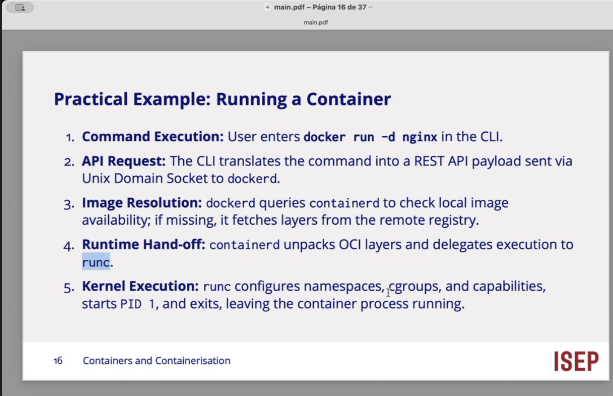

PID 1 process ID

kernel execution I

run a container 
    
    docker run -d nginx

uma imagem docker e ma colecao ordenada do sistemas de ficheiros, e so read only...\

um contentor tem uma historia, 

montamos uma imagem, squencia de construcao, elementos que vou adicionando a minha imagem !!! 

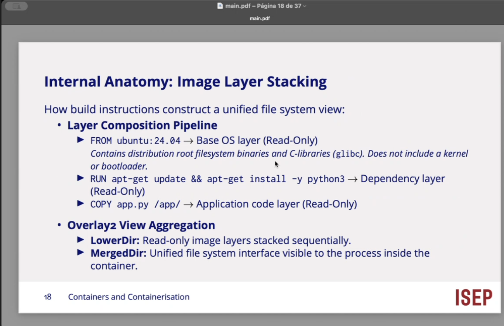

o que e um hash

sequencia de numeros que e o resultado !!! 

SHA

ssh-keygen
   │
   ├── ED25519     ← algoritmo usado para criar o par de chaves
   │
   ├── private key ← fica no PC
   └── public key  ← colocada no GitHub
            │
            └── SHA256 fingerprint ← identificação/hash da chave

SSH não é SHA.

ssh-keygen cria as chaves SSH.
ED25519 pode ser o algoritmo da chave.
SHA-256 pode calcular o fingerprint dessa chave.

Hash = função que transforma dados de tamanho arbitrário numa impressão digital de tamanho fixo.

SHA-256 → hash de 256 bits.

É usado para integridade, identificação/fingerprints e várias construções criptográficas.

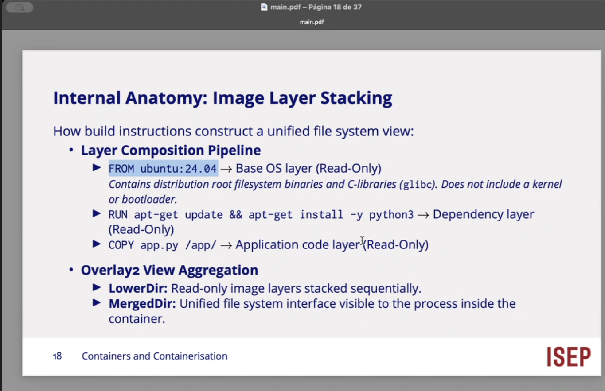

quando vou buscar esta imagem como base, quer dizer que n esta imagem ja existe directorios base e standard....
    /bin /user /

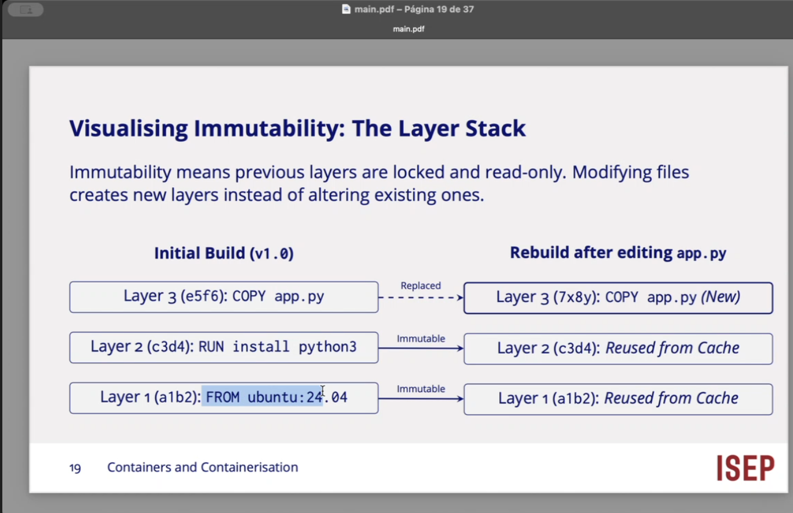

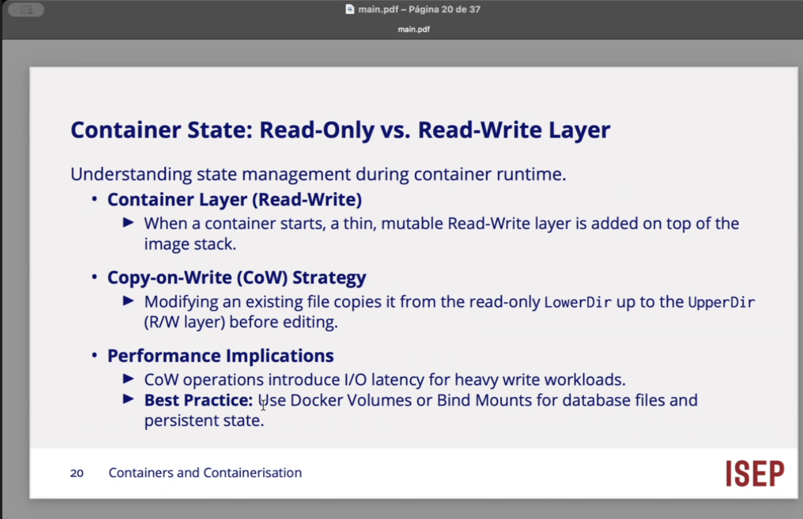

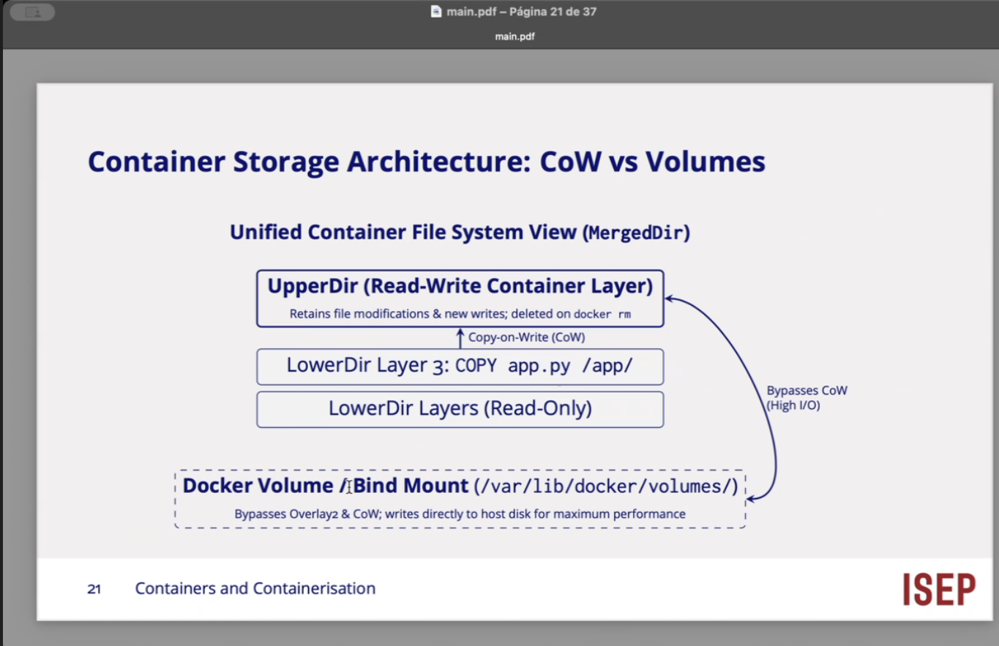

e possivel em tempo de execucao atraves de um clone..

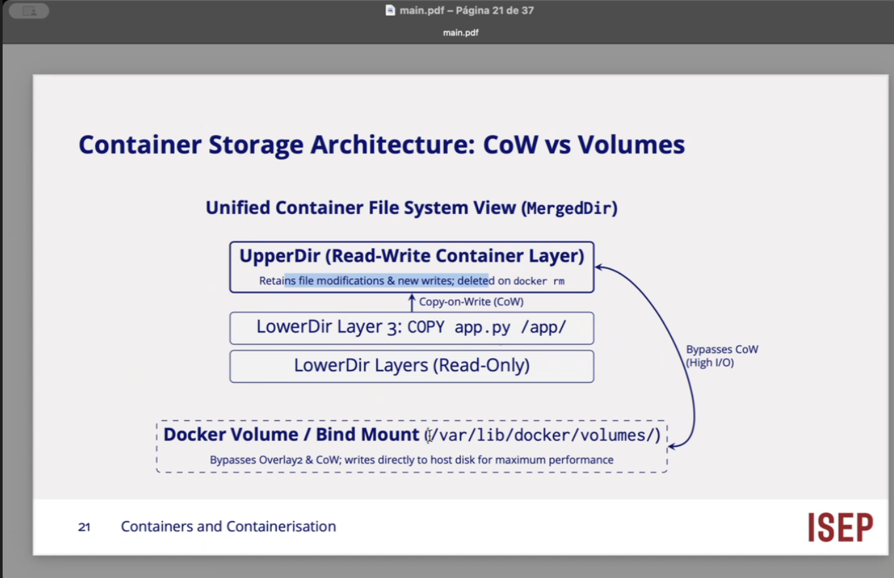

representacao de um volume docker !!!

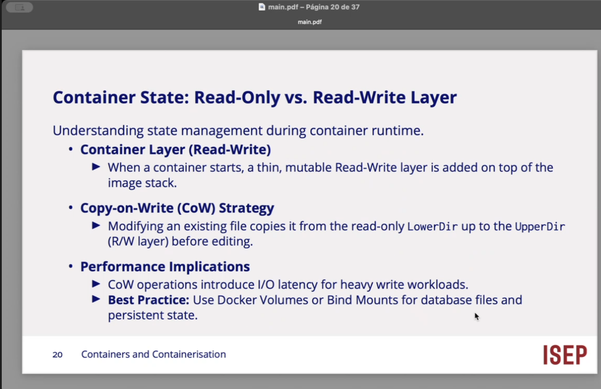

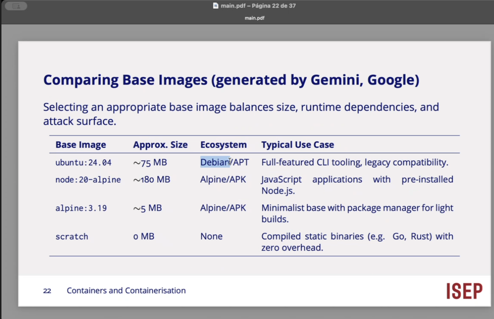

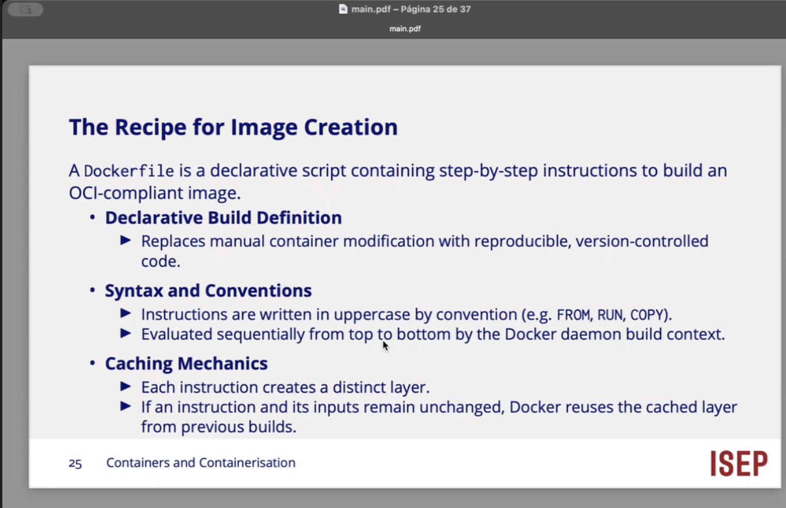

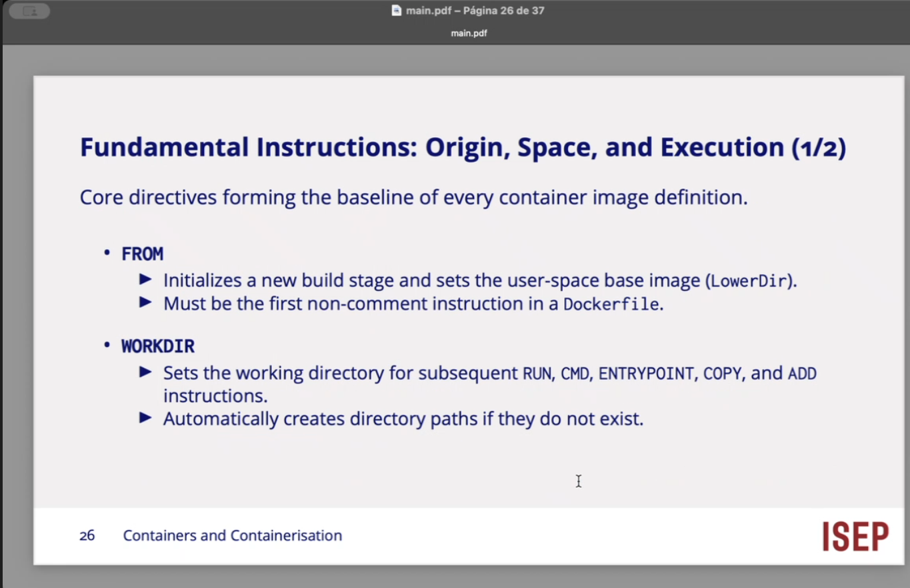

de onde onde e o que executar...

workdir permite definir qual o directorio onde vou estar a executar...

RUN > executa comando na construcao da imagem.. 

