teste sera conceitos e teoria !!!!

escolha multipla pelo moodle !!!

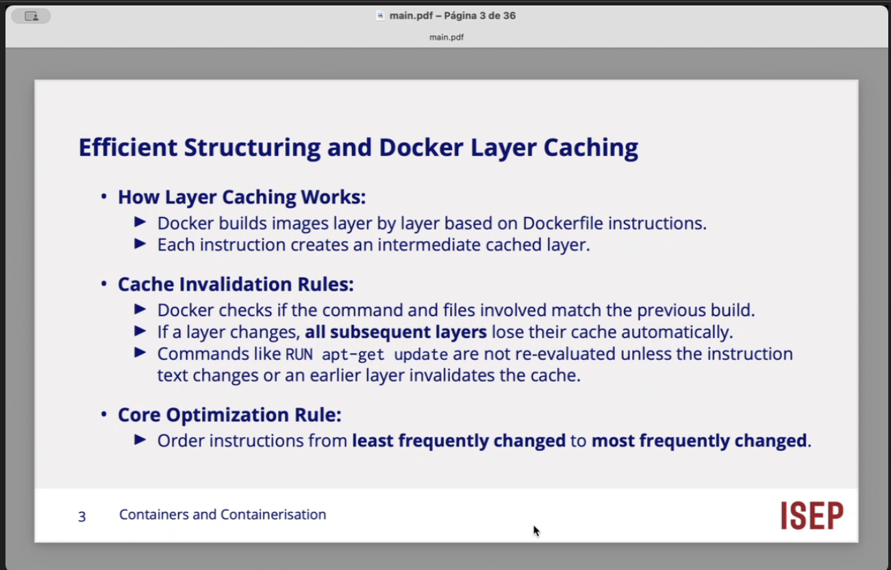

coloca nas camadas mais fundamentais que a variaablidade ao longo do tempo seja quase imutavel...

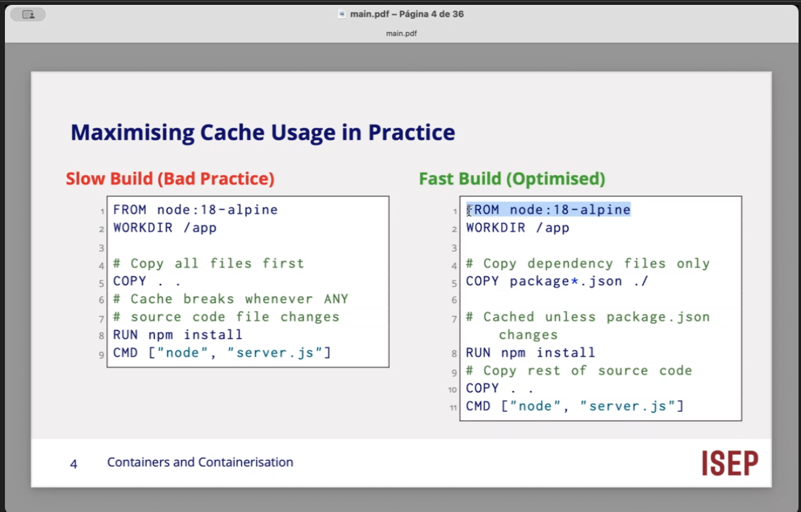

Docker file = receita para construir Docker Image..
Cada instrucao cria/afeta uma layer
Colocar ficheiros que mudam um pouco antes dos que mudam frequentemente melhora o aproveitamento da build cache, 

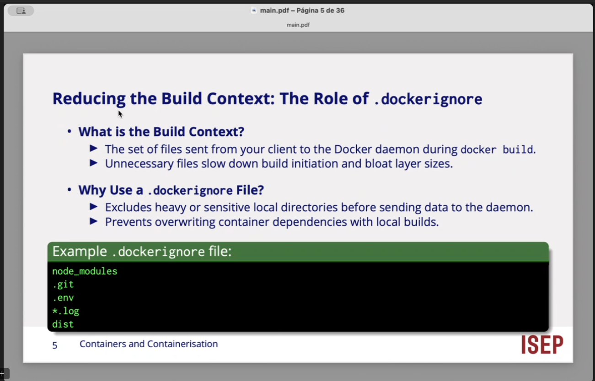

dockerignore vamos colocar todos os tipos de ficheiros ou diretorios porque ha ficheiros que nao tem o menor interesse de serem copiados para a nossa imagem. 

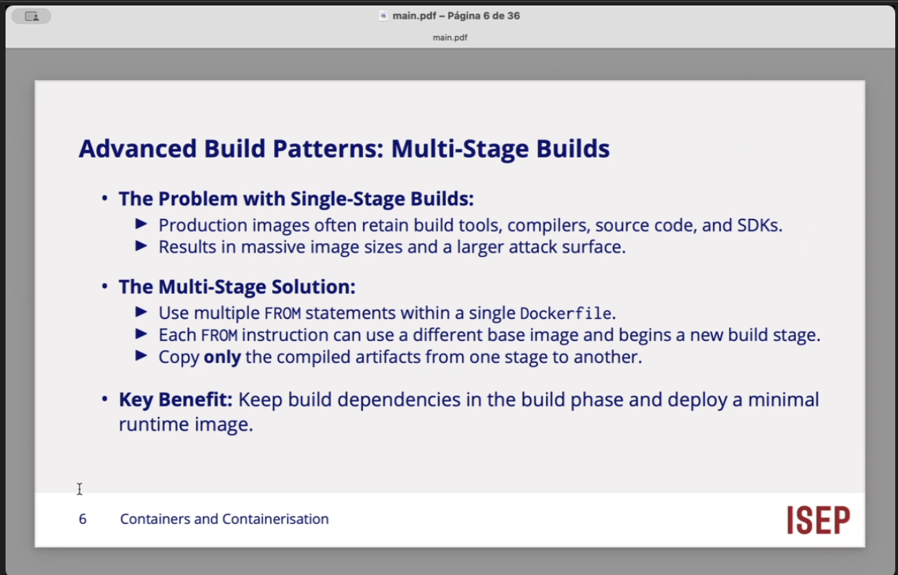

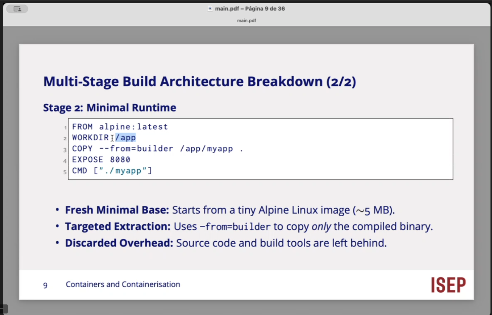

comandos

docker build -> constroir uma docker image
-t -> atribui nome/tag
my-app:1.0 -> nome -my.app, tag/versao = 1.0
. -> build context = diretorio atual

2. dicker run -d -p 8080:80 --name web-container my-app:1.0

BUILD
docker build -t my-app:1.0 .
        ↓
      IMAGE

RUN
docker run -d -p 8080:80 --name web-container my-app:1.0
        ↓
    CONTAINER

DEBUG / OBSERVE
docker logs -f web-container
        ↓
      LOGS

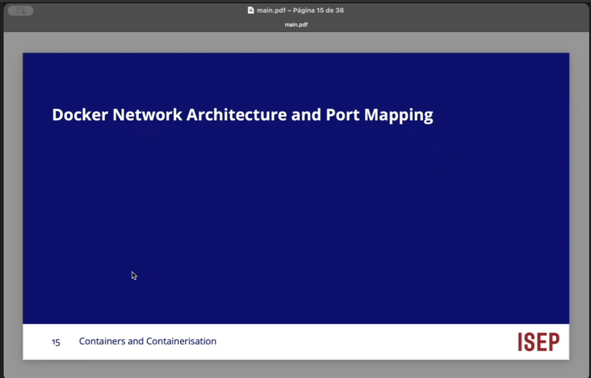

docker isa networl namespaces para dar a cada container uma stack de rede isolada. 
-p HOST:CONTAINER permite publicar uma porta do container atraves do host.

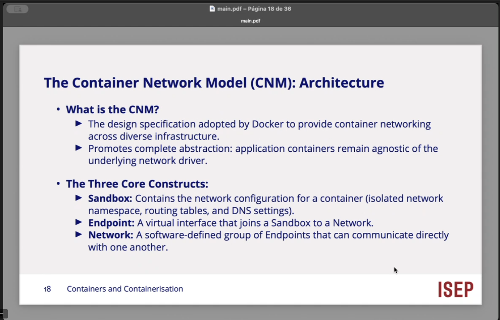

1. Sandbox = rede privada do container

2. Endpoint = ponto de ligacao

ligamos a sandbox atraves de um endpoint....

uma interface virtual qie liga um Sandbox a uma Network..

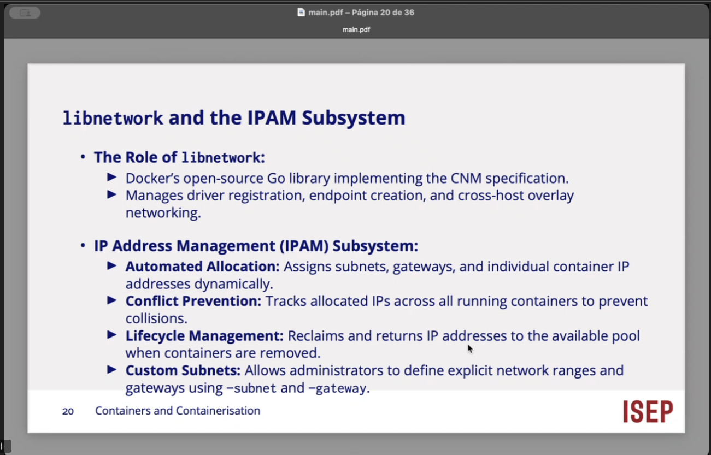

    Docker -p HOST:CONTAINER → TCP por defeito.
    Docker -p HOST:CONTAINER/udp → UDP explicitamente.
    Tailscale/WireGuard → prefere comunicação direta via UDP, mas pode recorrer a relay quando necessário.

---

DNAT altera destino de um pacote
Docker port mapping: HOST_IP:HOST_PORT -> CONTAINER_IP:CONTAINER_PORT.
iptables/DNAT = kernel space, caminho principal apresentado nos slides. 
docker-proxy = processo em user space usado como mecanismo auxiliar/fallback nos casos descritos nos slides.

iptables e uma interface tradicional do Linux para configurar regras do Netfilter no kernel. Essas regras podem fazer filtragem mas tambem NAT, que e precisamente o que interessa neste slide. 

iptables
│
├─ -t nat      → tabela NAT
├─ -L DOCKER   → listar chain DOCKER
├─ -n          → não resolver nomes; mostrar IPs/portas numericamente
└─ -v          → verbose, mais detalhes

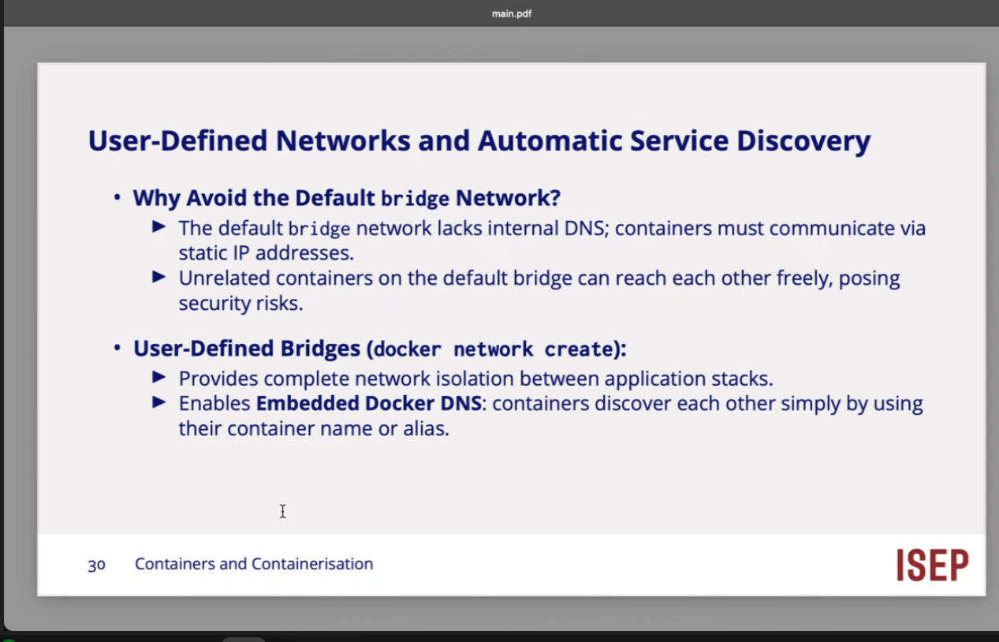

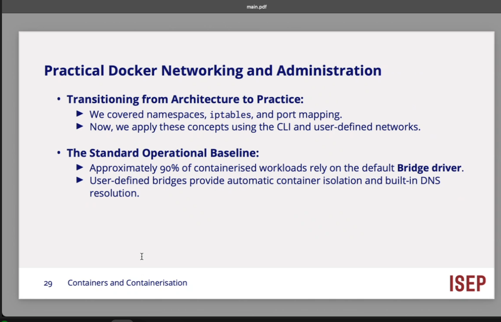

bridgespre definidas nao e bom, nao tem dns, os contentores tem usar dns fixoos/ 

o professor esta para aqui a explicar estesslides 

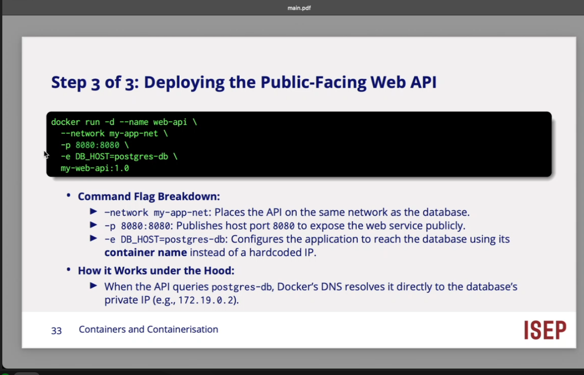

porto 8080 da muinha aplicacao tambem adiciona a rede ....

# Problema de seguranca

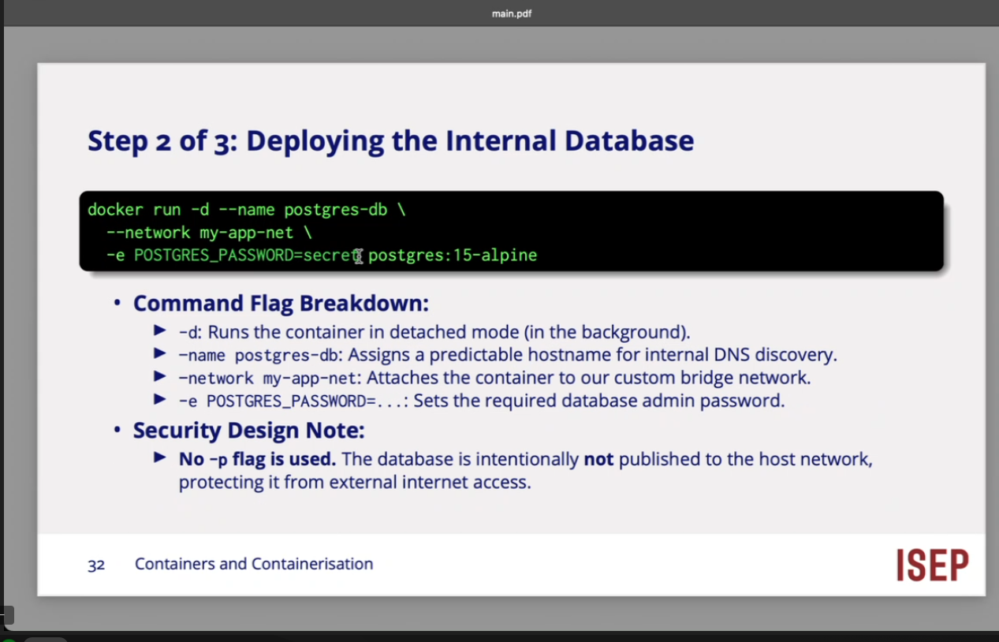

ha sepre problemas de manter algo secreto quando ponho la algo de configuracao !! 