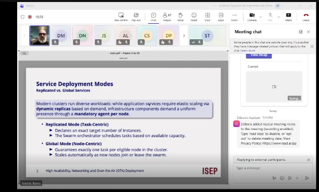
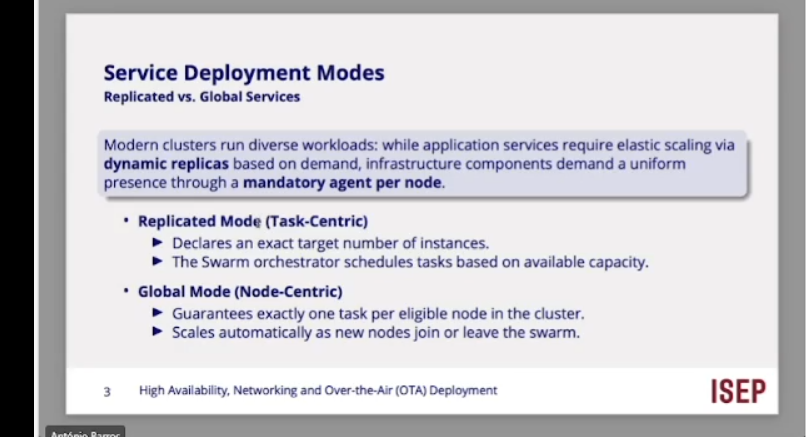
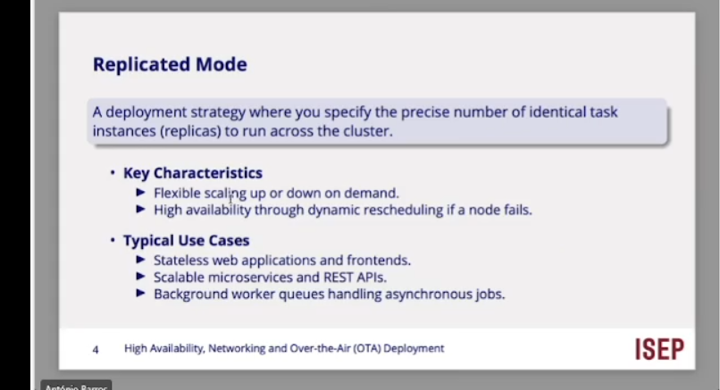
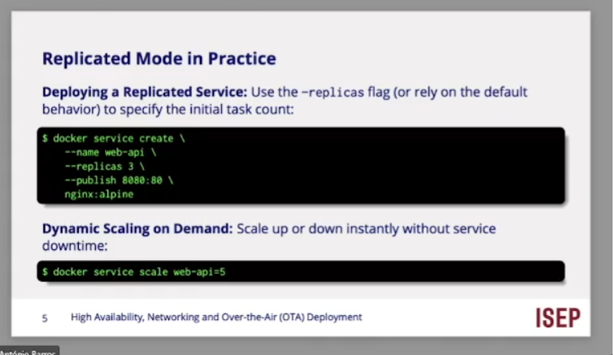
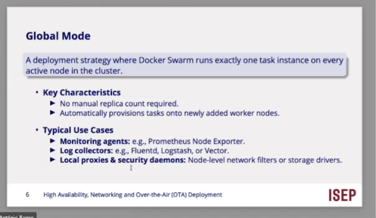
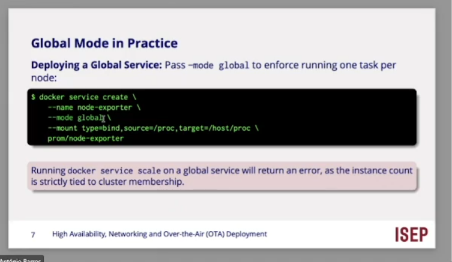
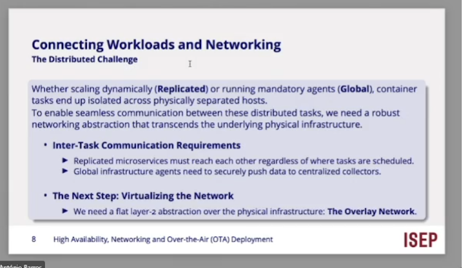
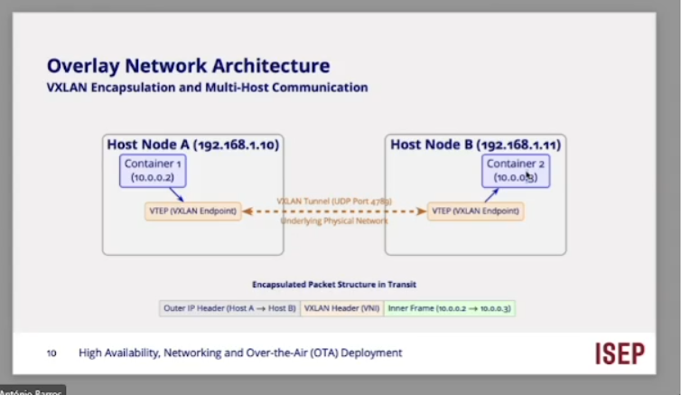

vamos ..

high availabilty, Networking and

mode centric o nodem temn de sert isto no modo global

modo replicado 

modo global:

docker 

docker service create...

se eu tiver varias instancias de ser vicos a acorrer em varios nos, o ser vvicoo A quer contactar o B, estao no mesmo no ou em nos diferentes, tenho um probelam que tenho de establecer uma rota...

abstacao da rede que u;l;trapasse a estrtutura fisica...

rede virtual dentro da mesma rede !!!

overlay Network..... rede de sovreposicao...

estrutura docker swarm.. rede virtual X...

cabecalho de rede fisica...

vlans, 5 contentores mas se os ocntentores estiverem ligados a redes distintas nao conseguem comunicar...

posso ter mais que uma rede virtual ...

o professor continua a explicar isto 

m,minuto 51 redes virtuais contentor s expansao, wait what...
