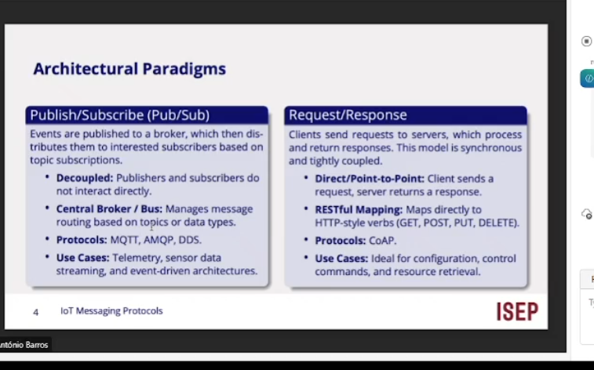
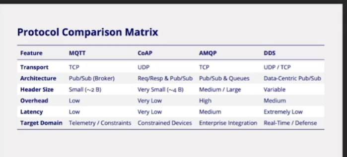

# Architectural Paradigms

Publish / subscribe | request / respoinse 

custos dos cabecalhos para o http,

CoAP consegue coexistir com http, conseguimos encaixar coApo no htttp ao contratrio ja nao conseguimos !!!

verifica se um evento e os dados desse evento sao publicados...

contexto -> broker... que erecebe e olha para notificacoes e entra agora ...

broker nem subrecritores e publicadores exite grande desacoplamento !!

DDS publish subrciribe diferente mqtt nao ha brokers...

diminui a latencia...

mqtt -> QoS...

CoAp -> exemplo tenho udp se o meu comando couber hnum pacote, quaklk e pior copis perder pacote...
