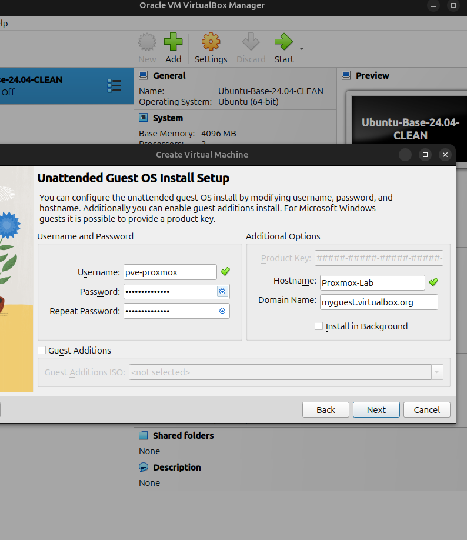

instalei pela virtual box com a iso o proxmox....



CHECKPOINT:
VirtualBox → Debian 13 instalado e funcional

PRÓXIMO:
1. corrigir /etc/hosts + IP
2. instalar SSH
3. configurar repo Proxmox VE 9
4. apt install proxmox-ve
5. reboot
6. https://IP:8006

# Setuo antigo de confiabilidade com PROXMOX


VM:      PVE-Confiabilidade-Ciberseguranca
ISO:     Proxmox VE
RAM:     ~15 GB
CPU:     4
Disk:    ~102 GB
EFI:     OFF
Dynamic: sim

# Proxmox VE 9.2 — Setup do Laboratório

## Opção escolhida

Para este laboratório optei por instalar o **Proxmox VE diretamente através da ISO oficial dentro de uma máquina virtual VirtualBox**.

Em vez de:

Ubuntu → VirtualBox → Debian → instalar Proxmox por pacotes

foi usado o modelo mais simples e mais próximo do laboratório anterior:

Ubuntu físico → VirtualBox → Proxmox VE

Assim, o Proxmox funciona como o sistema operativo principal da VM e é administrado através da interface Web.

## Configuração da VM

- Nome: `PVE-Confiabilidade-Ciberseguranca`
- ISO: `proxmox-ve_9.2-1.iso`
- Guest OS no VirtualBox: `Debian 12 Bookworm (64-bit)`
- RAM: ~14 GB
- CPU: 4 vCPU
- Disco: 100 GB dinâmico
- EFI: OFF
- Rede: NAT

O perfil `Debian 12` é apenas a configuração escolhida no VirtualBox. O sistema efetivamente instalado é o **Proxmox VE 9.2**.

## Rede do Proxmox

Durante a instalação:

Hostname:
`pve-lab.home.arpa`

IP:
`10.0.2.15/24`

Gateway:
`10.0.2.2`

DNS:
`10.0.2.3`

## Acesso ao Proxmox

Depois da instalação, o Proxmox apresenta a interface Web em:

`https://10.0.2.15:8006`

Como a VM está em modo NAT, foi criado um port forwarding no VirtualBox para conseguir aceder ao Proxmox diretamente pelo browser do Ubuntu físico:

```bash
VBoxManage controlvm "PVE-Confiabilidade-Ciberseguranca" natpf1 \
"pve,tcp,127.0.0.1,8006,10.0.2.15,8006"


Depois disso, no Ubuntu físico:

https://127.0.0.1:8006

Login:

User: root
Realm: Linux PAM standard authentication
Password: password definida durante a instalação
Arquitetura final

Ubuntu físico
↓
VirtualBox
↓
Proxmox VE 9.2
↓
VMs / LXC / Networking / Storage

A interface de administração do Proxmox é usada diretamente no browser do Ubuntu físico através de port forwarding da porta TCP 8006.

