> vamos seguir o pdf para Proxmox VE 9.2.0

O guiao diz que em PCE9 o SDN/DHCP ja vem integrado e nao e suposto instalar/desativar dnsmasq manualmente.

Regra importante , porque estou ligado remotamente por Tailscale: nao vamos alterar **vmbr0** , **gateway** ou **interface_fisica** do host as cegas. Podemos criar ZoneEdge, vnet_dmz e vnet_intra separadamente sem tocar no uplink. 

# Agora no pve-braganca -> Shell , exceuta

    pveversion
    ip -br addr
    ip route
    tailscale status
    grep -vE '^\s*#|^\s*$' /etc/network/interfaces


                        Internet
                       |
                     vmbr0
                       |
                 pve-braganca
                 Proxmox VE 9
                       |
                   ZoneEdge
                  /        \
           vnet_dmz       vnet_intra
         10.10.10.0/24   172.16.0.0/24
               |                |
          Ubuntu VM          Ubuntu LXC
             DHCP               DHCP


tenho agora : 

    PVE:        9.2.20
    Kernel:     7.0.14-19-pve
    vmbr0:      10.42.0.50/24
    gateway:    10.42.0.2
    uplink:     enx0050b6f9b6b0
    tailscale0: 100.92.1.95/32

> Aqui disee para tentar descobrir se o SDN esta ativo sem instalar dnsmasq manualmente, atrves de :

    pvesdn reload
    systemctl status pvesdn

# validar o SDN pela API do Proxmox

> pvesh get /cluster/sdn

Guião ≠ verdade absoluta da versão instalada.

PVE 9.2.20:
pvesdn command pode não existir.

Verificação prática:
pvesh get /cluster/sdn
→ testa a API SDN real do Proxmox.

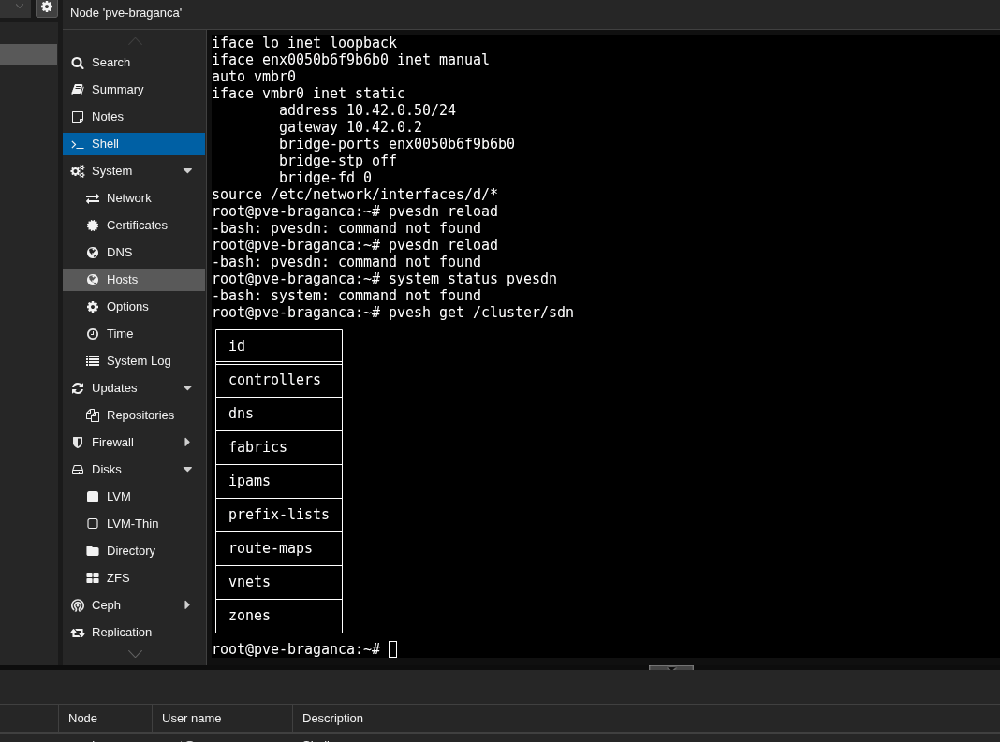

temos SDN e esta disponivel no meu PVE 9.2.20: a PI expoe ipams, vnets, zones, dns, etc. Portanto nao vamos instalar mais nada no host.

# Criar ZoneEdge

Na Web UI : 

**Datacenter -> SDN -> Zones -> Add -> Simple**


# Criar Vnets

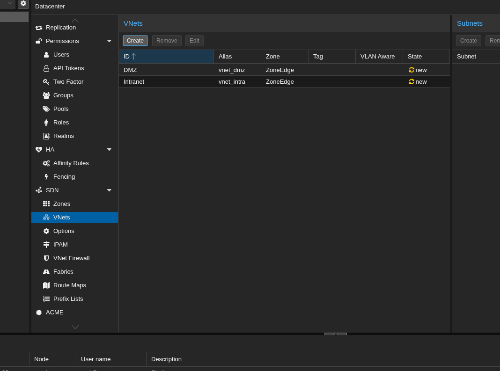

DMZ       → alias vnet_dmz   → ZoneEdge
Intranet  → alias vnet_intra → ZoneEdge


DMZ:
10.10.10.100 → 10.10.10.200

Intranet:
172.16.0.100 → 172.16.0.200

# Passoc C e D completos

DMZ
10.10.10.0/24
GW 10.10.10.1
DHCP 10.10.10.100–200
SNAT ✅

Intranet
172.16.0.0/24
GW 172.16.0.1
DHCP 172.16.0.100–200
SNAT ✅


# saber 

    Configurar SDN ≠ aplicar SDN

    Antes de Apply:
    config existe no Proxmox

    Depois de Apply:
    interfaces/VNETs passam a existir no Linux

# Clicar no apply

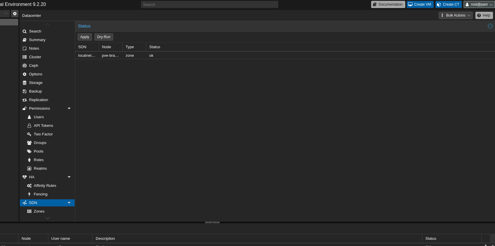

Ação
Como estás remoto por Tailscale, vamos evitar já um ifreload -a global. Sobe só a DMZ:
ifup DMZ
ip link show DMZ

# Supostamente

Apply → gera /etc/network/interfaces.d/sdn
ifup DMZ → materializa apenas a interface DMZ
ip link show DMZ → confirma existência no kernel


cat ficheiro
→ mostra o que está escrito

ifquery interface
→ mostra o que o ifupdown2 realmente interpretou


> o comando:

    ifquery -i /etc/network/interfaces.d/sdn DMZ

    funcionou 

    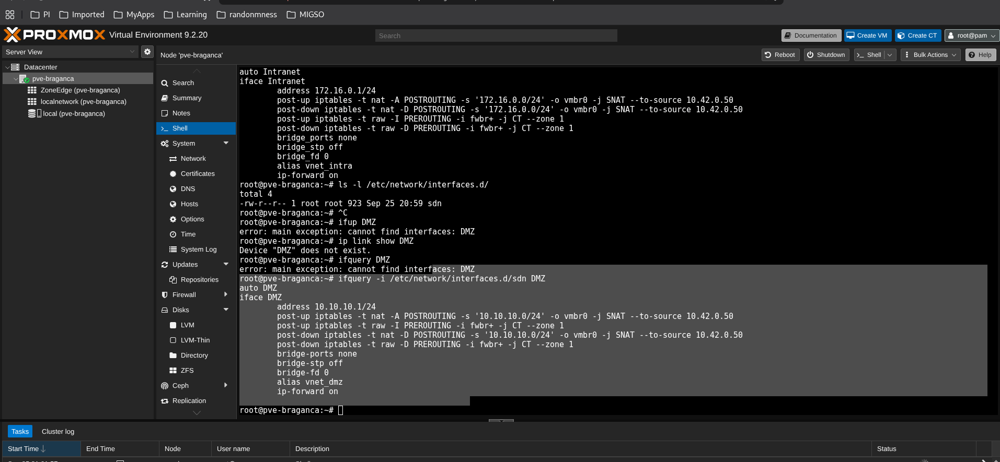

    🧠 Como pensar
Já isolámos o problema:
SDN compiler
    ↓
/etc/network/interfaces.d/sdn ✅
    ↓
source/importação             ❌ suspeita
    ↓
ifupdown2 não vê DMZ


>ifquery DMZ

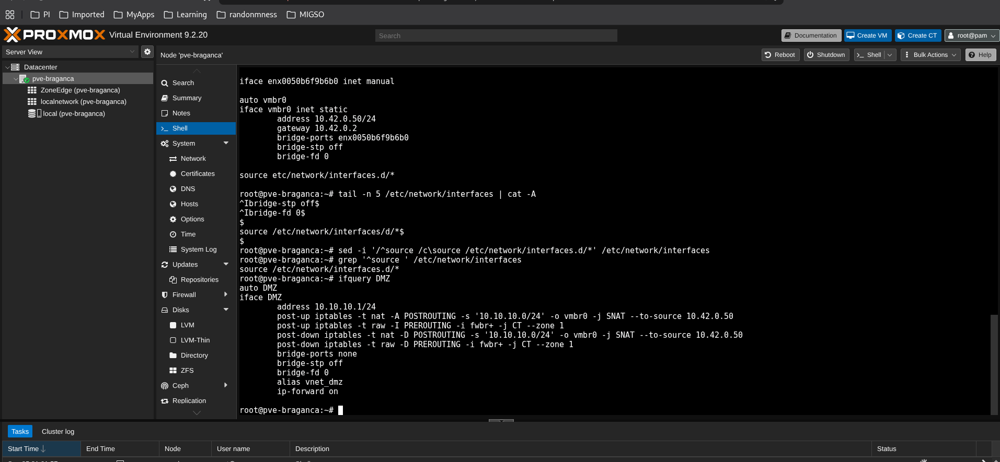

# Entende

Sim — vamos desmontar **uma única regra** porque aí está quase tudo o que precisas de perceber.

### Ação — lê esta regra como uma frase

```bash
iptables -t nat -A POSTROUTING \
  -s 10.10.10.0/24 \
  -o vmbr0 \
  -j SNAT \
  --to-source 10.42.0.50
```

Antes da explicação, **qual é a tua hipótese**: se uma VM `10.10.10.100` fizer `ping 8.8.8.8`, que IP achas que o router `10.42.0.2` vai ver como origem — `10.10.10.100` ou `10.42.0.50`?

A tradução da regra é:

```text
-t nat
→ trabalha na tabela NAT

-A POSTROUTING
→ aplica depois de o Linux decidir por onde o pacote vai sair

-s 10.10.10.0/24
→ apenas a pacotes vindos da rede DMZ

-o vmbr0
→ apenas quando vão sair pela bridge vmbr0

-j SNAT
→ alterar o Source IP

--to-source 10.42.0.50
→ substituir o source pelo IP do próprio Proxmox
```

No teu host, o caminho fica assim:

```text
VM
10.10.10.100
     |
     v
DMZ
10.10.10.1
     |
     v
Proxmox
     |
     | SNAT
     | 10.10.10.100 → 10.42.0.50
     v
vmbr0
10.42.0.50
     |
     v
Gateway
10.42.0.2
     |
     v
Internet
8.8.8.8
```

O guião pede precisamente **SNAT/Masquerade para permitir saída à Internet através de `vmbr0`**. :chatgpt-content-reference{index="0"}

### Porque é necessário?

O router `10.42.0.2` conhece a rede:

```text
10.42.0.0/24
```

mas provavelmente **não sabe onde está**:

```text
10.10.10.0/24
```

Sem NAT, receberia algo como:

```text
SRC = 10.10.10.100
DST = 8.8.8.8
```

e depois poderia não saber devolver a resposta para `10.10.10.100`.

Com SNAT:

```text
antes:
SRC 10.10.10.100 → DST 8.8.8.8

depois:
SRC 10.42.0.50 → DST 8.8.8.8
```

Para o router da tua casa, parece simplesmente que **o próprio Proxmox** está a comunicar com a Internet.

🧠 **Para o caderno:**

```text
POSTROUTING = pacote já sabe por onde vai sair
SNAT        = mudar Source Address
-o vmbr0    = sair por vmbr0
vmbr0       = bridge do Proxmox ligada à rede exterior
```

E no teu caso:

```text
DMZ      10.10.10.0/24
     ↓
Proxmox  10.42.0.50
     ↓ vmbr0
Router   10.42.0.2
     ↓
Internet
```

Agora responde só à pergunta inicial: **o router `10.42.0.2` vê `10.10.10.100` ou `10.42.0.50` como source?**

# QAUSE 

Quase — o erro principal é confundires **gateway** com **destination**.

### Ação
Pensa neste pacote:

```text
VM:
SRC = 10.10.10.100
DST = 8.8.8.8
```

Quando passa pelo Proxmox, a regra de **SNAT em POSTROUTING** altera apenas o **source**:

```text
antes do SNAT:
SRC = 10.10.10.100
DST = 8.8.8.8

depois do SNAT:
SRC = 10.42.0.50
DST = 8.8.8.8
```

O `10.42.0.2` é apenas o **gateway/router seguinte**, não é o destino final.

```text
10.10.10.100
      ↓
   Proxmox
SNAT → 10.42.0.50
      ↓
gateway 10.42.0.2
      ↓
    8.8.8.8
```

Portanto o router `10.42.0.2` vê:

```text
SRC = 10.42.0.50
DST = 8.8.8.8
```

É precisamente este SNAT/Masquerade para saída via `vmbr0` que a PL pretende testar. :chatgpt-content-reference{index="0"}

🧠 **Guarda no caderno:**

```text
gateway ≠ destination

Gateway = próximo salto
Destination = destino final do pacote

SNAT muda SOURCE
DNAT muda DESTINATION
```

**Mini-teste:** quando o `8.8.8.8` responder, para que IP achas que ele envia a resposta: `10.10.10.100` ou `10.42.0.50`?

> minha resposta

10.42.0.50 e depois o proxmox ira enviar para o 10.10.10.100

> outra pergunta

ifup DMZ
ip link show DMZ

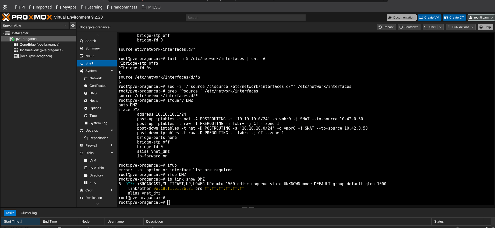


SNAT saída:
10.10.10.100 → 10.42.0.50

Resposta:
10.42.0.50 → 10.10.10.100

Quem mantém essa associação:
conntrack / estado NAT do kernel Linux

O guião pede precisamente a validação das interfaces VNET no host antes dos testes nos guests.     lab1

# Saber

ip link show
→ valida L2 / existência da interface

ip addr show
→ valida L3 / endereço IP da interface

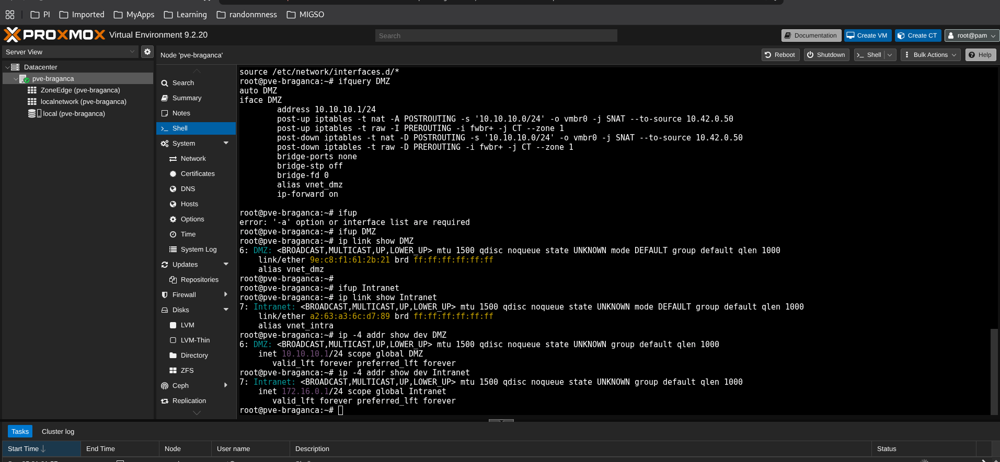

Perfeito. Agora tens a parte L2 + L3 da SDN confirmada:
DMZ
→ interface UP
→ 10.10.10.1/24 ✅

Intranet
→ interface UP
→ 172.16.0.1/24 ✅

Isto bate exatamente com os gateways definidos na PL para as duas subnets.

> para saber se iesta instalado dnsmasq

    dpkg 0l dnsmasq dnsmasq-base 2>/dev/null


    # PVE 8:
    dnsmasq + dnsmasq-utils + pve-sdn-plugins
    systemctl disable --now dnsmasq
    pvesdn reload

    PVE 9 segundo a PL:
    SDN/DHCP nativo
    não instalar esses pacotes manualmente
    validar subsistema


> para saber se os programas estao instalados

    apt-cache policy dnsmasq dnsmasq-utils

PVE 9:
pve-sdn-plugins → não existe neste host

DHCP backend:
dnsmasq
dnsmasq-utils

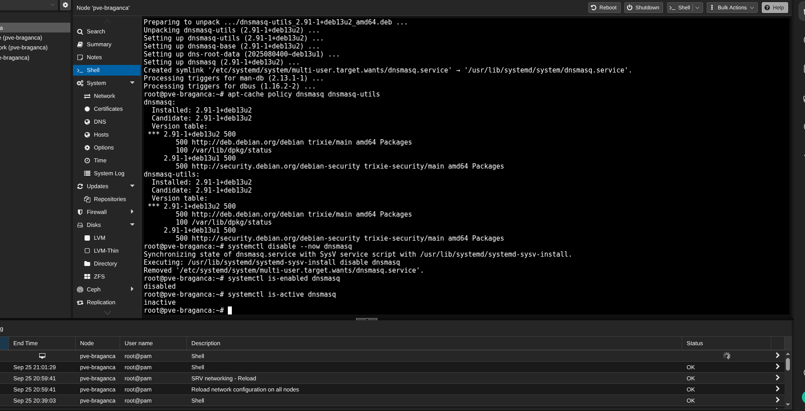

Objetivo
Ficar assim:
dnsmasq instalado           ✅
dnsmasq-utils instalado     ✅
dnsmasq global desligado    ✅

Proxmox SDN
    ↓
instância dedicada ZoneEdge
    ↓
DMZ / Intranet

---

🧠 Caderno: no PVE 9.2.20, a GUI apresenta Automatic DHCP, enquanto o guião usa a terminologia DHCP: dnsmasq. O conceito é o mesmo: associar o backend DHCP à zona SDN.

# wowow

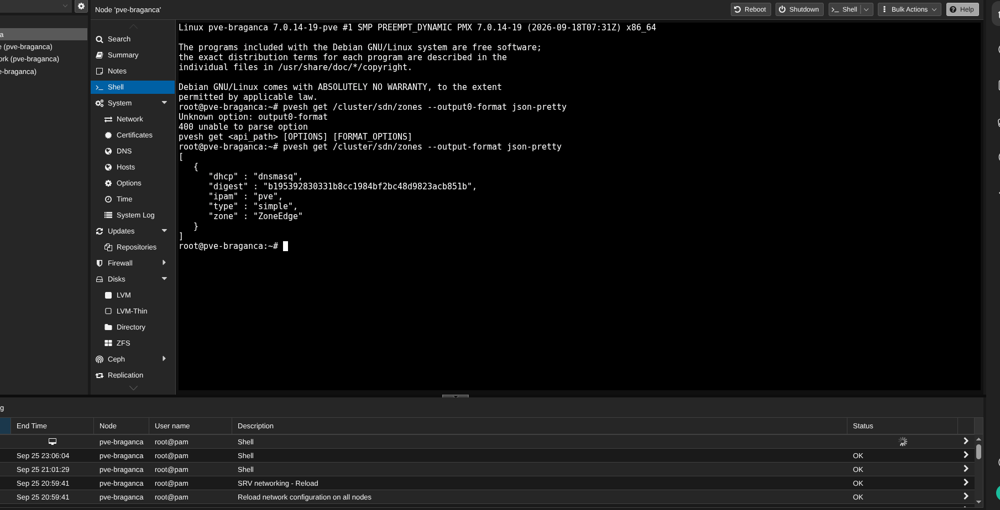

/etc/dnsmasq.d/ZoneEdge/
→ diretório de configuração da instância DHCP ZoneEdge

grep -R
→ procura dentro de todos os ficheiros dessa árvore

---

Boa — agora já conseguimos perceber **como o DHCP do Proxmox está realmente montado no PVE 9**. E há aqui uma diferença importante face ao que eu estava a assumir antes.

O output confirma:

```text
interface=DMZ
interface=Intranet
```

portanto a instância `dnsmasq` da `ZoneEdge` está ligada às **duas VNETs**. Também descobrimos o ficheiro real de leases nesta versão:

```text
/var/lib/misc/dnsmasq.ZoneEdge.leases
```

e não o caminho indicado no guião. O guião manda inspecionar os leases como parte do Teste 2, mas o caminho concreto difere no teu PVE 9.2.20. :chatgpt-content-reference{index="0"}

O ponto mais interessante é isto:

```text
dhcp-range=...10.10.10.0,static,...
dhcp-range=...172.16.0.0,static,...
```

Aqui `static` **não significa que tenhas de configurar manualmente `10.10.10.100` dentro da VM**. No modelo SDN/IPAM do Proxmox, o **IPAM escolhe/reserva um endereço para o guest**, associa-o ao MAC e o `dnsmasq` entrega depois essa reserva. O desenho do DHCP do Proxmox foi implementado precisamente com integração entre lifecycle do guest → IPAM → registo DHCP. :chatgpt-content-reference{index="1"}

Ou seja, conceptualmente:

```text
DHCP range 10.10.10.100–200
            ↓
       Proxmox IPAM
            ↓ escolhe IP
VM MAC ←→ 10.10.10.xxx
            ↓
         dnsmasq
            ↓
          guest
```

Portanto **não devemos editar estes ficheiros `10-DMZ.conf` manualmente**.

### Ação — confirmar os ranges no sítio certo

Agora corre só:

```bash
cat /etc/pve/sdn/subnets.cfg
```

### Objetivo

Aí é que espero encontrar algo equivalente a:

```text
dhcp-range start-address=10.10.10.100,end-address=10.10.10.200
```

e:

```text
dhcp-range start-address=172.16.0.100,end-address=172.16.0.200
```

A PL define exatamente essas duas gamas. :chatgpt-content-reference{index="2"}

🧠 **Caderno — importante:** `subnets.cfg` define o **pool disponível ao IPAM**; os ficheiros gerados em `/etc/dnsmasq.d/ZoneEdge/` representam a configuração operacional que o Proxmox entrega ao `dnsmasq`.

Faz só o `cat /etc/pve/sdn/subnets.cfg`.

---


Sim — **está certo**. ✅

No `Confirm` vejo o ponto crítico:

```text
net0: virtio,bridge=DMZ,firewall=1
```

Isto significa que a VM vai ficar ligada à **VNet DMZ**, que no teu Proxmox corresponde à rede que configurámos como `vnet_dmz`:

```text
VM ubuntu-dmz
      │
      └── VirtIO NIC
             │
             └── bridge/VNet: DMZ
                    │
                    └── 10.10.10.0/24
                        DHCP: 10.10.10.100–200
                        GW:   10.10.10.1
```

Também está coerente:

```text
VMID: 100
RAM: 2048 MiB
CPU: 1 core
Disk: 32 GiB
ISO: Ubuntu 24.04.5
```

O guião pede que a VM Ubuntu fique ligada à rede DMZ para depois validar DHCP e saída à Internet. :chatgpt-content-reference{index="0"}

### Ação

Agora podes clicar **Finish**.

Deixa `Start after created` **desmarcado** por enquanto.

Depois de a VM aparecer na árvore do Proxmox, o próximo passo é **Start → Console → instalar o Ubuntu**.

---

Exatamente 😄 — **é mesmo como instalar num PC físico com uma pen USB**.

Aqui a correspondência é:

```text
PC físico                 Proxmox VM
─────────                 ──────────
Pen USB com Ubuntu   ↔    ISO no CD/DVD virtual
SSD/HDD físico       ↔    Hard Disk scsi0
Retirar a pen        ↔    Desmontar a ISO
Reiniciar            ↔    Reboot da VM
```

E há uma coisa ainda melhor: **no teu screenshot a “pen virtual” já está retirada**. Repara:

```text
CD/DVD Drive (ide2)    none,media=cdrom
```

`none` = **nenhuma ISO montada** ✅

### Ação

Volta a **Console** e agora podes carregar:

```text
Reboot Now
```

Se aparecer:

```text
Please remove the installation medium, then press ENTER
```

carrega simplesmente **Enter**, porque o meio de instalação já está desmontado.

**Objetivo:** arrancar agora pelo:

```text
Hard Disk (scsi0)
    ↓
Ubuntu instalado
    ↓
login ubuntu-dmz
```

🧠 **Isto vale mesmo a pena guardar no caderno:** uma VM virtualiza inclusive este processo físico — BIOS/boot device, CD/DVD/ISO, disco, NIC, RAM, CPU. O SO guest comporta-se em grande parte como se estivesse numa máquina física.

---

🧠 Caderno: Booting from Hard Disk... é mensagem da BIOS virtual, não do Ubuntu. Se fica presa aí, o problema está antes do kernel Linux: normalmente bootloader/GRUB, modo BIOS/UEFI ou disco bootável.

---

🧠 Caderno: Booting from Hard Disk... significa que a BIOS já entregou o controlo ao disco; se daí não aparece GRUB/kernel, o diagnóstico desloca-se para MBR/GRUB/partições/bootloader, não para DHCP ou SDN.

---

APRENDE

rm ubuntu-22.04.5-live-server-amd64.iso
mv ubuntu-22.04.5-live-server-amd64.iso.1 ubuntu-22.04.5-live-server-amd64.iso

---

ubuntu-dmz
10.10.10.100
     │
     ▼
gateway SDN
10.10.10.1
     │
     ▼
Proxmox / SNAT
10.42.0.50
     │
     ▼
rede física / Internet

---

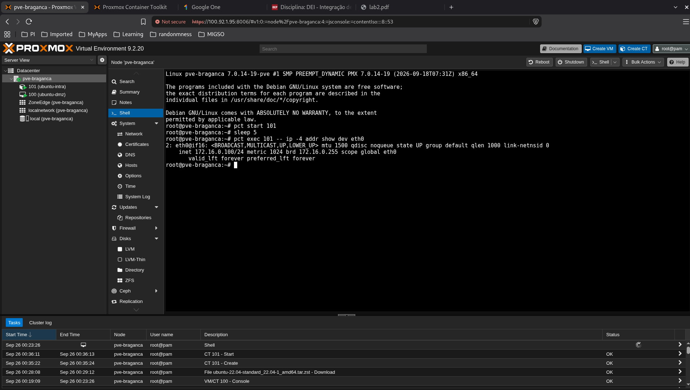

---

Depois disso passamos diretamente ao último bloco prático: DNAT / Port Forwarding 8080 → 10.10.10.100:80. O guião coloca precisamente a inspeção dos leases antes do DNAT.     lab1_integracao_servicos
🧠 Caderno: aqui estamos a provar que o dnsmasq gerido pela SDN entregou dinamicamente IPs a duas VNETs diferentes.

---

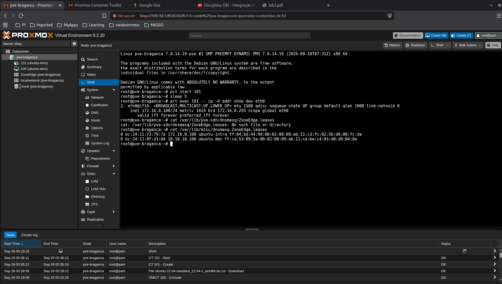


cat /var/lib/misc/dnsmasq.ZoneEdge.leases

---

Dentro da VM ubuntu-dmz, corre só:
ss -lntp | grep ':80'

Objetivo
- Se aparecer algo em :80 → seguimos imediatamente para a regra DNAT.
- Se não aparecer nada → instalamos um web server mínimo primeiro.
🧠 Caderno: DNAT pode estar perfeito e mesmo assim curl falhar se não houver nenhum processo a escutar na porta 80.
Faz só esse comando na VM e manda o output.

---

Ação — instalar um servidor web mínimo
Na VM ubuntu-dmz, corre:
sudo apt update && sudo apt install -y nginx

Objetivo
Depois o nginx deverá ficar a escutar em:
0.0.0.0:80

🧠 Caderno: antes de testar NAT/DNAT, confirma sempre primeiro que o serviço de destino existe e está listening na porta esperada.
Faz só isso e mostra-me o final do output.


ss -lntp | grep ':80'

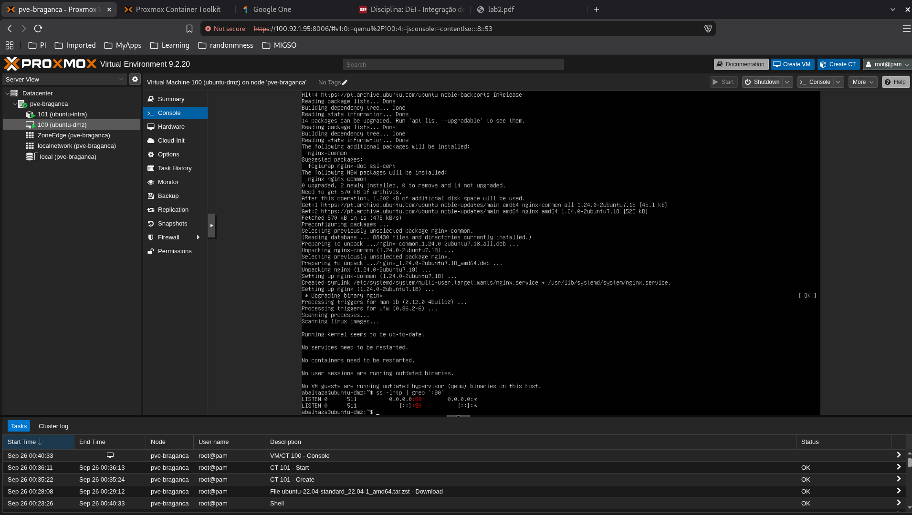