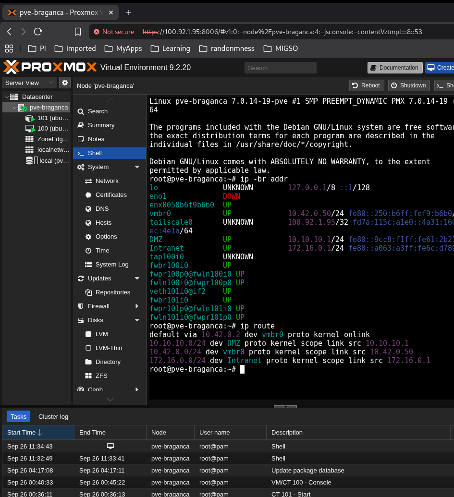
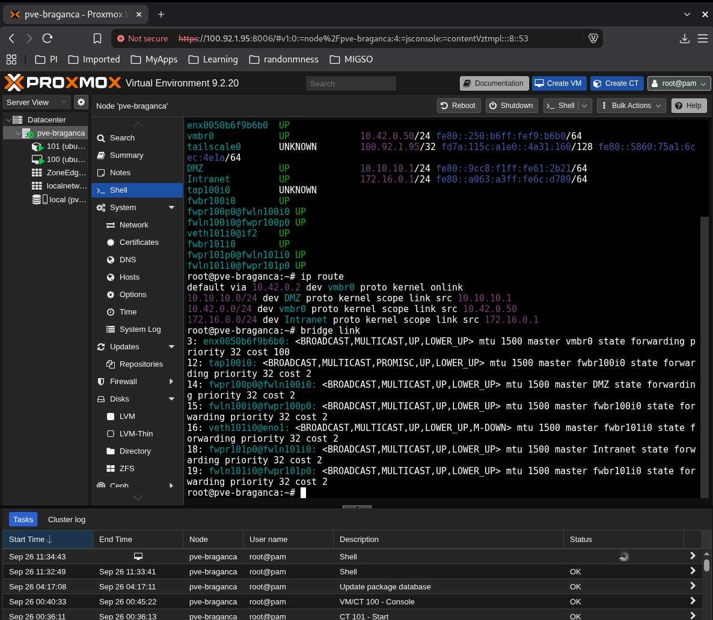

# Apontamentos aula pl2:

Single board computers como raspberry Pi ou NVIDIA jetson, a orquestracao tradicional do kubernetes (k8s) revela se frequentes inviavel devido ao elvado consumo de RAM. Nesse cenario usamos distribuicoes optimizadas e certificadas como k3s..

este guiao e para 4 horas duas este sabado outras duas no proximo sabado..

---

pve-manager/9.2.20
            ↑
      versão do Proxmox VE

running kernel: 7.0.14-19-pve
                ↑
         versão do kernel Linux

---

Ja o vmbr0 tem:

    10.42.0.50/24

e e esta bridge que nos interessa especialmente para a PL, porque o guiao pressupoe uma vmbr0 e ativa para ligar as VMs/LXC a rede.

# Modelo mental atual

teu PC
   │
   │ Tailscale
   ▼
100.92.1.95
tailscale0
   │
[PVE HOST: pve-braganca]
   │
 vmbr0 = 10.42.0.50/24
   │
   ├── VM 100
   └── LXC 101

> Agora queremos descobrir qual e a rota de saida normal do Proxmox: 

    ip route

R: Acho que a default route vai sair por vmbr0 pela bridge

    Qual interface transporta trafego para destinos que nao tem uma rota mais especifica? 

---

Internet / outras redes
        ↑
gateway 10.42.0.2
        ↑
      vmbr0
        ↑
pve-braganca

Isto é importante: tailscale0 serve-te para chegares remotamente ao Proxmox, mas não é a default route do host. O tráfego normal sai por vmbr0 para 10.42.0.2.
Onde estamos
[PVE HOST]
pve-braganca
   │
   ├── tailscale0 → administração remota
   │
   └── vmbr0 → 10.42.0.50/24
           │
           └── gateway 10.42.0.2

---

> A PL da grande importancia a perceber a sequencia interface fisica -> bridge Proxmox -> interface da VM/LXC -> Docker

# Agora falta descobrir:

    Que interface fisica esta ligada a vmbr0 ? 

isto confirma 

interface física
enx0050b6f9b6b0
        │
        ▼
      vmbr0
   10.42.0.50/24
        │
        ▼
 gateway 10.42.0.2

 Ou seja, vmbr0 nao e a placa fisica . E uma li nux bridge do Proxmox, e enx0050b6f9b6b0 e uma porta dessa bridge. E exatamente o mnodelo que queremos dominar na PL: interface fisica -> bridge Proxmox -> interfaces virtuais das VMs/LXCs. 

 tap100i0      master fwbr100i0
fwpr100p0...  master DMZ
veth101i0...  master fwbr101i0
fwpr101p0...  master Intranet

Isto ja mostra que os teus guests 100 e 101 estao envolvidos nas bridges DMZ e Intranet, com bridges intermedias fwbr.... criadas pelo firewall do Proxmox. Nao vamos desmontar isso tudo ainda...

    CONCEITO:
    Linux bridge no Proxmox

    MODELO MENTAL:
    NIC física → vmbr0 → vNIC da VM/LXC

    EVIDÊNCIA:
    enx0050b6f9b6b0 master vmbr0

O LXC deve ter **nesting=1** e **keyctl=1**, porque sem essas features o Docker pode falhar ao criar namespaces no kernel do host. 

---

Falha a traducao de nomes verificar como

    > getent hosts archive.ubuntu.com

> Falhou logo fazemos

    cat /etc/resolv.conf

